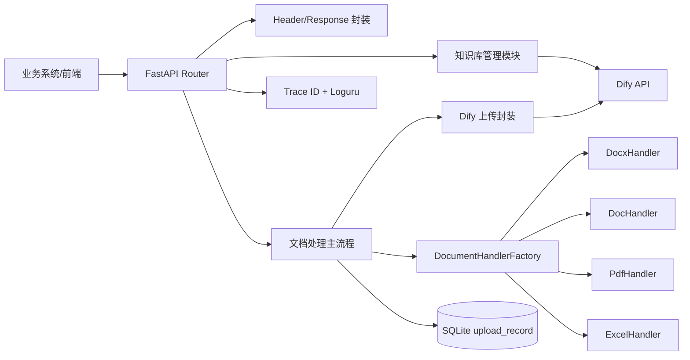
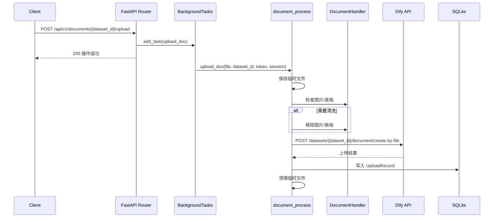

# Dify Repository Manager 项目文档

本文档基于当前代码实现整理，覆盖项目定位、功能方案、系统架构、接口设计、配置部署、数据模型、测试方式与后续优化建议。

## 1. 项目概述

`dify-repository-manager` 是一个面向 Dify 知识库的数据资产管理服务。项目使用 FastAPI 提供 HTTP 接口，核心能力是：

- 查询 Dify 知识库列表。
- 根据 URL 文件名过滤知识库中已存在的文档，返回仍需上传的文档 URL。
- 接收用户上传的文档文件，后台完成临时存储、图片和表格清理、格式转换、调用 Dify 文档上传接口。
- 记录每次上传结果到本地 SQLite 数据库。
- 提供 Trace ID 中间件和 Loguru 日志，便于定位请求链路。

当前项目更像一个 Dify 知识库上传代理服务，屏蔽了 Dify 原始 API 的部分细节，并在上传前增加了文档预处理能力。

## 2. 技术栈

| 类型 | 技术 |
| --- | --- |
| Web 框架 | FastAPI |
| ASGI 服务 | Uvicorn |
| 配置管理 | pydantic-settings |
| HTTP 客户端 | requests |
| 数据库 | SQLite |
| ORM | SQLModel |
| 文档处理 | python-docx、PyPDF2、pdfplumber、olefile、LibreOffice CLI |
| 日志 | loguru |
| 容器化 | Docker、docker-compose |
| Python 版本 | Python >= 3.11, < 4.0 |

## 3. 目录结构

```text
.
├── app
│   ├── api
│   │   └── api.py                         # Dify 上游 HTTP 请求封装
│   ├── common
│   │   ├── header.py                      # 通用请求头模型
│   │   └── response.py                    # 统一响应封装
│   ├── config
│   │   ├── app_config.py                  # 环境变量和默认配置
│   │   ├── engine.py                      # SQLite/SQLModel 配置和 UploadRecord 模型
│   │   ├── logger_config.py               # Loguru 日志配置
│   │   └── trace_middleware.py            # Trace ID 中间件
│   ├── datasets
│   │   └── datasets_manage.py             # Dify 知识库查询
│   ├── documents
│   │   ├── factory
│   │   │   └── document_factory.py        # 文档处理器工厂
│   │   ├── handlers                       # 不同文件类型处理器
│   │   ├── processing/core
│   │   │   └── document_process.py        # 文档过滤和上传主流程
│   │   └── upload.py                      # 调用 Dify create-by-file 上传
│   ├── routers
│   │   └── main.py                        # FastAPI 路由
│   └── utils
│       ├── request_util.py                # 请求上下文
│       └── utils.py                       # 文件名转换、文档转换等工具函数
├── db
│   └── database_db                        # SQLite 数据库文件
├── tests                                  # 单元测试和上传调用示例
├── Dockerfile
├── docker-compose.yml
├── pyproject.toml
└── requirements.txt
```

## 4. 功能方案

### 4.1 知识库列表查询

用户通过本服务传入 Dify API Key，本服务调用 Dify 上游 `/datasets` 接口，返回知识库 ID、名称和描述。

业务价值：

- 前端或其他业务系统无需直接关心 Dify API 地址。
- 统一返回结构，便于平台侧集成。

### 4.2 待上传文档过滤

用户提交一批文档 URL，本服务会：

1. 通过 Dify `/datasets/{dataset_id}/documents` 分页查询知识库已有文档。
2. 将传入 URL 转换为文件名。
3. 去除扩展名后，与 Dify 已有文档名比对。
4. 返回知识库中不存在的 URL 列表。

当前比对规则：

- URL 文件名取最后一个 `/` 后的内容。
- 比对时去掉扩展名。
- 只按文件名判断是否已存在，不校验文件 hash、内容版本或更新时间。

适用场景：

- 批量上传前做去重。
- 前端展示哪些文件需要上传。

### 4.3 文档上传与预处理

用户上传单个文件后，接口立即返回成功，实际上传逻辑放入 FastAPI `BackgroundTasks` 后台执行。

处理流程：

1. 将上传文件保存到 `TEMP_DIR`。
2. 根据文件扩展名选择文档处理器。
3. 检查文档是否包含图片或表格。
4. 如果需要处理，则移除图片和表格，生成处理后的临时文件。
5. 调用 Dify `/datasets/{dataset_id}/document/create-by-file` 上传文件。
6. 写入 `upload_record` 表。
7. 删除本次请求产生的临时文件。
8. 如果失败，将错误文件保存到 `TEMP_DIR/error_files`，并记录错误信息。

支持的文件类型：

| 文件类型 | Handler | 当前能力 |
| --- | --- | --- |
| `.docx` | `DocxHandler` | 检查并尝试移除图片和表格 |
| `.doc` | `DocHandler` | 通过 LibreOffice 转为 docx 后复用 docx 处理逻辑 |
| `.pdf` | `PdfHandler` | 当前不检查图片和表格，上传前处理能力较弱 |
| `.csv` | `ExcelHandler` | 当前不做清洗处理 |
| `.xlsx` | `ExcelHandler` | 当前不做清洗处理 |

### 4.4 上传索引策略

上传到 Dify 时，会构造 `process_rule`，主要配置来自环境变量：

- 索引方式：`INDEXING_TECHNIQUE`
- 文档形式：`DOC_FORM`
- 处理规则模式：`MODE`
- 清洗规则：`REMOVE_EXTRA_SPACES`、`REMOVE_URLS_EMAILS`
- 分段规则：`SEPARATOR`、`MAX_TOKENS`
- 父子分段规则：`PARENT_MODE`、`SUBCHUNK_SEGMENTATION_SEPARATOR`、`SUBCHUNK_SEGMENTATION_MAX_TOKENS`、`CHUNK_OVERLAP`

当 `DOC_FORM=hierarchical_model` 时，会额外写入父子分段配置。

## 5. 系统架构

### 5.1 逻辑架构



### 5.2 上传时序



## 6. 接口设计

### 6.1 通用约定

服务默认端口：`8088`

通用请求头：

| Header | 必填 | 说明 |
| --- | --- | --- |
| `Authorization` | 是 | Dify API Key。当前代码会在调用 Dify 时拼接 `Bearer {Authorization}`，所以建议传入纯 token，不要带 `Bearer ` 前缀。 |
| `X-Trace-ID` | 否 | 请求链路 ID；不传时服务端自动生成 UUID，并在响应头返回。 |

通用响应结构：

```json
{
  "code": 200,
  "msg": "操作成功",
  "data": {}
}
```

错误响应结构：

```json
{
  "code": 500,
  "msg": "操作失败",
  "data": null
}
```

### 6.2 健康检查

```http
GET /
```

响应：

```json
{
  "Hello": "World"
}
```

说明：

- `docker-compose.yml` 的 healthcheck 使用该接口。

### 6.3 查询知识库列表

```http
GET /datasets
Authorization: <dify_api_key>
```

处理逻辑：

- 调用 Dify `GET /datasets?page=1&limit=100`。
- 返回每个知识库的 `id`、`name`、`description`。

成功响应示例：

```json
{
  "code": 200,
  "msg": "操作成功",
  "data": [
    {
      "id": "dataset_id",
      "name": "知识库名称",
      "description": "知识库描述"
    }
  ]
}
```

缺少 Authorization 时：

```json
{
  "code": 400,
  "msg": "Field required",
  "data": null
}
```

### 6.4 过滤待上传文档

```http
POST /api/v1/data_asset/{dataset_id}/documents
Authorization: <dify_api_key>
Content-Type: application/json
```

路径参数：

| 参数 | 类型 | 必填 | 说明 |
| --- | --- | --- | --- |
| `dataset_id` | string | 是 | Dify 知识库 ID |

请求体：

```json
[
  "https://example.com/files/a.docx",
  "https://example.com/files/b.pdf"
]
```

处理逻辑：

- 查询 Dify 知识库已有文档。
- 将 URL 转成文件名。
- 去掉扩展名后和已有文档名称比对。
- 返回未上传 URL 列表。

成功响应示例：

```json
{
  "code": 200,
  "msg": "操作成功",
  "data": [
    "https://example.com/files/b.pdf"
  ]
}
```

注意事项：

- 当前函数在 `urls` 为空时会抛出 `ValidationError`，建议后续改成明确的 400 响应。
- 只按文件名去重，不保证内容层面的幂等。

### 6.5 上传文档

```http
POST /api/v1/documents/{dataset_id}/upload
Authorization: <dify_api_key>
Content-Type: multipart/form-data
```

路径参数：

| 参数 | 类型 | 必填 | 说明 |
| --- | --- | --- | --- |
| `dataset_id` | string | 是 | Dify 知识库 ID |

表单参数：

| 参数 | 类型 | 必填 | 说明 |
| --- | --- | --- | --- |
| `file` | file | 是 | 待上传文档 |

成功响应示例：

```json
{
  "code": 200,
  "msg": "操作成功",
  "data": null
}
```

说明：

- 接口返回成功只代表后台任务已提交，不代表 Dify 上传已经完成。
- 上传结果和错误信息会写入本地 `upload_record` 表。
- 当前没有提供查询上传记录的 HTTP 接口。

curl 示例：

```bash
curl -X POST "http://localhost:8088/api/v1/documents/<dataset_id>/upload" \
  -H "Authorization: <dify_api_key>" \
  -F "file=@/path/to/file.docx"
```

## 7. 上游 Dify API 依赖

本服务通过 `BASE_URL` 拼接上游 Dify API 地址，当前使用到的上游接口：

| 本服务场景 | Dify 接口 |
| --- | --- |
| 查询知识库列表 | `GET /datasets` |
| 查询知识库文档 | `GET /datasets/{dataset_id}/documents` |
| 上传文档 | `POST /datasets/{dataset_id}/document/create-by-file` |

上游认证方式：

```http
Authorization: Bearer <token>
```

## 8. 配置说明

配置由 `app/config/app_config.py` 的 `FileUploadConfig` 管理，可通过环境变量或 `.env` 注入。

### 8.1 基础配置

| 环境变量 | 默认值 | 说明 |
| --- | --- | --- |
| `BASE_URL` | 空字符串 | Dify API 基础地址，例如 `http://dify-api:5001/v1` |
| `TEMP_DIR` | `./temp/` | 上传临时文件目录 |
| `TEMP_PROCESS_DIR` | `./temp/process/` | 处理后文件目录 |
| `ENV` | 未设置 | 等于 `production` 时会额外输出错误 JSON 日志 |

### 8.2 Dify 索引配置

| 环境变量 | 默认值 | 说明 |
| --- | --- | --- |
| `INDEXING_TECHNIQUE` | `high_quality` | 索引方式，可选 `high_quality`、`economy` |
| `DOC_FORM` | `text_model` | 文档索引形式，可选 `text_model`、`hierarchical_model`、`qa_model` |
| `MODE` | `automatic` | 处理规则模式，可选 `automatic`、`custom` |
| `REMOVE_EXTRA_SPACES` | `true` | 是否去除多余空格 |
| `REMOVE_URLS_EMAILS` | `true` | 是否去除 URL 和邮箱 |
| `SEPARATOR` | `\n` | 分段分隔符 |
| `MAX_TOKENS` | `1000` | 最大 token 长度 |

### 8.3 父子分段配置

| 环境变量 | 默认值 | 说明 |
| --- | --- | --- |
| `PARENT_MODE` | 空字符串 | 父段模式，例如 `full-doc`、`paragraph` |
| `SUBCHUNK_SEGMENTATION_SEPARATOR` | 空字符串 | 子段分隔符 |
| `SUBCHUNK_SEGMENTATION_MAX_TOKENS` | `1000` | 子段最大 token |
| `CHUNK_OVERLAP` | `100` | 子段重叠 token |

### 8.4 检索配置

以下配置当前定义在配置类中，但当前上传实现未写入 Dify 请求体，可作为后续扩展基础：

| 环境变量 | 默认值 | 说明 |
| --- | --- | --- |
| `SEARCH_METHOD` | `hybrid_search` | 检索方法 |
| `RERANKING_ENABLE` | `true` | 是否开启 reranking |
| `TOP_K` | `5` | 返回 top k |
| `SCORE_THRESHOLD_ENABLED` | `true` | 是否开启召回分数限制 |
| `SCORE_THRESHOLD` | `0.5` | 召回分数限制 |
| `RERANKING_PROVIDER_NAME` | 空字符串 | Rerank 模型供应商 |
| `RERANKING_MODEL_NAME` | 空字符串 | Rerank 模型名称 |
| `EMBEDDING_MODEL` | 空字符串 | Embedding 模型名称 |
| `EMBEDDING_MODEL_PROVIDER` | 空字符串 | Embedding 模型供应商 |

### 8.5 `.env` 示例

```env
BASE_URL=http://localhost:5001/v1
INDEXING_TECHNIQUE=high_quality
DOC_FORM=text_model
MODE=automatic
REMOVE_EXTRA_SPACES=true
REMOVE_URLS_EMAILS=true
SEPARATOR=\n
MAX_TOKENS=1000
TEMP_DIR=./temp/
TEMP_PROCESS_DIR=./temp/process/
```

## 9. 数据库设计

当前使用 SQLite，数据库文件路径：

```text
db/database_db
```

应用启动时通过 FastAPI lifespan 调用 `SQLModel.metadata.create_all(engine)` 自动创建表。

### 9.1 upload_record

| 字段 | 类型 | 说明 |
| --- | --- | --- |
| `id` | string | 主键，UUID |
| `file_name` | string | 上传文件名或处理后文件名 |
| `file_path` | string | 文件路径；成功时通常是处理后的临时路径，失败时是错误文件保存路径 |
| `dataset_id` | string | Dify 知识库 ID |
| `error_message` | string/null | 错误信息，成功时为空 |
| `created_at` | datetime | 创建时间 |

注意：

- 成功上传后临时文件会被删除，所以 `file_path` 可能只保留当时的处理路径，不保证文件长期存在。
- 失败文件会保存在 `TEMP_DIR/error_files`，用于后续排查。

## 10. 日志与链路追踪

### 10.1 Trace ID

`TraceIdMiddleware` 会：

- 从请求头读取 `X-Trace-ID`。
- 如果没有传入，则生成 UUID。
- 将 Trace ID 写入请求上下文。
- 在响应头返回 `X-Trace-ID`。

### 10.2 日志输出

日志配置在 `app/config/logger_config.py`：

- 控制台输出 INFO 及以上日志。
- 文件输出到 `logs/app-YYYY-MM-DD.log`。
- 日志保留 30 天。
- `ENV=production` 时额外输出 error JSON 日志。

## 11. 本地运行

### 11.1 使用 pip

```bash
python3.11 -m venv .venv
source .venv/bin/activate
pip install -r requirements.txt
uvicorn main:app --host 0.0.0.0 --port 8088
```

访问：

```text
http://localhost:8088
```

接口文档：

```text
http://localhost:8088/docs
```

### 11.2 使用 Poetry

```bash
poetry install
poetry run uvicorn main:app --host 0.0.0.0 --port 8088
```

### 11.3 使用 Docker Compose

```bash
docker compose up --build
```

服务端口：

```text
http://localhost:8088
```

### 11.4 LibreOffice 依赖

`.doc` 转 `.docx` 依赖 LibreOffice CLI：

- macOS: `/Applications/LibreOffice.app/Contents/MacOS/soffice`
- Linux: `/usr/bin/libreoffice`
- Windows: `C:\Program Files\LibreOffice\program\soffice.exe`

Dockerfile 使用的基础镜像为：

```text
kerui1/python-libreoffice:3.11
```

因此容器内理论上已经包含 LibreOffice。

## 12. 测试

当前测试位于 `tests/`，主要覆盖：

- UUID 生成。
- 文档 Handler 行为。
- URL 转文件名。
- LibreOffice 路径探测。
- 上传请求示例。

运行方式：

```bash
pytest
```

或：

```bash
python -m unittest discover tests
```

当前测试代码存在一些路径 patch 与实际模块路径不一致的问题，例如 `app.common.utils` 与实际 `app.utils.utils` 不一致，后续建议修正后再作为 CI 门禁。

## 13. 当前实现约束

1. 上传接口是后台任务，HTTP 200 不代表 Dify 上传成功。
2. 目前没有上传任务状态查询接口。
3. Authorization 建议传纯 token，不建议传 `Bearer token`。
4. 文件去重仅按文件名，不按 hash。
5. `.pdf`、`.csv`、`.xlsx` 的图片/表格清洗能力当前较弱或未实现。
6. `ExcelHandler.remove_images_and_tables` 当前为空实现，如果未来检测逻辑返回 True，会导致后续流程拿不到有效处理文件。
7. 上传成功记录中的 `file_path` 多数情况下对应临时文件路径，文件会在 finally 中删除。
8. 当前 `BASE_URL` 默认为空，未配置时所有上游请求都会失败。
9. 上传失败时保存错误文件，但没有错误文件下载或重试接口。
10. `max_request_size` 传给 FastAPI 构造函数，但 FastAPI 本身不直接使用该参数限制请求体大小，实际大小限制需要通过 ASGI Server、反向代理或自定义中间件实现。

## 14. 后续优化建议

### 14.1 接口层

- 增加上传任务 ID，并返回异步任务状态。
- 增加上传记录查询接口。
- 增加失败文件重试接口。
- 对 `Authorization` 兼容纯 token 和 `Bearer token`。
- 对空 URL、空文件、不支持文件格式等场景返回标准 4xx 响应。

### 14.2 文档处理

- 完善 PDF 图片和表格检测、清洗策略。
- 完善 Excel 文件处理逻辑。
- 修复 `.docx` 清洗逻辑中 `Document` 修改后保存对象不一致的问题。
- 为每类 Handler 增加真实样例文件测试。
- 使用文件 hash 辅助去重和版本判断。

### 14.3 稳定性

- Dify 上游请求增加超时时间和重试策略。
- 后台任务改为队列，例如 Celery、RQ 或 Dramatiq，避免进程重启导致任务丢失。
- 对大文件上传使用流式处理，减少内存占用。
- 数据库从 SQLite 切换到 PostgreSQL 或 MySQL，适配多实例部署。

### 14.4 可观测性

- 上传记录中增加 Dify 返回文档 ID、批次 ID、状态码、耗时。
- 日志中统一输出 dataset_id、file_name、trace_id。
- 增加 Prometheus 指标，例如上传成功数、失败数、处理耗时、文件大小。

### 14.5 安全

- 避免在日志中输出敏感 token。
- 对上传文件大小和扩展名做显式校验。
- 对临时目录进行隔离，避免同名文件覆盖。
- 错误文件长期保存时增加清理策略和访问控制。

## 15. 建议的演进接口

以下接口当前尚未实现，适合后续迭代：

### 15.1 查询上传记录

```http
GET /api/v1/upload-records?dataset_id=<dataset_id>&page=1&page_size=20
```

响应建议：

```json
{
  "code": 200,
  "msg": "操作成功",
  "data": {
    "items": [
      {
        "id": "record_id",
        "file_name": "demo.docx",
        "dataset_id": "dataset_id",
        "status": "success",
        "error_message": null,
        "created_at": "2026-06-05T10:00:00"
      }
    ],
    "total": 1,
    "page": 1,
    "page_size": 20
  }
}
```

### 15.2 查询上传任务状态

```http
GET /api/v1/upload-tasks/{task_id}
```

响应建议：

```json
{
  "code": 200,
  "msg": "操作成功",
  "data": {
    "task_id": "task_id",
    "status": "processing",
    "file_name": "demo.docx",
    "dataset_id": "dataset_id",
    "error_message": null
  }
}
```

### 15.3 重试失败上传

```http
POST /api/v1/upload-records/{record_id}/retry
Authorization: <dify_api_key>
```

响应建议：

```json
{
  "code": 200,
  "msg": "操作成功",
  "data": {
    "task_id": "new_task_id"
  }
}
```

## 16. 验收清单

项目基础验收建议：

- `GET /` 返回 `{"Hello": "World"}`。
- 配置正确 `BASE_URL` 后，`GET /datasets` 能返回 Dify 知识库列表。
- 上传 `.docx` 文件后，后台任务能调用 Dify 上传成功，并写入 `upload_record`。
- 上传异常时，错误文件被保存到 `temp/error_files`。
- 响应头包含 `X-Trace-ID`。
- 日志文件写入 `logs/app-YYYY-MM-DD.log`。
- Docker Compose 启动后 healthcheck 通过。

