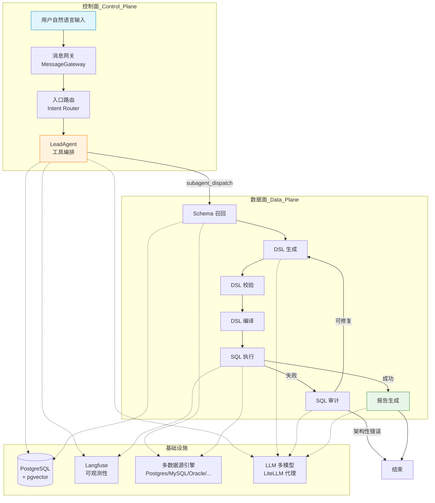
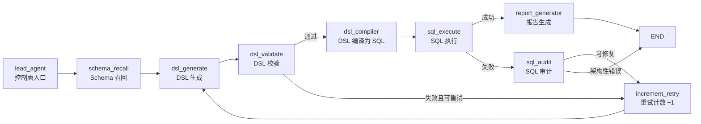

Datalogue（数语）是一个 **AI 原生的智能问数平台**——用户只需用自然语言描述分析需求，系统即可自动完成语义理解、查询规划、SQL 生成与执行、以及最终报告产出的完整链路。平台以 **NL2DSL2SQL** 管道为设计主轴，在自然语言和结构化查询之间引入一层领域中间表示（DSL），从而在保证 LLM 灵活性的同时，实现对指标、维度、业务术语和分析蓝图等语义资产的精确治理。

## 平台定位与核心价值

该平台并非传统的 BI 工具或数据可视化层，而是一个连接"业务提问"与"数据查询"的**语义代理层**。其核心价值体现在三个维度：

| 维度 | 传统 BI / SQL 客户端 | Datalogue |
|------|----------------------|-----------|
| 交互方式 | 拖拽式配置或手写 SQL | 自然语言描述需求 |
| 语义理解 | 依赖预定义模型和固定映射 | LLM 驱动的动态语义匹配与推理 |
| 查询生成 | 人工编写或模板拼装 | DSL 中间表示 + 编译到多方言 SQL |
| 数据源支持 | 通常绑定单一数据源类型 | 统一适配 PostgreSQL、MySQL、Oracle、Hive、ClickHouse、BigQuery 等 |
| 错误恢复 | 人工排查 SQL 报错 | Agent 级 SQL 审计与自动修复重试 |
| 多轮对话 | 无状态或简单缓存 | 胶囊化上下文持久化、追问识别与增量解析 |

**最核心的设计决策**是：平台在 LLM 的自由生成能力和企业数据治理的刚性约束之间，插入了一层结构化 DSL（领域特定语言）作为契约。DSL 携带了指标、维度、过滤条件、时间范围等明确的资产引用，使得 SQL 编译成为确定性过程，而非 LLM 的黑箱输出。

Sources: [README.md](README.md#L1-L18)

---

## 系统架构总览

从宏观看，Datalogue 的请求处理链路分为 **两大平面**：

- **控制面 (Control Plane)**：由 LeadAgent 主导，负责会话管理、数据集路由、时间解析、schema 新鲜度检查、工具规划与 SubAgent 调度。控制面不接触语义层内部资产（如指标、维度、术语），只维护"选哪个数据集、执行什么工具"的决策逻辑。
- **数据面 (Data Plane)**：由 LangGraph 工作流驱动，在选定数据集范围内执行 Schema 召回 → DSL 生成 → DSL 校验 → DSL 编译 → SQL 执行 → SQL 审计 → 报告生成的端到端链路。



控制面的 LeadAgent 通过 **Skill（技能）→ Tool Call（工具调用）** 两层规划来决定下一步动作。Skill 是"能力描述"（如时间理解、数据集路由、SubAgent 委托），Tool Call 是"可执行指令"。LLM Planner 在 ToolPolicy 的严格约束下输出工具调用计划，LeadAgent 据此执行并将上下文注入数据面。

Sources: [app/graph/workflow.py](app/graph/workflow.py#L1-L219) | [app/services/lead_agent.py](app/services/lead_agent.py#L1-L100) | [app/graph/state.py](app/graph/state.py#L1-L118)

---

## 核心技术栈

| 层级 | 技术 | 角色 |
|------|------|------|
| Web 框架 | FastAPI + Uvicorn | REST API 与 SSE 流式响应 |
| ORM / 迁移 | SQLAlchemy 2.0 + Alembic | 数据持久化与版本迁移 |
| 主数据库 | PostgreSQL 16 + pgvector | 结构化存储 + 向量检索 |
| Agent 框架 | LangGraph 0.0.65 | 有状态工作流编排与条件路由 |
| LLM 接入 | LangChain + LiteLLM | 多模型统一代理与降级 |
| Query 解析 | SQLGlot 30.9 | SQL 方言解析、重写与守卫 |
| 可观测性 | Langfuse SDK v4 | Trace / Span / Generation 全链路追踪 |
| 测试 | pytest + pytest-asyncio | 异步测试与会话级 SQLite 隔离 |
| 代码质量 | Black + Ruff + mypy | 格式化、Lint 与类型检查 |
| 容器化 | Docker Compose | PostgreSQL + Langfuse 全家桶一键启动 |

Sources: [pyproject.toml](pyproject.toml#L1-L78) | [docker-compose.yml](docker-compose.yml#L1-L154)

---

## NL2DSL2SQL 管道：从自然语言到结构化查询

这是平台最核心的处理链路，由 LangGraph 状态图驱动。整条链路接收一个 `AgentState` 字典并在节点间传递和增量更新，最终产出可读的回答和完整的执行轨迹。

### 管道节点序列



九个节点各司其职：

- **lead_agent**：控制面入口节点。本身为 noop（空操作），但保留在图中以确保 LeadAgent 工具执行过程能产生 SSE 事件供前端消费。实际的路由决策（如是否需要 Schema 召回、是否命中蓝图直接执行）由前置的 `route_query_intent` 完成并写入 `entry_route`。

- **schema_recall**：从数据集的语义层配置中组装问数上下文。将指标定义、维度映射、业务术语、DDL 结构、查询约束（默认时间范围和 LIMIT）打包为结构化描述文本，注入 AgentState 供下游节点使用。

- **dsl_generate**：调用 LLM 将自然语言问题 + Schema 上下文转换为结构化 DSL JSON（v2 资产引用格式）。DSL 中引用指标、维度、字段时携带 `asset_id` 和 `confidence`，使得后续 SQL 编译可以精确映射到物理表列。

- **dsl_validate**：对 LLM 输出的 DSL 进行结构校验——检查必填字段完整性、资产引用合法性、过滤条件操作符与值类型匹配等。校验失败时进入重试循环（最多 3 次）。

- **dsl_compiler**：将校验通过的 DSL 编译为目标数据源的方言 SQL。根据数据源类型（PostgreSQL/MySQL/Oracle/ClickHouse 等）选择合适的方言适配规则，同时应用查询约束（时间范围、LIMIT）。

- **sql_execute**：通过 SQLAlchemy 引擎在目标数据源上执行编译后的 SQL。执行前经过 SQL 守卫（sql_guard）的静态安全检查——仅允许 SELECT 语句、限定授权表范围、阻止危险操作。

- **sql_audit**：SQL 执行失败时，由 LLM 分析错误原因并尝试生成修复方案。区分 **fixable**（字段拼写错误、别名冲突等可自动修复）和 **architectural**（表不存在、权限不足等需用户介入）两类错误。

- **report_generator**：将查询结果（columns + rows）转换为自然语言回答。支持表格、摘要、趋势描述等多种输出格式，同时生成回答解释包（含置信度、SQL 摘要、风险提示）。

- **increment_retry**：纯逻辑节点，重试计数器 +1 后回到 dsl_generate。

Sources: [app/graph/nodes.py](app/graph/nodes.py#L1-L80) | [app/graph/workflow.py](app/graph/workflow.py#L1-L219) | [app/graph/state.py](app/graph/state.py#L1-L118)

---

## DSL 中间表示：自然语言与 SQL 之间的结构化契约

DSL（Domain Specific Language）是 Datalogue 架构中最关键的抽象层。它不直接暴露给用户，而是作为 LLM 生成和 SQL 编译之间的桥梁。

v2 版本的 DSL 采用**资产引用**模式——指标、维度、字段、术语、蓝图都通过结构化对象引用，而非纯文本字符串。每个资产引用对象包含：

| 字段 | 类型 | 说明 |
|------|------|------|
| `name` | string | 资产名称（稳定标识） |
| `asset_type` | enum | `term` / `metric` / `dimension` / `column` / `field` / `blueprint` |
| `asset_id` | int | 资产在数据库中的主键，用于精确定位 |
| `display_name` | string | 前端展示名称 |
| `confidence` | float | LLM 匹配置信度（0-1） |
| `reason` | string | LLM 匹配理由，供审计和调试 |

一条完整的 DSL 还包含 `filters`（过滤条件，支持 eq/in/gt/lt/between 等操作符）、`time_range`（时间范围）、`order_by`（排序）、`limit`（返回行数限制）以及 `ambiguities`（歧义信息，供前端展示候选和澄清）。系统同时支持旧版字符串 DSL 到 v2 格式的兼容转换。

Sources: [app/schemas/dsl.py](app/schemas/dsl.py#L1-L231)

---

## 项目结构：模块分工一览

```
datalogue-api/
├── app/
│   ├── main.py                  # FastAPI 应用入口，生命周期管理
│   ├── api/                     # REST API 路由层（8 个路由模块）
│   │   ├── chat.py              # 流式问数 SSE 端点（核心，3400+ 行）
│   │   ├── conversation.py      # 对话 CRUD
│   │   ├── dataset.py           # 数据集与语义资产管理
│   │   ├── datasource.py        # 数据源连接管理
│   │   ├── llm.py               # LLM 模型配置
│   │   ├── messages.py          # 消息反馈与标注
│   │   ├── observability.py     # 可观测性查询
│   │   ├── artifacts.py         # 查询产物管理
│   │   └── internal_subagent.py # 内部 SubAgent A2A 端点
│   ├── core/                    # 基础设施层
│   │   ├── config.py            # 全量配置定义（160+ 项）
│   │   ├── database.py          # SQLAlchemy 引擎与 Session
│   │   ├── security.py          # AES 加密与 Token
│   │   └── logging.py           # 带颜色的日志系统
│   ├── models/                  # SQLAlchemy ORM 模型
│   │   ├── datasource.py        # 数据源元数据
│   │   ├── dataset.py           # 语义数据集全家桶（指标/维度/术语/蓝图/Manifest）
│   │   ├── conversation.py      # 对话/消息/产物/诊断
│   │   └── llm.py               # 模型配置与角色绑定
│   ├── schemas/                 # Pydantic 请求/响应校验
│   ├── services/                # 业务逻辑层（20+ 服务模块）
│   │   ├── lead_agent.py        # LeadAgent 控制面编排（2600+ 行）
│   │   ├── dataset_subagent.py  # DatasetSubAgent 门面（2100+ 行）
│   │   ├── runner.py            # SubAgent 双模运行器（进程内 + 远程）
│   │   ├── subagent_fanout.py   # 多数据集并发编排
│   │   ├── datasource.py        # 多数据源引擎（900 行）
│   │   ├── dataset_context.py   # 问数上下文组装
│   │   ├── report_generation.py # 报告生成
│   │   ├── answer_explanation.py # 回答解释
│   │   ├── multiturn_context.py # 多轮上下文构建
│   │   ├── conversation_store.py # 会话锁与状态管理
│   │   ├── message_gateway.py   # 消息事件分类
│   │   ├── analysis_blueprint.py # 分析蓝图执行
│   │   ├── task_capsule.py      # 查询胶囊持久化
│   │   ├── artifact_store.py    # 查询产物存储
│   │   ├── observability/       # Langfuse 追踪集成
│   │   └── subagent_planning/   # SubAgent 查询规划
│   ├── graph/                   # LangGraph 工作流定义
│   │   ├── state.py             # AgentState 全局状态契约
│   │   ├── workflow.py          # 图装配与条件路由
│   │   ├── nodes.py             # 9 个核心节点实现（2900+ 行）
│   │   └── llm.py               # LLM 实例工厂
│   ├── prompts/                 # 提示词模板
│   └── utils/                   # 工具函数（SQL 守卫、方言适配、JSON 解析等）
├── alembic/                     # 数据库迁移脚本（25+ 个版本）
├── tests/                       # pytest 测试套件（50+ 测试文件）
├── scripts/                     # 种子数据、评估、离线部署脚本
├── docker-compose.yml           # 本地开发全家桶
└── pyproject.toml               # 项目元数据与工具配置
```

Sources: [app/main.py](app/main.py#L1-L61) | [app/api/__init__.py](app/api/__init__.py#L1-L29) | [app/models/__init__.py](app/models/__init__.py#L1-L72)

---

## 控制面与数据面的双层解耦

### 控制面：LeadAgent

LeadAgent 是用户输入的第一站，但它**不接触任何语义层内部资产**（指标、维度、术语、蓝图、字段定义）。它只负责控制面的六个核心能力：

| Skill | 对应工具 | 职责 |
|-------|---------|------|
| TimeUnderstandingSkill | `time` | 解析用户问题中的时间线索，输出标准化时间上下文 |
| ConversationContinuitySkill | `thread_context` | 处理会话上下文、显式数据集锁定、多轮状态继承 |
| DatasetRoutingSkill | `manifest_router` + `clarification` | 选择或确认候选数据集；必要时生成澄清问题 |
| SchemaFreshnessSkill | `schema_status` | 检查 Manifest 绑定的 schema 是否过期（stale） |
| SubAgentDelegationSkill | `subagent_dispatch` | 判断问题是否可以委托给 SubAgent 执行 |
| AuditSkill | `audit_trace` | 记录工具规划与执行轨迹 |

LeadAgent 通过两层 LLM 调用来决策：**Skill Selector**（选择本轮需要的技能）→ **Tool Planner**（规划具体的工具调用序列）。整个规划过程受 `ToolPolicy` 的严格约束——blocked_tools 中的工具即使被 LLM 规划也不能执行。

### 数据面：SubAgent + LangGraph

当 LeadAgent 确定数据集并执行 `subagent_dispatch` 后，控制权移交给数据面。每个数据集对应一个独立的 SubAgent 实例，执行完整的 NL2DSL2SQL 管道。对于多数据集场景，系统通过 **Fan-Out 编排器**并发调度多个 SubAgent，结果聚合后统一输出。

Sources: [app/services/lead_agent.py](app/services/lead_agent.py#L1-L2623) | [app/services/runner.py](app/services/runner.py#L1-L200) | [app/services/subagent_fanout.py](app/services/subagent_fanout.py#L1-L80)

---

## 语义层治理：数据集、指标、维度与蓝图

语义层是 Datalogue 实现"精确问数"的治理基石。它由以下资产类型构成：

| 资产类型 | 模型 | 说明 |
|---------|------|------|
| 数据集 (Dataset) | `SemanticDataset` | 绑定一个数据源，选择一组表，定义问数边界 |
| 指标 (Metric) | `SemanticMetric` | 可量化的计算表达式（如 `SUM(amount)`），含同义词、格式 |
| 维度 (Dimension) | `SemanticDimension` | 分组或过滤视角（如 `region`、`product_category`） |
| 业务术语 (Business Term) | `BusinessTerm` | 业务概念的标准化定义，含同义词与资产关联 |
| 分析蓝图 (Blueprint) | `AnalysisBlueprint` | 预定义的分析场景模板，含参数化 SQL 和执行计划 |
| 源表 (Source Table) | `SourceTable` + `DatasetSourceTable` | 数据集的物理表授权范围 |
| 验证案例 (Validation Case) | `SemanticValidationCase` | 语义正确性验证用例 |
| Manifest | `DatasetSubAgentManifest` | 数据集级的 SubAgent 配置快照，含 schema 版本绑定 |

在 v2 架构中，系统通过 **渐进式资产注入 (Progressive Asset Integration)** 策略在 LeadAgent 规划阶段就引入候选资产（指标/维度/术语/字段/表/蓝图），使得 Planner 在工具规划时即可感知语义层内容，减少后续的来回通信。每种资产类型有独立的 Top-K 限制和置信度阈值，全局还有 Token 预算控制。

Sources: [app/models/dataset.py](app/models/dataset.py#L1-L80) | [app/core/config.py](app/core/config.py#L93-L130)

---

## 多轮对话与状态管理

平台支持复杂的多轮对话场景：用户可以基于上一轮查询结果继续追问、修改条件、切换视角。核心机制包括：

- **QueryTaskCapsule**：每轮查询的输出胶囊，包含 DSL、SQL、执行结果、时间上下文等完整信息。序列化后持久化到数据库，供下一轮上下文合并使用。
- **MultiturnContextBuilder**：多轮上下文构建器，识别本轮是"新查询"还是"追问"，执行时间增量解析、条件合并与胶囊拼接。
- **ConversationStore**：会话级锁管理（防止并发写冲突）、消息压缩（Token 预算控制）与线程状态维护。
- **MessageGateway**：用户输入事件分类器，在进入 LeadAgent 之前识别早退路由（如存档请求、简单澄清回复等），避免不必要的 LLM 调用。

Sources: [app/graph/state.py](app/graph/state.py#L30-L55) | [app/services/multiturn_context.py](app/services/multiturn_context.py) | [app/services/conversation_store.py](app/services/conversation_store.py)

---

## 多数据源连接引擎

数据面通过统一的数据源抽象层连接不同类型的数据库，支持以下方言：

| 数据源 | 方言 | 驱动 | 说明 |
|--------|------|------|------|
| PostgreSQL | `postgresql` | psycopg2 | 默认支持，含 pgvector |
| MySQL | `mysql` | pymysql | 默认支持 |
| SQLite | `sqlite` | sqlite3 | 测试环境使用 |
| Oracle | `oracle` | oracledb | 企业版依赖 |
| Hive | `hive` | PyHive | 企业版依赖 |
| Trino / Presto | `trino` / `presto` | trino / PyHive | 企业版依赖 |
| ClickHouse | `clickhouse` | clickhouse-driver | 企业版依赖 |
| BigQuery | `bigquery` | sqlalchemy-bigquery | 企业版依赖 |
| SQL Server | `mssql` | pyodbc | 企业版依赖 |

每个数据源的能力通过 `DatasourceCapability` 数据类注册，包含方言类型、驱动模块、Schema 探查能力和字段样例采集能力。连接测试和错误诊断通过统一的 `DatasourceDiagnostic` 结构返回，支持可重试性判断和修复建议。

Sources: [app/services/datasource.py](app/services/datasource.py#L1-L80) | [app/models/datasource.py](app/models/datasource.py#L1-L41) | [pyproject.toml](pyproject.toml#L46-L56)

---

## 可观测性与 LLM 基础设施

### Langfuse 全链路追踪

平台集成了 Langfuse v4 SDK，实现 Trace → Span → Generation 三级追踪：

- **Trace**：一次完整的用户请求
- **Span**：工作流节点执行（如 `schema_recall`、`dsl_generate`、`sql_execute`）或 SubAgent 调用
- **Generation**：每次 LLM 调用的输入/输出、Token 用量、延迟

追踪数据异步上报到 Langfuse 服务，支持环境变量开关（`LANGFUSE_ENABLED`）、采样率控制（`LANGFUSE_SAMPLE_RATE`）和 Prompt 版本管理（`LANGFUSE_PROMPT_LABEL`）。

### LLM 多模型配置

系统通过 LiteLLM 代理层统一接入多种 LLM 提供商（OpenAI、MiniMax 等），支持按**任务角色**绑定模型——例如，路由分类用轻量模型、SQL 生成用强推理模型、报告生成用长文本模型。数据库中的 `LLMModelConfig` 和 `LLMRoleBinding` 表存储配置，前端"系统设置"可动态管理；未配置时回退到 `.env` 环境变量中的兜底模型。

Sources: [app/core/config.py](app/core/config.py#L36-L50) | [app/models/llm.py](app/models/llm.py) | [docs/LiteLLM多模型接入说明.md](docs/LiteLLM多模型接入说明.md)

---

## 本地开发环境

项目通过 Docker Compose 提供一键启动的完整开发环境，包含六个服务：

| 服务 | 镜像 | 端口 | 用途 |
|------|------|------|------|
| `db` | pgvector/pgvector:pg16 | 5432 | 主数据库（含 pgvector 向量扩展） |
| `langfuse-web` | langfuse/langfuse:3 | 3000 | Langfuse Web UI |
| `langfuse-worker` | langfuse/langfuse-worker:3 | - | Langfuse 后台任务处理 |
| `langfuse-clickhouse` | clickhouse/clickhouse-server | 8123/9000 | 分析数据存储 |
| `langfuse-minio` | minio/minio | 9090 | S3 兼容对象存储 |
| `langfuse-redis` | redis:7 | 6380 | 缓存与队列 |

启动后的典型工作流：`docker compose up -d` → `alembic upgrade head` → `uvicorn app.main:app --reload` → 访问 `http://localhost:8000/docs` 查看自动生成的 API 文档。

Sources: [docker-compose.yml](docker-compose.yml#L1-L154) | [README.md](README.md#L19-L52)

---

## 阅读指引

本文档是 Datalogue 知识体系的入口。根据你的角色和兴趣，建议按以下路径继续探索：

**如果你是初次接触平台的新开发者：**
1. → [快速开始：环境搭建与首次运行](2-kuai-su-kai-shi-huan-jing-da-jian-yu-shou-ci-yun-xing) — 动手跑起来
2. → [核心概念：数据集、指标、维度与语义层治理](3-he-xin-gai-nian-shu-ju-ji-zhi-biao-wei-du-yu-yu-yi-ceng-zhi-li) — 理解数据治理模型
3. → [API 路由总览：数据源、数据集、对话与问数端点](4-api-lu-you-zong-lan-shu-ju-yuan-shu-ju-ji-dui-hua-yu-wen-shu-duan-dian) — 掌握外部接口

**如果你想深入理解核心管道：**
1. → [NL2DSL2SQL 处理管道：从自然语言到结构化查询的端到端链路](5-nl2dsl2sql-chu-li-guan-dao-cong-zi-ran-yu-yan-dao-jie-gou-hua-cha-xun-de-duan-dao-duan-lian-lu)
2. → [AgentState 状态定义：LangGraph 工作流全局传递的数据契约](6-agentstate-zhuang-tai-ding-yi-langgraph-gong-zuo-liu-quan-ju-chuan-di-de-shu-ju-qi-yue)
3. → [DSL 中间表示：v2 资产引用 Schema 设计与规范化](8-dsl-zhong-jian-biao-shi-v2-zi-chan-yin-yong-schema-she-ji-yu-gui-fan-hua)

**如果你想了解 SubAgent 查询规划系统：**
1. → [LeadAgent 工具编排：技能选择、工具规划与路由决策](9-leadagent-gong-ju-bian-pai-ji-neng-xuan-ze-gong-ju-gui-hua-yu-lu-you-jue-ce)
2. → [DatasetSubAgent 门面：LeadAgent 与语义层之间的隔离边界](18-datasetsubagent-men-mian-leadagent-yu-yu-yi-ceng-zhi-jian-de-ge-chi-bian-jie)
3. → [查询规划器：Planner 决策、Detail Loop 与降级策略](17-cha-xun-gui-hua-qi-planner-jue-ce-detail-loop-yu-jiang-ji-ce-lue)