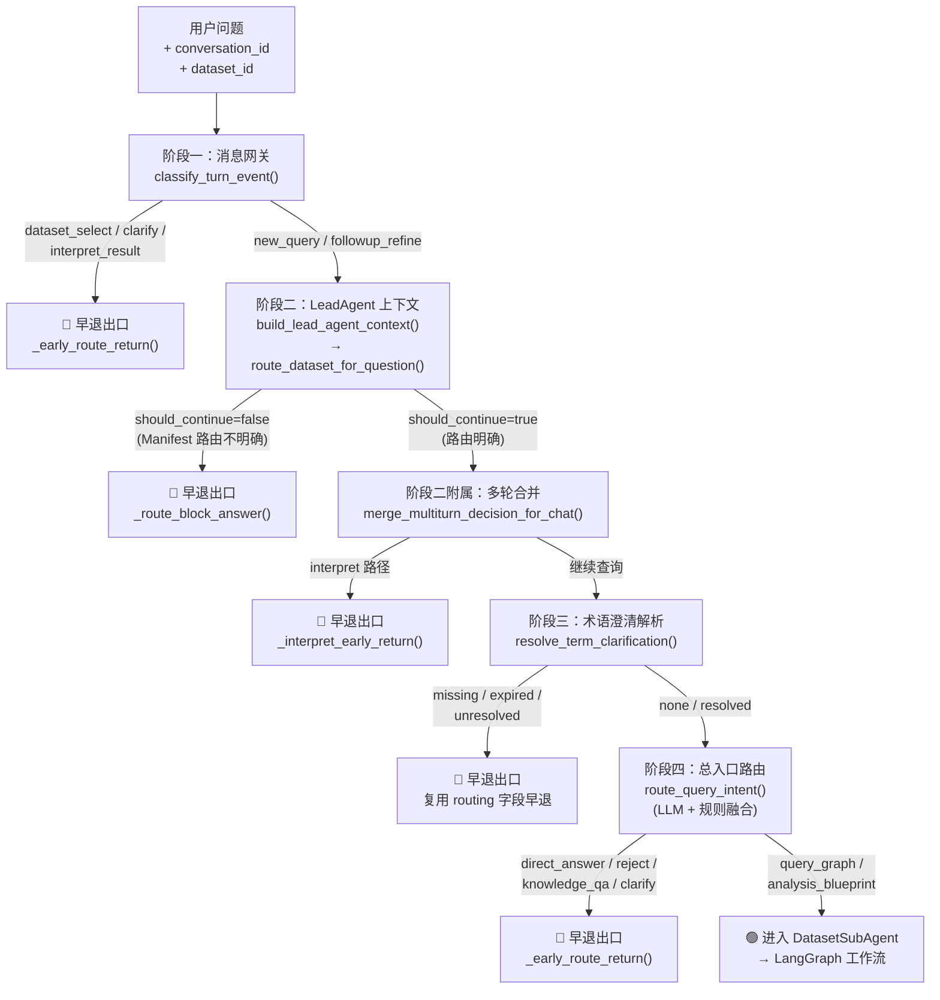
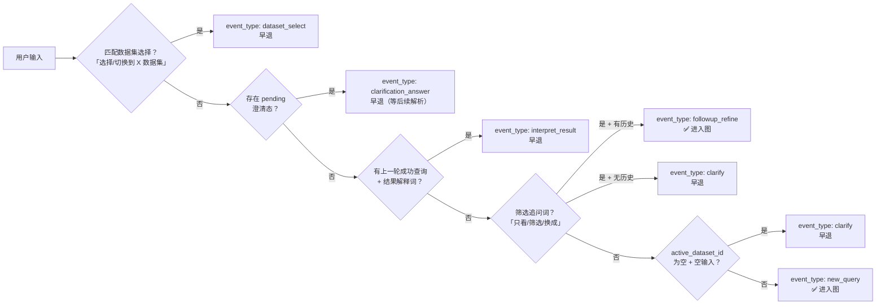
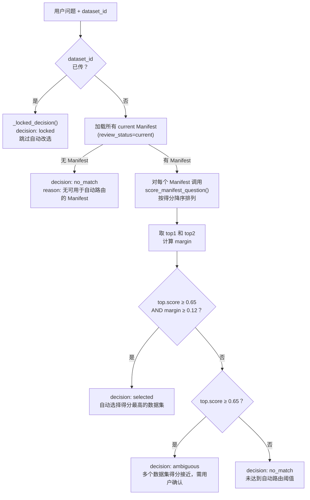
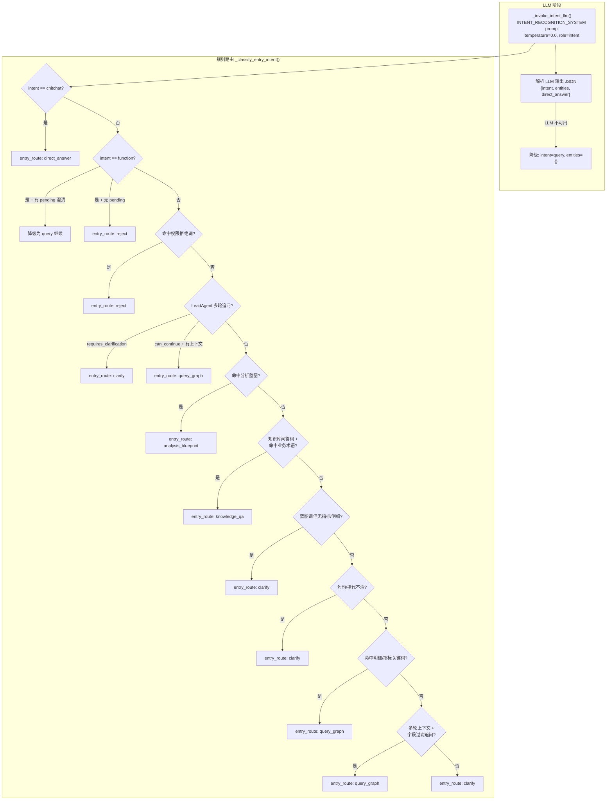
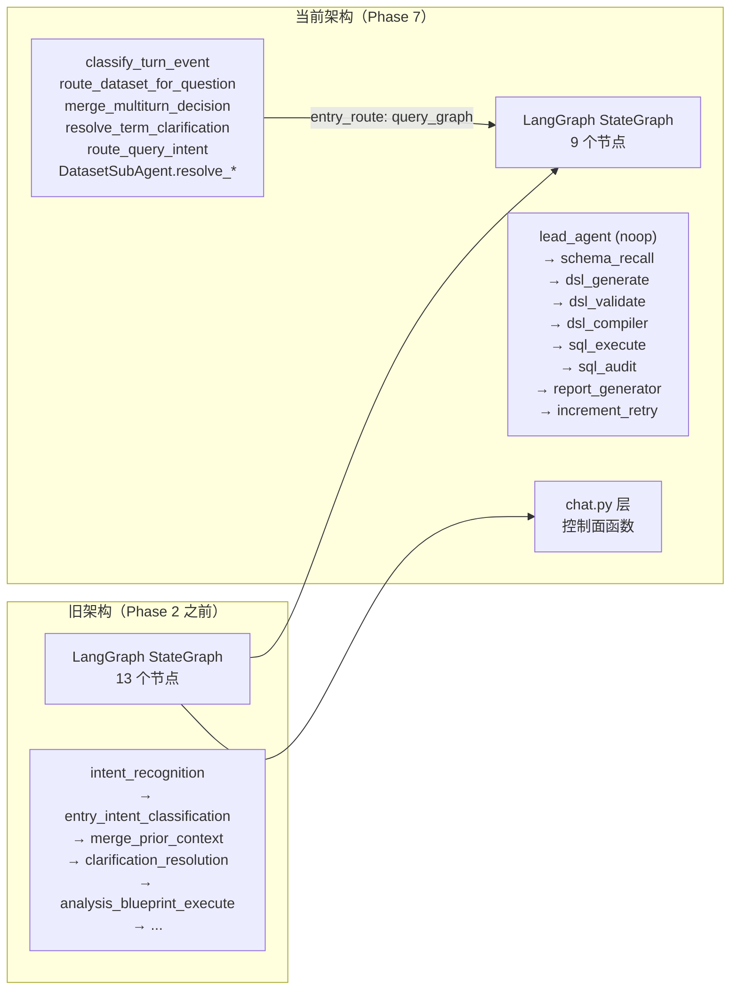

入口路由与意图分类是 Datalogue 问数管道的**第一道决策关卡**——它在每次用户提问时做出一项一次性判决：这条问题应该走哪条执行路径？是直接回答闲聊、拒答越权请求、匹配分析蓝图、查询业务知识库，还是进入 NL2DSL2SQL 主链路执行数据查询？这个决策一旦做出便不可逆：早退路径直接返回自然语言回答，永不再进入 LangGraph 工作流；而进入 `query_graph` 的问题则交由 DatasetSubAgent 接管后续所有语义解析、DSL 生成与 SQL 执行。

整个入口路由系统并非单一的"意图分类器"，而是由**三层过滤网 + 一层术语澄清解析 + 一层早退出口**组成的决策管道，在 `chat.py` 的 `_stream_chat_singleturn` 端点中有序执行。

Sources: [chat.py](app/api/chat.py#L1147-L1800)

## 决策管道全景：五阶段流水线

从用户问题到最终执行路径，入口路由经历五个严格有序的阶段。每个阶段都有独立的数据契约和失败处理策略，任一阶段触发早退条件都会让问题**就地闭环**，永不流入下游。



红色早退路径的共同特征：**不调用 LangGraph，不消耗 SubAgent 资源，由 chat 层直接保存助手消息并关闭 SSE 流**。绿色通道是唯一进入 NL2DSL2SQL 主链路的大门。

Sources: [chat.py](app/api/chat.py#L1292-L1760) | [lead_agent_routing.py](app/services/lead_agent_routing.py#L332-L408)

## 阶段一：消息网关 — 正则快路径事件分类

消息网关 (`classify_turn_event`) 是整个系统的第一道防火墙，纯正则匹配，零 LLM 开销。它把用户输入归类为七种结构化事件，决定了问题是否有资格进入后续阶段。



消息网关的判定逻辑高度工程化：它依赖七组预编译正则模式和关键词元组，全部定义在模块顶层，不涉及任何外部状态查询（数据库、LLM 均为零调用）。这种纯函数设计意味着它可以在 SSE 流建立后的**首个 CPU 周期内完成决策**，延迟可忽略。

Sources: [message_gateway.py](app/services/message_gateway.py#L1-L89)

| 事件类型 | 触发条件 | 后续行为 | 进入 LangGraph？ |
|---|---|---|---|
| `dataset_select` | 匹配 `选择/切换到 X 数据集` 正则 | 查找数据集，更新 conv.dataset_id，早退 | 否 |
| `clarification_answer` | 存在 `pending_clarification` | 早退，交由后续 term 澄清解析处理 | 否 |
| `interpret_result` | `has_last_success_task` + 命中解释词 | 触发 `_interpret_early_return` 结果解释 | 否 |
| `followup_refine` | 命中筛选追问词 + 有历史 | 作为 `add_filter` 增量进入查询链路 | 是 |
| `clarify` | 筛选追问词但无历史 / 无数据集且空输入 | 生成指引性回答，早退 | 否 |
| `new_query` | 以上均不命中 | 进入完整问数管线 | 是 |

消息网关本质上是一张**硬编码的决策表**，它的存在极大降低了无效请求对下游 LLM 和数据库的冲击。一个典型的例子：用户在未选择数据集时发送空消息，消息网关直接在 0.1ms 内返回指引文案，而不必经过后续的 LeadAgent LLM 调用、Manifest 评分和路由决策。

Sources: [message_gateway.py](app/services/message_gateway.py#L35-L88)

## 阶段二：LeadAgent 上下文构建与数据集路由

当消息网关放行后，`build_lead_agent_context` 接管控制权。这是 LeadAgent 控制面的核心编排函数，它依次执行多轮分类、工具策略构建、技能选择、LLM 工具规划和工具执行，最终产出一个包含 `route_decision` 的完整上下文字典。

其中**数据集路由** (`route_dataset_for_question`) 是决定 `should_continue` 的关键环节。它不依赖 LLM，而是基于 SubAgent Manifest 的**关键词评分机制**进行自动匹配：

Sources: [lead_agent.py](app/services/lead_agent.py#L2060-L2180) | [dataset_router.py](app/services/dataset_router.py#L46-L112)



三个关键阈值均可通过环境变量配置：`DATASET_ROUTER_AUTO_SELECT_THRESHOLD`（默认 0.65）、`DATASET_ROUTER_AUTO_SELECT_MARGIN`（默认 0.12）、`DATASET_ROUTER_MAX_CANDIDATES`（默认 3）。当路由拒绝（`no_match` 或 `ambiguous`）时，`should_continue` 被置为 `False`，chat 层进入第二个早退出口——`_route_block_answer()` 生成自然语言解释并直接返回。

Sources: [dataset_router.py](app/services/dataset_router.py#L14-L17) | [chat.py](app/api/chat.py#L841-L864)

## 阶段三：术语澄清解析 — 替代 LangGraph clarification_resolution_node

在 Phase 4 改造中，原本位于 LangGraph 内部的 `clarification_resolution_node` 被上提至 chat 层，由 `resolve_term_clarification` 接管。这意味着**术语冲突澄清不再依赖 LangGraph 状态机**，而是直接在 chat 层完成"查找 pending → 匹配候选 → 标记 resolved"的全过程。

这是一个**五状态机**：

```
none → missing → expired → unresolved → resolved
```

Sources: [lead_agent_routing.py](app/services/lead_agent_routing.py#L1075-L1227)

| 状态 | 触发条件 | 行为 | 后续 |
|---|---|---|---|
| `none` | 无挂起澄清且无回复 | 透明通过，不做任何处理 | 进入下一阶段 |
| `missing` | 有澄清回复但找不到 pending 记录 | 返回拒答文案 | 早退 |
| `expired` | pending 已过期（超过 TTL） | 标记 `status=expired`，lazy commit | 早退 |
| `unresolved` | 候选未匹配（用户回复无法定位到任一候选项） | 重新生成候选提示文案 | 早退，等用户再次澄清 |
| `resolved` | 命中候选（通过序号或自然语言匹配） | 标记 `status=resolved`，注入 `selected_term_id` + `resolved_question` | 恢复原问题，进入路由 |

`resolved` 状态的特别之处在于：它不会早退，而是将澄清前的**原始问题**恢复为 `routing_question`，让后续的 `route_query_intent` 基于完整问题进行意图分类。这解决了旧架构中"用户回复'第一个'后，短句被 clarify 规则拦截，pending 永远无法 resolve"的竞态问题。

Sources: [lead_agent_routing.py](app/services/lead_agent_routing.py#L868-L870) | [chat.py](app/api/chat.py#L1642-L1705)

## 阶段四：route_query_intent — LLM 意图提取 + 规则路由融合

`route_query_intent` 是入口路由的**最终裁决者**，也是 Phase 3 改造的核心成果——它将旧架构中两个独立的 LangGraph 节点（`intent_recognition_node` + `entry_intent_classification_node`）合并为单一函数，产出一个包含 11 个字段的完整路由决策。



### LLM 意图提取

`_invoke_intent_llm` 使用 `INTENT_RECOGNITION_SYSTEM` prompt，将用户问题 + 历史上下文 + 多轮澄清提示拼接为 HumanMessage，调用 `role=intent` 绑定的 LLM 模型（temperature=0.0，最大化确定性）。输出为三字段 JSON：

```json
{"intent": "query|chitchat|function", "entities": {"metrics": [], "dimensions": [], "time_range": null}, "direct_answer": null}
```

LLM 不可用时自动降级为 `intent=query`，确保系统在模型故障时仍能通过规则路由进入查询主链路。

Sources: [lead_agent_routing.py](app/services/lead_agent_routing.py#L420-L490) | [intent_router.py](app/prompts/intent_router.py#L1-L23)

### 规则路由九步级联

`_classify_entry_intent` 是一个 **优先级锁定的决策级联**——每一步匹配成功后立即返回，不继续向下评估。这种设计意味着：chitchat 永远优先于蓝图匹配，蓝图匹配永远优先于知识库问答，确保规则之间无歧义。

Sources: [lead_agent_routing.py](app/services/lead_agent_routing.py#L544-L860)

| 步骤 | 匹配条件 | entry_intent | entry_route | 进入图？ |
|---|---|---|---|---|
| 1 | `intent == chitchat` | `chitchat` | `direct_answer` | 否 |
| 2 | `intent == function`（无 pending 覆盖） | `rejection` | `reject` | 否 |
| 3 | 命中 `_PERMISSION_PATTERNS` | `rejection` | `reject` | 否 |
| 4a | LeadAgent `requires_clarification` | `clarification` | `clarify` | 否 |
| 4b | LeadAgent `can_continue` + 多轮上下文 | `detail_query` | `query_graph` | 是 |
| 5 | 命中 `_match_analysis_blueprint` | `analysis_blueprint` | `analysis_blueprint` | 是 |
| 6 | 知识库问答词 + `_match_business_term` | `knowledge_qa` | `knowledge_qa` | 否 |
| 7a | 蓝图类词但无指标/明细 | `clarification` | `clarify` | 否 |
| 7b | 短句指代不清（≤4 字 + 指代词） | `clarification` | `clarify` | 否 |
| 8 | 命中 `_DETAIL_PATTERNS` | `detail_query` | `query_graph` | 是 |
| 9 | 命中 `_METRIC_PATTERNS` 或有维度实体 | `metric_query` | `query_graph` | 是 |
| 10 | 多轮字段过滤追问 | `detail_query` | `query_graph` | 是 |
| default | 以上均不命中 | `clarification` | `clarify` | 否 |

步骤 4 的 LeadAgent 多轮追问理解是规则路由中最复杂的逻辑。它通过 `_lead_multiturn_refinement()` 读取 LeadAgent 产出的抽象追问槽位（包含 `intent`、`confidence`、`slots` 等字段），再通过 `_refinement_can_continue()` 校验置信度（≥0.5）和槽位完整性。当且仅当存在 `last_success_task` 且槽位可承接时，才将问题路由到 `query_graph` 进行增量查询。

Sources: [lead_agent_routing.py](app/services/lead_agent_routing.py#L160-L228)

### 蓝图匹配与知识库问答

蓝图匹配 (`_match_analysis_blueprint`) 在当前数据集的 `status=active` 蓝图中，按 `trigger_keywords`、`trigger_examples`、`name`、`description`、`when_to_use` 等进行子串匹配，并根据匹配来源赋予不同权重：`trigger_keywords` 直接命中得 3 分，其他字段命中得 2 分，反向包含（问题词是蓝图词的子串）得 1 分。蓝图按 `usage_count` 降序排列，优先匹配高频蓝图。

知识库问答 (`_match_business_term`) 则直接对 `BusinessTerm` 的 `name`、`display_name`、`aliases` 做归一化子串匹配，匹配到即返回术语定义。

Sources: [lead_agent_routing.py](app/services/lead_agent_routing.py#L232-L310)

## 阶段五：早退出口 — _early_route_return 的统一关闭协议

所有不进入 LangGraph 的路径——无论是消息网关拦截、Manifest 路由不明确、术语澄清未解决，还是意图路由判定为早退——最终都由 `_early_route_return` 统一处理。这个函数的核心职责是：

1. 构建 `final_state`（包含 `entry_intent`、`entry_route`、`route_payload` 等完整元数据）
2. 保存 `assistant_message` 到数据库（含 `step_trace` 和 `response_metadata`）
3. 写入 `ObservabilityTraceIndex` 供 Langfuse 追踪
4. 发送 SSE `final` 事件关闭流
5. 调用 `obs_context_manager.__exit__()` 释放可观测性上下文

早退消息的 `step_trace` 中保留了 LeadAgent 事件和路由决策事件，确保前端"思考链"面板在任何早退场景下都能展示完整的决策过程。`response_metadata` 中的 `routing` 字段则保留了原始路由决策的完整快照，供后续审计和调试使用。

Sources: [chat.py](app/api/chat.py#L3324-L3441)

## 路由决策的可见性：SSE step 事件

入口路由的每个决策节点都会通过 SSE 流向前端发送结构化事件。这些事件被前端"执行阶段"面板消费，展示在右侧的思考链卡片中：

| SSE 事件 | 发送时机 | 关键字段 |
|---|---|---|
| `type: "lead_agent_tools"` | LeadAgent 上下文构建完成后 | `route_decision`, `selected_skills`, `planned_tool_calls`, `executed_tool_calls` |
| `type: "route_decision"` | 数据集路由决策完成后 | `decision`, `dataset_id`, `dataset_name`, `score`, `candidates`, `reason` |
| `type: "step", node: "lead_agent"` | `route_query_intent` 完成后 | `intent`, `entities`, `entry_intent`, `entry_route`, `entry_reason`, `blueprint_id`, `route_payload` |
| `type: "step", node: "clarification_resolution"` | 术语澄清解析完成（非 none 状态） | `clarification_resolution`, `route_payload` |
| `type: "final"` | 早退或完整链路结束 | `answer`, `entry_intent`, `entry_route`, `query_profile`, `explainability` |

Sources: [chat.py](app/api/chat.py#L1437-L1460) | [chat.py](app/api/chat.py#L1685-L1720)

## 从 LangGraph 节点到 chat 层函数：Phase 3/4 架构演进

入口路由系统的当前形态是逐步从 LangGraph 内部"剥离"出来的结果。理解这个演进过程有助于把握整体架构的设计意图：



核心设计原则：**将"决策"从"执行"中分离**。所有"这个请求应该怎么处理"的判断逻辑（意图分类、蓝图匹配、澄清解析、术语冲突）上提到 chat 层，LangGraph 只保留"已经决定要查数据了，开始查"的纯粹执行链路。这带来了三个直接收益：

1. **早退零成本**：chitchat、拒答、澄清等场景不再需要初始化 LangGraph StateGraph
2. **可测试性**：`route_query_intent` 是纯函数（传入 db/session/question，返回 dict），可独立单测
3. **可观测性**：每个决策节点的输入输出通过 tracer span 完整记录，不依赖 LangGraph 的节点事件层级

当前 LangGraph 的 `lead_agent` 节点本身是一个 **noop 透传节点**——它不执行任何逻辑，仅用于在 SSE 事件流中保留节点可见性。真正的入口路由决策早已在 chat 层完成并注入 `initial_state`。

Sources: [workflow.py](app/graph/workflow.py#L140-L158) | [nodes.py](app/graph/nodes.py#L1-L13) | [chat.py](app/api/chat.py#L1642-L1800)

## 阅读路径建议

当前页面聚焦于控制面的入口路由决策。理解整个系统的完整链路后，建议按以下顺序继续深入：

- **上游**：入口路由的决策输入来自 [LeadAgent 工具编排：技能选择、工具规划与路由决策](9-leadagent-gong-ju-bian-pai-ji-neng-xuan-ze-gong-ju-gui-hua-yu-lu-you-jue-ce)，它产出的 `lead_agent_context`（含 `multiturn_refinement`、`route_decision` 等）是 `route_query_intent` 和 `resolve_term_clarification` 的关键输入
- **平行**：与入口路由并列的网关层是 [消息网关：用户输入事件分类与早退路由](23-xiao-xi-wang-guan-yong-hu-shu-ru-shi-jian-fen-lei-yu-zao-tui-lu-you)，它描述了 `classify_turn_event` 的完整事件分类逻辑
- **下游**：通过 `query_graph` 路由后，问题进入 [SubAgent 调度协议：进程内与远程 Runner 的双模执行](11-subagent-diao-du-xie-yi-jin-cheng-nei-yu-yuan-cheng-runner-de-shuang-mo-zhi-xing) 和 [DSL 生成、校验与 SQL 编译的逐节点实现](13-dsl-sheng-cheng-xiao-yan-yu-sql-bian-yi-de-zhu-jie-dian-shi-xian)
- **数据契约**：入口路由的决策字段完整定义在 [AgentState 状态定义：LangGraph 工作流全局传递的数据契约](6-agentstate-zhuang-tai-ding-yi-langgraph-gong-zuo-liu-quan-ju-chuan-di-de-shu-ju-qi-yue) 中的意图识别层字段