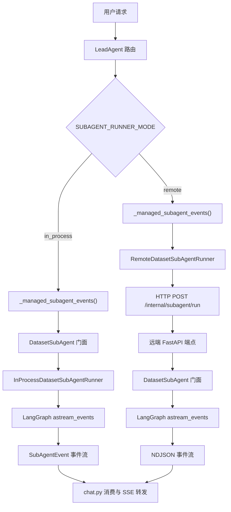
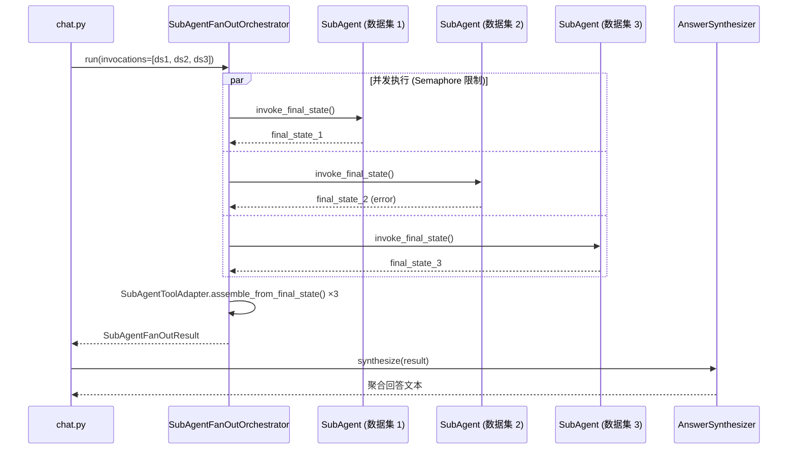

SubAgent 调度协议是 Datalogue 平台将 LeadAgent 的路由决策转化为实际数据集查询执行的核心机制。该协议定义了一套统一的请求契约（`DatasetSubAgentRequest`）和流式事件协议（`SubAgentEvent`），并在此基础上提供两种对等的执行模式：**进程内执行**（在同一 Python 进程中直接运行 LangGraph）和**远程 A2A 调用**（通过 HTTP NDJSON 流式协议调用独立部署的 SubAgent 服务）。两种模式共享完全相同的请求结构与事件语义，使得从单体开发到分布式部署的切换仅需修改一个配置项。

Sources: [runner.py](app/services/runner.py#L1-L13)

---

## 一、架构全景：调度层在系统中的位置

在执行流程中，SubAgent 调度层位于 LeadAgent 路由决策之后、数据集级查询执行之前。LeadAgent 完成意图分类与工具规划后，将路由决策连同用户问题封装为 `DatasetSubAgentRequest`，通过调度层分发给对应数据集的 SubAgent 执行单元。调度层的核心职责是屏蔽执行位置的差异——无论 SubAgent 运行在同一进程还是远端服务，上层的 chat 主链路看到的都是统一的 `AsyncGenerator[SubAgentEvent, None]` 事件流。



Sources: [runner.py](app/services/runner.py#L67-L135) | [runner.py](app/services/runner.py#L138-L270) | [chat.py](app/api/chat.py#L308-L345) | [internal_subagent.py](app/api/internal_subagent.py#L43-L81)

---

## 二、统一请求契约：`DatasetSubAgentRequest`

`DatasetSubAgentRequest` 是跨模式通用的调度请求结构。它的字段被精心设计为**纯数据载体**——所有字段均可通过 `dataclasses.asdict()` 序列化为 JSON，确保进程内和远程两种路径使用完全相同的数据契约。

| 字段 | 类型 | 用途 |
|------|------|------|
| `question` | `str` | 经过 LeadAgent 解析后的用户问题 |
| `dataset_id` | `int` | 目标数据集的唯一标识 |
| `manifest_version` | `str \| None` | 数据集 Manifest 版本号，用于 Schema 一致性校验 |
| `bound_schema_version` | `str \| None` | 绑定的 Schema 版本，确保查询基于正确的表结构 |
| `thread_id` | `str` | 会话线程 ID，用于多轮上下文关联 |
| `time_context` | `dict` | 时间理解上下文（如 "今天"、"上个月" 的解析结果） |
| `thread_context` | `dict` | 线程级对话上下文 |
| `route_decision` | `dict` | LeadAgent 的路由决策结果 |
| `schema_status` | `dict` | 数据集 Schema 就绪状态 |
| `lead_agent_context` | `dict` | LeadAgent 的完整上下文（含 resolved_question、planned_tool_calls 等） |
| `prior_capsule` | `dict \| None` | 上一轮查询的持久化胶囊（跨轮继承） |
| `query_task_capsule` | `dict \| None` | 当前轮的查询任务胶囊 |
| `turn_event` | `dict \| None` | 多轮转向事件 |
| `trace_id` | `str \| None` | 分布式追踪 ID，**为跨进程部署预留** |
| `parent_observation_id` | `str \| None` | 父级观测 Span ID，**为跨进程追踪预留** |

其中 `trace_id` 和 `parent_observation_id` 在进程内模式下为可选字段（可观测 Span 由 `ObservabilityTraceContext` 独立管理），但在远程模式下它们被序列化到 HTTP 请求体中，由远端服务重建追踪链路。

Sources: [runner.py](app/services/runner.py#L46-L64)

---

## 三、进程内执行路径：`InProcessDatasetSubAgentRunner`

进程内模式是默认的执行方式（`SUBAGENT_RUNNER_MODE=in_process`），适用于单体部署或开发阶段。它的执行流程分为三层：

### 3.1 编排层：`DatasetSubAgent.run()`

`DatasetSubAgent` 门面负责在调用 Runner 之前完成所有与数据集业务逻辑相关的准备工作：

1. **Manifest 运行时守卫**：调用 `evaluate_manifest_runtime_guard()` 检查数据集 Manifest 的状态（Schema 版本、权限范围、质量状态等）。如果守卫状态不是 `ok`，立即返回阻断事件，不进入后续流程。
2. **候选资产召回**：通过 `recall_candidate_assets()` 检索与该问题相关的语义资产（蓝图、指标、维度、术语、字段、表），生成 `candidate_assets` 事件。
3. **查询规划**：根据配置决定使用 Planner → Detail Loop（`SUBAGENT_PLANNER_DETAIL_LOOP_ENABLED=true`）或单次 Planner 调用，生成 `QueryPlan`（含执行策略：`query_graph`、`clarify`、`reject`、`blueprint_execute`、`blueprint_as_reference`）。
4. **策略分发**：
   - `clarify` → 直接返回澄清事件（不进入 Graph）
   - `reject` → 直接返回拒答事件（不进入 Graph）
   - `blueprint_execute` → 调用 `resolve_analysis_blueprint()` 执行固定蓝图（不进入 Graph）
   - `query_graph` / `blueprint_as_reference` → 组装 `query_graph_state`，创建 `InProcessDatasetSubAgentRunner` 执行 LangGraph

Sources: [dataset_subagent.py](app/services/dataset_subagent.py#L1108-L1367) | [dataset_subagent.py](app/services/dataset_subagent.py#L1122-L1142)

### 3.2 Runner 层：`InProcessDatasetSubAgentRunner`

Runner 本身只承担两个职责：**包裹可观测 Span** 和 **驱动 LangGraph 流式执行**。它在 `astream_events` 循环的前后分别调用 `tracer.start_span()` 和 `tracer.end_span()`，以 `subagent.{dataset_id}` 为 Span 节点名记录输入输出。在事件流中，Runner 还会识别 `merge_prior_context` 节点的结束事件，触发 delta-merge 的独立 Span 记录——这是多轮追问场景中将上一轮查询状态增量合并到当前轮的关键钩子。

Sources: [runner.py](app/services/runner.py#L67-L135) | [runner.py](app/services/runner.py#L273-L308)

### 3.3 事件流协议：`SubAgentEvent`

`SubAgentEvent` 是整个调度协议的标准事件载体。它的 `event_type` 枚举定义了五种事件类型，每种事件携带特定的 `payload`：

| event_type | 含义 | payload 关键字段 |
|------------|------|-----------------|
| `candidate_assets` | 候选资产召回完成 | `candidate_assets`（资产列表 + 摘要） |
| `query_plan` | 查询规划完成 | `query_plan`（执行策略、选中资产、置信度等） |
| `asset_detail` | Detail Loop 完成（可选） | `detail_rounds`、`requested_count`、`coverage` |
| `graph_event` | LangGraph 内部节点事件 | `event`（原始 LangGraph 事件） |
| `result` | SubAgent 执行完成 | `final_state`（answer、sql、sql_result 等） |

在进程内模式下，事件以 Python 对象的 `AsyncGenerator` 形式在内存中流转。在远程模式下，事件被序列化为 NDJSON 格式通过 HTTP 流式传输，远端端点逐条 yield，本地 `RemoteDatasetSubAgentRunner` 逐条解析后以相同的 `dict` 形式暴露给上层。

Sources: [contracts.py](app/services/subagent_planning/contracts.py#L178-L185) | [internal_subagent.py](app/api/internal_subagent.py#L64-L81) | [runner.py](app/services/runner.py#L240-L258)

---

## 四、远程执行路径：`RemoteDatasetSubAgentRunner`

远程模式（`SUBAGENT_RUNNER_MODE=remote`）将 SubAgent 的执行卸载到独立服务进程，通过 **A2A（Agent-to-Agent）内部协议** 进行通信。该模式的核心设计原则是：**远端服务与主服务共享完全相同的 SubAgent 门面代码**，远端只是多了一层 HTTP 序列化/反序列化适配。

### 4.1 配置与初始化

远程 Runner 的所有配置通过 `Settings` 集中管理：

| 配置项 | 默认值 | 说明 |
|--------|--------|------|
| `SUBAGENT_RUNNER_MODE` | `"in_process"` | 设为 `"remote"` 启用远程模式 |
| `SUBAGENT_REMOTE_BASE_URL` | `None` | 远端 SubAgent 服务的 API 基地址，**必须以 `/api` 结尾** |
| `SUBAGENT_REMOTE_API_KEY` | `None` | 内部认证令牌，用于 HMAC 防篡改 |
| `SUBAGENT_REMOTE_TIMEOUT_SECONDS` | `60.0` | HTTP 请求超时时间（秒） |
| `SUBAGENT_REMOTE_RETRIES` | `0` | 重试次数（不重试超时类错误） |

`RemoteDatasetSubAgentRunner` 在构造时强制校验 `base_url` 必须以 `/api` 结尾，并在初始化时创建 `httpx.AsyncClient`（支持外部注入以复用连接池）。Runner 支持 `aclose()` 方法安全释放自有的 HTTP 客户端。

Sources: [runner.py](app/services/runner.py#L138-L177) | [config.py](app/core/config.py#L76-L80)

### 4.2 A2A 线协议

每次远程调度发起 `POST {base_url}/internal/subagent/run`，请求体包含四部分结构化数据：

```json
{
  "request": { /* DatasetSubAgentRequest asdict() */ },
  "initial_state": { /* LangGraph 初始状态 */ },
  "dataset_name": "销售数据集",
  "graph_kwargs": { "version": "v2" },
  "trace_context": {
    "trace_id": "...",
    "parent_observation_id": "..."
  }
}
```

请求头携带 `Accept: application/x-ndjson` 声明期望的响应格式，以及 `X-Datalogue-Internal-Token` 进行 HMAC 认证。远端端点 `internal_subagent.py` 通过 `hmac.compare_digest()` 进行恒定时间比较，防止时序攻击。

响应格式为 **NDJSON（Newline-Delimited JSON）**——每行一个完整的 JSON 对象，对应一个 `SubAgentEvent`。空行被忽略。Runner 在解析时还兼容以 `data:` 前缀开头的行（SSE 风格），增强了协议的鲁棒性。

Sources: [runner.py](app/services/runner.py#L179-L258) | [internal_subagent.py](app/api/internal_subagent.py#L35-L81) | [smoke_remote_subagent.py](scripts/smoke_remote_subagent.py#L53-L67)

### 4.3 远端端点实现

远端服务的 `/api/internal/subagent/run` 端点实现极其精简：它接收请求体，反序列化出 `DatasetSubAgentRequest`，创建本地 `DatasetSubAgent` 门面实例，然后将门面的 `run()` 生成器逐事件序列化为 NDJSON 流返回。这意味着远端服务运行的是**与主服务完全相同的代码**，没有重复实现——这是 A2A 协议设计的核心优势。

```python
# 远端端点核心逻辑（简化）
async def _events():
    async for event in subagent.run(request, None, graph=graph, ...):
        yield json.dumps({"event_type": event.event_type, "payload": event.payload}) + "\n"
return StreamingResponse(_events(), media_type="application/x-ndjson")
```

Sources: [internal_subagent.py](app/api/internal_subagent.py#L43-L81)

### 4.4 错误映射与安全隔离

远程 Runner 实现了多层错误隔离，确保远端异常不会将敏感信息（如数据库堆栈跟踪）泄漏到主服务的 LLM 上下文中：

| 错误场景 | 映射结果 |
|----------|----------|
| HTTP 4xx/5xx | `{event_type: "result", payload: {final_state: {error: "remote_subagent_error", raw_error: "..."}}}` |
| 请求超时（`httpx.TimeoutException`） | 同上，`raw_error` 含 "timeout" |
| Python `TimeoutError` | 同上 |
| NDJSON 解析失败 | 跳过该行（warning 日志记录） |
| 其他异常 | 通用错误事件 |

所有远程错误都被统一映射为 `event_type="result"` 的安全事件，`raw_error` 字段仅在后端流转（通过 `ControlPlanePart.raw_error`），不会进入 LLM 可见层。

Sources: [runner.py](app/services/runner.py#L202-L270) | [test_subagent_remote_runner.py](tests/test_subagent_remote_runner.py#L105-L122)

---

## 五、调度入口：chat.py 中的模式选择

模式选择的决策点位于 `_managed_subagent_events()` 上下文管理器：

```python
if getattr(get_settings(), "SUBAGENT_RUNNER_MODE", "in_process") == "remote":
    runner = RemoteDatasetSubAgentRunner()
    try:
        yield runner.run(request, trace_context, initial_state, ...)
    finally:
        await runner.aclose()
else:
    sub_agent = DatasetSubAgent(db=db, dataset_id=dataset_id)
    yield sub_agent.run(request, trace_context, graph=app_graph, ...)
```

这种设计确保两种模式对外暴露**完全相同的接口签名**：都是返回 `AsyncGenerator` 的异步生成器。chat.py 的上层代码（`_collect_subagent_final_state()`）通过统一的 `async for sub_event in subagent_events` 消费事件流，无需感知底层是进程内还是远程。

Sources: [chat.py](app/api/chat.py#L308-L345) | [chat.py](app/api/chat.py#L348-L392)

---

## 六、多数据集 Fan-Out 编排

当 LeadAgent 在工具规划阶段识别出需要同时查询多个数据集时（`planned_tool_calls` 中包含多个明确指定 `dataset_id` 的 `dataset_query` / `subagent_dispatch` 调用），系统会触发 **Fan-Out 编排路径**。

### 6.1 触发条件

Fan-Out 的触发需要同时满足两个条件：

1. **配置开关**：`LEAD_AGENT_ENABLE_DATASET_FANOUT = True`
2. **有效调用数 ≥ 2**：`parse_dataset_fanout_invocations()` 从 LeadAgent 的 `planned_tool_calls` 中解析出至少两个明确携带 `dataset_id` 的调用——不足两个时退回单数据集路径，避免误将普通 `subagent_dispatch` 猜测为 fan-out

Sources: [subagent_fanout.py](app/services/subagent_fanout.py#L83-L125) | [chat.py](app/api/chat.py#L1838-L1846) | [config.py](app/core/config.py#L67)

### 6.2 并发编排器：`SubAgentFanOutOrchestrator`

编排器的核心特性是**并发执行 + 局部失败隔离**：

- **并发控制**：通过 `asyncio.Semaphore` 限制最大并发数（配置项 `SUBAGENT_FANOUT_MAX_PARALLEL`，默认 3）
- **结果聚合**：使用 `asyncio.gather()` 并发执行所有调用，每个数据集的失败被捕获为带 `error` 字段的 `final_state`，不会污染其他数据集的查询结果
- **双层出参**：所有子调用结果通过 `SubAgentToolAdapter` 拆分为 LLM 可见层和控制面层后统一聚合



Sources: [subagent_fanout.py](app/services/subagent_fanout.py#L128-L180) | [chat.py](app/api/chat.py#L1859-L1909)

### 6.3 答案合成器：`SubAgentFanOutAnswerSynthesizer`

`SubAgentFanOutAnswerSynthesizer` 从 Fan-Out 聚合结果中提取各数据集的 `LLMVisiblePart`，生成为一个结构化的文本摘要。它只读取 `llm_visible` 字段——确保合成器无法访问任何控制面数据（capsule、SQL 结果等）。

Sources: [subagent_fanout.py](app/services/subagent_fanout.py#L183-L203)

---

## 七、双层出参适配器：`SubAgentToolAdapter`

`SubAgentToolAdapter` 是 SubAgent 调度协议的**安全边界**。它将每个 SubAgent 执行的 `final_state` 拆分为两层：

### LLM 可见层（`LLMVisiblePart`）

允许进入 LLM 上下文字段白名单：

| 字段 | 说明 |
|------|------|
| `status` | `ok` / `clarification_needed` / `error` / `empty` / `timeout` |
| `dataset_id` | 数据集 ID |
| `display_summary` | 可展示摘要（≤ 240 字符） |
| `clarification_question` | 澄清问题文本 |
| `error_summary` | 脱敏后的错误摘要 |
| `result_ref` | 结果 Artifact 引用 ID |
| `report_ref` | 报告 Artifact 引用 ID |

关键安全措施：
- **Token 预算**：`display_summary + clarification_question + error_summary` 的总 token 数不超过 `SUBAGENT_LLM_VISIBLE_TOKEN_BUDGET`（默认 200），超出时按优先级截断，极端情况下降级为 "查询完成"
- **错误脱敏**：将原始错误文本通过 `_sanitize_error()` 转换为用户可读的安全摘要——"SQL 执行失败" 而非堆栈跟踪

### 控制面层（`ControlPlanePart`）

只在后端内存中流转，绝对禁止进入 LLM 上下文或前端 SSE `final` 事件：

| 字段 | 说明 |
|------|------|
| `capsule` | 查询胶囊（含 SQL、结果等敏感数据） |
| `last_success_task` | 上一轮成功任务摘要，供下一轮多轮继承 |
| `result_ref` / `report_ref` | Artifact 引用 |
| `raw_error` | 原始错误（仅后端日志可见） |

Sources: [subagent_tool_adapter.py](app/services/subagent_tool_adapter.py#L31-L148) | [subagent_tool_adapter.py](app/services/subagent_tool_adapter.py#L168-L264) | [subagent_tool_adapter.py](app/services/subagent_tool_adapter.py#L302-L317) | [subagent_tool_adapter.py](app/services/subagent_tool_adapter.py#L319-L399)

---

## 八、故障隔离与容错矩阵

调度协议在不同层级实现了多层次的故障隔离：

| 层级 | 故障场景 | 隔离策略 |
|------|----------|----------|
| **Manifest 守卫** | Schema 版本不一致、权限不足、质量检查失败 | 阻断执行，返回 `entry_route="blocked"` 事件 |
| **候选资产召回** | 数据库查询异常 | 异常向上传播，由 Runner 的外层 try/except 捕获并映射为 error 事件 |
| **查询规划** | Planner LLM 调用失败 | 降级为规则 fallback `QueryPlan`（`planner_source="fallback"`） |
| **LangGraph 执行** | 图中任意节点异常 | `InProcessDatasetSubAgentRunner` 捕获，记录 error 并结束观测 Span |
| **远程 HTTP** | 4xx/5xx、超时、连接断开 | `RemoteDatasetSubAgentRunner` 映射为安全的 error 事件 |
| **Fan-Out 并发** | 单个数据集超时或异常 | 该数据集返回 error `final_state`，不影响其他数据集的正常结果 |
| **Adapter 装配** | Token 预算严重超限 | 降级为最小摘要 "查询完成"，不中断整个对话流 |

所有异常路径都有一个共同原则：**错误必须被捕获并转化为结构化的 SubAgentEvent**，绝不允许原始异常穿透调度层到达 SSE 流或 LLM 上下文。

Sources: [runner.py](app/services/runner.py#L120-L135) | [runner.py](app/services/runner.py#L202-L216) | [subagent_fanout.py](app/services/subagent_fanout.py#L152-L160) | [dataset_subagent.py](app/services/dataset_subagent.py#L1129-L1142) | [subagent_tool_adapter.py](app/services/subagent_tool_adapter.py#L368-L382)

---

## 九、配置清单

以下配置项直接控制调度协议的行为，均定义在 `Settings` 类中：

| 配置项 | 默认值 | 控制范围 |
|--------|--------|----------|
| `SUBAGENT_RUNNER_MODE` | `"in_process"` | 选择进程内或远程执行模式 |
| `SUBAGENT_REMOTE_BASE_URL` | `None` | 远程 SubAgent 服务的 API 基地址 |
| `SUBAGENT_REMOTE_API_KEY` | `None` | 内部 A2A 认证令牌 |
| `SUBAGENT_REMOTE_TIMEOUT_SECONDS` | `60.0` | 远程 HTTP 请求的超时时间 |
| `SUBAGENT_REMOTE_RETRIES` | `0` | 远程 HTTP 请求的重试次数 |
| `LEAD_AGENT_ENABLE_DATASET_FANOUT` | `False` | 是否启用多数据集并发查询 |
| `SUBAGENT_FANOUT_MAX_PARALLEL` | `3` | Fan-Out 最大并发数 |
| `SUBAGENT_LLM_VISIBLE_TOKEN_BUDGET` | `200` | LLM 可见摘要的 token 预算上限 |
| `SUBAGENT_PLANNER_DETAIL_LOOP_ENABLED` | `False` | 是否启用 Planner Detail Loop |

Sources: [config.py](app/core/config.py#L67) | [config.py](app/core/config.py#L74-L80) | [config.py](app/core/config.py#L82-L88) | [config.py](app/core/config.py#L133)

---

## 十、阅读下一站

本文档聚焦于 SubAgent 的调度协议与双模执行机制。建议按以下路线继续深入：

- **[LeadAgent 工具编排：技能选择、工具规划与路由决策](9-leadagent-gong-ju-bian-pai-ji-neng-xuan-ze-gong-ju-gui-hua-yu-lu-you-jue-ce)** — 理解调度决策的上游：LeadAgent 如何生成 `route_decision` 和 `planned_tool_calls`
- **[DatasetSubAgent 门面：LeadAgent 与语义层之间的隔离边界](18-datasetsubagent-men-mian-leadagent-yu-yu-yi-ceng-zhi-jian-de-ge-chi-bian-jie)** — 深入 `DatasetSubAgent` 门面的完整业务能力
- **[多数据集 Fan-Out 编排：并发调用与结果聚合](19-duo-shu-ju-ji-fan-out-bian-pai-bing-fa-diao-yong-yu-jie-guo-ju-he)** — Fan-Out 编排的详细设计
- **[QueryTaskCapsule 与 QueryArtifact：跨轮查询状态的持久化协议](21-querytaskcapsule-yu-queryartifact-kua-lun-cha-xun-zhuang-tai-de-chi-jiu-hua-xie-yi)** — 理解多轮状态如何在 SubAgent 调度中流转
- **[查询规划器：Planner 决策、Detail Loop 与降级策略](17-cha-xun-gui-hua-qi-planner-jue-ce-detail-loop-yu-jiang-ji-ce-lue)** — 调度层下游的查询规划细节