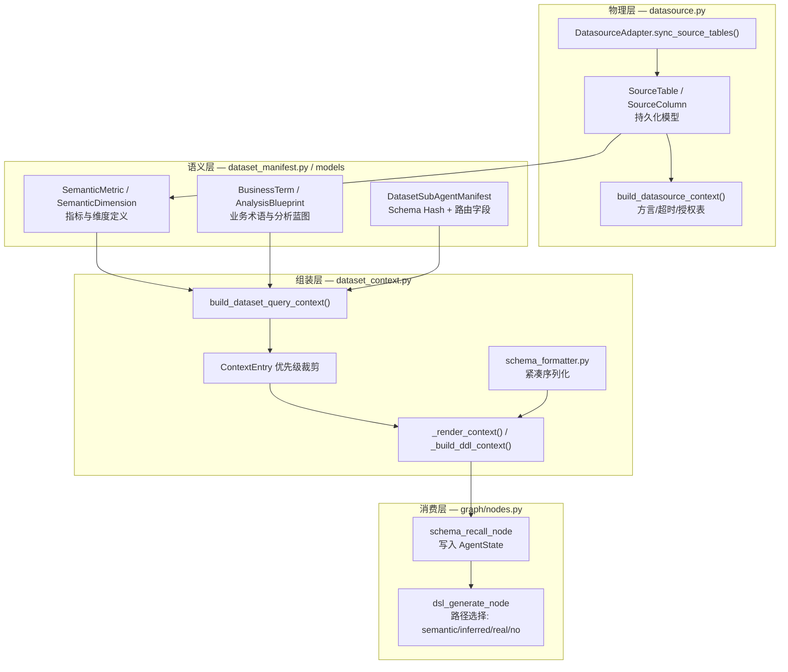
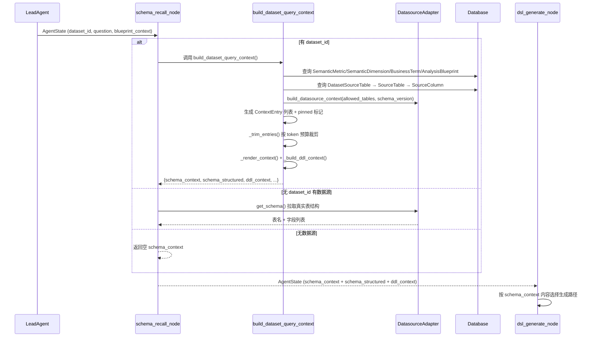

在 NL2DSL2SQL 管道中，Schema 召回与问数上下文组装位于 LangGraph 工作流的第二节点——紧随 LeadAgent 入口路由之后、DSL 生成之前。它的核心使命是将"用户想查什么"（意图）与"数据源里有什么"（Schema）精确对接，生成 LLM 能消费的、经过 token 预算裁剪的结构化提示词上下文。这一层本质上回答了三个问题：**有哪些表和字段可用？语义层中的指标/维度/术语/蓝图如何映射到物理 Schema？如何在 LLM 上下文窗口限制内保留最关键的资产？**

Sources: [nodes.py](app/graph/nodes.py#L1459-L1506)

## 分层架构概览

Schema 召回并非单一操作，而是一个由底层到上层逐步抽象的**三层管道**：物理 Schema 探查 → 语义层资产加载 → 问数上下文组装。每一层都产生独立的输出形态，服务于 DSL 生成链路中不同的路径分支。

Sources: [datasource.py](app/services/datasource.py#L268-L300) [dataset_context.py](app/services/dataset_context.py#L598-L734) [nodes.py](app/graph/nodes.py#L1459-L1555)

物理层承担 Schema 探查职责——`DatasourceAdapter` 通过 SQLAlchemy Inspector 拉取外部数据源的真实表结构、字段类型和样例值，并持久化到 `SourceTable` 与 `SourceColumn` 模型。语义层则以数据集为粒度组织指标（`SemanticMetric`）、维度（`SemanticDimension`）、业务术语（`BusinessTerm`）和分析蓝图（`AnalysisBlueprint`），这些资产通过 Manifest 的 Schema Hash 与物理 Schema 版本绑定。组装层将两层数据融合为一个统一的 `prompt` 文本、一个结构化对象和一个 DDL 文本，按 token 预算裁剪后注入 `AgentState` 的 `schema_context`、`schema_structured`、`ddl_context` 等字段。

Sources: [datasource.py](app/services/datasource.py#L268-L330) [dataset.py](app/models/dataset.py#L31-L170) [state.py](app/graph/state.py#L47-L55)

## 物理 Schema 探查：多方言适配与字段采样

物理 Schema 的获取由 `DatasourceAdapter` 基类及其子类（`OracleAdapter`、`HiveAdapter`）完成。系统通过 `CAPABILITIES` 字典注册了 PostgreSQL、MySQL、SQLite、Oracle、Hive、ClickHouse、SQL Server、Trino、Presto、BigQuery 共十种数据源的能力边界，每种数据源定义了方言标识、默认端口、驱动模块、连接字符串构建规则和测试 SQL。

Sources: [datasource.py](app/services/datasource.py#L515-L638)

`sync_source_tables()` 方法是物理 Schema 探查的核心入口：它先通过 `inspector.get_table_names()` 获取表列表，再对每张表调用 `inspector.get_columns()` 获取字段名和数据类型，同时对每个字段执行 `sample_column_values()` 采集至多 5 条非空唯一样例值。这一步通过 `SELECT DISTINCT <column> FROM <table> WHERE <column> IS NOT NULL LIMIT 5` 实现，并根据不同方言适配 Oracle 的 `FETCH FIRST` 语法。样例采集失败不会中断同步，而是将失败字段记录到 `skipped` 列表并标记为 `SAMPLE_UNREADABLE` 诊断码，保证部分失败时的最大可用性。

Sources: [datasource.py](app/services/datasource.py#L268-L330) [datasource.py](app/services/datasource.py#L332-L365)

| 数据源 | 方言标识 | Schema 探查方式 | 样例采集适配 |
|--------|----------|-----------------|-------------|
| PostgreSQL / MySQL | `postgres` / `mysql` | Inspector `get_columns()` | `SELECT DISTINCT ... LIMIT` |
| SQLite | `sqlite` | Inspector `get_columns()` | `SELECT DISTINCT ... LIMIT` |
| Oracle | `oracle` | Inspector + 数据字典回退 | `FETCH FIRST ... ROWS ONLY` |
| Hive | `hive` | `SHOW TABLES` + `DESCRIBE` | `SELECT DISTINCT ... LIMIT` |
| ClickHouse / Trino | `clickhouse` / `trino` | Inspector `get_columns()` | `SELECT DISTINCT ... LIMIT` |
| BigQuery | `bigquery` | SQLAlchemy BigQuery 方言 | `SELECT DISTINCT ... LIMIT` |

Sources: [datasource.py](app/services/datasource.py#L438-L498) [datasource.py](app/services/datasource.py#L838-L878)

同步完成后，`build_datasource_context()` 将数据源的 `db_type`、`dialect`、`driver`、`allowed_tables`、`query_timeout_seconds` 和当前所选表的 `schema_version` 打包为 `DatasourceContext` 结构，供 DSL 编译节点推断 SQL 方言和 SQL 守卫校验使用。

Sources: [datasource.py](app/services/datasource.py#L721-L745)

## 语义层资产：指标、维度、术语与蓝图的统一建模

物理 Schema 是"裸表"，语义层则赋予这些表和字段以**业务含义**。数据集模型 `SemanticDataset` 通过 ORM 关系级联了四类语义资产。这些资产共同构成 LLM 理解用户问题所需的"数据字典"。

Sources: [dataset.py](app/models/dataset.py#L31-L64)

**指标（SemanticMetric）** 定义计算逻辑：`name` 作为标识符，`display_name` 作为中文展示名，`expr` 存储 SQL 聚合表达式（如 `SUM(refund_amount)`），`table_name` 指向事实表，`time_field` 声明默认时间维度，`filter_sql` 提供预置过滤条件，`synonyms` 按 JSON 数组存储同义词以支持模糊匹配。

**维度（SemanticDimension）** 定义分组和分析视角：`column_name` 指向物理字段，`join_to` 和 `join_key` 支持跨表关联，`enum_values` 预置枚举值列表，`hierarchy` 按 JSON 存储层级关系。

**业务术语（BusinessTerm）** 建立业务概念的语义锚点：`term_type` 分类为 `business_object`、`metric_alias` 等，`aliases` 与 `forbidden_aliases` 提供正反向匹配，`asset_links` 按一对多关系连接到具体的指标或维度。

**分析蓝图（AnalysisBlueprint）** 封装预置的分析模板：`trigger_keywords` 和 `trigger_examples` 用于路由匹配，`parameters` 定义用户输入参数，`implementation_type` 区分 `semantic_plan`（基于语义层生成 SQL）和 `raw_sql`（直接执行预置 SQL）。

Sources: [dataset.py](app/models/dataset.py#L66-L170)

## 问数上下文组装：`build_dataset_query_context` 全链路

这是整个模块的核心编排函数。它的输入是数据集 ID、用户问题、蓝图上下文和可选的前序资产解析结果；输出是一组四维结构的上下文包。

Sources: [dataset_context.py](app/services/dataset_context.py#L598-L640)

### 上下文条目的统一建模与优先级体系

`build_dataset_query_context` 内部将所有语义资产和物理字段统一建模为 `ContextEntry` 结构——每个条目携带 `section`（分组归属）、`text`（LLM 可读文本）、`asset_type` 与 `asset_id`（资产身份）、`priority`（基础优先级）、`pinned`（是否锁定保留）和 `original_index`（原始顺序）。

基础优先级按资产类型分层：

| 资产类型 | Priority | 分组标题 | 说明 |
|----------|----------|----------|------|
| 指标 (metric) | 90 | 【指标列表】 | 聚合计算是问数的核心目标 |
| 维度 (dimension) | 80 | 【维度列表】 | 分组和筛选的必备视角 |
| 业务术语 (term) | 70 | 【业务术语】 | 辅助语义消歧 |
| 分析蓝图 (blueprint) | 60 | 【分析蓝图】 | 预置分析模板 |
| 字段 (field) | 50 | 【所选表字段与样例】 | 最底层，量最大 |

Sources: [dataset_context.py](app/services/dataset_context.py#L280-L360)

### 资产命中识别与 Pinned 机制

条目的 `pinned` 标记决定了它在 token 裁剪时是否被强制保留。命中识别通过两个维度进行：**显式命中**（`matched_ref_keys`）来自前序节点（如 SubAgent 资产解析）已经确定的资产 ID，直接从 `matched_assets` 字典中提取 `(asset_type, asset_id)` 对；**文本命中**（`_question_hits`）通过将资产的 `name`、`display_name`、`synonyms` 等候选词归一化后与用户问题做子串匹配。两者只要其中之一满足，条目即被标记为 `pinned=True`。

Sources: [dataset_context.py](app/services/dataset_context.py#L89-L140)

这一机制保证了两类关键资产不会在上下文裁剪中被丢弃：已有证据充分匹配的语义资产（来自 SubAgent 解析链路），以及用户问题中明确提及但尚未被正式解析的资产（兜底匹配）。

### Token 预算裁剪策略

`_trim_entries()` 实现了带优先级的贪心裁剪算法。裁剪分三步：首先估算固定文本（数据集描述、约束说明、权限信息等）的 token 数作为 `fixed_tokens`；然后按 `(not pinned, -priority, original_index)` 对条目排序，确保 pinned 条目始终优先、高优先级类型优先、同优先级按原始顺序；最后从排序后的条目中贪心选取，当累计 token 数超过预算时停止选取——但 pinned 条目永远不受预算限制。

Sources: [dataset_context.py](app/services/dataset_context.py#L430-L480)

Token 估算采用粗粒度策略 `_estimate_tokens()`，按 `max(1, len(text) // 4)` 计算，对中英文混合场景取 4 字符 ≈ 1 token 的近似值。预算默认 4000 token，可通过环境变量 `DATASET_CONTEXT_TOKEN_BUDGET` 调整。

Sources: [dataset_context.py](app/services/dataset_context.py#L33-L46) [dataset_context.py](app/services/dataset_context.py#L48-L51)

### 三种输出形态的分工

`build_dataset_query_context` 同时产出三种输出：

| 输出字段 | 格式 | 消费者 | 特点 |
|----------|------|--------|------|
| `schema_context` | 纯文本 prompt | `dsl_generate_node` LLM 调用 | 按 token 预算裁剪，分节标题清晰 |
| `schema_structured` | 结构化 dict | DSL 编译器、资产引用校验 | 完整不裁剪，含结构化元数据 |
| `ddl_context` | DDL 风格文本 | 推断路径（`build_inferred_system`） | 按表组织字段，内联角色标签和样例 |

Sources: [dataset_context.py](app/services/dataset_context.py#L660-L734)

`schema_context` 的文本渲染遵循固定模板：先输出数据集基本信息（名称、描述、`tables_json`），接着追加查询约束（时间范围默认 30 天、默认 LIMIT 100），然后按 `metrics → dimensions → terms → blueprints → fields` 顺序渲染保留条目，最后附加权限声明。

Sources: [dataset_context.py](app/services/dataset_context.py#L482-L540)

`ddl_context` 是推断路径专用的替代品。当语义层中指标定义不完整时，LLM 需要在 DDL 风格的表结构描述中自行推断字段用途和聚合方式。它的格式与 `schema_context` 不同：以表为分组单元，每表列出字段名、数据类型、描述和语义角色标签（如 `[M,SUM]` 表示 metric_candidate 且默认聚合为 SUM）。

Sources: [dataset_context.py](app/services/dataset_context.py#L542-L596)

## Schema 紧凑序列化：`schema_formatter.py`

`format_fields_compact()` 将结构化字段列表转换为紧凑单行文本，每条格式为 `name:TYPE "描述(样例a/样例b)" [role_code,agg] 样例=...`。其核心优化包括：**过滤 unused 角色字段**（`UNUSED_ROLES = {"unused"}`），避免无意义的系统字段污染 prompt；**枚举维度内联样例**——当字段角色为 `dimension_candidate` 且枚举值 ≤ 6 个时，将样例值直接嵌入描述括号中（如 `"状态(待审核/已通过/已驳回)"`），减少独立样例标签的冗余；**非枚举字段限制 3 个样例**。

Sources: [schema_formatter.py](app/utils/schema_formatter.py#L1-L86)

角色码映射表将语义角色压缩为单字符标签：`metric_candidate` → `M`、`dimension_candidate` → `D`、`time_field` → `T`、`id_field` → `I`。指标字段还会附加默认聚合后缀（如 `[M,SUM]`），告知 LLM 应该使用哪种聚合函数。

Sources: [schema_formatter.py](app/utils/schema_formatter.py#L18-L28)

## LangGraph 节点集成：`schema_recall_node`

`schema_recall_node` 是连接上下文组装与工作流引擎的桥梁。它是一个闭包工厂函数，接收 `db: Session` 生成 LangGraph 节点函数。节点内部的执行逻辑分三条路径：

**路径一（有 dataset_id 且数据集存在）**：调用 `build_dataset_query_context()` 走完整的语义层上下文组装链路，并将返回的所有字段（`schema_context`、`schema_structured`、`ddl_context`、`query_constraints`、`datasource_context`、`dataset_prompt_instructions`）直接 merge 到 `AgentState` 中。

**路径二（无 dataset_id 但有已连接数据源）**：跳过语义层，直接从数据源拉取真实表结构，生成 `【数据源真实表结构】` 文本。这条路径适用于未创建数据集但配置了数据源的场景，DSL 生成时将走 `build_real_schema_system` 路径直接生成 SQL。

**路径三（无 dataset_id 且无数据源）**：返回空的 `schema_context`，DSL 生成将走 `build_no_schema_system` 路径让 LLM 自由猜测 SQL。

Sources: [nodes.py](app/graph/nodes.py#L1459-L1555)

节点执行后，`AgentState` 中以下字段被填充：`schema_context`、`schema_structured`、`ddl_context`、`query_constraints`、`dataset_context_debug`、`datasource_context`、`dataset_prompt_instructions`、`schema_tokens`。其中 `dataset_context_debug` 包含完整的裁剪诊断信息（资产计数、保留计数、pinned 资产列表、裁剪详情），供日志和前端审计使用。

Sources: [state.py](app/graph/state.py#L47-L55) [dataset_context.py](app/services/dataset_context.py#L678-L734)

在 DSL 生成节点中，`schema_context` 的内容决定了生成路径的选择：包含 `【语义层】` 标记则走语义路径（生成 NL2DSL v2 JSON），包含 `【数据源真实表结构】` 标记则走真实 Schema 路径（直接生成 SQL），为空则走无 Schema 路径（LLM 猜测）。

Sources: [nodes.py](app/graph/nodes.py#L1573-L1600)

## Manifest 与 Schema 版本绑定

`DatasetSubAgentManifest` 将语义层资产的完整快照通过 SHA256 哈希生成 `bound_schema_version`（16 位十六进制字符串）。`build_dataset_schema_version()` 以数据集 ID 为入参，将指标列表（name、expr、table_name 等）、维度列表（name、column_name、table_name 等）和所选表字段（column_name、data_type、semantic_role 等）序列化为 JSON，再取哈希值。

Sources: [dataset_manifest.py](app/services/dataset_manifest.py#L75-L150)

当物理 Schema 发生变化（表增减、字段变更）或语义资产被修改后，新计算的 Schema Hash 与 Manifest 绑定的版本不匹配时，Manifest 的 `review_status` 被标记为 `needs_review`，运行时门禁 `evaluate_manifest_runtime_guard()` 会返回 `manifest_stale` 阻断。这确保了每次问数查询使用的语义层上下文都与 Manifest 发布时的资产状态一致。

Sources: [dataset_manifest.py](app/services/dataset_manifest.py#L498-L545)

## 数据流总结

以下时序图展示了 Schema 召回与上下文组装在整个问数管道中的精确位置：

Sources: [nodes.py](app/graph/nodes.py#L1459-L1555) [dataset_context.py](app/services/dataset_context.py#L598-L734) [workflow.py](app/graph/workflow.py#L127-L130)

## 延伸阅读

完成 Schema 召回后，DSL 生成节点将根据上下文类型选择不同的生成路径。详见 [DSL 生成、校验与 SQL 编译的逐节点实现](13-dsl-sheng-cheng-xiao-yan-yu-sql-bian-yi-de-zhu-jie-dian-shi-xian)。物理 Schema 的探查能力由数据源连接引擎提供，详见 [多数据源连接引擎：方言适配、Schema 探查与能力注册](27-duo-shu-ju-yuan-lian-jie-yin-qing-fang-yan-gua-pei-schema-tan-cha-yu-neng-li-zhu-ce)。语义资产（指标、维度、术语、蓝图）的候选召回和查询规划请参考 [候选资产召回：多类型语义资产的统一检索与置信度排序](16-hou-xuan-zi-chan-zhao-hui-duo-lei-xing-yu-yi-zi-chan-de-tong-jian-suo-yu-zhi-xin-du-pai-xu) 和 [查询规划器：Planner 决策、Detail Loop 与降级策略](17-cha-xun-gui-hua-qi-planner-jue-ce-detail-loop-yu-jiang-ji-ce-lue)。