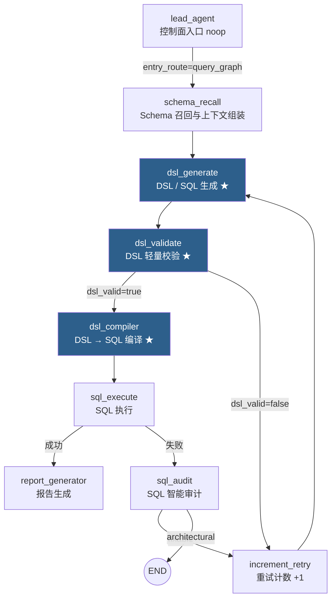
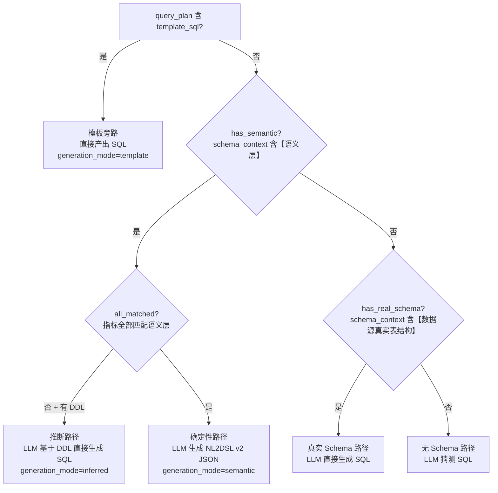
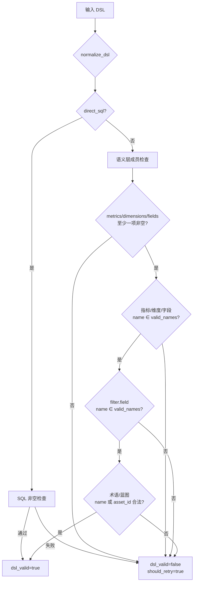
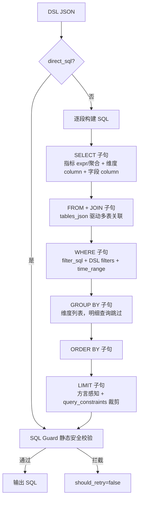
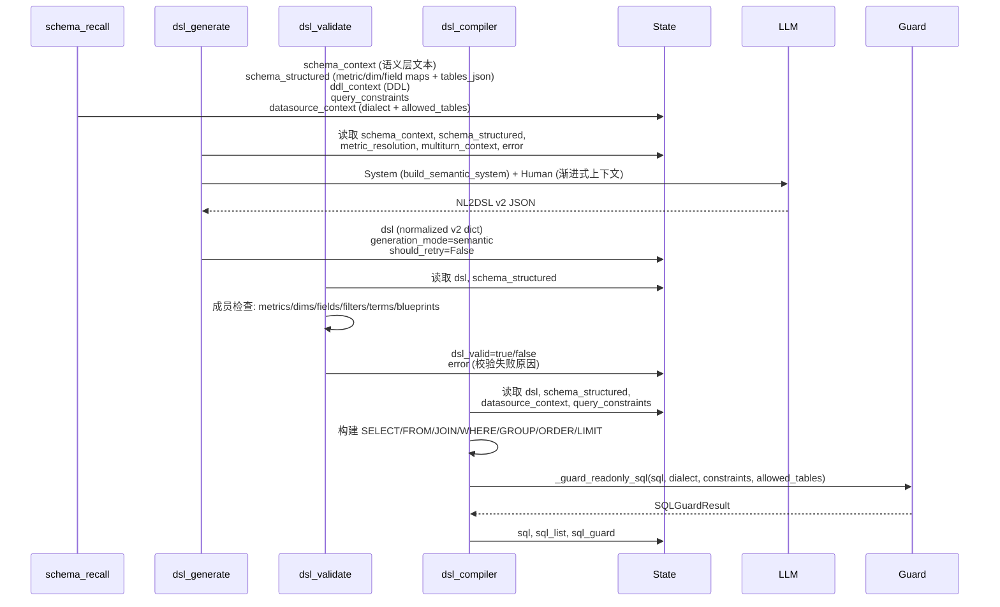

本文聚焦 Datalogue 数据面（Data Plane）中三个紧密协作的 LangGraph 节点——**DSL 生成**、**DSL 校验**与 **DSL 编译器**——剖析它们如何将上游 Schema 召回产出的语义层上下文转化为可安全执行的方言感知 SQL。同时涵盖前序 Schema 召回节点的输入准备、SQL Guard 的安全拦截层以及贯穿全局的重试环路机制。

## 数据面节点全景与工作流定位

在 LangGraph 工作流中，数据面节点承接控制面（LeadAgent / SubAgent 规划）的决策结果，沿固定拓扑串联执行。以下 Mermaid 图展示从 Schema 召回到报告生成的完整链路，其中本文聚焦的三个节点以深色标注：

工作流装配代码在 `build_workflow` 中注册 9 个节点并按上述拓扑建立边和条件路由。入口 `lead_agent` 是 noop 节点，真正的工作流主线从 `schema_recall` 开始沿 `dsl_generate → dsl_validate → dsl_compiler → sql_execute` 流水线推进。

Sources: [workflow.py](app/graph/workflow#L114-L218)

## Schema 召回：为 DSL 生成准备输入上下文

`dsl_generate_node` 是一个纯函数节点，它**不感知数据库**——所有 Schema 信息必须由前序 `schema_recall_node` 预先注入 `AgentState`。Schema 召回按数据集配置产出三类关键上下文：

| 状态字段 | 来源 | 说明 |
|---|---|---|
| `schema_context` | 数据集语义层元数据组装 | 带 `【语义层】` 或 `【数据源真实表结构】` 标记的文本 |
| `schema_structured` | 数据集指标/维度/字段/术语/蓝图的结构化字典 | 编译器直接使用的 `metric_map`、`dim_map`、`field_map`、`tables_json` |
| `ddl_context` | 数据集所选源表的真实 DDL（含列注释） | 推断路径和 SQL 审计的核心输入 |
| `query_constraints` | 数据集级配置 + 系统默认值 | 默认时间范围 30 天、默认 LIMIT 100、最大 LIMIT 1000 |
| `datasource_context` | 数据源连接元信息 | 方言 (`dialect`)、授权表 (`allowed_tables`)、超时等 |

当 `dataset_id` 缺失时，Schema 召回退化为从已连接数据源拉取真实表结构，标记 `【数据源真实表结构】`。`query_constraints` 由 `normalize_query_constraints` 合并数据集配置与系统默认值，默认 `enabled=True`，为 DSL 生成和 SQL Guard 提供统一的行数限制与时间范围默认值。

Sources: [nodes.py](app/graph/nodes#L1459-L1563), [query_constraints.py](app/utils/query_constraints#L1-L65)

## DSL 生成节点：四条生成路径的决策树

`dsl_generate_node` 是整个数据面链路中逻辑最复杂的节点。它根据 Schema 召回的结果和 SubAgent 查询规划，在**四条路径**中选择一条执行：

### 路径 0：模板旁路（Template Bypass）

当 SubAgent 的 `query_plan` 中提供了 `sql_template` 时，`dsl_generate_node` 直接跳过 LLM 调用，将模板 SQL 包装为 `direct_sql` 并同步写入 `dsl`、`sql`、`sql_list`。这是**零 Token 消耗**的最短路径，适用于精确匹配的分析蓝图执行场景。

Sources: [nodes.py](app/graph/nodes#L1598-L1611)

### 路径 1：确定性语义路径（Deterministic Semantic）

当所有指标均在语义层中有定义（`all_matched=True`）时，节点使用 `build_semantic_system` 构造 System Prompt，要求 LLM 输出**符合 NL2DSL v2 JSON Schema 的结构化 DSL**。提示词强制 LLM：严格使用语义层 `name` 和 `asset_id`；未找到 ID 时填 `null` 不编造；歧义词写入 `ambiguities`。

关键上下文注入包括：
- **渐进式语义上下文**（`_format_progressive_semantic_context`）：按 L0（数据集与任务）→ L1（硬约束）→ L2（可引用资产目录）→ L3（召回预算摘要）分层披露，避免注入冗余 schema_context
- **资产目录**（`_format_dsl_asset_catalog`）：将指标/维度/字段/术语/蓝图的 `name`、`asset_id`、`expr`、`table_name`、`time_field` 整理为紧凑文本，fields 按 QueryPlan 已选表/字段裁剪以控制 token 预算
- **指标解析文本**：将 `metric_resolution` 中每个用户实体到语义层 `name` 的映射关系显式告知 LLM

LLM 输出的 JSON 经 `normalize_dsl` 规范化为 v2 字典（兼容旧版字符串格式），但**不在此阶段生成 SQL**——SQL 编译交由下游 `dsl_compiler` 完成。

Sources: [nodes.py](app/graph/nodes#L1764-L1906), [dsl.py](app/schemas/dsl#L140-L231), [dsl_generate.py](app/prompts/dsl_generate#L34-L73)

### 路径 2：推断路径（Inferred）

当部分指标未在语义层中定义（`all_matched=False`）但数据集已选择表（`ddl_context` 非空）时，节点使用 `build_inferred_system` 要求 LLM 基于**真实 DDL** 自由推断合适的字段和聚合方式，直接输出 SQL JSON。此路径产出的 DSL 标记 `inferred=True`，前端可据此展示"推断生成"徽标。

特别地，若数据集未选择任何表（DDL 包含 `"该数据集尚未选择任何表"`），节点直接返回不可重试错误，避免 LLM 凭空猜测。

Sources: [nodes.py](app/graph/nodes#L1672-L1763)

### 路径 3：真实 Schema 路径与无 Schema 路径

当 `schema_context` 不含语义层但含 `【数据源真实表结构】` 时，进入真实 Schema 路径，LLM 直接生成 SQL。当两者皆无时，进入无 Schema 路径，LLM 在没有任何表结构信息的情况下猜测 SQL——这是最后的兜底策略，生成质量取决于模型能力。

Sources: [nodes.py](app/graph/nodes#L1613-L1670), [nodes.py](app/graph/nodes#L1906-L1939)

### 四条路径输出对比

| 路径 | generation_mode | dsl 字段 | sql 是否预先填充 | LLM 调用 |
|---|---|---|---|---|
| 模板旁路 | template | `direct_sql` | 是 | 否 |
| 确定性语义 | semantic | NL2DSL v2 JSON | 否（由 compiler 编译） | 是 |
| 推断 | inferred | `direct_sql` + `inferred: true` | 是 | 是 |
| 真实 Schema | — | `direct_sql` | 是 | 是 |
| 无 Schema | — | `direct_sql` | 是 | 是 |

## DSL 校验节点：轻量级成员检查的分层设计

`dsl_validate_node` 的设计哲学是**"基础校验毫秒级拦截 80% 的 LLM 瞎填错误，深度判断下放给 sql_audit"**。该节点仅做轻量级 name 集合成员检查，不涉及 DDL 列名验证、JOIN 字段匹配或 SQL 语法分析：

### 校验逻辑详解

**valid_names 构建**：优先从 `schema_structured` 提取指标、维度、字段的 `name` 集合；回退时从 `schema_context` 文本正则提取。术语和蓝图额外构建 `valid_ids` 集合，支持按 `asset_id` 精确校验。

**dsl_validate_node 关键步骤**：
1. `direct_sql` 模式：仅检查 SQL 字符串非空，通过即放行
2. `【数据源真实表结构】` 模式：同上
3. 语义层 DSL：检查 `metrics` + `dimensions` + `fields` 至少一项非空；逐一校验每项 name ∈ valid_names；校验 `filters[].field` 的 name 合法性；校验 `terms` 和 `blueprints` 的 `asset_id` 或 `name` 是否存在

**故意放行的场景**（深度判断交由 `sql_audit`）：
- `time_range.field` 是否等于指标声明的 `time_field`
- DDL 列名是否真实存在
- `filter_sql` 中的 `!= null` 非标语法
- JOIN 字段是否匹配

这种设计使得校验节点几乎总是通过，确保业务逻辑错误能被 SQL 执行后的 `sql_audit_node` 携带完整 DDL 和样例数据进行语义级诊断，重试命中率显著优于在 DSL 层盲猜。

Sources: [nodes.py](app/graph/nodes#L1940-L2074), [DSL校验节点改造方案.md](docs/DSL校验节点改造方案#L1-L60)

## DSL 编译器节点：从结构化 DSL 到方言感知 SQL

`dsl_compiler_node` 是纯代码实现的确定性编译器（不调 LLM），将 NL2DSL v2 JSON **逐字段翻译**为标准 SQL。它是工厂函数（接收 `db: Session` 推断方言），返回闭包节点函数。

### 方言推断

编译器通过 `datasource_context["dialect"]` 或 `_resolve_dialect(db, dataset_id)` 推断目标数据源方言。方言决定两件事：
- **identifier 引号**：Postgres / Oracle 用双引号 `"name"`；MySQL / SQLite / Hive / Trino / BigQuery 用反引号 `` `name` ``；SQL Server 用方括号 `[name]`
- **LIMIT 语法**：Oracle 输出 `FETCH FIRST n ROWS ONLY`；SQL Server 由 SQL Guard 补齐 `TOP`；其余方言输出 `LIMIT n`

Sources: [sql_dialect.py](app/utils/sql_dialect#L1-L56), [nodes.py](app/graph/nodes#L2076-L2100)

### 编译流水线

### SELECT 子句构建

编译器按 `metrics → dimensions → fields` 顺序构建 SELECT 列表：

- **指标**：从 `metric_map` 读取 `expr`（如 `SUM(amount)`），直接作为选择表达式，别名用指标名
- **指标 fallback**：若指标不在 metric_map 中但在 field_map 中，使用 `default_agg` 自动包裹聚合函数（如 `SUM(column)`）；`default_agg=NONE` 时不聚合
- **维度**：从 `dim_map` 读取 `table_name.column_name`，输出带表限定符的列引用
- **字段**（明细查询）：与维度处理逻辑一致，但不下钻聚合

**明细查询检测**：`is_detail_query = (not metrics) and (fields or dimensions)`——无指标但有维度/字段时，不生成 GROUP BY，直接取原始行。

Sources: [nodes.py](app/graph/nodes#L2185-L2280)

### FROM + JOIN 构建

`tables_json` 是 `schema_structured` 中的结构化表关系定义，包含 `tables`（表名与别名）和 `joins`（JOIN 关系）。编译器：
1. 以 `tables[0]` 为主表（或从第一个指标的 `table_name` 推断）
2. 遍历 `joins` 列表，仅当右侧表被 `used_tables` 引用时才加入 JOIN 子句
3. JOIN 类型默认为 `LEFT JOIN`，ON 条件从 `left_key` / `right_key` 读取

这种设计避免了"所有表全 JOIN"导致的无意义笛卡尔积。

Sources: [nodes.py](app/graph/nodes#L2290-L2340)

### WHERE 子句与时间范围处理

WHERE 由三部分拼接：
1. **指标内置过滤**：从 `metric_map[].filter_sql` 读取，经 `sanitize_filter_sql` 将 `!= null` → `IS NOT NULL` 后再包裹括号
2. **DSL filters**：按 `op` 类型（`eq`/`in`/`gt`/`gte`/`lt`/`lte`/`neq`/`between`）生成对应 SQL 比较表达式
3. **时间范围**：优先使用 DSL `time_range.field`；若该字段不在指标声明的 `valid_time_fields` 中，强制回退到第一个指标的 `time_field`；若 DSL 未指定时间范围且 `query_constraints.enabled=True`，自动追加最近 N 天默认范围

Sources: [nodes.py](app/graph/nodes#L2342-L2420)

### LIMIT 与查询约束

最终 LIMIT 经过三层裁剪：
1. DSL 指定值优先
2. 未指定时取 `query_constraints.default_limit`（默认 100）
3. 与 `query_constraints.max_limit`（默认 1000）取最小值

编译器编译完毕后，SQL 字符串经 `_guard_readonly_sql` 做最终安全校验（详见下文 SQL Guard）。

Sources: [nodes.py](app/graph/nodes#L2438-L2474)

## SQL Guard：编译器输出的最终安全防线

`_guard_readonly_sql` 是 SQL 执行前的**静态安全校验函数**，所有四条 DSL 生成路径的 SQL 都必须通过它才能执行。它不连接数据库，仅做语法和结构层面的判断：

| 检查层 | 方法 | 拦截内容 |
|---|---|---|
| 文本层 | 去注释 + 屏蔽字符串 → 关键字扫描 | INSERT/UPDATE/DELETE/DROP/ALTER/CREATE/TRUNCATE/MERGE 等 |
| 文本层 | 正则模式匹配 | `INTO OUTFILE`、`COPY PROGRAM`、`SLEEP()`、`BENCHMARK()` 等 |
| AST 层 | SQLGlot 按目标方言解析 | DML/DDL 节点识别、多语句检测、非 SELECT/WITH 拒绝 |
| 语义层 | AST 表名提取 → 与 `allowed_tables` 比对 | 跨表越权访问 |
| 约束层 | AST LIMIT 节点识别 → 按 `query_constraints` 补齐/裁剪 | 无 LIMIT 自动补充；超出 max_limit 自动裁剪 |

Guard 通过后返回 `SQLGuardResult(ok=True, normalized_sql=...)`——其中 `normalized_sql` 可能已由 SQLGlot 按目标方言重写（例如 SQL Server 自动补齐 `TOP`）。若 Guard 拦截，编译器直接返回 `should_retry=False`，终止流程。

Sources: [sql_guard.py](app/utils/sql_guard#L1-L419), [nodes.py](app/graph/nodes#L2102-L2124)

## 重试环路：连接三个节点的控制面契约

DSL 生成 → 校验 → 编译的三个节点通过 `AgentState` 中的控制字段与工作流路由形成闭环：

| AgentState 字段 | 写入节点 | 读取节点 | 作用 |
|---|---|---|---|
| `retry_count` | increment_retry (+1) | dsl_validate 路由器、dsl_generate | 限制最大重试次数 |
| `max_retry_count` | 工作流入口初始化 | 同上 | 上限（默认 3，环境变量 `SQL_MAX_RETRY_COUNT` 可配） |
| `should_retry` | dsl_validate、dsl_compiler、sql_audit | 路由器 | 是否触发重试 |
| `error` | dsl_validate、dsl_compiler、sql_audit | dsl_generate | 重试时注入 prompt 作为修正提示 |
| `dsl_valid` | dsl_validate | _dsl_validation_router | 决定路由到 compiler 或 retry |

**重试流向**：`dsl_validate` 校验失败 → `increment_retry`（计数 +1）→ 回到 `dsl_generate`（携带 `error` 文本让 LLM 修正）。编译阶段的 SQL Guard 拦截直接终止（`should_retry=False`），不进入重试循环——因为 Guard 拦截的是危险 SQL 或越权访问，LLM 重试无法修复。

SQL 执行失败后的重试由 `sql_audit_node` 接管，区分 `fixable`（可重试，回到 dsl_generate）和 `architectural`（终止，提示用户修数据集），两个层级共享同一 `retry_count` 预算。

Sources: [nodes.py](app/graph/nodes#L1565-L1580), [workflow.py](app/graph/workflow#L66-L106), [nodes.py](app/graph/nodes#L2705-L2890)

## 数据流全景：State 字段在三个节点间的传递契约

以下 Mermaid 序列图展示一次典型确定性语义路径中，四个核心节点如何通过 `AgentState` 交换数据：

## 与相邻文档的关系

本文覆盖的 DSL 生成、校验与编译是数据面处理管道的核心三段。前置环节 [Schema 召回与数据集问数上下文组装](12-schema-zhao-hui-yu-shu-ju-ji-wen-shu-shang-xia-wen-zu-zhuang) 决定了 DSL 生成的路径选择；后续环节 [SQL 执行守卫：静态安全校验、方言适配与自动修复审计](14-sql-zhi-xing-shou-wei-jing-tai-an-quan-xiao-yan-fang-yan-gua-pei-yu-zi-dong-xiu-fu-shen-ji) 详述了 SQL Guard 的完整实现与 `sql_audit_node` 的审计逻辑；[报告生成与回答解释](15-bao-gao-sheng-cheng-yu-hui-da-jie-shi-cong-cha-xun-jie-guo-dao-zui-zhong-zi-ran-yu-yan-shu-chu) 则覆盖了链路末端的自然语言输出。DSL 的 v2 资产引用 Schema 设计详见 [DSL 中间表示：v2 资产引用 Schema 设计与规范化](8-dsl-zhong-jian-biao-shi-v2-zi-chan-yin-yong-schema-she-ji-yu-gui-fan-hua)。