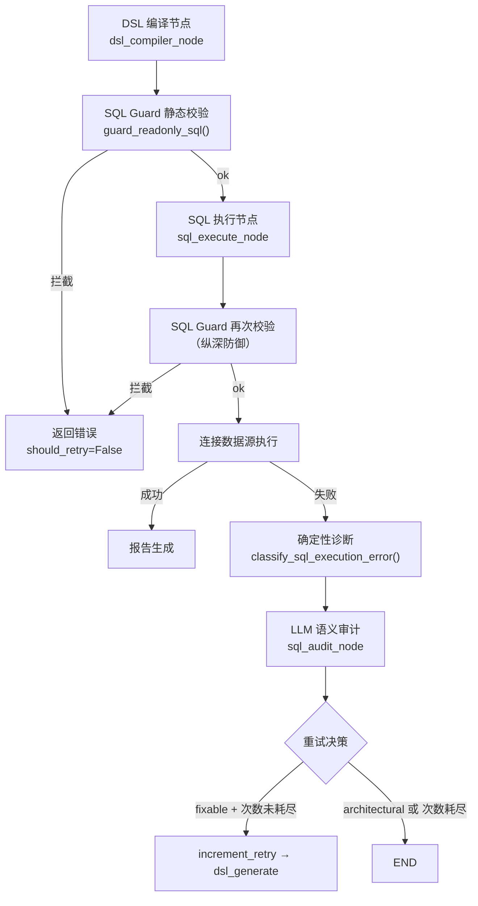
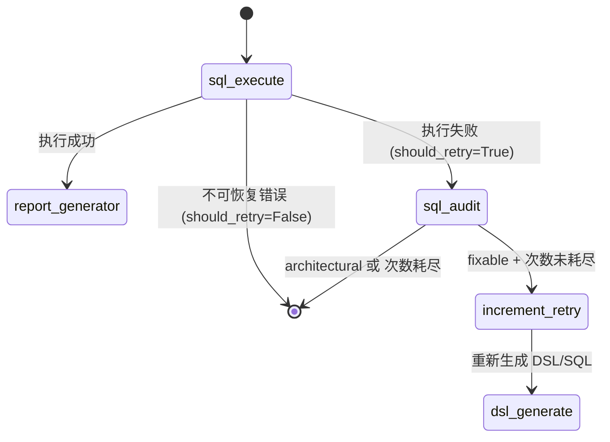

本文档系统性地剖析 Datalogue 平台中 SQL 执行前的多层安全防护体系——从静态安全校验、跨方言规范化到执行失败后的确定性诊断与 LLM 增强审计，完整覆盖"预防—拦截—诊断—修复—重试"的全闭环链路。面向需要理解 SQL 安全边界、自定义方言策略或集成外部数据源的进阶开发者。

Sources: [nodes.py](app/graph/nodes.py#L1-L50)

## 架构概览：三层防御与闭环修复

SQL 执行守卫并非单一模块，而是由三个独立且职责分明的层次构成的纵深防御体系。第一层是**编译期静态安全校验**（`sql_guard.py`），在 SQL 文本生成后、送入数据源引擎前，通过注释剥离、关键字扫描、AST 解析和表白名单校验，确保只有合法的只读查询才能通过；第二层是**方言感知的规范化处理**（`sql_dialect.py`），负责解决跨数据源的引号差异、空值比较非标语法和 LIMIT 语句的方言适配；第三层是**执行失败后的智能审计闭环**（`sql_diagnosis.py` + `prompts/sql_audit.py`），通过确定性规则分类错误、LLM 补充语义级根因、并做出"可自动修复"或"需人工介入"的二元决策，驱动 LangGraph 工作流的重试或终止。

这三层之间的关系并非线性串联，而是交织在工作流的多个节点中：`dsl_compiler_node` 在编译后调用守卫，`sql_execute_node` 在执行前再次调用守卫（纵深防御），`sql_audit_node` 在失败时接管诊断与重试决策。以下架构图展示了数据流与控制流的完整路径：



Sources: [workflow.py](app/graph/workflow.py#L150-L210), [nodes.py](app/graph/nodes.py#L2090-L2170)

## 第一层：静态安全校验（sql_guard）

`guard_readonly_sql()` 是整个系统的安全守门人——在任何 SQL 文本触及数据源引擎之前，它必须通过七道独立检查。该函数完全无状态、无副作用，不建立数据库连接，仅基于文本分析和 SQLGlot AST 解析做出决策。

Sources: [sql_guard.py](app/utils/sql_guard.py#L332-L420)

### SQLGuardResult：结构化校验结果

所有校验结果统一封装为 `SQLGuardResult` 数据类，包含以下字段：

| 字段 | 类型 | 说明 |
|------|------|------|
| `ok` | `bool` | 校验是否通过 |
| `normalized_sql` | `str \| None` | 通过时返回规范化后的 SQL（含 LIMIT 补齐/裁剪） |
| `code` | `str \| None` | 失败时的错误码：`EMPTY_SQL`、`MULTI_STATEMENT`、`FORBIDDEN_KEYWORD`、`NOT_READONLY`、`DANGEROUS_FUNCTION`、`INTO_OUTFILE`、`COPY_PROGRAM`、`PARSE_ERROR`、`DIALECT_UNSUPPORTED`、`SQL_GUARD_BLOCKED` |
| `error` | `str \| None` | 人类可读的错误描述 |
| `keyword` | `str \| None` | 触发的危险关键字或函数名 |
| `warnings` | `list[str]` | 非致命警告（如自动补齐 LIMIT） |

Sources: [sql_guard.py](app/utils/sql_guard.py#L30-L38)

### 七道校验流程

`guard_readonly_sql()` 内部执行以下顺序化检查，任何一步失败即短路返回：

**第一步：空值检查。** 输入 SQL 为空或仅含空白字符时，直接返回 `EMPTY_SQL` 错误。

**第二步：方言归一化。** 通过 `DIALECT_ALIASES` 映射表将用户输入的方言别名（如 `pgsql`、`mssql`、`presto`）归一化为 SQLGlot 可识别的标准名称：

| 输入别名 | 归一化结果 |
|----------|-----------|
| `postgresql`、`pgsql` | `postgres` |
| `mariadb` | `mysql` |
| `sqlserver`、`mssql` | `tsql` |
| `presto` | `trino` |

**第三步：注释剥离。** `_strip_comments()` 函数手动遍历 SQL 文本，识别并移除 `--` 行注释和 `/* */` 块注释，同时保持字符串字面量和引用标识符的完整性——这是防止攻击者在注释中藏匿危险关键字的第一道防线。

**第四步：filter_sql 空值规范化。** 调用 `sanitize_filter_sql()` 将 Python 风格的 `!= null` 和 `= null` 替换为标准的 `IS NOT NULL` 和 `IS NULL`，避免 LLM 在 row-level filter 中生成非标语法。

Sources: [sql_guard.py](app/utils/sql_guard.py#L95-L155), [sql_dialect.py](app/utils/sql_dialect.py#L70-L82)

**第五步：基于掩码文本的字符串扫描。** `_mask_quoted_content()` 将所有字符串字面量和引用标识符替换为空格，生成"掩码文本"。随后在该文本上执行三项扫描：

1. **多语句检测**：按 `;` 拆分后检查非空语句片段数量，超过 1 个即拦截（`MULTI_STATEMENT`）
2. **危险关键字扫描**：使用正则 `\b{keyword}\b` 匹配 `FORBIDDEN_STATEMENT_KEYWORDS` 中的所有 DML/DDL 关键字（`INSERT`、`UPDATE`、`DELETE`、`DROP`、`ALTER`、`CREATE`、`GRANT`、`REVOKE`、`TRUNCATE`、`MERGE`、`REPLACE`、`CALL`、`EXECUTE`、`VACUUM`、`ATTACH`、`DETACH`）
3. **危险模式匹配**：检测 `INTO OUTFILE` 和 `COPY ... PROGRAM` 两种文件系统交互模式
4. **危险函数扫描**：检测 `SLEEP`、`PG_SLEEP`、`BENCHMARK`、`LOAD_FILE`、`XP_CMDSHELL` 等可被利用的函数调用

**第六步：SQLGlot AST 解析与结构校验。** 使用目标方言解析 SQL 为 AST，进行更深层的安全检查：

- **AST 级危险节点检测**：遍历 AST 查找 `Insert`、`Update`、`Delete`、`Drop`、`Create`、`Alter`、`Merge`、`Command` 等表达式节点，即使关键字以非常规方式出现也能捕获
- **首 token 校验**：确认 SQL 的第一个可执行 token 是 `SELECT` 或 `WITH`
- **Query 类型校验**：确认顶层表达式是 `exp.Query` 实例，而非其他语句类型
- **AST 级危险函数检测**：递归检查 `Anonymous` 函数节点，防范 `SLEEP()` 等被包装在嵌套表达式中的攻击

**第七步：表级访问控制。** `_check_allowed_tables()` 从 AST 中提取所有物理表名（排除 CTE 名称），与 `allowed_tables` 白名单做差集运算。任何不在白名单中的表名都会触发 `SQL_GUARD_BLOCKED` 拦截，确保即便 SQL 通过了所有语法检查，也无法访问当前数据集未授权的数据源表。

Sources: [sql_guard.py](app/utils/sql_guard.py#L157-L330)

### LIMIT 行数规范化

校验通过后，`_normalize_limit_with_sqlglot()` 通过 SQLGlot AST 操作执行行数限制的补齐与裁剪，而非脆弱的正则替换：

- 若查询约束未启用（`enabled=False`），直接返回原始 SQL
- 若 SQL 尚未指定 LIMIT，自动追加 `default_limit`（默认 100）
- 若 SQL 指定的 LIMIT 超过 `max_limit`（默认 1000），通过 AST 节点替换裁剪到上限
- Oracle 方言自动使用 `FETCH FIRST N ROWS ONLY` 语法

这种方法比正则替换更可靠，因为它能正确处理子查询、UNION 和复杂嵌套中的 LIMIT 子句。

Sources: [sql_guard.py](app/utils/sql_guard.py#L304-L330), [query_constraints.py](app/utils/query_constraints.py#L16-L65)

## 第二层：方言适配（sql_dialect）

方言适配模块解决三个跨数据源的兼容性问题：方言推断、标识符引用和空值比较规范化。

### 方言推断链路

`resolve_dialect()` 实现了从 `dataset_id` 到目标方言的完整推断链路：`dataset_id → SemanticDataset → Datasource → build_datasource_context() → normalize_db_type()`。函数内置多层降级策略——数据库查询失败、数据集不存在或数据源上下文缺失时，均静默回退到 `postgres`，确保系统在任何异常情况下都有一个可工作的默认方言。

Sources: [sql_dialect.py](app/utils/sql_dialect.py#L30-L50)

### 标识符引用规则

`quote_ident()` 按方言返回正确的引用格式：

| 方言家族 | 引用格式 | 示例 |
|----------|---------|------|
| PostgreSQL、Oracle | 双引号 `"name"` | `"order_amt"` |
| MySQL、SQLite、Hive、Trino、BigQuery、ClickHouse | 反引号 `` `name` `` | `` `order_amt` `` |
| SQL Server（TSQL） | 方括号 `[name]` | `[order_amt]` |

Sources: [sql_dialect.py](app/utils/sql_dialect.py#L53-L66)

### 空值比较自动修复

LLM 在生成 row-level filter 时可能输出 Python 风格的 `!= null` 或 `= null`，这在大多数 SQL 方言中是语法错误。`sanitize_filter_sql()` 使用正则按顺序处理（先 `!=`/`<>`，再 `=`/`==`），将其替换为标准的 `IS NOT NULL` 和 `IS NULL`。该函数在 `guard_readonly_sql()` 的第四步被调用，也在 DSL 编译器的 filter_sql 拼接路径中被独立使用。

Sources: [sql_dialect.py](app/utils/sql_dialect.py#L70-L82)

## 第三层：执行失败诊断与审计闭环

当 SQL 通过了两层守卫校验但仍在数据源执行失败时，系统不会简单地将原始数据库错误抛给用户，而是启动一个由确定性规则引擎和 LLM 共同参与的智能诊断流程。

### 确定性错误分类

`classify_sql_execution_error()` 是诊断流程的"硬决策层"。它接收数据库原始错误文本、失败 SQL、DDL 上下文和语义层结构化配置，通过正则模式匹配和语义层交叉验证，输出结构化的诊断结果。其核心设计原则是：**分类、严重级别和重试策略必须是确定性的**——这些字段不能被 LLM 覆盖，LLM 只能在其基础上补充自然语言的根因解释和修复建议。

Sources: [sql_diagnosis.py](app/utils/sql_diagnosis.py#L155-L245)

系统定义了九种诊断分类，每种都绑定了明确的严重级别和重试策略：

| 诊断码 | 分类 | 严重级别 | 可重试 | 触发条件示例 |
|--------|------|----------|--------|-------------|
| `FIELD_NOT_FOUND` | schema | fixable → architectural¹ | 条件性 | `Unknown column 'xxx' in 'where clause'` |
| `TABLE_NOT_SELECTED` | dataset_config | architectural | 否 | SQL 引用表不在数据集所选表列表中 |
| `TABLE_NOT_FOUND` | schema | architectural² | 否 | `no such table: xxx` |
| `AGGREGATION_ERROR` | sql_semantics | fixable | 是 | `column must appear in GROUP BY` |
| `TYPE_ERROR` | sql_semantics | fixable | 是 | `operator does not exist: integer = text` |
| `PERMISSION_DENIED` | permission | architectural | 否 | `permission denied for table` |
| `SYNTAX_OR_DIALECT` | dialect | fixable | 是 | `syntax error at or near "LIMIT"` |
| `TIMEOUT` | performance | architectural | 否 | `statement timeout` |
| `UNKNOWN_EXECUTION_ERROR` | unknown | fixable | 是 | 无法归入以上任何分类的兜底 |

¹ `FIELD_NOT_FOUND` 存在一个关键的严重级别升级逻辑：当缺失的字段经 `_field_in_semantic_assets()` 验证确实来自语义层配置（指标的 `expr`、`time_field`、`filter_sql` 或维度的 `column_name`），则严重级别从 `fixable` 升级为 `architectural`，`retryable` 变为 `False`。这意味着"语义层配错了字段"不能靠重试 SQL 生成修复，需要用户修改数据集配置。

² `TABLE_NOT_FOUND` 存在一个降级逻辑：当 SQL 中引用的表名不在 `selected_tables` 中时，分类自动调整为 `TABLE_NOT_SELECTED`，因为问题根因是数据集未选择该表，而非表本身不存在。

Sources: [sql_diagnosis.py](app/utils/sql_diagnosis.py#L120-L155), [sql_diagnosis.py](app/utils/sql_diagnosis.py#L218-L245)

### LLM 语义审计

确定性分类完成后，`sql_audit_node` 调用 LLM（temperature=0，确保输出稳定）进行语义级深度诊断。LLM 接收的上下文极为丰富：

- 用户原始问题
- 完整 DSL JSON
- 失败 SQL 和原始错误信息
- 确定性诊断结果（告知 LLM 不要覆盖 `code`/`category`/`severity`/`retryable`）
- 语义层描述（截断至 4000 字符）
- 相关表的真实 DDL（截断至 6000 字符）
- 通过 `fetch_sample_rows()` 拉取的真实表样例数据（每表 2 行）
- 指标解析、术语归一化和语义资产解析的上下文

LLM 被要求输出一个严格的 JSON 结构：`root_cause`（20 字以内中文根因短句）、`wrong_field`（错填的字段名或 null）、`suggested_fix`（自然语言修复方向）。提示词中内置了三个 Few-shot 案例，涵盖 time_field 错填、filter_sql 空值比较非标写法和 DDL 列名不匹配三种典型场景。

Sources: [sql_audit.py](app/prompts/sql_audit.py#L1-L52), [nodes.py](app/graph/nodes.py#L2705-L2825)

### 诊断结果合并与重试决策

`merge_llm_sql_diagnosis()` 将 LLM 的自然语言输出合并到确定性诊断中。合并策略是**LLM 可补充但不可覆盖**：`root_cause` → 覆盖 `detail`、`wrong_field` → 覆盖 `wrong_field`、`suggested_fix` → 覆盖 `suggested_action`，但 `code`、`category`、`severity`、`retryable` 等硬性字段完全来自确定性诊断。

最终的重试决策逻辑在 `sql_audit_node` 内部完成：

```python
will_retry = retryable and retry_count < max_retry
```

即同时满足两个条件才触发重试：诊断为可自动修复且重试次数尚未耗尽。默认最大重试次数为 3（可通过 `SQL_MAX_RETRY_COUNT` 环境变量配置）。

Sources: [sql_diagnosis.py](app/utils/sql_diagnosis.py#L263-L288), [nodes.py](app/graph/nodes.py#L2835-L2855)

### 工作流中的路由决策

`_sql_execution_router` 和 `_sql_audit_router` 两个条件路由函数定义了 SQL 执行失败后的完整控制流：



关键设计决策：`sql_audit` 节点本身不直接增加重试计数，而是通过 `_sql_audit_router` 路由到 `increment_retry` 节点（一个纯函数，仅将 `retry_count` +1），再由 `increment_retry` 无条件路由回 `dsl_generate` 节点，启动新一轮 DSL 生成。这种设计确保了重试逻辑的单一职责和可审计性。

Sources: [workflow.py](app/graph/workflow.py#L91-L210)

## 纵深防御：编译期与执行期的双重守卫

值得特别强调的是，`guard_readonly_sql()` 在**两个独立节点中被调用**，形成纵深防御：

1. **`dsl_compiler_node`**（编译期）：在 DSL 编译为 SQL 后立即调用，拦截 LLM 生成的直接危险 SQL（如 DML 语句、多语句拼接）。所有四种编译路径（`direct_sql`、真实 Schema、推断式、语义层）都有守卫覆盖。

2. **`sql_execute_node`**（执行期）：在 SQL 即将送入数据源引擎前再次调用。这把"第二道锁"的意义在于：即便编译期的守卫被绕过（例如通过其他路径修改了 `state["sql"]`），执行期守卫仍能拦截。同时，执行期守卫使用数据源上下文中解析出的真实方言和表白名单，确保方言适配和访问控制与目标数据源的实际配置一致。

两次调用的参数差异在于：编译期使用 DSL 编译器推断的方言和 `datasource_context` 中的 `allowed_tables`，执行期则直接从 `Datasource` 对象获取真实的 `dialect` 和表结构。

Sources: [nodes.py](app/graph/nodes.py#L2105-L2170), [nodes.py](app/graph/nodes.py#L2470-L2565)

## 诊断日志持久化

所有 SQL 审计结果通过 `_write_sql_diagnosis_log()` 以 best-effort 方式写入 `sql_diagnosis_log` 表。该表记录了 `conversation_id`、`dataset_id`、原始问题、失败 SQL、原始错误、完整诊断 JSON 和重试次数，为后续的故障复盘和模式分析提供了数据基础。写入失败不会阻塞主问数流程——日志写入异常被静默捕获并记录 WARN 级别日志。

Sources: [nodes.py](app/graph/nodes.py#L2672-L2686), [conversation.py](app/models/conversation.py#L65-L76)

## 测试体系与边界覆盖

`test_sql_guard.py` 覆盖了守卫模块的全部关键路径：正常 SELECT 通过、WITH 查询通过、DML 拦截、WITH 中隐藏 DML 拦截、多语句拦截、末尾分号处理、字符串和注释中关键字不误杀、危险函数拦截、`INTO OUTFILE` 拦截、LIMIT 裁剪、Oracle `FETCH FIRST` 语法、表白名单拦截与放行、CTE 名称不被误判为未授权表。`test_sql_audit.py` 则覆盖了九种诊断码的参数化分类测试、语义层字段缺失升级为 architectural 的逻辑、fixable 场景的完整重试链路验证和 architectural 场景的正确终止验证。

Sources: [test_sql_guard.py](tests/test_sql_guard.py#L1-L175), [test_sql_audit.py](tests/test_sql_audit.py#L1-L200)

## 继续阅读

理解 SQL 执行守卫后，建议按以下路径深入：

- **上游**：[DSL 生成、校验与 SQL 编译的逐节点实现](13-dsl-sheng-cheng-xiao-yan-yu-sql-bian-yi-de-zhu-jie-dian-shi-xian) — 了解 SQL 是如何从 DSL 编译生成的，以及编译节点的四种路径
- **下游**：[报告生成与回答解释：从查询结果到最终自然语言输出](15-bao-gao-sheng-cheng-yu-hui-da-jie-shi-cong-cha-xun-jie-guo-dao-zui-zhong-zi-ran-yu-yan-shu-chu) — 了解 SQL 执行成功后如何将结果转化为用户可读的自然语言回答
- **数据源层面**：[多数据源连接引擎：方言适配、Schema 探查与能力注册](27-duo-shu-ju-yuan-lian-jie-yin-qing-fang-yan-gua-pei-schema-tan-cha-yu-neng-li-zhu-ce) — 深入了解方言适配的底层实现和 Schema 探查机制
- **工作流层面**：[LangGraph 工作流装配：节点注册、条件路由与重试逻辑](7-langgraph-gong-zuo-liu-zhuang-pei-jie-dian-zhu-ce-tiao-jian-lu-you-yu-zhong-shi-luo-ji) — 理解 SQL 守卫和审计节点在整个工作流中的位置与路由逻辑