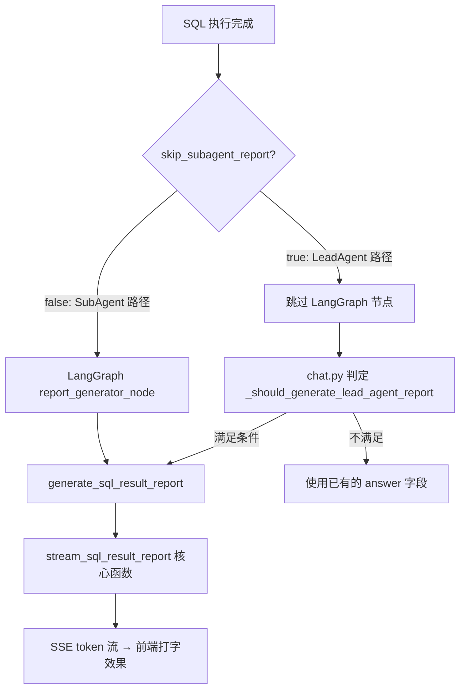
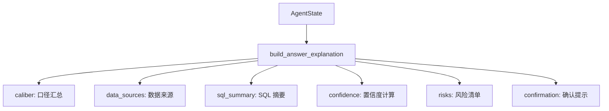

当 SQL 查询执行完毕、结果集落入内存时，系统面临最后一个关键任务：将结构化的行数据转化为用户可理解的自然语言回答。这不是简单的模板填充——系统需要区分"业务洞察生成"与"口径可信度解释"两个正交的维度，并以**打字机效果**流式推送至前端。本节从双路径报告生成架构、回答解释包的证据链组装、Think 标签过滤、Token 计量与最终 SSE 载荷封装四个层面，完整剖析查询结果到自然语言输出的端到端链路。

## 双路径报告生成架构

系统存在两条并行的报告生成路径，其选择由 LeadAgent 的路由决策在入口处一次性确定。

**路由决策如何影响报告归属**：`chat.py` 在处理请求时调用 `_report_control_for_route()`，检查两个条件——`route_decision.decision == "selected"`（LeadAgent 已选定工具）且 `payload_dataset_id is None`（用户未显式指定数据集）。二者同时满足时，`skip_subagent_report` 被置为 `True`，`report_owner` 被标记为 `"lead_agent"`，意味着 LangGraph 工作流中的 `report_generator_node` 将被跳过，改由 `chat.py` 在工作流结束后直接调用 `stream_sql_result_report()`。其他所有情况皆走 SubAgent 报告路径。

Sources: [chat.py](app/api/chat.py#L530-L538)



Sources: [nodes.py](app/graph/nodes.py#L2888-L2904), [chat.py](app/api/chat.py#L542-L553)

**SubAgent 路径**——默认路径：`report_generator_node` 是 LangGraph 工作流的最后一个节点，位于 `sql_execute` 之后（成功时）或跳过（失败时）。它调用共享函数 `generate_sql_result_report()`，并以 `observation_name="llm.report_generator"` 和 `report_owner="subagent"` 生成 Langfuse 追踪元数据。工作流边从 `report_generator → END` 直接终止。

Sources: [workflow.py](app/graph/workflow.py#L213-L214), [nodes.py](app/graph/nodes.py#L2895-L2901)

**LeadAgent 路径**——自动路由兜底：当 LeadAgent 检测到用户问题可被已配置的数据集自动回答（无需用户手动选择数据集）时，LangGraph 报告节点被跳过。工作流结束后，`_should_generate_lead_agent_report()` 进行二次校验——必须同时满足 `report_owner == "lead_agent"`、`skip_subagent_report == True`、`answer` 为空、无 `error`、且 `sql_result` 非空，才会触发 LeadAgent 报告生成。生成过程以 `observation_name="llm.lead_agent_report_generator"` 独立追踪，产生的前端 SSE 事件中 `report_owner` 被显式标记为 `"lead_agent"`。

Sources: [chat.py](app/api/chat.py#L542-L553), [chat.py](app/api/chat.py#L2275-L2332)

无论走哪条路径，核心生成逻辑收敛于同一个共享函数 `stream_sql_result_report()`，确保两路径的报告风格、压缩规则和 Token 统计完全一致。

## 核心生成函数：stream_sql_result_report

`stream_sql_result_report()` 位于 `app/services/report_generation.py`，是报告生成的唯一实现。它是一个异步生成器，产出两类事件：`{"type": "token", "content": "..."}` 用于前端打字效果，和 `{"type": "result", "answer": "...", "token_usage": {...}}` 用于最终状态合并。

**结果压缩**——上下文预算控制：在调用 LLM 之前，函数通过 `_compact_report_rows()` 对查询结果进行双重裁剪：(1) 行数上限由 `REPORT_RESULT_MAX_ROWS` 控制（默认 30，可通过 `REPORT_RESULT_MAX_ROWS` 环境变量覆盖）；(2) 单格字符串超过 `REPORT_CELL_MAX_CHARS` 时（默认 120 字符），截断并追加 `"..."`。如果被省略的行数大于 0，会在输入文本中追加提示 `"其余 N 行未展开，请基于已展开样本和总行数总结趋势"`，引导 LLM 基于样本而非完整数据进行推断。

Sources: [report_generation.py](app/services/report_generation.py#L69-L83)

**Prompt 构建**——基础指令与数据集级约束融合：系统使用 `get_prompt_manager().get_text_prompt("report_generate", fallback=...)` 从 Langfuse 拉取远程 Prompt，失败时回退到本地 `build_report_system()`。本地 Prompt 定义于 `app/prompts/report_generate.py`，核心约束包括：

| 约束维度 | 具体要求 |
|---------|---------|
| 格式 | 使用 `**加粗**` 强调关键数字和结论（Markdown 语法） |
| 结构 | 列表或分段呈现多维度分析 |
| 范围 | 正文聚焦业务结论；口径、来源、SQL 摘要和风险由系统解释包补充 |
| 安全 | 禁止输出思考过程、推理草稿或 `<think>` 标签 |
| 长度 | 最终回答控制在 1200 字以内 |

如果数据集配置了自定义 `prompt_instructions`（即数据集级 LLM 约束），它们会被追加为 `【数据集级 LLM 约束（硬性要求）】` 段落，实现**业务方对报告风格的精准控制**——例如要求"金额单位统一为万元"或"禁止使用英文缩写"。

Sources: [report_generate.py](app/prompts/report_generate.py#L1-L20)

**流式输出与 Think 过滤**：LLM 使用 `temperature=0.3` 和 `role="report"` 配置进行流式调用。每个 chunk 在经过 Think 标签过滤后（详见下文[Think 标签过滤体系](#think-标签过滤体系)）才作为 `token` 事件 yield 出去。`first_token_at` 时间戳被精确记录，用于计算 TTFT（Time to First Token）。流结束后，`results` 事件携带 `answer` 全文和合并后的 `token_usage`。

Sources: [report_generation.py](app/services/report_generation.py#L111-L266)

**Token 合并**：函数使用 `merge_token_usage()` 将本次 LLM 调用的 Token 消耗与 `state` 中已有的累积用量合并——因为一次请求可能包含多次 LLM 调用（DSL 生成、SQL 审计、报告生成），最终 `total_tokens` 反映的是整条链路的完整 Token 消耗。

Sources: [report_generation.py](app/services/report_generation.py#L227)

## 回答解释包：build_answer_explanation

报告生成解决的是"数据说了什么"（what），而回答解释包解决的是"这个回答有多可信、依据是什么"（why & how reliable）。`build_answer_explanation()` 在 `app/services/answer_explanation.py` 中定义，在工作流结束后由 `chat.py` 调用，其结果作为 `answer_explanation` 字段嵌入 `final_payload` 和 `response_metadata`。

Sources: [answer_explanation.py](app/services/answer_explanation.py#L1-L39), [chat.py](app/api/chat.py#L2388-L2389)

解释包的结构化输出（版本 `1.0`）包含六个子模块：



### 口径汇总（Caliber）

`_caliber()` 从三个数据源合并口径信息：(1) `semantic_asset_resolution` 中的 metrics、dimensions、terms、blueprints 资产命中；(2) DSL JSON 中的 `metrics`、`dimensions`、`terms`、`blueprints`、`fields`、`filters` 引用；(3) `term_normalization` 中的匹配术语和 `route_payload` 中的蓝图参数。此外还会提取 DSL 的 `time_range`、`limit` 和 `query_constraints`，完整还原"这个查询到底查了什么、按什么口径"。

Sources: [answer_explanation.py](app/services/answer_explanation.py#L169-L224)

### 数据来源（Data Sources）

`_source_from_assets()` 优先从语义资产命中中提取 `table_name`、`column_name` 和 `asset_type`，构建 `{table, column, asset_type, source: "semantic_asset"}` 结构。若语义资产为空，`_source_from_sql()` 作为兜底——用 `sqlglot` 解析 SQL AST 提取表名和列名，标记 `source: "sql_parse"`。这种双源策略确保了即使语义层未完全配置，前端仍能展示数据来源。

Sources: [answer_explanation.py](app/services/answer_explanation.py#L131-L167)

### SQL 摘要（SQL Summary）

`_sql_summary()` 使用 `sqlglot.parse_one()` 进行确定性语法解析（非 LLM），产出结构化的 SQL 特征：表列表、列列表、WHERE 子句文本、GROUP BY、ORDER BY、LIMIT，以及一个 500 字以内的 SQL 预览。如果解析失败（`parse_ok=False`），下游风险模块会追加 `sql_parse_failed` 风险码。

Sources: [answer_explanation.py](app/services/answer_explanation.py#L94-L128)

### 置信度计算（Confidence）

这是解释包中最关键的计算逻辑。`_confidence()` 从基准分 `0.92` 开始，根据风险码清单逐项扣分：

| 风险码 | 扣分 | 触发条件 |
|-------|------|---------|
| `term_conflict` | 0.35 | 业务术语存在同名或同义词冲突 |
| `workflow_error` | 0.30 | 工作流存在错误 |
| `asset_ambiguity` | 0.28 | 多个置信度接近的语义资产 |
| `no_sql_result` | 0.25 | 未成功执行 SQL |
| `unresolved_asset` | 0.20 | 部分资产未解析 |
| `inferred_sql` | 0.18 | 基于表结构推断 |
| `sql_diagnosis` | 0.18 | SQL 链路存在诊断 |
| `semantic_blueprint` | 0.10 | 语义计划蓝图仍需生成 SQL |
| `sql_retry` | 0.08 | 查询执行链路不稳定 |
| `context_trimmed` | 0.08 | 上下文被裁剪 |
| `sql_parse_failed` | 0.05 | SQL 摘要解析失败 |

此外，如果语义资产解析中存在 `ambiguities`，置信度上限被强制限制为 `0.62`；存在 `unresolved` 则上限为 `0.72`；术语存在 `has_conflict` 则上限为 `0.45`。DSL 自身的 `confidence` 字段也会参与上限钳制。最终分数被 clamp 到 `[0.05, 0.99]`，并映射为三档：`<0.75` 为 `low`，`[0.75, 0.88)` 为 `medium`，`≥0.88` 为 `high`。阈值 `0.75` 可通过 `ANSWER_EXPLANATION_LOW_CONFIDENCE_THRESHOLD` 环境变量调整。

Sources: [answer_explanation.py](app/services/answer_explanation.py#L271-L331)

### 风险清单与确认提示

`_risk_items()` 遍历工作流状态中的十余个信号位（`generation_mode`、`semantic_asset_resolution.ambiguities`、`term_normalization.has_conflict`、`sql_retry_trace`、`context_trimmed` 等），为每个触发的风险生成 `{code, message}` 对。如果置信度为 `low`，`_confirmation()` 生成面向用户的确认提示——优先使用语义歧义的 `resolution_hint`，其次列出未解析资产名称，最后使用通用兜底文案。

Sources: [answer_explanation.py](app/services/answer_explanation.py#L227-L269), [answer_explanation.py](app/services/answer_explanation.py#L333-L352)

### Markdown 渲染

`render_answer_explanation_markdown()` 将解释包渲染为可追加到最终回答末尾的 Markdown 段落，以 `### 口径与可信度` 为标题，包含口径说明、数据来源、SQL 摘要、置信度等级与分数、风险提示和确认提示。这为需要完整解释的场景（如调试模式、审计页面）提供了即用格式。

Sources: [answer_explanation.py](app/services/answer_explanation.py#L355-L415)

## Think 标签过滤体系

部分 LLM（如 DeepSeek-R1、Qwen3-Think）会在输出中生成 `<think>...</think>` 推理块。这些推理草稿不应暴露给最终用户。系统在 `app/utils/think.py` 中实现了双层过滤机制。

**非流式过滤**：`strip_think_blocks()` 使用正则表达式 `<think\b[^>]*>[\s\S]*?</think\s*>` 一次性移除所有完整 Think 块，兼容大小写和带属性的开标签（如 `<think reasoning="...">`）。

Sources: [think.py](app/utils/think.py#L28-L36)

**流式过滤**——跨 chunk 边界追踪：`filter_think_stream_chunk()` 维护一个 `{pending, in_think}` 状态机。当遇到 `<think` 开标签时，`in_think` 被置为 `True`，后续所有 chunk 内容被丢弃直到遇到 `</think>` 闭合标签。关键细节在于 `_prefix_suffix()` 函数——当 `<think` 或 `</think` 标签跨越两个 chunk 边界时（例如 chunk1 以 `"<thi"` 结尾，chunk2 以 `"nk>"` 开头），pending 缓冲区保留前缀尾部，等下一个 chunk 到来后再判定。流结束时调用 `flush_think_stream_state()` 输出未被 Think 块包裹的尾巴文本。

Sources: [think.py](app/utils/think.py#L48-L96)

**启用控制**：`_llm_thinking_enabled()` 读取 LLM 实例上的 `datalogue_thinking_enabled` 属性——当该属性为 `False` 时，所有 Think 过滤生效；为 `True` 时（默认），原始输出原样通过。这允许按模型粒度控制是否过滤思考内容。

Sources: [report_generation.py](app/services/report_generation.py#L55-L60)

## SSE 事件流与最终载荷组装

报告生成在整个 SSE 事件流中的位置取决于路径：

**SubAgent 路径**——报告作为 LangGraph 节点运行。`astream_events` 循环捕获 `on_chat_model_stream` 事件（仅限 `langgraph_node == "report_generator"`），将每个 token 作为 `{"type": "token", "content": "..."}` 推送给前端。节点完成时产生 `{"type": "step", "node": "report_generator", "status": "done"}` 事件。Think 过滤在此应用——`graph_report_think_state` 状态机在整个流程中被复用，节点结束时调用 `flush_think_stream_state()` 确保无残留。

Sources: [chat.py](app/api/chat.py#L2229-L2238), [chat.py](app/api/chat.py#L2172-L2174)

**LeadAgent 路径**——报告在 LangGraph 工作流结束后、final 事件之前运行。`chat.py` 直接迭代 `stream_sql_result_report()` 的异步生成器，token 事件直接转发为 SSE，result 事件中的 `answer` 和 `token_usage` 合并到 `final_state`。整个过程以 `lead.narrate` span 记录在 Langfuse 中。

Sources: [chat.py](app/api/chat.py#L2290-L2332)

**final 事件——最终载荷**：在所有报告生成和解释包组装完成后，`final_payload` 被构建。关键字段包括：

| 字段 | 来源 | 说明 |
|------|------|------|
| `answer` | `final_state.answer` | 最终自然语言回答（经过 Think 过滤） |
| `sql` / `sql_list` | `final_state.sql` / `sql_list` | 执行的 SQL（单条或多条） |
| `answer_explanation` | `build_answer_explanation(final_state)` | 口径、来源、置信度、风险的完整解释包 |
| `query_profile` | `_build_query_profile(...)` | 前端口径卡片数据（路由、语义、SQL 摘要、执行阶段） |
| `explainability` | `_build_explainability(...)` | `query_profile` 与 `answer_explanation` 的统一包装 |
| `report_owner` | `final_state.report_owner` | `"subagent"` 或 `"lead_agent"`，标识报告生成路径 |
| `sql_result` | 置为 `None` | **安全考虑**——原始查询结果不暴露给前端 |
| `response_metadata` | jsonable_encoder 序列化 | 持久化到 Message 的 `response_metadata` JSON 列 |

注意 `sql_result` 在 final 载荷中被显式置为 `None`——原始数据行不会通过 SSE 泄露到前端。前端仅获得 `answer` 文本和 `sql_result` 的元信息（行数、列名）通过 `query_profile` 提供。

Sources: [chat.py](app/api/chat.py#L2595-L2667)

## 智能兜底与错误回答

当 `answer` 为空时（LLM 未产出或链路失败），系统不会返回生硬的"抱歉"，而是根据失败上下文生成针对性提示：

| 条件 | 兜底回答策略 |
|------|------------|
| `generation_mode == "inferred"` 且有 `error` | 提示基于表结构推断时遇到问题，建议检查字段或定义指标 |
| `generation_mode == "inferred"` 无 `error` | 提示推断查询未能成功，建议换一种问法 |
| 有 `error` 且有 `sql_diagnosis` | 提示复核字段口径、语义层配置或数据源连接 |
| 有 `error` 且 `retry_count >= 3` | 提示多次尝试后仍未能成功 |
| 以上皆不满足 | 通用提示"暂时无法回答，请选择数据集或检查语义层配置" |

这种分层兜底策略确保用户不会在失败面前感到困惑——每一条提示都指向了具体的排查方向。

Sources: [chat.py](app/api/chat.py#L2344-L2371)

## 架构交汇：报告生成的上下游

报告生成与回答解释是整个 NL2DSL2SQL 管道的终点，但它与其他模块的交互值得关注：

```
                             ┌──────────────────────┐
                             │  report_generate.py   │
                             │  (Prompt 模板)         │
                             └──────────┬───────────┘
                                        │ build_report_system()
                                        ▼
┌──────────────┐    ┌──────────────────────────────┐    ┌─────────────────────┐
│  nodes.py    │───▶│  report_generation.py         │◀───│  answer_explanation │
│  report_     │    │  stream_sql_result_report()   │    │  .py                │
│  generator_  │    │  generate_sql_result_report() │    │  build_answer_      │
│  node        │    └──────────────┬───────────────┘    │  explanation()      │
└──────────────┘                   │                     └──────────┬──────────┘
                                   │ SSE token + result              │
                                   ▼                                ▼
                          ┌────────────────────────────────────────────┐
                          │              chat.py                        │
                          │  astream_events → SSE → final_payload       │
                          │  包含 answer + answer_explanation           │
                          └────────────────────────────────────────────┘
```

关键设计原则：**报告生成与解释生成是解耦的**。LLM 只负责"用自然语言总结数据洞察"（回答 `question`），系统代码负责"用结构化证据解释这个回答有多可靠"（解释包）。两者的分离使得：(1) LLM Prompt 可以专注于叙事质量而不被元数据污染；(2) 置信度计算完全是确定性的、可审计的；(3) 即使 LLM 报告生成失败，解释包仍然可以独立提供诊断信息。

Sources: [report_generation.py](app/services/report_generation.py#L1-L37), [answer_explanation.py](app/services/answer_explanation.py#L1-L39), [chat.py](app/api/chat.py#L2388-L2453)

---

**阅读下一步建议**：本节覆盖了从 SQL 结果到最终输出的完整链路。如果你对报告生成之前的 SQL 执行细节感兴趣，可参考 [SQL 执行守卫：静态安全校验、方言适配与自动修复审计](14-sql-zhi-xing-shou-wei-jing-tai-an-quan-xiao-yan-fang-yan-gua-pei-yu-zi-dong-xiu-fu-shen-ji)；如果你想了解回答解释包中的置信度计算所依赖的语义资产解析过程，可参考 [候选资产召回：多类型语义资产的统一检索与置信度排序](16-hou-xuan-zi-chan-zhao-hui-duo-lei-xing-yu-yi-zi-chan-de-tong-jian-suo-yu-zhi-xin-du-pai-xu)。