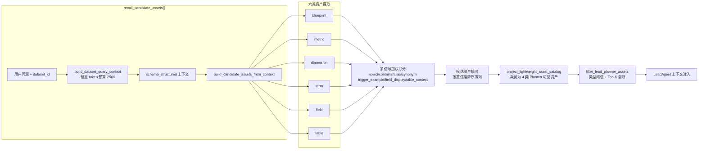
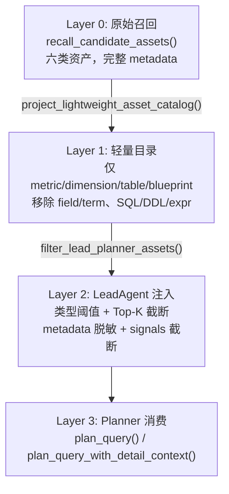
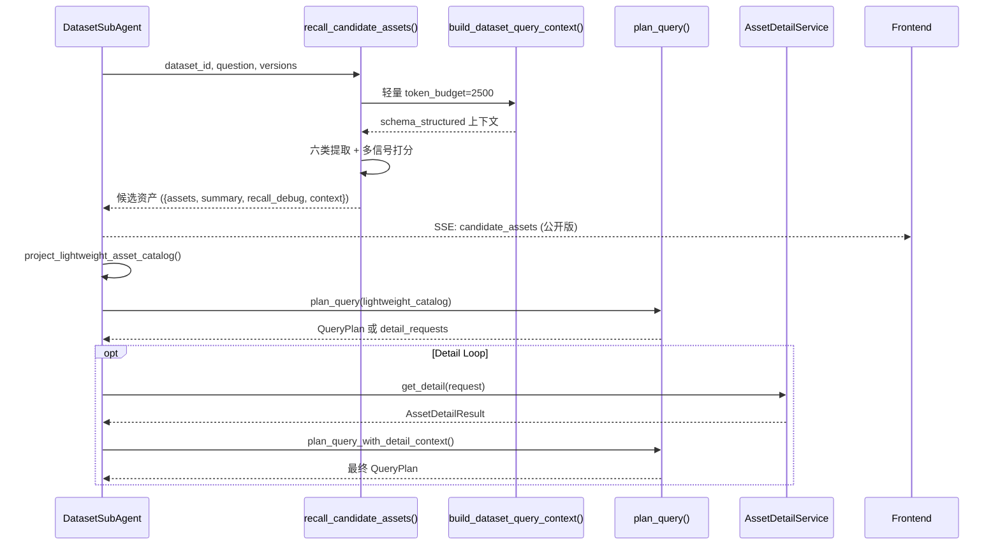

候选资产召回是 DatasetSubAgent 查询规划系统的**第一道闸门**——它在 LLM 规划器介入之前，从数据集语义层中检索所有可能与用户问题相关的资产，并通过多信号打分机赋予每个候选资产一个 0~0.99 的置信度分数。召回结果随后被裁剪为轻量资产目录，经置信度阈值和 Top-K 策略逐级过滤，最终注入 LeadAgent 的技能选择与工具规划上下文。这套流水线将"盲目暴露全量 Schema"替换为"按语义相关性排序的候选短名单"，在保持规划质量的同时将 token 开销从数千压缩到数百。

## 召回入口与上下文构建

候选资产召回的公共入口是 `recall_candidate_assets()`，它接收数据库会话、数据集 ID、用户问题以及 manifest/schema 版本号，返回一个包含 `assets` 列表、`summary` 统计和 `recall_debug` 调试信息的完整字典。其核心逻辑分为两步：先通过 `build_dataset_query_context()` 获取结构化上下文，再将上下文传入 `build_candidate_assets_from_context()` 做资产提取与打分。

与传统 SQL 生成路径（默认 token 预算 4000）不同，候选资产召回使用**轻量级上下文**：默认 token 预算仅为 **2500**（可通过 `SUBAGENT_CANDIDATE_ASSET_CONTEXT_TOKEN_BUDGET` 配置覆盖）。这个精简预算确保了召回阶段的延迟可控，避免为候选筛选消耗过多 LLM 上下文窗口。上下文组装服务 `build_dataset_query_context()` 按 token 预算裁剪 prompt 文本，优先保留问题命中的资产，其内部执行 Schema 召回、样例截断和权限过滤，最终将结构化上下文注入 `schema_structured` 字典。

Sources: [asset_recall.py](app/services/subagent_planning/asset_recall.py#L505-L534), [dataset_context.py](app/services/dataset_context.py#L1-L55)

## 六类候选资产的提取策略

`build_candidate_assets_from_context()` 统一从 `schema_structured` 中提取六类语义资产，每一类有独立的提取与打分逻辑：

| 资产类型 | 来源桶 | 资产标识 | 打分信号类型 |
|----------|--------|----------|-------------|
| `blueprint` | `structured["blueprints"]` | `blueprint.id` 或 `name` | exact, contains, alias, trigger_example |
| `metric` | `structured["metrics"]` | `metric.id` 或 `name` | exact, contains, synonym |
| `dimension` | `structured["dimensions"]` | `dimension.id` 或 `name` | exact, contains, synonym |
| `term` | `structured["terms"]` | `term.id` 或 `name` | exact, contains, alias, synonym |
| `field` | `structured["fields"]` | `table:{table_name}.column:{column_name}` | exact, field_display, synonym, table_context |
| `table` | `structured["tables_json"]` 或 `fields`（回退） | 表名 | exact, table_context |

**Blueprint** 的提取最为丰富：除了精确匹配蓝图名称外，还会对 `trigger_keywords`（触发别名）和 `trigger_examples`（触发示例）分别打分。这意味着用户说"查询个人工作日志"时，即使没有直接提到"日报"二字，名为"日报"的蓝图也能通过 `trigger_examples` 命中得分。

**Field** 资产的 ID 采用复合格式 `table:{table_name}.column:{column_name}`，确保跨表同名字段不被混淆。Field 打分使用 `field_display` 信号覆盖 `display_name`、`semantic`、`business_desc`、`effective_desc` 和 `column_comment` 五个维度，同时叠加所属表名的 `table_context` 信号——这使得"失败日志"问题能同时命中 `status` 字段（因为其 `semantic` 为"失败状态"）和 `user_logs` 表（因为表描述含"日志"）。

**Table** 资产有两个来源：`tables_json.selected_tables`（首选）和 `fields` 中的 `table_name` 去重（回退）。当 `tables_json` 为空时，系统自动从字段列表中推导表名，确保即便数据集未显式配置表列表也能生成候选表资产。

Sources: [asset_recall.py](app/services/subagent_planning/asset_recall.py#L325-L470), [asset_recall.py](app/services/subagent_planning/asset_recall.py#L282-L323)

## 多信号加权打分引擎

打分引擎是候选资产召回的核心算法，由 `_score()` 函数统一驱动，`_match_factor()` 负责单条信号的文本匹配度计算。

### 信号权重体系

| 信号类型 | 权重 | 排序优先级 | 适用资产 |
|----------|------|-----------|----------|
| `exact` | **0.55** | 0（最高） | 全部六类 |
| `contains` | 0.28 | 1 | blueprint, metric, dimension, term |
| `alias` | 0.22 | 2 | blueprint, term |
| `synonym` | 0.22 | 3 | metric, dimension, term, field |
| `trigger_example` | 0.26 | 4 | blueprint |
| `field_display` | 0.35 | 5 | field |
| `table_context` | 0.28 | 6（最低） | field, table |

每条信号的实际得分 = `权重 × 匹配因子`，总置信度 = `min(0.99, Σ所有去重信号得分)`。0.99 的上限设计表达了"语义匹配永远存在不确定性"的系统哲学——任何自动打分都不能达到 1.0。

### 匹配因子计算

`_match_factor()` 对每对 `(问题归一化文本, 资产归一化文本)` 计算匹配度，返回 `(因子, 匹配类型, 匹配片段列表)`：

| 匹配情况 | 因子 | 匹配类型 |
|----------|------|----------|
| 完全相同 | 1.0 | `full_exact` |
| 资产文本包含于问题 | 1.0 | `phrase_in_question` |
| 问题包含于资产文本 | 0.9 | `question_in_value` |
| CJK 子串覆盖 ≥55% 或英文子串强重叠 | 0.85 | `strong_overlap` |
| CJK 子串部分覆盖或英文子串弱重叠 | 0.65 | `partial_overlap` |
| 无匹配 | 0.0 | — |

对于 CJK（中日韩）文本，系统使用滑窗算法：从 6 字符开始递减至 2 字符，逐段检查是否出现在用户问题中。对于英文文本，使用正则 `[a-z0-9]{2,}` 提取连续字母数字片段。这种双语分流策略确保"失败日志"能通过"失败"和"日志"两个 CJK 片段同时命中，而 `user_logs` 能通过 `user` 和 `logs` 两个英文片段命中。

Sources: [asset_recall.py](app/services/subagent_planning/asset_recall.py#L53-L67), [asset_recall.py](app/services/subagent_planning/asset_recall.py#L100-L153)

### 去重与堆叠逻辑

同一条 `(信号类型, 归一化文本)` 组合只计算一次，避免同义词重复加分。不同信号类型的得分相互独立、可堆叠：一个问题"最近10条失败日志有哪些"会为 `term:"失败日志"` 同时触发 `exact`（0.55×1.0=0.55）、`contains`（0.28×1.0=0.28）、`alias`（0.22×1.0=0.22）和 `synonym`（0.22×1.0=0.22），合计 1.27，触及 0.99 上限。`match_reason` 字段按信号优先级将命中类型拼接为 `exact+contains+alias+synonym`，供下游 Planner 快速判断资产与问题的语义关系强度。

Sources: [asset_recall.py](app/services/subagent_planning/asset_recall.py#L156-L194)

## 召回结果结构与审计摘要

`build_candidate_assets_from_context()` 的输出字典包含四个顶层字段：

| 字段 | 类型 | 说明 |
|------|------|------|
| `dataset_id` | int | 数据集 ID |
| `question` | str | 用户原始问题 |
| `assets` | list[dict] | 按置信度降序排列的候选资产列表 |
| `summary` | dict | 按类型计数 + 打分覆盖率审计 |
| `recall_debug` | dict | 完全去敏的调试信息（不含 `context`） |
| `context` | dict | 原始结构化上下文（仅在 SubAgent 内部使用） |

`summary` 中的 `coverage` 字段提供打分覆盖率审计：`scored_assets` 记录获得非零置信度的资产数，`scored_ratio` 表示得分覆盖率，`top_asset_types` 按类型展示最大/平均置信度。`_score_audit()` 函数负责生成这些审计数据，帮助排查"为什么某类资产全部零分"或"为什么某类型置信度普遍偏低"的问题。调试信息中**显式排除了 `context`**，防止结构化 Schema 泄漏到前端或日志中。

Sources: [asset_recall.py](app/services/subagent_planning/asset_recall.py#L472-L504), [asset_recall.py](app/services/subagent_planning/asset_recall.py#L231-L278)

## 三层渐进过滤管道

从原始召回到 LeadAgent 注入，候选资产经历三层逐级收窄的过滤管道：

### Layer 1：轻量资产目录投影

`project_lightweight_asset_catalog()` 将六类候选资产裁剪为 Planner 可消费的四类（`metric`、`dimension`、`table`、`blueprint`），明确排除了 `field` 和 `term`。投影过程中执行三项关键安全操作：

1. **移除危险字段**：`metadata` 中的 `expr`、`sql`、`sql_template` 等字段被 `DESCRIPTION_KEYS` 白名单过滤，仅保留 `description`、`comment`、`semantic`、`business_desc`、`when_to_use` 作为资产描述
2. **信号字段净化**：`match_signals` 仅输出 `type`、`match`、`score`、`fragments` 四个安全字段，剥离包含原始 SQL 表达式的 `value`
3. **置信度舍入**：统一截断到 4 位小数

同时从 `recall_debug` 中提取 `schema_version` 和 `manifest_version` 注入每条资产，供 Planner 做版本感知决策。

Sources: [asset_catalog.py](app/services/subagent_planning/asset_catalog.py#L1-L78)

### Layer 2：LeadAgent 过滤层

`filter_lead_planner_assets()` 执行六步流水线过滤：

| 步骤 | 操作 | 说明 |
|------|------|------|
| 1 | `(asset_type, asset_id)` 去重 | 保留置信度最高的一条 |
| 2 | 类型白名单 | 仅保留 `CANDIDATE_ASSET_TYPES` 内类型 |
| 3 | 全局置信度截断 | 低于 `global_min_confidence`（默认 0.20）的资产丢弃 |
| 4 | 类型级阈值 + Top-K | 按类型独立阈值和 Top-K 限制 |
| 5 | metadata 脱敏 | 仅保留白名单字段 `{table_name, column_name, parameters, expr}` |
| 6 | signals 截断 | 保留 Top-N 信号，仅输出 `type/value/score` |

各资产类型的默认阈值与 Top-K 配置：

| 资产类型 | 置信度阈值 | Top-K |
|----------|-----------|-------|
| blueprint | 0.60 | 3 |
| metric | 0.35 | 5 |
| dimension | 0.35 | 5 |
| term | 0.30 | 5 |
| field | 0.25 | 10 |
| table | 0.25 | 8 |

这种类型感知的差异化过滤体现了明确的架构意图：**Blueprint 是"高价值低噪音"资产**（阈值 0.60），每个数据集至多注入 3 个；**Field 是"高噪音长尾"资产**（阈值 0.25），允许注入 10 个以确保字段级细节不丢失。配置优先级为：运行时显式覆盖 > 数据集级覆盖 > Settings 环境变量 > 代码默认值，通过 `build_filter_config()` 实现三层合并。

Sources: [asset_filter.py](app/services/lead_agent_planning/asset_filter.py#L1-L79), [asset_filter_config.py](app/services/lead_agent_planning/asset_filter_config.py#L1-L75)

## 数据契约：CandidateAsset 与下游消费

所有候选资产遵循 `CandidateAsset` dataclass 定义的标准契约：

| 字段 | 类型 | 说明 |
|------|------|------|
| `asset_type` | `Literal["blueprint","metric","dimension","term","field","table"]` | 六类资产枚举 |
| `asset_id` | `str \| int` | 资产唯一标识 |
| `name` | `str` | 资产名称 |
| `display_name` | `str \| None` | 展示名（优先 metadata.display_name） |
| `source` | `str` | 来源标记（schema/semantic_metric/analysis_blueprint 等） |
| `confidence` | `float` | 置信度 [0, 0.99] |
| `match_signals` | `list[dict]` | 得分信号明细 |
| `metadata` | `dict` | 原始元数据（逐步脱敏） |
| `usage` | `str` | 资产用法标记（candidate/selected/reference/rejected） |
| `match_reason` | `str \| None` | 命中原因（如 `exact+contains+synonym`） |
| `reject_reason` | `str \| None` | 拒绝原因 |

`CandidateAsset.to_dict()` 使用 FastAPI 的 `jsonable_encoder` 保证 JSON 安全序列化，`from_dict()` 在反序列化时执行类型和用法枚举校验（`QueryPlanValidationError`），确保不合法的数据不会进入下游规划链路。

`SubAgentResult` 作为整个 SubAgent 执行的最终产出，将 `candidate_assets`、`query_plan` 和 `step_traces` 打包，其中 `candidate_assets` 保留完整召回结果（含上下文），供调试与审计使用。

Sources: [contracts.py](app/services/subagent_planning/contracts.py#L69-L129), [contracts.py](app/services/subagent_planning/contracts.py#L165-L187)

## 资产详情按需补全：AssetDetailService

候选资产召回只提供元信息级别的资产快照——**不包含表字段 Schema、SQL 模板或完整 DDL**。当 Planner 需要这些深度信息时，通过 `PlannerDetailLoop` 驱动按需请求，由 `AssetDetailService` 逐条补全。这种"先召回元信息，再按需拉取详情"的两阶段设计避免了将完整 Schema 一次性注入 LLM 上下文。

### 详情级别矩阵

| 资产类型 | 支持的 detail_level | 说明 |
|----------|-------------------|------|
| `table` | `full_schema` | 返回该表所有字段的完整信息 |
| `table` | `field_search` | 按问题关键词搜索匹配字段，Top-K 返回 |
| `metric` | `detail` | 返回指标元数据（expr/table_name/time_field 等） |
| `dimension` | `detail` | 返回维度元数据（column_name/join_to/join_key 等） |
| `blueprint` | `detail` | 返回蓝图元数据（参数/SQL 模板等） |

### 宽表分级返回策略

`table:full_schema` 请求根据字段数量执行三级返回策略：

| 字段数 | 返回模式 | 说明 |
|--------|---------|------|
| ≤ 120 | `full` | 返回所有字段，含 business_desc |
| 121-300 | `full_compacted` | 返回所有字段，但省略 business_desc 以节省空间 |
| > 300 | `too_large` | 不返回任何字段，建议 Planner 改用 `field_search` |

对于 `field_search` 详情级别，`AssetDetailService` 实现了独立的字段级文本打分：将查询词按空白/逗号分词后，在字段名、注释、业务描述和展示名中做包含匹配，每命中一个 token 加 1 分。此外还叠加 **1.5 分的语义角色加成**（`_field_boost_reason`）：时间字段候选（`created_at`、`datetime` 类型等）、连接字段候选（`id`、`_id` 后缀）和过滤字段候选（`status`、`type`、`category` 等）各获得额外加成。最终按 `final_score` 降序返回 Top-K（默认 30，最大 50）。

Sources: [asset_detail.py](app/services/subagent_planning/asset_detail.py#L140-L278), [asset_detail.py](app/services/subagent_planning/asset_detail.py#L451-L530)

### 详情请求安全校验

`validate_asset_detail_requests()` 对 Planner 发起的详情请求执行三重安全校验：

1. **用途校验**：当前仅允许 `purpose="sql_generation"`，拒绝其他用途
2. **范围校验**：请求的 `(asset_type, asset_id)` 必须存在于 `allowed_scope`（从轻量目录构建）
3. **级别校验**：`detail_level` 必须在对应资产类型支持的级别集合内

任何校验失败产生 `AssetDetailError`，记录到规划警告中但不阻断主链路——这是防御性设计的体现：Planner 的"越界请求"被记录但不会导致整个查询规划崩溃。

Sources: [asset_detail.py](app/services/subagent_planning/asset_detail.py#L98-L138)

## 端到端数据流：从 DatasetSubAgent 视角

在 DatasetSubAgent 的流式执行管道中，候选资产召回以 `SubAgentEvent(event_type="candidate_assets")` 作为首个 SSE 事件发出。该事件包含 `_dsa_public_candidate_assets()` 处理的公开版本（已剥离 `context` 和敏感字段），使前端可以在 Planner 决策之前提前展示候选资产列表。

在 `dataset_subagent.py` 中可以看到，召回阶段包裹了完整的 Langfuse trace span（`subagent.candidate_assets`），记录输入参数、资产数量和摘要信息。如果召回本身失败，span 以 error 状态结束并向上抛出异常——候选资产是整个规划链路的刚性依赖，不容降级。

Sources: [dataset_subagent.py](app/services/dataset_subagent.py#L1148-L1198)

## 阅读下一步

理解候选资产召回后，继续阅读以下页面了解召回结果如何被消费：

- **[查询规划器：Planner 决策、Detail Loop 与降级策略](17-cha-xun-gui-hua-qi-planner-jue-ce-detail-loop-yu-jiang-ji-ce-lue)** — 了解 Planner 如何基于候选资产目录做出查询类型决策
- **[DatasetSubAgent 门面：LeadAgent 与语义层之间的隔离边界](18-datasetsubagent-men-mian-leadagent-yu-yu-yi-ceng-zhi-jian-de-ge-chi-bian-jie)** — 了解候选资产如何在 SubAgent 流式管道中与蓝图执行、SQL 生成协同
- **[LeadAgent 工具编排：技能选择、工具规划与路由决策](9-leadagent-gong-ju-bian-pai-ji-neng-xuan-ze-gong-ju-gui-hua-yu-lu-you-jue-ce)** — 了解过滤后的候选资产如何注入 LeadAgent 的技能选择与工具规划上下文
- **[Schema 召回与数据集问数上下文组装](12-schema-zhao-hui-yu-shu-ju-ji-wen-shu-shang-xia-wen-zu-zhuang)** — 了解 `build_dataset_query_context()` 内部的上下文组装与 token 预算裁剪细节