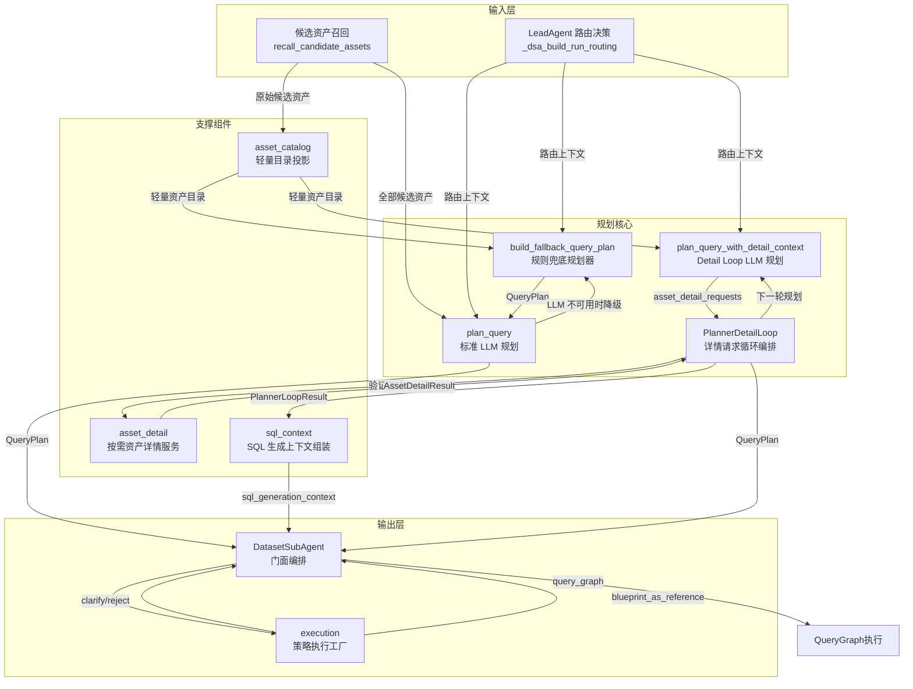
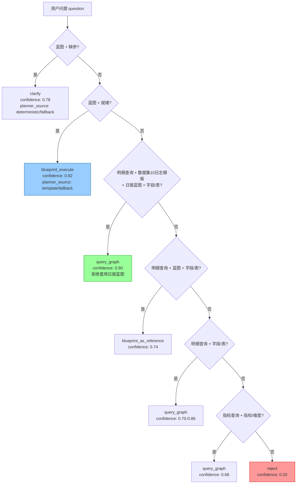
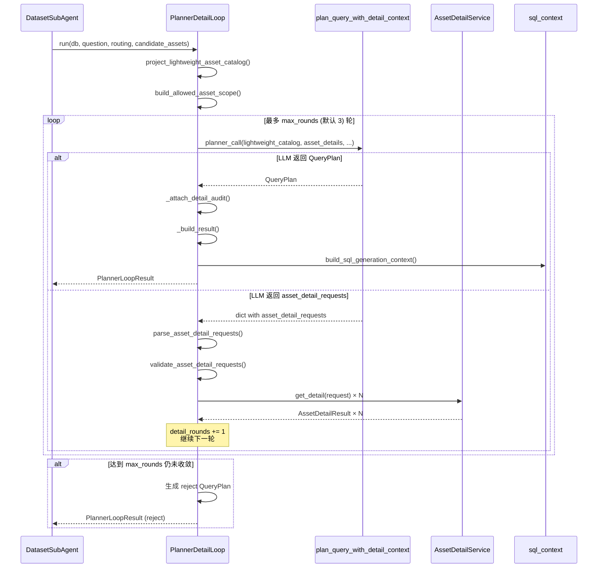

查询规划器是 DatasetSubAgent 查询系统的核心决策中枢。它接收上游 [候选资产召回](16-hou-xuan-zi-chan-zhao-hui-duo-lei-xing-yu-yi-zi-chan-de-tong-jian-suo-yu-zhi-xin-du-pai-xu) 产出的 `CandidateAsset` 列表，将其转化为结构化的 `QueryPlan`——明确查询类型、执行策略和资产选择，最终驱动下游的 QueryGraph SQL 生成或蓝图直执行。整个规划系统由 **八个模块** 构成（总计约 5645 行代码），围绕"确定性规则优先、LLM 增强、多级降级"三层架构设计。

Sources: [planner.py](app/services/subagent_planning/planner.py#L1-L30)

## 规划系统架构总览

查询规划器在 DatasetSubAgent 管道中的位置和内部模块协作关系如下：



规划器的核心决策流体现了 **"规则兜底 → 模板特化 → LLM 增强"** 的三层递进策略。`build_fallback_query_plan` 永远可以被调用，`plan_query` 在其基础上尝试 LLM 优化，`plan_query_with_detail_context` 则进一步启用多轮资产详情协商。

Sources: [planner.py](app/services/subagent_planning/planner.py#L1474-L1519) | [dataset_subagent.py](app/services/dataset_subagent.py#L1205-L1286)

## 数据契约层：QueryPlan 与枚举体系

查询规划器的所有输入输出都遵循 `contracts.py` 中定义的严格类型契约。`QueryPlan` 是整个系统的核心数据结构，包含 22 个字段，覆盖从查询分类到审计追溯的完整信息面。

### 核心枚举

| 枚举名 | 值集合 | 语义 |
|--------|--------|------|
| `CandidateAssetType` | `blueprint`, `metric`, `dimension`, `term`, `field`, `table` | 候选资产类型 |
| `QueryType` | `detail_query`, `metric_query`, `blueprint_query`, `knowledge_qa`, `ambiguous`, `unsupported` | 查询意图分类 |
| `ExecutionStrategy` | `blueprint_execute`, `blueprint_as_reference`, `query_graph`, `clarify`, `reject` | 执行策略选择 |
| `PlannerSource` | `deterministic`, `template`, `llm`, `fallback` | 规划来源标记 |
| `AssetUsage` | `selected`, `reference`, `rejected`, `candidate` | 资产使用方式 |

`QueryPlan` 的 `__post_init__` 方法在构造时立即对 `query_type`、`execution_strategy` 和 `planner_source` 进行枚举合法性校验——任何不匹配都会抛出 `QueryPlanValidationError`，将控制流推向降级路径。

Sources: [contracts.py](app/services/subagent_planning/contracts.py#L34-L60)

### QueryPlan 字段详解

| 字段 | 类型 | 作用 |
|------|------|------|
| `query_type` | `QueryType` | 查询意图分类，决定资产选择倾向 |
| `execution_strategy` | `ExecutionStrategy` | 下游如何消费此计划 |
| `confidence` | `float` | 规划置信度（0.0–1.0），规则确定性 ≥0.68 |
| `selected_assets` | `list[CandidateAsset]` | **选中**的资产，直接用于查询生成 |
| `reference_assets` | `list[CandidateAsset]` | **参考**资产（如蓝图口径），不直接执行 |
| `rejected_assets` | `list[CandidateAsset]` | **拒绝**的资产，含拒绝原因 |
| `required_inputs` | `list[dict]` | 蓝图缺失的必填参数 |
| `clarification` | `dict \| None` | 需要澄清的信息，驱动前端交互 |
| `fallback_reason` | `str \| None` | 降级原因，关键的可观测性字段 |
| `planner_source` | `PlannerSource` | 标记由哪个规划路径产出 |
| `explanation` | `dict` | 面向前端和审计的结构化解释 |
| `decision_factors` | `list[dict]` | 逐项决策理由，带 `code` + `message` + `evidence` |
| `planner_warnings` | `list[dict]` | 规划过程中的 WARNING 级信号 |
| `governance_suggestions` | `list[dict]` | 治理建议（补充术语、字段描述等） |
| `detail_rounds` | `int` | Detail Loop 执行轮数 |
| `attempted_detail_requests` | `list[dict]` | 所有尝试过的资产详情请求（审计用） |
| `asset_detail_coverage` | `dict` | 按资产 ID 的详情覆盖状态 |
| `missing_context` | `list[str]` | 仍缺失的上下文列表 |
| `why_not_generate_sql` | `str \| None` | 无法生成 SQL 的原因说明 |
| `risk_flags` | `list[str]` | 风险标签集合 |
| `debug` | `dict` | 调试信息（模板名、join_hints、schema_token_budget 等） |

这种精细化的字段设计使得每个规划决策都被完整记录，下游节点和可观测性系统可以逐字段消费。

Sources: [contracts.py](app/services/subagent_planning/contracts.py#L105-L187)

### normalize_query_plan：LLM 输出的安全门

LLM 返回的 JSON 经过 `normalize_query_plan` 函数进行严格的结构化校验：每个资产列表被迫类型检查、`required_inputs` 支持 list 和 dict map 两种格式、所有可选字段都有防御性默认值。这是 LLM 输出的最后一道安全门——任何字段类型不匹配都会触发 `QueryPlanValidationError`，导致降级到规则兜底。

Sources: [contracts.py](app/services/subagent_planning/contracts.py#L237-L374)

## 规则兜底规划器：build_fallback_query_plan

`build_fallback_query_plan` 是整个规划系统的**确定性基座**——它不依赖任何 LLM 调用，仅凭模式匹配和资产类型分布就产出保守的 `QueryPlan`。其决策链严格按优先级排列，从高置信度到低置信度逐级穿透：

### 决策优先级链



### 分类信号体系

规则匹配依赖三组关键词模式：

| 信号组 | 关键词 | 触发动作 |
|--------|--------|----------|
| `DETAIL_PATTERNS` | 明细、列表、日志、记录、最近、前、条、limit | 标记为 `detail_query` |
| `METRIC_PATTERNS` | 统计、数量、总数、平均、占比、汇总、趋势 | 标记为 `metric_query` |
| `BLUEPRINT_PATTERNS` | 日报、周报、月报、分析、报告 | 标记为 `blueprint_query` |

此外，路由层的 `entry_intent` 和 `route_payload.kind` 也会影响分类——例如当 `_routing_is_detail_query(routing)` 返回 True 时，即使问题本身不含明细关键词，也会被识别为明细查询。这种"问题文本 + 路由上下文"的双源分类设计使得规则系统在各类场景下都有合理的初始判断。

Sources: [planner.py](app/services/subagent_planning/planner.py#L36-L41) | [planner.py](app/services/subagent_planning/planner.py#L689-L820)

### 蓝图冲突解决的精细化设计

当问题同时命中明细查询和日报蓝图时（如"查看我的工作日志"），系统面临关键冲突：用户要的是日志明细，而非日报分析。规划器通过两处精密处理避免蓝图误套：

1. **数据集 10 日志模板特化**：`_is_dataset10_log_template_query` 检测当日志明细查询 + 多轮过滤追问 + `plan_task_daily_record` 表被召回时，直接生成预置 SQL 模板并拒绝日报蓝图。此时 `confidence` 高达 **0.90**，`planner_source` 标记为 `template`。

2. **通用蓝图拒绝逻辑**：`_reject_blueprint_for_detail` 为被拒绝的蓝图资产标注 `reject_reason`："日志明细查询不强套日报蓝图，避免错误主表和必填参数污染 DSL"，并将该蓝图移入 `rejected_assets` 而非 `selected_assets` 或 `reference_assets`。

3. **蓝图比较因子**：当多个蓝图候选同时命中时，`_blueprint_comparison_factor` 生成嵌套证据数组，记录每个蓝图的 `asset_id`、`name` 和 `confidence`，使决策可追溯。

Sources: [planner.py](app/services/subagent_planning/planner.py#L694-L746) | [planner.py](app/services/subagent_planning/planner.py#L395-L399)

### 蓝图的三种使用模式

规则兜底对蓝图资产有三种差异化处理：

| 模式 | 条件 | execution_strategy | 蓝图位置 |
|------|------|-------------------|----------|
| **蓝图执行** | 蓝图命中 + 无需参数或参数已满足 | `blueprint_execute` | `selected_assets` |
| **蓝图参考** | 明细查询 + 蓝图命中 + 字段/表覆盖 | `blueprint_as_reference` | `reference_assets` |
| **蓝图拒绝** | 明细查询 + 日报蓝图 | `query_graph` | `rejected_assets` |

当 `blueprint_as_reference` 被选中时，`build_blueprint_reference_context` 将蓝图元数据（description、when_to_use、parameters）拼接为结构化参考文本，强调"只能作为参考证据，不能原样执行其中 SQL"。下游 QueryGraph 节点据此获得业务口径参考，但仍基于当前 schema 自主生成 SQL。

Sources: [execution.py](app/services/subagent_planning/execution.py#L40-L77) | [planner.py](app/services/subagent_planning/planner.py#L755-L847)

### 治理建议的自动生成

`_quality_suggestions` 函数根据候选资产的结构特征自动生成治理建议，帮助数据管理员发现语义层配置的缺失：

| 条件 | 建议类型 | 建议内容 |
|------|----------|----------|
| 无任何候选资产 | `candidate_assets` | 补充表字段描述、业务术语或分析蓝图触发样例 |
| 有资产但无 field/table | `schema_metadata` | 补充数据集选表和字段业务描述 |
| 有资产但无 metric/dimension | `semantic_assets` | 补充指标或维度语义资产 |
| 命中蓝图但无 parameters | `blueprint_parameters` | 补齐 parameters 以提升规划稳定性 |

Sources: [planner.py](app/services/subagent_planning/planner.py#L296-L323)

## LLM 增强规划：plan_query 的三层保护

`plan_query` 在规则兜底之上叠加 LLM 能力，但通过**三层保护机制**确保即使 LLM 完全失败也能安全降级：

```mermaid
flowchart TD
    subgraph 第一层：确定性快车道
        DET[build_fallback_query_plan] --> CHECK{确定性明细查询<br/>且 query_graph?}
        CHECK -->|是| FAST[直接返回确定性计划<br/>跳过 LLM 调用]
        CHECK -->|否| LLM[进入 LLM 规划]
    end

    subgraph 第二层：LLM 调用防护
        LLM --> GET_LLM{get_llm 成功?}
        GET_LLM -->|LLM 连接异常| FALL1[降级到规则兜底<br/>_is_llm_call_error 判断]
        GET_LLM -->|成功| INVOKE{llm.invoke 成功?}
        INVOKE -->|API 异常| FALL2[降级到规则兜底]
        INVOKE -->|成功| PARSE
    end

    subgraph 第三层：输出校验
        PARSE[_safe_json_parse] --> NORM[normalize_query_plan]
        NORM --> VALID[_validate_hard_rules]
        VALID -->|全部通过| OK[返回 LLM QueryPlan]
        PARSE -->|JSON 解析失败| FALL3[降级到规则兜底]
        NORM -->|契约校验失败| FALL3
        VALID -->|硬规则违反| FALL3
    end

    style FAST fill:#9f9,stroke:#090
    style FALL1 fill:#fc9,stroke:#f90
    style FALL2 fill:#fc9,stroke:#f90
    style FALL3 fill:#fc9,stroke:#f90
```

### 确定性快车道

`plan_query` 首先调用 `build_fallback_query_plan`。如果返回的是 `planner_source == "deterministic"` 且 `query_type == "detail_query"` 且 `execution_strategy == "query_graph"`，说明规则系统已经高度自信地判定了查询意图——此时**跳过 LLM 调用**，直接返回确定性结果。这是一个关键的延迟和成本优化：明细查询是最常见的场景，规则系统的关键词匹配在此场景下准确率极高。

Sources: [planner.py](app/services/subagent_planning/planner.py#L1474-L1488)

### LLM 连接异常的精准判识

`_is_llm_call_error` 函数通过检查异常类的模块前缀（`openai`、`httpx`、`langchain_openai`、`litellm`）和异常类型关键词（`APIConnectionError`、`RateLimitError`、`Timeout` 等 15 种），精准区分"LLM 调用链路问题"和"业务代码错误"。只有前者才触发降级，后者（如类型错误、逻辑 Bug）则直接向上抛出，避免静默吞掉真正的 Bug。

Sources: [planner.py](app/services/subagent_planning/planner.py#L87-L105) | [planner.py](app/services/subagent_planning/planner.py#L1423-L1435)

### 硬规则校验

`_validate_hard_rules` 对 LLM 输出的 `QueryPlan` 施加三条不可绕过约束：

| 规则 | 条件 | 违反后果 |
|------|------|----------|
| 蓝图执行不可带 `required_inputs` | `blueprint_execute` 且 `required_inputs` 非空 | `QueryPlanValidationError` → 降级 |
| 蓝图参考必须带 `reference_assets` | `blueprint_as_reference` 且 `reference_assets` 为空 | `QueryPlanValidationError` → 降级 |
| 拒答必须有解释 | `reject` 且 `explanation.summary` 为空 | `QueryPlanValidationError` → 降级 |
| 明细查询不可 clarify | `detail_query` + `clarify` 且候选中已有 field/table | `QueryPlanValidationError` → 降级 |

第四条规则尤为重要：当候选资产中已有表或字段时，明细查询不应返回 `clarify`——因为字段和表已经足以构建 SQL，不应再向用户索要参数。

Sources: [planner.py](app/services/subagent_planning/planner.py#L1401-L1414)

## Detail Loop：渐进式资产详情协商

当 `SUBAGENT_PLANNER_DETAIL_LOOP_ENABLED` 配置为 `True` 时，查询规划进入 Detail Loop 模式——一种渐进式的资产详情协商机制。

### 为什么需要 Detail Loop

在标准规划模式下，planner 只能见到候选资产的**轻量投影**（asset_type、asset_id、name、display_name、description、confidence、match_signals），不含表字段明细、SQL 模板、蓝图参数等完整元数据。对于复杂查询（如"统计近 30 天各部门的任务完成率"），仅凭这些信息不足以判断哪些字段是关键维度、哪些字段是过滤条件。

Detail Loop 通过**多轮请求-响应**解决这个信息不对称问题：planner 在每轮可以请求特定资产（表、指标、维度、蓝图）的详情，`AssetDetailService` 按需拉取并返回，下一轮规划基于更丰富的上下文重新决策。

Sources: [detail_loop.py](app/services/subagent_planning/detail_loop.py#L1-L26)

### PlannerDetailLoop 执行流程



### 核心参数

| 配置项 | 默认值 | 语义 |
|--------|--------|------|
| `SUBAGENT_PLANNER_DETAIL_LOOP_ENABLED` | `False` | 总开关 |
| `SUBAGENT_PLANNER_DETAIL_MAX_ROUNDS` | `3` | 最大协商轮数 |
| `SUBAGENT_PLANNER_DETAIL_MAX_REQUESTS_PER_ROUND` | `5` | 每轮最多请求数 |
| `SUBAGENT_PLANNER_TABLE_FULL_FIELD_LIMIT` | `120` | 宽表全字段返回上限 |
| `SUBAGENT_PLANNER_TABLE_COMPACT_FIELD_LIMIT` | `300` | 压缩返回上限 |
| `SUBAGENT_PLANNER_FIELD_SEARCH_DEFAULT_TOP_K` | `30` | 字段搜索默认返回数 |
| `SUBAGENT_PLANNER_FIELD_SEARCH_MAX_TOP_K` | `50` | 字段搜索最大返回数 |

Sources: [config.py](app/core/config.py#L82-L88)

### 超轮次处理

当达到 `max_rounds` 后仍未产出 `QueryPlan`（即 LLM 始终返回 `asset_detail_requests` 而非最终计划），`PlannerDetailLoop` 生成一个僵硬的 `reject` 计划：

- `query_type`: `"unsupported"`
- `execution_strategy`: `"reject"`
- `confidence`: `0.0`
- `fallback_reason`: `"max_detail_rounds_exceeded"`
- `planner_source`: `"fallback"`
- `risk_flags`: `["max_detail_rounds_exceeded"]`
- `why_not_generate_sql`: 详细说明达到 N 轮后仍未收敛

这确保了循环必然终止——不存在无限协商的可能。

Sources: [detail_loop.py](app/services/subagent_planning/detail_loop.py#L234-L256)

### 请求校验与越界保护

Detail Loop 的两层安全边界：

1. **允许范围校验**：`validate_asset_detail_requests` 检查每个请求的 `(asset_type, asset_id)` 是否在 `allowed_scope` 中——该 scope 由 `build_allowed_asset_scope` 从轻量目录投影生成，仅包含 `metric`、`dimension`、`table`、`blueprint` 四种类型。`purpose` 必须为 `"sql_generation"`。任何越界请求产生 `AssetDetailError`。

2. **请求量限制**：超过 `max_requests_per_round` 的请求被截断，并生成 `asset_detail_request_limit_exceeded` 警告。

3. **审计数据脱敏**：所有写入 `QueryPlan.attempted_detail_requests` 的请求都经过 `_sanitize_detail_request_for_audit` 脱敏——移除 `sql_template`、`table_schemas`、DDL 等敏感内容。

Sources: [detail_loop.py](app/services/subagent_planning/detail_loop.py#L214-L231) | [asset_detail.py](app/services/subagent_planning/asset_detail.py#L102-L150)

### plan_query_with_detail_context 的双态返回

该函数是 Detail Loop 专用的规划入口，与 `plan_query` 的关键区别在于它的**双态返回值**：

| 返回类型 | 触发条件 | 后续行为 |
|----------|----------|----------|
| `QueryPlan` | LLM 认为上下文已足够 | Detail Loop 终止，返回最终计划 |
| `dict` (含 `asset_detail_requests`) | LLM 认为需要更多资产详情 | Detail Loop 解析请求，拉取详情后下一轮 |

LLM 输出首先通过 `parse_asset_detail_requests` 检测是否包含 `asset_detail_requests` 字段——如果有且非空，则即使同时包含 QueryPlan 字段，也优先以详情请求处理（返回 dict）。

Sources: [planner.py](app/services/subagent_planning/planner.py#L1638-L1788)

### 轻量目录的安全投影

Detail Loop 模式下，所有返回给 LLM 的 `QueryPlan` 经过 `_sanitize_detail_loop_query_plan` 进行公共侧安全重构：资产的 `asset_id`、`name`、`display_name` 等从轻量目录重新拉取（而非使用 LLM 自行填写的值），`explanation`、`decision_factors` 等文本字段被截断至公共长度限制（240 字符），敏感键（`sql_template`、`table_schemas`、`ddl` 等）被完全移除。这阻断了 LLM 通过"编造字段名"或"泄露模板 SQL"来污染的路径。

Sources: [planner.py](app/services/subagent_planning/planner.py#L1185-L1246)

## AssetDetailService：按需资产详情获取

`AssetDetailService` 是 Detail Loop 的数据提供者，支持四种资产类型的三类详情级别：

| 资产类型 | 详情级别 | 返回内容 | coverage 标记 |
|----------|----------|----------|---------------|
| `table` | `full_schema` | 表的所有字段（含 name、data_type、comment、business_desc 及 time/filter/join 候选标记） | `full` / `full_compacted` / `too_large` |
| `table` | `field_search` | 按自然语言 query 搜索的 Top-K 字段（基于文本相关性评分） | `partial` / `empty` |
| `metric` | `detail` | 指标元数据（name、display_name、description、metadata、match_signals） | `full` / `empty` |
| `dimension` | `detail` | 维度元数据 | `full` / `empty` |
| `blueprint` | `detail` | 蓝图元数据 | `full` / `empty` |

### 宽表分级返回策略

表字段数量与返回策略的对应关系：

| 字段数 | 策略 | coverage | 返回字段数 |
|--------|------|----------|-----------|
| ≤ 120 (`full_field_limit`) | 全量返回，含 business_desc | `full` | 全部 |
| 121–300 (`compact_field_limit`) | 全量返回，不含 business_desc | `full_compacted` | 全部 |
| > 300 | 仅返回元信息 + 建议 | `too_large` | 0（建议用 field_search） |

当 `coverage == "too_large"` 时，返回的 `payload` 中 `fields` 为空数组，`available_detail_requests` 标记为 `["field_search"]`，并附带 `suggested_next_requests`——一个预构造的 `field_search` 请求，planner 可在下一轮直接复用。

Sources: [asset_detail.py](app/services/subagent_planning/asset_detail.py#L200-L245)

### 字段文本相关性评分

`_field_text_score` 使用基于 token 的简单但有效的评分算法：

1. 将 `query` 按空格和中文标点分词
2. 拼接字段的 `name`、`comment`、`business_desc`、`display_name` 为搜索文本
3. 若 query token 出现在搜索文本中，每命中一个 token 得分 +1.0
4. 记录命中的 token 片段用于审计

带有 `boost_reason` 的字段（时间候选、join 候选、过滤候选）额外获得 **1.5 分**加成。结果按 `final_score` 降序排列，确保最可能相关的字段排在最前。

Sources: [asset_detail.py](app/services/subagent_planning/asset_detail.py#L440-L463) | [asset_detail.py](app/services/subagent_planning/asset_detail.py#L467-L506)

### SQL 生成上下文的组装

Detail Loop 终止后，`build_sql_generation_context` 将 `QueryPlan` 和 `AssetDetailResult` 列表组装为 QueryGraph 可直接消费的上下文结构：

```python
{
    "selected_assets": [...],       # 来自 QueryPlan
    "reference_assets": [...],      # 来自 QueryPlan
    "table_schemas": [...],         # table + full_schema 详情
    "field_search_results": [...],  # table + field_search 详情
    "metric_definitions": [...],    # metric 详情
    "dimension_definitions": [...], # dimension 详情
    "blueprint_references": [...],  # blueprint 详情
    "coverage": {"asset_id": "full"/"partial"/"empty", ...},
    "risk_flags": [...],
    "schema_version": ...,
    "manifest_version": ...,
}
```

这种分离设计确保 `QueryPlan` 自身保持轻量（不携带完整 schema payload），而 SQL 生成所需的详细上下文通过在 Detail Loop 中按需拉取的 `AssetDetailResult` 列表提供。

Sources: [sql_context.py](app/services/subagent_planning/sql_context.py#L23-L61)

## DatasetSubAgent 门面中的规划编排

`DatasetSubAgent.run` 方法将查询规划作为整个 SubAgent 管道的第二阶段进行编排：

1. **Manifest 执行前守卫**：`evaluate_manifest_runtime_guard` 检查 Manifest 版本、权限范围和质量状态。不通过则直接返回阻断态，跳过后续所有步骤。

2. **候选资产召回**：调用 `recall_candidate_assets`，产出完整的候选资产字典（含 `assets`、`context`、`summary`、`recall_debug`）。

3. **查询规划分支**：
   - 若 `SUBAGENT_PLANNER_DETAIL_LOOP_ENABLED` → 走 `PlannerDetailLoop` + `plan_query_with_detail_context` 路径
   - 否则 → 走 `plan_query` 路径

4. **策略分发**：根据 `query_plan.execution_strategy` 进入五条分支：
   - `clarify` → `build_clarify_result`，返回带 `required_inputs` 的澄清态
   - `reject` → `build_reject_result`，返回拒答态
   - `blueprint_execute` → `_run_blueprint_execute`，直接执行蓝图
   - `blueprint_as_reference` 或 `query_graph` → 构造 QueryGraph 初始状态，通过 `InProcessDatasetSubAgentRunner` 启动 LangGraph 工作流

Sources: [dataset_subagent.py](app/services/dataset_subagent.py#L1135-L1363)

### 蓝图直执行的五分支逻辑

`_run_blueprint_execute` 调用 `resolve_analysis_blueprint`，后者实现蓝图解析的五分支决策树：

| 分支 | 条件 | 行为 |
|------|------|------|
| `not_applicable` | 无 blueprint_id 或 entry_route 不匹配 | 返回"未命中分析蓝图" |
| `not_found` | blueprint_id 查无或跨数据集 | 返回"蓝图不存在" |
| `semantic_plan` | `implementation_type == "semantic_plan"` | 生成蓝图语义上下文，转入 QueryGraph |
| `executed` | SQL 模板蓝图执行成功 | 返回 SQL 结果 + 触发报告生成 |
| `clarification` | SQL 模板缺参 | 返回参数列表让用户补齐 |
| `error` | SQL 模板执行失败 | 返回错误信息 |

当分支为 `semantic_plan` 时，蓝图不直接执行 SQL，而是通过 `_format_blueprint_semantic_context` 将蓝图的 `parameters`、`output_schema`、`steps` 等业务约束拼接为自然语言，注入 QueryGraph 的 `blueprint_context` 和 `dataset_prompt_instructions`。QueryGraph 据此生成 SQL，而非直接套用蓝图模板。

Sources: [dataset_subagent.py](app/services/dataset_subagent.py#L1440-L1590) | [dataset_subagent.py](app/services/dataset_subagent.py#L115-L148)

## 可观测性：全链路追踪与审计

规划器的可观测性覆盖三个层次：

### Span 级别追踪

`DatasetSubAgent.run` 为候选资产召回（`subagent.candidate_assets`）和查询规划（`subagent.query_plan`）分别创建独立的 Span，记录输入参数（`dataset_id`、`question`、`routing`、Manifest 守卫摘要）和输出摘要（`query_type`、`execution_strategy`、`confidence`、`planner_source`、`decision_factors` 等）。

### Generation 级别追踪

`plan_query` 和 `plan_query_with_detail_context` 都在 LLM 调用前后创建 Langfuse Generation。Generation 的 metadata 包含三类状态：

| 状态 | 含义 | 记录字段 |
|------|------|----------|
| `success` | LLM 输出合法 QueryPlan | `execution_strategy`、`query_type`、`confidence`、`planner_source` |
| `fallback` | LLM 失败后降级 | `fallback_reason`、`validation_error`、`error_stage`（`llm_call` 或 `validation`）、`fallback_execution_strategy` |
| `detail_request` | LLM 返回详情请求 | `asset_detail_request_count` |
| `error` | 非 LLM 链路异常 | `validation_error`、`error_stage` |

`error_stage` 字段区分"LLM 调用阶段失败"和"输出校验阶段失败"，便于根因分析。

Sources: [planner.py](app/services/subagent_planning/planner.py#L1498-L1603) | [planner.py](app/services/subagent_planning/planner.py#L1688-L1788)

### QueryPlan 内嵌审计

`QueryPlan` 自身携带的 `planner_source`、`fallback_reason`、`decision_factors`、`planner_warnings`、`governance_suggestions`、`risk_flags`、`detail_rounds`、`attempted_detail_requests`、`asset_detail_coverage` 和 `missing_context` 形成了一条从规划输入到最终决策的完整审计链路。这些字段不仅被 Span 输出引用，也被 `_dsa_query_plan_span_output` 提取到 `subagent.query_plan` Span 的 output_payload 中。

Sources: [dataset_subagent.py](app/services/dataset_subagent.py#L72-L88)

## 配置参数总览

| 配置项 | 默认值 | 说明 |
|--------|--------|------|
| `SUBAGENT_PLANNER_DETAIL_LOOP_ENABLED` | `False` | Detail Loop 总开关 |
| `SUBAGENT_PLANNER_DETAIL_MAX_ROUNDS` | `3` | 最大协商轮数 |
| `SUBAGENT_PLANNER_DETAIL_MAX_REQUESTS_PER_ROUND` | `5` | 每轮最多详情请求数 |
| `SUBAGENT_PLANNER_TABLE_FULL_FIELD_LIMIT` | `120` | 宽表全字段返回上限 |
| `SUBAGENT_PLANNER_TABLE_COMPACT_FIELD_LIMIT` | `300` | 压缩返回上限 |
| `SUBAGENT_PLANNER_FIELD_SEARCH_DEFAULT_TOP_K` | `30` | 字段搜索默认返回数 |
| `SUBAGENT_PLANNER_FIELD_SEARCH_MAX_TOP_K` | `50` | 字段搜索最大返回数 |
| `SUBAGENT_PLANNER_PROMPT_ASSET_LIMIT` | `40` | 送 LLM 的资产数量上限 |
| `SUBAGENT_PLANNER_PROMPT_TEXT_LIMIT` | `120` | Prompt 文本截断长度 |
| `SUBAGENT_PLANNER_PROMPT_LIST_LIMIT` | `20` | Prompt 列表截断长度 |
| `SUBAGENT_PLANNER_PUBLIC_TEXT_LIMIT` | `240` | 公共输出文本截断长度 |
| `SUBAGENT_PLANNER_PUBLIC_LIST_LIMIT` | `12` | 公共输出列表截断长度 |

Sources: [config.py](app/core/config.py#L82-L88) | [config.py](app/core/config.py#L138-L142)

## 阅读建议

本文档属于 SubAgent 查询规划系统的核心篇章。建议按以下顺序继续阅读：

- **上游**：理解候选资产如何产生 → [候选资产召回：多类型语义资产的统一检索与置信度排序](16-hou-xuan-zi-chan-zhao-hui-duo-lei-xing-yu-yi-zi-chan-de-tong-jian-suo-yu-zhi-xin-du-pai-xu)
- **下游**：理解 DatasetSubAgent 如何将 QueryPlan 转化为最终结果 → [DatasetSubAgent 门面：LeadAgent 与语义层之间的隔离边界](18-datasetsubagent-men-mian-leadagent-yu-yu-yi-ceng-zhi-jian-de-ge-chi-bian-jie)
- **并行**：多数据集场景下的并发规划 → [多数据集 Fan-Out 编排：并发调用与结果聚合](19-duo-shu-ju-ji-fan-out-bian-pai-bing-fa-diao-yong-yu-jie-guo-ju-he)
- **宏观**：LeadAgent 如何将技能选择投射为 SubAgent 调用 → [LeadAgent 工具编排：技能选择、工具规划与路由决策](9-leadagent-gong-ju-bian-pai-ji-neng-xuan-ze-gong-ju-gui-hua-yu-lu-you-jue-ce)