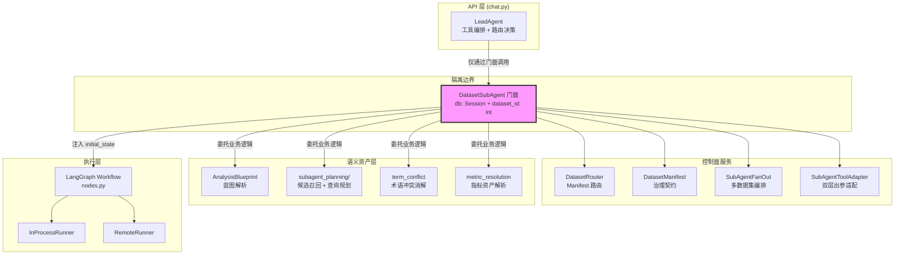
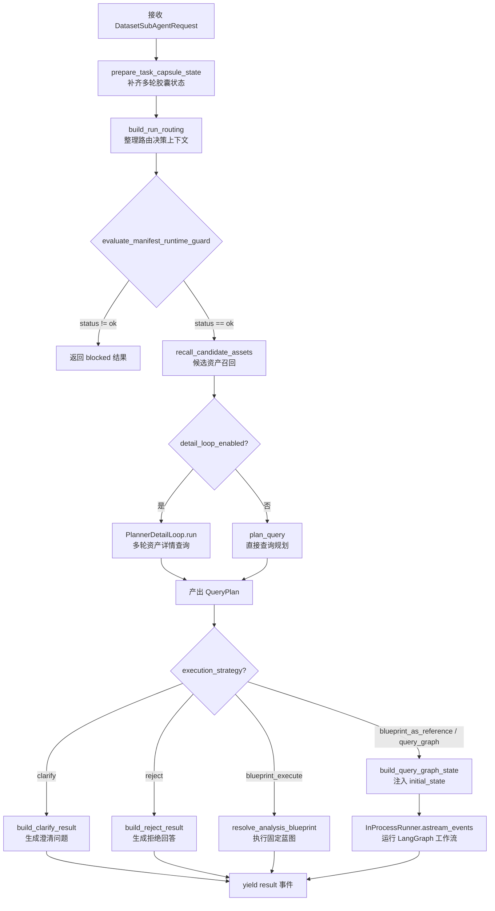
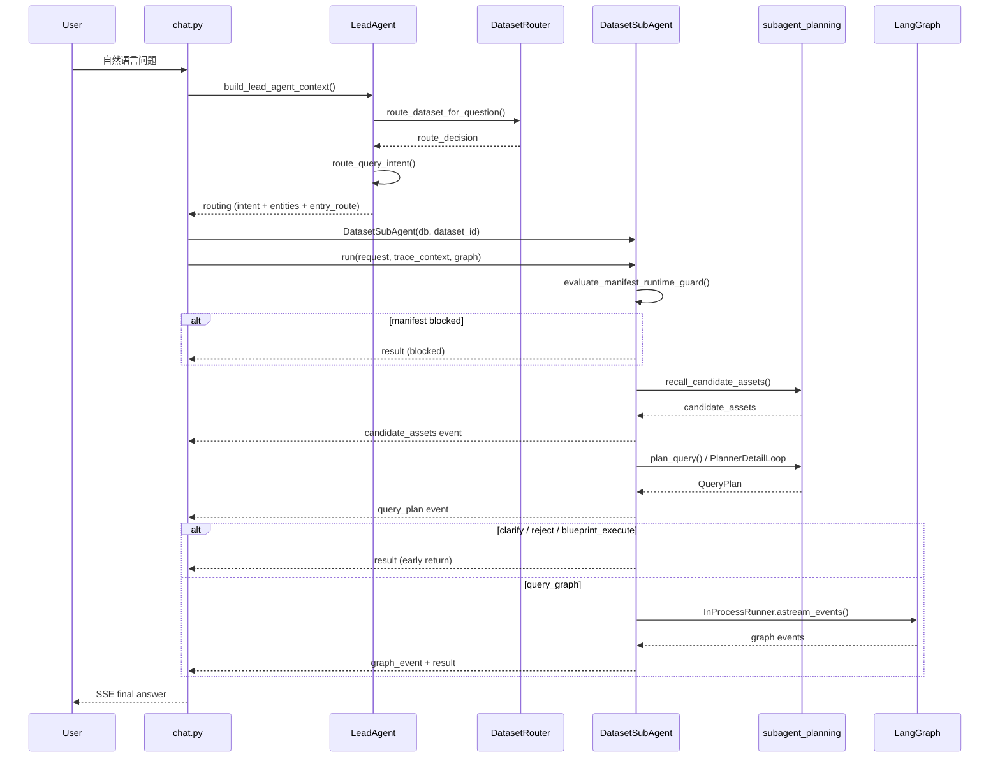

DatasetSubAgent 是整个 NL2DSL2SQL 管道中**控制面与数据面交汇的核心隔离层**。它作为单数据集的业务能力门面，向上为 LeadAgent（chat 层）提供统一的可编排接口，向下隔离语义资产（指标、维度、术语、蓝图）的查询细节，同时确保 LangGraph 工作流（nodes.py）完全不必感知门面的存在。本文档将逐层剖析其架构设计、核心 API 表面、执行流程与跨模块协作机制。

## 架构定位：三明治隔离模型

DatasetSubAgent 在系统中处于承上启下的关键位置——它既不能被 LeadAgent 绕过（避免语义层内部细节泄漏到 API 层），也不能让 Graph 层产生反向依赖（保持工作流节点的纯粹性）。这一"三明治"隔离模型可以概括为：

**向上（LeadAgent → DatasetSubAgent）**：chat.py 只通过 `DatasetSubAgent` 对象调用业务能力，不再直接 import `services/analysis_blueprint.py`、`graph/nodes.py` 等私有辅助模块。所有蓝图解析、术语冲突消解、指标资产匹配都封装为门面的公开方法。

**向下（DatasetSubAgent → Graph）**：Graph 层（nodes.py）完全不知道门面对象的存在。它只读取 `initial_state` 中注入的 `blueprint_context`、`candidate_assets`、`query_plan` 等字段，按照 LangGraph 工作流定义的节点顺序执行 DSL 生成、校验与 SQL 编译。

**水平（DatasetSubAgent ↔ 语义资产）**：资产访问通过 `db: Session` 字段走 ORM；核心业务逻辑委托给 `services/analysis_blueprint.py` 和 `subagent_planning/` 包。

Sources: [dataset_subagent.py](app/services/dataset_subagent.py#L1-L26)

以下 Mermaid 图展示了 DatasetSubAgent 在整体架构中的隔离位置：

## 门面结构：极简数据类 + 丰富方法集

DatasetSubAgent 定义为 `@dataclass`，仅持有两个字段——`db: Session` 和 `dataset_id: int`——不维护任何缓存，所有读写直连数据库。这种设计确保了无状态性和测试友好性（测试中可直接注入 SQLite 内存数据库）。

Sources: [dataset_subagent.py](app/services/dataset_subagent.py#L1095-L1106)

其公开 API 表面分为四个层级，每层对应系统架构的一个阶段：

| 方法 | 阶段 | 分支数 | 典型调用场景 |
|---|---|---|---|
| `async run()` | 编排入口 | 5 策略分支 | chat.py 主流程中统一接管问数执行 |
| `resolve_analysis_blueprint()` | Phase 5 | 6 分支 | 蓝图命中后的语义计划注入 / SQL 模板执行 |
| `resolve_term_conflict()` | Phase 6 | 5 分支 | 术语冲突检测、消解与澄清候选生成 |
| `resolve_metric()` | Phase 7 | 5 分支 | 指标 / 维度 / 字段 / 蓝图统一语义资产解析 |

每个公开方法都遵循统一的契约模式：返回同构于旧 graph 节点的 dict 结构，确保与历史 fixture 冻结测试兼容。方法内部通过 `jsonable_encoder` 序列化保证 FastAPI SSE 输出的安全性。

Sources: [dataset_subagent.py](app/services/dataset_subagent.py#L1412-L1484)

## 核心编排流程：`run()` 方法详解

`run()` 是门面的心脏，它统一编排了从 Manifest 校验到最终结果产出的完整链路。chat.py 调用方只需构造 `DatasetSubAgentRequest` 并传入 graph 实例，门面内部按以下顺序执行：

Sources: [dataset_subagent.py](app/services/dataset_subagent.py#L1108-L1368)

每个关键节点都包裹了独立的 Langfuse span 追踪（`subagent.candidate_assets`、`subagent.query_plan`），并通过 `SubAgentEvent` 流式事件向前端暴露中间状态。流程中任何一步异常都会终止后续执行并向上抛出。

Sources: [dataset_subagent.py](app/services/dataset_subagent.py#L1155-L1200)

## Manifest 运行时守卫：执行前阻断

在所有业务逻辑执行之前，`evaluate_manifest_runtime_guard()` 充当最后一道防线。它检查 Manifest 的审核状态、权限范围和质量状态，若不通过则直接阻断并返回 `entry_route: "blocked"`。这一机制确保即使 LeadAgent 的路由决策通过了，数据集层面的治理约束依然可以拦截执行。

Sources: [dataset_subagent.py](app/services/dataset_subagent.py#L1127-L1144)

## 三大解析方法：5/6 分支契约

### Phase 5：分析蓝图解析 `resolve_analysis_blueprint()`

蓝图解析遵循 6 分支决策树，与旧 `analysis_blueprint_execute_node` 节点保持 1:1 等价：

| 分支 | 触发条件 | 行为 |
|---|---|---|
| `not_applicable` | 无 blueprint_id 或 entry_route ≠ analysis_blueprint | 透传失败信息 |
| `not_found` | blueprint_id 查无或跨 dataset | 返回错误 |
| `semantic_plan` | `implementation_type == "semantic_plan"` | 格式化蓝图上下文，注入 QueryGraph |
| `executed` | SQL 模板蓝图执行成功 | 早退，交给报告生成 |
| `clarification` | SQL 模板蓝图缺参 | 早退，让用户补参 |
| `error` | 执行过程中异常 | 降级错误输出 |

返回的 13 字段 dict 包含 `status`、`blueprint_id`、`sql_result`、`generation_mode`、`blueprint_context` 等，确保前端和 fixture 测试可以一致消费。

Sources: [dataset_subagent.py](app/services/dataset_subagent.py#L1485-L1670)

### Phase 6：术语冲突消解 `resolve_term_conflict()`

当多个业务术语共享同一名称或同义词时，该方法负责识别冲突并生成澄清候选。5 分支如下：

| 分支 | 触发条件 | 行为 |
|---|---|---|
| `missing_term` | term 配置缺 id/name | 错误早退 |
| `not_applicable` | 无命中 | 透明通过 |
| `resolved` | 单 term 或用户已选 | 归一化到 entities.terms |
| `needs_clarification` | 多 term 置信度冲突 | 生成候选列表让用户选 |
| `error` | 异常降级 | 透传 question |

匹配逻辑通过 `_dsa_match_term_in_question()` 实现，支持精确匹配（0.97 置信度）、子串匹配（0.90）和同义词匹配（0.84），并按语义归一化规则（忽略大小写、空白、下划线和引用符）进行模糊比较。

Sources: [dataset_subagent.py](app/services/dataset_subagent.py#L271-L309) [dataset_subagent.py](app/services/dataset_subagent.py#L1758-L1890)

### Phase 7：语义资产解析 `resolve_metric()`

这是最复杂的解析方法，负责统一解析指标、维度、字段、术语和蓝图五类语义资产。它构建 `_dsa_build_semantic_asset_catalog()` 统一资产目录，然后对每个查询词逐一匹配，支持术语关联扩展（命中术语时将其 `asset_links` 中的绑定资产一并召回），并在置信度接近时标记 `ambiguities` 供上层决策。

Sources: [dataset_subagent.py](app/services/dataset_subagent.py#L1891-L2163)

## 双模执行：进程内与远程 Runner

DatasetSubAgent 通过 Runner 抽象支持两种执行模式：

| 模式 | Runner 类 | 使用场景 |
|---|---|---|
| 进程内 | `InProcessDatasetSubAgentRunner` | 本地开发、测试、单实例部署 |
| 远程 | `RemoteDatasetSubAgentRunner` | A2A 微服务拆分、独立 SubAgent 服务 |

远程模式通过 `internal_subagent.py` 提供的 `/api/subagent/run` 端点进行 NDJSON 流式通信，使用 HMAC token 进行内部认证。chat.py 的 `_managed_subagent_events()` 上下文管理器透明地选择 runner，调用方无需感知差异。

Sources: [runner.py](app/services/runner.py#L66-L140) [internal_subagent.py](app/services/internal_subagent.py#L41-L93) [chat.py](app/services/chat.py#L308-L342)

## 数据集路由：自动选择与锁定机制

`DatasetRouter` 负责在用户未显式选择数据集时，基于 Manifest 的 `auto_fields`（如 `sample_questions`、`business_domain`）和 `manual_fields`（如 `routing_negative_examples`）进行问题匹配评分。决策分为三种状态：

| 决策 | 条件 | 行为 |
|---|---|---|
| `selected` | 最高分 ≥ 0.65 且与第二名差距 ≥ 0.12 | 自动选择 |
| `ambiguous` | 最高分 ≥ 0.65 但差距不足 | 返回候选列表让用户确认 |
| `no_match` | 最高分 < 0.65 | 不匹配 |
| `locked` | 用户已传 dataset_id | 跳过自动改选，锁定该数据集 |

路由结果携带 `manifest_version` 和 `bound_schema_version` 三元组，确保后续 SubAgent 执行时 Schema 版本可追溯。

Sources: [dataset_router.py](app/services/dataset_router.py#L38-L161)

## 与上下游模块的协作边界

**与 LeadAgent 的协作**：chat.py 在完成 LeadAgent 路由决策（`route_query_intent`）后，将 `route_decision`、`schema_status`、`lead_agent_context` 等控制面信息封装进 `DatasetSubAgentRequest`，传递给门面的 `run()` 方法。此后 chat.py 不再参与语义资产的查询决策，只消费门面的 `SubAgentEvent` 流式事件并持久化消息。

Sources: [chat.py](app/services/chat.py#L1749-L1755) [chat.py](app/services/chat.py#L2035-L2050)

**与 SubAgentFanOut 的协作**：当 LeadAgent 的 tool calls 中包含多个 `dataset_query` 调用时，`parse_dataset_fanout_invocations()` 解析出多数据集调用列表，`SubAgentFanOutOrchestrator` 通过 `asyncio.Semaphore` 控制并发度，每个并发调用内部仍然复用 `DatasetSubAgent` 门面（通过 `_collect_subagent_final_state()` 收集完成态）。

Sources: [subagent_fanout.py](app/services/subagent_fanout.py#L86-L115) [chat.py](app/services/chat.py#L1860-L1910)

**与 SubAgentToolAdapter 的协作**：门面产出的 `final_state` 由 `SubAgentToolAdapter.assemble_from_final_state()` 拆分为双层——`LLMVisiblePart`（允许进入 LLM 上下文的摘要）和 `ControlPlanePart`（仅在后端代码层流转的 capsule 和错误详情），防止敏感数据泄漏到前端或 LLM 提示词中。

Sources: [subagent_tool_adapter.py](app/services/subagent_tool_adapter.py#L67-L85)

## 信息流全景图

## 下一步阅读建议

理解了 DatasetSubAgent 的隔离边界后，建议按以下路径深入：

- **向上追溯控制面**：了解 LeadAgent 如何做出路由决策和工具规划 → [LeadAgent 工具编排：技能选择、工具规划与路由决策](9-leadagent-gong-ju-bian-pai-ji-neng-xuan-ze-gong-ju-gui-hua-yu-lu-you-jue-ce)
- **深入查询规划**：了解候选资产召回和 Planner Detail Loop 的具体实现 → [候选资产召回：多类型语义资产的统一检索与置信度排序](16-hou-xuan-zi-chan-zhao-hui-duo-lei-xing-yu-yi-zi-chan-de-tong-jian-suo-yu-zhi-xin-du-pai-xu) 与 [查询规划器：Planner 决策、Detail Loop 与降级策略](17-cha-xun-gui-hua-qi-planner-jue-ce-detail-loop-yu-jiang-ji-ce-lue)
- **了解多数据集扩展**：当单数据集不够用时如何并发编排 → [多数据集 Fan-Out 编排：并发调用与结果聚合](19-duo-shu-ju-ji-fan-out-bian-pai-bing-fa-diao-yong-yu-jie-guo-ju-he)
- **追溯到 Graph 执行**：了解门面注入的 `initial_state` 如何在 LangGraph 工作流中被消费 → [DSL 生成、校验与 SQL 编译的逐节点实现](13-dsl-sheng-cheng-xiao-yan-yu-sql-bian-yi-de-zhu-jie-dian-shi-xian)