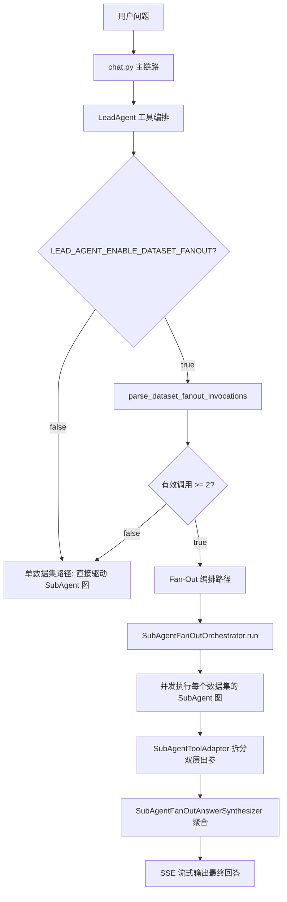
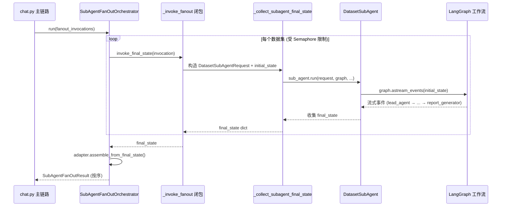
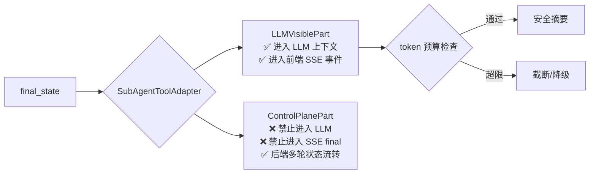

当用户的问题跨越多个数据集边界——例如「对比 A 事业部和 B 事业部的季度营收」——系统需要在单次对话中并发调度多个独立的 SubAgent 实例，并将各自的查询结果聚合成连贯的自然语言回答。本章深入解析 **SubAgent Fan-Out 编排层**的完整架构：从 LeadAgent 工具计划中解析多数据集调用、通过信号量控制并发上限、每个数据集独立运行完整的 NL2DSL2SQL 工作流，到最终将双层出参（LLM 可见摘要 + 控制面胶囊）安全聚合为前端可消费的流式响应。

**前置阅读**：本章假定读者已理解 [SubAgent 调度协议](11-subagent-diao-du-xie-yi-jin-cheng-nei-yu-yuan-cheng-runner-de-shuang-mo-zhi-xing) 和 [DatasetSubAgent 门面](18-datasetsubagent-men-mian-leadagent-yu-yu-yi-ceng-zhi-jian-de-ge-chi-bian-jie)，重点关注并发编排与失败隔离的设计决策。

## 一、触发时机：从 LeadAgent 工具计划到 Fan-Out 决策

Fan-Out 并非一个独立的 LangGraph 节点，而是嵌入在 `chat.py` 的 SSE 流式主链路中的一个**分支决策**。在 LeadAgent 完成工具计划执行（`execute_tool_plan`）并产出 `planned_tool_calls` 列表之后，系统在驱动 SubAgent 图之前做一个关键判断：当前调用是否涉及两个或以上不同数据集的查询？



该分支由配置项 `LEAD_AGENT_ENABLE_DATASET_FANOUT`（布尔值，默认 `False`）控制，确保在非必要场景下不引入额外的编排开销。

Sources: [chat.py](app/api/chat.py#L1838-L1847), [config.py](app/core/config.py#L67)

## 二、解析层：从工具调用中提取有效 Fan-Out 调用

`parse_dataset_fanout_invocations()` 是 Fan-Out 管道的**准入关卡**。其核心职责不是「猜测」哪些调用属于多数据集场景，而是对 LeadAgent 产出的 `planned_tool_calls` 做严格的类型白名单校验。

### 2.1 工具名白名单

只有工具名属于 `DATASET_FANOUT_TOOL_NAMES` 的调用才会被纳入考虑：

| 工具名 | 含义 |
|---|---|
| `dataset_query` | 显式的数据集查询调用 |
| `dataset_subagent` | 通用 SubAgent 调度调用 |
| `subagent_dispatch` | SubAgent 分发调用 |
| `subagent_query` | SubAgent 查询调用 |

任何不属于该集合的调用（例如 `time`、`thread_context` 等控制面工具）会被静默忽略。

### 2.2 关键约束：显式 dataset_id

每个候选调用**必须携带非空的 `dataset_id` 字段**，且同一 `dataset_id` 只会被保留第一次出现。这一约束避免了两类常见误判：

- **没有 dataset_id 的普通 subagent_dispatch 调用**——那可能是 LeadAgent 对当前单一数据集的调度，不应触发 fan-out。
- **同一数据集被重复调用**——去重防止对同一数据集的无效并发。

### 2.3 最少两个有效调用

如果解析出的有效调用不足两个，函数返回空列表 `[]`，由主链路回退到当前单数据集执行路径。这是一个明确的设计决策：**fan-out 不猜测，只响应 LeadAgent 明确规划的多数据集意图**。

```python
# 解析逻辑核心：三步过滤
invocations = []
seen_dataset_ids = set()
for item in planned_tool_calls:
    name = _tool_name(item)          # 1. 工具名白名单过滤
    if name not in DATASET_FANOUT_TOOL_NAMES:
        continue
    args = _tool_args(item)
    dataset_id = _coerce_dataset_id(args.get("dataset_id"))  # 2. 显式 dataset_id 校验
    if dataset_id is None or dataset_id in seen_dataset_ids:  # 3. 去重
        continue
    invocations.append(SubAgentFanOutInvocation(...))
    seen_dataset_ids.add(dataset_id)
return invocations if len(invocations) >= 2 else []  # 至少两个
```

每个成功解析的调用被封装为 `SubAgentFanOutInvocation`，携带 `dataset_id`、`question`、`resolved_question`、`turn_index` 和 `prior_capsule_status`，为后续并发执行提供完整的上下文。

Sources: [subagent_fanout.py](app/services/subagent_fanout.py#L70-L117), [subagent_fanout.py](app/services/subagent_fanout.py#L25-L30)

## 三、并发编排：信号量控制的 SubAgent 并行执行

`SubAgentFanOutOrchestrator` 是 Fan-Out 管道的**执行引擎**。它在设计上严格遵循单一职责原则：只负责并发控制和失败隔离，不参与 LeadAgent 的规划决策。

### 3.1 并发模型：asyncio.Semaphore

编排器通过 `asyncio.Semaphore` 控制最大并行度，默认值为 3（可通过配置项 `SUBAGENT_FANOUT_MAX_PARALLEL` 调整）。所有数据集的 SubAgent 调用被封装为 `asyncio.gather` 的协程列表，信号量确保同一时刻最多只有 `max_parallel` 个调用在执行。

```python
semaphore = asyncio.Semaphore(max(1, self.max_parallel))

async def _run_one(invocation):
    async with semaphore:
        try:
            final_state = await self.invoke_final_state(invocation)
        except TimeoutError as exc:
            final_state = {"error": f"timeout: {exc}"}
        except Exception as exc:
            final_state = {"error": str(exc)}
        return self.adapter.assemble_from_final_state(invocation, final_state)

results = await asyncio.gather(*[_run_one(inv) for inv in invocations])
```

### 3.2 失败隔离：单数据集错误不污染全局

每个 SubAgent 调用被包裹在 `try/except` 中。如果某个数据集的查询超时、抛出异常或返回错误，编排器会将其转换为一个包含 `error` 字段的安全字典，继续传递给适配器层。这意味着：

- 数据集 A 查询成功，数据集 B 查询失败 → A 的结果完整保留，B 返回友好的错误摘要。
- 不会因为一个数据集的异常导致整个 fan-out 流程中断。
- `asyncio.gather` 默认会等待所有协程完成（除非 `return_exceptions=True`，但此处未使用该参数），因此结果顺序与输入调用顺序严格一致。

### 3.3 调用注入：invoke_final_state 函数

编排器本身不感知 SubAgent 图的具体执行细节。它通过构造函数注入的 `invoke_final_state` 回调来驱动每个数据集的查询。在 `chat.py` 中，该回调被实现为一个闭包 `_invoke_fanout`，其内部：

1. 为每个数据集构造独立的 `DatasetSubAgentRequest`，注入 `question`、`dataset_id`、`manifest_version` 等参数。
2. 构造独立的 `initial_state` 字典，设置 `prior_capsule: None` 以确保 fan-out 子调用之间不共享多轮上下文。
3. 调用 `_collect_subagent_final_state()`，该函数驱动完整的 SubAgent 图（运行进程内或远程 Runner），收集所有中间事件，最终返回 `final_state` 字典。



Sources: [subagent_fanout.py](app/services/subagent_fanout.py#L119-L180), [chat.py](app/api/chat.py#L1859-L1905), [chat.py](app/api/chat.py#L348-L392), [config.py](app/core/config.py#L74)

## 四、双层出参适配：LLM 可见面与控制面的强制隔离

`SubAgentToolAdapter`（在 `subagent_tool_adapter.py` 中定义）是 Fan-Out 结果处理中最关键的安全边界。它将每个 SubAgent 的 `final_state` 拆分为两个完全独立的结构体：

### 4.1 LLMVisiblePart：LLM 与前端安全面

```python
class LLMVisiblePart(BaseModel):
    status: LLMVisibleStatus          # ok | clarification_needed | error | empty | timeout
    dataset_id: int
    display_summary: str               # 最多 240 字符的查询结果摘要
    clarification_question: str | None # 需要澄清时的问题文本
    error_summary: str | None          # 友好的错误描述（已脱敏）
    result_ref: str | None             # SQL 结果 Artifact 引用
    report_ref: str | None             # 报告 Artifact 引用
```

该结构体是 **frozen** 的（`ConfigDict(frozen=True)`），且受 token 预算约束（默认 200 tokens）。任何超出预算的可变文本字段会被截断，若截断后仍然超限则降级为最小摘要 `"查询完成"`。强制隔离的设计确保了以下信息**永远不会**进入 LLM 上下文或前端 SSE 事件流：

- 原始 SQL 语句（`SELECT raw_secret FROM internal_table`）
- 完整 SQL 查询结果（含敏感数据行）
- 控制面胶囊中的多轮上下文
- 内部异常堆栈

### 4.2 ControlPlanePart：后端流转的控制面

```python
class ControlPlanePart(BaseModel):
    capsule: dict | None              # 本轮 SubAgent 输出胶囊（供下一轮多轮追问使用）
    last_success_task: dict | None    # 最近成功任务的状态快照
    result_ref: str | None            # 结果 Artifact 引用
    report_ref: str | None            # 报告 Artifact 引用
    prior_capsule_status: dict        # 胶囊加载状态
    raw_error: Any | None             # 原始错误（仅后端日志/审计用）
```

控制面使用 `arbitrary_types_allowed=True`，允许携带复杂数据结构。它通过 `subagent_control_plane_sink` 列表在后端流转，供多轮对话的状态合并和审计追踪使用，但**禁止出现在 SSE `final` 事件或 Langfuse trace 输出中**。

### 4.3 状态推断逻辑

`_build_llm_visible` 方法根据 `final_state` 的内容推断 LLM 可见状态：

| 条件 | `LLMVisibleStatus` | 说明 |
|---|---|---|
| `final_state.error` 非空 | `ERROR` | 异常已脱敏为友好提示 |
| `query_plan.execution_strategy == "clarify"` 或 route 为 `query_plan_clarification` | `CLARIFICATION_NEEDED` | 需要用户补充信息 |
| `sql_result.row_count == 0` | `EMPTY` | 查询无匹配结果 |
| 其他正常情况 | `OK` | 查询成功，携带摘要和 Artifact 引用 |



Sources: [subagent_tool_adapter.py](app/services/subagent_tool_adapter.py#L1-L50), [subagent_tool_adapter.py](app/services/subagent_tool_adapter.py#L87-L175), [subagent_tool_adapter.py](app/services/subagent_tool_adapter.py#L213-L300)

## 五、结果聚合与流式输出

### 5.1 聚合器：SubAgentFanOutAnswerSynthesizer

`SubAgentFanOutAnswerSynthesizer` 是聚合层的唯一入口。它**只读取 `LLMVisiblePart`**，不接触控制面或原始 SQL 结果。其 `synthesize` 方法按数据集逐条拼接摘要，并附上 Artifact 引用：

```
已完成多数据集查询：
- 数据集 1: ok
  数据集 1 查询完成
  refs: artifact:result-1, artifact:report-1
- 数据集 2: error
  数据查询执行失败，已记录，可以稍后重试。
```

这一输出既是最终用户看到的回答，也是持久化到 `Message.content` 的内容。

### 5.2 流式输出事件

Fan-Out 在 SSE 流中产生两个 `step` 事件：

1. **`subagent_fanout` (status: `running`)**：在并发执行开始前发送，携带 `dataset_ids` 列表，前端可据此展示「正在查询多个数据集」的进度指示。
2. **`subagent_fanout` (status: `done`)**：在所有并发调用完成后发送，携带 `elapsed_ms`、每个数据集的 `statuses` 列表。

随后是一个标准的 `final` 事件，其中 `entry_route` 和 `entry_intent` 均设为 `"dataset_fanout"`，`subagent_tool_results` 字段携带每个数据集的 `LLMVisiblePart` JSON 序列化结果。

### 5.3 持久化与追踪

Fan-Out 回答以一条 `assistant` 角色的 `Message` 持久化，其 `response_metadata` 包含完整的风控信息：

| 字段 | 内容 |
|---|---|
| `execution_path` | `"dataset_fanout"` |
| `subagent_tool_results` | 每个数据集的 LLM 可见摘要列表 |
| `fanout_trace` | `dataset_count`、每个数据集的 `status` |
| `langfuse` | trace/session/release 等观测上下文 |
| `lead_agent_context` | LeadAgent 完整控制面上下文 |

Artifact 引用（`result_ref` / `report_ref`）通过 `ArtifactStore.attach_message_id` 与消息关联，前端可通过 Artifact API 按需拉取完整 SQL 结果或报告。

Sources: [subagent_fanout.py](app/services/subagent_fanout.py#L183-L207), [chat.py](app/api/chat.py#L1906-L2010)

## 六、配置项总览与调优建议

| 配置项 | 类型 | 默认值 | 说明 |
|---|---|---|---|
| `LEAD_AGENT_ENABLE_DATASET_FANOUT` | `bool` | `False` | 总开关；关闭时所有多数据集场景走单数据集回退路径 |
| `SUBAGENT_FANOUT_MAX_PARALLEL` | `int` | `3` | 最大并发 SubAgent 数；受 `asyncio.Semaphore` 约束 |
| `SUBAGENT_LLM_VISIBLE_TOKEN_BUDGET` | `int` | `200` | LLM 可见摘要的最大 token 数 |

**调优建议**：

- **`SUBAGENT_FANOUT_MAX_PARALLEL` 不宜过大**：每个 SubAgent 调用会执行完整的 LangGraph 工作流（包含多次 LLM 调用和数据库查询），并发数过高可能导致下游 LLM API 的 rate limit 触发或数据库连接池耗尽。生产环境建议从 2-3 起步，根据实际负载调优。
- **`SUBAGENT_LLM_VISIBLE_TOKEN_BUDGET` 的截断逻辑是最后防线**：正常情况下 `display_summary` 不超过 240 字符，远低于 200 token 预算。如果截断仍超限，系统会降级为 `"查询完成"` 并记录 warning 日志——这是防御性编程，表明存在异常长的摘要生成。
- **Fan-Out 仅在 `>= 2` 个数据集时触发**：单个 `subagent_dispatch` 调用不会被误判为 fan-out，这是通过 `len(invocations) >= 2` 的下界约束实现的。

Sources: [subagent_fanout.py](app/services/subagent_fanout.py#L115-L117), [config.py](app/core/config.py#L67-L74), [subagent_tool_adapter.py](app/services/subagent_tool_adapter.py#L257-L300)

## 七、测试覆盖：并发正确性与安全隔离验证

测试文件 `test_subagent_fanout.py` 覆盖了 Fan-Out 编排层的三个核心关注点：

### 7.1 并发正确性

`test_fanout_respects_max_parallel` 通过计数器验证：当 `max_parallel=2` 且提交 3 个数据集调用时，同时活跃的协程数峰值恰好为 2，证明 `asyncio.Semaphore` 正确地限制了并发度。

### 7.2 失败隔离

`test_fanout_collects_safe_results_and_control_plane` 模拟数据集 1 正常返回、数据集 2 返回 SQL 错误。断言验证：

- 结果顺序保持 `[1, 2]`（即使并发执行，`gather` 保证顺序）
- 数据集 1 的 `llm_visible.status == OK`，`control_plane.capsule` 包含正确数据
- 数据集 2 的 `llm_visible.status == ERROR`，`control_plane.capsule is None`
- LLM 渲染结果中**不含**原始 SQL（`SELECT amount`）和内部错误信息（`internal_table`）

### 7.3 信息隔离

`test_answer_synthesizer_uses_only_llm_visible_and_refs` 验证：即使 `final_state` 中携带完整的 `sql`、`sql_result` 和 `out_capsule`，最终的合成回答中只出现 `display_summary` 和 `artifact:result-X` / `artifact:report-X` 引用，**不含**任何原始 SQL、数据行或胶囊标记。

Sources: [test_subagent_fanout.py](tests/test_subagent_fanout.py#L1-L149)

## 八、架构决策记录

Fan-Out 编排层的设计体现了以下架构原则：

1. **安全面与控制面强制分离**：`LLMVisiblePart`（frozen + token 预算）与 `ControlPlanePart`（arbitrary_types_allowed）是物理隔离的两个 Pydantic 模型，不存在通过字段命名约定或注释软约束的漏洞。

2. **失败不扩散**：每个数据集的 SubAgent 调用在 `try/except` 中独立执行，一个数据集的超时或异常只影响该数据集的 `LLMVisiblePart`，不会阻止其他数据集的结果输出。

3. **编排器无状态**：`SubAgentFanOutOrchestrator` 接受注入的 `invoke_final_state` 回调，不持有任何数据库连接、图实例或配置引用，使其可被独立测试且易于替换执行策略（例如未来可能引入的优先级队列调度）。

4. **最少两个数据集的硬约束**：`parse_dataset_fanout_invocations` 明确要求至少两个有效调用，从机制上杜绝了单数据集被误路由到 fan-out 路径的可能性。

**延伸阅读**：Fan-Out 结果中的控制面胶囊（`ControlPlanePart.capsule`）会通过 `subagent_control_plane_sink` 传递到多轮对话的上下文合并流程，详见 [多轮上下文构建器](20-duo-lun-shang-xia-wen-gou-jian-qi-zhui-wen-shi-bie-shi-jian-zeng-liang-jie-xi-yu-xiao-nang-he-bing)。每个数据集的独立 Artifact 引用则由 [QueryArtifact 持久化协议](21-querytaskcapsule-yu-queryartifact-kua-lun-cha-xun-zhuang-tai-de-chi-jiu-hua-xie-yi) 管理。