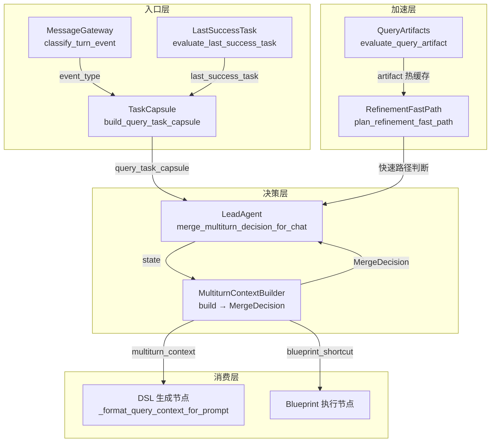
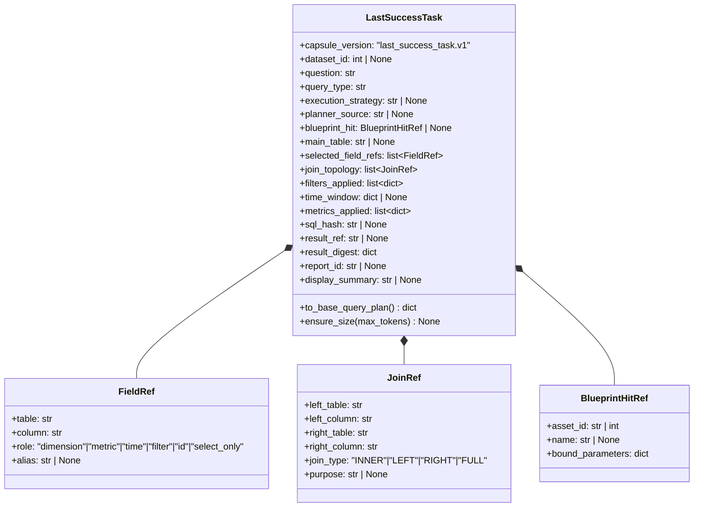
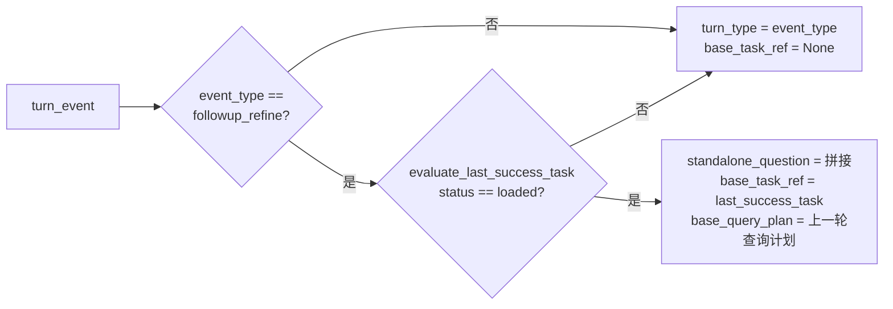
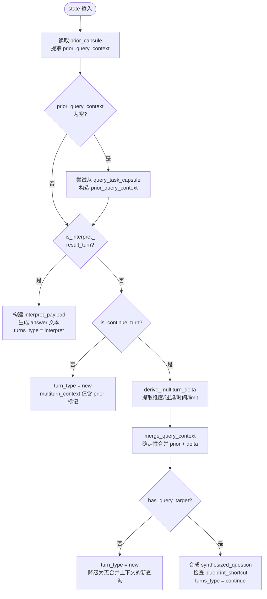
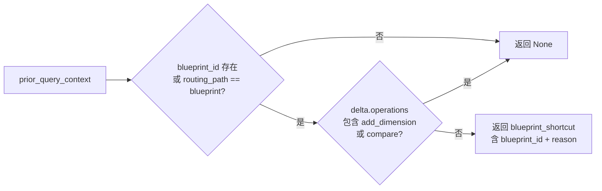
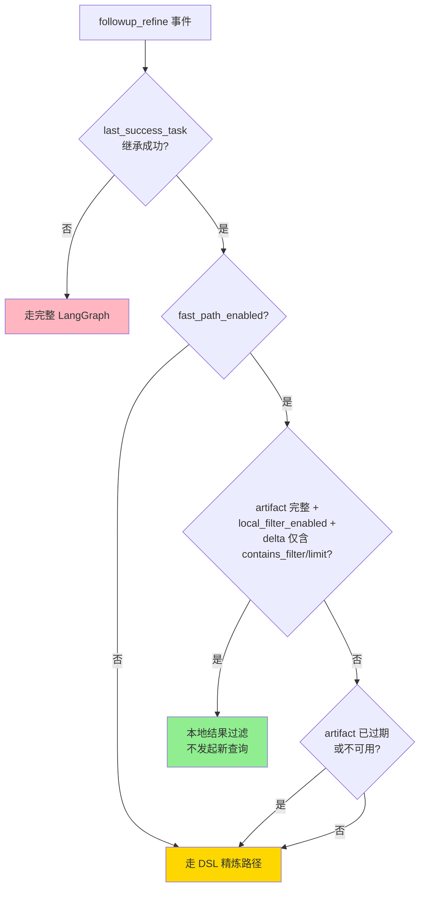

多轮上下文构建器（MultiturnContextBuilder）是整个多轮对话系统的核心决策引擎。它负责在每一轮用户输入到达时，完成三件关键任务：**识别用户是否在进行追问**（而非发起全新查询）、**从追问文本中提取增量约束**（维度、过滤条件、时间范围、返回条数）、以及**将增量与上一轮上下文合并**生成可注入 DSL 生成 prompt 的统一查询上下文。这一层设计将决策逻辑从 LangGraph 节点中彻底抽离到 services 层，确保 graph 层的节点保持薄壳角色，同时为未来的 A/B 测试和决策策略替换提供了清晰的边界。

Sources: [multiturn_context.py](app/services/multiturn_context.py#L1-L14)

## 系统架构总览

整个多轮上下文系统由五个协同模块构成，它们围绕 `MultiturnContextBuilder` 形成一条从用户输入分类到 DSL prompt 注入的完整链路：



入口层首先通过 `MessageGateway.classify_turn_event()` 将用户输入归类为五种事件类型之一：`new_query`（全新查询）、`followup_refine`（追问精炼）、`interpret_result`（结果解释）、`dataset_select`（数据集切换）或 `clarify`（澄清）。随后 `TaskCapsule.build_query_task_capsule()` 结合上一轮成功查询快照 `LastSuccessTask` 构造出当前轮的查询胶囊。决策层中 `LeadAgent.merge_multiturn_decision_for_chat()` 实例化 `MultiturnContextBuilder` 并调用 `build()` 方法，产出 `MergeDecision` 纯决策数据结构————该决策随后被映射回 LangGraph 的 initial_state 或触发早退路径。

Sources: [message_gateway.py](app/services/message_gateway.py#L30-L88), [task_capsule.py](app/services/task_capsule.py#L62-L119), [lead_agent.py](app/services/lead_agent.py#L2576-L2622)

## 入口事件分类：五种 Turn 类型的判定

多轮系统的第一道闸门是 `classify_turn_event()`。它基于纯规则匹配（无 LLM 调用），将用户文本和会话状态映射为结构化事件，决定本轮是否进入 LangGraph 查询图：

| 判定条件 | 事件类型 | 是否进入图 | 典型用户输入 |
|---|---|---|---|
| 匹配 `选择/切换到/使用 ... 数据集` | `dataset_select` | 否 | "切换到销售数据集" |
| 存在待处理澄清 + 本轮文本非空 | `clarification_answer` | 否 | 对上轮澄清的回复 |
| 存在上一轮成功结果 + 包含"说明什么/解释/怎么看" | `interpret_result` | 否 | "这个结果说明什么" |
| 包含"只看/仅看/筛选/换成/改成/改为" + 有上一轮结果 | `followup_refine` | 是 | "只看华东地区" |
| 包含"只看/仅看/筛选"但无上一轮结果 | `clarify` | 否 | 触发澄清回答 |
| 未选择数据集 + 空文本 | `clarify` | 否 | 引导选择数据集 |
| 其他情况 | `new_query` | 是 | "各门店销售额" |

这一层的关键设计理念是**早退优先**：`dataset_select`、`clarification_answer`、`interpret_result` 和 `clarify` 四种事件不会进入 LangGraph 查询图，而是直接在 API 层返回结果，减少不必要的 LangGraph 调度开销。

Sources: [message_gateway.py](app/services/message_gateway.py#L20-L88)

## 上一轮成功查询快照：LastSuccessTask

`LastSuccessTask` 是跨轮状态持久化的最小白名单协议。每次 SubAgent 成功完成查询后，系统从本轮产出的 `query_plan`、`dsl`、`sql`、`sql_result` 和 `result_artifact` 中抽取严格限定的一组字段，构造一个 Pydantic v2 模型实例，并校验其 token 预算不超过 `MULTITURN_LAST_SUCCESS_TASK_MAX_TOKENS`（默认 2000 tokens）。



快照的核心设计约束：不保存完整结果行（仅保留 `result_digest` 中的行数和列结构摘要），不保存 SQL 原文（仅保留 SHA256 哈希），不保存字段 metadata（`FieldRef` 仅保留定位信息）。`evaluate_last_success_task()` 在进行继承性校验时，会检查版本号兼容性、数据集 ID 匹配、Schema 版本与 Manifest 版本一致性，以及查询目标存在性————任何一项不匹配都会导致继承状态为 `stale` 或 `not_applicable`。

Sources: [last_success_task.py](app/services/multiturn/last_success_task.py#L81-L179), [last_success_task.py](app/services/multiturn/last_success_task.py#L245-L306)

## QueryTaskCapsule：当前轮查询胶囊

`build_query_task_capsule()` 将本轮事件（来自 `classify_turn_event` 的输出）与上一轮成功快照的继承结果合并为 SubAgent 可消费的查询胶囊。关键逻辑在于继承判定：



只有在同时满足三个条件时才会触发继承：（1）事件类型为 `followup_refine`，（2）上一轮成功快照通过所有校验（数据集、Schema 版本、Manifest 版本、查询目标），（3）当前活跃数据集 ID 不为空。继承成功后，胶囊会携带 `base_query_plan`（通过 `LastSuccessTask.to_base_query_plan()` 生成），该计划包含上一轮的主表、字段引用、JOIN 拓扑、过滤条件和时间窗口等结构化信息，供 `MultiturnContextBuilder` 构造 `prior_query_context` 使用。

Sources: [task_capsule.py](app/services/task_capsule.py#L62-L119)

## MergeDecision：纯合并决策数据结构

`MergeDecision` 是 `MultiturnContextBuilder.build()` 的唯一输出，它是一个 `@dataclass` 纯数据结构，不包含任何 LangGraph 字段引用。节点薄壳（`merge_prior_context_node`）或 LeadAgent 调用方根据 `MergeDecision` 的字段将决策映射到 LangGraph output dict 或 API 响应：

| 字段 | 类型 | 含义 |
|---|---|---|
| `turn_type` | `"interpret" \| "new" \| "new_query" \| "continue"` | 本轮对话类型 |
| `multiturn_context` | `dict \| None` | 注入 DSL 生成 prompt 的合并上下文 |
| `synthesized_question` | `str \| None` | continue 时补全的问题文本（"基于上一轮问题『...』，..."） |
| `blueprint_shortcut` | `dict \| None` | 蓝图快捷候选（含 `enabled` 和 `settings_enabled`） |
| `interpret_payload` | `dict \| None` | interpret 早退时的完整应答载荷（含 answer/entry_intent/out_capsule） |
| `merge_debug` | `dict` | 可观测性 trace 用调试信息 |

Sources: [multiturn_context.py](app/services/multiturn_context.py#L142-L166)

## build() 主入口：四种 Turn 类型的决策树

`MultiturnContextBuilder.build()` 是系统的核心决策函数，它按优先级依次判定四个分支：



### 分支 1: interpret 早退

当上一轮 SubAgent 的 dispatch capsule 中 `execution_mode == "interpret_result"`，或 LeadAgent 多轮意图分类为 `"interpret"` 时，builder 直接走解释路径。它从上一轮 capsule 的 `result_digest` 中读取行数、列名、数值摘要等轻量数据，生成一段无需重新执行 SQL 的解释文本。`interpret_payload` 中包含完整的早退载荷，调用方直接将其作为最终响应返回，完全跳过 LangGraph 图执行。

Sources: [multiturn_context.py](app/services/multiturn_context.py#L204-L211), [multiturn_context.py](app/services/multiturn_context.py#L446-L481)

### 分支 2: new（全新查询）

当 `is_continue_turn()` 返回 `False` 时（即本轮的显式 `turn_type` 不为 `continue/follow_up/interpret`，LeadAgent 意图不为继续类，且追问文本不包含 `_CONTINUE_PATTERNS` 关键词），builder 将本轮标记为全新查询。此时 `multiturn_context` 仅携带 `prior_available` 标记和空的 merged 上下文，DSL 生成节点不会注入任何多轮提示。

### 分支 3: new_query（降级为新查询）

当追问识别成功但在合并后发现 `merged_query_context` 中没有可承接的查询目标（`has_query_target()` 返回 `False`）时，builder 降级为 `new` 类型。这种情况发生在上一轮查询是 blueprint 快捷执行但蓝图参数在当前追问下不适用时。

### 分支 4: continue（多轮继续）

这是多轮系统的核心路径。builder 依次完成：（1）从当前问题文本中提取增量 delta（维度、过滤、时间、limit），（2）将 delta 与上一轮的 `prior_query_context` 做确定性合并，（3）合成补全问题文本（如果当前问题中没有包含上一轮问题原文），（4）检查是否存在 blueprint 快捷候选。

Sources: [multiturn_context.py](app/services/multiturn_context.py#L485-L621)

## 追问识别：is_continue_turn 的多层判定

`is_continue_turn()` 是区分全新查询与追问的关键方法。它采用四层判定策略，优先级从高到低：

1. **显式 turn_type**：如果 `state["turn_type"]` 已经被下游明确设置为 `"continue"`、`"follow_up"` 或 `"followup"`，直接返回 `True`；如果是 `"new"` 则返回 `False`。
2. **LeadAgent 意图分类**：如果 LeadAgent 的多轮分类结果为 `"continue"` 或 `"interpret"`，且存在上一轮查询上下文，则判定为继续。
3. **关键词匹配**：如果问题文本中包含 `_CONTINUE_PATTERNS` 中的任一关键词（如"继续"、"再"、"也"、"换成"、"上面"、"刚才"、"这个"、"同比"、"环比"等 27 个模式），且存在上一轮查询上下文，则判定为继续。
4. **默认**：不满足以上任何条件时，判定为新查询。

关键词集的精心设计使得系统能够识别汉语中丰富的隐式指代（如"这个"、"那个"指向上一轮结果）和操作型追问（如"按...拆分"、"只看"、"排名"），而不依赖 LLM 调用来做意图分类。

Sources: [multiturn_context.py](app/services/multiturn_context.py#L30-L50), [multiturn_context.py](app/services/multiturn_context.py#L213-L225)

## 增量提取：五种 Delta 类型的解析器

`derive_multiturn_delta()` 对当前追问文本进行多维度解析，产出不绑定具体 Schema 的确定性 delta。五个解析器各司其职：

### 维度增量（extract_dimension_delta）

通过正则模式 `按...拆分/分组/统计/汇总/看/排名`、`拆分/分组到...` 和 `按/从...维度/口径` 提取用户期望的新增维度短语，并做语义级去重（忽略大小写、空白、下划线和引号）。

```
输入: "再按城市拆分"
输出: ["城市"]
```

Sources: [multiturn_context.py](app/services/multiturn_context.py#L227-L240)

### 过滤增量（extract_filter_delta）

识别 `只看/仅看/筛选/限定...` 和 `换成/改成/改为...` 模式，将原始过滤文本（保留原始表述不做语义映射）作为 `{"raw": "...", "source": "question_delta"}` 结构返回，后续由 DSL 生成 LLM 完成到语义资产（维度值、术语）的映射。

```
输入: "只看华东和华南"
输出: [{"raw": "华东和华南", "source": "question_delta"}]
```

Sources: [multiturn_context.py](app/services/multiturn_context.py#L242-L252)

### 时间增量（extract_time_delta）

先通过 `_TIME_DELTA_PATTERNS` 关键词集（"今天"、"昨天"、"本周"、"上月"、"最近"、"近"等 14 个模式）判定是否涉及时问改动，再分为两类处理：**相对数值型**（"最近 7 天"）解析出 `kind="relative_recent"` 及 `amount`/`unit`；**相对命名型**（"本月"、"上月"）仅保留原文和 `kind="relative_named"`，不做具体日期推理。

```
输入: "最近7天"  →  {"raw": "最近7天", "kind": "relative_recent", "amount": 7, "unit": "天"}
输入: "上个月"   →  {"raw": "上个月", "kind": "relative_named"}
```

Sources: [multiturn_context.py](app/services/multiturn_context.py#L52-L64), [multiturn_context.py](app/services/multiturn_context.py#L254-L270)

### 返回条数增量（extract_limit_delta）

通过 `top/前 N` 正则提取用户期望的返回条数限制，仅在匹配成功时返回整数值。

### Delta 类型推导

提取完成后，builder 根据 delta 的内容组合推导 `delta_type` 和 `operations` 列表：

| 是否存在 | operations 追加 | delta_type |
|---|---|---|
| dimensions 非空 | `add_dimension` | `drill` |
| filters 非空 | `add_filter` | `refine` |
| time_delta 非空 | `change_time_range` | — |
| limit 或 "排名" | `rank_or_limit` | — |
| "同比" 或 "环比" | `compare` | `compare` |

`delta_type` 的优先级为 `compare > drill > refine`，当存在同比/环比时整个 delta 被标记为对比类，随后依据维度是否存在降级为下钻或精炼。

Sources: [multiturn_context.py](app/services/multiturn_context.py#L282-L320)

## 上下文合并：merge_query_context 的确定性策略

上下文的合并采用**深度复制 + 追加去重 + 覆盖**的确定性策略，避免引入 LLM 不确定性：

| 字段 | 策略 | 说明 |
|---|---|---|
| `question` | 覆盖 | 替换为当前轮问题 |
| `source` | 覆盖 | 固定为 `"multiturn_merge"` |
| `dimensions` | 追加去重 | 上一轮维度 + 本轮新增维度，JSON 序列化后去重 |
| `filters` | 追加去重 | 上一轮过滤 + 本轮新增过滤 |
| `time_range` | 覆盖 | 如果本轮指定了时间，直接替换上一轮的时间范围 |
| `limit` | 覆盖 | 如果本轮指定了 limit，直接替换 |

维度使用 `_dedupe_jsonable()` 做结构化去重（通过 JSON 序列化后比较），过滤使用 `_dedupe_jsonable()` 同样策略。这种确定性合并的设计确保了追问场景下 DSL 生成的输入一致性。

Sources: [multiturn_context.py](app/services/multiturn_context.py#L322-L346)

## 问题补全：synthesized_question

当 builder 判定为 continue 路径时，如果当前问题文本中不包含上一轮问题的原文，builder 会合成一个补全问题：

```python
synthesized_question = f"基于上一轮问题「{previous_question}」，{current_question}"
```

这个补全文本不会替换 `state["question"]`，而是作为独立字段 `synthesized_question` 写入 `MergeDecision` 和 `multiturn_context`，使得 DSL 生成 LLM 能够在充分理解对话上下文的前提下生成查询。如果当前问题已经内嵌了上一轮问题的关键词（例如"刚才那个查询再按门店拆分"），则不做补全。

Sources: [multiturn_context.py](app/services/multiturn_context.py#L437-L444), [multiturn_context.py](app/services/multiturn_context.py#L582-L587)

## Blueprint 快捷候选：跳过重复规划的优化

`blueprint_shortcut_candidate()` 识别一种特殊的多轮场景：当追问仅调整过滤条件、时间范围或返回条数，而上一轮查询是通过 Analysis Blueprint 执行时，本轮可以跳过完整的 SubAgent 规划流程，直接基于上一轮的蓝图参数空间生成 DSL。



候选结果同时携带两个标志：
- **`enabled`**：表示候选本身合法（delta 在蓝图参数空间内）
- **`settings_enabled`**：读取 `MULTITURN_BLUEPRINT_SHORTCUT_ENABLED` 配置项（默认关闭），用于灰度控制

节点薄壳根据这两个标志决定是否将路由定向到 `blueprint_execute` 节点。

Sources: [multiturn_context.py](app/services/multiturn_context.py#L367-L393)

## 查询结果 Artifact 与本地过滤快速路径

与 builder 协同工作的 `query_artifacts.py` 和 `refinement_fast_path.py` 提供了追问场景下的性能加速路径。当上一轮 SQL 查询的结果集完整（无截断、无 LIMIT、row_count 与实际行数一致）时，系统将结果缓存到进程内热缓存（兼容 Redis 接口），默认 TTL 为 30 分钟。

`plan_refinement_fast_path()` 实现了三级加速决策：



最理想的绿色路径（本地结果过滤）完全避免数据库查询：`apply_local_result_filter()` 对缓存的完整结果集做纯内存的文本包含过滤和条数截断。这适用于"只看华东"、"前 10 条"等简单追问。当前 SQL AST Patch 路径（直接修改上一轮 SQL）因安全考量保持默认关闭和 fail-closed 策略。

Sources: [query_artifacts.py](app/services/multiturn/query_artifacts.py#L33-L101), [query_artifacts.py](app/services/multiturn/query_artifacts.py#L186-L216), [refinement_fast_path.py](app/services/multiturn/refinement_fast_path.py#L47-L139)

## 注入 DSL 生成 Prompt：从上下文到提示词

合并后的 `multiturn_context` 最终通过 `_format_query_context_for_prompt()` 注入 DSL 生成节点的 LLM prompt。该函数仅对 `turn_type == "continue"` 的上下文生效，将 `prior_query_context`、`delta` 和 `merged_query_context` 三个子结构序列化为 JSON 字符串（上限 3000 字符），以 `【多轮查询上下文】` 标记注入 `HumanMessage` 文本。

```
【多轮查询上下文】
{"prior_query_context": {"metrics": ["销售额"], "dimensions": ["省份"], ...},
 "delta": {"dimensions": ["城市"], "delta_type": "drill", "operations": ["add_dimension"]},
 "merged_query_context": {"metrics": ["销售额"], "dimensions": ["省份", "城市"], ...}}
```

DSL 生成 LLM 据此理解：用户正在基于上一轮的省份销售额查询做城市维度的下钻分析，需要生成包含省份和城市两个维度、销售额一个指标的 DSL。这种结构化的上下文注入使得 LLM 能够准确理解追问意图，生成与对话历史一致的 DSL。

Sources: [nodes.py](app/graph/nodes.py#L472-L485), [nodes.py](app/graph/nodes.py#L1579-L1627)

## LeadAgent 集成：Phase 2 上提架构

在 Phase 2 重构中，多轮合并决策从 LangGraph 节点内部完全上提到 LeadAgent 服务层：

```python
# chat.py 中的调用顺序
merge_decision = merge_multiturn_decision_for_chat(
    state=state,
    out_capsule_factory=_build_out_capsule_for_chat,
    tracer=tracer,
    trace_context=trace_context,
)
if merge_decision.interpret_payload is not None:
    return 早退响应  # 跳过 LangGraph
# 否则将 decision 字段塞入 LangGraph initial_state
```

`merge_prior_context_node`（在 `nodes.py` 中）已退化为一个 noop 虚拟 span 节点，仅为兼容 SSE 阶段标签和 observability 链路而保留。这一架构调整实现了决策逻辑与服务层的完全解耦，使得 `MultiturnContextBuilder` 可以在不触碰 LangGraph 图定义的前提下独立演化和测试。

Sources: [lead_agent.py](app/services/lead_agent.py#L2576-L2622), [nodes.py](app/graph/nodes.py#L714-L719)

## 配置项总览

多轮系统的所有行为均通过 `Settings` 中的 feature flags 控制，默认全部关闭以保持向后兼容：

| 配置项 | 默认值 | 作用 |
|---|---|---|
| `MULTITURN_ENABLED` | `False` | 多轮对话总开关 |
| `MULTITURN_LOCK_TTL_SECONDS` | `300` | 会话锁 TTL |
| `MULTITURN_COMPACTION_ENABLED` | `False` | 上下文压缩开关 |
| `MULTITURN_BLUEPRINT_SHORTCUT_ENABLED` | `False` | 蓝图快捷路径开关 |
| `MULTITURN_LAST_SUCCESS_TASK_MAX_TOKENS` | `2000` | 跨轮快照 token 上限 |
| `MULTITURN_ARTIFACT_CACHE_TTL_SECONDS` | `1800` | 结果热缓存 TTL |
| `MULTITURN_REFINEMENT_FAST_PATH_ENABLED` | `False` | 快速路径总开关 |
| `MULTITURN_RESULT_LOCAL_FILTER_ENABLED` | `False` | 本地结果过滤开关 |
| `MULTITURN_SQL_AST_PATCH_ENABLED` | `False` | SQL AST 补丁开关（fail-closed） |

Sources: [config.py](app/core/config.py#L55-L64)

## 阅读下一步

多轮上下文构建器产出的 `MergeDecision` 和 `multiturn_context` 是跨轮查询状态的入口，了解了它的决策逻辑后，建议继续阅读以下页面深入理解整个多轮体系：

- [QueryTaskCapsule 与 QueryArtifact：跨轮查询状态的持久化协议](21-querytaskcapsule-yu-queryartifact-kua-lun-cha-xun-zhuang-tai-de-chi-jiu-hua-xie-yi) — 理解 `LastSuccessTask` 和查询结果 artifact 的完整持久化流程
- [ConversationStore：会话锁、消息压缩与线程状态管理](22-conversationstore-hui-hua-suo-xiao-xi-ya-suo-yu-xian-cheng-zhuang-tai-guan-li) — 理解多轮会话如何在数据库层管理锁、压缩和状态
- [消息网关：用户输入事件分类与早退路由](23-xiao-xi-wang-guan-yong-hu-shu-ru-shi-jian-fen-lei-yu-zao-tui-lu-you) — 深入 `classify_turn_event()` 的事件分类机制
- [LangGraph 工作流装配：节点注册、条件路由与重试逻辑](7-langgraph-gong-zuo-liu-zhuang-pei-jie-dian-zhu-ce-tiao-jian-lu-you-yu-zhong-shi-luo-ji) — 理解 `MergeDecision` 如何被映射到 LangGraph 的路由决策