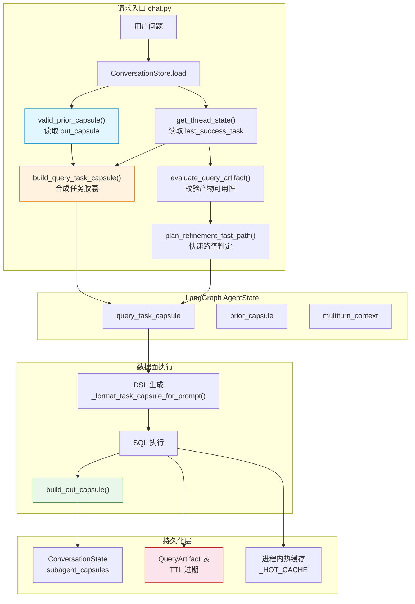
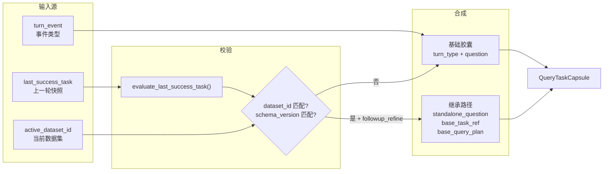
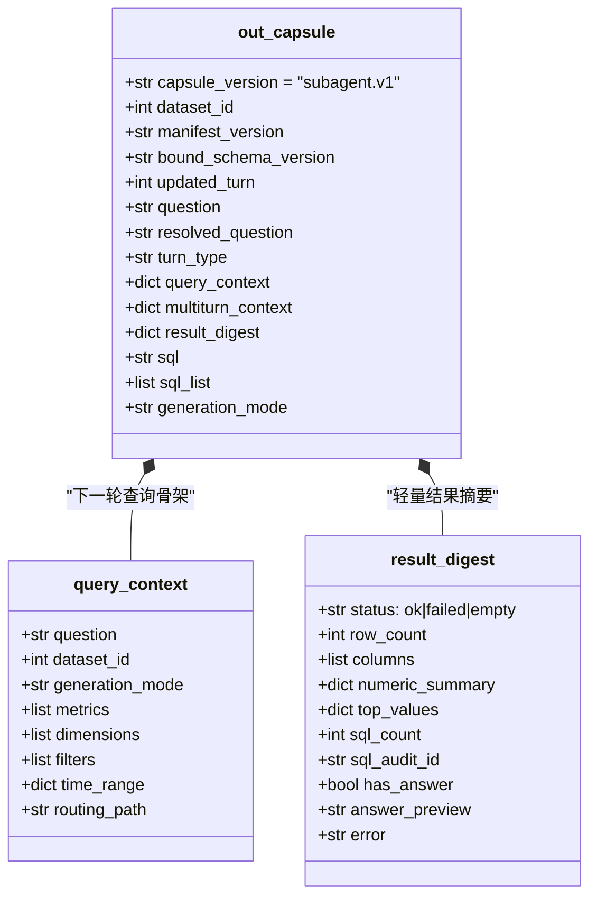
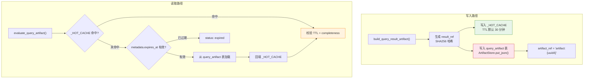
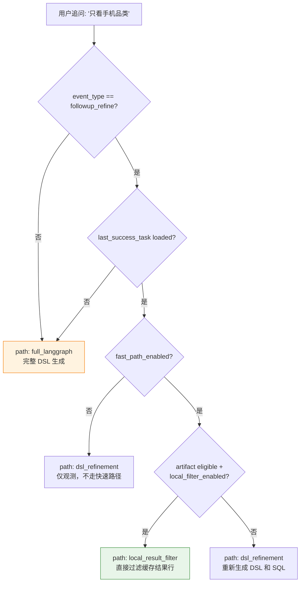
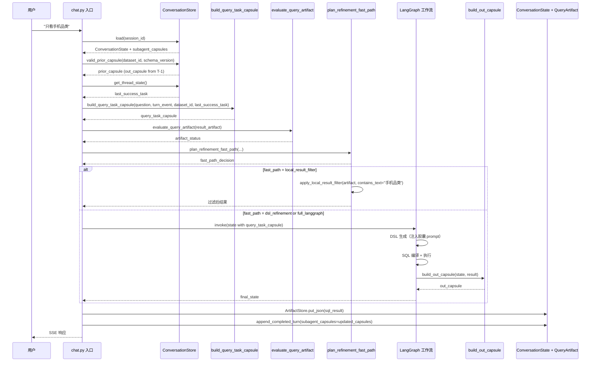

多轮问数场景的核心挑战在于：用户上一轮查询的结果、语义上下文和查询意图，如何以安全、轻量且可校验的方式传递到下一轮。Datalogue 为此设计了两套互补的协议——**QueryTaskCapsule**（任务胶囊）负责"操作手册"的角色，告诉 SubAgent"上一轮做了什么、本轮要如何承接"；**QueryArtifact**（查询产物）负责"数据负载"的角色，将上一轮 SQL 查询结果以 TTL 约束的引用形式保存，供快速路径本地过滤复用。两者与 `out_capsule`（输出胶囊）和 `LastSuccessTask`（最小跨轮快照）共同构成完整的跨轮状态持久化体系。

## 架构全景：四层协议的职责边界

下图展示了从用户请求到跨轮状态回写的完整数据流。四层协议各司其职，互不越界：



四层协议的核心区别体现在下表：

| 协议层 | 存储位置 | 生命周期 | 消费者 | 核心职责 |
|---|---|---|---|---|
| **QueryTaskCapsule** | 内存（LangGraph state） | 单次请求 | DSL 生成节点 | 操作手册：告诉 SubAgent 本轮如何承接上一轮 |
| **out_capsule** | `ConversationState.subagent_capsules` | 跨轮持久化 | `valid_prior_capsule()` | 输出胶囊：保存 query_context + result_digest 供下轮复用 |
| **LastSuccessTask** | `thread_state["last_success_task"]` | 跨轮持久化 | `build_query_task_capsule()` | 最小快照：严格白名单的上一轮查询摘要 |
| **QueryArtifact** | `query_artifact` 表 + 进程内存 | TTL 过期（默认 30 分钟） | `evaluate_query_artifact()` | 数据负载：SQL 结果行集，供本地过滤快速路径 |

Sources: [app/schemas/capsule.py](app/schemas/capsule.py#L1-L90), [app/services/task_capsule.py](app/services/task_capsule.py#L1-L120), [app/services/multiturn/last_success_task.py](app/services/multiturn/last_success_task.py#L1-L200), [app/services/artifact_store.py](app/services/artifact_store.py#L1-L237), [app/models/conversation.py](app/models/conversation.py#L114-L162)

## QueryTaskCapsule：SubAgent 的操作手册

QueryTaskCapsule 是"本轮 SubAgent 应如何理解上一轮查询结果"的轻量指令集。它不保存任何数据结果本身——那是 QueryArtifact 的职责——而是告诉 DSL 生成节点：上一轮查了什么表、用了什么查询计划、本轮是全新查询还是追问细化。

### 胶囊的构建：从线程记忆到可消费指令

胶囊构建发生在 `app/api/chat.py` 的请求入口处，早于 LangGraph 工作流启动。`build_query_task_capsule()` 接收三个输入源：

1. **`turn_event`**：消息网关分类的本轮事件类型（`new_query` | `followup_refine` 等），决定胶囊的基础 `turn_type`
2. **`last_success_task`**：从线程记忆（`thread_state`）中读取的上一轮最小快照，经 `evaluate_last_success_task()` 校验后决定是否可继承
3. **`active_dataset_id`**：当前路由命中的数据集 ID，用于校验跨数据集继承的合法性



当且仅当 `turn_event.event_type == "followup_refine"` 且 `evaluate_last_success_task()` 返回 `status: "loaded"` 且 `dataset_id` 匹配时，胶囊才会进入继承模式：将 `standalone_question` 补全为"基于上一轮问题「...」，{当前问题}"，并携带 `base_task_ref`、`base_question`、`base_main_table` 和 `base_query_plan`。否则胶囊仅包含基础字段，SubAgent 按全新查询处理。

Sources: [app/services/task_capsule.py](app/services/task_capsule.py#L76-L120)

### 胶囊在 DSL 生成中的注入

QueryTaskCapsule 被注入到 LangGraph 的 `AgentState.query_task_capsule` 字段中，随后在 DSL 生成阶段由 `_format_task_capsule_for_prompt()` 将其关键字段压缩为 prompt 可消费的文本摘要：

```python
# 注入到 DSL prompt 的字段白名单
for key in (
    "turn_type",        # 本轮类型：new_query / followup_refine
    "base_task_ref",    # 继承来源标识
    "base_main_table",  # 上一轮主表
    "standalone_question",  # 补全后的独立问题
    "base_question",    # 上一轮原始问题
):
```

这种"白名单注入"的设计确保了 DSL LLM 只看到对查询生成有用的结构化信号，不会被胶囊内部的其他元数据干扰。同时，`_safe_query_task_capsule_for_trace()` 函数为 SSE 和 trace 输出生成一个安全的视图副本，避免敏感字段外泄。

Sources: [app/graph/nodes.py](app/graph/nodes.py#L620-L645), [app/api/chat.py](app/api/chat.py#L167-L220)

## LastSuccessTask：跨轮继承的最小快照

如果说 QueryTaskCapsule 是"本轮指令"，那么 `LastSuccessTask` 就是"上一轮的信用档案"——一个通过 Pydantic 严格校验、字段白名单控制的轻量快照，专门用于跨轮继承的可行性判定。

### 白名单 Schema 设计

`LastSuccessTask` 是 `app/services/multiturn/last_success_task.py` 中定义的 Pydantic 模型，其核心设计原则是**只保留可以被下一轮安全复用的最小信息**，绝不保存完整结果行或 SQL 模板：

| 字段组 | 包含字段 | 排除内容（有意不保存） |
|---|---|---|
| 身份 | `dataset_id`, `schema_version`, `manifest_version`, `turn_index` | — |
| 查询描述 | `question`, `query_type`, `execution_strategy`, `planner_source` | 完整 DSL JSON |
| 蓝图 | `blueprint_hit: BlueprintHitRef`（仅 `asset_id` + `name` + `bound_parameters`） | `call_template`, `raw_sql`, `trigger_examples` |
| 结构 | `main_table`, `selected_field_refs`, `join_topology` | 字段的完整 metadata |
| 过滤/指标 | `filters_applied`, `time_window`, `metrics_applied` | 过滤条件的原始 DSL 表达式 |
| 结果引用 | `sql_hash`, `result_ref`, `result_digest`, `result_artifact` | 完整结果行集 |
| 展示 | `display_summary`, `resolved_question` | 完整报告 HTML |

模型还内置 Token 预算控制：`ensure_size()` 会在快照超过 `DEFAULT_LAST_SUCCESS_TASK_MAX_TOKENS`（2000 tokens）时抛出 `CapsuleSizeExceededError`，确保跨轮持久化的内存开销可控。

Sources: [app/services/multiturn/last_success_task.py](app/services/multiturn/last_success_task.py#L63-L155)

### 继承校验：四级门控

`evaluate_last_success_task()` 实现了四级门控，任何一级不通过即拒绝继承：

```
1. 存在性门控 → 快照不存在或为空 → status: "missing"
2. 版本门控   → capsule_version != "last_success_task.v1" → status: "stale"
3. 校验门控   → Pydantic ValidationError → status: "invalid"
4. 匹配门控   → dataset_id / schema_version / manifest_version 不匹配 → status: "not_applicable" / "stale"
5. 目标门控   → task_has_query_target() 返回 False → status: "not_applicable"
```

全部通过后返回 `status: "loaded"`，附带完整的 `LastSuccessTask` 实例。这套门控确保了即使在会话跨越数小时、数据集 schema 发生过迁移的情况下，系统也不会错误地继承一个已经失效的快照。

Sources: [app/services/multiturn/last_success_task.py](app/services/multiturn/last_success_task.py#L258-L310)

## out_capsule：SubAgent 的输出胶囊与跨轮回写

`out_capsule` 是每一轮 SubAgent 执行完毕后生成的"出站包裹"，包含下一轮继续追问所需的全部上下文。它由 `build_out_capsule()` 在 LangGraph 工作流的最终阶段（`report_generator_node` 完成后）生成，并通过 `ConversationStore.append_completed_turn()` 写入 `ConversationState.subagent_capsules`。

### out_capsule 的内部结构



`result_digest` 的核心设计哲学是**绝不保存完整结果行**——`_result_columns()` 只保存列名和推断类型，`_numeric_summary()` 只保存 min/max/sum 聚合值，`_top_values()` 只保存最多 5 个高频值的计数。这确保了 `out_capsule` 在不同轮次间持久化时不会因为结果集过大而导致 `ConversationState` 膨胀。

Sources: [app/graph/nodes.py](app/graph/nodes.py#L824-L884)

### 跨轮加载与版本校验

下一轮请求到来时，`ConversationStore.valid_prior_capsule()` 从 `subagent_capsules` 中按 `dataset_id` 为 key 取出上一轮的 `out_capsule`，并执行三级校验：

1. **版本校验**：`capsule_version` 必须在 `{"1.0", "subagent.v1"}` 白名单内
2. **Schema 校验**：`capsule_schema` 必须与当前路由决策中的 `bound_schema_version` 完全一致
3. **返回状态**：通过则返回 `status: "loaded"`，否则给出明确的 `stale` / `invalid` / `missing` 原因

校验通过的 `prior_capsule` 随后被注入 `AgentState.prior_capsule`，由 `MultiturnContextBuilder` 消费——这是连接"存储协议"与"合并决策"的关键桥梁。

Sources: [app/services/conversation_store.py](app/services/conversation_store.py#L290-L329)

## QueryArtifact：查询产物的 TTL 存储与热缓存

当 QueryTaskCapsule 和 out_capsule 处理"操作指令"和"上下文摘要"时，QueryArtifact 承担了一个更具体的职责：**保存上一轮 SQL 查询的完整结果行集**，以支撑"只看 X / 前 N 条"这类纯本地过滤的快速路径。

### 双层存储架构

QueryArtifact 采用"进程内存热缓存 + 数据库持久化"的双层架构：



热缓存 `_HOT_CACHE` 是一个模块级 `dict`，key 为 `result_ref`（对 payload 关键字段的 SHA256 哈希），提供 O(1) 的查找性能。数据库层（`query_artifact` 表）则通过 TTL 索引（`expires_at`）支持定时清理，确保表不会无限膨胀。

Sources: [app/services/multiturn/query_artifacts.py](app/services/multiturn/query_artifacts.py#L37-L110), [app/services/artifact_store.py](app/services/artifact_store.py#L38-L99)

### 完整性判定：结果可否本地过滤？

`_result_complete()` 实现了严格的完整性判定——只有满足以下所有条件的结果集才被视为"完整"（`complete: true`），允许本地过滤快速路径：

| 条件 | 不通过时的原因 |
|---|---|
| 未被标记为 `truncated` / `sampled` / `partial` | `result_marked_partial` |
| `row_count` 与实际 `rows` 长度一致 | `row_count_exceeds_cached_rows` |
| SQL 中不含 `LIMIT` 子句 | `sql_limit_makes_result_incomplete` |

这个设计确保了"只看手机品类"、"只看前 10 条"这类本地过滤操作只在结果确为全量时生效——如果上一轮 SQL 本身带了 `LIMIT 50`，则本地再过滤可能丢失数据，此时系统降级到完整 LangGraph 执行路径重新生成 DSL 和 SQL。

Sources: [app/services/multiturn/query_artifacts.py](app/services/multiturn/query_artifacts.py#L293-L304)

### ArtifactStore：大小护栏与惰性清理

`ArtifactStore` 为产物持久化提供了生产级防护：

- **大小护栏**：`QUERY_ARTIFACT_MAX_BYTES`（默认 2MB），超过则抛出 `ArtifactPayloadTooLargeError`，fail-closed
- **TTL 管理**：`QUERY_ARTIFACT_TTL_SECONDS`（默认 7 天），写入时自动设置 `expires_at`
- **惰性清理**：`_maybe_purge_expired()` 以 `QUERY_ARTIFACT_CLEANUP_INTERVAL_SECONDS`（默认 300 秒）为间隔触发批量删除，避免每次写入都扫描全表
- **消息回填**：`attach_message_id()` 支持在消息落库后将 `message_id` 回填到 artifact，实现按消息追踪产物

Sources: [app/services/artifact_store.py](app/services/artifact_store.py#L66-L99), [app/services/artifact_store.py](app/services/artifact_store.py#L199-L237)

## 快速路径：本地结果过滤与降级决策

上述四层协议的最终价值体现在 `refinement_fast_path.py` 中的 `plan_refinement_fast_path()` 函数——它将"只看/仅看/前 N 条"类追问解析为最小 delta，并基于 `last_success_task` 状态、artifact 可用性和 feature flags 选择安全执行路径。



本地过滤路径是"最快"的：`apply_local_result_filter()` 直接在 artifact 的结果行上执行字符串包含匹配和 LIMIT 截断，完全绕过 DSL 生成和 SQL 执行。但它的前置条件也最严格：artifact 必须 `complete`、事件类型必须 `followup_refine`、delta 必须仅包含 `contains_filter` 或 `limit` 操作。

SQL AST Patch 路径（`sql_ast_patch_enabled`）目前默认关闭，保留为未来扩展点。当前所有不满足本地过滤条件的追问都走 `dsl_refinement` 路径——即完整的 LangGraph DSL 生成 + SQL 编译 + 执行链路，确保结果正确性。

Sources: [app/services/multiturn/refinement_fast_path.py](app/services/multiturn/refinement_fast_path.py#L18-L139)

## 完整生命周期：从请求到回写

将以上所有组件串联，一次多轮追问的完整生命周期如下：



Sources: [app/api/chat.py](app/api/chat.py#L1530-L1630), [app/graph/nodes.py](app/graph/nodes.py#L2900-L2904), [app/services/conversation_store.py](app/services/conversation_store.py#L410-L462)

## 设计原则总结

整个跨轮状态持久化协议遵循四条核心设计原则：

1. **最小信息传递**：`LastSuccessTask` 和 `result_digest` 只保留可安全复用的最小字段集，绝不保存完整结果行或 SQL 模板——结果行由 `QueryArtifact` 独立管理，有独立的 TTL 和大小护栏
2. **版本校验优先**：`out_capsule` 的 `capsule_version`、`schema_version` 和 `dataset_id` 三重校验确保不会因 schema 迁移或数据集切换导致错误继承
3. **Fail-Closed 安全策略**：artifact 完整性判定（`_result_complete`）、大小护栏（`ArtifactPayloadTooLargeError`）和快速路径降级（`plan_refinement_fast_path`）全部采用"不确定时走完整路径"的保守策略
4. **关注点分离**：操作指令（QueryTaskCapsule）与数据负载（QueryArtifact）分属不同存储层；控制面（LeadAgent 读取 capsule_meta）与数据面（SubAgent 解读 query_context）通过 `capsule_meta()` 函数严格隔离

---

**建议阅读路径**：本文聚焦于跨轮状态的持久化协议本身。若要了解这些协议如何被消费，请参阅 [多轮上下文构建器：追问识别、时间增量解析与胶囊合并](20-duo-lun-shang-xia-wen-gou-jian-qi-zhui-wen-shi-bie-shi-jian-zeng-liang-jie-xi-yu-xiao-nang-he-bing) 了解 `MultiturnContextBuilder` 的合并决策流程；若要了解会话级状态的整体管理，请参阅 [ConversationStore：会话锁、消息压缩与线程状态管理](22-conversationstore-hui-hua-suo-xiao-xi-ya-suo-yu-xian-cheng-zhuang-tai-guan-li)。