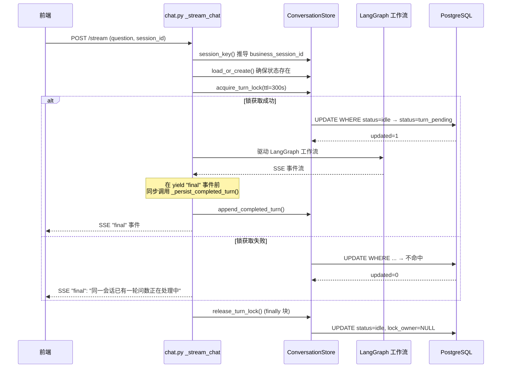
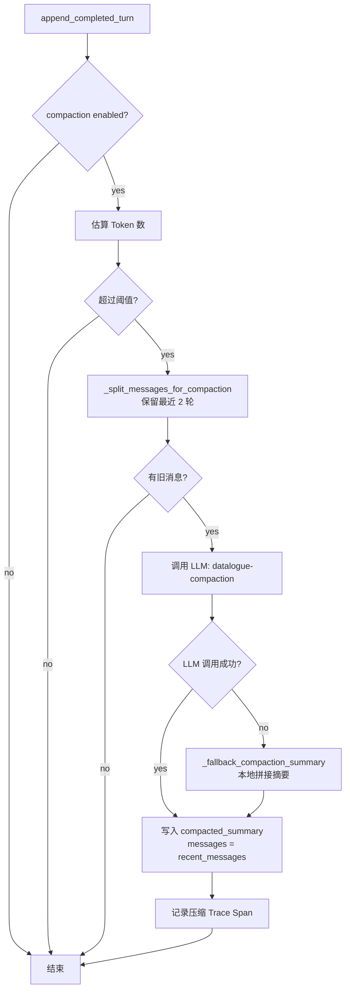
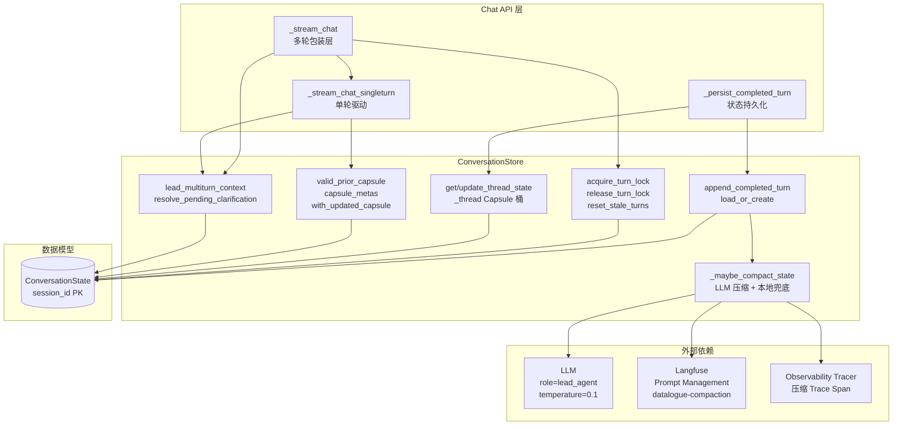

ConversationStore 是 Datalogue 多轮问数系统的**会话状态中枢**。它承载了三个维度的核心职责：**乐观轮次锁**保证同一会话不会并发执行多轮查询；**基于 Token 阈值的消息压缩**在长对话超出上下文窗口时自动调用 LLM 生成摘要；**以 Capsule 桶为载体的线程状态管理**让 LeadAgent 和 SubAgent 跨轮共享查询上下文。本文档将沿着"模型 → 锁 → 压缩 → 线程状态 → 集成流"的路径，逐层拆解其设计。

Sources: [conversation_store.py](app/services/conversation_store.py#L1-L26)

## 数据模型：ConversationState 表

ConversationState 并非替代 `conversation` 表中面向前端的线程历史，而是与之正交的**后端多轮控制状态**。它按业务 `session_id`（而非 `conversation_id`）作为主键，使得一次前端会话可以映射到多条持久化消息，却只对应一份跨轮状态。表结构由 Alembic 迁移 `j5k6l7m8n9o0_add_conversation_state.py` 创建，关键字段如下：

| 字段 | 类型 | 职责 |
|---|---|---|
| `session_id` | String(120) PK | 业务多轮会话 ID，由 `session_key()` 函数生成 |
| `messages` | JSON | 压缩前后的消息索引，按轮次 append |
| `compacted_summary` | Text | 长会话 LLM 压缩摘要，覆盖旧轮次 |
| `subagent_capsules` | JSON (dict) | 按 `dataset_id` 分桶的 SubAgent 状态胶囊；`_thread` 键存线程记忆 |
| `turn_index` | Integer | 已完成轮次计数 |
| `status` | String(16) | `idle` 或 `turn_pending`，锁状态指示器 |
| `lock_owner` | String(80) | 当前轮锁持有者标识 |
| `locked_until` | DateTime | 轮次锁过期时间，超过后视作失效 |
| `facts` | JSON | 会话内稳定事实（用户偏好等） |
| `resolved_time_context` | JSON | LeadAgent TimeTool 最近解析的时间上下文 |
| `pending_clarification` | JSON | 跨轮挂起的澄清（数据集选择、术语冲突等） |
| `active_dataset_id` | String(64) | 当前活跃数据集 ID |

模型使用 `_json_type()` 工厂函数兼容 SQLite 测试环境和 PostgreSQL 生产环境的 JSON/JSONB 差异，确保测试与生产的行为一致性。

Sources: [conversation.py](app/models/conversation.py#L131-L162), [j5k6l7m8n9o0_add_conversation_state.py](alembic/versions/j5k6l7m8n9o0_add_conversation_state.py#L38-L67)

### Session Key 生成策略

`session_key()` 函数实现了三级优先级降级：优先使用客户端传入的 `payload_session_id`，其次从 `conversation_id` 推导 `conversation-{id}` 格式，兜底返回 `conversation-new`。这个设计使得同一前端 `conversation_id` 始终映射到同一 `ConversationState` 行，而 `chat.py` 的 `_stream_chat` 包装层会在兜底时进一步替换为 `request-{uuid}` 保证唯一性。

Sources: [conversation_store.py](app/services/conversation_store.py#L71-L83)

## 会话锁机制：条件 UPDATE 实现的乐观并发控制

多轮场景下，用户可能在上一轮 SSE 流未结束时再次发问，导致状态半写。ConversationStore 使用一条**带谓词的 SQL UPDATE** 实现了无需额外锁表的乐观并发控制。

### 锁获取：acquire_turn_lock

```python
updated = (
    self.db.query(models.ConversationState)
    .filter(models.ConversationState.session_id == session_id)
    .filter(
        or_(
            models.ConversationState.status == "idle",
            models.ConversationState.locked_until.is_(None),
            models.ConversationState.locked_until <= now,
        )
    )
    .update({
        "status": "turn_pending",
        "lock_owner": lock_owner,
        "locked_until": now + timedelta(seconds=ttl_seconds),
    }, synchronize_session=False)
)
self.db.commit()
return updated == 1
```

关键在于 WHERE 子句的三重条件：只有当行状态为 `idle`、从未加锁、或锁已过期时，UPDATE 才会命中。利用数据库行级原子性，`updated == 1` 即表示抢锁成功，`updated == 0` 表示已有活跃锁。TTL（默认 300 秒，由 `MULTITURN_LOCK_TTL_SECONDS` 配置）防止死锁——即使持有者崩溃未释放，过期后其他请求也可抢占。

Sources: [conversation_store.py](app/services/conversation_store.py#L340-L371), [config.py](app/core/config.py#L71)

### 锁释放与过期清理

`release_turn_lock` 在 SSE 流的 `finally` 块中执行，将状态置回 `idle` 并清空 `lock_owner` 和 `locked_until`。可选的 `lock_owner` 参数提供第二重保护：仅持有者本人或锁已丢失（`lock_owner IS NULL`）时可释放。

`reset_stale_turns` 是额外安全网：将超过 `older_than_seconds`（默认 300 秒）仍处于 `turn_pending` 的行强制重置为 `idle`，防止异常进程残留锁。

Sources: [conversation_store.py](app/services/conversation_store.py#L373-L406), [conversation_store.py](app/services/conversation_store.py#L524-L546)

### 锁在 Chat 流中的生命周期

下图展示了锁在 SSE 请求中的完整生命周期：



Sources: [chat.py](app/api/chat.py#L2910-L3043)

## 消息压缩：Token 阈值触发与 LLM 摘要

当多轮对话持续累积，`messages` 字段中的 JSON 数组会不断膨胀，最终超出 LLM 上下文窗口。ConversationStore 实现了**基于 Token 估算的自动压缩**——在每轮 `append_completed_turn` 末尾触发。

### 触发条件与分流策略

`_maybe_compact_state` 首先检查 `MULTITURN_COMPACTION_ENABLED` 开关，然后通过 `estimate_text_tokens()` 估算当前 `messages` + `compacted_summary` 的总 Token 数。若超过 `MULTITURN_COMPACTION_TOKEN_THRESHOLD`（默认 8000），则启动分流：

| 消息分组 | 处理方式 | 保留目的 |
|---|---|---|
| 最近 2 轮（`keep_turns=2`） | **保留原文** | UI 展示和兜底上下文 |
| 旧轮次（第 3 轮及以上） | **送入 LLM 压缩** | 生成叙事摘要替代原文 |

`_split_messages_for_compaction` 按消息的 `turn` 字段进行分组——不是简单按消息数量切分，而是确保同一轮中的 user 和 assistant 消息不被拆散。

Sources: [conversation_store.py](app/services/conversation_store.py#L462-L523), [conversation_store.py](app/services/conversation_store.py#L598-L620), [token.py](app/utils/token.py#L21-L29)

### 压缩 Prompt 设计

压缩使用 Langfuse Prompt Management 中的 `datalogue-compaction` prompt，带有内联兜底模板。其核心指令如下：

1. **保留叙事线**：用户在分析什么业务问题，对话进展如何
2. **保留用户偏好**：偏好的口径、表达方式、输出风格
3. **保留未解决问题**：挂起的澄清、待确认项、风险
4. **明确不保留**：具体查询条件、指标、维度、过滤器、SQL、完整结果行——这些由 SubAgent Capsule 保存

已有摘要作为 `existing_summary` 变量注入，支持增量累积。

Sources: [conversation_store.py](app/services/conversation_store.py#L31-L51)

### LLM 压缩与本地兜底

`_compact_old_messages` 调用 `role="lead_agent"` 的 LLM（temperature=0.1 保证稳定性），将旧消息序列化为 JSON（截断至 24000 字符）后注入系统提示。输出摘要限制在 4000 字符内。

若 LLM 调用失败（网络、密钥、超时等），`_fallback_compaction_summary` 提供本地兜底：取已有摘要 + 旧消息最后 8 条的 `role: content` 前 180 字符做简单拼接，截断至 4000 字符。这种设计确保压缩永远不会因 LLM 不可用而崩溃。



压缩过程通过 `get_observability_tracer()` 记录完整的 Trace Span，包括触发前后的消息数、Token 估算、压缩来源（llm/fallback），为生产监控提供可观测性。

Sources: [conversation_store.py](app/services/conversation_store.py#L622-L680)

## 线程状态管理：`_thread` Capsule 桶

ConversationStore 复用 `subagent_capsules` 字典中的 `_thread` 特殊键来存储会话级线程记忆，避免了单独建表的复杂度。这种设计意味着线程状态与数据集 Capsule 共享同一存储结构，但通过键名隔离。

### 线程状态读写

`get_thread_state` 和 `update_thread_state` 提供了线程记忆的读写接口。读取时，若 `session_id` 为空或无状态记录则返回空 dict；更新时采用**浅合并**（`dict.update`）而非全量替换，确保并发更新不互相覆盖。写入前通过 `jsonable_encoder` 进行序列化安全保障。

```python
def update_thread_state(self, session_id, patch, *, user_id=None):
    state = self.load_or_create(session_id=session_id, user_id=user_id or "1")
    capsules = dict(state.subagent_capsules or {})
    current = capsules.get(THREAD_STATE_KEY)
    thread_state = dict(current) if isinstance(current, dict) else {}
    thread_state.update(patch)  # 浅合并
    thread_state = jsonable_encoder(thread_state)
    capsules[THREAD_STATE_KEY] = thread_state
    state.subagent_capsules = capsules
    ...
```

Sources: [conversation_store.py](app/services/conversation_store.py#L111-L142)

### 线程状态承载的关键数据

在 `_persist_completed_turn` 中，每轮完成后线程状态会被更新，承载以下核心信息：

| 字段 | 含义 | 写入条件 |
|---|---|---|
| `last_success_task` | 上一轮成功查询的任务摘要（问题、指标、维度、表名、结果引用） | 本轮无错误且有查询目标 |
| `active_task` | 当前活跃任务（设为 `None` 表示完成） | 每轮完成时清空 |
| `last_success_task_write_status` | 任务状态的写入元信息（ready/skipped/reason） | 始终写入 |

`last_success_task` 由 `build_success_task_state()` 构造，其内容受 `MULTITURN_LAST_SUCCESS_TASK_MAX_TOKENS`（默认 2000 Token）预算约束——超过预算时跳过写入并记录 warning，防止线程状态膨胀。

Sources: [chat.py](app/api/chat.py#L2836-L2897), [config.py](app/core/config.py#L78)

### 跨轮澄清状态管理

`resolve_pending_clarification` 是 ConversationStore 中处理跨轮澄清的核心方法。它读取 `state.pending_clarification` 并在新轮到来时决定如何恢复：

| 澄清类型 | 用户回复 | 处理策略 | 状态 |
|---|---|---|---|
| `dataset_missing` / `dataset_choice` | 指定数据集 | 提取 `dataset_id`，注入到本轮 payload | `resolved` |
| `term_conflict_clarification` | 补充说明或重新选择 | 从 `clarification_response` 提取选择，注入恢复上下文 | `inject` |
| 任意类型 | 话题切换（检测到"换个问题"等关键词） | 清除挂起状态，不做恢复 | `cleared` |

话题切换检测通过 `_looks_like_topic_switch` 正则实现，匹配"换个问题、重新查、不用了、取消"等中文自然语言表达，避免澄清污染无关新问题。

Sources: [conversation_store.py](app/services/conversation_store.py#L185-L261), [conversation_store.py](app/services/conversation_store.py#L735-L742)

## Capsule 协议：SubAgent 跨轮状态的版本化容器

ConversationStore 不仅是状态存储，更是 LeadAgent 和 SubAgent 之间的**隔离边界**。LeadAgent 只允许读取 Capsule 的元字段（版本号、数据集 ID、Schema 版本、更新轮次），而具体的 `query_context` 和 `result_digest` 仅由 SubAgent 解读。

### Capsule 验证：valid_prior_capsule

在开始新一轮问数前，`valid_prior_capsule` 对上一轮的 Capsule 执行两级校验：

1. **版本校验**：`capsule_version` 必须为 `1.0` 或 `subagent.v1`，否则返回 `invalid`
2. **Schema 一致性校验**：Capsule 中记录的 `schema_version` 必须与本轮 Manifest 绑定的 `expected_schema_version` 一致，不一致则标记为 `stale` 并作废

这种设计防止了数据集 Schema 变更后旧 Capsule 被误用，确保多轮追问的数据一致性。

Sources: [conversation_store.py](app/services/conversation_store.py#L290-L338), [capsule.py](app/schemas/capsule.py#L63-L77)

### Capsule 元信息暴露：capsule_metas

`capsule_metas` 方法将 `subagent_capsules` 桶中的每个 Capsule 精简为 LeadAgent 可读的 `CapsuleMeta`（版本号、数据集 ID、Schema 版本、更新轮次），遍历所有桶但跳过 `_thread` 键。转换异常时返回 `capsule_version: "invalid"` 的兜底元信息，保证 LeadAgent 决策流程不因损坏 Capsule 而中断。

Sources: [conversation_store.py](app/services/conversation_store.py#L263-L288), [capsule.py](app/schemas/capsule.py#L80-L91)

### Capsule 写入路径

在 `_persist_completed_turn` 中，Capsule 写入存在两条路径：

1. **SubAgent 控制面优先**：遍历 `subagent_control_plane` 列表中的 `capsule` 字段，按 `dataset_id` 分别写入
2. **Final Payload 兜底**：若无控制面 Capsule，则从 `final_payload["out_capsule"]` 取本轮通用 Capsule

这种双路径设计支持多数据集 Fan-Out 场景——每个数据集 SubAgent 产出的 Capsule 独立存储，互不覆盖。

Sources: [chat.py](app/api/chat.py#L2715-L2740)

## LeadAgent 多轮上下文组装

`lead_multiturn_context` 是 ConversationStore 向 LeadAgent 暴露的统一查询接口。它将分散在 `ConversationState` 各字段中的信息组装为 LeadAgent 可直接消费的扁平字典：

| 输出字段 | 来源 | 用途 |
|---|---|---|
| `active_dataset_id` | `state.active_dataset_id` | 当前数据集锚点 |
| `summary` | `state.compacted_summary` | LLM 压缩摘要，替代历史消息 |
| `facts` | `state.facts` | 用户偏好稳定事实 |
| `resolved_time_context` | `state.resolved_time_context` | 上一轮时间上下文 |
| `pending_clarification` | `state.pending_clarification` | 挂起澄清信息 |
| `turn_index` | `state.turn_index` | 当前轮次 |
| `last_question` / `last_answer_summary` | 从 `messages` 尾部反向查找 | 最近一轮对话快照 |
| `last_success_task` / `active_task` | 线程状态（`_thread` Capsule） | 上一轮成功任务 |
| `capsule_metas` | `capsule_metas()` 方法 | 各数据集 Capsule 元信息索引 |

`last_question` 和 `last_answer_summary` 的提取逻辑通过 `reversed(messages)` 反向遍历，分别取最近一条 `role == "user"` 和 `role == "assistant"` 的消息，时间复杂度 O(n) 但 n 受压缩后的消息数量约束（通常不超过 4 条）。

Sources: [conversation_store.py](app/services/conversation_store.py#L144-L183)

## Chat 流集成：状态持久化的关键时序

ConversationStore 与 `_stream_chat` 的集成是系统中时序最敏感的部分。SSE 流式响应在客户端收到 `type: "final"` 事件后立即断开连接，`yield` 之后的代码可能因 `CancelledError` 而不执行。因此 `_persist_completed_turn` 必须在 `yield final` 事件**之前**同步完成：

```python
if parsed.get("type") == "final":
    final_payload = parsed
    # 关键：在 yield 前同步写入多轮状态
    try:
        completed = _persist_completed_turn(
            store=store, state=state, ...
        )
    except Exception as persist_exc:
        logger.exception("写入多轮状态失败: %s", persist_exc)
yield event  # SSE event 发出后连接可能立即断开
```

`_persist_completed_turn` 内部调用 `store.append_completed_turn()`，该方法在一次数据库事务中完成：追加本轮 user/assistant 消息 → 自增 `turn_index` → 更新 `active_dataset_id` → 写入 `resolved_time_context` → 处理 `pending_clarification` → 更新 Capsule 桶 → 触发压缩 → 重置锁状态为 `idle`。

Sources: [chat.py](app/api/chat.py#L3008-L3033), [conversation_store.py](app/services/conversation_store.py#L408-L460)

## 架构总览

将上述各组件整合为一张端到端的系统交互图：



ConversationStore 通过**锁保证并发安全**、**压缩控制上下文膨胀**、**Capsule 协议实现控制面/数据面隔离**、**线程状态支持跨轮追问**，构成了 Datalogue 多轮问数系统的稳定性基础。理解其设计对于排查多轮状态丢失、锁竞争和上下文截断问题至关重要。

## 阅读下一站

本文档覆盖了 ConversationStore 的核心机制。如需理解用户输入如何被分类并影响线程状态，请阅读 [消息网关：用户输入事件分类与早退路由](23-xiao-xi-wang-guan-yong-hu-shu-ru-shi-jian-fen-lei-yu-zao-tui-lu-you)；如需了解 SubAgent Capsule 的具体内容结构和查询上下文的跨轮传递，请阅读 [QueryTaskCapsule 与 QueryArtifact：跨轮查询状态的持久化协议](21-querytaskcapsule-yu-queryartifact-kua-lun-cha-xun-zhuang-tai-de-chi-jiu-hua-xie-yi)。