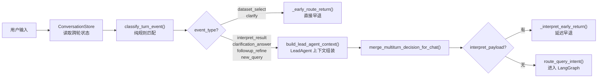
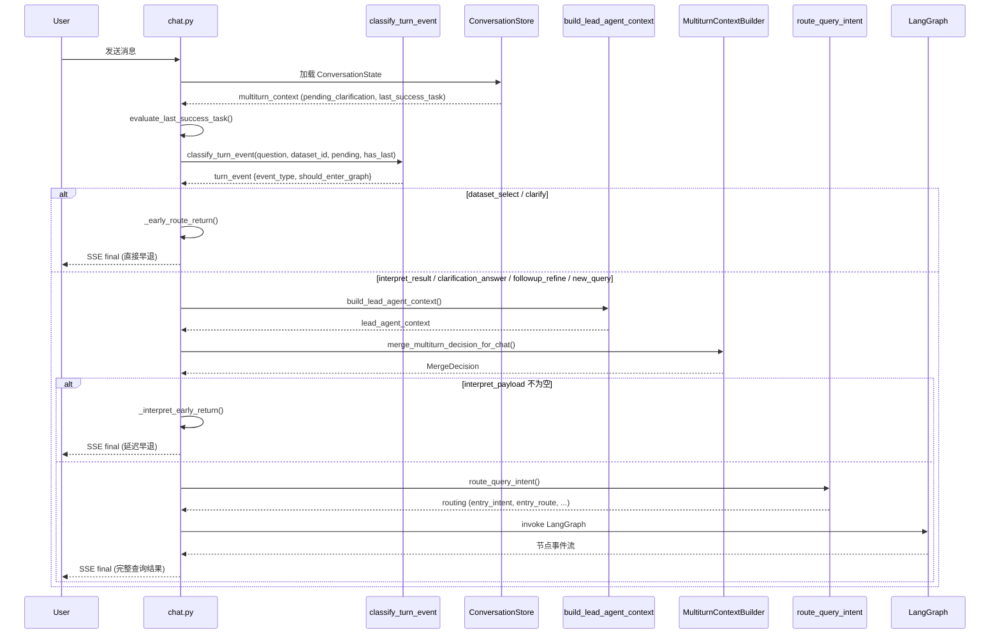

消息网关（Message Gateway）是整个问数系统接收用户输入后的**第一道安检口**。它的核心职责是在任何 LLM 调用或 LangGraph 工作流启动之前，用确定性规则将用户输入归类为结构化事件——然后根据事件类型决定是"放行进入完整查询管道"还是"就地早退"。这一设计将约 30%-40% 的非查询类交互（数据集切换、澄清回复、结果解释等）拦截在昂贵的 LLM 调用链之外，同时为需要继承上下文的追问轮次提供稳定的 `turn_event` 契约。

本页覆盖消息网关的事件分类逻辑、早退路由判定的两条通路，以及它如何与跨轮状态（`pending_clarification`、`last_success_task`）协作。建议先阅读 [入口路由与意图分类](10-ru-kou-lu-you-yu-yi-tu-fen-lei-cong-yong-hu-wen-ti-dao-zhi-xing-lu-jing-de-ci-xing-jue-ce) 了解下游 LeadAgent 路由决策，以及 [多轮上下文构建器](20-duo-lun-shang-xia-wen-gou-jian-qi-zhui-wen-shi-bie-shi-jian-zeng-liang-jie-xi-yu-xiao-nang-he-bing) 了解 followup_refine 事件的跨轮承接机制。

Sources: [message_gateway.py](app/services/message_gateway.py#L1-L20)

## 架构定位：管道入口的前置过滤器

消息网关位于 API 层（`chat.py`）与 LangGraph 工作流之间的夹层。每一次用户发送消息，`_stream_chat_singleturn` 会先组装多轮上下文——从 `ConversationStore` 中读出 `pending_clarification` 和 `last_success_task` 两个跨轮标志——然后调用 `classify_turn_event()`，在**不消耗任何 LLM token** 的情况下完成事件分类。



网关输出的 `turn_event` 字典包含两个关键字段：`event_type`（事件类型枚举）和 `should_enter_graph`（建议是否进入查询图）。不过，`chat.py` 中的实际路由决策并非机械地读取 `should_enter_graph` 布尔值，而是根据 `event_type` 做显式分支——这让路由逻辑更可读，也避免了隐式行为带来的调试困难。

Sources: [chat.py](app/api/chat.py#L1292-L1300), [message_gateway.py](app/services/message_gateway.py#L32-L36)

## 事件类型分类体系

网关定义了六种事件类型，按优先级从高到低依次匹配。匹配顺序本身就是路由策略的核心——高优先级事件一旦命中，低优先级的分支就不再评估。

| 优先级 | event_type | 触发条件 | should_enter_graph | 下游动作 |
|:---:|:---|:---|:---:|:---|
| 1 | `dataset_select` | 匹配正则 `选择/切换到/使用 : 数据集名` | ❌ | 按名称查找数据集，绑定到会话，直接早退 |
| 2 | `clarification_answer` | `has_pending_clarification` 为 `True` | ❌ | 透传至 `resolve_term_clarification` 解析澄清回复 |
| 3 | `interpret_result` | 存在上一轮成功结果 AND 问题含解释类关键词 | ❌ | 透传至 `MultiturnContextBuilder`，产出 `interpret_payload` 后延迟早退 |
| 4 | `followup_refine` | 匹配追问关键词 AND `has_last_success_task` 为 `True` | ✅ | 进入 LangGraph，继承上一轮查询的基表/查询计划 |
| 5 | `clarify` | 不满足上述条件但上下文不足（无数据集或无上一轮结果） | ❌ | 直接早退，提示用户选择数据集或提供更多信息 |
| 6 | `new_query` | 以上均不匹配 | ✅ | 进入完整 LangGraph 管道，走 LeadAgent → SubAgent 链 |

这种优先级排序反映了一个核心设计原则：**先处理最确定、最轻量的匹配，将模糊判断留给最昂贵的路径**。`dataset_select` 是正则精确匹配，几乎零成本；`clarification_answer` 依赖持久化的 `pending_clarification` 标志，只需一次布尔判断；`interpret_result` 和 `followup_refine` 则依赖上一轮任务状态的存在性和有效性。

Sources: [message_gateway.py](app/services/message_gateway.py#L39-L89)

### 正则模式的设计哲学

网关使用的正则全部是编译后的模块级常量，避免每次调用重复编译：

```python
_DATASET_SELECT_RE = re.compile(r"^\s*(?:选择|切换到|使用)[：:\s]*(?P<name>.+?数据集)\s*$")
```

数据集选择的正则使用了词边界约束——`^...$` 确保整个输入必须匹配"动词 + 分隔符 + 数据集名"的完整模式，而不是仅包含关键词。命名捕获组 `(?P<name>...)` 让后续代码可以直接引用 `dataset_match.group("name")` 提取数据集名称，避免硬编码索引位置。

追问和查询关键词则使用子串包含匹配（`_contains_any`），因为追问短语通常嵌在更长的自然语言中——"只看汤杰的记录"、"统计一下上个月的订单明细"——不适合用完整字符串正则。

Sources: [message_gateway.py](app/services/message_gateway.py#L24-L36)

## 两条早退通路：直接早退与延迟早退

网关产出的 `interpret_result` 事件并不是在网关层就地早退的，而是需要等待 `MultiturnContextBuilder` 基于上一轮的 `result_digest` 生成解释文本。这就形成了两条时间线不同的早退通路。

### 直接早退（`dataset_select` 与 `clarify`）

这两类事件在 `chat.py` 中立刻触发 `_early_route_return()`——一个专用于"不进 LangGraph 直接返回答案"的异步生成器：

```
_dataset_select 路径：
  1. classify_turn_event → event_type = "dataset_select"
  2. _find_dataset_by_name() → 在数据库中按名称匹配数据集
  3. 匹配成功 → 更新 conversation.dataset_id，绑定会话与数据集
  4. _gateway_route_decision() → 构造 route_decision 字典
  5. _gateway_lead_context() → 构造最小化的 lead_agent_context（无需 LeadAgent 实际路由）
  6. _early_route_return() → 保存助手消息、写入 SSE final 事件、关闭 trace

_clarify 路径：
  1. classify_turn_event → event_type = "clarify"（answer 字段已含提示文本）
  2. _gateway_routing() → 映射 entry_intent/entry_route
  3. _early_route_return() → 同上
```

`_early_route_return` 是两条直接早退路径的共享出口。它负责保存 `assistant_message` 到数据库、写入 `ObservabilityTraceIndex`、产生最终的 SSE `final` 事件流。这个函数的复用避免了 dataset_select 和 clarify 两条分支的代码重复——它们唯一的差异在于 `routing` 字典的构造方式。

Sources: [chat.py](app/api/chat.py#L1317-L1372), [chat.py](app/api/chat.py#L3324-L3441)

### 延迟早退（`interpret_result`）

`interpret_result` 事件的早退时间线更长，因为它需要先走完 LeadAgent 上下文组装和多轮合并决策：

```
  1. classify_turn_event → event_type = "interpret_result", should_enter_graph=False
  2. 不触发直接早退（event_type 不是 dataset_select 也不是 clarify）
  3. build_lead_agent_context() → 组装完整的 LeadAgent 上下文
  4. route_decision = lead_agent_context["route_decision"]
  5. build_query_task_capsule() → 构造查询胶囊
  6. merge_multiturn_decision_for_chat() → MultiturnContextBuilder.build()
     - builder.is_interpret_result_turn(state) → True
     - builder.build_interpret_answer(question, prior_capsule) → 基于 result_digest 生成解释
     - 返回 MergeDecision(interpret_payload={...})
  7. chat.py 检测到 merge_decision.interpret_payload is not None
  8. _interpret_early_return() → 保存消息、emit SSE final
```

延迟早退的关键在于 `MultiturnContextBuilder.is_interpret_result_turn()` 的判定逻辑。它不依赖网关产出的 `event_type` 字段，而是从 `lead_agent_context` 的 `dispatch.capsule` 中读取 `execution_mode` 和 `should_generate_query`——这允许 LeadAgent 的 LLM 推理覆盖网关的规则判定。如果 LLM 判定用户意图确实是"解释上一轮结果"（`execution_mode == "interpret_result"`），则 `build_interpret_answer` 直接基于上一轮的 `result_digest`（数值摘要、行数、字段列表）生成解释文本，完全不需要重新执行 SQL。

Sources: [multiturn_context.py](app/services/multiturn_context.py#L204-L211), [chat.py](app/api/chat.py#L1621-L1640), [chat.py](app/api/chat.py#L3184-L3321)

## 跨轮状态依赖：网关的三个上下文旗帜

`classify_turn_event` 的四个参数中，`question` 来自用户输入，其余三个——`active_dataset_id`、`has_pending_clarification`、`has_last_success_task`——全部来自跨轮持久化状态。

### active_dataset_id：当前会话绑定数据集

`active_dataset_id` 从 `ConversationState` 中读取。如果用户尚未选择数据集（`active_dataset_id is None`）且输入不为空，网关将其归类为 `clarify`，提示"请先选择数据集"；如果用户输入为空且无数据集，同样归类为 `clarify`。这确保了在上下文缺失时不会浪费 LLM 调用去猜测用户意图。

### has_pending_clarification：挂起澄清标志

`pending_clarification` 来自上一轮助手消息的 `route_payload`。当上一轮发生了数据集歧义（`dataset_choice`）、术语冲突（`term_conflict_clarification`）或数据集缺失（`dataset_missing`）时，`pending_clarification_from_final_payload` 会将路由负载中的澄清信息序列化到 `ConversationState.pending_clarification` 字段中。本轮网关检测到该字段非空时，将事件分类为 `clarification_answer`——随后 `resolve_term_clarification` 会消费这个挂起状态，解析用户的回复（序数词"第一个"或术语名）。

Sources: [conversation_store.py](app/services/conversation_store.py#L562-L596), [conversation_store.py](app/services/conversation_store.py#L170-L182)

### has_last_success_task：上一轮可承接任务

这是三个旗帜中最复杂的一个。`has_last_success_task` 不是简单的布尔值——它经过了 `evaluate_last_success_task` 的版本校验：

```
evaluate_last_success_task 校验逻辑：
  1. 线程记忆中是否存在 last_success_task？ → 无则 status="missing"
  2. 任务中的 dataset_id 是否匹配当前 active_dataset_id？ → 不匹配则 status="dataset_mismatch"
  3. 任务中的 schema_version 是否匹配当前版本？ → 不匹配则 status="schema_stale"
  4. 任务中的 manifest_version 是否匹配当前版本？ → 不匹配则 status="manifest_stale"
  5. 全部匹配 → status="loaded"
```

只有 `status == "loaded"` 时 `_has_last_success_task` 才返回 `True`。这意味着即使上一轮成功执行了查询，如果数据集 Schema 发生了变更（新增/删除字段），追问功能也会自动降级——网关将用户输入归类为 `clarify` 而非 `followup_refine`，提示用户重新发起查询。

Sources: [chat.py](app/api/chat.py#L919-L926), [chat.py](app/api/chat.py#L1282-L1297)

## 追问快速路径：followup_refine 的下游处理

`followup_refine` 是唯一同时满足 `should_enter_graph=True` 和"继承上一轮上下文"的事件类型。当网关判定为 `followup_refine` 时，`build_query_task_capsule` 会将上一轮的成功任务状态注入查询胶囊，形成一条从网关到 SubAgent 的完整上下文继承链：

| 胶囊字段 | 来源 | 用途 |
|:---|:---|:---|
| `standalone_question` | 拼接上一轮问题 + 本轮追问 | 给 LLM 提供完整语义上下文 |
| `base_task_ref` | 固定值 `"last_success_task"` | 标记上下文继承来源 |
| `base_question` | 上一轮的 `question` | LLM 理解原始查询意图 |
| `base_main_table` | 上一轮查询计划的主表 | 追问时锁定同一张表 |
| `base_query_plan` | 上一轮的完整查询计划 | 复用过滤/分组/排序结构 |

此外，`plan_refinement_fast_path` 会基于 feature flag 和 artifact 状态，选择最快的追问执行路径——可能直接对上一轮的结果集做客户端过滤（`local_result_filter`），也可能走 DSL 精炼管道重新生成查询。

Sources: [task_capsule.py](app/services/task_capsule.py#L64-L120), [refinement_fast_path.py](app/services/multiturn/refinement_fast_path.py#L59-L140)

## 可视化：网关与上下游的交互全景



图中展示了三条返回路径：**直接早退**（`dataset_select` / `clarify`）在 LeadAgent 调用之前就结束；**延迟早退**（`interpret_result`）在 LeadAgent 和多轮合并之后、入口路由之前结束；**完整管道**穿透全部层级进入 LangGraph。

Sources: [chat.py](app/api/chat.py#L1317-L1380), [chat.py](app/api/chat.py#L1560-L1640)

## 设计权衡与边界条件

**为什么不用 LLM 做事件分类？** 网关的所有匹配都是正则或子串包含，不消耗 token。六种事件类型的判定逻辑覆盖了绝大多数用户输入模式，且误分类的代价很低——即使 `followup_refine` 被误判为 `new_query`，下游 `MultiturnContextBuilder` 仍然可以通过 `is_continue_turn` 的关键词匹配纠正。LLM 分类仅在入口路由阶段（`route_query_intent`）介入，处理更细粒度的意图（`chitchat`、`reject`、`knowledge_qa` 等）。

**`should_enter_graph` 字段的实际作用。** 在当前的 `chat.py` 实现中，路由分支直接检查 `event_type` 而非 `should_enter_graph`。该字段更接近文档化语义——它向阅读代码的开发者表明此事件类型的设计意图。这种设计允许下游在需要时引入更灵活的路由策略（例如基于 feature flag 动态决定某个 `should_enter_graph=True` 的事件是否也走早退）。

**`clarification_answer` 的特殊性。** 该事件类型的 `should_enter_graph` 为 `False`，但 `answer` 为 `None`——网关并不生成回答文本。它的角色是告诉下游"用户正在回复一个挂起的澄清，请优先解析澄清回复"。实际的澄清解析在 `resolve_term_clarification`（Phase 4）中完成，随后才走 `route_query_intent` 入口路由。

Sources: [message_gateway.py](app/services/message_gateway.py#L50-L56), [chat.py](app/api/chat.py#L1642-L1655)

---

**后续阅读建议：** 理解网关的事件分类后，建议继续阅读 [入口路由与意图分类](10-ru-kou-lu-you-yu-yi-tu-fen-lei-cong-yong-hu-wen-ti-dao-zhi-xing-lu-jing-de-ci-xing-jue-ce) 了解 `new_query` 事件进入后的 LeadAgent 路由决策流程，以及 [多轮上下文构建器](20-duo-lun-shang-xia-wen-gou-jian-qi-zhui-wen-shi-bie-shi-jian-zeng-liang-jie-xi-yu-xiao-nang-he-bing) 深入了解 `followup_refine` 和 `interpret_result` 的跨轮上下文组装机制。