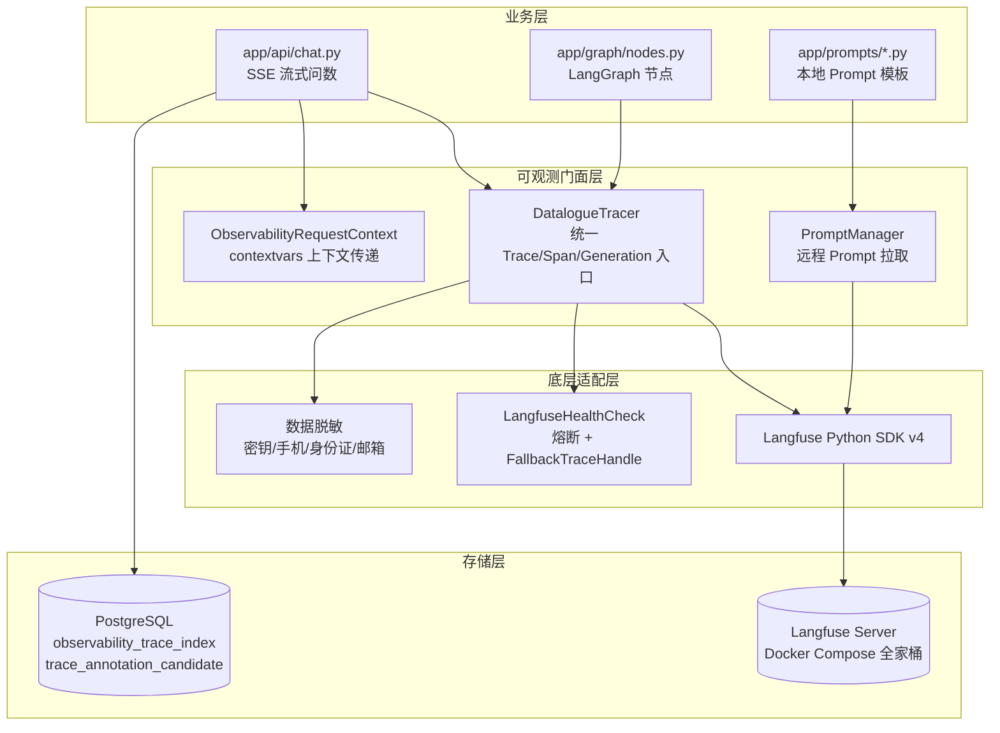
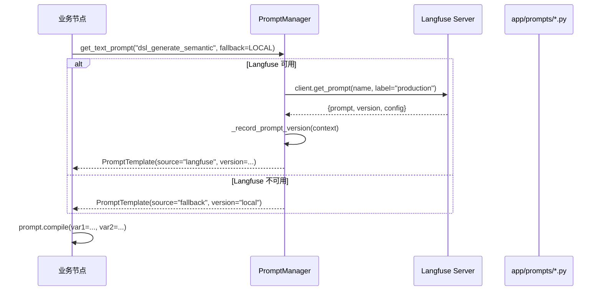

本文档系统阐述 Datalogue 如何将 Langfuse 可观测能力深度集成到 NL2DSL2SQL 问数链路中，覆盖 Trace、Span、Generation 三层追踪粒度，结合本地索引降级、数据脱敏、用户反馈 Score 回写以及 Prompt Manager 的统一管理——确保每一条用户问题都具备端到端的调用链可追溯、Token 计费和诊断能力。

Sources: [__init__.py](app/services/observability/__init__.py#L1-L33)

## 总体架构：分层隔离 + 优雅降级

Datalogue 的可观测层在设计上遵循 **"业务链路零感知、失败无影响"** 的原则——所有 Langfuse SDK 的直接依赖被封装在 `app/services/observability` 包内，业务代码（`chat.py`、`nodes.py`）仅通过 `DatalogueTracer` 门面交互。当 Langfuse 不可用时，系统通过两层保障机制确保主链路不受影响：**No-Op 降级句柄**（`FallbackTraceHandle`）提供静默的空操作替代，**熔断器**（`LangfuseHealthCheck`）在连续失败达阈值后自动切断外部请求，并在冷却期后自动恢复探测。



Sources: [tracer.py](app/services/observability/tracer.py#L1-L30), [fallback.py](app/services/observability/fallback.py#L1-L61), [context.py](app/services/observability/context.py#L1-L76)

## 配置体系：从环境变量到运行时行为

所有 Langfuse 相关配置集中在 `app/core/config.py` 的 `Settings` 类中，由 `pydantic-settings` 自动从环境变量注入。下表列出关键配置项及其生产环境建议值：

| 配置键 | 类型 | 默认值 | 说明 |
|---|---|---|---|
| `LANGFUSE_ENABLED` | `bool` | `False` | 总开关：关闭后所有观测操作静默跳过 |
| `LANGFUSE_BASE_URL` | `str` | `http://localhost:3000` | Langfuse Server 地址（Docker Compose 默认端口） |
| `LANGFUSE_PUBLIC_KEY` | `str` | `None` | Langfuse 项目公钥（创建 project 后获取） |
| `LANGFUSE_SECRET_KEY` | `str` | `None` | Langfuse 项目私钥 |
| `LANGFUSE_ENVIRONMENT` | `str` | `"dev"` | 环境标签：写入 Langfuse trace metadata |
| `LANGFUSE_RELEASE` | `str` | `"local"` | 版本标签：用于区分不同部署的 trace |
| `LANGFUSE_PROMPT_LABEL` | `str` | `"production"` | Prompt Manager label：决定拉取哪个版本的 prompt |
| `LANGFUSE_SAMPLE_RATE` | `float` | `1.0` | 采样率（当前预留，未实施采样逻辑） |
| `LANGFUSE_FLUSH_AT_END` | `bool` | `True` | 请求结束时是否显式 flush SDK 缓冲区 |
| `LANGFUSE_MAX_TEXT_LENGTH` | `int` | `4000` | 上报前文本截断长度 |

**配置启用条件**：要使 Langfuse 完整工作，必须同时设置 `LANGFUSE_ENABLED=True`、`LANGFUSE_PUBLIC_KEY` 和 `LANGFUSE_SECRET_KEY`。后两者在 Langfuse Web UI 中创建 API Key 后获得——这与 Docker Compose 中 `LANGFUSE_SALT` / `NEXTAUTH_SECRET`（服务端鉴权用）是不同的概念，不可混淆。

Sources: [config.py](app/core/config.py#L41-L53), [docker-compose.yml](docker-compose.yml#L1-L55)

## Trace 生命周期：从创建到关闭的完整链路

### ObservabilityTraceContext：一次问数的观测身份

每次用户发起问数请求，`chat.py` 的流式处理函数会调用 `DatalogueTracer.create_trace_context()` 创建一个 `ObservabilityTraceContext` 实例。该数据类承载了本次请求的全部观测元数据：

| 字段 | 来源 | 作用 |
|---|---|---|
| `trace_id` | Langfuse 返回或本地 UUID fallback | 全局唯一标识，关联所有 span 和 generation |
| `session_id` | `conversation_id` 派生或传入 | 将同一会话的多轮问数归入 Langfuse Session |
| `tenant_id` / `user_id` | 会话上下文 | 多租户隔离和用户行为分析 |
| `question` | 用户原始输入 | 作为根 trace 的 input |
| `execution_path` | 路由决策结果 | 记录走了哪条执行路径（如 `schema_recall`） |
| `prompt_versions` | 运行期 PromptManager 注入 | 记录每个节点实际使用的 Prompt 版本和来源 |
| `prompt_label` | 配置项 | 标记当前部署环境使用的 Prompt 标签 |

创建 trace 时，`DatalogueTracer` 先做三层检查：(1) `enabled` 是否为 True；(2) 熔断器是否允许请求；(3) Langfuse SDK 客户端是否初始化成功。任何一层不通过，trace 仍然创建但 `active=False`，后续所有 span 和 generation 记录变为静默 no-op。

Sources: [tracer.py](app/services/observability/tracer.py#L128-L228), [tracer.py](app/services/observability/tracer.py#L55-L119)

### 根 Trace 的元数据注入

创建 trace 后，系统通过 `update_trace` 调用注入以下 Langfuse 原生属性：

- **user_id**: `{tenant_id}:{user_id}` 格式，确保跨租户唯一
- **session_id**: 将同一次对话的多轮问数串联
- **tags**: `tenant:{name}`, `env:{environment}`, `release:{version}`, `lead`，用于 Langfuse UI 中的筛选和分组
- **metadata**: 包含 `tenant_id`、`conversation_id`、`dataset_id`、`environment`、`release`，所有值经过 `sanitize_payload()` 脱敏处理

Sources: [tracer.py](app/services/observability/tracer.py#L200-L228)

### 本地索引持久化：ObservabilityTraceIndex

无论 Langfuse 是否在线，系统在每次问数结束时都会向本地 `observability_trace_index` 表写入一条索引记录。该记录将 Langfuse 侧的 `trace_id` / `session_id` 与本地 `conversation_id` / `message_id` / `dataset_id` 关联起来：

```
observability_trace_index
├── langfuse_trace_id (String 120) ──→ Langfuse Server 中的 Trace
├── langfuse_session_id (String 120) ──→ Langfuse Server 中的 Session
├── conversation_id (FK → conversation.id) ──→ 本地会话
├── message_id (FK → message.id) ──→ 本地消息
├── dataset_id (FK → semantic_dataset.id) ──→ 关联数据集
├── entry_route (String 60) ──→ 入口路由类型
├── status (String 30) ──→ success / failed / blocked
├── total_tokens (Integer) ──→ Token 消耗
├── total_cost (Float) ──→ 费用（USD）
└── metadata_json (JSON) ──→ 扩展元数据
```

所有字段均建立了独立索引，支撑按状态、数据集、入口路由等维度的快速聚合查询。`metadata_json` 中存储了 question、resolved_question、execution_path、prompt_versions 等完整诊断信息。

Sources: [conversation.py](app/models/conversation.py#L96-L113), [f1a2b3c4d5e6_add_observability_tables.py](alembic/versions/f1a2b3c4d5e6_add_observability_tables.py#L1-L70)

### 关闭 Trace：安全的资源释放

请求结束时调用 `DatalogueTracer.close_trace()`。该方法按顺序执行：(1) 遍历并关闭所有未结束的 span context manager；(2) 关闭根 trace context manager；(3) 若配置 `LANGFUSE_FLUSH_AT_END=True`，显式调用 SDK 的 `flush()` 确保缓冲区事件全部发送。

特别值得注意的是 `_exit_manager()` 方法的防御性设计：SSE 流式接口中客户端断连会触发 `GeneratorExit` 或跨 Context 的 `ValueError`，这些异常被统一捕获并降级为 debug 日志——观测层清理问题绝不应影响问数主链路。

Sources: [tracer.py](app/services/observability/tracer.py#L488-L524), [tracer.py](app/services/observability/tracer.py#L543-L556)

## Span 管理：LangGraph 节点的观测边界

Span 用于标记 LangGraph 工作流中每个关键阶段的执行边界。`DatalogueTracer` 提供了 `start_span()` / `end_span()` 配对方法，调用方（`chat.py`）负责在节点执行前后分别调用。

### Span 的生命周期管理

每个 span 在 `ObservabilityTraceContext` 内部维护两套句柄：`span_handles`（Langfuse observation 对象）和 `span_managers`（对应的 context manager）。`end_span()` 时先调用 `update()` 写入 output 和 metadata，再通过 `__exit__()` 关闭 observation——即使 `update()` 失败，`finally` 块也会确保 manager 被释放。

### Chat 流程中的 Span 注册

当前 chat 流程中注册了以下 span：

| Span 名称 | 节点标识 | 记录内容 |
|---|---|---|
| `context-assembly` | `context-assembly` | 会话状态恢复、数据集绑定、多轮上下文组装 |
| `message-gateway` | `message-gateway` | 用户消息分类（dataset_select / clarify / query），早退决策 |
| `lead.routing` | `lead.routing` | LeadAgent 技能选择、工具规划、路由决策输出 |
| `turn-classification` | `turn-classification` | 多轮分类结果（追问类型、时间增量解析） |

每个 span 的 input/output payload 都经过 `sanitize_payload()` 递归脱敏：最多 5 层深度、每层最多 30 个键，超过部分以 `_truncated_keys` / `_truncated_items` 标记。

Sources: [chat.py](app/api/chat.py#L1253-L1421), [tracer.py](app/services/observability/tracer.py#L230-L283)

### Span 的 Tags 合并策略

`start_span()` 支持通过 `trace_tags` 参数追加语义标签（如 `gateway`、`lead`）。`_merge_trace_tags()` 函数将根 trace 的稳定标签（`tenant:*`、`env:*`、`release:*`、`lead`）与新标签去重合并后写回 trace，确保基础标签不被覆盖。

Sources: [tracer.py](app/services/observability/tracer.py#L566-L578)

## Generation 管理：LLM 调用的精细化计量

Generation 是 Langfuse 中专门表示 LLM 模型调用的观测类型。与 Span 不同，Generation 携带 **model** 参数、**usage_details**（token 拆分）、**completion_start_time**（首 token 到达时间）等 LLM 专属字段。

### 统一封装：`_safe_llm_invoke()`

项目在 `app/graph/nodes.py` 中提供了 `_safe_llm_invoke()` 函数作为所有 LLM 调用的统一入口。该函数完整封装了 Generation 的生命周期：

```python
# 简化的调用流程示意
def _safe_llm_invoke(llm, messages, path=""):
    generation = tracer.start_generation(
        name=f"llm.{path}",
        model=llm.model_name,
        messages=messages,
        metadata={"path": path, "thinking_enabled": ...},
    )
    try:
        response = llm.invoke(messages)
        usage = extract_token_usage(response, messages)
        tracer.end_generation(generation, output=response.content, usage=usage, ...)
        return response, None
    except Exception as e:
        tracer.end_generation(generation, output=f"LLM 调用失败: {e}", usage=None, ...)
        return None, error_string
```

错误路径同样会调用 `end_generation()`，确保每次 LLM 调用都有完整的开始-结束配对，便于在 Langfuse UI 中观察失败模式。

Sources: [nodes.py](app/graph/nodes.py#L218-L270)

### Token 计量：Provider 优先 + 本地估算降级

`_langfuse_usage_details()` 函数实现了两级 Token 计量策略：

1. **Provider 计量**：优先使用 LLM 响应中的 `usage` 字段（`input_tokens` / `output_tokens` / `total_tokens`），标记 `usage_source="provider"`
2. **本地估算**：当 Provider 未返回时，调用 `estimate_messages_tokens()` 和 `estimate_text_tokens()` 进行本地估算，标记 `usage_source="estimated"`

最终写入 Langfuse 的 `usage_details` 统一为 `{"input": int, "output": int, "total": int}` 三元组，确保 Langfuse UI 的 Cost 面板能正确渲染。

Sources: [tracer.py](app/services/observability/tracer.py#L580-L631)

### 首 Token 时间：`completion_start_time`

`_invoke_llm_with_metrics()` 在流式调用中记录了第一个有意义 token 的到达时间（`first_token_wall`），并通过 `end_generation()` 的 `completion_start_time` 参数写入 Generation。这使得 Langfuse UI 能够展示 Time-to-First-Token（TTFT）指标，对于评估用户体验延迟至关重要。

Sources: [tracer.py](app/services/observability/tracer.py#L399-L425)

## 数据脱敏：离开系统前的最后一道防线

所有上报到 Langfuse 的 payload 都必须经过 `app/services/observability/masking.py` 的脱敏处理。该模块实现了四层防护：

### 层 1：敏感键值过滤

`sanitize_payload()` 递归遍历 JSON 结构时，对命中 `SENSITIVE_KEYS` 集合的键名（`api_key`、`password`、`secret`、`token` 等）直接替换为 `"<masked>"`，无论其值为字符串还是嵌套对象。

### 层 2：文本模式匹配

`sanitize_text()` 使用正则表达式过滤：
- 密钥赋值语句（`password=...` / `api_key=...`）→ 替换为 `<masked>`
- 邮箱地址 → `<email>`
- 手机号码（`1[3-9]XXXXXXXXX`）→ `<phone>`
- 身份证号（18 位）→ `<id_card>`

### 层 3：SQL 字面量隐藏

`sanitize_sql()` 保留了 SQL 的结构骨架，但将所有字符串字面量替换为 `'<value>'`（长度 > 2）或 `'?'`（短字面量），确保 SQL 语法可见而数据值不可见。

### 层 4：结果集摘要化

`summarize_rows()` 对查询结果集（`rows` / `data` / `records` 键）不传递完整行数据，仅提取列名、行数和前 5 行脱敏样例，每行中每个字段值截断至 200 字符。

### 截断策略

所有文本经 `sanitize_text()` 处理后，超过 `LANGFUSE_MAX_TEXT_LENGTH`（默认 4000 字符）的部分被截断并追加 `...<truncated>` 标记。对于结构化 payload，最大递归深度 5 层、每层最多 30 个键，超出的键数以 `_truncated_keys` 计数。

Sources: [masking.py](app/services/observability/masking.py#L1-L131)

## 熔断与降级：渐进式故障隔离

### LangfuseHealthCheck：轻量熔断器

`app/services/observability/fallback.py` 中的 `LangfuseHealthCheck` 实现了简单的计数熔断：

- **阈值**: 连续失败 10 次后熔断开启
- **冷却期**: 300 秒（5 分钟），到期自动重置计数器并允许探测请求
- **成功恢复**: 任何一次成功调用立即重置失败计数和熔断状态

熔断状态通过 `allow_request()` 方法检查，DatalogueTracer 的三个核心方法——`create_trace_context()`、`start_span()`、`start_generation()`——均在调用 Langfuse SDK 前检查熔断状态。

### FallbackTraceHandle：No-Op 句柄

当熔断开启或 Langfuse SDK 不可用时，`FallbackTraceHandle` 作为 trace/span 句柄的替代品。它通过 `__getattr__` 将所有方法调用静默吸收，`__enter__` / `__exit__` 均为空操作，确保业务代码无需关心观测层的状态。

Sources: [fallback.py](app/services/observability/fallback.py#L18-L61)

## 查询审计 API：自建报表与远程数据聚合

### 本地聚合报表

`app/api/observability.py` 暴露了 6 个端点，均基于 `observability_trace_index` 表聚合：

| 端点 | 方法 | 参数 | 返回 |
|---|---|---|---|
| `/observability/summary` | GET | `dataset_id` (可选) | `total_traces`, `failed_traces`, `success_rate`, `total_tokens` |
| `/observability/costs` | GET | `dataset_id` (可选) | `total_cost` (USD), `total_tokens`, `currency` |
| `/observability/quality` | GET | `dataset_id` (可选) | `total_traces`, `failed_traces`, `failure_rate` |
| `/observability/failures` | GET | `dataset_id` (可选) | `by_status`: 按状态分组的计数列表 |
| `/observability/traces` | GET | `dataset_id`, `status`, `limit` | `summary` + `items` 列表 |
| `/observability/traces/{trace_id}` | GET | `trace_id` (路径参数) | 单条 trace 详情（Langfuse 远端 + 本地 fallback） |

### 单条 Trace 详情的聚合逻辑

`get_query_audit_trace()` 实现了双源聚合：
1. 先从本地 `observability_trace_index` 查找索引记录，获取关联的 `message_id`
2. 尝试从 Langfuse Server 拉取完整 trace（含 observations 和 scores）
3. 若 Langfuse 不可用，使用 `message.step_trace` 构建 `fallback_steps`，用本地数据组装 `local_trace`

返回值中 `source` 字段明确标识数据来源（`"langfuse"` 或 `"local"`），`langfuse_error` 字段在拉取失败时携带错误信息。

Sources: [traces.py](app/services/observability/traces.py#L61-L100), [traces.py](app/services/observability/traces.py#L256-L366), [observability.py](app/api/observability.py#L1-L97), [report.py](app/services/observability/report.py#L1-L71)

## 用户反馈与 Langfuse Score 同步

### 反馈入口

`POST /api/messages/{message_id}/feedback` 接收用户对 assistant 回答的反馈。请求体包含 `action`（`thumbs_up` / `thumbs_down` / `like` / `dislike` / `approve` / `reject` / `modify`）、`comment`、`trace_id` 和 `reason`。

### Score 映射与同步

`ACTION_TO_SCORE` 字典将反馈动作映射为数值：
- 正向（`approve` / `thumbs_up` / `like`）→ `1`
- 负向（`reject` / `thumbs_down` / `dislike`）→ `0`
- `modify` → 不写 Score

同步逻辑在 `submit_message_feedback()` 中：
1. 校验消息必须为 `assistant` 角色
2. 校验 `trace_id` 与消息 `response_metadata.langfuse.trace_id` 一致
3. 将反馈写入 `message.response_metadata.feedback`
4. 若非 `modify` 动作，调用 `DatalogueTracer.score_trace()` 同步到 Langfuse
5. 返回值中 `partial_success` 标记 Langfuse 同步是否部分失败（即本地成功但远程失败）

### Score 写入兼容性

`DatalogueTracer.score_trace()` 兼容 Langfuse SDK v4 的两种 Score API：优先使用 `client.create_score()`（离线 feedback 场景），降级为 `client.score()`（active observation 场景）。

Sources: [feedback.py](app/services/observability/feedback.py#L1-L95), [messages.py](app/api/messages.py#L1-L40), [tracer.py](app/services/observability/tracer.py#L442-L476)

## Prompt 管理系统：Langfuse Prompt Manager 集成

### 双层 Prompt 架构

Datalogue 的 Prompt 系统采用**远程优先、本地兜底**的双层架构：

1. **Langfuse Prompt Manager**：生产环境 Prompt 的权威来源，支持版本管理和 A/B 测试
2. **本地代码内 Prompt**（`app/prompts/*.py`）：作为 fallback，同时充当种子脚本的数据源



### PromptManager：远程拉取与上下文记录

`PromptManager.get_text_prompt()` 的工作流程：
1. 若 `LANGFUSE_ENABLED=False`，直接返回本地 fallback（`source="local"`）
2. 通过 `langfuse.get_client()` 获取 SDK 客户端（懒初始化、进程级复用）
3. 调用 `client.get_prompt(name, label=LANGFUSE_PROMPT_LABEL)` 拉取远程 prompt
4. 兼容 Langfuse text prompt（直接字符串）和 chat prompt（消息列表 → 拼接为文本）
5. 无论成功与否，调用 `_record_prompt_version()` 将版本信息注入当前 `ObservabilityRequestContext`，最终随 trace metadata 写入 Langfuse

`_record_prompt_version()` 通过 `contextvars` 访问当前请求的观测上下文，将 `{prompt_name: {version, source}}` 追加到 `prompt_versions` 字典中。

Sources: [prompts.py](app/services/observability/prompts.py#L1-L109)

### Prompt 注册表：统一 Prompt 清单

`app/services/observability/prompt_registry.py` 定义了 `RegisteredPrompt` 数据类和 `get_registered_prompts()` 函数，集中管理当前代码版本中所有需要同步到 Langfuse 的 Prompt。当前注册表包含 14 条 Prompt：

| Prompt Name | 中文名称 | 用途 | 变量 |
|---|---|---|---|
| `intent_recognition` | 入口意图识别 | 区分数据查询、闲聊和功能指令 | — |
| `dsl_generate_real_schema` | 真实 Schema SQL 生成 | 基于真实数据源 Schema 直接生成 SQL | `query_rules` |
| `dsl_generate_inferred` | 语义层推断 SQL 生成 | 语义层缺失指标时基于表结构推断 | `query_rules` |
| `dsl_generate_semantic` | 语义层 NL2DSL 生成 | 基于语义层生成 NL2DSL v2 JSON | `dsl_limit_example`, `semantic_time_rule`, `semantic_limit_rule` |
| `dsl_generate_no_schema` | 无 Schema SQL 兜底生成 | 无 Schema 兜底路径 | `query_rules` |
| `report_generate` | 查询结果报告生成 | 根据 SQL 结果生成中文数据洞察 | `dataset_prompt_block` |
| `sql_audit` | SQL 执行失败诊断 | SQL 失败后的根因诊断和修复建议 | — |
| `lead_agent_skill_selector` | Skill 选择器 | LeadAgent 渐进式披露第一阶段 | — |
| `lead_agent_tool_planner` | 工具规划器 | LeadAgent 渐进式披露第二阶段 | — |
| `datalogue-compaction` | 多轮会话压缩摘要 | 旧消息压缩 | `existing_summary`, `messages_json` |
| `annotation_field` | 字段语义标注 | 字段业务语义和默认聚合方式标注 | — |
| `annotation_table` | 数据表业务描述生成 | 表级业务描述生成 | — |
| `blueprint_sql_analysis` | SQL 草稿蓝图分析 | SQL 草稿分析成可审核的分析蓝图 | — |
| `blueprint_description_analysis` | 业务场景蓝图草稿生成 | 业务场景描述转换成分析蓝图草案 | — |

每条 `RegisteredPrompt` 携带 `langfuse_config()` 方法，生成写入 Langfuse 时的结构化 config（含 `display_name`、`chinese_name`、`chinese_description`、`variables`、`prompt_pack_version`）。

Sources: [prompt_registry.py](app/services/observability/prompt_registry.py#L1-L286)

### 种子脚本：`scripts/seed_langfuse_prompts.py`

该 CLI 工具将注册表中的 Prompt 批量同步到 Langfuse Prompt Manager：

```bash
# Dry-run 预览（不写入）
python scripts/seed_langfuse_prompts.py

# 实际写入
python scripts/seed_langfuse_prompts.py --apply

# 强制创建新版本
python scripts/seed_langfuse_prompts.py --apply --force

# JSON 输出（便于 CI/CD 集成）
python scripts/seed_langfuse_prompts.py --apply --json
```

`sync_registered_prompts()` 的智能跳过逻辑：当 `skip_unchanged=True` 时，先拉取远程同 label 的 prompt，比对内容和 config——完全一致则标记为 `skipped`，避免生产环境 label 被意外覆盖。

Sources: [seed_langfuse_prompts.py](scripts/seed_langfuse_prompts.py#L1-L127), [prompt_registry.py](app/services/observability/prompt_registry.py#L233-L286)

## 部署依赖：Docker Compose Langfuse 全家桶

本地开发环境通过 `docker-compose.yml` 一键启动完整的 Langfuse 服务栈：

| 容器 | 镜像 | 端口 | 用途 |
|---|---|---|---|
| `datalogue-langfuse-web` | `langfuse/langfuse:3` | `3000` | Langfuse Web UI + API |
| `datalogue-langfuse-worker` | `langfuse/langfuse-worker:3` | — | 异步事件处理 |
| `datalogue-langfuse-clickhouse` | `clickhouse/clickhouse-server` | `8123` / `9000` | 时序事件存储 |
| `datalogue-langfuse-redis` | `redis:7` | `6380` | 事件队列 |
| `datalogue-langfuse-minio` | `minio/minio` | `9090` (API) / `9091` (Console) | S3 兼容对象存储（event upload / media） |
| `datalogue-db` | `pgvector/pgvector:pg16` | `5432` | PostgreSQL（Datalogue + Langfuse 共享） |

PostgreSQL 层面，`docker/postgres/init-langfuse-db.sh` 初始化脚本在容器首次启动时创建独立的 `langfuse` 数据库和用户，实现 Datalogue 业务数据与 Langfuse 元数据的存储隔离。

Sources: [docker-compose.yml](docker-compose.yml#L1-L154)

## 代码集成全景图

以下表格汇总了 Datalogue 代码库中与 Langfuse 交互的所有调用点：

| 文件 | 调用内容 | 频率 |
|---|---|---|
| `app/api/chat.py` | `create_trace_context()` / `start_span()` / `end_span()` / `close_trace()` / `update_trace_output()` / `ObservabilityTraceIndex` 写入 | 每请求 1 次 trace，若干 span |
| `app/graph/nodes.py` | `_safe_llm_invoke()` → `start_generation()` / `end_generation()` | 每 LLM 调用 1 次 |
| `app/api/messages.py` | `submit_message_feedback()` → `score_trace()` | 每用户反馈 1 次 |
| `app/api/observability.py` | 本地报表查询（间接使用 `observability_trace_index`） | 按需 |
| `scripts/seed_langfuse_prompts.py` | `sync_registered_prompts()` → `client.create_prompt()` | 部署/升级时手动执行 |
| `app/services/observability/prompts.py` | `PromptManager.get_text_prompt()` → `client.get_prompt()` | 每 Prompt 使用 1 次 |

Sources: [chat.py](app/api/chat.py#L1233-L1490), [nodes.py](app/graph/nodes.py#L218-L270), [messages.py](app/api/messages.py#L26-L39)

## 阅读下一步

理解了 Langfuse 追踪集成的完整链路后，建议继续阅读以下关联文档：

- **[LLM 多模型配置：角色绑定、LiteLLM 适配与降级策略](25-llm-duo-mo-xing-pei-zhi-jiao-se-bang-ding-litellm-gua-pei-yu-jiang-ji-ce-lue)** — 了解 Generation 中上报的 model 参数如何从 `LLMRoleBinding` 配置中解析
- **[Prompt 系统：各节点的提示词模板与 Langfuse Prompt 管理](26-prompt-xi-tong-ge-jie-dian-de-ti-shi-ci-mo-ban-yu-langfuse-prompt-guan-li)** — 深入了解每个节点的 Prompt 模板内容及其变量注入机制
- **[Docker Compose 本地开发环境：PostgreSQL + Langfuse 全家桶](29-docker-compose-ben-di-kai-fa-huan-jing-postgresql-langfuse-quan-jia-tong)** — 了解完整的本地开发环境搭建和 Langfuse 服务栈配置
- **[数据库迁移管理：Alembic 版本化与模型变更流程](28-shu-ju-ku-qian-yi-guan-li-alembic-ban-ben-hua-yu-mo-xing-bian-geng-liu-cheng)** — 了解 `observability_trace_index` 表的版本化迁移历史