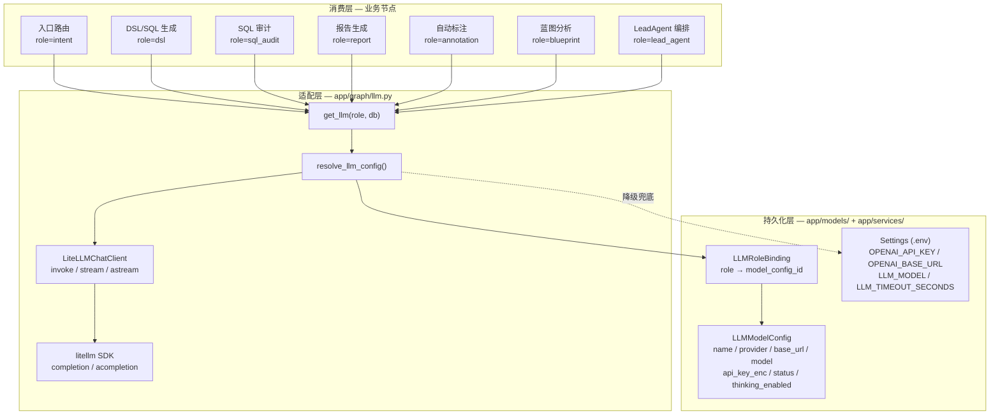
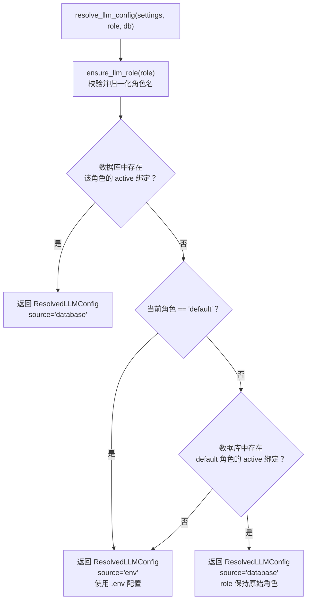
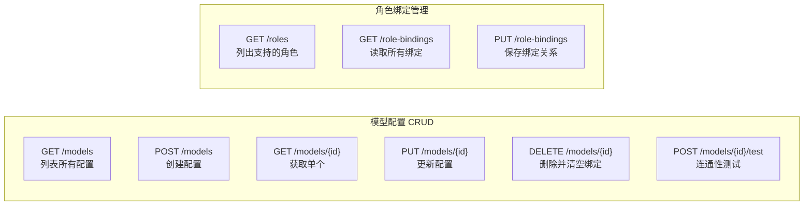

本文档深入解析 Datalogue 的多模型管理体系——从数据库持久化的模型配置、八种任务角色的绑定机制、LiteLLM SDK 适配层的模型名归一化，到"数据库优先、角色降级、环境变量兜底"的三级配置解析策略。适用于需要为不同问数环节绑定差异化模型、接入私有 LLM 网关、或排查模型调用链路的进阶开发者。

## 架构全景：配置层、适配层与消费层

系统将 LLM 配置管理拆分为三个正交层：**持久化层**负责存储模型连接信息与角色绑定关系，**适配层**将异构的模型标识归一化为 LiteLLM SDK 可识别的 `provider/model` 格式并封装 invoke/stream/astream 接口，**消费层**的各个业务节点通过 `get_llm(role="dsl", db=db)` 按角色获取客户端实例，完全不需要关心底层模型来自数据库还是环境变量。



Sources: [app/graph/llm.py](app/graph/llm.py#L248-L290) [app/services/llm_config.py](app/services/llm_config.py#L91-L128) [app/models/llm.py](app/models/llm.py#L1-L52)

## 数据模型：配置与绑定的分离

LLM 配置系统由两张表组成，遵循"配置可被多个角色复用"的设计原则。`LLMModelConfig` 是连接信息的唯一载体——每个模型对应一条记录，包含供应商、Base URL、模型名、加密后的 API Key、状态、超时和 Think 开关。`LLMRoleBinding` 是一个轻薄的关系表，以 `role` 为唯一键，将任务角色指向某个模型配置。这种分离意味着你可以创建一个 DeepSeek 配置，然后同时绑定到 `dsl` 和 `report` 两个角色，后续切换模型只需修改绑定行。

| 字段 | 类型 | 说明 |
|---|---|---|
| `name` | String(100) | 前端展示用的配置名称（如"生产 DeepSeek"） |
| `provider` | String(50) | 供应商标识，默认 `litellm`，决定模型名前缀拼接逻辑 |
| `base_url` | String(500) | OpenAI-compatible API 地址，支持 LiteLLM Proxy、私有网关 |
| `model` | String(200) | 模型标识，支持 `/` 分隔的完整路径或短名 |
| `api_key_enc` | Text | AES-GCM 加密的 API Key，接口只返回 `api_key_set` 布尔值 |
| `status` | String(20) | `active` / `disabled`，禁用模型不能被角色绑定 |
| `request_timeout_seconds` | Float | 请求超时秒数，默认 60 |
| `thinking_enabled` | Boolean | 是否保留模型原始 Think 输出，默认关闭 |
| `last_test_result` | JSON | 最近一次连通性测试的结果快照 |
| `last_error_message` | Text | 最近一次测试失败的错误信息 |

`LLMRoleBinding` 只有两个关键字段：`role`（唯一索引）和 `model_config_id`（外键，可为空表示该角色未绑定）。两张表均继承 `TimestampMixin`，自动记录创建和更新时间。

Sources: [app/models/llm.py](app/models/llm.py#L24-L52) [alembic/versions/e3f4a5b6c7d8_add_llm_model_config.py](alembic/versions/e3f4a5b6c7d8_add_llm_model_config.py#L38-L82)

## 角色系统：八种任务角色的语义分工

系统预定义了八种 LLM 任务角色，每种角色对应问数链路中一个明确的语义职责。角色的核心价值在于**低温绑定**——不同角色可以使用不同模型，且每个角色有自己的调用策略（token 上限、结构化输出要求）。

| 角色常量 | 语义职责 | 调用方 | temperature | max_tokens | 结构化输出 |
|---|---|---|---|---|---|
| `default` | 未单独绑定角色时的默认模型 | 所有回退场景 | — | — | — |
| `intent` | 意图识别与入口路由分类 | `lead_agent_routing.py` | 0.0 | 256 | ✅ json_object |
| `lead_agent` | 技能选择、工具规划与对话压缩 | `lead_agent.py` / `planner.py` / `conversation_store.py` | 0.0~0.1 | 800 | ✅ json_object |
| `dsl` | DSL / SQL 生成 | `nodes.py` (DSL 节点) | 0.1 | 800 | ✅ json_object |
| `sql_audit` | SQL 执行失败诊断与修复建议 | `nodes.py` (审计节点) | 0.0 | 512 | ❌ |
| `report` | 最终报告解释，流式输出自然语言 | `report_generation.py` | 0.3 | 无限制 | 无 |
| `annotation` | 表和字段自动标注 | `annotation.py` | 0.2 | 无限制 | 无 |
| `blueprint` | 分析蓝图 SQL 解析与业务场景理解 | `blueprint_analyzer.py` | 0.1 | 无限制 | 无 |

角色常量定义在 `LLM_ROLES` 元组中，`ensure_llm_role()` 负责校验和归一化——传入 `None` 或空字符串会被自动映射为 `default`，传入非法角色名会抛出 `ValueError`。这意味着任何调用方都不可能因拼写错误静默回退到意外模型。

Sources: [app/services/llm_config.py](app/services/llm_config.py#L23-L31) [app/services/llm_config.py](app/services/llm_config.py#L51-L56) [app/graph/llm.py](app/graph/llm.py#L32-L51)

## 配置解析与三级降级策略

`resolve_llm_config()` 实现了系统的核心降级逻辑——这是一个三级回退链，确保在任何配置缺失的情况下系统仍能正常工作。这个设计使得本地开发只需配 `.env`，生产环境可以通过前端界面精细控制每个角色的模型，而迁移期间两者可以共存。



三级优先级为：
1. **角色精确匹配**——数据库中存在该角色绑定且模型状态为 `active`；
2. **`default` 角色降级**——当前角色未绑定时回退到 `default` 角色的绑定；
3. **环境变量兜底**——数据库中无可用配置时使用 `.env` 中的 `OPENAI_API_KEY`、`OPENAI_BASE_URL`、`LLM_MODEL`。

值得注意的设计细节：当通过 `default` 角色降级时，返回的 `ResolvedLLMConfig.role` 保持原始请求角色（例如 `report`），但 `source` 仍然标记为 `"database"`。这使得调用方可以区分"报告角色专属配置"和"借用默认配置"两种情形。

Sources: [app/services/llm_config.py](app/services/llm_config.py#L91-L128) [app/services/llm_config.py](app/services/llm_config.py#L78-L89)

## LiteLLM 适配器：模型名归一化与提供商映射

`LiteLLMChatClient` 是系统与外界 LLM 服务的唯一通信界面。它封装了 `litellm` Python SDK，对外暴露 `invoke()`、`stream()` 和 `astream()` 三个方法，返回 LangChain 兼容的 `AIMessage` / `AIMessageChunk`。这使得现有的 LangGraph 工作流和 Langfuse 观测链路无需感知底层使用了哪家模型。

模型名归一化由 `_litellm_model_name()` 处理，核心逻辑如下：

| 输入 provider | 输入 model | 输出格式 | 示例 |
|---|---|---|---|
| `openai` / `openai-compatible` / `litellm` / `litellm_sdk` | `gpt-4o` | `openai/gpt-4o` | 自动补 `openai/` 前缀 |
| `qwen` / `dashscope` / `aliyun` | `qwen-plus` | `qwen/qwen-plus` | 以 provider 为前缀 |
| `anthropic` | `claude-sonnet-4-20250514` | `anthropic/claude-sonnet-4-20250514` | 以 provider 为前缀 |
| 任意 | `deepseek/deepseek-chat` | `deepseek/deepseek-chat` | 已含 `/` 则原样透传 |
| 空字符串 | `gpt-4o` | `gpt-4o` | 无 provider 时原样透传 |

这种设计让前端可以用短名配置模型（如 `qwen-plus`），后端自动补全 `provider/model` 格式以适配 LiteLLM SDK 的路由语法。同时完整路径（如 `minimax/MiniMax-M3`）也可以直接使用，无需修改前端录入。

适配器还负责统一管理 `extra_body` 参数。`build_llm_model_kwargs()` 根据 provider 类型下发供应商特定的禁用 Thinking 指令：Qwen 系列模型使用 `{"enable_thinking": False}`，Claude 系列使用 `{"thinking": {"type": "disabled"}}`。这些参数通过 `completion()` 的 `model_kwargs` 透传，仅在 `thinking_enabled=False` 时生效。

Sources: [app/graph/llm.py](app/graph/llm.py#L66-L88) [app/graph/llm.py](app/graph/llm.py#L52-L64) [app/graph/llm.py](app/graph/llm.py#L148-L290)

## 角色调用策略：Token 封顶与结构化输出

`ROLE_CALL_POLICIES` 字典集中控制每个角色的 LLM 调用约束。策略分为两类参数：`max_tokens` 限制完成 token 数以防止长文本失控，`response_format` 要求模型返回 JSON 以确保输出可被程序解析。

策略分配遵循明确的工程判断：

- **intent** 只需输出一个意图类别标签和实体字典，256 token 绰绰有余。
- **lead_agent** 和 **dsl** 需要生成结构化的技能选择或 DSL JSON，800 token 足够覆盖复杂场景。
- **sql_audit** 输出自然语言诊断报告，512 token 限制并**不启用**结构化输出——因为修复建议是叙述性的，不需要 JSON 约束。
- **report、annotation、blueprint** 三个角色不在 `ROLE_CALL_POLICIES` 中，因此 `_llm_call_policy()` 返回空字典，不施加 token 和格式限制。

注意：`report` 角色的流式生成（`astream`）没有 token 限制，因为报告质量依赖完整的上下文展开，截断会影响用户体验。

Sources: [app/graph/llm.py](app/graph/llm.py#L32-L51) [app/graph/llm.py](app/graph/llm.py#L91-L93)

## Think 模式：双层控制与流式过滤

Thinking 模式控制模型在回答之前是否输出推理链（Chain-of-Thought）。系统采用**双层开关**设计：

**第一层——请求侧禁用（`build_llm_model_kwargs`）**：当 `thinking_enabled=False` 时，根据 provider 类型在 `extra_body` 中下发禁用参数。这从源头阻止模型输出 `<think>` 块，是最高效的方式。支持的提供商：

| 提供商条件 | 下发的 extra_body 参数 |
|---|---|
| provider 为 `qwen`/`dashscope`/`aliyun` 或 model 含 `qwen` | `{"enable_thinking": False}` |
| provider 为 `anthropic` 或 model 含 `claude` | `{"thinking": {"type": "disabled"}}` |

**第二层——响应侧过滤（`utils/think.py`）**：即使请求侧禁用了 Think，部分模型的网关或代理仍可能注入 `<think>` 标签。`_clean_llm_content_if_needed()` 在非流式场景中调用 `strip_think_blocks()` 做正则移除以做最后一道防线。流式场景中使用 `filter_think_stream_chunk()` 配合状态机做跨 chunk 的增量过滤——`new_think_stream_state()` 返回一个可变字典，在每一次 `astream` 迭代中复用，确保跨 chunk 边界的 `<think>...</think>` 标签被完整吞掉而不泄露到用户可见内容中。

当 `thinking_enabled=True` 时，两层过滤全部跳过，模型原始输出原样返回。这在调试 prompt 效果或评估模型推理质量时非常有用。

Sources: [app/graph/llm.py](app/graph/llm.py#L52-L64) [app/graph/nodes.py](app/graph/nodes.py#L99-L130) [app/utils/think.py](app/utils/think.py#L1-L102) [alembic/versions/g2h3i4j5k6l7_add_llm_thinking_enabled.py](alembic/versions/g2h3i4j5k6l7_add_llm_thinking_enabled.py#L1-L53)

## API 设计：模型配置与角色绑定的管理界面

LLM 配置的 API 端点挂载在 `/api/llm` 路径下，提供完整的 CRUD 操作和连接测试功能。这些端点直接面向前端"系统设置 / LLM 模型"页面。



关键设计约束：
- **API Key 永不回传**：所有响应中不包含 `api_key` 字段，仅返回 `api_key_set: true/false`。编辑时若 `api_key` 留空则不覆盖旧密钥。
- **禁用模型不可绑定**：`PUT /role-bindings` 会校验目标模型的 `status` 必须为 `active`。
- **删除级联清理**：删除模型时自动将所有关联绑定的 `model_config_id` 置空，避免外键悬空。
- **测试持久化**：`POST /models/{id}/test` 调用 `LiteLLMChatClient.invoke()` 发送"请回复 OK"的测试消息，将结果（延迟、成功/失败、错误信息）写入 `last_test_result` 和 `last_error_message` 字段。

Sources: [app/api/llm.py](app/api/llm.py#L1-L201) [app/schemas/llm.py](app/schemas/llm.py#L1-L78)

## 安全存储：AES-GCM 加密

API Key 在写入数据库前通过 AES-256-GCM 加密。密钥派生自 `Settings.AES_KEY`（32 字节的 SHA-256 哈希），加密时生成 12 字节随机 nonce，密文以 Base64 编码存入 `api_key_enc` 字段。解密时反向操作——Base64 解码、分离 nonce 和密文、AES-GCM 解密。

这个设计保证即使数据库被导出或备份泄露，API Key 也无法被直接读取。唯一的攻击面是 `AES_KEY` 环境变量泄露，因此生产环境应通过 Kubernetes Secret 或 Vault 注入该值。

Sources: [app/core/security.py](app/core/security.py#L1-L45)

## 消费端的角色绑定全景

每个业务节点调用 `get_llm(temperature=..., role="...", db=db)` 时，系统自动完成三级解析。下表展示所有消费节点与角色的完整映射：

| 消费节点 | 文件位置 | 角色 | temperature | 说明 |
|---|---|---|---|---|
| 入口路由意图识别 | `lead_agent_routing.py:430` | `intent` | 0.0 | 决定 query/metadata/help 分类 |
| LeadAgent 技能选择 | `lead_agent.py:416` | `lead_agent` | 0.1 | 选择 SQL/探索/蓝图等技能 |
| 查询规划器 (Planner) | `planner.py:1508,1671` | `lead_agent` | 0.0 | 工具调用序列规划 |
| 会话压缩 | `conversation_store.py:639` | `lead_agent` | 0.1 | 多轮历史摘要 |
| DSL/SQL 生成 | `nodes.py:1611` | `dsl` | 0.1 | 语义层→SQL 翻译 |
| SQL 执行审计 | `nodes.py:2773` | `sql_audit` | 0.0 | 失败诊断与修复建议 |
| 报告生成 | `report_generation.py:153` | `report` | 0.3 | 流式自然语言输出 |
| 自动标注 | `annotation.py:180,285` | `annotation` | 0.2 | 表/字段 AI 描述 |
| 蓝图分析 | `blueprint_analyzer.py:965,1023` | `blueprint` | 0.1 | SQL 解析与场景理解 |

temperature 的选择反映了各角色的确定性需求：意图分类和 SQL 审计需要高度确定性（0.0），DSL 生成和蓝图分析需要少量随机性以避免重复模板（0.1），报告生成需要适度创造性（0.3）。

Sources: [app/services/lead_agent_routing.py](app/services/lead_agent_routing.py#L430) [app/services/lead_agent.py](app/services/lead_agent.py#L416) [app/services/subagent_planning/planner.py](app/services/subagent_planning/planner.py#L1508) [app/graph/nodes.py](app/graph/nodes.py#L1611) [app/graph/nodes.py](app/graph/nodes.py#L2773) [app/services/report_generation.py](app/services/report_generation.py#L153) [app/services/annotation.py](app/services/annotation.py#L180) [app/services/blueprint_analyzer.py](app/services/blueprint_analyzer.py#L965)

## 扩展指南：接入新模型提供商

当前系统支持 `build_llm_model_kwargs()` 中硬编码的 Qwen 和 Anthropic 两种 Think 禁用逻辑。若要接入新提供商（如 Gemini），需在 `build_llm_model_kwargs()` 中新增判断分支：

```python
# 示例：接入 Google Gemini
if provider == "google" or "gemini" in model:
    extra_body["thinking_config"] = {"include_thoughts": False}
```

如果要新增任务角色（如 `data_cleaning`），需要三步：在 `LLM_ROLES` 元组中添加新常量、在 `ROLE_CALL_POLICIES` 中定义调用策略（可选）、在业务代码中用 `get_llm(role="data_cleaning", db=db)` 创建客户端。前端会自动通过 `GET /roles` 感知新角色并生成绑定界面。

对于前置的文档，我们推荐先阅读 [Prompt 系统：各节点的提示词模板与 Langfuse Prompt 管理](26-prompt-xi-tong-ge-jie-dian-de-ti-shi-ci-mo-ban-yu-langfuse-prompt-guan-li) 来理解角色如何与 Prompt 配合工作，或回顾 [Langfuse 追踪集成：Trace、Span、Generation 与 Prompt 管理](24-langfuse-zhui-zong-ji-cheng-trace-span-generation-yu-prompt-guan-li) 了解 LLM 调用的观测链路。