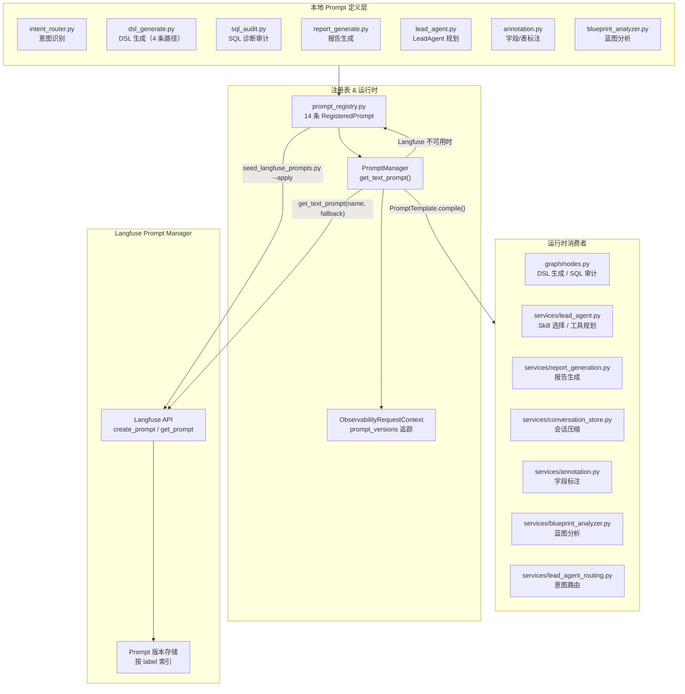

Datalogue 的 Prompt 系统采用**双层架构**：本地 Python 模块存放模板源码作为权威定义和兜底，Langfuse Prompt Manager 提供远程版本化管理和运行时热更新能力。两个层级通过统一的注册表桥接，确保种子脚本、运行时拉取和本地兜底使用同一份 Prompt 清单。

## 架构总览



整个系统的工作流：本地 Prompt 源码 (`app/prompts/`) 是**唯一权威定义**，注册表 (`prompt_registry.py`) 汇总所有 Prompt 的元信息（名称、模板内容、变量声明、标签），种子脚本 (`seed_langfuse_prompts.py`) 将注册表同步到 Langfuse；运行时通过 `PromptManager` 优先从 Langfuse 拉取，失败则退回本地兜底。同时，每次拉取的 Prompt 版本号会被记录到观测上下文 (`ObservabilityRequestContext.prompt_versions`)，随 Trace 一起上报，实现 Prompt 版本的端到端追踪。

Sources: [prompt_registry.py](app/services/observability/prompt_registry#L1-L50) · [prompts.py](app/services/observability/prompts#L1-L109)

## 本地 Prompt 模板：七大模块与十四类模板

`app/prompts/` 包包含七个模块，每个模块对应一个或多个工作流节点的系统提示词。模块之间职责分明、无循环依赖——它们只导出字符串常量或构建函数，不包含任何 I/O 或框架耦合。

Sources: [__init__.py](app/prompts/__init__.py#L1-L2)

### 意图识别（intent_router.py）

`INTENT_RECOGNITION_SYSTEM` 是入口路由的驱动提示词。它要求 LLM 以严格 JSON 输出用户意图分类——`query`（数据查询）、`chitchat`（闲聊）或 `function`（功能指令）。其中最关键的设计是多轮澄清识别规则：当历史对话中出现候选数据集、术语或问题列表时，用户的 "选 1"、"换成第二个"、"就这个" 等简短回复必须判为 `query` 而非 `function`，确保澄清流程不被中断。

该模板在入口路由服务 `lead_agent_routing.py` 中通过**直接 import** 使用，不经由 PromptManager——因为意图分类是 pipeline 的首个 LLM 调用，对延迟敏感，不需要 Langfuse 的远程拉取开销。

Sources: [intent_router.py](app/prompts/intent_router.py#L1-L23) · [lead_agent_routing.py](app/services/lead_agent_routing.py#L38-L435)

### DSL 生成（dsl_generate.py）

这是最复杂的 Prompt 模块，包含四条生成路径，每条路径由独立的构建函数生成模板字符串：

| 路径 | 构建函数 | 场景 | 输出格式 |
|------|----------|------|----------|
| 确定性路径 | `build_semantic_system()` | 指标全部命中语义层定义 | NL2DSL v2 JSON（含 asset_id、confidence、ambiguities） |
| 推断路径 | `build_inferred_system()` | 指标未命中语义层但有 DDL | 直接 SQL JSON |
| 真实 Schema 路径 | `build_real_schema_system()` | 数据源提供真实表结构 | 直接 SQL JSON |
| 无 Schema 兜底 | `build_no_schema_system()` | 完全没有 Schema | LLM 猜测 SQL JSON |

四条路径通过变量注入实现差异化：`query_rules` 控制查询约束文本，`dsl_limit_example` 控制 limit 示例值，`semantic_time_rule` 和 `semantic_limit_rule` 控制时间范围和条数默认行为。确定性路径的模板还包含完整的 NL2DSL v2 Schema 示例，指示 LLM 如何填充 `asset_id`、`confidence` 和 `ambiguities` 字段。

Sources: [dsl_generate.py](app/prompts/dsl_generate.py#L1-L73) · [nodes.py](app/graph/nodes.py#L1565-L1650)

### SQL 审计（sql_audit.py）

`SQL_AUDIT_SYSTEM` 是 SQL 执行失败后的诊断提示词。它的核心设计原则是**确定性诊断优先**：系统先通过规则引擎 `_classify_sql_execution_error()` 产出硬性决策（错误码、严重度、是否可重试），LLM 只负责补充自然语言解释（根因、错填字段、修复建议），被明确禁止覆盖确定性字段。

模板内置三个 Few-shot 案例，覆盖最常见的失败模式：`time_range.field` 错填 DDL 列名、`filter_sql` 使用 Python 风格 `!= null`、指标表达式引用了 DDL 中不存在的列。这些案例显著提升了 LLM 诊断的准确性和输出格式一致性。

Sources: [sql_audit.py](app/prompts/sql_audit.py#L1-L51) · [nodes.py](app/graph/nodes.py#L2705-L2874)

### 报告生成（report_generate.py）

`_REPORT_BASE` 定义了从 SQL 查询结果生成中文数据洞察的系统提示词。它通过 `build_report_system()` 支持注入**数据集级 LLM 约束**——管理员可以在数据集配置中写入硬性要求（如"禁止在报告中暴露底层表名"），这些约束会被拼接到报告 Prompt 的末尾，要求 LLM 严格遵守。

报告生成在 `report_generation.py` 中通过 `PromptManager` 拉取，因为它是面向最终用户的输出，需要支持非代码发布的热更新以快速调整回答风格。

Sources: [report_generate.py](app/prompts/report_generate.py#L1-L19) · [report_generation.py](app/services/report_generation.py#L140-L165)

### LeadAgent 工具规划（lead_agent.py）

LeadAgent 采用**渐进式披露**模式，分两个阶段调用 LLM：

1. **Skill 选择器** (`LEAD_AGENT_SKILL_SELECTOR_SYSTEM`)：根据用户问题、会话摘要、ToolPolicy 和可选的 `candidate_assets`，选择本轮需要启用的 Skill。此时不暴露工具 Schema，降低 token 消耗。
2. **工具规划器** (`LEAD_AGENT_TOOL_PLANNER_SYSTEM`)：根据选中的 Skill 和对应的工具 Schema，规划具体的工具调用序列，同时生成多轮追问的 `multiturn_refinement` 抽象槽位。

两个阶段的 Prompt 都包含详细的 `candidate_assets` 字段说明和 15+ 条使用规则，确保 LLM 正确理解渐进式资产注入的语义。Prompt 通过 `PromptManager` 拉取以支持热更新。

Sources: [lead_agent.py](app/prompts/lead_agent.py#L1-L116) · [lead_agent.py](app/services/lead_agent.py#L400-L550)

### 字段/表标注（annotation.py）

两个 Prompt 服务于数据集的自动化语义标注：

- `ANNOTATION_SYSTEM_PROMPT`：要求 LLM 为每个字段输出 `business_desc`（10-30 字中文描述）、`semantic_role`（metric_candidate / dimension_candidate / time_field / id_field / unused）、`default_agg`、置信度和同义词。
- `TABLE_ANNOTATION_PROMPT`：要求 LLM 为整张表生成一句业务描述。

两类 Prompt 都通过**直接 import** 使用，因为标注是后台批处理任务，不需要 Langfuse 的实时版本管理。

Sources: [annotation.py](app/prompts/annotation.py#L1-L41)

### 蓝图分析（blueprint_analyzer.py）

两个极简 Prompt 分别驱动基于 SQL 草稿和基于自然语言描述的分析蓝图生成：

- `BLUEPRINT_SQL_ANALYSIS_SYSTEM`："你是数语 Datalogue 的资深数据产品架构师和 SQL 分析专家。"
- `BLUEPRINT_DESCRIPTION_SYSTEM`："你是数语 Datalogue 的资深数据产品经理和智能问数设计专家。"

通过角色设定来引导 LLM 输出风格的差异——架构师角色关注技术可执行性，产品经理角色关注业务可理解性。

Sources: [blueprint_analyzer.py](app/prompts/blueprint_analyzer.py#L1-L13)

## 运行时消费模式：两种策略的权衡

系统内存在两种 Prompt 消费策略，选择依据是业务场景对**热更新敏感性**和**调用频率**的权衡：

| 消费模式 | 使用的模块 | 调用方式 | 适用场景 |
|----------|-----------|----------|----------|
| **Langfuse 优先** | sql_audit、report_generate、lead_agent_skill_selector、lead_agent_tool_planner、datalogue-compaction | `get_prompt_manager().get_text_prompt(name, fallback=LOCAL)` | 需要热更新、调用频率较低（每次请求 1-3 次） |
| **本地直接引用** | intent_router、dsl_generate（全部 4 条路径）、annotation、blueprint_analyzer | `from app.prompts.xxx import PROMPT` → 直接传给 `SystemMessage` | 调用频率高、对延迟敏感、或为后台批处理 |

Langfuse 优先模式的核心实现在 `PromptManager.get_text_prompt()` 中：首先检查 `LANGFUSE_ENABLED` 配置，若启用则通过 Langfuse SDK 拉取指定 `label` 的远程 Prompt；任何异常（网络超时、返回空内容、客户端不可用）都会静默降级为本地 fallback，记录 warning 日志后返回 `source="fallback"` 的 `PromptTemplate`。这种设计确保了 Prompt 管理**永远不会成为问数主链路的故障点**。

Sources: [prompts.py](app/services/observability/prompts.py#L44-L108) · [nodes.py](app/graph/nodes.py#L2773-L2778)

## Langfuse Prompt 注册表：从源码到远程的桥梁

`prompt_registry.py` 是整个系统的 Prompt 单一事实来源。它定义了 `RegisteredPrompt` 数据类（包含 name、display_name、prompt、description、variables、tags、config），并提供两个核心函数：

- `get_registered_prompts()` — 汇总全部 14 条 Prompt 定义，供种子脚本和运行时索引使用
- `sync_registered_prompts()` — 将注册表与 Langfuse 远程比对，支持 dry-run 预览和 `--apply` 实际写入

每条 `RegisteredPrompt` 通过 `langfuse_config()` 生成写入 Langfuse 的结构化配置，包括中文名称、中文描述、变量列表和 `prompt_pack_version` 版本标识。同步逻辑内置了 `skip_unchanged` 优化——若远程同 label 的 Prompt 内容和配置均未变化，则跳过创建新版本。

完整的 14 条 Prompt 注册表：

| name | display_name | 变量 | 标签 |
|------|-------------|------|------|
| `intent_recognition` | 入口意图识别 | — | router |
| `dsl_generate_real_schema` | 真实 Schema SQL 生成 | `query_rules` | dsl, sql |
| `dsl_generate_inferred` | 语义层推断 SQL 生成 | `query_rules` | dsl, sql |
| `dsl_generate_semantic` | 语义层 NL2DSL 生成 | `dsl_limit_example`, `semantic_time_rule`, `semantic_limit_rule` | dsl, semantic |
| `dsl_generate_no_schema` | 无 Schema SQL 兜底生成 | `query_rules` | dsl, fallback |
| `report_generate` | 查询结果报告生成 | `dataset_prompt_block` | report |
| `sql_audit` | SQL 执行失败诊断 | — | sql-audit |
| `lead_agent_skill_selector` | LeadAgent Skill 选择器 | — | lead-agent |
| `lead_agent_tool_planner` | LeadAgent 工具规划器 | — | lead-agent |
| `datalogue-compaction` | 多轮会话压缩摘要 | `existing_summary`, `messages_json` | multiturn |
| `annotation_field` | 字段语义标注 | — | annotation |
| `annotation_table` | 数据表业务描述生成 | — | annotation |
| `blueprint_sql_analysis` | SQL 草稿蓝图分析 | — | blueprint |
| `blueprint_description_analysis` | 业务场景蓝图草稿生成 | — | blueprint |

Sources: [prompt_registry.py](app/services/observability/prompt_registry.py#L80-L285)

## 种子脚本：Prompt 同步工作流

`scripts/seed_langfuse_prompts.py` 是 Langfuse Prompt 的发布工具，支持三种操作模式：

| 命令 | 效果 |
|------|------|
| `python scripts/seed_langfuse_prompts.py` | Dry-run 预览，输出注册表中所有 Prompt 的差异对比，不写入 Langfuse |
| `python scripts/seed_langfuse_prompts.py --apply` | 将注册表中所有 Prompt 写入 Langfuse（跳过内容未变者） |
| `python scripts/seed_langfuse_prompts.py --apply --force` | 强制写入，即使远程内容未变化也创建新版本 |

种子脚本从环境变量读取 Langfuse 连接配置（`LANGFUSE_PUBLIC_KEY`、`LANGFUSE_SECRET_KEY`、`LANGFUSE_BASE_URL`），通过 `prompt_registry.py` 的 `get_registered_prompts()` 获取当前代码版本的 Prompt 清单，然后逐条比对并同步。支持 `--label` 参数指定写入的 Langfuse label（默认读取 `LANGFUSE_PROMPT_LABEL` 环境变量），以及 `--json` 参数输出机器可解析的结果。

Sources: [seed_langfuse_prompts.py](scripts/seed_langfuse_prompts.py#L1-L127)

## 语义层 Schema 渲染：从结构化数据到 LLM 上下文

`app/utils/prompt.py` 中的 `build_schema_prompt()` 是独立于 Prompt 模板体系之外的**上下文构建工具**。它不定义 LLM 系统提示词，而是将结构化的数据集、指标、维度数据渲染为 LLM 可读的自然语言上下文文本：

```
数据集: 零售销售分析
描述: 全国门店零售数据明细
tables_json: {"tables": [...]}

【数据集级 LLM 约束（硬性要求）】
禁止在回答中暴露底层数据源表名和字段名。

【指标列表】
- total_gmv (总 GMV): 表达式=SUM(order_amount) 表=t_orders 时间字段=order_date 同义词=销售额, GMV
- refund_rate (退款率): 表达式=SUM(refund_amt)/SUM(order_amount)...

【维度列表】
- region (地区): 字段=region_name 枚举=华东, 华南, 华北 同义词=区域, 大区
- status (订单状态): 字段=order_status 枚举=已支付, 已退款, 已取消
```

渲染器按固定顺序输出四个区块：数据集元信息（含 `tables_json` 和查询约束）、数据集级 LLM 硬性约束、指标列表（含表达式、表名、时间字段、过滤条件、同义词）、维度列表（含字段名、枚举值、同义词）。指标必须包含 `time_field`——因为下游 DSL 生成节点需要 LLM 为 `time_range.field` 选择正确的语义层时间字段，若不告知，LLM 会从 DDL 中随意猜测导致 SQL 错误。

Sources: [prompt.py](app/utils/prompt.py#L1-L70)

## Prompt 版本追踪与观测

`PromptManager` 在每次拉取 Prompt 后，会将版本信息回写到当前请求的观测上下文：

```python
context.prompt_versions[prompt.name] = {
    "version": prompt.version,  # Langfuse 版本号或 "local"
    "source": prompt.source,    # "langfuse" / "local" / "fallback"
}
```

这使得每次 LLM 调用的 Prompt 版本信息随 Langfuse Trace 一起上报，当需要排查生成质量问题时，可以精确回溯到具体 Prompt 版本。`LeadAgent` 的 Skill 选择器和工具规划器还进一步将 `prompt_name`、`prompt_version`、`prompt_source` 写入 Langfuse Generation 的 metadata，实现 Prompt 级的细粒度可观测。

Sources: [prompts.py](app/services/observability/prompts.py#L98-L106) · [context.py](app/services/observability/context.py#L40-L41) · [lead_agent.py](app/services/lead_agent.py#L411-L450)

## 阅读进展

至此，Prompt 系统的双层架构（本地模板 + Langfuse 远程管理）、十四类 Prompt 模板的设计意图、两种运行时消费策略的权衡，以及从注册到同步再到版本追踪的全链路已经完整覆盖。对于希望深入了解 Prompt 如何被工作流节点消费的读者，建议继续阅读 [DSL 生成、校验与 SQL 编译的逐节点实现](13-dsl-sheng-cheng-xiao-yan-yu-sql-bian-yi-de-zhu-jie-dian-shi-xian)（数据面核心）和 [LeadAgent 工具编排：技能选择、工具规划与路由决策](9-leadagent-gong-ju-bian-pai-ji-neng-xuan-ze-gong-ju-gui-hua-yu-lu-you-jue-ce)（控制面核心）。若关注可观测性基础设施，则可跳转到 [Langfuse 追踪集成：Trace、Span、Generation 与 Prompt 管理](24-langfuse-zhui-zong-ji-cheng-trace-span-generation-yu-prompt-guan-li)。