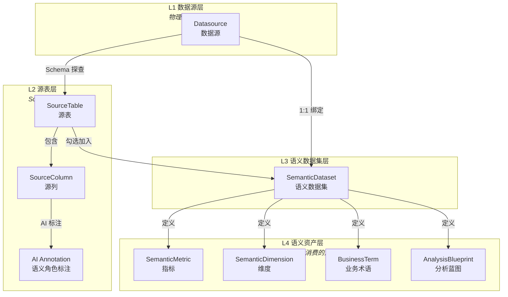
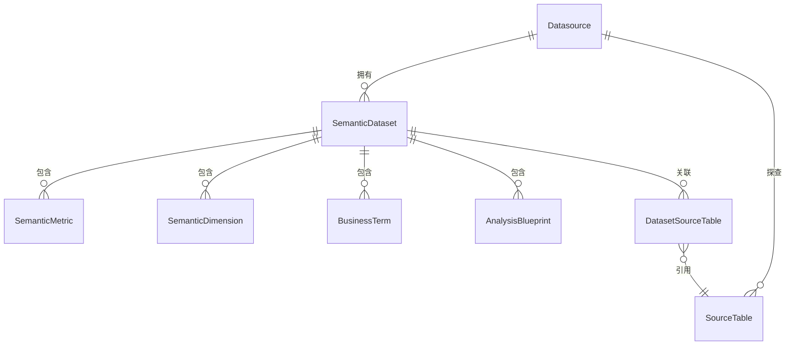
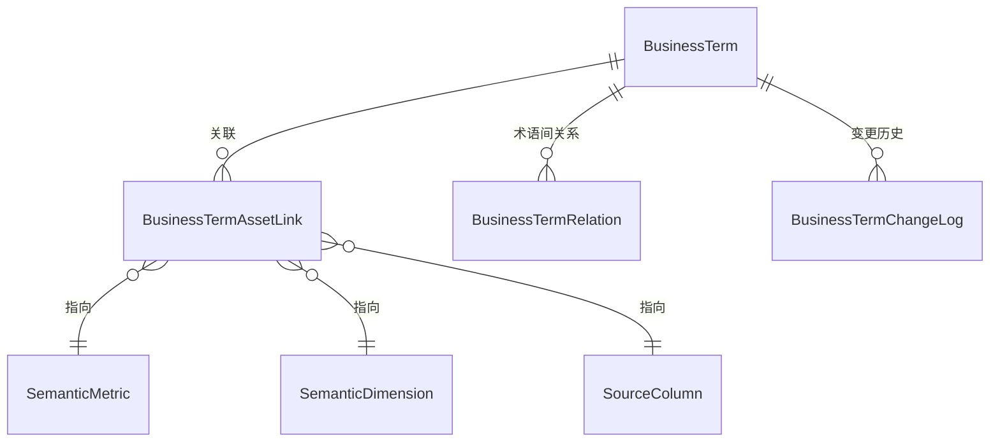
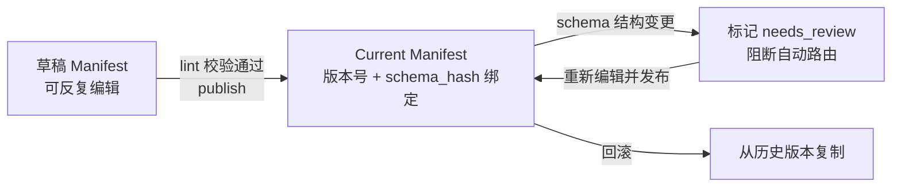
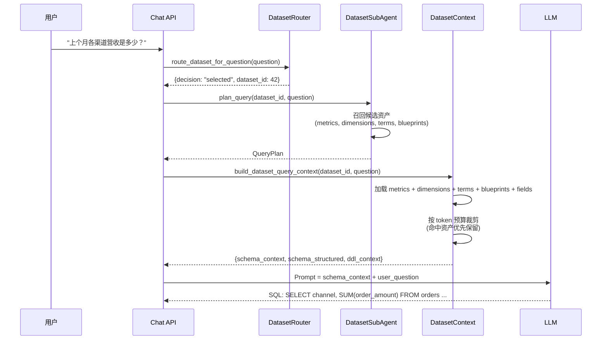

本文是 Datalogue 平台核心概念的入门指南。你将理解**数据集（Dataset）**、**指标（Metric）**、**维度（Dimension）** 如何构成平台的语义层，以及**语义层治理**如何保证 AI 问数的准确性与可信度。建议先阅读 [概述：AI 原生智能问数平台](1-gai-shu-ai-yuan-sheng-zhi-neng-wen-shu-ping-tai) 建立全局认知。

## 四层架构：从物理表到业务语义

Datalogue 用四层架构将「数据库里有什么」逐步翻译为「业务上能问什么」。核心原则是：**AI 不直接面对裸表，而是面对经过治理的语义资产**。



每一层的作用：

| 层级 | 核心模型 | 关键职责 | 谁维护 |
|------|---------|---------|--------|
| L1 数据源 | `Datasource` | 存储数据库连接信息：主机、端口、方言、凭证 | 平台管理员 |
| L2 源表 | `SourceTable` / `SourceColumn` | 物理 Schema 快照 + AI 语义标注（角色、聚合建议、同义词） | 平台自动探查 + AI 辅助 + 用户审核 |
| L3 数据集 | `SemanticDataset` | 选表、绑定数据源，承载所有语义资产的容器 | 业务分析师 / 数据集管理员 |
| L4 语义资产 | `Metric` / `Dimension` / `Term` / `Blueprint` | 可被 LLM 消费的业务定义 | 业务分析师 + AI 辅助生成 |

Sources: [dataset.py](app/models/dataset.py#L24-L56) [datasource.py](app/models/datasource.py#L20-L40)

---

## 数据集 (SemanticDataset)：语义资产的容器

数据集是整个治理体系的**组织单元**。一个数据集对应一个业务域（如「电商订单分析」「用户增长看板」），它将物理表、指标定义、维度定义、业务术语和分析蓝图聚合在一起。

### 数据集的关键属性

从模型定义中可以看到，数据集承载两类关键配置——它们直接决定了 LLM 生成 SQL 的行为：

| 属性 | 类型 | 作用 | 示例 |
|------|------|------|------|
| `name` | `String(100)` | 数据集的业务名称 | "电商核心订单分析" |
| `datasource_id` | `ForeignKey` | 绑定到一个物理数据源 | → `datasource.id` |
| `tables_json` | `JSON` | 手动补充的表级元数据（如 JOIN 关系） | `{"orders": {"join": "users ON ..."}}` |
| `prompt_instructions` | `Text` | **LLM 硬性约束**：注入到 Prompt 的业务规则 | "金额单位均为元，不要用分" |
| `query_constraints` | `JSON` | **SQL 生成约束**：默认时间范围、行数限制 | `{"default_time_range_days": 30, "default_limit": 100}` |
| `status` | `String(20)` | 数据集生命周期状态 | `draft` / `active` / `deprecated` |

其中**查询约束**是安全兜底的关键设计：当用户说「查一下订单」而没有指定时间范围时，系统自动注入 `WHERE created_at >= 近30天`；没有指定条数时自动追加 `LIMIT 100`。最大 `LIMIT` 硬限制 1000 条，防止一次查询拉取海量数据。

Sources: [dataset.py](app/models/dataset.py#L24-L56) [query_constraints.py](app/utils/query_constraints.py#L18-L66)

### 数据集与其他模型的关系

数据集通过 **一对多关系** 聚合了四类语义资产，并建立了与源表的 **多对多关联**：



`DatasetSourceTable` 是「选表」动作的物理存储——它记录了一个数据集勾选了哪些源表。这种设计允许同一张物理表被多个数据集复用，不同数据集可以给它赋予不同的业务语义。

Sources: [dataset.py](app/models/dataset.py#L145-L161) [dataset.py](app/models/dataset.py#L48-L55)

---

## 指标 (SemanticMetric)：可度量的业务数字

指标是语义层中最核心的资产类型——它定义了一个**可以被聚合计算**的业务度量。

### 指标的关键字段

| 字段 | 说明 | 示例 |
|------|------|------|
| `name` | 指标的英文标识名 | `total_revenue` |
| `display_name` | 中文展示名 | "总营收" |
| `expr` | **SQL 聚合表达式**（核心字段） | `SUM(order_amount)` |
| `table_name` | 表达式所属的物理表 | `orders` |
| `time_field` | 时间维度字段（用于时间序列查询） | `created_at` |
| `granularity` | 默认时间粒度 | `day` / `week` / `month` |
| `format_str` | 展示格式 | `¥#,##0.00` |
| `filter_sql` | 全局过滤条件（该指标的硬过滤） | `status = 'paid'` |
| `synonyms` | **同义词列表**——帮助 LLM 匹配用户口语 | `["营收", "收入", "销售额", "revenue"]` |

同义词是 LLM 正确识别用户意图的关键桥梁。当用户问「上个月卖了多少」，系统通过同义词匹配将「卖了多少」映射到 `total_revenue` 指标。

Sources: [dataset.py](app/models/dataset.py#L59-L75) [schemas/dataset.py](app/schemas/dataset.py#L55-L74)

### 指标在上下文中的组装方式

当用户发起一次问数时，`dataset_context` 服务将指标组装为如下格式注入 LLM Prompt：

```
【指标列表】
- total_revenue (总营收): 表达式=SUM(order_amount) 表=orders 时间字段=created_at 同义词=营收, 收入, 销售额, revenue
- avg_order_value (客单价): 表达式=SUM(order_amount)/COUNT(DISTINCT user_id) 表=orders 同义词=平均消费, 单均金额, ARPU
```

这套格式同时注入了表达式、所属表、时间字段和同义词，确保 LLM 有足够信息生成正确的 SELECT 子句。

Sources: [dataset_context.py](app/services/dataset_context.py#L272-L293)

---

## 维度 (SemanticDimension)：下钻与分组的切片

维度定义了数据可以**按什么分组**。它对应 SQL 中的 `GROUP BY` 子句，是将指标按不同视角切片的入口。

### 维度的关键字段

| 字段 | 说明 | 示例 |
|------|------|------|
| `name` | 维度英文标识名 | `order_channel` |
| `display_name` | 中文展示名 | "下单渠道" |
| `column_name` | **映射的物理列名**（核心字段） | `channel` |
| `table_name` | 物理列所在的表 | `orders` |
| `join_to` / `join_key` | **跨表 JOIN 信息**——维度在另一张表时使用 | `users` / `user_id` |
| `hierarchy` | 层级结构（如 国家→省份→城市） | `{"levels": ["country", "province", "city"]}` |
| `enum_values` | 枚举值列表——帮助 LLM 生成精确的 WHERE 过滤 | `["iOS", "Android", "Web"]` |
| `synonyms` | **同义词列表** | `["渠道", "来源", "平台", "channel"]` |

`join_to` 和 `join_key` 是维度区别于指标的关键设计——维度允许引用 JOIN 后的关联表字段，例如「按用户所在城市分组」，而 `city` 字段在 `users` 表中而非 `orders` 表。

Sources: [dataset.py](app/models/dataset.py#L78-L88)

### 枚举维度的特殊处理

对于 `enum_values` 非空且值数量 ≤ 6 的枚举维度，系统将其**样例值内联到字段描述**中，格式为 `字段名 "描述(值1/值2/值3)"`。这个设计同时出现在紧凑格式化和 DDL 上下文中——目的是让 LLM 在生成 WHERE 条件时能直接使用精确的枚举值，而不是靠猜测。

Sources: [schema_formatter.py](app/utils/schema_formatter.py#L30-L47)

---

## 业务术语 (BusinessTerm)：语义图谱的节点

业务术语是语义治理的**上层抽象**——它不直接对应物理字段，而是将业务概念、指标、维度和蓝图**关联成网**。

### 术语的核心字段与关联机制

| 字段 | 说明 |
|------|------|
| `name` / `display_name` | 术语的英/中文名称 |
| `term_type` | 术语类型：`metric_concept`（指标概念）、`business_object`（业务对象）、`business_process`（业务流程）等六种 |
| `definition` | **业务定义文本**——人类可读的定义 |
| `aliases` | **正向同义词**——匹配用户问题中出现的词 |
| `forbidden_aliases` | **反向排除词**——防止误匹配 |
| `examples` | 使用示例 |

术语通过 `BusinessTermAssetLink` 与指标、维度、字段和蓝图建立多对多关联：



这意味着一个术语「流失用户」可以同时关联到指标 `churn_rate`、维度 `user_status` 和蓝图「流失用户分析报告」。当用户问「流失用户」时，系统一次性命中所有关联资产。

Sources: [dataset.py](app/models/dataset.py#L164-L228)

---

## 分析蓝图 (AnalysisBlueprint)：预设分析模板

蓝图是最高层级的语义资产——它是一个**完整的分析模板**，包含触发条件、参数定义、SQL 模板和执行逻辑。

### 蓝图的四层结构

| 层级 | 字段组 | 职责 |
|------|--------|------|
| **L0 路由层** | `trigger_keywords`、`trigger_examples`、`when_to_use` | 决定这个蓝图什么时候被触发 |
| **L1 调用层** | `parameters`、`implementation_type`、`call_template`、`output_schema` | 定义参数 Schema 和调用方式 |
| **L2 业务逻辑层** | `steps`、`attribution_hints` | 描述分析步骤和归因逻辑 |
| **L3 原始代码** | `raw_sql` | 实际可执行的 SQL 模板 |

蓝图支持 `stored_procedure` 和 `sql_template` 两种实现方式。当用户的问法命中蓝图的触发关键词（如「月报」「周报」「环比分析」），系统优先走蓝图路径——跳过 NL2DSL2SQL 的完整管线，直接套用预定义的 SQL 模板执行。

蓝图还保留了**版本快照**（`BlueprintVersion`）和**使用日志**（`BlueprintUsageLog`），每次发布生成完整快照，每次执行记录性能数据和诊断信息。

Sources: [dataset.py](app/models/dataset.py#L348-L418) [schemas/dataset.py](app/schemas/dataset.py#L414-L531)

---

## 语义层治理：从「能跑」到「可靠」

语义资产的**正确性**和**完整性**直接决定了 AI 问数的准确性。Datalogue 通过三层治理机制——**列审核与角色标注**、**SubAgent Manifest 发布契约**、**语义验证案例**——确保只有经过质量审查的语义层才能进入生产链路。

### 第一层：AI 辅助列标注与审核

当用户将源表勾选加入数据集时，系统触发 AI 标注流程。标注服务遵循三个原则：

1. **数据库已有注释作为 AI 输入，AI 不覆盖、只增强**
2. **分层存储**：`db_comment` → `ai_description` → `user_description` → `effective_desc`（优先级递增）
3. **标注缓存**：同一张表加入多个数据集时，跳过已标注字段

描述生效值的解析优先级由高到低为：用户手动修改 > 数据库原生注释 > AI 标注 > 字段名回退。

每个 `SourceColumn` 还通过 AI 标注获得**语义角色**（`ai_semantic_role`）：`metric_candidate`（可做指标）、`dimension_candidate`（可做维度）、`time_field`（时间字段）、`id_field`（ID 字段）、`unused`（无用字段）。用户可以通过审核接口确认或覆盖角色，确认后的字段可一键转换为 `SemanticMetric` 或 `SemanticDimension`。

Sources: [annotation.py](app/services/annotation.py#L35-L79)

### 第二层：SubAgent Manifest 发布契约

Manifest 是数据集从「草稿」到「可被自动路由」的**治理契约**。每个数据集可以维护一个草稿 Manifest 和一个发布的 Current Manifest：



Manifest 由两类字段组成：

| 类别 | 字段 | 维护方式 |
|------|------|---------|
| **A 类（自动派生）** | `key_metrics`、`key_dimensions`、`bound_schema_version`、`permission_scope` | 系统从语义资产中自动提取 |
| **B 类（人工维护）** | `description`、`business_domain`、`sample_questions`、`routing_negative_examples` | 数据集管理员手动填写 |

**发布前 Lint 校验**是质量卡点——以下任何一条不通过则阻断发布：

- `description` 不能为空，建议 80-200 字
- `description` 必须至少包含一个业务实体、指标或维度
- `description` 必须至少包含时间或范围线索
- `business_domain` 至少选择一项
- `sample_questions` 必须维护 5-10 条
- `routing_negative_examples` 必须维护 3-5 条（防误路由）

**运行时门禁**（`evaluate_manifest_runtime_guard`）在执行前检查六项条件：路由置信度、Manifest 存在性、Schema 版本一致性、审核状态、权限范围和质量状态——任何一项不通过均 fail-closed 阻断执行。

Sources: [dataset_manifest.py](app/services/dataset_manifest.py#L237-L330) [dataset_manifest.py](app/services/dataset_manifest.py#L510-L590)

### 第三层：语义验证案例

`SemanticValidationCase` 存储了数据集的**测试问句及其执行结果**，包括：
- 用户问题 → 路由类型 → 执行入口 → 蓝图 → SQL → 回答 → 错误信息 → 完整报告

这构成了一个可回归的测试集：当语义层发生变更后，可以重跑验证案例来确保已有的问法仍然正确。

Sources: [dataset.py](app/models/dataset.py#L273-L295)

---

## 端到端数据流：语义资产如何在问数链路中消费

以下 Mermaid 时序图展示了用户发起一次问数时，语义资产如何从存储层流向 LLM Prompt 并最终生成 SQL：



在 `build_dataset_query_context` 函数中，所有语义资产被转换为带优先级的上下文条目（`ContextEntry`），然后按 token 预算裁剪：

| 资产类型 | 优先级 | 说明 |
|---------|--------|------|
| 指标 (metric) | 90 | 最高优先级，因为决定 SELECT 子句 |
| 维度 (dimension) | 80 | 决定 GROUP BY 和过滤 |
| 业务术语 (term) | 70 | 提供业务语境 |
| 分析蓝图 (blueprint) | 60 | 触发模板匹配 |
| 物理字段 (field) | 50 | Schema 级信息作为兜底 |

**命中资产优先保留**机制：如果资产 ID 出现在 `matched_assets` 解析结果中，或其同义词命中用户问题文本，该资产被标记为 `pinned`，裁剪时即使超出预算也强制保留。

Sources: [dataset_context.py](app/services/dataset_context.py#L600-L733) [dataset_context.py](app/services/dataset_context.py#L455-L490)

---

## 下一步阅读

现在你已经理解了数据集、指标、维度和语义层治理的核心概念，建议按以下路径继续深入：

1. **动手实践**：阅读 [快速开始：环境搭建与首次运行](2-kuai-su-kai-shi-huan-jing-da-jian-yu-shou-ci-yun-xing)，启动本地环境创建一个真实的数据集
2. **管理 API**：阅读 [API 路由总览：数据源、数据集、对话与问数端点](4-api-lu-you-zong-lan-shu-ju-yuan-shu-ju-ji-dui-hua-yu-wen-shu-duan-dian)，了解如何通过 API 管理语义资产
3. **理解完整链路**：阅读 [NL2DSL2SQL 处理管道：从自然语言到结构化查询的端到端链路](5-nl2dsl2sql-chu-li-guan-dao-cong-zi-ran-yu-yan-dao-jie-gou-hua-cha-xun-de-duan-dao-duan-lian-lu)，看到语义资产如何贯穿整个处理管道
4. **深入 SubAgent**：阅读 [候选资产召回：多类型语义资产的统一检索与置信度排序](16-hou-xuan-zi-chan-zhao-hui-duo-lei-xing-yu-yi-zi-chan-de-tong-jian-suo-yu-zhi-xin-du-pai-xu)，理解资产召回和置信度评分的底层机制