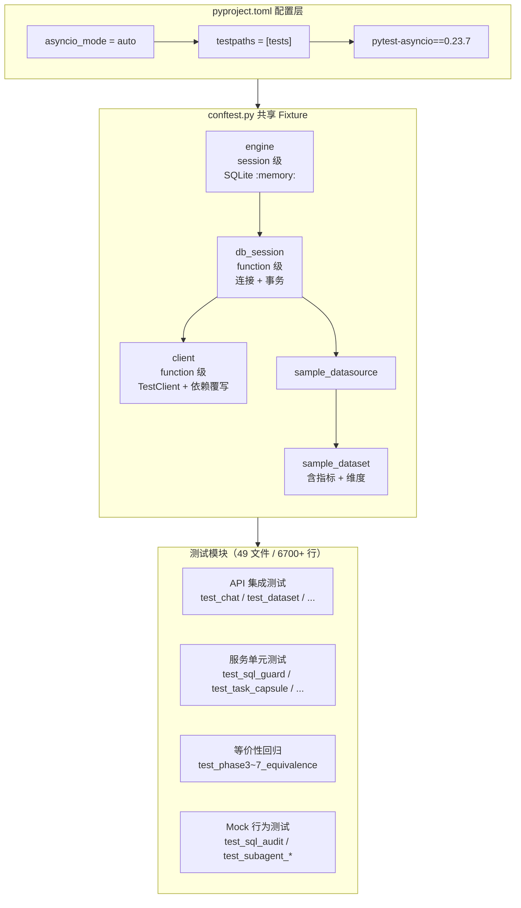
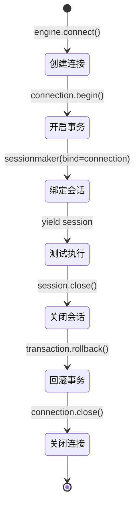
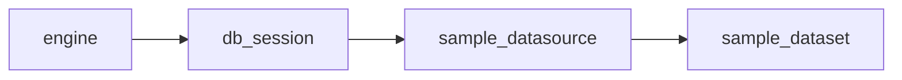
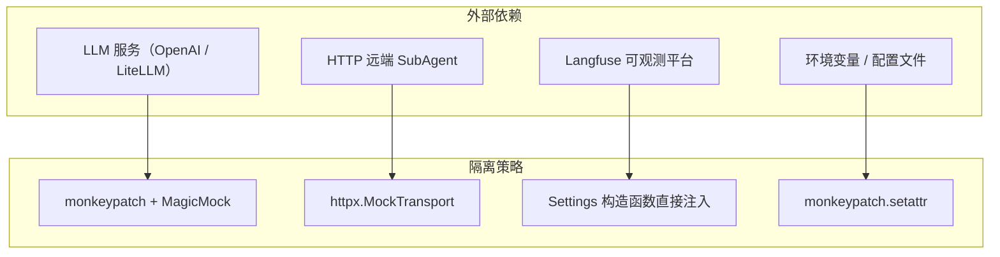

Datalogue API 的测试体系围绕 **pytest** 构建，以 **SQLite 内存数据库** 为测试底座，通过**连接级事务回滚**实现测试间完全隔离。整个体系涵盖 49 个测试文件、超过 6700 行测试代码，覆盖从 API 路由、服务层、图工作流节点到安全审计的全链路。本章将逐层解析其架构设计与核心实践。

## 整体架构一览

测试体系的运转依赖三层协作：**pytest 配置**驱动执行环境、**conftest.py** 提供共享 Fixture 工厂、**各测试模块**消费 Fixture 并实施断言。下图展示了从启动到单测执行的完整依赖关系：



Sources: [pyproject.toml](pyproject.toml#L62-L64), [conftest.py](tests/conftest.py#L1-L178)

## 第一节：conftest.py — 测试夹具的中央工厂

`tests/conftest.py` 是整个测试体系的心脏，它定义了四个核心 Fixture，按作用域和职责形成了清晰的依赖树。理解这棵树的构造，是理解 Datalogue 测试原理的前提。

### 1.1 engine：会话级数据库引擎

`engine` 是唯一的 **session 作用域** Fixture——这意味着整个测试会话中，它只被创建一次，被所有测试函数共享：

```python
@pytest.fixture(scope="session")
def engine():
    engine = create_engine(
        "sqlite:///:memory:",
        connect_args={"check_same_thread": False},
        pool_pre_ping=True,
    )
    Base.metadata.create_all(bind=engine)
    yield engine
    Base.metadata.drop_all(bind=engine)
```

这里有两个关键设计决策。第一，使用 `sqlite:///:memory:` 确保每个测试会话拥有一块完全独立的内存数据库空间，没有磁盘文件残留。第二，`check_same_thread=False` 是 SQLite 与 FastAPI 线程模型兼容的必要条件——FastAPI 的 `TestClient` 默认在独立线程中运行，而 SQLite 原生要求连接与创建线程一致，关闭此检查后才能安全跨线程使用。会话结束时 `drop_all` 确保环境完全回收到零状态。

Sources: [conftest.py](tests/conftest.py#L47-L57)

### 1.2 db_session：函数级事务隔离

`db_session` 是整个隔离体系的核心。它的作用域是 **function**——每个测试函数都会获得一个全新的数据库连接和事务：

```python
@pytest.fixture(scope="function")
def db_session(engine):
    connection = engine.connect()
    transaction = connection.begin()
    SessionLocal = sessionmaker(autocommit=False, autoflush=False, bind=connection)
    session = SessionLocal()
    yield session
    session.close()
    transaction.rollback()
    connection.close()
```

执行流程可以用状态图来理解——每个测试函数经历的四个阶段：



这个模式实现了**测试间完全隔离**的三大保证：

| 隔离维度 | 实现机制 | 效果 |
|---|---|---|
| **数据隔离** | 每个 test 拥有独立 connection + transaction | 测试 A 写入的数据，测试 B 完全不可见 |
| **状态回收** | `transaction.rollback()` 撤销所有变更 | 无需手动清理，零残留 |
| **并发安全** | 独立连接避免锁竞争 | 即使并行运行也不会互相阻塞 |

这种"写进去、断言完、回滚掉"的模式比传统的 `setUp/tearDown` 模式更简洁——测试编写者不需要关心清理逻辑，只需专注于数据准备和断言。

Sources: [conftest.py](tests/conftest.py#L60-L71)

### 1.3 client：依赖覆写 FastAPI TestClient

`client` Fixture 将隔离的 `db_session` 注入到 FastAPI 的依赖注入系统中：

```python
@pytest.fixture(scope="function")
def client(db_session):
    def override_get_db():
        try:
            yield db_session
        finally:
            pass

    app.dependency_overrides[get_db] = override_get_db
    with TestClient(app) as c:
        yield c
    app.dependency_overrides.clear()
```

这里的技术要点是 **依赖覆写（Dependency Override）**。FastAPI 中所有路由处理函数通过 `Depends(get_db)` 获取数据库会话。在测试环境下，`app.dependency_overrides[get_db]` 将 `get_db` 替换为返回测试会话的 `override_get_db`，使得所有 API 调用都在隔离的事务中执行。测试结束后 `dependency_overrides.clear()` 恢复原状，避免污染后续测试。

此外，`conftest.py` 还处理了一个细节：生产代码的 `app.main` 中 `lifespan` 会调用 `Base.metadata.create_all(bind=engine)`——在测试中这个行为被替换为空操作，因为建表已经由 `engine` Fixture 负责：

```python
@asynccontextmanager
async def _test_lifespan(_app):
    yield

app.router.lifespan_context = _test_lifespan
```

Sources: [conftest.py](tests/conftest.py#L36-L39), [conftest.py](tests/conftest.py#L74-L85)

### 1.4 sample_datasource 与 sample_dataset：可复用测试数据

两个数据 Fixture 提供了典型的"销售分析"场景：一个 SQLite 数据源、一个含指标（GMV、订单数）和维度（地区、品类）的数据集。它们之间构成父子依赖链——`sample_dataset` 依赖 `sample_datasource`，而两者都依赖 `db_session`：



`sample_dataset` 在创建数据集后，还会批量插入指标和维度数据——这些数据为后续的语义层查询测试提供了真实可操作的上下文。

Sources: [conftest.py](tests/conftest.py#L89-L178)

## 第二节：测试分类与代码组织

Datalogue 的 49 个测试文件按照测试目标可分为四大类别。理解每一类的设计意图，有助于在编写新测试时选取合适的模式。

| 类别 | 测试文件示例 | 核心模式 | 行数（约） |
|---|---|---|---|
| **API 集成测试** | `test_chat.py`, `test_dataset.py`, `test_datasource.py` | 通过 `client` 发送 HTTP 请求，断言状态码与响应体 | ~5500 |
| **纯函数 / 工具单元测试** | `test_sql_guard.py`, `test_security.py`, `test_json_utils.py` | 直接调用函数，不依赖数据库 | ~1200 |
| **服务层 + DB 单元测试** | `test_task_capsule.py`, `test_multiturn.py`, `test_conversation.py` | 使用 `db_session` 直接构建对象，测试服务方法 | ~2800 |
| **等价性回归测试** | `test_phase3_equivalence.py` ~ `test_phase7_equivalence.py` | 加载 JSONL Fixture 文件，对比 frozen output | ~600 |

### 2.1 API 集成测试模式

以 `TestDatasetAPI` 为例，API 集成测试遵循"准备 → 请求 → 断言"的三段式结构。每个测试方法接收 `client` Fixture，通过它向 API 端点发送请求：

```python
class TestDatasetAPI:
    def test_create_and_get_dataset(self, client, sample_datasource):
        payload = {
            "name": "销售分析数据集",
            "datasource_id": sample_datasource.id,
            "tables_json": {"tables": [{"name": "sales", "alias": "s"}]},
            "description": "销售数据分析",
            "status": "active",
        }
        resp = client.post("/api/dataset", json=payload)
        assert resp.status_code == 200
        data = resp.json()
        assert data["name"] == "销售分析数据集"
```

这一模式的精妙之处在于：测试代码读起来就像真实的 API 调用流程，但所有副作用都被 `db_session` 的事务回滚机制自动消除。开发者可以在不污染数据库的前提下，完整验证从请求到响应到持久化的全链路。

Sources: [test_dataset.py](tests/test_dataset.py#L99-L115)

### 2.2 纯函数单元测试模式

像 `test_sql_guard.py` 这样的测试文件完全不依赖数据库——它们直接调用工具函数并断言返回值。这类测试启动极快，适合覆盖边界条件和错误路径：

```python
def test_guard_blocks_dml():
    result = guard_readonly_sql("UPDATE users SET name = 'x'", dialect="mysql")
    assert result.ok is False
    assert result.code == "FORBIDDEN_KEYWORD"
    assert result.keyword == "update"
```

这里每个测试函数验证一种具体的 SQL 危险模式（写操作、多语句拼接、危险函数调用等），形成了一张安全校验的"白名单——黑名单"对照表。

Sources: [test_sql_guard.py](tests/test_sql_guard.py#L31-L37)

### 2.3 等价性回归测试模式

Phase 3~7 的等价性测试是 Datalogue 测试体系中的独特设计。它们的工作原理是：

1. 在开发阶段，通过 `scripts/capture_phase*_fixtures.py` 脚本运行真实逻辑并将输入/输出冻结为 JSONL Fixture 文件
2. 测试时加载这些 Fixture，用当前代码重新计算输出，与冻结版本逐一比对
3. 任何不一致都意味着代码行为发生了非预期的变更

```python
def test_phase3_fixtures_equivalent():
    fixtures_path = Path(__file__).resolve().parent / "fixtures" / "phase3_routing_fixtures.jsonl"
    failures = []
    for line in fixtures_path.read_text(encoding="utf-8").splitlines():
        fixture = json.loads(line)
        actual = _classify_entry_intent(db=None, question=..., ...)
        if actual.get("entry_intent") != expected.get("entry_intent"):
            failures.append(...)
    assert not failures, f"Phase 3 fixture 与 _classify_entry_intent 不等价"
```

这种方式本质上是一种**快照测试（Snapshot Testing）**——但它比 UI 快照更精确，因为对比的是结构化的决策输出（如路由意图、实体分类），而非像素或 HTML。

Sources: [test_phase3_equivalence.py](tests/test_phase3_equivalence.py#L24-L64)

## 第三节：Mock 与依赖隔离策略

Datalogue 测试体系对"外部世界"的隔离采用了分层 Mock 策略。不同类型的依赖有不同的隔离手段：



### 3.1 LLM 调用 Mock

LLM 调用是测试中最昂贵的依赖，也是行为最不稳定的依赖。Datalogue 通过 `monkeypatch` 替换 `get_llm` 函数，注入返回预设内容的 `MagicMock`：

```python
def _patch_get_llm(monkeypatch, response):
    def _fake_get_llm(temperature=0.0, **kwargs):
        llm = MagicMock()
        llm.invoke.return_value = response
        return llm
    monkeypatch.setattr("app.graph.nodes.get_llm", _fake_get_llm)
```

这确保了每次测试都得到确定性的 LLM 输出，而不是依赖真实的 API 调用。测试可以验证"当 LLM 返回 X 时，系统行为是 Y"，而不关心 LLM 实际会返回什么。

Sources: [test_sql_audit.py](tests/test_sql_audit.py#L99-L106)

### 3.2 HTTP 远端调用 Mock

对于 `RemoteDatasetSubAgentRunner` 的测试，使用 `httpx.MockTransport` 在 HTTP 客户端层面拦截请求：

```python
def handler(request: httpx.Request) -> httpx.Response:
    captured["headers"] = dict(request.headers)
    captured["url"] = str(request.url)
    captured["payload"] = json.loads(request.content.decode("utf-8"))
    body = "\n".join([json.dumps({"event_type": "result", "payload": {...}}), ""])
    return httpx.Response(200, content=body)

client = httpx.AsyncClient(transport=httpx.MockTransport(handler))
runner = RemoteDatasetSubAgentRunner(base_url="https://sub.example/api", client=client)
```

这种模式的优势在于不仅验证了响应处理逻辑，还验证了请求的构造是否正确——包括 URL、Headers、Payload 的结构。

Sources: [test_subagent_remote_runner.py](tests/test_subagent_remote_runner.py#L65-L95)

### 3.3 环境配置隔离

可观测性相关测试通过直接构造 `Settings` 对象来控制行为，而非依赖真实的环境变量或 `.env` 文件：

```python
tracer = DatalogueTracer(
    Settings(
        LANGFUSE_ENABLED=False,
        LANGFUSE_BASE_URL="http://localhost:3000",
        LANGFUSE_PROJECT_ID="project-1",
    )
)
ctx = tracer.create_trace_context(...)
assert ctx.enabled is False
```

当 `LANGFUSE_ENABLED=False` 时，追踪器返回 no-op 上下文——测试只需验证"关闭开关时的行为"和"URL 构建逻辑"，而不需要真实的 Langfuse 实例。

Sources: [test_observability.py](tests/test_observability.py#L53-L68)

## 第四节：pytest 配置详解

Datalogue 的 pytest 配置集中在 `pyproject.toml` 的 `[tool.pytest.ini_options]` 段，只有三行，但每一行都有其必要性：

| 配置项 | 值 | 作用 |
|---|---|---|
| `asyncio_mode` | `"auto"` | 自动检测并启用异步测试支持——测试中可以直接 `async def` 而无需 `@pytest.mark.asyncio` 装饰器 |
| `testpaths` | `["tests"]` | 指定测试发现目录，避免扫描 `data/` 等无关目录 |

`asyncio_mode = "auto"` 是一个关键的便利配置。Datalogue 的 LangGraph 工作流节点大量使用 `async/await` 模式（如 `astream_events`），但测试代码中通过 `asyncio.run()` 包装同步调用或直接使用 `async def` 定义测试函数。`auto` 模式使得 pytest 能自动识别这些异步测试并正确处理事件循环生命周期。

测试依赖也反映在 `pyproject.toml` 的项目依赖中：`pytest==8.2.2` 和 `pytest-asyncio==0.23.7` 被列为核心依赖（而非 `dev` 可选依赖），这意味着它们在生产环境中也可用，便于部署后的冒烟测试。

Sources: [pyproject.toml](pyproject.toml#L62-L64), [pyproject.toml](pyproject.toml#L24-L25)

## 第五节：编写测试的最佳实践

基于 49 个测试文件的实践经验，Datalogue 测试体系沉淀了以下编写规范：

### 5.1 测试的组织结构

| 场景 | 推荐模式 | 示例 |
|---|---|---|
| 纯函数工具测试 | 模块级 `def test_*` | `test_sql_guard.py`, `test_security.py` |
| API 路由测试 | 类内 `def test_*`，使用 `client` Fixture | `TestDatasetAPI`, `TestDatasourceAPI` |
| 服务层测试 | 直接使用 `db_session`，自行构建对象 | `test_multiturn.py`, `test_task_capsule.py` |
| 含 Mock 的节点测试 | `monkeypatch` + `MagicMock` 组合 | `TestSqlAuditNode` |

### 5.2 命名与断言

测试方法名采用 `test_<主体>_<场景>_<期望>` 模式，例如 `test_guard_blocks_dml` 清晰表达了"守卫拦截 DML 语句"的行为。断言使用原生 `assert` 而非 `self.assertEqual` 等 unittest 风格——这是 pytest 社区推荐的做法，因为 pytest 的断言重写机制能提供更丰富的失败信息。

### 5.3 隔离级别的选择

默认情况下应优先使用 `client` Fixture 配合 `sample_dataset`，这样可以获得完整的 API 集成验证。当需要测试服务层内部逻辑而无需经过 HTTP 层时，直接使用 `db_session` 并手动构建对象。当测试完全不涉及数据库时（如纯算法验证），使用普通函数即可。

### 5.4 Fixture 复用边界

`conftest.py` 中定义的 Fixture 对所有测试文件自动可用（无需显式导入）。如果某个 Fixture 只被少数测试文件使用，应将它定义在对应的测试文件中而非提升到 `conftest.py`。当前 `conftest.py` 仅包含四个所有测试文件都需要的核心 Fixture，这保持了全局作用域的整洁。

## 第六节：与生产数据库的对照

理解测试环境与生产环境的差异，有助于编写更可靠的测试：

| 维度 | 测试环境 | 生产环境 |
|---|---|---|
| **数据库** | SQLite `:memory:` | PostgreSQL（通过 `DATABASE_URL` 环境变量） |
| **建表方式** | `Base.metadata.create_all`（从模型定义推导） | Alembic 迁移脚本（版本化管理） |
| **会话生命周期** | 每个 test 函数独立连接 + 事务回滚 | 每个 HTTP 请求独立会话 |
| **并发模型** | 单线程顺序执行 | 异步 + 多 worker |
| **JSON 序列化** | SQLite 原生 TEXT 存储 | PostgreSQL JSONB 列 |

这里有一个值得关注的细节：测试中使用 `Base.metadata.create_all` 从 SQLAlchemy 模型定义直接推导表结构，而生产环境通过 Alembic 迁移脚本管理。这要求所有模型变更必须同时反映在 Alembic 迁移文件中，否则会出现"测试通过但生产部署失败"的问题。好消息是，`test_conversation.py` 中有一个显式的验证测试：

```python
def test_conversation_state_registered_in_metadata(db_session):
    """ConversationState 必须注册到 Base metadata，SQLite 测试才能自动建表。"""
    state = models.ConversationState(session_id="session-meta", user_id="u1", ...)
    db_session.add(state)
    db_session.commit()
    assert db_session.get(models.ConversationState, "session-meta").user_id == "u1"
```

这个测试确保任何新模型都已被正确注册到 `Base.metadata` 中，间接保护了测试建表与生产迁移的一致性。

Sources: [test_conversation.py](tests/test_conversation.py#L99-L111), [app/core/database.py](app/core/database.py#L1-L46), [app/main.py](app/main.py#L1-L61)

---

测试体系是代码质量的第一道防线。Datalogue 通过 SQLite 内存数据库 + 事务回滚实现了零成本的数据隔离，通过分层 Mock 策略隔绝了外部依赖的不确定性，通过等价性 Fixture 锁定了核心决策逻辑的行为。理解这套体系后，建议继续阅读 [代码规范与审查清单：Black、Ruff、mypy 质量保障](31-dai-ma-gui-fan-yu-shen-cha-qing-dan-black-ruff-mypy-zhi-liang-bao-zhang) 了解静态质量保障层的设计，或回到 [API 路由总览：数据源、数据集、对话与问数端点](4-api-lu-you-zong-lan-shu-ju-yuan-shu-ju-ji-dui-hua-yu-wen-shu-duan-dian) 查看被测 API 的完整路由结构。