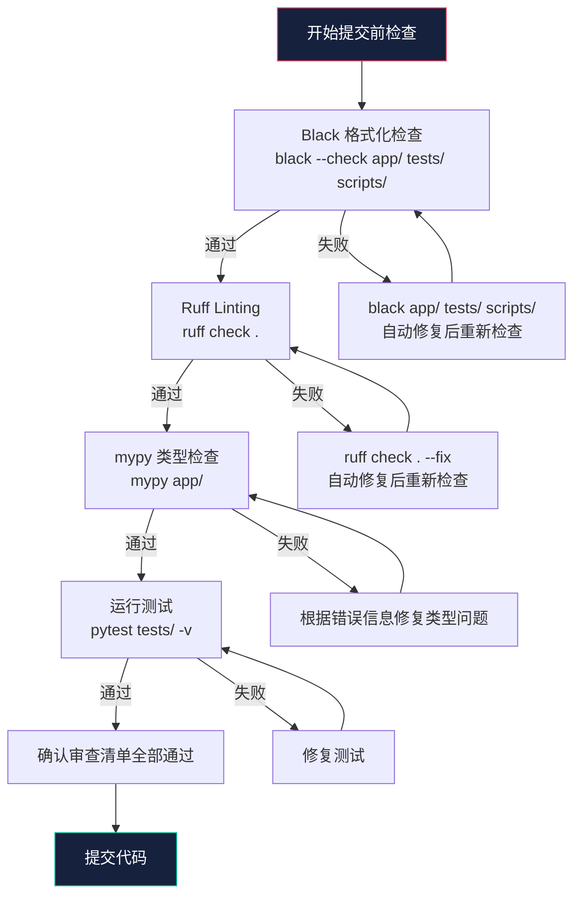

代码质量保障是 Datalogue API 工程的基石。本项目采用三件套工具链——**Black**（格式化）、**Ruff**（Linting）和 **mypy**（类型检查）——构建了一道从语法风格到类型安全的递进式防线。三者各司其职又协同互补：Black 消灭格式争议，Ruff 在毫秒级内发现潜在缺陷，mypy 则在类型层面拦截逻辑错误。本文将逐一拆解每件工具的配置原理、运行机制和审查要点，帮助初阶开发者建立"提交前自检"的肌肉记忆。

Sources: [pyproject.toml](pyproject.toml#L55-L62)

## 工具链全景：三层防线模型

三件工具的职责边界清晰，但实际运作中相互覆盖又互相让渡。下图展示了它们在工作流中的位置关系：


三者的分工可以归纳为一个递进关系：

| 层次 | 工具 | 关注点 | 典型问题 |
|------|------|--------|----------|
| **格式层** | Black | 代码外观一致性 | 缩进、引号、换行、尾随逗号 |
| **语义层** | Ruff | 潜在缺陷与风格违规 | 未使用变量、死代码、导入顺序混乱 |
| **类型层** | mypy | 类型安全与接口契约 | 类型不匹配、可选值空指针、返回值缺失 |

Black 负责"代码长什么样"，Ruff 负责"代码有没有明显问题"，mypy 负责"类型对不对"。Black 和 Ruff 都配置了统一的 `line-length = 100`，确保格式化结果与 Linting 规则不冲突——特别是 Ruff 的 `ignore = ["E501"]` 明确将行长度检查让渡给 Black 处理，避免两套规则打架。

Sources: [pyproject.toml](pyproject.toml#L55-L62) | [docs/CODE_STYLE.md](docs/CODE_STYLE.md#L599-L613)

## Black：不可协商的代码格式化引擎

Black 的核心理念是"任何关于格式的讨论都是浪费时间"。它采用了一套几乎不可配置的确定性算法——给定同一份输入，任何人在任何机器上运行 Black 都会得到完全相同的输出。项目配置极其精简：

```toml
[tool.black]
line-length = 100
target-version = ["py311"]
```

两项配置的含义分别是：每行最多 100 个字符（比 Black 默认的 88 更宽松，适合项目中较长的类型注解和函数签名），目标 Python 版本为 3.11（Black 会据此决定可以使用哪些语法特性，例如 `X | None` 联合类型语法）。

在实际代码中，Black 强制执行以下规则：

**缩进与空格**：统一使用 4 空格缩进，禁止 Tab 字符。从 `app/graph/state.py` 可以看到，嵌套的 `TypedDict` 字段定义保持了严格的 4 空格缩进层级，每层嵌套都精确对齐。

**引号规范**：优先使用双引号 `""`。当字符串内部包含双引号时，Black 自动切换为单引号，无需人工干预。

**导入排序**：Black 不处理导入排序（这项任务交给 Ruff 的 `isort` 规则），但会格式化导入语句的换行方式。当一行导入超过 100 字符时，自动拆分为多行。

**尾随逗号**：多行结构自动添加尾随逗号，使后续 diff 更干净。观察 `app/graph/state.py` 中的 `AgentState` 定义——每个 `TypedDict` 字段之间没有尾随逗号（因为每行都是独立字段），但如果在函数调用中参数跨越多行，Black 会自动添加。

**运行命令**：
```bash
# 格式化整个项目
black app/ tests/ scripts/

# 仅检查不修改（CI 中常用）
black --check app/ tests/ scripts/
```

Sources: [pyproject.toml](pyproject.toml#L57-L59) | [app/graph/state.py](app/graph/state.py#L1-L118) | [app/main.py](app/main.py#L1-L60)

## Ruff：超高速 Linter 与导入排序器

Ruff 是用 Rust 编写的 Python Linter，速度比传统工具（Flake8、isort、pyupgrade）快 10-100 倍。本项目通过 Ruff 一次性替代了 Flake8、isort、pyupgrade 等多个工具，大幅简化了工具链。

### 配置解析

```toml
[tool.ruff]
line-length = 100
target-version = "py311"
select = ["E", "F", "I", "N", "W", "UP"]
ignore = ["E501"]
```

`select` 字段显式启用了六组规则，每一组都有明确的语义：

| 规则代码 | 规则名称 | 检查内容 | 典型违规示例 |
|----------|----------|----------|-------------|
| **E** | pycodestyle Error | 严重风格错误（除 E501 外） | 缩进混用、多余空行、运算符周围空格缺失 |
| **F** | Pyflakes | 逻辑错误与死代码 | 未使用的导入、未定义的变量、重复参数 |
| **I** | isort | 导入排序与分组 | 标准库/第三方/本地导入未分组且顺序混乱 |
| **N** | pep8-naming | 命名规范 | 类名未用 PascalCase、函数名未用 snake_case |
| **W** | pycodestyle Warning | 风格警告 | 空白行含空格、行尾空格 |
| **UP** | pyupgrade | 语法现代化 | 使用 `Optional[X]` 而非 `X \| None`、使用旧式 `typing` 泛型 |

`ignore = ["E501"]` 是关键设计决策——E501 是"行过长"规则，但项目已委托 Black 处理行长度，Ruff 不再重复检查，避免两套格式化引擎产生分歧。

### 导入排序规则（I 规则）

Ruff 的 I 规则强制按以下顺序排列导入，各组之间用空行分隔：

1. 标准库（如 `import logging`、`from contextlib import asynccontextmanager`）
2. 第三方库（如 `from fastapi import FastAPI`、`from sqlalchemy import Column`）
3. 本地导入（如 `from app.core.config import get_settings`）

以 `app/main.py` 为例，可以清晰看到这个三层结构：

```python
# 第一组：标准库
from contextlib import asynccontextmanager

# 第二组：第三方库
from fastapi import FastAPI
from fastapi.middleware.cors import CORSMiddleware

# 第三组：本地导入
from app.core.database import engine, Base
from app.core.config import get_settings
```

Ruff 的 `--fix` 模式可以自动修正导入顺序，开发者无需手动排列。

### 运行命令

```bash
# 检查所有问题
ruff check .

# 自动修复可修复的问题（含导入排序）
ruff check . --fix

# 同时使用 Ruff 的格式化功能（替代 Black 的实验性功能）
ruff format .
```

Sources: [pyproject.toml](pyproject.toml#L61-L63) | [docs/CODE_STYLE.md](docs/CODE_STYLE.md#L599-L613) | [app/main.py](app/main.py#L13-L20) | [docs/CHECKLIST.md](docs/CHECKLIST.md#L1-L101)

## mypy：静态类型检查守护者

mypy 是 Python 生态中事实上的静态类型检查标准。在 Datalogue API 这样以数据管道和 AI 工作流为核心的项目中，类型错误往往在运行时才暴露——可能是某个节点传递了 `None` 而下游期望 `str`，可能是返回类型与声明的 `TypedDict` 不一致。mypy 在代码运行前就拦截这类问题。

### 配置解析

```toml
[tool.mypy]
python_version = "3.11"
warn_return_any = true
warn_unused_configs = true
check_untyped_defs = true
strict_optional = true
warn_redundant_casts = true
warn_unused_ignores = true
no_implicit_optional = true
```

每项配置的含义与典型场景：

| 配置项 | 含义 | 典型拦截场景 |
|--------|------|-------------|
| `python_version = "3.11"` | 按 Python 3.11 语法规则检查 | 允许 `X \| None` 语法，不允许 3.12+ 特性 |
| `warn_return_any = true` | 返回值包含 `Any` 时警告 | 函数声明返回 `str` 但实际推导出 `Any` |
| `warn_unused_configs = true` | 检测无效的 mypy 配置项 | 配置文件中存在拼写错误的选项名 |
| `check_untyped_defs = true` | 即使函数无类型注解也检查内部 | 未标注类型的函数内部调用了类型不匹配的操作 |
| `strict_optional = true` | 严格区分 `T` 和 `T \| None` | 对 `Optional[str]` 调用 `.lower()` 未判空 |
| `warn_redundant_casts = true` | 检测不必要的类型转换 | `int(x)` 当 `x` 已经是 `int` 时 |
| `warn_unused_ignores = true` | 检测不再需要的 `# type: ignore` | 代码已修复但注释残留 |
| `no_implicit_optional = true` | 禁止隐式 Optional | 参数 `x: str = None` 必须写为 `x: str \| None = None` |

### 项目中的类型注解实践

从 `app/graph/state.py` 可以观察到整个项目最核心的类型定义——`AgentState` TypedDict。它规范了工作流各节点之间传递的所有字段类型：

```python
class AgentState(TypedDict):
    question: str                                    # 必选，无默认值
    original_question: Optional[str]                 # 可选字符串
    dataset_id: Optional[int]                        # 可选整数
    intent: Optional[str]                            # 可选枚举值
    dsl_valid: bool                                  # 必选布尔
    retry_count: int                                 # 必选整数
    sql_list: List[str]                              # 必选字符串列表
    # ... 共 50+ 字段，全部有明确类型
```

从 `app/core/security.py` 可以观察纯函数的类型标注模式：

```python
def encrypt_password(plain: str) -> str:
    """加密明文密码，使用 AES-GCM 加密。"""
    ...

def decrypt_password(cipher_b64: str) -> str:
    """解密密文，返回明文。"""
    ...
```

每个公开函数都有完整的参数类型和返回类型标注，内部辅助函数 `_derive_key` 也遵循同样规范——前缀下划线表示私有，但类型标注不省略。

### 运行命令

```bash
# 检查 app 目录下所有源码
mypy app/

# 更严格的检查（逐步启用更多规则）
mypy --strict app/
```

Sources: [pyproject.toml](pyproject.toml#L68-L77) | [app/graph/state.py](app/graph/state.py#L18-L118) | [app/core/security.py](app/core/security.py#L30-L44) | [docs/CODE_STYLE.md](docs/CODE_STYLE.md#L538-L586)

## 完整配置总览

`pyproject.toml` 中集中了全部工具配置，这是 Python 生态的现代最佳实践——告别散落的 `.flake8`、`.isort.cfg`、`mypy.ini` 等文件：

```toml
[tool.black]
line-length = 100
target-version = ["py311"]

[tool.ruff]
line-length = 100
target-version = "py311"
select = ["E", "F", "I", "N", "W", "UP"]
ignore = ["E501"]

[tool.mypy]
python_version = "3.11"
warn_return_any = true
warn_unused_configs = true
check_untyped_defs = true
strict_optional = true
warn_redundant_casts = true
warn_unused_ignores = true
no_implicit_optional = true
```

所有工具的依赖都定义在 `[project.optional-dependencies]` 的 `dev` 组中，版本精确锁定：

```toml
[project.optional-dependencies]
dev = [
    "black==24.4.2",
    "ruff==0.4.8",
    "mypy==1.10.0",
]
```

安装命令：`pip install -e ".[dev]"`，即可一次性获取全部开发工具。

Sources: [pyproject.toml](pyproject.toml#L33-L39) | [pyproject.toml](pyproject.toml#L57-L77)

## 提交前自检流程

下面是每次提交代码前必须执行的标准化流程，以 Mermaid 流程图呈现：



一行命令快速验证所有三项：

```bash
black --check app/ tests/ scripts/ && ruff check . && mypy app/ && pytest tests/ -v
```

Sources: [docs/CHECKLIST.md](docs/CHECKLIST.md#L1-L101) | [docs/CODE_STYLE.md](docs/CODE_STYLE.md#L1-L63)

## 审查清单详解

### 格式与风格（对应 Black + Ruff E/W 规则）

- [ ] **Black 格式化通过**：运行 `black --check app/ tests/` 零差异输出
- [ ] **无行尾空格**：Ruff W 规则自动检测，`ruff check . --fix` 自动清理
- [ ] **文件末尾保留一个空行**：Black 强制执行，多一个或少一个都会被修正
- [ ] **导入顺序正确**：标准库 → 第三方 → 本地，Ruff I 规则自动排序

### 命名规范（对应 Ruff N 规则）

- [ ] **类名 PascalCase**：如 `AgentState`、`TimestampMixin`、`Settings`
- [ ] **函数/方法名 snake_case**：如 `encrypt_password`、`get_settings`、`chat_stream`
- [ ] **常量 UPPER_SNAKE_CASE**：如 `AES_KEY_BYTES`、`SYSTEM_SCHEMAS`
- [ ] **私有成员前缀单下划线**：如 `_derive_key`、`_settings`

从实际代码中可以验证这些规范：`app/models/base.py` 中的 `TimestampMixin` 类名使用 PascalCase，`app/core/config.py` 中的 `get_settings` 函数使用 snake_case，`app/core/security.py` 中的 `AES_KEY_BYTES` 常量使用大写加下划线。

### 类型注解（对应 mypy 检查）

- [ ] **公共函数/方法有完整类型注解**：参数类型和返回类型不缺省
- [ ] **可选参数正确标注**：使用 `X | None`（Python 3.11 现代语法），而非 `Optional[X]`
- [ ] **避免不必要的 `Any` 类型**：仅在确实无法确定类型时使用
- [ ] **mypy 检查通过**：`mypy app/` 零错误输出

代码库中大量使用 `Optional[str]`（如 `app/graph/state.py` 中的字段定义），这是因为这些代码早于 Ruff UP 规则全面启用。新代码应改为 `str | None` 形式，Ruff 的 UP 规则会自动建议这种现代化改造。

### 注释规范

- [ ] **文件头有结构化的用途说明块**：项目统一使用以下模板——

```python
# ============================================================
# File Name   : <文件名>
# Description:
#   <一句话概述>
#
# Responsibilities:
#   - <职责点 1>
#   - <职责点 2>
#
# Author      : yangkai
# Created On  : YYYY-MM-DD
# ============================================================
```

每个源码文件（`app/` 和 `tests/` 下）都遵循此模板，这是团队的硬性约定。例如 `app/main.py`、`app/core/config.py`、`tests/test_security.py` 等都严格一致。

- [ ] **模块级 docstring**：紧跟文件头，用三引号 `"""..."""` 说明模块用途
- [ ] **函数/方法有 docstring**：说明参数、返回值、副作用
- [ ] **复杂逻辑有解释性注释**：用 `# ` 说明"为什么"而非"是什么"

### 安全（对应 Ruff S 规则，补充检查）

- [ ] **无硬编码敏感信息**：所有密钥、密码通过环境变量或 `.env` 注入（`app/core/config.py` 中 `Settings` 类全部从环境变量读取）
- [ ] **用户输入有 Pydantic 验证**：所有 API 输入通过 `schemas/` 下的 Pydantic 模型校验
- [ ] **SQL 使用 ORM 参数化查询**：避免字符串拼接 SQL
- [ ] **敏感字段加密存储**：如密码使用 AES-GCM 加密（`app/core/security.py` 中实现）

### 测试（对应 pytest）

- [ ] **新功能有对应测试**：测试文件命名 `test_<模块名>.py`
- [ ] **测试函数命名**：`test_<行为描述>` 或类方法形式 `TestXxx.test_xxx`
- [ ] **测试可独立通过**：`pytest tests/ -v` 无失败用例

Sources: [docs/CHECKLIST.md](docs/CHECKLIST.md#L1-L101) | [docs/CODE_STYLE.md](docs/CODE_STYLE.md#L1-L200) | [app/core/security.py](app/core/security.py#L1-L44) | [app/graph/state.py](app/graph/state.py#L1-L118) | [tests/test_security.py](tests/test_security.py#L1-L57)

## pre-commit 自动化（可选）

对于希望自动化检查的开发者，可以创建 `.git/hooks/pre-commit` 脚本：

```bash
#!/bin/bash
echo "运行格式化检查..."
black --check app/ tests/ scripts/ || exit 1
ruff check . --fix || exit 1
echo "格式检查通过"
```

执行 `chmod +x .git/hooks/pre-commit` 使其生效。此后每次 `git commit` 都会自动运行检查，不通过则阻止提交。需要注意这个钩子不会自动运行 `mypy`（类型检查较慢，放在 pre-commit 中会显著拖慢提交流程），mypy 建议在 CI 流水线或手动运行。

对于使用 pre-commit 框架的团队，也可以创建 `.pre-commit-config.yaml` 来统一管理，但当前项目选择保持工具链最简。

Sources: [docs/CODE_STYLE.md](docs/CODE_STYLE.md#L621-L628)

## 阅读进展建议

本文是 Datalogue API 知识库的最后一站。在掌握了代码质量保障体系后，建议回过头巩固以下关键主题：

- 了解数据库 schema 变更的版本化管理，参考 [数据库迁移管理：Alembic 版本化与模型变更流程](28-shu-ju-ku-qian-yi-guan-li-alembic-ban-ben-hua-yu-mo-xing-bian-geng-liu-cheng)
- 深入测试实践的细节，参考 [测试体系：pytest Fixture、SQLite 隔离与会话级回滚](30-ce-shi-ti-xi-pytest-fixture-sqlite-ge-chi-yu-hui-hua-ji-hui-gun)
- 回顾本地开发环境的完整搭建，参考 [Docker Compose 本地开发环境：PostgreSQL + Langfuse 全家桶](29-docker-compose-ben-di-kai-fa-huan-jing-postgresql-langfuse-quan-jia-tong)
- 回到起点纵览全局，参考 [概述：AI 原生智能问数平台](1-gai-shu-ai-yuan-sheng-zhi-neng-wen-shu-ping-tai)