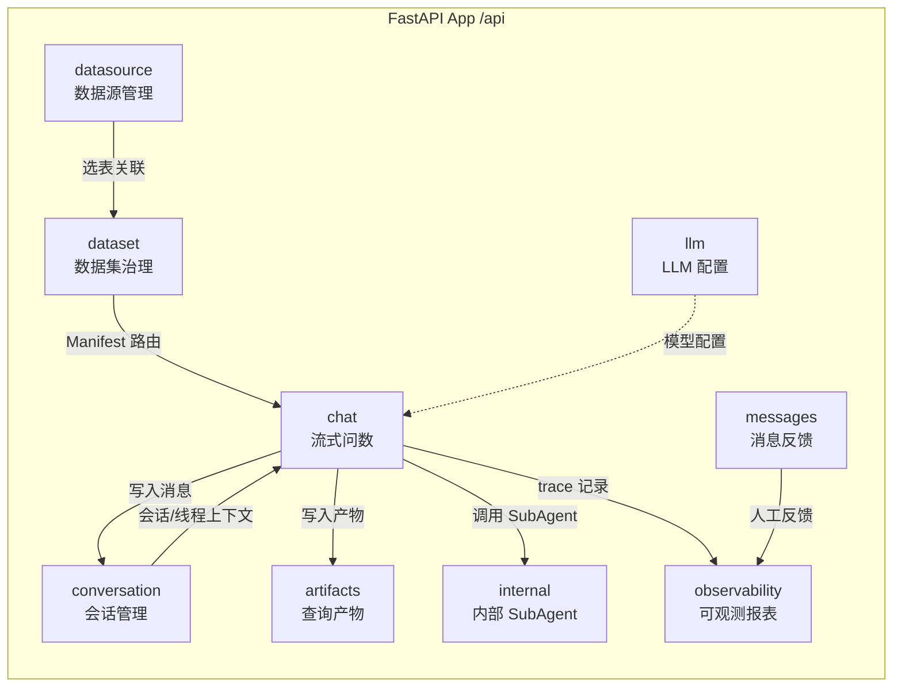

Datalogue API 采用 FastAPI 框架构建，九大路由模块统一聚合于 `app/api/__init__.py`，挂载在 `/api` 前缀下，覆盖从数据源连接到流式问数的完整链路。本文档以面向中级开发者的视角，沿 **控制面 → 数据面 → 问数流 → 可观测** 四个层次拆解路由结构、关键端点与跨模块调用关系。

Sources: [main.py](app/main.py#L52-L54), [api/__init__.py](app/api/__init__.py#L16-L27)

## 整体架构

下图展示九个路由模块的聚合关系及其在数据流中的定位——上半部分为配置与治理（控制面），下半部分为运行时问数（数据面）：



路由按职责可分为四层：

| 层次 | 模块 | 核心职责 |
|------|------|---------|
| **控制面 — 基础设施** | `datasource`、`llm` | 数据源连接注册、LLM 模型配置与角色绑定 |
| **控制面 — 语义治理** | `dataset` | 指标/维度/术语/蓝图/Manifest 全生命周期管理 |
| **数据面 — 会话** | `conversation`、`messages` | 会话 CRUD、消息持久化、人工反馈提交 |
| **数据面 — 运行时** | `chat`、`internal`、`artifacts`、`observability` | SSE 流式问数、SubAgent A2A 调用、产物读取、可观测报表 |

Sources: [api/__init__.py](app/api/__init__.py#L16-L27), [main.py](app/main.py#L52-L54)

---

## 一、数据源路由 (`/api/datasource`)

数据源路由承担物理数据库连接的注册、测试与元数据探查职责。九个端点形成 **CRUD → 连接验证 → Schema 同步 → 数据预览** 的完整链条。

### 端点清单

| 方法 | 路径 | 说明 |
|------|------|------|
| `GET` | `/api/datasource` | 获取所有数据源列表 |
| `POST` | `/api/datasource` | 创建数据源，密码自动加密 |
| `GET` | `/api/datasource/capabilities` | 系统注册的数据源类型能力清单 |
| `GET` | `/api/datasource/{ds_id}` | 获取单个数据源详情 |
| `PUT` | `/api/datasource/{ds_id}` | 更新数据源配置 |
| `DELETE` | `/api/datasource/{ds_id}` | 删除数据源 |
| `POST` | `/api/datasource/{ds_id}/test` | 测试连接，返回版本与连通性 |
| `GET` | `/api/datasource/{ds_id}/schemas` | 数据源内所有 Schema（MySQL 中为 database） |
| `GET` | `/api/datasource/{ds_id}/schema` | 指定 Schema 的表/字段/主键/外键（通过 SQLAlchemy inspect） |
| `POST` | `/api/datasource/{ds_id}/sync-tables` | 同步物理表结构到 `source_table` / `source_column` |
| `GET` | `/api/datasource/{ds_id}/source-tables` | 已同步的 source_table 列表 |
| `GET` | `/api/datasource/source-table/{table_id}/columns` | 单表全部字段（含 LLM 标注） |
| `PUT` | `/api/datasource/source-column/{column_id}` | 更新字段用户标注 |
| `POST` | `/api/datasource/source-table/{table_id}/annotate` | 手动触发单表 AI 标注 |
| `POST` | `/api/datasource/{ds_id}/preview` | 实时查询某表前 N 条数据 |

### 关键设计决策

**密码加密存储**：创建和更新数据源时，明文密码经 `encrypt_password()` 加密后存入 `password_enc` 字段，响应永不包含明文密码。密码为空时的更新不覆盖原密码。

Sources: [datasource.py](app/api/datasource.py#L53-L68), [datasource.py](app/api/datasource.py#L73-L110)

**Schema 同步的增量合并策略**：`sync-tables` 端点执行幂等同步——新表插入、已有表更新元数据、新字段插入、已删除字段清理。已有字段的 `user_description`、`ai_description` 等标注字段被保留，仅更新 DDL 元数据。当 `column_comment` 变更且当前生效值来自 DB 注释时，标记 `desc_source = "stale"` 以待重新标注。

Sources: [datasource.py](app/api/datasource.py#L240-L290)

**连接测试的副作用**：`test` 端点不仅返回连通性结果，还将结果写入数据源记录的 `last_test_result`、`last_error_code`、`status` 字段，驱动前端状态展示。

Sources: [datasource.py](app/api/datasource.py#L120-L139)

---

## 二、数据集路由 (`/api/dataset`)

数据集路由是整个 API 中端点数量最多的模块（超过 40 个），因为它承载了语义层的完整治理能力。按子资源分组如下：

### 2.1 数据集 CRUD

| 方法 | 路径 | 说明 |
|------|------|------|
| `GET` | `/api/dataset` | 数据集列表，支持 `datasource_id` 过滤 |
| `POST` | `/api/dataset` | 创建数据集，自动规范化 `query_constraints` |
| `GET` | `/api/dataset/{ds_id}` | 数据集详情 |
| `PUT` | `/api/dataset/{ds_id}` | 部分更新（重命名、描述、状态等），变更后标记 Manifest 需复核 |
| `DELETE` | `/api/dataset/{ds_id}` | 级联删除指标、维度、选表关联 |

数据集更新时若涉及 `name`、`tables_json` 或 `query_constraints`，自动调用 `mark_current_manifest_needs_review()` 将当前 Manifest 标记为待复核状态，确保语义变更能被治理流程感知。

Sources: [dataset.py](app/api/dataset.py#L86-L155), [dataset.py](app/api/dataset.py#L69-L75)

### 2.2 指标与维度 (Metrics & Dimensions)

| 方法 | 路径 | 说明 |
|------|------|------|
| `POST` | `/api/dataset/{ds_id}/metric` | 添加指标 |
| `PUT` | `/api/dataset/{ds_id}/metric/{mid}` | 更新指标 |
| `GET` | `/api/dataset/{ds_id}/metrics` | 指标列表 |
| `DELETE` | `/api/dataset/{ds_id}/metric/{mid}` | 删除指标 |
| `POST` | `/api/dataset/{ds_id}/dimension` | 添加维度 |
| `PUT` | `/api/dataset/{ds_id}/dimension/{did}` | 更新维度 |
| `GET` | `/api/dataset/{ds_id}/dimensions` | 维度列表 |
| `DELETE` | `/api/dataset/{ds_id}/dimension/{did}` | 删除维度 |

指标和维度的每次变更都会触发 `_mark_manifest_stale_after_schema_change()`，因为语义资产变更直接影响 SubAgent Manifest 的路由准确性。

Sources: [dataset.py](app/api/dataset.py#L164-L286)

### 2.3 字段审核与转换 (Column Review & Conversion)

| 方法 | 路径 | 说明 |
|------|------|------|
| `POST` | `/api/dataset/{ds_id}/columns/{column_id}/convert-metric` | 将度量候选字段转换为语义指标 |
| `POST` | `/api/dataset/{ds_id}/columns/{column_id}/convert-dimension` | 将维度候选字段转换为语义维度 |
| `PATCH` | `/api/dataset/{ds_id}/columns/{column_id}/review-status` | 更新字段审核状态 |

字段转换实现了 **AI 标注 → 人工审核 → 语义资产** 的治理闭环：`convert-metric` 端点读取 AI 推荐的聚合函数 (`ai_suggested_agg`)，并用 `NONE → SUM` 的降级策略生成默认表达式。若同名或同表同表达式的指标已存在则复用，避免重复创建。

Sources: [dataset.py](app/api/dataset.py#L381-L448)

### 2.4 业务术语 (Business Terms)

| 方法 | 路径 | 说明 |
|------|------|------|
| `GET` | `/api/dataset/{ds_id}/terms` | 术语列表，支持关键词和类型过滤 |
| `POST` | `/api/dataset/{ds_id}/terms` | 创建术语，自动冲突检测 |
| `GET` | `/api/dataset/{ds_id}/terms/{term_id}` | 术语详情 |
| `PUT` | `/api/dataset/{ds_id}/terms/{term_id}` | 更新术语，记录变更历史 |
| `DELETE` | `/api/dataset/{ds_id}/terms/{term_id}` | 删除术语 |
| `POST` | `/api/dataset/{ds_id}/terms/{term_id}/link-assets` | 关联语义资产（指标/维度/字段/蓝图） |
| `GET` | `/api/dataset/{ds_id}/terms/{term_id}/usage` | 术语使用情况统计 |
| `POST` | `/api/dataset/{ds_id}/terms/discover` | AI 自动发现候选术语 |
| `POST` | `/api/dataset/{ds_id}/terms/conflicts/check` | 检查术语命名冲突 |

术语系统支持六种类型（`metric_concept`、`dimension_enum`、`business_object`、`business_process`、`status_enum`、`org_scope`）和四种资产关联（`metric`、`dimension`、`column`、`blueprint`）。创建和更新时自动检测别名重复冲突，`discover` 端点通过 LLM 从已选表字段中自动提取候选术语并去重。

Sources: [dataset.py](app/api/dataset.py#L674-L920)

### 2.5 SubAgent Manifest 治理

| 方法 | 路径 | 说明 |
|------|------|------|
| `GET` | `/api/dataset/subagent-manifests/current` | 所有 current Manifest 摘要（供 LeadAgent 路由） |
| `GET` | `/api/dataset/{ds_id}/subagent-manifest` | Manifest 治理详情 |
| `PUT` | `/api/dataset/{ds_id}/subagent-manifest` | 保存人工维护字段草稿 |
| `POST` | `/api/dataset/{ds_id}/subagent-manifest/publish` | 发布 Manifest，校验失败返回结构化 lint |
| `POST` | `/api/dataset/{ds_id}/subagent-manifest/{version}/rollback` | 历史版本回滚为 new current |
| `POST` | `/api/dataset/{ds_id}/subagent-manifest/route-check` | 验证问题是否应路由到该数据集 |

Manifest 是连接数据集语义定义与 LeadAgent 路由决策的关键桥梁。`publish` 端点在发布前进行校验，失败时以 `ManifestValidationError` 抛出结构化 lint 问题列表。`route-check` 允许在发布前用样本问题验证路由准确性。

Sources: [dataset.py](app/api/dataset.py#L78-L1098)

### 2.6 分析蓝图 (Analysis Blueprints)

| 方法 | 路径 | 说明 |
|------|------|------|
| `GET` | `/api/dataset/{ds_id}/blueprints` | 蓝图列表，支持 status 过滤 |
| `POST` | `/api/dataset/{ds_id}/blueprints` | 手动创建蓝图 |
| `GET` | `/api/dataset/{ds_id}/blueprints/{bid}` | 蓝图详情 |
| `PUT` | `/api/dataset/{ds_id}/blueprints/{bid}` | 更新蓝图，自动版本归档 |
| `PATCH` | `/api/dataset/{ds_id}/blueprints/{bid}/status` | 更新状态（draft/reviewing/active/deprecated） |
| `POST` | `/api/dataset/{ds_id}/blueprints/{bid}/test` | 测试执行蓝图 |
| `POST` | `/api/dataset/{ds_id}/blueprints/analyze-sql` | AI 分析 SQL 生成蓝图 |
| `POST` | `/api/dataset/{ds_id}/blueprints/analyze-description` | AI 分析描述生成蓝图 |
| `GET` | `/api/dataset/{ds_id}/blueprints/{bid}/versions` | 蓝图版本历史 |
| `POST` | `/api/dataset/{ds_id}/blueprints/{bid}/rollback` | 版本回滚 |
| `GET` | `/api/dataset/{ds_id}/blueprints/{bid}/usage-stats` | 使用统计 |
| `GET` | `/api/dataset/{ds_id}/blueprints/{bid}/usage-logs` | 使用日志 |

蓝图 AI 分析采用后台执行模式——`analyze-sql` 和 `analyze-description` 端点返回 `task_id`，前端可轮询 `GET /{ds_id}/blueprints/analyze-task/{task_id}` 获取结果。分析过程中记录分阶段耗时（preprocess、prompt、llm_invoke、parse_json 等），便于性能诊断。

Sources: [dataset.py](app/api/dataset.py#L1394-L1660), [dataset.py](app/api/dataset.py#L1170-L1270)

### 2.7 选表与导入导出

| 方法 | 路径 | 说明 |
|------|------|------|
| `POST` | `/api/dataset/{ds_id}/select-tables` | 为数据集选择物理表 |
| `DELETE` | `/api/dataset/{ds_id}/select-tables/{source_table_id}` | 取消选表 |
| `GET` | `/api/dataset/{ds_id}/selected-tables` | 已选表列表 |
| `GET` | `/api/dataset/{ds_id}/selected-columns` | 已选表的全部字段 |
| `POST` | `/api/dataset/{ds_id}/annotate-columns` | 批量触发 AI 字段标注 |
| `POST` | `/api/dataset/{ds_id}/import-yaml` | YAML 导入数据集定义 |
| `GET` | `/api/dataset/{ds_id}/export-yaml` | YAML 导出数据集定义 |

YAML 导入导出支持数据集的完整可移植定义，便于跨环境迁移和版本控制。

Sources: [dataset.py](app/api/dataset.py#L1684-L2046)

---

## 三、会话路由 (`/api/conversation`)

会话路由管理 assistant-ui 线程的持久化状态，端点设计简洁直接：

| 方法 | 路径 | 说明 |
|------|------|------|
| `GET` | `/api/conversation` | 会话列表，`archived` 参数控制归档/常规视图 |
| `POST` | `/api/conversation` | 创建空会话，自动生成 `thread_id` |
| `GET` | `/api/conversation/{conv_id}` | 会话详情（含完整消息历史） |
| `PATCH` | `/api/conversation/{conv_id}` | 重命名会话 |
| `POST` | `/api/conversation/{conv_id}/archive` | 归档会话 |
| `POST` | `/api/conversation/{conv_id}/unarchive` | 取消归档 |
| `DELETE` | `/api/conversation/{conv_id}` | 删除会话及关联消息 |

**可观测链接动态注入**：`get_conversation` 端点返回消息历史时，通过 `_with_observability_links()` 函数从 `response_metadata` 中读取 `langfuse.trace_id`，动态拼接 Langfuse trace 深链。该链接不回写数据库，仅在前端展示时补齐。

Sources: [conversation.py](app/api/conversation.py#L24-L66), [conversation.py](app/api/conversation.py#L99-L117)

---

## 四、问数路由 (`/api/chat`)

这是整个系统的核心运行时端点，承载 SS E 流式问数的完整链路。

### 核心端点

| 方法 | 路径 | 说明 |
|------|------|------|
| `POST` | `/api/chat/stream` | **流式问数**，返回 SSE 事件流 |
| `POST` | `/api/chat/feedback` | 人工反馈（approve/reject/modify） |

### ChatRequest Schema

```
question: str                        # 用户自然语言问题
session_id: Optional[str]            # 前端 session 标识
conversation_id: Optional[int]       # 持久化会话 ID
dataset_id: Optional[int]            # 手动指定数据集（不指定则自动路由）
clarification_response: Optional     # 术语消歧响应
```

Sources: [chat.py](app/schemas/chat.py#L24-L31)

### SSE 事件流结构

`chat_stream` 端点通过 `EventSourceResponse` 返回 SSE 事件流，内部调用 `_stream_chat()` 异步生成器。事件流按执行阶段依次发送以下类型事件：

| SSE 事件类型 | 触发节点 | 负载内容 |
|-------------|---------|---------|
| `route_decision` | 入口路由 | 决策类型、数据集、得分、候选列表 |
| `step_start` | 各节点开始 | 节点名、业务阶段 |
| `step_progress` | 节点执行中 | 进度信息 |
| `step_end` | 各节点结束 | 节点名、状态、耗时 |
| `clarification_needed` | 术语冲突 | 候选术语、过期时间 |
| `schema_context` | schema_recall | Schema 上下文 |
| `dsl` | dsl_generate | 生成的 DSL |
| `sql` | dsl_compiler / sql_execute | 编译后的 SQL |
| `sql_result` | sql_execute | 查询结果摘要 |
| `sql_diagnosis` | sql_audit | SQL 诊断信息 |
| `answer` | report_generator | 自然语言回答 |
| `answer_explanation` | 报告生成 | 回答的可解释性信息 |
| `query_profile` | 工作流结束 | 口径卡片与执行摘要 |
| `explainability` | 工作流结束 | 统一可解释性结构 |
| `lead_agent_tools` | LeadAgent | 工具编排详情 |
| `error` | 异常 | 错误信息 |
| `done` | 工作流结束 | 最终状态与 token 用量 |

Sources: [chat.py](app/api/chat.py#L3043-L3049), [chat.py](app/api/chat.py#L1147-L1859)

### 业务流程阶段映射

内部节点被归并为六个业务阶段 `_BUSINESS_STAGE_META`，驱动前端右侧面板展示：

| 阶段 Key | 展示名称 | 包含节点 |
|----------|---------|---------|
| `understand` | 理解问题与上下文 | `merge_prior_context`, `clarification_resolution`, `intent_recognition`, `entry_intent_classification` |
| `route` | 选择数据集与分析路径 | `analysis_blueprint_execute` |
| `semantic` | 确认业务口径 | `schema_recall`, `term_conflict_resolve`, `metric_resolve` |
| `plan_query` | 生成查询计划 | `dsl_generate`, `dsl_validate`, `dsl_compiler` |
| `execute_query` | 执行查询与诊断 | `sql_execute`, `sql_audit` |
| `narrate` | 生成业务回答 | `report_generator`, `lead_agent_report_generator` |

Sources: [chat.py](app/api/chat.py#L590-L623), [chat.py](app/api/chat.py#L659-L686)

### QueryProfile 结构

每个成功完成的问数轮次，最终事件会包含 `query_profile`——一个稳定结构化的口径卡片，供前端渲染和审计使用。其顶层分组为：

- **question**：原始问题与消歧后问题
- **route**：执行路径、数据集、Manifest 版本、蓝图命中
- **query_context**：时间上下文、查询约束、多轮继承信息
- **semantic**：术语规范化、语义资产解析、指标消歧
- **sql**：SQL 文本与语句列表、行数、列、耗时、诊断信息
- **execution_summary**：总耗时、业务阶段、报告归属

Sources: [chat.py](app/api/chat.py#L689-L790)

---

## 五、LLM 配置路由 (`/api/llm`)

独立管理 LLM 模型配置与任务角色绑定，实现模型与业务逻辑的解耦：

| 方法 | 路径 | 说明 |
|------|------|------|
| `GET` | `/api/llm/roles` | 系统支持的任务角色列表 |
| `GET` | `/api/llm/models` | 模型配置列表（不含明文 API Key） |
| `POST` | `/api/llm/models` | 创建模型配置，API Key 加密存储 |
| `GET` | `/api/llm/models/{config_id}` | 单模型详情 |
| `PUT` | `/api/llm/models/{config_id}` | 更新配置 |
| `DELETE` | `/api/llm/models/{config_id}` | 删除配置，清空关联角色绑定 |
| `POST` | `/api/llm/models/{config_id}/test` | 发送 "OK" 测试消息，记录延迟和结果 |
| `GET` | `/api/llm/role-bindings` | 角色绑定列表 |
| `PUT` | `/api/llm/role-bindings` | 保存绑定（禁止绑定停用模型） |

角色绑定更新时进行主动校验——若目标模型 `status != "active"` 则返回 400，防止问数链路因模型不可用而中断。

Sources: [llm.py](app/api/llm.py#L47-L200)

---

## 六、消息反馈路由 (`/api/messages`)

| 方法 | 路径 | 说明 |
|------|------|------|
| `POST` | `/api/messages/{message_id}/feedback` | 提交反馈，同步写入消息 metadata 和 Langfuse score |

反馈操作通过 `submit_message_feedback()` 双向写入——更新本地 `Message.response_metadata` 的同时，尽力向 Langfuse 提交 score，即使 Langfuse 不可用也不阻塞用户反馈。

Sources: [messages.py](app/api/messages.py#L21-L38)

---

## 七、可观测路由 (`/api/observability`)

提供管理端和客户报表的数据入口：

| 方法 | 路径 | 说明 |
|------|------|------|
| `GET` | `/api/observability/summary` | 本地 trace 索引摘要 |
| `GET` | `/api/observability/costs` | 成本与 token 聚合 |
| `GET` | `/api/observability/quality` | 问数质量摘要 |
| `GET` | `/api/observability/failures` | 失败类型摘要 |
| `GET` | `/api/observability/traces` | trace 列表（支持 dataset_id/status 过滤） |
| `GET` | `/api/observability/traces/{trace_id}` | 单条 trace 详情（含 Langfuse 数据 + 本地 fallback） |

所有报表端点均支持可选的 `dataset_id` 过滤，实现数据集维度的观测隔离。

Sources: [observability.py](app/api/observability.py#L30-L97)

---

## 八、内部 SubAgent 路由 (`/api/internal`)

供 `RemoteDatasetSubAgentRunner` 调用的内部 A2A 接口，通过 HMAC token 验证：

| 方法 | 路径 | 说明 |
|------|------|------|
| `POST` | `/api/internal/subagent/run` | 接收 SubAgent 请求，以 NDJSON 流返回事件 |
| `POST` | `/api/internal/artifacts/purge-expired` | 清理过期 artifact（维护接口） |

`subagent/run` 端点复用 `DatasetSubAgent` 门面，将 `SubAgentEvent` 序列化为 NDJSON 流（每行一个 JSON 对象），headers 中通过 `X-Datalogue-Internal-Token` 进行 HMAC 恒等比较认证。

Sources: [internal_subagent.py](app/api/internal_subagent.py#L38-L85)

---

## 九、查询产物路由 (`/api/artifacts`)

避免聊天 final payload 自动携带大结果集——SQL 结果、报告等大对象写入 `QueryArtifact` 表，前端按需通过 `artifact:<uuid>` 引用拉取：

| 方法 | 路径 | 说明 |
|------|------|------|
| `GET` | `/api/artifacts/{artifact_ref}` | 按引用读取 artifact 内容 |

**Fail-closed 语义**：artifact 过期（`expires_at` 早于当前 UTC 时间）或不存在时统一返回 404，不泄露任何内部状态信息。

Sources: [artifacts.py](app/api/artifacts.py#L23-L58)

---

## 端点总览表

以下汇总全部路由模块的核心端点，便于快速检索：

| 模块 | 前缀 | 端点数量 | 核心端点 |
|------|------|---------|---------|
| datasource | `/api/datasource` | 15 | CRUD, test, sync-tables, preview |
| dataset | `/api/dataset` | 40+ | CRUD, metrics, dimensions, terms, blueprints, manifest, YAML |
| conversation | `/api/conversation` | 7 | CRUD, archive/unarchive |
| chat | `/api/chat` | 2 | stream (SSE), feedback |
| llm | `/api/llm` | 9 | models CRUD, role-bindings, test |
| messages | `/api/messages` | 1 | feedback |
| observability | `/api/observability` | 6 | summary, costs, quality, failures, traces |
| internal | `/api/internal` | 2 | subagent/run, artifacts/purge-expired |
| artifacts | `/api/artifacts` | 1 | get by ref |

---

## 阅读建议

本文档提供了 API 路由的宏观视图。建议按以下路径深入理解各模块的内部机制：

- 若关注 **流式问数链路**，先阅读 [NL2DSL2SQL 处理管道：从自然语言到结构化查询的端到端链路](5-nl2dsl2sql-chu-li-guan-dao-cong-zi-ran-yu-yan-dao-jie-gou-hua-cha-xun-de-duan-dao-duan-lian-lu)，理解 chat 端点背后的完整工作流。
- 若关注 **路由决策机制**，阅读 [入口路由与意图分类：从用户问题到执行路径的一次性决策](10-ru-kou-lu-you-yu-yi-tu-fen-lei-cong-yong-hu-wen-ti-dao-zhi-xing-lu-jing-de-ci-xing-jue-ce) 和 [SubAgent 调度协议：进程内与远程 Runner 的双模执行](11-subagent-diao-du-xie-yi-jin-cheng-nei-yu-yuan-cheng-runner-de-shuang-mo-zhi-xing)。
- 若关注 **数据源连接引擎**，阅读 [多数据源连接引擎：方言适配、Schema 探查与能力注册](27-duo-shu-ju-yuan-lian-jie-yin-qing-fang-yan-gua-pei-schema-tan-cha-yu-neng-li-zhu-ce)。
- 若关注 **可观测基础设施**，阅读 [Langfuse 追踪集成：Trace、Span、Generation 与 Prompt 管理](24-langfuse-zhui-zong-ji-cheng-trace-span-generation-yu-prompt-guan-li)。