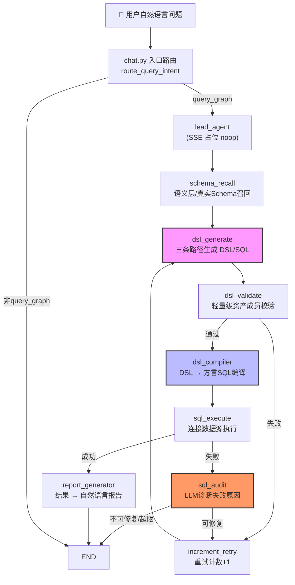

本文档深入解析 Datalogue 的核心问数管道——一条将用户自然语言问题转化为可执行 SQL 并最终生成自然语言回答的端到端处理链路。管道以 LangGraph 的 StateGraph 为骨架，串联 9 个功能节点，通过条件路由和自动修复重试实现自愈式查询执行。对于希望理解问数内部机制、调试失败链路或扩展自定义节点的开发者，本文提供了完整的架构全景图。

## 管道架构全景

管道的本质是一次"自然语言 → 中间表示 → 结构化查询 → 自然语言回答"的往返转换。与传统的 NL2SQL 直接生成 SQL 不同，Datalogue 在中间插入了 **DSL（Domain Specific Language）** 层作为语义缓冲——LLM 先生成带有资产引用的结构化 DSL JSON，再由确定性代码将 DSL 编译为方言感知的 SQL。这一设计的核心优势在于：LLM 只需理解语义层资产（指标、维度、字段），而不必处理 JOIN 语法、方言引号等机械细节，显著降低了幻觉率。



管道的 9 个注册节点按执行顺序为：`lead_agent` → `schema_recall` → `dsl_generate` → `dsl_validate` → `dsl_compiler` → `sql_execute` → `sql_audit` / `report_generator` → `increment_retry`（辅助节点）。整个 StateGraph 共享一个 TypedDict 结构的 `AgentState`，全局状态字段超过 60 个，涵盖输入层、意图识别层、Schema 召回层、DSL 层、SQL 层、输出层和控制层。

Sources: [workflow.py](app/graph/workflow#L1-L219), [state.py](app/graph/state#L1-L118)

## 入口路由：LangGraph 之前的决策层

一个关键架构事实是：**入口路由决策不在 LangGraph 内部完成**，而是在 `chat.py` 驱动工作流之前，通过 `route_query_intent` 一次性产出。这意味着 LangGraph 的 `lead_agent` 节点本质上是一个 noop 占位节点——它不做任何实际计算，仅有两个存在意义：为前端保留 SSE `lead_agent` 步骤事件（兼容前端按节点展示的 UI 约定），以及作为条件路由的入口点。

`_lead_agent_router` 读取 `state["entry_route"]` 进行分支：若为 `"interpret_result"` 或 `"analysis_blueprint"`（已由 chat 层的 `DatasetSubAgent.resolve_analysis_blueprint` 提前处理完毕），直接路由到 `END`；其余情况统一进入 `schema_recall`。Phase 3-7 的持续重构逐步将意图分类（Phase 3）、术语澄清（Phase 4）、蓝图执行（Phase 5）、术语归一化（Phase 6）和语义资产解析（Phase 7）上提到 chat 层，LangGraph 内仅保留纯数据面节点，实现了控制面与数据面的清晰分离。

Sources: [workflow.py](app/graph/workflow#L47-L60), [nodes.py](app/graph/nodes#L1340-L1348), [nodes.py](app/graph/nodes#L1327-L1338)

## Schema 召回：四代模式的上下文组装

`schema_recall_node` 是管道的第一个实质性节点，负责为后续 DSL 生成准备数据上下文。它根据 `dataset_id` 的存在与否，选择两条完全不同的上下文组装路径：

| 条件 | 上下文来源 | generation_mode | 后续 DSL 路径 |
|---|---|---|---|
| 有 `dataset_id` + 语义层存在 | `build_dataset_query_context()` 组装语义资产 | `semantic` / `inferred` | 路径 1（语义层 DSL） |
| 有 `dataset_id` + 数据集不存在 | 空上下文 | — | 报错终止 |
| 无 `dataset_id` + 已连接数据源 | `get_schema()` 拉取真实表结构 | — | 路径 2（真实 Schema SQL） |
| 无 `dataset_id` + 无数据源 | 空上下文 | — | 路径 3（无 Schema 猜测） |

当语义层路径被激活时，`build_dataset_query_context` 执行了一次精细的上下文组装：加载数据集的指标（SemanticMetric）、维度（SemanticDimension）、业务术语（BusinessTerm）、分析蓝图（AnalysisBlueprint）和所选源表字段（SourceColumn），按 token 预算（默认 4000 token）进行裁剪，优先保留与用户问题文本匹配的 pinned 资产。组装结果同时产出两部分输出——给 LLM 阅读的文本 `schema_context`，和给编译器使用的结构化对象 `schema_structured`（含 tables_json、metric_map、dim_map、field_map 等）。

Sources: [nodes.py](app/graph/nodes#L1459-L1560), [dataset_context.py](app/services/dataset_context#L578-L734), [dataset_context.py](app/services/dataset_context#L45-L56)

## DSL 生成：三条路径与模板旁路

`dsl_generate_node` 是管道中逻辑最复杂的节点，实现了四条互斥的生成路径。节点入口首先检查查询规划器（SubAgent）是否产出了 `template_sql`——若命中模板旁路，则直接跳过 LLM 调用，将模板 SQL 包装为 `{"direct_sql": template_sql, "template": True}` 的 DSL 结构。这种设计使得分析蓝图等预定义查询可以零 LLM 成本地直达执行层。

若未命中模板旁路，节点根据 `schema_context` 的内容特征进入三条 LLM 生成路径之一：

**路径 1（语义层确定性/推断）**：`schema_context` 包含 `【语义层】` 标记。节点进一步读取 `metric_resolution` 中的 `all_matched` 字段——若所有用户提及的指标都在语义层中有定义，走确定性路径，LLM 被要求输出严格的 NL2DSL v2 JSON（含 `metrics`、`dimensions`、`filters`、`time_range` 等字段，每个资产引用必须携带 `asset_id`）；若存在未解析指标但有 DDL 上下文可用，走推断路径，LLM 直接基于表结构生成 SQL。推断路径是语义层覆盖不足时的优雅降级——它承认"这个指标语义层没定义"但允许系统"根据表结构猜一个 SQL"。

**路径 2（真实数据源 Schema）**：`schema_context` 包含 `【数据源真实表结构】` 标记。LLM 被要求直接生成 SQL，因为此时没有语义层抽象，DSL 中间表示无意义。

**路径 3（无 Schema）**：`schema_context` 为空或不含上述标记。LLM 被要求"盲猜"SQL，这是最不可靠的兜底路径。

每条路径的 prompt 构建都注入了多轮上下文（`multiturn_context`）、查询规划上下文（`query_plan`）、蓝图语义上下文（`blueprint_context`）和上一轮错误信息（用于自动修复重试）。LLM 调用温度为 0.1，role 为 `"dsl"`，max_tokens 封顶 800。

Sources: [nodes.py](app/graph/nodes#L1565-L1937), [dsl_generate.py](app/prompts/dsl_generate#L1-L74)

## DSL 校验：轻量级成员检查

`dsl_validate_node` 执行的是毫秒级的确定性校验，而非 LLM 调用。设计哲学是"基础校验拦下 80% 的 LLM 瞎填错误，复杂错误下放给 `sql_audit` 做语义级诊断"。

对于 `direct_sql` 模式的 DSL（来自路径 2/3 或模板旁路），校验仅检查 SQL 是否非空。对于语义层模式的 DSL，校验从 `schema_structured` 中提取有效名称集合（metrics、dimensions、fields、terms、blueprints 各自的 name/id），然后逐一检查 DSL 中的每个指标、维度、字段引用和 filter.field 是否存在于合法名称集合中。任何不匹配都会触发 `should_retry=True`，使管道进入 `increment_retry → dsl_generate` 重试循环。

值得注意的设计细节：校验节点**不做** DDL 列名检查、time_field 合法性验证、JOIN 字段匹配等深度判断——这些逻辑故意留给 `sql_audit_node`，由 LLM 结合 DDL 和样例数据做语义级诊断。

Sources: [nodes.py](app/graph/nodes#L1940-L2073)

## DSL 编译：代码驱动的 SQL 生成

`dsl_compiler_node` 是管道中唯一不调用 LLM 的关键节点——它将 DSL JSON 翻译为方言感知的 SQL，完全由确定性代码实现。这种设计体现了 Datalogue 的核心架构决策：**LLM 负责语义理解与资产选择，代码负责机械的 SQL 拼装**。

编译器的工作流程分为五个阶段：

**第一阶段：方言推断与 direct_sql 快速路径**。对于 `direct_sql` 模式的 DSL，编译器直接提取 SQL 并送入 `_guard_readonly_sql` 做安全校验，通过即返回。方言通过 `datasource_context["dialect"]` 或 `_resolve_dialect(db, dataset_id)` 推断，支持 PostgreSQL、MySQL、SQLite、Oracle、SQL Server 等多种方言。

**第二阶段：SELECT 子句构建**。编译器从 `schema_structured` 的 `metric_map`、`dim_map`、`field_map` 中查找每个 DSL 资产的表达式（`expr`）、列名（`column_name`）和所属表（`table_name`）。对于指标，拼接 `{expr} AS {name}`；对于维度和字段，拼接 `{table}.{column} AS {name}`。明细查询（无 metrics 仅有 dimensions/fields）自动跳过聚合和 GROUP BY。

**第三阶段：FROM + JOIN 子句构建**。编译器从 `tables_json` 中读取表定义和 JOIN 配置。主表通过第一个指标的 `table_name` 或 `tables_json` 的第一个表确定；JOIN 仅在右侧表被实际使用时才加入查询，避免无意义的笛卡尔积。

**第四阶段：WHERE 子句构建**。三条来源：指标的 `filter_sql`（内置过滤条件）、DSL 中的 `filters` 数组（用户指定的过滤）、`time_range`（时间范围）。时间字段强制校验——若 LLM 在 `time_range.field` 中瞎填了 DDL 列名而非指标声明的 `time_field`，编译器会检测到并强制覆盖为正确的 `time_field`。

**第五阶段：ORDER BY、GROUP BY、LIMIT 与安全守卫**。维度分组、排序和行数限制按 DSL 字段逐项拼接。最终 SQL 通过 `_guard_readonly_sql` 安全校验后输出。

Sources: [nodes.py](app/graph/nodes#L2076-L2498), [dsl.py](app/schemas/dsl#L1-L231)

## SQL 安全守卫：双重拦截的只读保护

SQL Guard（`_guard_readonly_sql`）在管道的两个位置被调用——DSL 编译器产出 SQL 后，以及 SQL 执行节点执行前。这种双重拦截确保了即使编译器逻辑存在漏洞，SQL 执行层也会做最终的安全把关。

守卫机制包含三层防御：首先是**关键字扫描**——使用 `_mask_quoted_content` 剥离字符串和引用标识符后，在裸 SQL token 中匹配 `INSERT`、`UPDATE`、`DELETE`、`DROP`、`ALTER`、`CREATE`、`TRUNCATE` 等禁止关键字和 `sleep`、`pg_sleep`、`LOAD_FILE` 等危险函数。其次是 **AST 解析**——通过 `sqlglot` 将 SQL 解析为表达式树，检查是否存在 `Insert`、`Update`、`Delete` 等禁止表达式类型。最后是**方言规范化**——根据目标数据源方言补齐或裁剪 LIMIT 子句（如 Oracle 转换为 `FETCH FIRST n ROWS ONLY`），并清理 SQL 注释。

守卫返回结构化的 `SQLGuardResult`，包含 `ok`、`normalized_sql`（规范化后的 SQL）、`code`（错误码）和 `error`（人类可读错误描述）。

Sources: [sql_guard.py](app/utils/sql_guard#L1-L420)

## SQL 执行：连接真实数据源的只读查询

`sql_execute_node` 负责将编译后的 SQL 发送到真实数据源执行。节点首先通过 `dataset_id` 查找绑定的数据源（Datasource），然后使用 `create_engine_for_datasource` 创建 SQLAlchemy 引擎连接。在执行前，SQL 再次经过 Guard 拦截（第二次安全检查）。

查询结果被标准化为 `{"columns": [...], "rows": [...], "row_count": N, "column_labels": {...}}` 的结构。对于日期类型值调用 `isoformat()` 序列化，Decimal 类型转为 float，确保 JSON 可序列化。执行成功时，节点同时调用 `_finish_latest_sql_retry_trace` 回填自动修复重试记录的状态。执行失败时 `should_retry` 被设为 `True`，触发 `_sql_execution_router` 将流程导向 `sql_audit` 节点。无论成功或失败，节点都会调用 `build_out_capsule` 构建输出胶囊，供下一轮多轮对话使用。

Sources: [nodes.py](app/graph/nodes#L2504-L2633)

## SQL 审计：LLM 驱动的失败诊断与自动修复决策

`sql_audit_node` 是管道自愈能力的核心。当 SQL 执行失败时，该节点调用 LLM（temperature=0，role=`sql_audit`，max_tokens=512）进行结构化诊断。诊断输入包含：用户原始问题、DSL JSON、失败 SQL、原始错误信息、语义层/Schema 上下文、所选表 DDL、样例数据（每表 2 行的 best-effort 抽样），以及系统内置的确定性诊断（`_classify_sql_execution_error` 的规则匹配结果）。

诊断的核心输出是一个包含 `code`、`category`、`severity`、`retryable`、`root_cause`、`wrong_field` 和 `suggested_fix` 的结构化 JSON。关键决策字段是 `retryable`——系统级确定性诊断的硬性判断（如权限错误为 `architectural` 不可重试），LLM 仅补充自然语言解释而不能覆盖。审计结果被写入 `SQLDiagnosisLog` 表用于后续分析。

路由决策由 `_sql_audit_router` 执行：若 `retryable=False` 或 `severity="architectural"`，直接 `END`；若 `retryable=True` 且未超过 `max_retry_count`（默认 3 次，可通过 `SQL_MAX_RETRY_COUNT` 配置），进入 `increment_retry → dsl_generate` 循环，将诊断错误信息注入下轮 DSL 生成的 prompt 中，引导 LLM 修正。

Sources: [nodes.py](app/graph/nodes#L2705-L2883), [sql_audit.py](app/prompts/sql_audit#L1-L52), [workflow.py](app/graph/workflow#L97-L113)

## 报告生成：从结构化结果到自然语言洞察

`report_generator_node` 是管道的终点。它调用 `generate_sql_result_report` 共享服务，将 SQL 查询结果转换为中文自然语言报告。为防止 LLM 上下文爆炸，结果行数被截断至 `REPORT_RESULT_MAX_ROWS`（默认 30 行），每个单元格截断至 `REPORT_CELL_MAX_CHARS`（默认 120 字符）。

报告生成使用流式调用（`astream`），实现真正的 token 级流式输出，供前端的 `astream_events` 捕获和 Langfuse 观测。Prompt 要求 LLM 扮演"数据分析师"角色，使用 Markdown `**加粗**` 强调关键数字，使用列表分段呈现多维度分析，正文控制在 1200 字以内。系统解释包（`answer_explanation`）补充口径、数据来源、SQL 摘要和风险信息。节点同时调用 `build_out_capsule` 构建本轮输出胶囊，将 DSL、SQL、结果摘要和列标签持久化，供下一轮追问使用。

Sources: [nodes.py](app/graph/nodes#L2888-L2904), [report_generate.py](app/prompts/report_generate#L1-L20), [report_generation.py](app/services/report_generation#L1-L266)

## 自动修复重试机制：自愈式查询的闭环

管道内建了两条重试循环，共享同一个 `increment_retry` 辅助节点和 `retry_count` / `max_retry_count` 状态字段：

```
dsl_validate 失败  → increment_retry → dsl_generate（保留 error 注入 prompt）
sql_audit 可修复   → increment_retry → dsl_generate（保留诊断信息注入 prompt）
```

每次重试时，`increment_retry` 将 `retry_count` 加 1，然后回到 `dsl_generate`。DSL 生成节点会读取 `state["error"]` 并将其注入 HumanMessage——这使得 LLM 在下一次生成时能看到上次失败的原因并尝试修正。`sql_retry_trace` 字段以列表形式记录每次重试的原始 SQL、诊断原因、修复后 SQL 和执行结果，为调试和审计提供完整追溯。

重试上限 `max_retry_count` 默认值为 3，可通过环境变量 `SQL_MAX_RETRY_COUNT` 调整。当 `retry_count >= max_retry_count` 时，无论审计结果如何，管道都会终止。这一机制在"自动修复"与"避免无限烧 token"之间取得了平衡。

Sources: [workflow.py](app/graph/workflow#L115-L118), [workflow.py](app/graph/workflow#L32-L35), [nodes.py](app/graph/nodes#L275-L370)

## 管道状态契约：AgentState 全字段一览

`AgentState` 作为贯穿全管道的 TypedDict，其 60+ 字段按功能域分层组织。以下为关键字段的结构化概览：

| 分层 | 关键字段 | 写入节点 | 消费节点 |
|---|---|---|---|
| 输入层 | `question`, `dataset_id`, `conversation_id` | chat.py 初始化 | 全部节点 |
| 控制面 | `entry_route`, `lead_agent_context`, `time_context` | chat.py / LeadAgent | lead_agent_router |
| Schema 层 | `schema_context`, `schema_structured`, `ddl_context`, `generation_mode` | schema_recall | dsl_generate, dsl_compiler, sql_audit |
| 资产层 | `metric_resolution`, `semantic_asset_resolution`, `query_plan`, `candidate_assets` | chat 层 SubAgent | dsl_generate, dsl_compiler |
| DSL 层 | `dsl`, `dsl_valid` | dsl_generate, dsl_validate | dsl_compiler, sql_audit |
| SQL 层 | `sql`, `sql_result`, `sql_list`, `datasource_dialect` | dsl_compiler, sql_execute | report_generator |
| 输出层 | `answer`, `answer_explanation`, `out_capsule` | report_generator | chat.py → 前端 |
| 控制层 | `retry_count`, `max_retry_count`, `should_retry`, `error`, `sql_retry_trace` | 各节点 | 路由器 |
| 审计层 | `sql_audit_result`, `sql_diagnosis` | sql_audit | sql_audit_router |
| 多轮层 | `prior_capsule`, `multiturn_context`, `turn_type` | multiturn_context builder | dsl_generate |

Sources: [state.py](app/graph/state#L1-L118)

## 阅读路径建议

本文是核心架构深入系列的开篇。完成本文阅读后，建议按以下顺序深入各专题：

- 理解状态契约的完整字段语义：**[AgentState 状态定义](6-agentstate-zhuang-tai-ding-yi-langgraph-gong-zuo-liu-quan-ju-chuan-di-de-shu-ju-qi-yue)**
- 理解工作流的装配细节和路由逻辑：**[LangGraph 工作流装配](7-langgraph-gong-zuo-liu-zhuang-pei-jie-dian-zhu-ce-tiao-jian-lu-you-yu-zhong-shi-luo-ji)**
- 理解 DSL 中间表示的 v2 资产引用设计：**[DSL 中间表示](8-dsl-zhong-jian-biao-shi-v2-zi-chan-yin-yong-schema-she-ji-yu-gui-fan-hua)**
- 理解管道的安全保障机制：**[SQL 执行守卫](14-sql-zhi-xing-shou-wei-jing-tai-an-quan-xiao-yan-fang-yan-gua-pei-yu-zi-dong-xiu-fu-shen-ji)**
- 理解管道的输出端：**[报告生成与回答解释](15-bao-gao-sheng-cheng-yu-hui-da-jie-shi-cong-cha-xun-jie-guo-dao-zui-zhong-zi-ran-yu-yan-shu-chu)**