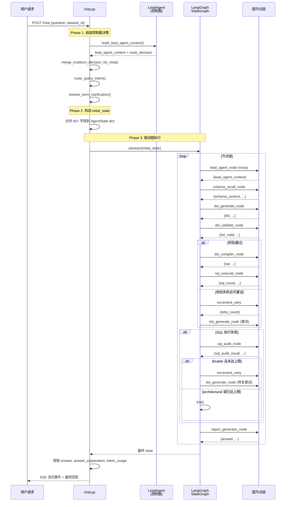

`AgentState` 是整个 NL2DSL2SQL 工作流中唯一的状态载体——它是一个 `TypedDict`，定义了从用户问题输入到最终自然语言回答的 **全链路数据契约**。LangGraph 的每个节点通过读取/写入该字典的特定字段实现无副作用的函数式状态转移，而条件路由函数则基于字段值决定下一跳。本文从字段分层、生命周期和节点契约三个维度拆解这一核心抽象。

## 状态分层的架构全景

`AgentState` 共定义 60 余个字段，按语义可划分为七个逻辑层。这些层并非彼此孤立——上游节点的输出是下游节点的前置条件，形成了严格偏序的数据依赖链。

```mermaid
flowchart TB
    subgraph 输入层["输入层：用户请求与上下文绑定"]
        question["question"]
        original_question["original_question"]
        resolved_question["resolved_question"]
        dataset_id["dataset_id"]
        time_context["time_context"]
        thread_context["thread_context"]
        conversation_id["conversation_id"]
        history["history"]
        clarification_response["clarification_response"]
    end

    subgraph 控制面层["控制面层：LeadAgent 路由决策产物"]
        route_decision["route_decision"]
        schema_status["schema_status"]
        lead_agent_context["lead_agent_context"]
        manifest_version["manifest_version"]
        bound_schema_version["bound_schema_version"]
        skip_subagent_report["skip_subagent_report"]
        report_owner["report_owner"]
    end

    subgraph 意图层["意图层：入口分类与路由结果"]
        intent["intent"]
        entities["entities"]
        entry_intent["entry_intent"]
        entry_route["entry_route"]
        entry_reason["entry_reason"]
        blueprint_id["blueprint_id"]
        knowledge_term_id["knowledge_term_id"]
        route_payload["route_payload"]
    end

    subgraph 多轮层["多轮层：跨轮状态持久化"]
        prior_capsule["prior_capsule"]
        out_capsule["out_capsule"]
        multiturn_context["multiturn_context"]
        turn_type["turn_type"]
        merge_debug["merge_debug"]
    end

    subgraph Schema层["Schema 层：语义层与数据库上下文"]
        schema_context["schema_context"]
        schema_structured["schema_structured"]
        ddl_context["ddl_context"]
        query_constraints["query_constraints"]
        datasource_context["datasource_context"]
        generation_mode["generation_mode"]
        dataset_prompt_instructions["dataset_prompt_instructions"]
        candidate_assets["candidate_assets"]
        query_plan["query_plan"]
    end

    subgraph DSL层["DSL 与 SQL 层：查询生成与执行"]
        dsl["dsl"]
        dsl_valid["dsl_valid"]
        sql["sql"]
        sql_result["sql_result"]
        datasource_dialect["datasource_dialect"]
        sql_list["sql_list"]
    end

    subgraph 控制层["控制层：错误处理与审计"]
        error["error"]
        retry_count["retry_count"]
        max_retry_count["max_retry_count"]
        should_retry["should_retry"]
        sql_audit_result["sql_audit_result"]
        sql_diagnosis["sql_diagnosis"]
        sql_retry_trace["sql_retry_trace"]
    end

    subgraph 输出层["输出层：最终回答与可观测性"]
        answer["answer"]
        answer_explanation["answer_explanation"]
        token_usage["token_usage"]
        schema_tokens["schema_tokens"]
    end

    输入层 --> 控制面层
    控制面层 --> 意图层
    意图层 --> 多轮层
    多轮层 --> Schema层
    Schema层 --> DSL层
    DSL层 --> 控制层
    控制层 --> 输出层
```

这七个分层并非形而上学的分类——它们对应了 `chat.py` 中 `initial_state` 构造的时间线和 LangGraph 图中节点的执行顺序。

Sources: [state.py](app/graph/state.py#L1-L118)

---

## 字段全量定义与职责说明

### 输入层：用户请求的原貌与解析

输入层字段承载了用户提交的**原始数据**以及 LeadAgent **控制面解析后的标准化结果**。`question` 和 `resolved_question` 的分野是理解整个系统的关键：`question` 保留原始提问文本供 DSL 生成节点使用，而 `resolved_question` 是 LeadAgent 经过时间解析、术语澄清和上下文合并后的最终工作问题。

| 字段 | 类型 | 写入者 | 读取者 | 说明 |
|------|------|--------|--------|------|
| `question` | `str` | chat.py (初始) | dsl_generate_node, sql_audit_node, report_generator_node | 当前工作问题；LeadAgent 解析后优先使用 `resolved_question` |
| `original_question` | `Optional[str]` | chat.py | 诊断/审计 | 用户原始问题（保留未处理的原文） |
| `resolved_question` | `Optional[str]` | chat.py | dsl_generate_node, out_capsule | 经 LeadAgent 控制面解析后的问题文本 |
| `dataset_id` | `Optional[int]` | chat.py | schema_recall_node, sql_execute_node | 绑定的目标数据集 ID |
| `manifest_version` | `Optional[str]` | chat.py | out_capsule | 本轮绑定的 SubAgent Manifest 版本 |
| `bound_schema_version` | `Optional[str]` | chat.py | out_capsule | Manifest 绑定的数据集 schema hash |
| `time_context` | `Optional[dict]` | chat.py | dsl_generate_node, analysis_blueprint | LeadAgent TimeTool 解析出的时间上下文 |
| `thread_context` | `Optional[dict]` | chat.py | LeadAgent 后续工具 | LeadAgent ThreadContextTool 会话锁定快照 |
| `conversation_id` | `Optional[int]` | chat.py | sql_audit_node (诊断日志) | 当前会话 ID，供诊断日志关联 |
| `history` | `Optional[List[dict]]` | chat.py | LeadAgent, entry routing | 最近 N 轮历史对话消息 |
| `clarification_response` | `Optional[dict]` | chat.py | clarification_resolution | 用户对上一轮澄清的结构化回复 |
| `clarification_resolution_result` | `Optional[dict]` | chat.py | 前端展示 | 澄清解析结果和 pending 状态 |

Sources: [state.py](app/graph/state.py#L21-L41)

### 控制面层：LeadAgent 的路由决策与 Manifest 准入

控制面层字段是 **LeadAgent 工具编排** 的产物，在 `chat.py` 的 `build_lead_agent_context()` 调用中生成，并于构造 `initial_state` 时注入。这些字段决定了工作流的**起点**——是进入 DSL 数据面链路、分析蓝图直通还是澄清早退。

`lead_agent_context` 是控制面层的"万能口袋"：它是一个聚合字典，内含 `route_decision`（路由决策快照）、`time_context`（时间解析结果）、`schema_status`（Manifest 守卫检查结果）、`planned_tool_calls`（工具计划）等子结构。LangGraph 的 `lead_agent_node` 本身是一个 noop 节点——它仅回传 `lead_agent_context`，不做任何额外计算，因为真正的决策已在图外完成。

路由决策的标志位 `skip_subagent_report` 和 `report_owner` 决定了最终报告由谁生成：当 LeadAgent 走"自动选择"路径（`route_decision.decision == "selected"`）时，`report_owner` 被设为 `"lead_agent"`，SubAgent 报告节点被跳过，最终报告由 chat.py 层的 LeadAgent 报告生成器接管。

Sources: [state.py](app/graph/state.py#L23-L36), [workflow.py](app/graph/workflow.py#L55-L63), [nodes.py](app/graph/nodes.py#L1340-L1351), [chat.py](app/api/chat.py#L1766-L1800)

### 意图层：入口路由的一次性决策

意图层字段是 `route_query_intent()` 的产物。这是整个工作流中**最关键的决策点**：`entry_route` 决定了 LangGraph 图是进入 `schema_recall` 数据面主链，还是通过 `END` 走图外早退（如知识库问答、澄清、分析蓝图直通）。`entry_route` 的可能值包括 `"query_graph"`（走 NL2DSL2SQL 全链路）、`"analysis_blueprint"`（蓝图直通）、`"knowledge_qa"`（知识库问答）、`"clarify"`（需要用户补充信息）、`"reject"`（拒绝回答）和 `"direct_answer"`（直接回答）。

`route_payload` 是一个特殊的"非 QueryGraph 路由"字段：当入口路由决定不进入数据面主链时，该字段承载需要直接返回给前端的结构化数据（如蓝图直通结果、澄清问题、拒绝理由等）。

Sources: [state.py](app/graph/state.py#L43-L64), [workflow.py](app/graph/workflow.py#L48-L61), [chat.py](app/api/chat.py#L1655-L1720)

### 多轮层：跨轮查询的状态持久化协议

多轮对话是 Datalogue 的核心能力，依赖三组字段协同工作：

- **`prior_capsule`** — 上一轮 SubAgent 输出的完整胶囊（包含 query_context、result_digest、schema_version 等），由 `chat.py` 从 `ConversationStore` 或 `last_success_task` 中加载后注入 `initial_state`
- **`out_capsule`** — 本轮 SubAgent 成功执行后，由 `sql_execute_node` 和 `report_generator_node` 通过 `build_out_capsule()` 生成，供下一轮继续追问时回注为 `prior_capsule`
- **`multiturn_context`** — 多轮合并后的结构化查询上下文，由 `MultiturnContextBuilder` 生成，内含合并后的 `merged_query_context`、`standalone_question` 和本轮 delta 摘要，DSL 生成节点通过 `_format_query_context_for_prompt()` 将其注入 LLM prompt

`turn_type` 取值为 `"new"`（全新查询）或 `"continue"`（承接上一轮），决定 `MultiturnContextBuilder` 如何处理上一轮胶囊。`merge_debug` 提供合并过程的审计信息，供 trace 和前端调试。

Sources: [state.py](app/graph/state.py#L37-L42), [nodes.py](app/graph/nodes.py#L824-L870), [multiturn_context.py](app/services/multiturn_context.py#L143-L187), [task_capsule.py](app/services/task_capsule.py#L60-L120)

### Schema 层：语义资产召回的上下文注入

Schema 层是数据面链路的**第一道工序**。`schema_recall_node` 根据 `dataset_id` 调用 `build_dataset_query_context()` 组装数据集问数所需的全部上下文：

- **`schema_context`** — 格式化的语义层描述文本（包含指标、维度、术语、蓝图、时间字段、默认约束等），直接注入 DSL 生成的 LLM system prompt
- **`schema_structured`** — 结构化语义层配置对象（metrics/dimensions/fields/terms/blueprints 的完整列表），供 DSL 校验节点做轻量级成员检查和 DSL 编译器做 SQL 翻译
- **`ddl_context`** — 当前数据集所选表的真实 DDL，供 SQL 审计节点检查列名合法性
- **`query_constraints`** — SQL 生成的默认时间范围和默认 LIMIT 等结构化约束
- **`datasource_context`** — 规范化数据源上下文（db_type/dialect/授权表/超时），供 DSL 编译器和 SQL 执行器使用
- **`generation_mode`** — `"semantic"`（语义层模式）或 `"inferred"`（推测模式），供前端显示徽标

`candidate_assets` 和 `query_plan` 是 SubAgent 查询规划系统的产物：前者包含统一的候选资产召回结果（blueprint/metric/dimension/term/field/table），后者决定执行策略（`blueprint_execute`、`query_graph`、`clarify` 等）。

`dataset_prompt_instructions` 是数据集级的 LLM 硬性约束（如"只允许使用以下指标"），由 `schema_recall_node` 写入，供那些不直接读取 `schema_context` 的下游节点（如 `report_generator_node`）使用。

Sources: [state.py](app/graph/state.py#L66-L89), [nodes.py](app/graph/nodes.py#L1459-L1562)

### DSL 与 SQL 层：查询表达的生成与执行

`dsl` 字段承载结构化 DSL JSON，是 NL2SQL 链路中连接自然语言和 SQL 的**桥梁抽象**。在语义层模式下，DSL 包含 metrics/dimensions/filters/terms 等资产引用；在真实 Schema 模式下，DSL 以 `{"direct_sql": "..."}` 或 `{"sql": "..."}` 的包裹形式承载直接 SQL。

`dsl_valid` 是一个布尔标志位，由 `dsl_validate_node` 设置，决定 `_dsl_validation_router` 是走 `compile`（编译）、`retry`（重试）还是 `end`（终止）。这是图中最关键的**二元分支点**：校验通过则继续编译链路，失败则根据 `should_retry` 和 `retry_count` 决定是重新生成还是提前结束。

`sql` 字段由 `dsl_compiler_node` 写入，是方言感知的最终可执行 SQL。`sql_result` 由 `sql_execute_node` 写入，包含 `columns`、`rows`、`row_count` 和 `column_labels`。`sql_list` 是一个累积列表，记录本轮执行过的所有 SQL（含自动修复重试过程中的中间 SQL），供审计追踪。

Sources: [state.py](app/graph/state.py#L91-L99), [nodes.py](app/graph/nodes.py#L1940-L2240), [nodes.py](app/graph/nodes.py#L2076-L2240)

### 控制层：错误处理、重试与审计的闭环

控制层字段实现了 SQL 执行失败的**自愈闭环**。当 `sql_execute_node` 执行失败时，`should_retry` 被设为 `True`，`sql_execution_router` 将流程导向 `sql_audit`。`sql_audit_node` 调用 LLM（temperature=0）产出结构化诊断，写入 `sql_audit_result` 和 `sql_diagnosis`，区分两类错误等级：

- **`fixable`**：可自动修复的错误（如语法错误、字段不存在但有替代字段），允许通过 `increment_retry` 回到 `dsl_generate` 重试
- **`architectural`**：架构级错误（如表不存在、权限不足），直接终止，避免无效的 token 消耗

`retry_count` 和 `max_retry_count` 控制重试上限。`sql_retry_trace` 记录完整的重试链路，包含每次重试的原因、原 SQL、修复后 SQL 和最终结果，为前端审计页和 Langfuse trace 提供完整的修复历史。

**命名约束**：LangGraph 禁止节点名与状态字段同名。因此节点名为 `sql_audit`，但状态字段为 `sql_audit_result`。

Sources: [state.py](app/graph/state.py#L101-L117), [nodes.py](app/graph/nodes.py#L2705-L2885), [workflow.py](app/graph/workflow.py#L78-L116)

### 输出层：最终回答与可观测性

`answer` 是最终自然语言回答，由 `report_generator_node` 或 LeadAgent 报告生成器写入。`answer_explanation` 提供回答的口径说明、来源引用、SQL 摘要、置信度和风险评估，供前端"答案解释"面板使用。

`token_usage` 是累积的 Token 用量字典（`prompt_tokens`、`completion_tokens`、`total_tokens`），在整个工作流中通过 `_merge_token_usage()` 不断累加各节点的 LLM 调用消耗。`schema_tokens` 单独记录 `schema_context` 的估算 token 数，用于 prompt 压缩监控。

Sources: [state.py](app/graph/state.py#L114-L118)

---

## 状态生命周期：从聊天请求到最终回答

`AgentState` 的生命周期分为三个清晰阶段。

### Phase 1: 控制面决策（chat.py，图外）

在 LangGraph 图被调用之前，`chat.py` 执行一系列**图外决策**：

1. **消息网关**：判断事件类型（新对话 / 追问 / 状态变更），加载上一轮胶囊和成功任务
2. **多轮合并**：通过 `MultiturnContextBuilder` 将本轮问题与上一轮查询语境合并
3. **术语澄清解析**：若上一轮有 pending 术语澄清，先解析用户回复
4. **LeadAgent 入口路由**：通过 `route_query_intent()` 一次性产出 `entry_route`、`entry_intent` 等意图层字段
5. **数据集 Fan-Out 解析**：若启用多数据集并发模式，解析 `planned_tool_calls` 为 `SubAgentFanOutInvocation` 列表

这些决策的最终产物——`route_decision`、`entry_route`、`multiturn_context`、`prior_capsule` 等——被塞入 `initial_state`，使得 LangGraph 图中的条件路由函数（如 `_lead_agent_router`）可以直接读取 state 字段做出路由决策，而无需在图内重复执行这些昂贵的 LLM 调用。

Sources: [chat.py](app/api/chat.py#L1580-L1860)

### Phase 2: 图执行（LangGraph StateGraph）

图编译后的执行是确定性的——`StateGraph(AgentState)` 的类型约束确保每个节点返回的 dict 只能更新 `AgentState` 已声明的字段。图中 9 个节点形成三条执行路径：

| 路径 | 节点序列 | 触发条件 |
|------|----------|----------|
| **数据面主链** | lead_agent → schema_recall → dsl_generate → dsl_validate → dsl_compiler → sql_execute → report_generator | `entry_route == "query_graph"` |
| **重试环** | increment_retry → dsl_generate → dsl_validate | DSL 校验失败 或 SQL 审计判定 fixable |
| **早退** | lead_agent → END | `entry_route` 非 `"query_graph"`（analysis_blueprint、clarify、knowledge_qa 等） |

重试环的存在使得 `dsl_generate` 能基于上一轮的 `error` 字段生成修正后的 DSL，而 `sql_audit` 能将 LLM 诊断结论通过 `error` 字段传递给下一轮的 DSL 生成。

Sources: [workflow.py](app/graph/workflow.py#L119-L218)

### Phase 3: 结果消费（chat.py，图后）

图执行完成后，`chat.py` 从最终 state 中提取 `answer`、`answer_explanation`、`token_usage`、`out_capsule` 等字段，持久化到 `Message` 和 `QueryArtifact` 表，并封装为 SSE `final` 事件发送给前端。`out_capsule` 被存入 `ConversationStore`，作为下一轮追问的 `prior_capsule` 来源。

Sources: [chat.py](app/api/chat.py#L3236-L3441)

---

## 节点 → 字段契约矩阵

下表呈现了每个图节点对 `AgentState` 的读写关系。"读"表示该节点从 state 中读取这些字段进行决策或计算，"写"表示该节点返回的 dict 中包含这些字段的更新值。

| 节点 | 读取的 state 字段 | 写入的 state 字段 |
|------|-------------------|-------------------|
| `lead_agent_node` | `lead_agent_context` | `lead_agent_context`（回传） |
| `schema_recall_node` | `dataset_id`, `question`, `blueprint_context`, `semantic_asset_resolution` | `schema_context`, `schema_structured`, `ddl_context`, `query_constraints`, `datasource_context`, `dataset_prompt_instructions` |
| `dsl_generate_node` | `question`, `schema_context`, `entities`, `retry_count`, `error`, `query_constraints`, `multiturn_context`, `query_plan`, `dsl` (retry), `generation_mode` | `dsl`, `token_usage`, `generation_mode` |
| `dsl_validate_node` | `dsl`, `schema_context`, `schema_structured` | `dsl_valid`, `error`, `should_retry`, `dsl` (clean) |
| `dsl_compiler_node` | `dsl`, `schema_context`, `schema_structured`, `query_constraints`, `datasource_context`, `dataset_id` | `sql`, `sql_list`, `error`, `should_retry` |
| `sql_execute_node` | `sql`, `error`, `dataset_id`, `datasource_context`, `query_constraints` | `sql_result`, `error`, `should_retry`, `datasource_dialect`, `out_capsule`, `sql_retry_trace` |
| `sql_audit_node` | `question`, `dsl`, `sql`, `error`, `schema_context`, `ddl_context`, `schema_structured`, `metric_resolution`, `term_normalization`, `semantic_asset_resolution`, `dataset_id`, `retry_count`, `max_retry_count`, `token_usage` | `sql_audit_result`, `sql_diagnosis`, `should_retry`, `error`, `sql_retry_trace`, `token_usage` |
| `report_generator_node` | 全部（由 `generate_sql_result_report` 消费） | `answer`, `answer_explanation`, `token_usage`, `out_capsule` |
| `increment_retry` | `retry_count` | `retry_count`（+1） |

Sources: [nodes.py](app/graph/nodes.py#L1340-L2904)

---

## 路由函数对 State 的依赖

LangGraph 的三条条件边由四个路由函数控制，每个路由函数从 `AgentState` 中读取特定字段做决策。这些函数是**纯函数**——不修改 state，只返回下一跳的目标节点名。

| 路由函数 | 读取的 state 字段 | 可能的下一跳 | 决策逻辑 |
|----------|-------------------|-------------|----------|
| `_lead_agent_router` | `entry_route` | `schema_recall` 或 `END` | `entry_route` 非 `"query_graph"` 的路径直接结束（图外 chat.py 已处理） |
| `_dsl_validation_router` | `dsl_valid`, `should_retry`, `retry_count`, `max_retry_count` | `dsl_compiler`, `increment_retry`, `END` | 通过→编译；失败且可重试且未达上限→重试；失败且不可重试→结束 |
| `_sql_execution_router` | `should_retry`, `sql_result`, `skip_subagent_report` | `report_generator`, `sql_audit`, `END` | 成功→报告；失败→审计；成功但跳过报告→结束 |
| `_sql_audit_router` | `sql_audit_result.severity`, `retry_count`, `max_retry_count` | `increment_retry`, `END` | fixable 且未达上限→重试；architectural 或已达上限→结束 |

这种设计遵循了 LangGraph 的最佳实践：路由逻辑与节点计算分离，state 作为两者之间唯一的通信媒介。

Sources: [workflow.py](app/graph/workflow.py#L48-L116)

---

## 实践指南：如何新增 State 字段

当需要在工作流中新增一个跨节点传递的数据字段时，遵循以下流程：

1. **定义字段**：在 `app/graph/state.py` 的 `AgentState` 中添加带有类型注解的键。保持分层注释的完整性，将新字段归入合适的逻辑层
2. **初始化字段**：在 `chat.py` 的 `initial_state` 字典中添加默认值（通常为 `None`、`False` 或空列表）
3. **写入字段**：在目标节点中返回包含该字段的 dict。注意 LangGraph 的类型约束——返回的键必须在 `AgentState` 中存在
4. **读取字段**：在下游节点或路由函数中通过 `state.get("field_name")` 安全读取
5. **命名约束**：确保字段名不与任何图节点名冲突（LangGraph 禁止同名）

由于 `AgentState` 是 `TypedDict` 而非 Pydantic 模型，它不提供运行时校验。数据正确性依赖节点的契约遵守和集成测试覆盖。

---

## 与其他页面的关联

`AgentState` 是连接控制面和数据面的数据总线。以下页面提供了更深入的相关主题：

- **[LangGraph 工作流装配](7-langgraph-gong-zuo-liu-zhuang-pei-jie-dian-zhu-ce-tiao-jian-lu-you-yu-zhong-shi-luo-ji)** — 图节点的注册、条件边定义和重试逻辑，展示了 `AgentState` 如何驱动路由决策
- **[NL2DSL2SQL 处理管道](5-nl2dsl2sql-chu-li-guan-dao-cong-zi-ran-yu-yan-dao-jie-gou-hua-cha-xun-de-duan-dao-duan-lian-lu)** — 端到端链路的全景，帮助理解 `AgentState` 各字段在多节点中的流转
- **[LeadAgent 工具编排](9-leadagent-gong-ju-bian-pai-ji-neng-xuan-ze-gong-ju-gui-hua-yu-lu-you-jue-ce)** — 控制面层字段（`lead_agent_context`、`route_decision`）的生成逻辑
- **[DSL 生成、校验与 SQL 编译](13-dsl-sheng-cheng-xiao-yan-yu-sql-bian-yi-de-zhu-jie-dian-shi-xian)** — DSL 层和 SQL 层字段的节点内处理细节
- **[QueryTaskCapsule 与 QueryArtifact](21-querytaskcapsule-yu-queryartifact-kua-lun-cha-xun-zhuang-tai-de-chi-jiu-hua-xie-yi)** — 多轮层字段（`prior_capsule`、`out_capsule`）的持久化协议
- **[多轮上下文构建器](20-duo-lun-shang-xia-wen-gou-jian-qi-zhui-wen-shi-bie-shi-jian-zeng-liang-jie-xi-yu-xiao-nang-he-bing)** — `multiturn_context` 和 `turn_type` 的合并逻辑