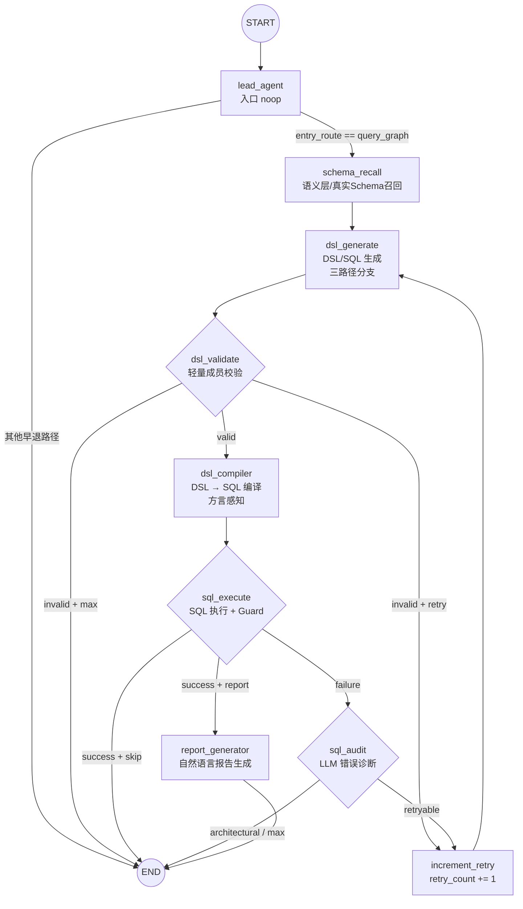

本文档深入剖析 Datalogue 平台基于 LangGraph 的 NL2DSL2SQL 工作流装配机制。读者将理解 9 个节点的注册方式、4 条条件路由的决策逻辑、以及 DSL 校验与 SQL 审计双环重试的完整设计。建议在阅读前已完成 [AgentState 状态定义](6-agentstate-zhuang-tai-ding-yi-langgraph-gong-zuo-liu-quan-ju-chuan-di-de-shu-ju-qi-yue) 及 [NL2DSL2SQL 处理管道](5-nl2dsl2sql-chu-li-guan-dao-cong-zi-ran-yu-yan-dao-jie-gou-hua-cha-xun-de-duan-dao-duan-lian-lu) 的概览阅读。

## 工作流拓扑：单入口、线性主干、双环回退

LangGraph 工作流以 `StateGraph(AgentState)` 为骨架，编译后的图包含 9 个逻辑节点和 1 个仅用于计数的辅助节点。**节点注册发生在 `build_workflow(db)` 工厂函数内部**，该函数接收一个 SQLAlchemy `Session` 作为参数，以使 Schema 召回和 SQL 执行等节点可以访问数据库。编译后的图返回给调用方（`chat.py`），随后通过 `astream_events()` 进行流式执行。



图中可见两条回退环路：**DSL 校验失败**时从 `dsl_validate` 回到 `dsl_generate`（浅环），以及 **SQL 执行失败**时经 `sql_audit` 智能诊断后选择性回到 `dsl_generate`（深环）。之所以设计为都回到 `dsl_generate` 而非更细粒度的节点，是因为错误信息（`state["error"]`）必须被注入到 LLM 提示词中，只有 DSL 生成节点具备拼装完整上下文（Schema + 约束 + 错误反馈 + 多轮信息）的能力。

Sources: [workflow.py](app/graph/workflow.py#L112-L219)

## 节点注册：工厂闭包与 Lambda 适配

节点在 `build_workflow` 中通过 `workflow.add_node(name, callable)` 逐一注册。由于 LangGraph 要求每个节点接收 `(state: AgentState) -> dict` 签名，而多个节点需要额外的 `db: Session` 参数来执行数据库操作，代码中使用了两种适配模式：

| 节点 | 注册方式 | 适配策略 |
|------|----------|----------|
| `lead_agent` | `add_node("lead_agent", lead_agent_node)` | 纯函数，签名天然匹配 |
| `schema_recall` | `add_node("schema_recall", schema_recall_node(db))` | **工厂函数**：`schema_recall_node(db)` 返回闭包 `_node(state)`，`db` 被捕获在闭包中 |
| `dsl_generate` | `add_node("dsl_generate", lambda state: dsl_generate_node(state, db=db))` | **Lambda 适配**：将 `db` 作为关键字参数绑定 |
| `dsl_validate` | `add_node("dsl_validate", dsl_validate_node)` | 纯函数，不依赖 `db` |
| `dsl_compiler` | `add_node("dsl_compiler", dsl_compiler_node(db))` | 工厂函数（需要 `db` 查询方言） |
| `sql_execute` | `add_node("sql_execute", sql_execute_node(db))` | 工厂函数（需要 `db` 获取数据源连接） |
| `sql_audit` | `add_node("sql_audit", sql_audit_node(db))` | 工厂函数（需要 `db` 查样本数据） |
| `report_generator` | `add_node("report_generator", _report_generator_with_db)` | 异步 Lambda，包装 `async def` 闭包 |
| `increment_retry` | `add_node("increment_retry", _increment_retry)` | 纯函数，仅做 `retry_count + 1` |

`report_generator` 是唯一使用异步闭包的节点——因为 `report_generator_node` 内部调用 `generate_sql_result_report` 使用 `astream()` 实现 token 级流式输出，必须保持 `async` 语义。其余节点均为同步函数，LangGraph 在线程池中执行它们以不阻塞事件循环。

Sources: [workflow.py](app/graph/workflow.py#L119-L139) | [nodes.py](app/graph/nodes.py#L1340-L1349) | [nodes.py](app/graph/nodes.py#L1459-L1540)

## 四条条件路由：决策函数与路由映射

工作流中共有 4 处条件分支，每处由 `<router_function> -> {key: target_node}` 的映射定义。这些路由函数读取 `AgentState` 中的特定字段做出一次性决策。

### 路由一：`_lead_agent_router` — 入口早退分流

```python
def _lead_agent_router(state: AgentState) -> str:
    entry = state.get("entry_route")
    if entry in ("interpret_result", "analysis_blueprint"):
        return "end"
    # ...兼容旧值...
    return "schema_recall"
```

此路由在 `lead_agent`（noop 节点）之后执行。`entry_route` 由 `chat.py` 层在驱动 LangGraph 之前通过 `route_query_intent` 一次性决策并写入 `initial_state`。如果入口意图是 "解读已有结果" 或 "执行已发布分析蓝图"，则直接 END——因为这些路径的数据面已经在 `chat.py` 层的 `DatasetSubAgent.resolve_analysis_blueprint` 中完成，无需进入 Schema 召回流水线。

Sources: [workflow.py](app/graph/workflow.py#L50-L72)

### 路由二：`_dsl_validation_router` — DSL 校验重试决策

```python
def _dsl_validation_router(state: AgentState) -> str:
    if state.get("dsl_valid"):
        return "compile"
    if state.get("should_retry") is False:
        return "end"
    retry = state.get("retry_count", 0)
    max_retry = state.get("max_retry_count", _sql_max_retry_count())
    if retry < max_retry:
        return "retry"
    return "end"
```

三层判断：DSL 合法 → 进入编译；不可重试（如 DSL 中 `should_retry=False` 的硬性错误）→ END；重试次数未耗尽 → 走 `increment_retry` 回 `dsl_generate`；次数耗尽 → END。`should_retry=False` 的典型场景包括：数据集未选择任何数据源表、SQL Guard 拦截写操作、LLM 内容敏感过滤等不可通过重试修复的错误。

Sources: [workflow.py](app/graph/workflow.py#L75-L86)

### 路由三：`_sql_execution_router` — SQL 执行后分流

```python
def _sql_execution_router(state: AgentState) -> str:
    if not state.get("should_retry"):
        if state.get("sql_result") is None:
            return "end"
        if _should_skip_subagent_report(state):
            return "end"
        return "report"
    return "audit"
```

执行成功（`should_retry=False`）时：有结果 → 生成报告；无结果（如 SQL Guard 在编译阶段已拦截）→ END；LeadAgent 接管报告（`skip_subagent_report=True`）→ END。执行失败时统一路由到 `sql_audit`，由 LLM 判断是否值得重试，而非盲目回退到 DSL 生成——这是 v2 审计改造的核心改进。

Sources: [workflow.py](app/graph/workflow.py#L89-L102)

### 路由四：`_sql_audit_router` — 审计后重试或终止

```python
def _sql_audit_router(state: AgentState) -> str:
    audit = state.get("sql_audit_result") or {}
    if audit.get("retryable") is False or audit.get("severity") == "architectural":
        return "end"
    retry = state.get("retry_count", 0)
    max_retry = state.get("max_retry_count", _sql_max_retry_count())
    if retry >= max_retry:
        return "end"
    return "retry"
```

LLM 审计将错误分类为 `fixable`（字段名拼写错误、表别名不对等可通过重试修复的问题）和 `architectural`（权限不足、语义层缺少必要字段等需要用户修改数据集的硬性问题）。`architectural` 直接 END，不再消耗 Token；`fixable` 且在重试上限内则回 `dsl_generate`。

Sources: [workflow.py](app/graph/workflow.py#L105-L118)

## 双环重试机制：DSL 浅环与 SQL 深环

系统设计了两级重试回路，从不同维度修复 LLM 生成的不合法输出。

### DSL 校验重试（浅环）

`dsl_validate_node` 执行轻量级成员校验——检查 DSL 中的 `metrics`、`dimensions`、`filters.field`、`terms`、`blueprints` 的 name 是否在 `schema_structured` 的有效名称集合内。**深度校验（DDL 列名合法性、time_field 类型匹配、JOIN 字段对应等）下放给 `sql_audit_node`**，因为这类复杂错误需要 LLM 结合 DDL 和样本数据做语义级诊断才能有效修复。

当校验失败时，节点在输出中设置 `should_retry: True` 和 `error` 字段。下一轮 `dsl_generate_node` 会读取 `state["error"]` 并追加到 LLM 提示词中（如 `"上一轮错误（请修正）: {error}"`），让 LLM 基于错误反馈修正输出。这一设计使 DSL 生成节点成为**自修正闭环**：LLM 看到自己的错误 → 修正 DSL → 再校验 → 直到通过或耗尽重试。

Sources: [nodes.py](app/graph/nodes.py#L1940-L2073)

### SQL 审计重试（深环）

当 SQL 执行失败时，不直接回到 DSL 生成，而是先进入 `sql_audit_node`——一个 temperature=0 的 LLM 调用，接收以下完整上下文：

| 输入组件 | 来源 | 作用 |
|----------|------|------|
| 原始错误信息 | `state["error"]` | 数据库返回的异常文本 |
| DDL 上下文 | `state["ddl_context"]` | 所选表的真实列定义 |
| 样本数据 | 实时 `SELECT * LIMIT 2` | 让 LLM 看到实际数据格式 |
| 语义层 / Schema | `state["schema_context"]` | 资产定义和同义词映射 |
| 指标/术语解析 | `state["metric_resolution"]` / `term_normalization` | 实体解析链的中间结果 |
| 确定性诊断 | `classify_sql_execution_error()` | 基于正则和错误码的规则引擎兜底 |

审计输出结构化的 `sql_audit_result`，包含 `code`、`severity`（`fixable` 或 `architectural`）、`root_cause`、`suggested_fix` 等字段。**当 LLM 调用失败时，确定性规则引擎的结果作为兜底**，确保审计节点永不断路。

审计后的诊断信息也会通过 `_write_sql_diagnosis_log` 写入数据库的 `SQLDiagnosisLog` 表，供前端审计页展示。

Sources: [nodes.py](app/graph/nodes.py#L2705-L2886) | [nodes.py](app/graph/nodes.py#L2672-L2690)

### 重试追踪（sql_retry_trace）

每一次 SQL 自动修复重试都被记录到 `state["sql_retry_trace"]` 列表中。记录包含原始 SQL、修复原因、诊断码、重试结果和最终状态。这些记录在 SSE 事件中透传给前端，用户可以在诊断面板中看到完整的修复链：

```
attempt 1/3: 原 SQL → 修复原因 → 执行结果 → 成功/失败
attempt 2/3: ...
```

节点层面的 `_attach_sql_retry_failure` 和 `_finish_latest_sql_retry_trace` 两个辅助函数负责更新追踪链中的最近一条 `pending` 记录。

Sources: [nodes.py](app/graph/nodes.py#L275-L445)

## 重试上限配置

默认最大重试次数为 3，可通过环境变量 `SQL_MAX_RETRY_COUNT` 覆盖。该值在 `workflow.py` 和 `nodes.py` 中都有一致读取逻辑，确保图编译和节点执行使用同一上限：

| 配置来源 | 默认值 | 读取位置 |
|----------|--------|----------|
| `Settings.SQL_MAX_RETRY_COUNT` | `3` | `app/core/config.py` 第 153 行 |
| `_sql_max_retry_count()` | 失败回退到 3 | `workflow.py` 和 `nodes.py` |

Sources: [config.py](app/core/config.py#L153) | [workflow.py](app/graph/workflow.py#L37-L43)

## 图编译与流式调用链路

`build_workflow(db)` 最终调用 `workflow.compile()` 返回编译后的 LangGraph `CompiledGraph`。调用链如下：

```
chat.py: _stream_chat()
  └─ build_workflow(db)                         # 构建编译图
  └─ DatasetSubAgent(db).run()                  # 门面：候选资产召回 + 查询规划
       └─ InProcessDatasetSubAgentRunner.run()  # 包装 astream_events + trace
            └─ graph.astream_events(initial_state, version="v2")
                 └─ 逐个节点触发 on_chain_start / on_chain_end 事件
                 └─ chat.py 监听事件 → SSE 推送给前端
```

`chat.py` 通过 `astream_events` 的 `metadata["langgraph_node"]` 字段识别当前执行的节点，为每个节点生成 `{type: "step", node: "...", status: "running/done"}` 的 SSE 事件。节点特定数据（DSL JSON、编译后的 SQL、执行行数、审计诊断等）在 `on_chain_end` 事件中通过 `final_state` 提取并作为 SSE payload 下发。

当前节点名称到前端展示名的映射在 `_NODE_DISPLAY_NAMES` 字典中维护，展示名与原始节点名保持一致，便于按节点检索 Langfuse Trace。

Sources: [chat.py](app/api/chat.py#L2034-L2046) | [chat.py](app/api/chat.py#L2120-L2220) | [runner.py](app/services/runner.py#L77-L130)

## 设计原则总结

| 原则 | 体现 |
|------|------|
| **关注点分离** | 控制面决策（意图路由、蓝图解析、术语澄清）在 `chat.py` 层完成；数据面执行（Schema 召回 → DSL → SQL → 报告）在 LangGraph 图中完成 |
| **渐进式校验** | DSL 校验只做毫秒级成员检查（拦 80% 错误）；深度语义校验交由 SQL 审计的 LLM 调用（拦剩余 20%） |
| **智能重试** | 不是简单的失败即重试，而是通过 LLM 审计判断 `fixable` vs `architectural`，避免在硬性错误上浪费 Token |
| **确定性兜底** | 正则规则引擎 `classify_sql_execution_error` 作为 LLM 审计失败时的保底方案 |
| **工厂模式** | 需要 `db` 的节点通过工厂函数或 Lambda 闭包适配 LangGraph 的 `(state) -> dict` 签名 |

---

**后续阅读建议**：了解节点内部实现细节可阅读 [DSL 生成、校验与 SQL 编译的逐节点实现](13-dsl-sheng-cheng-xiao-yan-yu-sql-bian-yi-de-zhu-jie-dian-shi-xian) 和 [SQL 执行守卫：静态安全校验、方言适配与自动修复审计](14-sql-zhi-xing-shou-wei-jing-tai-an-quan-xiao-yan-fang-yan-gua-pei-yu-zi-dong-xiu-fu-shen-ji)；理解数据面上下文组装可阅读 [Schema 召回与数据集问数上下文组装](12-schema-zhao-hui-yu-shu-ju-ji-wen-shu-shang-xia-wen-zu-zhuang)。