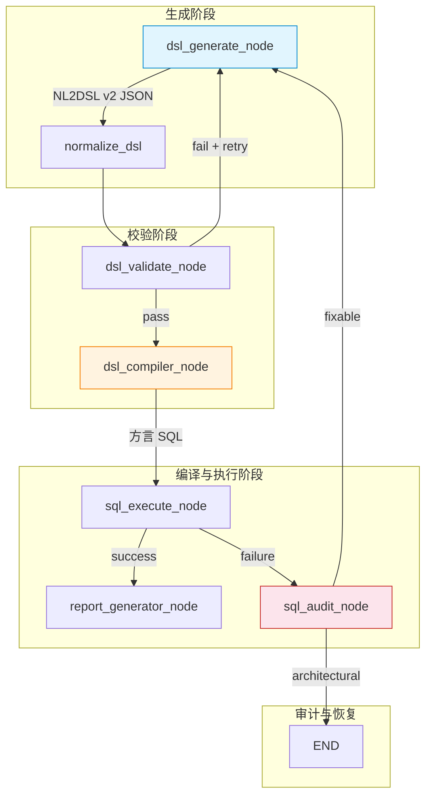
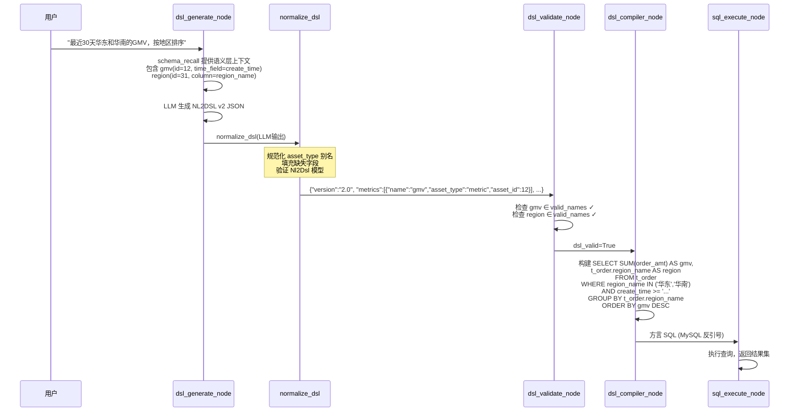

DSL（Domain-Specific Language）是 Datalogue NL2DSL2SQL 管道中的**核心中间表示（Intermediate Representation, IR）**，位于 LLM 生成输出与 SQL 编译器之间。它的设计目标不只是"告诉编译器要查什么"，而是为 AI 的每一次语义资产匹配提供可审计、可澄清、可纠错的**结构化证据链**。v2 版本的核心变革在于：将旧版中纯字符串式的指标/维度引用，升级为携带 `asset_type`、`asset_id`、`confidence` 和歧义候选的**资产引用对象**，使整个链路从"黑盒字符串匹配"演进为"可追溯的语义资产解析"。

Sources: [docs/NL2DSL资产引用Schema.md](docs/NL2DSL资产引用Schema.md#L1-L154)

## 架构定位：DSL 在 NL2DSL2SQL 管道中的角色

DSL 不是 SQL 的语法糖，而是**语义层与执行层之间的契约语言**。它的上游是 LLM（通过 `dsl_generate_node` 根据语义层上下文生成结构化 JSON），下游是 DSL 编译器（`dsl_compiler_node` 将 JSON 翻译为方言感知的 SQL）。在生成与编译之间，`dsl_validate_node` 执行轻量级成员校验，而 SQL 执行失败时由 `sql_audit_node` 结合 DDL 与样例数据做智能诊断——整个 DSL 生命周期贯穿了生成、校验、编译、执行、审计五个阶段。



**关键设计决策**：DSL 只携带语义信息，不包含 SQL 语法细节。编译器从 `schema_structured`（结构化语义层配置）中读取 `tables_json`、JOIN 关系、方言标识等来生成 SQL。这使得 DSL 层面保持对数据源方言的完全透明——同一个 DSL 可以在 MySQL（反引号）、PostgreSQL（双引号）、Oracle（`FETCH FIRST`）等环境中生成不同的 SQL。

Sources: [nodes.py](app/graph/nodes.py#L1565-L1940), [nodes.py](app/graph/nodes.py#L1940-L2075), [nodes.py](app/graph/nodes.py#L2076-L2503), [workflow.py](app/graph/workflow.py#L1-L219)

## v2 资产引用核心模型

v2 的核心创新在于：**每一个语义资产引用不再是裸字符串，而是一个携带类型、ID、置信度和匹配证据的结构化对象**。这使得系统可以在前端展示"AI 命中了哪个指标（asset_id=12, confidence=0.93）"，也可以在审计日志中追溯每一次匹配的合理性。

### DslAssetRef：语义资产的显式引用

`DslAssetRef` 是 v2 的原子引用单元，出现在 DSL 中的 `metrics`、`dimensions`、`fields`、`terms`、`blueprints` 列表中，以及 `DslFilter.field` 和 `DslOrderBy.field` 中：

| 字段 | 类型 | 必填 | 说明 |
|---|---|---|---|
| `name` | `str` | 是 | 编译时使用的稳定名称，对应语义层的 `name` 字段 |
| `asset_type` | `AssetType` | 是 | 资产类型：`term`、`metric`、`dimension`、`column`、`field`、`blueprint` |
| `asset_id` | `int \| None` | 否 | 数据库中的资产主键 ID；旧 DSL 或未命中时为 `null` |
| `display_name` | `str \| None` | 否 | 用户可读名称，供前端展示 |
| `matched_text` | `str \| None` | 否 | 用户原始问题中触发匹配的文本片段 |
| `confidence` | `float \| None` | 否 | 匹配置信度 0~1，来源于语义资产解析结果 |
| `reason` | `str \| None` | 否 | 匹配原因说明，如"命中指标同义词" |

`AssetType` 定义了六种资产类型，并提供了别名映射以兼容 LLM 输出的各种变体。例如 LLM 输出 `"business_term"` 会被自动规范化为 `"term"`，`"analysis_blueprint"` 规范化为 `"blueprint"`：

```python
AssetType = Literal["term", "metric", "dimension", "column", "field", "blueprint"]
ASSET_TYPE_ALIASES = {
    "business_term": "term",
    "analysis_blueprint": "blueprint",
    "source_column": "column",
}
```

Sources: [dsl.py](app/schemas/dsl.py#L1-L45)

### Nl2Dsl：DSL 根对象

`Nl2Dsl` 是完整 DSL 文档的根模型，承载一次分析查询的全部语义意图：

| 字段 | 类型 | 默认值 | 说明 |
|---|---|---|---|
| `version` | `str` | `"2.0"` | Schema 版本标识 |
| `metrics` | `list[DslAssetRef]` | `[]` | 查询指标列表（如 GMV、退款金额） |
| `dimensions` | `list[DslAssetRef]` | `[]` | 分组维度列表（如地区、品类） |
| `fields` | `list[DslAssetRef]` | `[]` | 明细字段列表（明细查询场景，不做聚合） |
| `terms` | `list[DslAssetRef]` | `[]` | 引用的业务术语（如"有效订单"的定义） |
| `blueprints` | `list[DslAssetRef]` | `[]` | 引用的分析蓝图（预定义的分析模板） |
| `filters` | `list[DslFilter]` | `[]` | 过滤条件列表 |
| `time_range` | `dict \| None` | `None` | 时间范围（`field`、`start`、`end`） |
| `order_by` | `list[DslOrderBy]` | `[]` | 排序条件列表 |
| `limit` | `int \| None` | `None` | 返回行数限制 |
| `confidence` | `float \| None` | `None` | 整体 DSL 的置信度 |
| `ambiguities` | `list[DslAmbiguity]` | `[]` | 解析过程中识别出的歧义 |
| `direct_sql` | `str \| None` | `None` | 直接 SQL 逃逸模式（绕过编译器） |
| `inferred` | `bool` | `False` | 是否为推断路径生成的 DSL |

三个关键设计约束：
1. **`metrics` / `dimensions` / `fields` 至少需要一项**：`dsl_validate_node` 会对此做硬校验，防止空查询。但 `direct_sql` 和 `inferred` 路径豁免此约束。
2. **`direct_sql` 是逃逸模式**：当指标未在语义层中定义（推断路径）或数据源无语义层时，LLM 直接生成 SQL 并放入 `direct_sql` 字段，编译器直接透传该 SQL 到 SQL Guard 校验，不经过 DSL→SQL 编译。
3. **`asset_id` 缺失不阻塞旧链路**：编译器只使用 `name` 字段生成 SQL，`asset_id` 和 `confidence` 仅供审计和前端展示，不影响 SQL 编译结果。

Sources: [dsl.py](app/schemas/dsl.py#L74-L100)

### DslFilter：过滤条件

`DslFilter` 最值得关注的设计是其 `field` 字段的类型——`str | DslAssetRef`。这体现了 v2 的渐进式兼容策略：旧版 DSL 中 `field` 是字符串，v2 中它可以是完整的资产引用对象：

```python
class DslFilter(BaseModel):
    field: str | DslAssetRef  # 核心：联合类型，兼容新旧
    op: Literal["eq", "in", "gt", "gte", "lt", "lte", "between", "neq"]
    values: list[Any] = Field(default_factory=list)
    confidence: float | None = Field(default=None, ge=0, le=1)
    ambiguities: list[DslAmbiguity] = Field(default_factory=list)
```

编译器在生成 WHERE 子句时，通过 `_dsl_field_name()` 函数统一提取 `field` 中的名称，对底层类型差异无感知。这种**多态字段设计**使得 DSL 既能承载 v2 的资产元数据，又能无缝兼容旧版字符串输入。

Sources: [dsl.py](app/schemas/dsl.py#L56-L72), [nodes.py](app/graph/nodes.py#L963-L966)

### DslAmbiguity：歧义结构

当用户输入中的一个词可能对应多个语义资产时（如"销售"同时可能指"销售额"指标和"销售部门"维度），系统不会直接做出武断选择，而是将歧义信息保留在 DSL 中：

```json
{
  "text": "销售",
  "reason": "同时命中销售额指标和销售部门维度",
  "candidates": [
    {"name": "gmv", "asset_type": "metric", "asset_id": 12, "confidence": 0.61},
    {"name": "sales_dept", "asset_type": "dimension", "asset_id": 44, "confidence": 0.58}
  ],
  "resolution_hint": "请确认销售是指销售额还是销售部门"
}
```

`ambiguities` 不直接改变 SQL 编译结果——它们作为审计和前端澄清的结构化信息存在，由上游的 LeadAgent 或聊天层在路由决策中消费。

Sources: [dsl.py](app/schemas/dsl.py#L48-L54), [docs/NL2DSL资产引用Schema.md](docs/NL2DSL资产引用Schema.md#L80-L105)

## DSL 生成：四条路径的统一入口

`dsl_generate_node` 是 DSL 生命周期的起点，根据上游 Schema 召回的结果选择四条生成路径之一：

| 路径 | 触发条件 | 输出格式 | 编译器行为 |
|---|---|---|---|
| **确定性语义层** | 指标全部匹配语义层 | NL2DSL v2 JSON | DSL 编译器逐字段翻译为 SQL |
| **推断路径** | 指标部分未定义，但有 DDL | `direct_sql`（LLM 生成） | 直接透传，经 SQL Guard 校验 |
| **真实 Schema** | 数据源无语义层，有真实表结构 | `direct_sql`（LLM 生成） | 直接透传，经 SQL Guard 校验 |
| **无 Schema** | 完全没有 Schema 信息 | `direct_sql`（LLM 猜测） | 直接透传，经 SQL Guard 校验 |

**确定性语义层路径**（路径 1）是 v2 的核心场景：LLM 收到渐进式披露的语义层上下文（L0-L3 层级），其中 L1 包含了 `_format_dsl_asset_catalog()` 生成的**可引用语义资产目录**。该目录明确列出了每个指标的 `asset_id`、`name`、`expr`、`table_name`、`time_field`，LLM 在生成 DSL JSON 时必须引用这些 ID：

```
【可引用语义资产（生成 DSL 时必须优先使用这里的 asset_id）】
指标:
- asset_type=metric, asset_id=12, name=gmv, display_name=GMV, expr=SUM(order_amt), table=t_order, time_field=create_time
维度:
- asset_type=dimension, asset_id=31, name=region, display_name=地区, table=t_order, column=region_name
字段:
region_name:VARCHAR "地区名称(华东/华南/华北)" [D]
order_amt:DECIMAL "订单金额" [M,SUM] 样例=299.00,1599.00
```

System Prompt 中明确要求 LLM：**"asset_id 必须来自可引用语义资产；找不到 ID 时填 null，不要编造"**。这确保了资产引用的可追溯性。

Sources: [nodes.py](app/graph/nodes.py#L1565-L1940), [nodes.py](app/graph/nodes.py#L1111-L1160), [dsl_generate.py](app/prompts/dsl_generate.py#L37-L68)

## 规范化引擎：normalize_dsl 的兼容策略

`normalize_dsl()` 是 DSL 处理管道中**最关键的防御性转换函数**。它的职责是将三种输入格式统一规范化为 pydantic 验证过的 `Nl2Dsl` 字典：

1. **旧版字符串 DSL**：`{"metrics": ["gmv"], "dimensions": ["region"]}` → 每个字符串被包装为 `{"name": "gmv", "asset_type": "metric", "asset_id": null, "confidence": null}`
2. **LLM 松散输出**：LLM 可能输出 `"business_term"` 而非 `"term"`，或使用 `"resolved"` 而非 `"name"`——`normalize_asset_ref()` 通过别名映射和字段回退处理这些变体。
3. **完整 v2 对象**：直接通过 `Nl2Dsl.model_validate()` 验证，保留所有元数据。

规范化流水线的核心实现：

```python
def normalize_asset_ref(value: Any, default_type: AssetType) -> dict[str, Any]:
    if isinstance(value, str):
        return {"name": value, "asset_type": default_type, "asset_id": None, "confidence": None}
    if isinstance(value, dict):
        name = value.get("name") or value.get("resolved") or value.get("display_name") or value.get("field")
        raw_asset_type = str(value.get("asset_type") or default_type)
        asset_type = ASSET_TYPE_ALIASES.get(raw_asset_type, raw_asset_type)
        ...
```

**关键设计原则**：
- `direct_sql` 路径保留原样，不强制要求资产引用 —— 逃逸模式不受 v2 约束
- 未知扩展字段通过 `ConfigDict(extra="allow")` 保留，便于灰度接入新节点
- `filter.field` 如果是字典（v2 资产引用），会被递归规范化；如果是字符串，保留原样

Sources: [dsl.py](app/schemas/dsl.py#L102-L231)

## Schema 结构化上下文：语义层的单一事实源

`schema_structured` 是由 `build_dataset_query_context()` 构建的结构化语义层配置，它是连接 DSL 生成、校验和编译三个阶段的**共享数据契约**。它包含以下关键部分：

```python
structured = {
    "dataset_name": "电商经营分析",
    "tables_json": {
        "tables": [{"name": "t_order", "alias": "o"}, ...],
        "joins": [{"left_table": "o", "right_table": "t_refund", "left_key": "id", "right_key": "order_id", "type": "LEFT JOIN"}, ...],
    },
    "metrics": [{"id": 12, "name": "gmv", "expr": "SUM(order_amt)", "table_name": "t_order", "time_field": "create_time"}, ...],
    "dimensions": [{"id": 31, "name": "region", "column_name": "region_name", "table_name": "t_order"}, ...],
    "fields": [{"id": 201, "name": "order_amt", "column_name": "order_amt", "data_type": "DECIMAL", "semantic_role": "metric_candidate", "default_agg": "SUM"}, ...],
    "terms": [...],
    "blueprints": [...],
}
```

三个消费者如何利用 `schema_structured`：

| 消费者 | 使用方式 | 关键依赖字段 |
|---|---|---|
| `dsl_generate_node` | `_format_dsl_asset_catalog()` 提取资产列表注入 LLM prompt | `id`, `name`, `display_name`, `expr`, `table_name`, `time_field` |
| `dsl_validate_node` | `_structured_asset_index()` 提取 `valid_names` 和 `valid_ids` 做成员校验 | `name`, `display_name`, `id` |
| `dsl_compiler_node` | `metric_map`、`dim_map`、`field_map` 和 `tables_json` 驱动 SQL 拼接 | `expr`, `table_name`, `column_name`, `time_field`, `tables`, `joins` |

这种**单一事实源**设计避免了 LLM prompt、校验逻辑和编译逻辑之间的不一致——所有组件从同一个结构化对象读取语义层定义。

Sources: [dataset_context.py](app/services/dataset_context.py#L578-L734), [nodes.py](app/graph/nodes.py#L1111-L1160), [nodes.py](app/graph/nodes.py#L968-L986)

## DSL 编译器：从 JSON 到方言感知 SQL

`dsl_compiler_node` 是将 DSL JSON 翻译为可执行 SQL 的**纯代码实现**（不依赖 LLM），这是保证 SQL 生成确定性和可审计性的关键。编译器按以下顺序组装 SQL：

### 1. SELECT 子句构建

编译器区分两种查询模式：

- **聚合查询**（有 `metrics`）：对每个 metric 使用语义层定义的 `expr`（如 `SUM(order_amt) AS gmv`），维度字段直接从 `dim_map` 读取 `column_name` 并加表前缀
- **明细查询**（无 `metrics` 但有 `dimensions`/`fields`）：不做聚合、不加 `GROUP BY`，直接取原始列值

```python
is_detail_query = (not _dsl_metric_names) and bool(_dsl_field_names or _dsl_dim_names)
```

当 metric 在 `metric_map` 中未命中时，编译器会 fallback 到 `field_map`，利用字段的 `default_agg` 自动聚合。这确保了语义层未定义指标时系统仍能尽力生成 SQL。

### 2. FROM + JOIN 构建

从 `tables_json.tables` 确定主表，从 `tables_json.joins` 构建 JOIN 子句。**只有被实际使用到的表才会被 JOIN**——编译器检查 `used_tables` 集合和 `dim_map`/`field_map` 中引用的表名：

```python
if (
    right in used_tables
    or any(d.get("table_name") == right for d in dim_map.values())
    or any(f.get("table_name") == right for f in field_map.values())
):
    from_parts.append(f"{join_type} {right} AS {alias} ON {left}.{left_key} = {alias}.{right_key}")
```

### 3. WHERE 子句与时间字段守卫

编译器在构建 WHERE 子句时执行一个关键的**时间字段守卫**逻辑：如果 LLM 在 `time_range.field` 中填写了不在语义层 `time_field` 声明中的 DDL 列名，编译器会强制回退到第一个 metric 的 `time_field`：

```python
valid_time_fields = {m.get("time_field") for m in metric_map.values() if m.get("time_field")}
if tr_field and tr_field not in valid_time_fields and dsl.get("metrics"):
    first_metric = metric_map.get(first_metric_name)
    if first_metric and first_metric.get("time_field"):
        tr_field = first_metric["time_field"]  # 强制覆盖
```

这是 DSL 编译器中最关键的**防御性修正**——它在编译阶段就拦截了 LLM 最常见的错误类型（在 `time_range.field` 里填 DDL 列名而非语义层声明的 `time_field`）。

### 4. 方言感知

编译器根据数据源的 `db_type` 选择标识符引号（MySQL/SQLite 用反引号，PostgreSQL/Oracle 用双引号）和 LIMIT 语法（Oracle 用 `FETCH FIRST n ROWS ONLY`，SQL Server 由 SQLGlot 统一补齐 `TOP`）。

Sources: [nodes.py](app/graph/nodes.py#L2076-L2503)

## DSL 校验：轻量级成员检查的设计哲学

`dsl_validate_node` 在 v2 改造中被刻意设计为**只做最轻量的基础校验**——它仅检查 DSL 中的指标/维度/字段/术语/蓝图的 `name` 是否在 `schema_structured` 的有效名称集合中：

```python
valid_names = {m["name"] for m in structured.get("metrics", [])}
valid_names.update({d["name"] for d in structured.get("dimensions", [])})
valid_names.update({f["name"] for f in structured.get("fields", [])})
```

对于术语和蓝图，校验同时检查 `asset_id`（当 LLM 提供了 ID 时）和 `name`。这种"轻量拦截"设计的背后逻辑是：**80% 的 LLM 瞎填错误（名称拼错、不存在的指标名）可以在毫秒级被拦截**，而更深层的错误（time_field 填了 DDL 列名、filter_sql 写了 `!= null`）下放给 `sql_audit_node`，由 LLM 结合 DDL 和样例数据做语义级诊断。这种分工避免了在 validate 节点中引入复杂的 DDL 比对逻辑，保持了节点的纯粹性和可维护性。

`direct_sql` 和真实 Schema 模式的 DSL 直接跳过成员校验——它们不依赖语义层，只检查 SQL 是否为空。

Sources: [nodes.py](app/graph/nodes.py#L1940-L2075), [docs/DSL校验节点改造方案.md](docs/DSL校验节点改造方案.md#L1-L200)

## SQL 审计闭环：当编译通过但执行失败时

`sql_audit_node` 是 DSL 生命周期的**最后一环**。当 `sql_execute_node` 执行失败时，审计节点接收失败的 SQL、原始错误信息、DSL、DDL 上下文和 1-2 条样例数据，调用 LLM（`temperature=0`）输出结构化诊断 JSON：

```json
{
  "root_cause": "time_range.field 错填 DDL 列名",
  "wrong_field": "create_date",
  "suggested_fix": "time_range.field 应改为指标退款金额在语义层声明的 time_field 'apply_time'",
  "severity": "fixable",
  "retryable": true
}
```

审计结果通过 `_sql_audit_router` 路由：`fixable` 错误走 `increment_retry → dsl_generate` 重试链，`architectural` 错误（如指标引用的列在 DDL 中根本不存在）直接 END，提示用户去修数据集配置，不再浪费 token 做无意义重试。这个闭环设计使得 LLM 在重试时拿到的不是一行裸 SQL 错误，而是带有根因分析和修正建议的**结构化诊断报告**，显著提升了自动修复的命中率。

Sources: [nodes.py](app/graph/nodes.py#L2705-L2904), [workflow.py](app/graph/workflow.py#L88-L118)

## 端到端示例：从 NL 到 SQL 的完整链路

以用户提问"最近 30 天华东和华南的 GMV，按地区排序"为例，展示 DSL v2 的完整流转：



生成的 DSL JSON：

```json
{
  "version": "2.0",
  "metrics": [
    {"name": "gmv", "asset_type": "metric", "asset_id": 12, "confidence": 0.93}
  ],
  "dimensions": [
    {"name": "region", "asset_type": "dimension", "asset_id": 31, "confidence": 0.88}
  ],
  "filters": [
    {
      "field": {"name": "region", "asset_type": "dimension", "asset_id": 31},
      "op": "in",
      "values": ["华东", "华南"]
    }
  ],
  "time_range": {"field": "create_time", "start": "2026-05-10", "end": "2026-06-09"},
  "order_by": [
    {"field": {"name": "gmv", "asset_type": "metric", "asset_id": 12}, "direction": "DESC"}
  ],
  "limit": 100,
  "confidence": 0.9
}
```

注意 `time_range.field` 的值是 `"create_time"`——这是语义层中 `gmv` 指标声明的 `time_field`，而不是 DDL 中的某个列名。如果 LLM 错误地填了 DDL 列名，编译器会在 WHERE 构建阶段通过时间字段守卫自动修正。

Sources: [docs/NL2DSL资产引用Schema.md](docs/NL2DSL资产引用Schema.md#L32-L78), [nodes.py](app/graph/nodes.py#L2378-L2406)

## 关键文件索引

| 文件 | 职责 |
|---|---|
| `app/schemas/dsl.py` | DSL v2 Schema 定义：`DslAssetRef`、`Nl2Dsl`、`DslFilter`、`DslAmbiguity`、`normalize_dsl()` |
| `app/graph/nodes.py` | DSL 生命周期节点：`dsl_generate_node`、`dsl_validate_node`、`dsl_compiler_node`、`sql_audit_node` |
| `app/graph/workflow.py` | LangGraph 工作流装配：节点连接、条件路由、重试逻辑 |
| `app/graph/state.py` | `AgentState` 定义：DSL 层字段（`dsl`、`dsl_valid`、`sql`、`sql_audit_result`） |
| `app/prompts/dsl_generate.py` | DSL 生成 Prompt：四条路径的 System Prompt 模板 |
| `app/services/dataset_context.py` | Schema 上下文组装：`build_dataset_query_context()` 构建 `schema_structured` |
| `app/utils/schema_formatter.py` | Schema 紧凑格式化：`format_fields_compact()` 压缩字段列表 token 用量 |
| `docs/NL2DSL资产引用Schema.md` | v2 资产引用 Schema 设计文档 |
| `docs/DSL校验节点改造方案.md` | DSL 校验节点改造与 sql_audit 方案 |
| `tests/test_dsl_schema.py` | DSL Schema 单元测试：兼容性转换、资产 ID 保留、direct_sql 路径 |

## 阅读建议

理解 DSL 中间表示后，建议按以下顺序继续深入：

- **[NL2DSL2SQL 处理管道：从自然语言到结构化查询的端到端链路](5-nl2dsl2sql-chu-li-guan-dao-cong-zi-ran-yu-yan-dao-jie-gou-hua-cha-xun-de-duan-dao-duan-lian-lu)**：了解 DSL 在整个管道中的上下游关系
- **[DSL 生成、校验与 SQL 编译的逐节点实现](13-dsl-sheng-cheng-xiao-yan-yu-sql-bian-yi-de-zhu-jie-dian-shi-xian)**：深入每个节点的方法论和实现细节
- **[SQL 执行守卫：静态安全校验、方言适配与自动修复审计](14-sql-zhi-xing-shou-wei-jing-tai-an-quan-xiao-yan-fang-yan-gua-pei-yu-zi-dong-xiu-fu-shen-ji)**：了解 DSL 编译后的 SQL 如何被安全校验和自动修复
- **[Schema 召回与数据集问数上下文组装](12-schema-zhao-hui-yu-shu-ju-ji-wen-shu-shang-xia-wen-zu-zhuang)**：了解 DSL 生成所依赖的语义层上下文是如何构建的