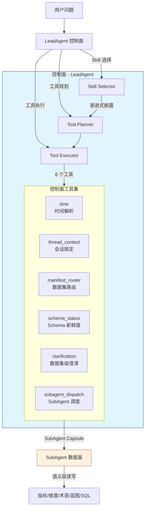
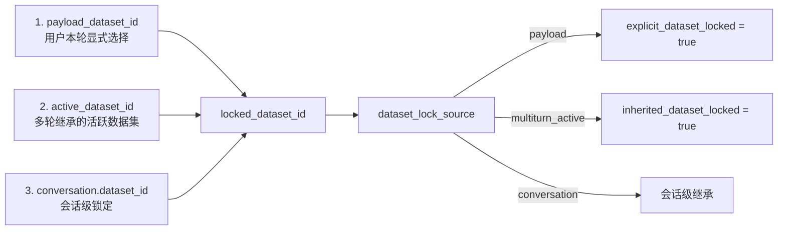
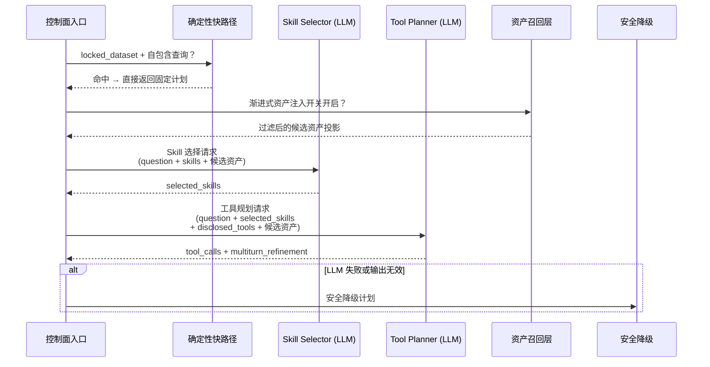
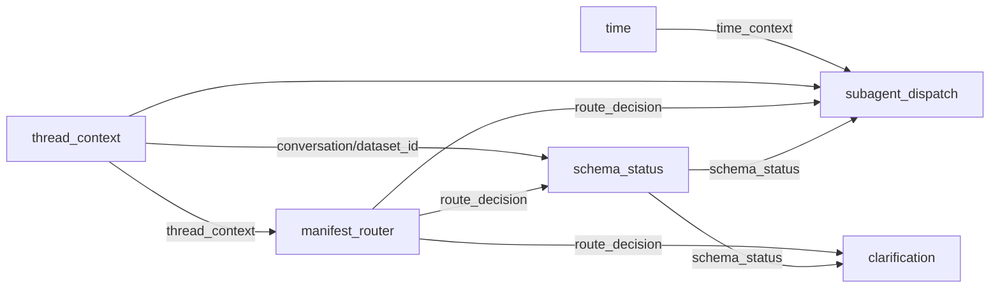
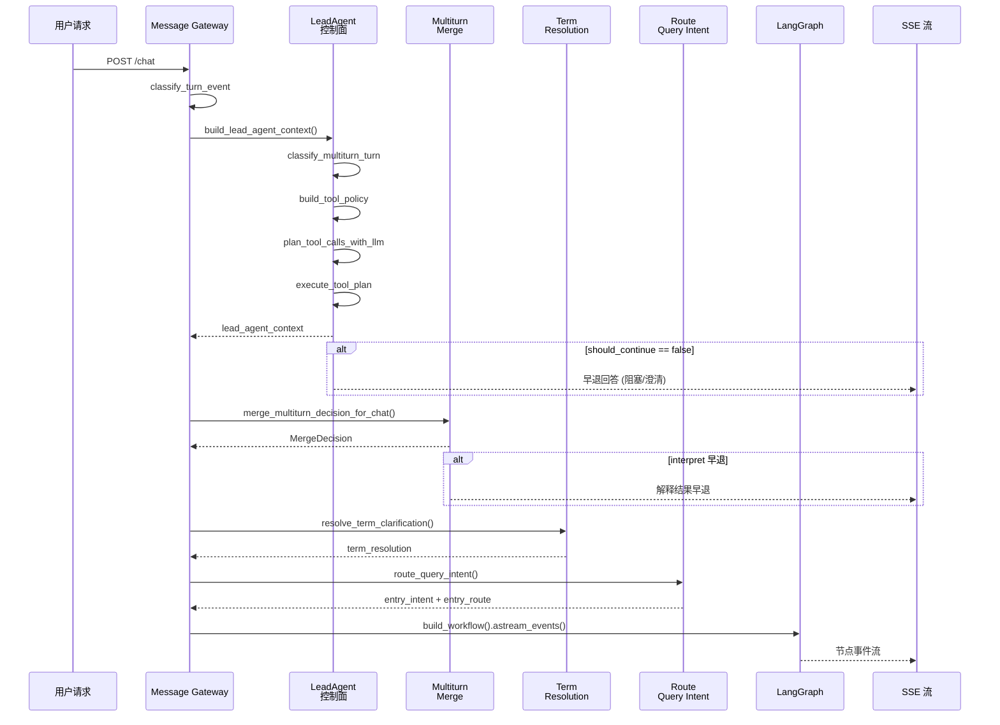

LeadAgent 是整个 Datalogue 问数系统的**控制面（Control Plane）编排器**——它是用户请求进入系统后的第一道决策边界，负责在不触及语义层内部资产（指标、维度、术语、蓝图）的前提下，完成数据集选择、时间解析、Schema 健康检查和 SubAgent 调度上下文的组装。它的核心职责可以概括为一句话：**决定「做什么数据集的什么问题、由谁来执行」，但绝不插手「怎么执行」**。

Sources: [lead_agent.py](app/services/lead_agent.py#L1-L19)

## 架构概览：控制面与数据面的隔离边界

LeadAgent 的设计遵循一个严格的架构原则：**控制面只读写会话级跨轮状态，数据面由 SubAgent 独立负责**。这一边界通过以下机制强制执行：



控制面工具被分为两类：`ALLOWED_LEAD_TOOLS`（允许的 7 个控制面工具）和 `BLOCKED_LEAD_TOOLS`（明确禁止的 8 个数据面工具，包括 `metric_resolution`、`dimension_resolution`、`term_normalization`、`sql_generate`、`sql_execute` 等）。这种白名单+黑名单双层约束确保 LLM 即使在幻觉情况下也无法越权。

Sources: [lead_agent.py](app/services/lead_agent.py#L81-L92)

LeadAgent 与 SubAgent 之间通过 **SubAgent Capsule**（状态胶囊）传递上下文——胶囊只包含 `dataset_id`、`manifest_version`、`bound_schema_version`、`multiturn_intent` 和 `execution_mode` 等控制面字段，明确声明 `state_boundary` 契约："LeadAgent 只持有跨轮控制面状态；SubAgent 只读写当前数据集内状态。"

Sources: [lead_agent.py](app/services/lead_agent.py#L1191-L1226)

## 技能体系：六大控制面技能

LeadAgent 将控制面能力建模为六个正交的 `LeadSkill`，每个技能绑定一组允许的工具。这种设计实现了**技能选择与工具规划的两阶段解耦**——先决定「激活哪些能力」，再决定「具体调用哪些工具」。

| 技能名称 | 用途 | 绑定工具 | 触发条件 |
|---|---|---|---|
| `TimeUnderstandingSkill` | 解析用户问题中的时间线索 | `time` | 几乎所有轮次 |
| `ConversationContinuitySkill` | 处理会话上下文和显式数据集锁定 | `thread_context` | **必选**（`required_tools`） |
| `DatasetRoutingSkill` | 选择或确认候选数据集 | `manifest_router`, `clarification` | 非闲聊轮次 |
| `SchemaFreshnessSkill` | 检查 Manifest 绑定 Schema 是否过期 | `schema_status` | 路由成功后 |
| `SubAgentDelegationSkill` | 判断是否把问题交给 SubAgent | `subagent_dispatch` | 数据集确认后 |
| `AuditSkill` | 记录工具规划和执行轨迹 | `audit_trace` | 所有轮次 |

Sources: [lead_agent.py](app/services/lead_agent.py#L94-L112)

每个技能只暴露给 Planner 当前 ToolPolicy 下实际可用的工具子集。例如，如果 `manifest_router` 因数据集已锁定而被策略限制，`DatasetRoutingSkill` 的 `allowed_tools` 将降级为仅包含 `clarification`。

Sources: [lead_agent.py](app/services/lead_agent.py#L155-L165)

## ToolPolicy：每轮动态生成的工具边界

`build_tool_policy()` 是 LeadAgent 的**硬约束生成器**——它在每一轮对话开始时，根据会话状态、载荷参数和多轮上下文动态计算本轮可用的工具集、禁止的工具集和必须执行的约束条件。

Sources: [lead_agent.py](app/services/lead_agent.py#L115-L153)

ToolPolicy 的核心决策点是 **`locked_dataset_id`** 的确定逻辑，它按三级优先级锁定：



六条硬性约束始终生效：LeadAgent 只能使用控制面工具；blocked_tools 中的工具即使被 LLM 规划也不能执行；未确认 dataset 时不可执行 `subagent_dispatch`；显式选择数据集时 `manifest_router` 只能锁定不能改选；多轮 `active_dataset_id` 仅作为继承锁定不代表用户选择；Schema stale 必须显式记录。

Sources: [lead_agent.py](app/services/lead_agent.py#L130-L141)

## 两阶段渐进式 LLM 规划

LeadAgent 的工具规划采用**渐进式披露（Progressive Disclosure）**策略：将规划过程分成 Skill Selection 和 Tool Planning 两个阶段，逐步向 LLM 披露更多信息，避免单次 Prompt 上下文过长导致注意力稀释。



Sources: [lead_agent.py](app/services/lead_agent.py#L298-L399)

### 确定性快路径：绕开 LLM 的固定计划

当数据集已锁定且问题是自包含的新查询（包含"查"、"统计"、"明细"等关键词且多轮分类为 `new`/`new_query`/`query`/`self_contained`）时，LeadAgent 跳过两次 LLM 调用，直接返回固定控制面计划：

Sources: [lead_agent.py](app/services/lead_agent.py#L233-L296)

```
工具序列：thread_context → manifest_router → schema_status → subagent_dispatch → audit_trace
```

这五个工具覆盖了锁定数据集场景下的最小必要控制面步骤——不需要时间解析（SubAgent 自行处理）、不需要澄清（数据集已明确）、不需要重新路由。快路径命中时，`llm_skipped_reason` 字段记录为 `locked_dataset_self_contained_query`，`planner_source` 标记为 `deterministic`。

### 渐进式语义资产注入（Phase 3）

当 `LEAD_AGENT_USE_PROGRESSIVE_ASSETS` 开关开启且数据集已锁定时，LeadAgent 会在两阶段规划前注入与问题相关的候选语义资产摘要，帮助 LLM 做出更准确的路由决策。这一流程包含三个子步骤：

**第一步：候选资产召回**。调用 `recall_candidate_assets()` 从已锁定数据集的 Manifest 中召回与问题相关的蓝图、指标、维度、术语、字段和表。

Sources: [lead_agent.py](app/services/lead_agent.py#L339-L357)

**第二步：资产过滤与脱敏**。`filter_lead_planner_assets()` 对召回结果执行六阶段处理流水线：

| 步骤 | 操作 | 说明 |
|---|---|---|
| 1. 去重 | 按 `(asset_type, asset_id)` 去重 | 保留置信度最高的一条 |
| 2. 类型白名单 | 仅保留 `CANDIDATE_ASSET_TYPES` 中的类型 | 过滤掉内部类型 |
| 3. 全局置信度截断 | `global_min_confidence`（默认 0.20） | 过滤低质量匹配 |
| 4. 类型级阈值 + Top-K | 按类型独立阈值和 Top-K 截断 | 蓝图 Top-3、指标 Top-5 |
| 5. 元信息脱敏 | 仅保留 `table_name/column_name/parameters/expr` | 防止语义层内部上下文泄漏 |
| 6. 信号截断 | 每条资产最多保留 3 条 match_signals | 减少 Token 消耗 |

Sources: [asset_filter.py](app/services/lead_agent_planning/asset_filter.py#L30-L92), [asset_filter_config.py](app/services/lead_agent_planning/asset_filter_config.py#L27-L55)

**第三步：分阶段投影**。`project_assets_for_lead_planner()` 根据规划阶段产出不同粒度的资产上下文：Skill Selection 阶段只输出类型统计摘要（Token 预算默认 600）；Tool Planning 阶段输出 Top 资产的详细元信息（Token 预算默认 800）。

Sources: [lead_agent_planner_projection.py](app/services/lead_agent_planner_projection.py#L178-L198)

### 输入投影契约

为降低 LLM 上下文复杂度，`build_skill_selector_input()` 和 `build_tool_planner_input()` 将原始上下文压缩为投影输入，包含三个核心维度：

- **`question`**：截断到 `max_text_chars * 2` 的问题文本
- **近期上下文摘要**：最近 N 轮的压缩摘要（默认 3 轮，每轮摘要不超过 360 字符）
- **候选技能/工具摘要**：仅包含 `name` + `description` + `parameters` 的轻量结构

Sources: [lead_agent_planner_projection.py](app/services/lead_agent_planner_projection.py#L92-L146)

投影前后的字符量差异通过 `build_projection_metrics()` 记录，包含 `raw_chars`、`projected_chars`、`projection_saved_chars` 三个指标，支撑灰度期观测和回退判断。

### 安全降级计划

当 LLM 不可用、返回无效 JSON、或工具规划阶段的输出无法解析时，LeadAgent 返回一个包含全部六个技能和七个工具调用的安全降级计划。降级计划与 LLM 计划的区别在于 `planner_fallback: true` 标记和 `fallback_reason` 字段：

Sources: [lead_agent.py](app/services/lead_agent.py#L168-L231)

| 降级原因 | 说明 |
|---|---|
| `lead_agent_llm_not_configured` | LLM 配置缺失 |
| `skill_selector_invalid_json` | Skill 选择器输出无法解析 |
| `planner_invalid_json` | 工具规划器输出无法解析 |
| `planner_llm_error` | LLM 调用异常 |
| `planner_incomplete_execution` | 执行结果不完整触发二次降级 |

当常规 LLM 计划执行后结果不完整（如缺少 `route_decision`），系统会自动执行**二次降级**：用 fallback 计划重新执行全部工具，并将两次的违规记录合并。

Sources: [lead_agent.py](app/services/lead_agent.py#L2168-L2188)

## 六工具执行引擎

`execute_tool_plan()` 按计划顺序执行允许的工具，在执行前进行策略合规检查，并在执行后调用 `validate_tool_execution()` 验证关键不变量。

Sources: [lead_agent.py](app/services/lead_agent.py#L1268-L1438)

### 执行顺序与依赖

工具执行存在隐式的数据依赖链——后续工具依赖前序工具的输出。执行引擎通过一个共享的 `results` 字典维护这一依赖：



### 各工具详解

**time 工具**（`resolve_time_context`）：纯确定性解析，不依赖 LLM。支持 ISO 日期范围提取、中文月份/年份识别、相对时间范围（今天/昨天/本周/上周/本月/上月/今年/去年）以及基于上一轮时间上下文的增量解析（如"再看上个月"）。

Sources: [lead_agent.py](app/services/lead_agent.py#L933-L974)

**thread_context 工具**（`resolve_thread_context`）：整理会话级锁定信息——`conversation_id`、`thread_id`、`user_id`、`payload_dataset_id`、`active_dataset_id` 和 `dataset_lock_source`。这是 ToolPolicy 中唯一的 `required_tools` 成员。

Sources: [lead_agent.py](app/services/lead_agent.py#L977-L1018)

**manifest_router 工具**：调用 `route_dataset_for_question()` 执行数据集路由决策。已锁定数据集时返回 `locked` 决策；未锁定时基于 current Manifest 的 `score_manifest_question` 评分自动选择（阈值 0.65、边距 0.12）。

Sources: [dataset_router.py](app/services/dataset_router.py#L51-L106)

**schema_status 工具**（`check_schema_status`）：比较 Manifest 绑定的 `bound_schema_version` 与当前数据库的 `build_dataset_schema_version()` 哈希值，检测 Schema 过期。同时调用 `evaluate_manifest_runtime_guard()` 检查 Manifest 的运行时守卫条件。

Sources: [lead_agent.py](app/services/lead_agent.py#L1021-L1109)

**clarification 工具**（`build_clarification`）：在以下三种场景生成数据集级澄清消息：Manifest Schema 过期（`manifest_stale`）、Manifest 运行时守卫阻断（`manifest_blocked`）、路由不明确（`ambiguous`）。

Sources: [lead_agent.py](app/services/lead_agent.py#L1112-L1152)

**subagent_dispatch 工具**（`build_subagent_dispatch`）：仅在 `route_decision` 为 `selected` 或 `locked` 且 Manifest 守卫状态为 `ok` 时生成调度上下文。产物包括 `question`、`dataset_id`、`manifest_version`、`bound_schema_version`、`time_context`、`thread_context` 和 `capsule`（SubAgent 状态胶囊）。

Sources: [lead_agent.py](app/services/lead_agent.py#L1155-L1188)

### 执行后验证

`validate_tool_execution()` 检查四个关键不变量：

Sources: [lead_agent.py](app/services/lead_agent.py#L1512-L1539)

| 不变量 | 违规信号 |
|---|---|
| `thread_context` 必须存在 | `required_tool_missing` |
| dispatch 必须伴随 route_decision | `dispatch_without_route` |
| dispatch 时 dataset 必须已确认 | `dispatch_without_confirmed_dataset` |
| 显式锁定数据集不可被路由改选 | `explicit_dataset_changed` |
| Schema stale 必须显式记录 | `stale_schema_not_recorded` |

## 多轮追问理解与抽象槽位

LeadAgent 的 Tool Planner 在处理承接上一轮查询的追问时，需要输出 `multiturn_refinement` 结构——用**抽象业务槽位**表达用户新增约束，而不是直接输出数据库字段名。这一设计保证了控制面与数据面的隔离边界：LeadAgent 只负责理解「用户想按什么人/什么时间/什么状态过滤」，具体字段绑定由 SubAgent 完成。

Sources: [prompts/lead_agent.py](app/prompts/lead_agent.py#L89-L95)

八个抽象槽位定义：

| 槽位 | 类型 | 示例值 |
|---|---|---|
| `person` | string/null | "张三" |
| `account` | string/null | "zhangsan@example.com" |
| `department` | string/null | "技术部" |
| `project` | string/null | "Datalogue" |
| `status` | string/null | "已完成" |
| `time_range` | object/null | `{label: "上月", start_date: ..., end_date: ...}` |
| `limit` | int/null | 10 |
| `sort` | string/null | "desc" |

当 LLM 未能产出有效的追问理解时，`_fallback_multiturn_refinement()` 提供安全兜底：从上一轮成功任务的过滤摘要中提取人名槽位，从时间解析结果中提取时间范围槽位，置信度标记为 0.62。

Sources: [lead_agent.py](app/services/lead_agent.py#L1936-L1999)

## 入口路由集成：chat.py 中的编排时序

LeadAgent 在 `chat.py` 的 SSE 流式端点中按以下时序被调用，形成了「控制面决策 → 早退判定 → LangGraph 执行」的三段式流水线：



Sources: [chat.py](app/api/chat.py#L1385-L1700)

关键决策点：

1. **`build_lead_agent_context()` 返回后**：若 `should_continue == false`（路由阻塞、Schema stale、Manifest 守卫阻断），直接生成早退回答，不进 LangGraph。

2. **多轮合并后**：若 `merge_decision.interpret_payload is not None`（用户要求解释上一轮结果），走解释早退路径。

3. **入口路由后**：若 `entry_route` 为 `direct_answer`（闲聊）、`reject`（拒答）、`clarify`（澄清）或 `knowledge_qa`（知识库问答），触发 `_early_route_return` 早退。

Sources: [chat.py](app/api/chat.py#L1436-L1502)

## 资产过滤配置的三级优先级

渐进式资产注入的过滤参数通过 `build_filter_config()` 按三级优先级合并：

Sources: [asset_filter_config.py](app/services/lead_agent_planning/asset_filter_config.py#L107-L138)

| 优先级 | 来源 | 说明 |
|---|---|---|
| 1（最高） | 运行时显式覆盖 | 调用方传入的 `explicit_overrides` 字典 |
| 2 | 数据集级覆盖 | `SemanticDataset.planner_config.asset_filter`（当前为兼容性占位） |
| 3 | Settings 环境变量 | `LEAD_AGENT_PROGRESSIVE_ASSET_*` 系列配置 |
| 4（默认） | 代码默认值 | `AssetFilterConfig` 类字段默认值 |

这种设计允许运维在不同粒度（全局→数据集→单次调用）调整过滤策略，例如对 Schema 复杂的核心数据集放宽字段级 Top-K，对探索性数据集收紧置信度阈值。

## 与上下游的契约接口

LeadAgent 向上游（`chat.py`）暴露两个公开函数，向下游（SubAgent）通过 Capsule 传递上下文：

| 方向 | 接口 | 说明 |
|---|---|---|
| 上游 | `build_lead_agent_context()` | 完成 Skill 选择、工具规划与执行的完整控制面流程 |
| 上游 | `merge_multiturn_decision_for_chat()` | 在 LangGraph 之外完成多轮合并决策（Phase 2 上提） |
| 下游 | `build_subagent_capsule()` | 生成 SubAgent 状态胶囊，传递 `dataset_id` + `manifest_version` + `execution_mode` |

向上游返回的 `lead_agent_context` 字典包含 30+ 个字段，覆盖了从原始问题到最终调度决策的完整决策链路。下游 LangGraph 工作流通过 `initial_state` 接收这些字段，无需再次执行控制面逻辑。

Sources: [lead_agent.py](app/services/lead_agent.py#L2191-L2261), [lead_agent.py](app/services/lead_agent.py#L2534-L2587)

## 进一步阅读

- 控制面的上游入口：[入口路由与意图分类：从用户问题到执行路径的一次性决策](10-ru-kou-lu-you-yu-yi-tu-fen-lei-cong-yong-hu-wen-ti-dao-zhi-xing-lu-jing-de-ci-xing-jue-ce)
- SubAgent 的调度与执行：[SubAgent 调度协议：进程内与远程 Runner 的双模执行](11-subagent-diao-du-xie-yi-jin-cheng-nei-yu-yuan-cheng-runner-de-shuang-mo-zhi-xing)
- 多轮上下文的构建与合并：[多轮上下文构建器：追问识别、时间增量解析与胶囊合并](20-duo-lun-shang-xia-wen-gou-jian-qi-zhui-wen-shi-bie-shi-jian-zeng-liang-jie-xi-yu-xiao-nang-he-bing)
- 候选资产召回的下游系统：[候选资产召回：多类型语义资产的统一检索与置信度排序](16-hou-xuan-zi-chan-zhao-hui-duo-lei-xing-yu-yi-zi-chan-de-tong-jian-suo-yu-zhi-xin-du-pai-xu)
- LangGraph 工作流装配：[LangGraph 工作流装配：节点注册、条件路由与重试逻辑](7-langgraph-gong-zuo-liu-zhuang-pei-jie-dian-zhu-ce-tiao-jian-lu-you-yu-zhong-shi-luo-ji)