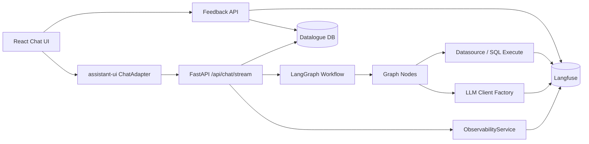

# Langfuse 可观测能力开发文档

## 1. 文档信息

- 文档用途：定义数语接入 Langfuse 的技术架构、模块拆分、数据模型、接口、实施步骤和测试方案。
- 适用代码库：`/Users/yangkai/code_place/study/python/Datalogue`
- 当前后端形态：FastAPI + SQLAlchemy + LangGraph + LangChain OpenAI-compatible 客户端。
- 当前前端形态：React + assistant-ui adapter + SSE。
- 相关现有入口：
  - `datalogue-api/app/api/chat.py`
  - `datalogue-api/app/graph/workflow.py`
  - `datalogue-api/app/graph/nodes.py`
  - `datalogue-api/app/graph/llm.py`
  - `datalogue-api/app/services/llm_config.py`
  - `datalogue-web/src/assistant/chat-adapter.js`
  - `datalogue-web/src/components/chat-page.jsx`
  - `datalogue-web/src/assistant/Thread.jsx`

## 2. 总体架构



设计原则：

- 业务链路优先：Langfuse 写入失败只记录 warning，不中断问数。
- 封装集中：所有 Langfuse SDK 调用集中在 `app/services/observability.py` 和少量装饰器/上下文工具中。
- 先通道后高级能力：第一阶段先把 trace、session、score、prompt metadata、cost metadata 打通。
- 本地可关闭：通过环境变量完整关闭 Langfuse，测试和离线部署不受影响。
- 敏感信息默认脱敏：统一在服务层做摘要、hash、截断，不在节点里散落处理。

## 3. 后端模块设计

### 3.1 配置项

建议在 `app/core/config.py` 增加：

| 配置 | 默认值 | 说明 |
| --- | --- | --- |
| `LANGFUSE_ENABLED` | `false` | 是否启用 Langfuse |
| `LANGFUSE_PUBLIC_KEY` | 空 | Langfuse public key |
| `LANGFUSE_SECRET_KEY` | 空 | Langfuse secret key |
| `LANGFUSE_HOST` | 空 | 私有化或云端地址 |
| `LANGFUSE_ENVIRONMENT` | `dev` | 环境标签 |
| `LANGFUSE_RELEASE` | `local` | 后端版本标签 |
| `LANGFUSE_PROMPT_LABEL` | `production` | 默认 Prompt 标签 |
| `LANGFUSE_CAPTURE_INPUT` | `true` | 是否采集输入正文 |
| `LANGFUSE_CAPTURE_OUTPUT` | `true` | 是否采集输出正文 |
| `LANGFUSE_MAX_TEXT_LENGTH` | `4000` | 单字段最大采集长度 |
| `LANGFUSE_FLUSH_AT_END` | `true` | 请求结束后是否 flush |

### 3.2 新增服务：ObservabilityService

新增文件：`datalogue-api/app/services/observability.py`

职责：

- 初始化 Langfuse client。
- 创建 trace/session 上下文。
- 创建节点 span、LLM generation、SQL span。
- 写入 score。
- 拉取 Prompt。
- 统一处理禁用、异常、脱敏、截断。

核心接口建议：

```python
class ObservabilityService:
    def enabled(self) -> bool: ...
    def create_trace_context(self, *, conversation_id: int, question: str, metadata: dict) -> TraceContext: ...
    def start_node_span(self, trace_context: TraceContext, *, node: str, input: dict | None = None): ...
    def start_sql_span(self, trace_context: TraceContext, *, sql: str, metadata: dict): ...
    def record_generation(self, *, trace_context: TraceContext, name: str, model: str, messages: list, output: str, usage: dict, metadata: dict): ...
    def score_trace(self, *, trace_id: str, name: str, value, data_type: str, comment: str | None = None, metadata: dict | None = None): ...
    def get_prompt(self, *, key: str, label: str | None = None, fallback: str): ...
    def flush(self) -> None: ...
```

实现要点：

- `enabled=false` 时返回 no-op 对象，调用方不用写大量 if。
- trace_id 使用 Langfuse 生成值，同时写回 `final_payload` 和本地消息 metadata。
- `session_id` 格式：`datalogue-conv-{conversation_id}`。
- metadata 统一通过 `build_trace_metadata(state, payload, conv)` 生成。
- 文本字段通过 `sanitize_observability_payload` 截断和脱敏。

### 3.3 Chat API 接入点

现有 `_stream_chat` 是最合适的 trace 根入口。

改造建议：

1. 创建或读取会话后，构造 `trace_context`。
2. `initial_state` 增加：
   - `langfuse_trace_id`
   - `langfuse_session_id`
   - `observability_context`
3. `astream_events` 中节点 running/done 时同步写 node span。
4. final_payload 增加：
   - `langfuse_trace_id`
   - `langfuse_session_id`
5. 保存 assistant message 时写入 `response_metadata.langfuse`。

建议 metadata：

```json
{
  "langfuse": {
    "trace_id": "trace_xxx",
    "session_id": "datalogue-conv-123",
    "environment": "dev",
    "release": "local",
    "prompt_label": "production"
  }
}
```

注意：

- 当前 `_stream_chat` 在 yield final 后才保存 assistant message，反馈功能需要拿到 message_id。可以二期把保存前移，或新增 feedback API 支持通过 `conversation_id + trace_id` 定位最后一条 assistant 消息。
- SSE 事件先保持兼容，新增字段只放在 final 和 metadata 中，不破坏前端现有解析。

### 3.4 LangGraph 节点埋点

短期策略：优先在 `chat.py` 的 `astream_events` 层基于节点开始/结束事件埋 span，避免侵入每个节点。

中期策略：对关键节点内部细分埋点：

- `schema_recall_node`：字段召回、schema_context token、召回表/字段数量。
- `dsl_generate_node`：Prompt key、Prompt version、DSL 输出、token usage。
- `dsl_validate_node`：校验错误、资产缺失。
- `sql_execute_node`：SQL hash、执行耗时、行列数量、数据源方言。
- `sql_audit_node`：诊断类型、是否可重试、重试次数。
- `report_generator_node`：回答生成模型、answer_explanation。

推荐先不在每个节点直接调用 Langfuse SDK，而是注入 `observability_context` 后通过 helper：

```python
with observe_node(state, "dsl_generate", input={"question": state["question"]}) as span:
    output = ...
    span.update(output=summarize_output(output))
```

### 3.5 LLM Generation 埋点

当前 `app/graph/llm.py` 统一创建 `ChatOpenAI`，但 LangChain 调用分散在节点里。

第一阶段可采用两种方案：

- 方案 A：使用 Langfuse 的 OpenAI-compatible instrumentation，只对直接 OpenAI SDK 调用最省事，但当前代码使用 LangChain `ChatOpenAI`，适配成本需要验证。
- 方案 B：在 `_safe_llm_invoke` 里统一记录 generation，适合当前代码，因为大多数 LLM 调用都经过该函数。

建议选方案 B。

需要改造 `_safe_llm_invoke`：

- 增加参数：`state`、`role`、`prompt_key`、`prompt_version`。
- 调用前记录 messages 摘要。
- 调用后记录 output、usage、model、error。
- 保持返回 `(response, error_str)` 不变。

注意：部分节点可能直接 `llm.invoke`，需用 `rg "llm.invoke|ainvoke"` 全量检查并统一收口。

### 3.6 Prompt Manager 接入

新增文件：`datalogue-api/app/services/prompt_registry.py`

职责：

- 定义 prompt key 到本地 fallback builder 的映射。
- 从 Langfuse 拉取 prompt。
- 编译 prompt 参数。
- 返回 prompt metadata。

建议返回结构：

```python
@dataclass
class ResolvedPrompt:
    key: str
    source: str
    label: str
    version: str | None
    template: str
    compiled: str
```

第一批迁移顺序：

1. `sql_audit`：影响范围较小，便于验证。
2. `report_generate`：输出可人工观察。
3. `intent_router`：需要配合 dataset 回归。
4. `dsl_generate.*`：影响最大，必须在 golden set 初步稳定后迁移。

兜底策略：

- Langfuse 拉取失败：使用本地模板，trace metadata 记录 `prompt_source=fallback`。
- Langfuse 模板变量缺失：拒绝使用远程模板，回退本地模板，并记录错误。
- Prompt 返回空：回退本地模板。

### 3.7 Scores 和反馈 API

新增后端接口建议：

- `POST /api/messages/{message_id}/feedback`
- `GET /api/messages/{message_id}/feedback`

请求体：

```json
{
  "trace_id": "trace_xxx",
  "score": 1,
  "reason": "wrong_sql",
  "comment": "时间范围不对"
}
```

响应体：

```json
{
  "message_id": 123,
  "trace_id": "trace_xxx",
  "score": 1,
  "reason": "wrong_sql",
  "submitted_at": "2026-06-10T13:18:00"
}
```

本地持久化建议：

- 最小实现：写入 `Message.response_metadata.feedback`。
- 企业级实现：新增 `message_feedback` 表，支持审计、修改历史和队列状态。

建议表结构：

| 字段 | 类型 | 说明 |
| --- | --- | --- |
| `id` | int | 主键 |
| `message_id` | int | assistant message |
| `conversation_id` | int | 会话 |
| `langfuse_trace_id` | string | trace |
| `score` | int | 1/0 |
| `reason` | string | 原因枚举 |
| `comment` | text | 用户备注 |
| `status` | string | `submitted` / `queued` / `resolved` |
| `created_at` | datetime | 创建时间 |
| `updated_at` | datetime | 更新时间 |

### 3.8 前端反馈入口

改造位置：

- `datalogue-web/src/assistant/chat-adapter.js`：接收 final 中的 `langfuse_trace_id` 并放入 `metadata.custom`。
- `datalogue-web/src/assistant/Thread.jsx` 或 AI 消息渲染组件：展示点赞/点踩按钮。
- `datalogue-web/src/api/client.js`：新增 feedback API。

交互：

- 未反馈：显示点赞、点踩图标按钮。
- 点击点踩：弹出原因选择和可选文本。
- 提交中：按钮 disabled。
- 已反馈：显示已提交状态，可允许修改。

前端 metadata 建议：

```js
metadata: {
  custom: {
    langfuseTraceId: finalPayload.langfuse_trace_id || null,
    langfuseSessionId: finalPayload.langfuse_session_id || null,
    feedback: finalPayload.feedback || null
  }
}
```

### 3.9 Datasets + Evaluations

新增目录建议：

- `datalogue-api/evals/datasets/`
- `datalogue-api/evals/tasks/`
- `datalogue-api/evals/evaluators/`
- `datalogue-api/scripts/run_langfuse_eval.py`

最小评测脚本职责：

- 从 Langfuse 拉取 dataset。
- 对每条 item 调用本地问数核心函数。
- 输出 route、DSL、SQL、answer。
- 执行 evaluator。
- 将 evaluation score 写回 Langfuse。

为了避免必须启动 SSE，建议抽出可复用服务：

- `app/services/chat_runner.py`
- 提供 `run_chat_once(payload, db) -> ChatRunResult`
- `chat.py` SSE 和 eval 脚本共享该服务。

如果暂时不重构，可先通过 FastAPI TestClient 调 `/api/chat/stream`，但评测解析 SSE 会更脆弱。

### 3.10 Cost Tracking

实现重点：

- 在 generation metadata 中记录 `model_role`。
- 汇总 `_extract_token_usage` 当前已有 token_usage，补齐 prompt/completion/total。
- 对无法从模型返回 cost 的私有模型，维护本地价格表或标记 `cost_estimated=false`。
- trace metadata 打全租户、部门、数据集、指标、路径。

新增配置建议：

```json
{
  "model_price": {
    "gpt-4o": {"input_per_1m": 2.5, "output_per_1m": 10},
    "qwen-plus": {"input_per_1m": 0, "output_per_1m": 0}
  }
}
```

### 3.11 Annotation Queue

第一阶段不强依赖 Langfuse Annotation Queue API，可先做候选队列数据。

本地表建议：`trace_annotation_candidate`

| 字段 | 说明 |
| --- | --- |
| `id` | 主键 |
| `langfuse_trace_id` | trace |
| `conversation_id` | 会话 |
| `message_id` | 消息 |
| `reason` | 入队原因 |
| `priority` | 优先级 |
| `status` | `pending` / `annotating` / `done` / `ignored` |
| `assignee_id` | 标注人 |
| `annotation_payload` | 标注结果 |

入队时机：

- feedback API 收到点踩。
- chat final 发现 SQL 失败、DSL 校验失败、自动修复失败。
- judge 定时任务发现低分。

### 3.12 LLM-as-Judge 定时任务

建议新增：

- `app/services/evaluation/judge.py`
- `scripts/run_daily_langfuse_judge.py`

流程：

1. 通过 Langfuse API 查询昨日 trace 样本。
2. 分层采样：租户、entry_route、dataset_id、generation_mode。
3. 调用 judge 模型角色。
4. 结构化输出 score。
5. 写 Langfuse score。
6. 低分写本地 annotation candidate。

Judge 输出 schema：

```json
{
  "overall": 0.82,
  "semantic_accuracy": 0.8,
  "answer_groundedness": 0.9,
  "time_range_correct": true,
  "field_reference_valid": true,
  "reason": "答案基于 SQL 结果，但缺少同比解释"
}
```

### 3.13 Releases / Webhooks / 报表 / Playground

Releases：

- 后端启动时读取 `APP_VERSION` 或 git sha。
- Prompt 包版本可先用 `LANGFUSE_PROMPT_LABEL` + prompt version 组合。
- trace tags 添加 `backend:{version}`、`prompt:{label}`。

Webhooks：

- 优先让 Langfuse 触发 webhook。
- 数语侧提供 `/api/observability/webhooks/langfuse` 接收事件。
- 事件入库后由现有飞书/企业微信发送器推送。

客户侧报表：

- 新增 `app/services/observability_report.py`。
- 通过 Langfuse Metrics API 拉聚合数据。
- 数语本地补充租户、部门、用户中文名。
- 前端设置或运营页新增“AI 运营报表”。

Playground：

- 第一阶段只保存 Langfuse trace 链接。
- 第二阶段在管理端展示“在 Langfuse 打开”。
- 如果私有部署不可外链，需要做权限和内网域名配置。

## 4. 数据模型变更建议

### 4.1 最小模型变更

如果要快速落地，优先复用 `Message.response_metadata`：

```json
{
  "langfuse": {
    "trace_id": "trace_xxx",
    "session_id": "datalogue-conv-1"
  },
  "feedback": {
    "score": 1,
    "reason": "wrong_sql",
    "comment": "xxx",
    "updated_at": "..."
  }
}
```

优点：无需迁移即可验证闭环。

缺点：后续统计和审计不方便。

### 4.2 企业级模型变更

建议新增三张表：

- `message_feedback`
- `observability_trace_index`
- `trace_annotation_candidate`

`observability_trace_index` 用于本地快速查 trace：

| 字段 | 说明 |
| --- | --- |
| `id` | 主键 |
| `langfuse_trace_id` | trace |
| `langfuse_session_id` | session |
| `conversation_id` | 会话 |
| `message_id` | assistant message |
| `dataset_id` | 数据集 |
| `entry_route` | 路径 |
| `status` | success/failed |
| `total_tokens` | token |
| `total_cost` | 成本 |
| `created_at` | 创建时间 |

## 5. API 设计

### 5.1 Chat final 扩展

`/api/chat/stream` 的 final event 增加：

```json
{
  "type": "final",
  "langfuse_trace_id": "trace_xxx",
  "langfuse_session_id": "datalogue-conv-123",
  "observability": {
    "enabled": true,
    "environment": "dev",
    "release": "local"
  }
}
```

### 5.2 Feedback API

`POST /api/messages/{message_id}/feedback`

校验：

- message 必须存在且 role 为 assistant。
- trace_id 必须和 message metadata 匹配，或由后端从 metadata 补齐。
- score 只能为 0 或 1。
- reason 必须在枚举内。

错误码：

- 404：消息不存在。
- 400：不是 assistant 消息。
- 409：trace_id 不匹配。
- 503：Langfuse 不可用但本地已保存时，返回 `partial_success=true`。

### 5.3 Observability Report API

后续新增：

- `GET /api/observability/summary`
- `GET /api/observability/costs`
- `GET /api/observability/quality`
- `GET /api/observability/failures`

参数：

- `tenant_id`
- `dataset_id`
- `from`
- `to`
- `entry_route`

## 6. 实施计划

### Step 1：基础封装

- 增加 Langfuse 依赖和配置。
- 新增 `ObservabilityService` no-op + real client。
- 增加单元测试覆盖 enabled/disabled、异常降级、脱敏。

### Step 2：Chat Trace + Session

- `_stream_chat` 创建 trace/session。
- final_payload 返回 trace_id/session_id。
- assistant message metadata 保存 Langfuse 信息。
- LangGraph 节点 span 先基于 `astream_events` 写入。

### Step 3：LLM Generation

- 改造 `_safe_llm_invoke`。
- 检查所有 LLM 调用路径统一传 role/prompt_key。
- 记录 token_usage 和 prompt metadata。

### Step 4：Prompt Manager

- 新增 `prompt_registry.py`。
- 先迁移 `sql_audit` 和 `report_generate`。
- 增加本地 fallback 和 prompt 拉取失败测试。

### Step 5：Scores

- 后端新增 feedback API。
- 前端 AI 消息加点赞/点踩。
- 写 Langfuse score 和本地 metadata。

### Step 6：Datasets + Eval

- 建立三路径 dataset 命名和样本模板。
- 新增最小 eval 脚本。
- CI 增加可选 job，默认用环境变量开启。

### Step 7：Cost + 报表

- 补齐 metadata。
- 增加 metrics 查询服务。
- 管理端展示基础成本和质量趋势。

### Step 8：Annotation + Judge

- 新增候选队列表。
- 点踩和低分 trace 自动入队。
- 每日 judge 脚本写 score。

## 7. 测试方案

### 7.1 后端单元测试

- Langfuse disabled 时所有 API 正常。
- Langfuse client 抛异常时问数不中断。
- trace metadata 字段齐全。
- Prompt 拉取失败走 fallback。
- feedback API 能写本地 metadata。
- feedback API 调用 score 失败时返回 partial success。

### 7.2 集成测试

- 使用 mock Langfuse client 跑 `/api/chat/stream`。
- 断言创建 trace、session、节点 span、final trace_id。
- 点赞/点踩后断言 score 调用。
- Prompt 版本切换后 generation metadata 变化。

### 7.3 前端测试

- final metadata 能进入 assistant-ui message custom metadata。
- AI 消息显示反馈按钮。
- 点踩原因弹层可提交。
- 刷新历史消息后反馈状态仍展示。

### 7.4 手工验收

- 打开本地聊天页，完成一次 QueryGraph 问数。
- 在 Langfuse 查看 trace，确认节点、LLM、SQL 和 final output。
- 同一会话追问第二轮，确认同 session。
- 对回答点踩，确认 score 出现在 trace 下。
- 断开 Langfuse 配置，确认问数仍可成功。

## 8. 安全与脱敏

必须脱敏：

- API Key、数据库密码、连接串密码。
- 用户手机号、身份证号等高敏字段。
- 大结果集 rows，默认只记录 row_count、columns、前 N 行摘要。
- SQL 中的敏感字面量可 hash 或截断。

建议策略：

- `sanitize_text(value, max_length=4000)`
- `sanitize_sql(sql)`：保留结构，隐藏长字符串字面量。
- `summarize_rows(rows, limit=5)`：只采样前 5 行。
- `hash_sql(sql)`：用于聚合相同 SQL。

## 9. 运维部署

环境变量示例：

```bash
LANGFUSE_ENABLED=true
LANGFUSE_HOST=https://langfuse.example.com
LANGFUSE_PUBLIC_KEY=pk-lf-xxx
LANGFUSE_SECRET_KEY=sk-lf-xxx
LANGFUSE_ENVIRONMENT=prod
LANGFUSE_RELEASE=2.0.2
LANGFUSE_PROMPT_LABEL=production
```

部署检查：

- 后端启动时打印 Langfuse enabled、host、environment，但不打印 secret。
- 健康检查不依赖 Langfuse。
- Langfuse 网络异常只降级观测能力。
- 私有化部署需要确认服务端时间同步，否则 trace 时间线会错乱。

## 10. 兼容性与迁移

- 历史消息没有 trace_id，反馈按钮应隐藏或提示“历史消息暂不支持反馈”。
- 已有 `token_usage` 继续保留，Langfuse cost 作为增强来源。
- 已有 SSE step 展示不改协议，只追加字段。
- Prompt Manager 迁移必须逐个 prompt 灰度，不一次性替换全部核心模板。

## 11. 开发检查清单

- [ ] Langfuse 配置可开关。
- [ ] `ObservabilityService` 有 no-op 实现。
- [ ] Chat final 返回 `langfuse_trace_id`。
- [ ] Message metadata 保存 trace/session。
- [ ] 节点 span 覆盖所有 `_NODE_DISPLAY_NAMES`。
- [ ] LLM generation 记录 role/model/prompt/token。
- [ ] Prompt 拉取失败有 fallback。
- [ ] feedback API 写本地和 Langfuse score。
- [ ] 前端消息反馈状态可刷新恢复。
- [ ] 三路径 golden set 有样本模板。
- [ ] Eval 脚本可在无 Langfuse 时跳过。
- [ ] 敏感字段脱敏测试通过。

## 12. 后续任务拆分建议

| 任务 | 类型 | 预估 | 说明 |
| --- | --- | --- | --- |
| T-LF-001 Langfuse 配置与服务封装 | 后端 | 1d | no-op + real client + 测试 |
| T-LF-002 Chat Trace/Session 接入 | 后端 | 1.5d | `_stream_chat` 根 trace 和节点 span |
| T-LF-003 LLM Generation 埋点 | 后端 | 1d | `_safe_llm_invoke` 统一记录 |
| T-LF-004 Prompt Manager 首批迁移 | 后端 | 2d | `sql_audit`、`report_generate` |
| T-LF-005 用户反馈 Score 闭环 | 前后端 | 2d | API + UI + score |
| T-LF-006 三路径 Golden Set 和 Eval 脚本 | 后端/测试 | 2d | dataset 模板 + CI 可选任务 |
| T-LF-007 成本归因和报表接口 | 后端/前端 | 2d | metrics 查询 + 管理端基础展示 |
| T-LF-008 标注队列和 Judge | 后端/运营 | 3d | 入队规则 + 每日采样 |
| T-LF-009 Releases/Webhooks/Playground | 全栈 | 2d | 版本标签、告警、跳转 |
