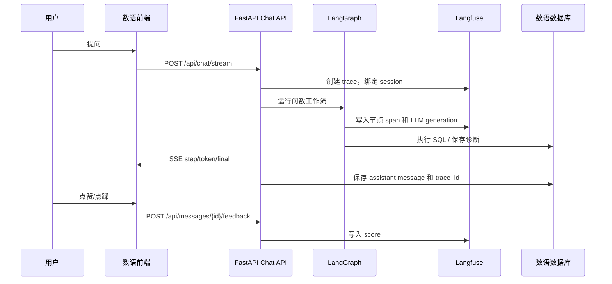

# Langfuse 可观测能力需求设计文档

## 1. 文档信息

- 文档用途：定义数语接入 Langfuse 后的产品目标、能力范围、用户流程、数据口径和验收标准。
- 适用范围：数语 ChatBI、多 Agent 问数链路、Prompt 管理、生产质量反馈、政企交付报表。
- 目标读者：产品、研发、测试、交付、数据分析师。
- 当前结论：Trace 和 Prompt Manager 是第一层地基；第一阶段必须同时打通 Sessions、Scores、Datasets + Evaluations、Cost Tracking 的数据通道，后续能力才能低成本扩展。
- 官方资料参考：
  - Langfuse Docs：<https://github.com/langfuse/langfuse-docs>
  - Langfuse Python SDK：<https://github.com/langfuse/langfuse-python>
  - Sessions 文档源：<https://github.com/langfuse/langfuse-docs/blob/main/content/docs/observability/features/sessions.mdx>
  - OpenAI SDK 集成示例源：<https://github.com/langfuse/langfuse-docs/blob/main/content/guides/cookbook/integration_openai_sdk.mdx>

## 2. 背景与问题

数语当前问数链路已经具备基础执行轨迹：前端通过 SSE 展示节点步骤，后端在 `Message.step_trace`、`response_metadata`、`token_usage` 中保存执行结果和部分过程数据。但这些数据主要服务单次会话调试，还不能形成生产级质量闭环。

当前主要缺口：

- 缺少统一外部 Trace，难以跨节点、跨 LLM 调用、跨 SQL 执行聚合查看。
- Prompt 仍以代码内模板和环境配置为主，缺少版本管理、审批发布、灰度回放。
- 多轮会话未按 Langfuse Session 聚合，无法按“一次完整分析意图”统计成本、耗时和质量。
- 用户反馈没有绑定到具体 trace，无法把“好/差”转成持续改进样本。
- Golden set、自动评测、标注队列和成本报表尚未闭环。
- 政企交付需要可汇报的质量、成本、满意度、故障趋势，不能只让客户登录 Langfuse 后台。

## 3. 建设目标

### 3.1 产品目标

- 让每次问数可回放：从用户问题、会话、数据集、蓝图/术语命中、Prompt、LLM 输出、DSL、SQL、执行结果到最终回答，都能在一个 trace 中串起来。
- 让 Prompt 变更可治理：支持版本、标签、环境、灰度、回滚和评测对比。
- 让生产质量可量化：用户反馈、自动 judge、人工标注和 golden set 回归都沉淀为 score。
- 让交付价值可汇报：按租户、部门、数据集、指标、路径统计成功率、成本、满意度、质量趋势。
- 让后续优化可自动化：低分 trace 自动进入标注队列，标注结果回流 dataset，dataset 参与 CI 和每日持续评测。

### 3.2 非目标

- 第一阶段不要求把 Langfuse 后台完整嵌入数语管理端。
- 第一阶段不要求客户直接使用 Langfuse UI。
- 第一阶段不替代现有日志、数据库审计和 SQL 安全校验。
- 第一阶段不把所有历史消息补录到 Langfuse，只保证新流量完整采集。

## 4. 用户角色

| 角色 | 关注点 | 典型行为 |
| --- | --- | --- |
| 终端问数用户 | 回答是否准确、是否有用 | 对 AI 回答点赞/点踩，补充反馈原因 |
| 数据分析师 | 语义层和 SQL 是否正确 | 标注低分 trace，修正期望 DSL/SQL/答案 |
| 产品/算法同学 | Prompt 和 Agent 质量 | 调整 prompt，回放 dataset，比较版本质量 |
| 研发 | 链路异常和性能瓶颈 | 查看 trace、节点耗时、异常栈、token 成本 |
| 交付/客户成功 | 政企汇报和运营趋势 | 导出月报，查看满意度、成本、失败原因 |
| 管理员 | 环境、权限、发布 | 配置 Langfuse 项目、密钥、Prompt 发布策略 |

## 5. 总体能力清单与优先级

| 阶段 | 能力 | 优先级 | 核心价值 | 首次落地形态 |
| --- | --- | --- | --- | --- |
| 第一阶段 | Trace | P0 | 全链路可观测地基 | 后端自动记录每轮问数 trace |
| 第一阶段 | Prompt Manager | P0 | Prompt 版本治理 | 关键 Prompt 从 Langfuse 拉取，支持本地兜底 |
| 第一阶段 | Sessions | P0 | 多轮分析聚合 | `conversation_id` 映射 `session_id` |
| 第一阶段 | Scores | P0 | 用户反馈闭环 | AI 消息点赞/点踩并写入 Langfuse score |
| 第一阶段 | Datasets + Evaluations | P1 | 客观质量基线 | 三路径 golden set + CI 回归 |
| 第一阶段 | Cost Tracking | P1 | 政企成本归因 | metadata 打全租户/部门/指标/路径 |
| 第二阶段 | Annotation Queues | P1 | 人工标注飞轮 | 低分和高风险 trace 入队 |
| 第二阶段 | LLM-as-Judge 持续评测 | P1 | 线上质量巡检 | 每日采样生产 trace 跑 judge |
| 第二阶段 | Releases | P2 | 版本质量对比 | 后端版本和 Prompt 包版本打 tag |
| 第三阶段 | Webhooks | P2 | 关键异常告警 | SQL 连续失败、p99 延迟升高告警 |
| 第三阶段 | Public API + 客户侧报表 | P2 | 客户自有汇报口径 | 数语后台拉取 Langfuse 指标生成月报 |
| 第三阶段 | Playground | P3 | Prompt 调试效率 | 从 trace 跳转到 Langfuse Playground |

## 6. 功能需求

### 6.1 Trace 全链路追踪

目标：每一次用户问数请求生成一个 Langfuse trace，所有 Agent 节点、LLM 调用、SQL 执行、报告生成都作为 observation 挂到同一 trace 下。

需求：

- trace 名称按入口路径命名，例如 `chat.query_graph`、`chat.analysis_blueprint`、`chat.clarification`。
- trace 输入包含用户问题、会话 ID、数据集 ID、历史摘要和澄清回复。
- trace 输出包含最终 answer、DSL、SQL、SQL 结果摘要、失败诊断、回答解释包。
- 每个 LangGraph 节点记录 span：开始时间、结束时间、耗时、输入摘要、输出摘要、错误。
- 每次 LLM 调用记录 generation：role、model、prompt_key、prompt_version、输入消息、输出、token、cost。
- SQL 执行记录 span：datasource_id、dialect、sql_hash、row_count、elapsed_ms、error_code。
- 敏感信息默认脱敏：API Key、数据库密码、明文连接串、用户隐私字段、超长结果集。

验收标准：

- 任意一次成功问数都能在 Langfuse 中按 trace_id 查到完整链路。
- 任意一次 SQL 失败都能看到失败节点、原 SQL、诊断结果和是否重试。
- 前端 AI 消息 metadata 中保存 `langfuse_trace_id`，便于用户反馈回写 score。
- trace metadata 至少包含 `tenant_id`、`user_id`、`conversation_id`、`dataset_id`、`entry_route`、`generation_mode`。

### 6.2 Prompt Manager

目标：把关键 Prompt 从代码内硬编码逐步迁移到 Langfuse Prompt Manager，支持版本、标签、回滚和评测。

第一批纳管 Prompt：

- `intent_router`：入口意图分类。
- `dsl_generate.semantic`：语义层 DSL 生成。
- `dsl_generate.inferred`：基于表结构推断 DSL。
- `sql_audit`：SQL 失败诊断。
- `report_generate`：最终报告生成。
- `blueprint_analyzer`：蓝图分析和生成。
- `annotation`：字段/术语辅助标注。

需求：

- 后端按 `prompt_key + environment + label` 拉取 prompt。
- 拉取失败时使用代码内默认模板兜底，并在 trace metadata 标记 `prompt_source=fallback`。
- 每个 generation 必须记录 `prompt_key`、`prompt_version`、`prompt_label`、`prompt_source`。
- 支持灰度标签：`production`、`staging`、`canary`。
- 支持 prompt 参数编译，例如 schema_context、query_constraints、blueprint_context、dataset_prompt_instructions。
- Prompt 发布前必须能跑 dataset evaluation。

验收标准：

- 改 Langfuse 中 `staging` 标签的 Prompt 不影响生产请求。
- 切换 `production` 标签后，新请求 trace 能看到新的 prompt version。
- Langfuse 不可用时问数链路不中断，系统使用本地兜底模板。

### 6.3 Sessions 多轮会话聚合

目标：把同一数语会话内的多轮问数绑定到同一个 Langfuse session，支持多轮上下文分析和 session 级指标。

需求：

- `Conversation.id` 映射 Langfuse `session_id`，格式建议 `datalogue-conv-{conversation_id}`。
- 每轮用户提问仍是独立 trace，但共享同一 session。
- session metadata 包含 `dataset_id`、`tenant_id`、`user_id`、`created_at`、`last_message_at`。
- 多轮指代消解失败、术语澄清、多轮追问要能在 session 维度查看。
- 报表按 session 统计平均轮次、成功率、总成本、平均耗时。

验收标准：

- 同一个历史会话中的多轮提问在 Langfuse Session 视图下能连续查看。
- 新建会话、继续历史会话、切换数据集后继续会话，session_id 均稳定。

### 6.4 Scores 用户反馈闭环

目标：把用户对回答的点赞/点踩和文字反馈绑定到对应 trace，形成最真实的生产质量信号。

需求：

- AI 回答消息增加点赞、点踩、反馈原因入口。
- 点赞写入 score：`user_feedback=1`；点踩写入 `user_feedback=0`。
- 可选分类 score：`feedback_reason`，枚举为 `wrong_sql`、`wrong_metric`、`wrong_time_range`、`unclear_answer`、`slow`、`other`。
- 反馈必须绑定 `conversation_id`、`message_id`、`langfuse_trace_id`。
- 已反馈消息允许修改一次，保留最后结果；如需审计，后续再加本地反馈历史表。
- 点踩后进入候选标注队列，第二阶段自动同步到 Annotation Queue。

验收标准：

- 用户点击反馈后 1 秒内前端展示提交状态。
- Langfuse trace 下能看到对应 score。
- 本地消息 metadata 能记录用户反馈状态，刷新后不丢失。

### 6.5 Datasets + Evaluations 三路径 Golden Set

目标：为 Blueprint、Scenario、Ad-hoc DSL 三条问数路径建立 golden set，用于 Prompt 和代码改动回归。

三类 dataset：

- `datalogue_blueprint_golden`：蓝图命中、蓝图参数、SQL 模板或语义计划执行结果。
- `datalogue_scenario_golden`：业务场景类多轮分析，包括术语、指标、时间窗、维度拆分。
- `datalogue_adhoc_dsl_golden`：自由问数 DSL 生成，重点验证 DSL、SQL、字段召回、SQL Guard。

每条样本字段：

- input：用户问题、dataset_id、history、可选 clarification_response。
- expected_output：期望 entry_route、DSL 关键字段、SQL 结构断言、答案要点。
- metadata：tenant_type、dataset_name、metric_id、blueprint_id、difficulty、tags。

评测维度：

- route_accuracy：入口路径是否正确。
- dsl_validity：DSL 是否合法。
- sql_safety：SQL 是否只读、是否命中授权表。
- semantic_accuracy：指标、维度、时间窗是否符合期望。
- answer_groundedness：回答是否基于 SQL 结果。
- latency_budget：端到端耗时是否超阈值。

验收标准：

- 每条主路径至少 20 条 golden case。
- CI 能跑最小评测集，失败时输出失败样本、trace 链接和差异摘要。
- Prompt 版本发布前能手动或自动运行 evaluation。

### 6.6 Cost Tracking 成本归因

目标：把 token 和模型成本按租户、部门、数据集、指标、路径归因，形成政企交付可汇报资产。

需求：

- 每个 trace metadata 打全 `tenant_id`、`department_id`、`user_id`、`dataset_id`、`metric_id`、`entry_route`、`model_role`。
- 每个 generation 记录模型、输入 token、输出 token、总 token、估算成本。
- 支持按天、周、月聚合成本。
- 支持按路径对比：蓝图路径、QueryGraph 路径、澄清路径、SQL 修复路径。
- 数语后台后续通过 Langfuse Metrics API 生成客户侧报表。

验收标准：

- 可按租户查看近 30 天总成本和 Top 用户/Top 指标。
- 可识别最贵的 Prompt、模型角色和数据集。
- 报表中能区分成功请求和失败请求成本。

### 6.7 Annotation Queues 数据分析师标注台

目标：把低分、高风险、不确定的 trace 自动分发给数据分析师，产出可回归样本。

入队规则：

- 用户点踩。
- SQL 失败且自动修复失败。
- DSL 校验失败。
- `generation_mode=inferred` 且缺少明确语义资产。
- LLM-as-Judge 分数低于阈值。
- 高成本但无有效结果。

标注内容：

- good/bad 判定。
- 正确指标、维度、时间窗。
- 期望 DSL 或 SQL。
- 回答问题根因分类。
- 是否加入 golden set。

验收标准：

- 标注员能按队列领取 trace。
- 标注结果能回写 score，并能转成 dataset item。
- 每条入队 trace 保留来源规则和处理状态。

### 6.8 LLM-as-Judge 持续评测

目标：把评测从发版前批处理扩展为生产环境每日采样巡检。

需求：

- 每日按租户、路径、数据集分层抽样。
- Judge Prompt 使用独立模型角色 `judge`，不与业务问数模型混用。
- judge 输入包括用户问题、SQL、SQL 结果摘要、最终回答、语义资产摘要。
- judge 输出结构化 score：正确性、可解释性、是否幻觉、是否遗漏时间窗、是否引用不存在字段。
- 低分样本进入 Annotation Queue。

验收标准：

- 每日生成质量趋势。
- 某路径连续下滑时能定位到 Prompt 版本、后端版本或语义层变更。

### 6.9 Releases 版本对比

目标：按发版维度对比质量、成本和延迟，为灰度和回滚提供依据。

需求：

- 每个 trace tags 包含 `backend_release`、`frontend_release`、`prompt_pack_version`、`dataset_schema_version`。
- Canary 流量打 `canary` tag。
- 支持按版本对比 score、latency、totalCost、error_rate。

验收标准：

- 任意一次发版后能对比新旧版本 24 小时内的质量差异。
- 回滚 Prompt 后 trace 能看到版本变化。

### 6.10 Webhooks 告警

目标：把关键可观测事件推送到企业微信、钉钉或飞书，减少人工盯盘。

告警规则：

- 连续 10 个 trace 出现 SQL 执行失败。
- 某 Prompt p99 latency 翻倍。
- 某模型角色 429/5xx 错误率超过阈值。
- 某租户当天成本超过预算 80%。
- 用户点踩率超过阈值。

验收标准：

- 告警消息包含租户、路径、trace 链接、最近失败样本、建议处理人。
- 告警去重，避免同一问题刷屏。

### 6.11 Public API + 客户侧自有报表

目标：不要求客户登录 Langfuse，而是在数语管理后台展示符合政企汇报口径的质量与成本报表。

报表模块：

- 月度问数量、成功率、平均响应时长。
- 用户满意度趋势。
- AI 算力消耗趋势。
- Top 指标/部门/用户成本。
- 常见失败原因。
- 典型高价值问答案例。

验收标准：

- 管理员可选择租户和时间范围生成报表。
- 报表支持导出 Markdown/PDF/Excel，后续可扩展飞书发送。
- 报表数据来源可追溯到 Langfuse trace 或 metrics 查询。

### 6.12 Playground

目标：提升产品、算法和研发对 Prompt 的调试效率。

需求：

- 从数语 trace 详情或 Langfuse trace 跳转到 Playground。
- 支持基于某次失败 trace fork 输入，替换模型或 Prompt 版本后重放。
- 重放结果可以保存为 evaluation run 或标注样本。

验收标准：

- 失败 trace 可以在 3 次点击内进入可调试状态。
- Playground 调试不会污染生产 Prompt 标签。

## 7. 元数据标准

### 7.1 Trace Metadata

| 字段 | 必填 | 说明 |
| --- | --- | --- |
| `tenant_id` | 是 | 租户 ID；单租户部署可填 `default` |
| `department_id` | 否 | 用户所属部门 |
| `user_id` | 是 | 数语用户 ID |
| `conversation_id` | 是 | 本地会话 ID |
| `message_id` | 否 | 助手消息保存后回填 |
| `dataset_id` | 是 | 当前数据集 |
| `datasource_id` | 否 | 实际执行数据源 |
| `entry_route` | 是 | `query_graph` / `analysis_blueprint` 等 |
| `generation_mode` | 否 | `semantic` / `inferred` / `analysis_blueprint_semantic` |
| `metric_id` | 否 | 命中的主指标 |
| `blueprint_id` | 否 | 命中的蓝图 |
| `backend_release` | 是 | 后端版本 |
| `prompt_pack_version` | 是 | Prompt 包版本 |
| `environment` | 是 | `dev` / `staging` / `prod` |

### 7.2 Score 命名

| Score | 类型 | 取值 |
| --- | --- | --- |
| `user_feedback` | NUMERIC | 1 / 0 |
| `feedback_reason` | CATEGORICAL | `wrong_sql`、`wrong_metric`、`wrong_time_range`、`unclear_answer`、`slow`、`other` |
| `route_accuracy` | NUMERIC | 0-1 |
| `dsl_validity` | NUMERIC | 0-1 |
| `semantic_accuracy` | NUMERIC | 0-1 |
| `answer_groundedness` | NUMERIC | 0-1 |
| `judge_overall` | NUMERIC | 0-1 |

## 8. 端到端流程

## 9. 阶段里程碑

### M1：地基通道

- 接入 Langfuse SDK。
- 创建 `observability` 配置和客户端封装。
- Chat API 生成 trace、session、metadata。
- 关键节点和 LLM 调用写 observation。
- 前端显示/保存 `langfuse_trace_id`。

### M2：Prompt 与反馈

- 关键 Prompt 支持 Langfuse 拉取和本地兜底。
- AI 消息支持点赞/点踩。
- 用户反馈写入 Langfuse score 和本地 metadata。

### M3：评测与成本

- 建立三路径 dataset。
- CI 支持最小 evaluation。
- metadata 支持成本归因。
- 管理端增加基础可观测报表入口。

### M4：标注与持续评测

- 低分 trace 入 Annotation Queue。
- 每日采样跑 LLM-as-Judge。
- 标注结果回流 dataset。

### M5：交付增强

- Releases 版本对比。
- Webhooks 告警。
- 客户侧自有报表。
- Playground 跳转和回放流程。

## 10. 风险与约束

- Langfuse 不可用不能影响核心问数，所有观测写入必须失败降级。
- Prompt Manager 变更会影响生产质量，必须保留本地兜底和版本回滚。
- SQL、结果集和用户问题可能包含敏感信息，需要字段级脱敏策略。
- Score 只能代表用户主观反馈，不能替代自动评测和人工标注。
- Cost 估算依赖模型价格配置，私有模型或 LiteLLM Proxy 需要补齐价格表。
- Judge 可能误判，低分样本必须支持人工复核。

## 11. 验收总表

| 能力 | 最小验收 |
| --- | --- |
| Trace | 成功/失败问数均可按 trace_id 查全链路 |
| Prompt | Prompt 版本可切换，失败时本地兜底 |
| Sessions | 同一会话多轮 trace 聚合到同一 session |
| Scores | 用户反馈能写入 Langfuse score |
| Datasets + Evals | 三路径最小 golden set 可在 CI 跑通 |
| Cost | 可按租户/部门/指标/路径聚合成本 |
| Annotation | 点踩和高风险 trace 可入队 |
| Judge | 每日采样生成质量分 |
| Releases | trace 带版本标签，可对比质量 |
| Webhooks | 关键异常能推送告警 |
| Public API 报表 | 管理端能生成月度质量/成本报表 |
| Playground | 可从失败 trace 进入重放调试 |
