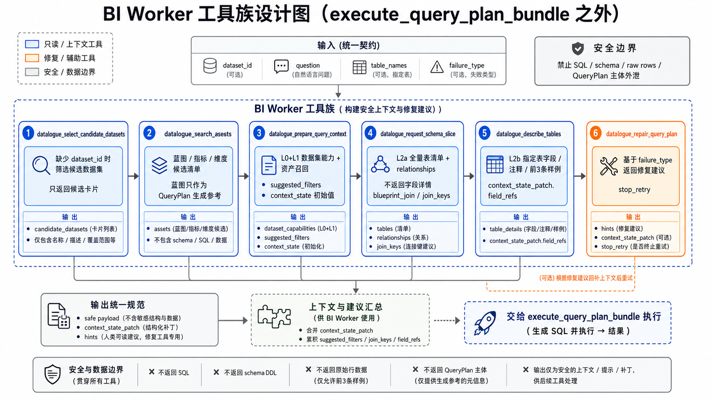

# BI Worker 工具族设计

本文聚焦 `datalogue_execute_query_plan_bundle` 之外的 BI Worker 工具设计。这些工具不负责真实 SQL 执行，而是负责候选数据集筛选、资产发现、上下文准备、schema 切片、表详情补齐和失败修复建议。

## 工具清单

| 工具 | 类型 | 设计职责 |
| --- | --- | --- |
| `datalogue_select_candidate_datasets` | 只读候选工具 | 缺少 `dataset_id` 时筛选候选数据集，返回用户可确认的候选卡片。 |
| `datalogue_search_assets` | 只读资产目录工具 | 列出数据集蓝图、指标、维度候选，蓝图只作为 QueryPlan 生成参考。 |
| `datalogue_prepare_query_context` | 只读上下文准备工具 | 合并 L0+L1，返回数据集能力、资产召回、筛选线索和初始 `context_state`。 |
| `datalogue_request_schema_slice` | 只读 schema 工具 | 返回全量表清单与 relationships，不返回字段详情。 |
| `datalogue_describe_tables` | 只读表详情工具 | 按 LLM 点名表返回字段、注释、前 3 条样例和 `field_refs`。 |
| `datalogue_repair_query_plan` | 只读修复建议工具 | 基于 `failure_type` 返回安全修复建议和重试预算。 |

## 共同设计边界

- 这些工具默认是 `DatalogueBIWorkerReadOnlyTool`，绕过 AgentScope 对只读工具的误拦截。
- 不执行 SQL，不写业务数据。
- 不返回 raw SQL、schema DDL、raw rows、内部 QueryPlan 主体或数据库原始错误。
- 只返回 safe payload、候选卡片、上下文 patch、字段 ref、join hints 或修复建议。
- 真正执行必须交给 `datalogue_execute_query_plan_bundle`。

## 推荐文档目录

Obsidian 目录：

`工作知识库/2026/数语/工具链路文档/`

每个工具单独一个目录，包含：

- `<tool_name> 工具设计.md`
- 如需单独图示，再增加 `assets/`
