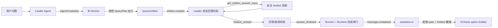
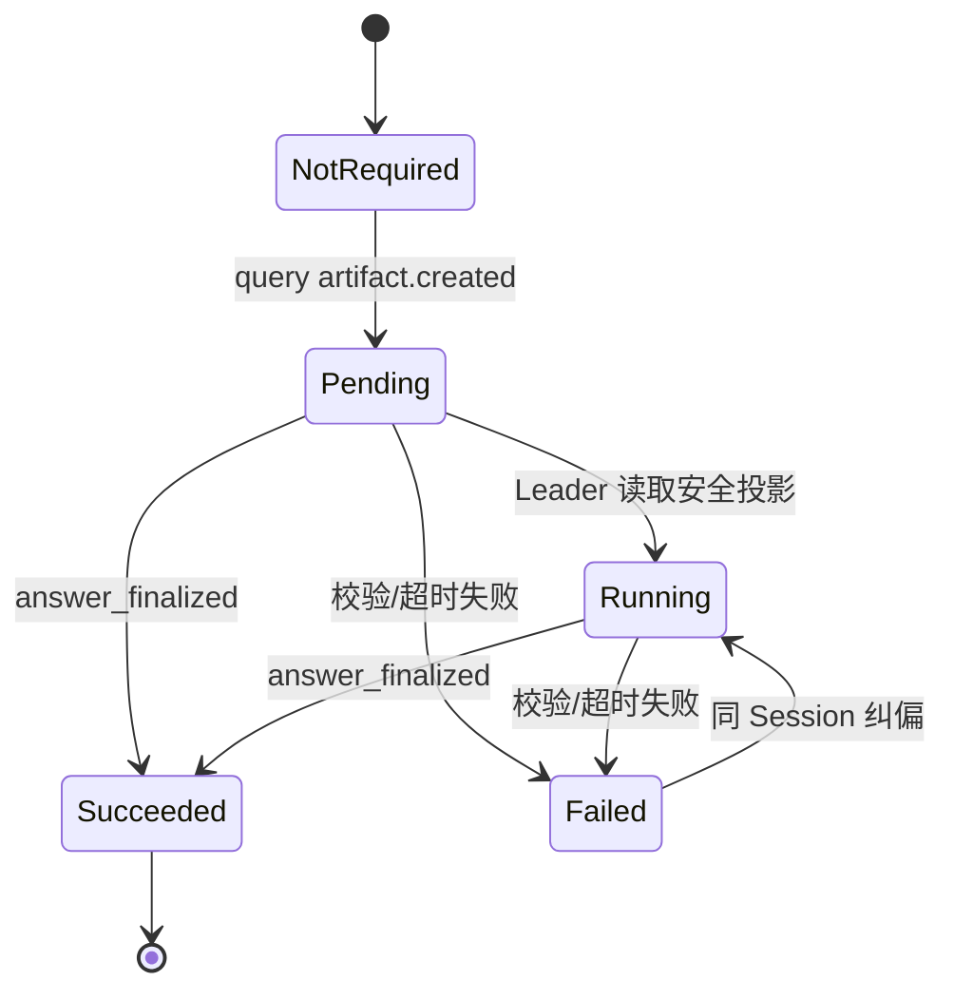

# Leader 统一收口与 ECharts 可视化系统设计

> 状态：已确认，待实施  
> 日期：2026-07-17  
> 适用范围：AgentScope Agent Team 问数主链、Artifact 回答收口、assistant-ui 图表展示  
> 架构决策：取消 Report Worker 作为每次查询的强制阶段，由 Leader 生成最终回答与受限可视化规格，前端确定性构造 ECharts option。

## 1. 背景与问题

当前链路在 BI Worker 生成查询 Artifact 后，要求 Leader 再通过 `AgentCreate(subagent_type="report")` 创建 Report Worker。Report Worker 读取安全 Artifact 投影、生成 Markdown/图表并调用 `datalogue_submit_report`，Runtime 只在收到 `report_worker_result` 后允许任务完成。

真实链路验证暴露了三个核心问题：

1. **“强制”仍然依赖模型决策**：Runner 的纠偏只是在原 Leader Session 再发一次控制消息，并不直接调度 Report Worker。
2. **持久化 Agent 存在 Prompt 漂移**：当前 `ensure_agent` 只按名称复用 Leader，不比较或更新 `system_prompt`，导致新代码已强制报告，实际 Leader 仍按旧规则跳过。
3. **角色成本高于业务价值**：普通问数为了一段结论增加模型调用、Worker Session、TeamSay、Redis 事件、身份凭证和失败补偿，但 Report Worker 并没有独立数据能力。

同时，当前 Report Prompt 允许输出 `echarts` fenced block，但前端 Markdown 渲染器只挂载 code/math 插件，并没有把该 JSON 渲染成 ECharts。现有消息图表又依赖 `metadata.custom.chartType/chartData`，事件适配层未生成这些字段，因此图表链路并未闭环。

## 2. 设计目标

### 2.1 目标

- BI Worker 继续作为唯一受控查询执行者。
- Leader 成为用户可见最终回答的唯一内容责任人。
- Artifact 创建后仍保留确定性完成闸门，禁止 Leader 绕过结构化校验直接 final。
- 支持 Leader 输出结论、限制说明和可选图表意图。
- 图表数据只来自授权 Artifact，前端确定性生成 ECharts option。
- 不新增数据库表，复用现有 QueryArtifact、AgentScopeMessage 和 AgentTeamTask。
- 保持 SQL、schema、QueryPlan、raw rows、数据库原始错误不进入用户可见回答。

### 2.2 非目标

- 不让 Leader 直接访问数据库或生成 SQL。
- 不让模型生成任意 ECharts option、JavaScript 函数、formatter 或外部资源。
- 不在前端对明细数据进行隐式业务聚合或推导新指标。
- 不为最终回答新增独立 Report 表、Chart 表或任务枚举。
- 不把对话页改造为独立数据驾驶舱。

## 3. 核心架构决策

### ADR-01：Report Worker 退出默认主链

- 普通查询、明细查询、聚合查询、趋势查询都不再强制创建 Report Worker。
- 即使用户明确说“生成报告”，默认也由 Leader 基于安全 Artifact 投影生成。
- Report Worker 不在目标版本默认注册；当未来出现独立模型、长文模板、多 Artifact 比较或独立 SLA 时，再作为专项能力重新设计。
- 历史 `kind="report"` Artifact 保留可读，不删除已有数据。

### ADR-02：Leader 必须通过结构化工具收口

Leader 不能在拿到查询 Artifact 后直接输出自然语言 final。它必须调用 `datalogue_finalize_answer`，由工具校验：

- Leader 身份与 task/session/thread 上下文。
- `source_artifact_ref` 与当前任务的查询 Artifact 对应关系。
- 回答文本的敏感内容边界、长度和截断声明。
- `visualization_spec` 结构和 Artifact 字段对应关系。

Runtime 只认可结构化 `answer_finalized` 凭证，不依赖 Leader 自然语言声称已完成。

### ADR-03：Leader 只生成受限可视化规格

Leader 决定“是否需要图表、选什么类型、使用哪些已有字段”，但不生成 ECharts option。

前端使用经后端校验的 `visualization_spec` 和授权 Artifact 数据，通过项目内置 builder 构造 option。这使颜色、tooltip、legend、空值、轴标签、无障碍和数据上限都由应用控制。

### ADR-04：不新增报告持久化模型

- QueryArtifact 仍是查询数据与可追溯证据的真相源。
- 最终 Markdown、摘要、限制和可视化规格写入现有 AgentScopeMessage payload 和 AgentTeamTask final payload。
- 最终回答通过 `source_artifact_ref` 与 QueryArtifact 关联。
- 不再为普通回答创建 `kind="report"` Artifact；历史 Report Artifact 仅保留读兼容。

## 4. 目标架构



### 4.1 组件职责

| 组件 | 责任 | 禁止事项 |
|---|---|---|
| Leader Agent | 澄清、路由、创建 BI Worker、基于安全投影生成结论与图表意图 | 查数据库、生成 SQL、输出任意 ECharts option |
| BI Worker | 构造 QueryPlan、调用受控工具、生成 QueryArtifact | 面向用户 final、制造报告文本 |
| Answer Input Tool | 从 QueryArtifact 生成安全 columns/rows/meta 投影 | 返回 SQL、schema、QueryPlan、raw payload |
| Finalize Tool | 校验身份、Artifact、文本、截断声明和图表规格 | 执行查询、修改查询 Artifact |
| Runner/Runtime | 重建收口状态、阻断非法 final、持久化任务与消息终态 | 依赖单一 Prompt 作为完成保证 |
| Event Adapter | 将 `message.completed` 投影为正文、ArtifactCard 和 visualization metadata | 把内部工具输入投给 UI |
| ECharts Renderer | 拉取授权 Artifact、依规格构造 option、渲染及提供无障碍摘要 | 执行模型生成的 JS/函数/外链 |

## 5. 执行链路

### 5.1 普通查询

```text
task.started
→ AgentCreate(bi)
→ BI Worker 执行
→ artifact.created
→ Leader 调用 datalogue_get_artifact_answer_input
→ Leader 生成 answer_markdown + optional visualization_spec
→ Leader 调用 datalogue_finalize_answer
→ answer_finalized（内部完成凭证）
→ message.completed
→ task.completed
```

`artifact.created` 后查询结果卡可提前展示，但消息保持 running，直到 Leader 结构化收口成功。

### 5.2 数据集确认、纯问答与不支持请求

未生成 QueryArtifact 时不激活回答完成闸门：

- 候选数据集确认：Leader 可直接发布本轮 `message.completed`。
- 纯能力说明/闲聊：Leader 直接回答。
- BI 失败：走现有 repair/失败链路，不伪造回答收口凭证。

### 5.3 图表请求

- 用户显式要求图表时，BI Worker 应优先产生可直接可视化的聚合/趋势 Artifact。
- 如当前 Artifact 为大量明细且不具备稳定类别/数值列，Leader 必须返回无图表的结论或说明限制，不得在前端自动聚合。
- 如用户必须要某个聚合图，应由 BI Worker 生成新的受控聚合 Artifact，而不是由 Leader 或浏览器推导。

## 6. 工具与数据契约

### 6.1 `datalogue_get_artifact_answer_input`

```text
datalogue_get_artifact_answer_input(artifact_ref)
```

成功返回：

```json
{
  "status": "completed",
  "artifact_ref": "artifact:...",
  "safe_summary": "已生成查询结果。",
  "columns": [
    {"field": "month", "label": "月份", "value_type": "date"},
    {"field": "amount", "label": "金额", "value_type": "number"}
  ],
  "rows": [
    {"month": "2026-01", "amount": 120.5}
  ],
  "answer_input_meta": {
    "row_count": 12,
    "visible_row_count": 12,
    "column_count": 2,
    "truncated": false,
    "result_shape": "time_series"
  },
  "artifact_card": {}
}
```

约束：

- 只接受当前用户/任务可读的 QueryArtifact。
- `rows` 是 Artifact 中已完成用户权限校验和脱敏的回答投影，不是工具内部 raw payload。
- 投影被截断时必须返回总量与可见量，不允许 Leader 暗示自己看到全量。

### 6.2 `visualization_spec` v1

```json
{
  "version": "1.0",
  "renderer": "echarts",
  "chart_type": "line",
  "title": "近 12 个月金额趋势",
  "subtitle": "单位：万元",
  "source_artifact_ref": "artifact:...",
  "encoding": {
    "category_field": "month",
    "value_fields": ["amount"],
    "series_field": null
  },
  "presentation": {
    "sort": "source",
    "limit": 30,
    "show_legend": false
  },
  "accessibility_summary": "金额整体上升，3 月达到阶段高点。"
}
```

允许值：

| 字段 | 允许范围 |
|---|---|
| `renderer` | 固定 `echarts` |
| `chart_type` | `bar` / `line` / `pie` |
| `category_field` | Artifact 已发布列 |
| `value_fields` | 1–3 个 Artifact 数值列 |
| `series_field` | 可选 Artifact 类别列 |
| `sort` | `source` / `asc` / `desc` |
| `limit` | 1–50，饼图上限 12 |
| `title` | 最多 80 个字符 |
| `subtitle` | 最多 120 个字符 |

严禁出现：

- `option`、`series.data`、重复 raw rows。
- JavaScript 函数、formatter 字符串、事件回调。
- HTML、URL、外部图片、主题包、自定义颜色脚本。
- 不存在于 Artifact 投影中的字段。

### 6.3 `datalogue_finalize_answer`

```text
datalogue_finalize_answer(
  source_artifact_ref,
  answer_markdown,
  summary,
  visualization_spec?,
  limitations?
)
```

成功返回：

```json
{
  "datalogue_event_type": "answer_finalized",
  "status": "completed",
  "source_artifact_ref": "artifact:...",
  "answer_markdown": "...",
  "summary": "...",
  "visualization_spec": null,
  "limitations": [],
  "finalization_id": "answer-finalization:..."
}
```

`finalization_id` 由 `task_id + source_artifact_ref + 规范化输入摘要` 确定性生成。Runner/Runtime 在同一任务中只接受首个有效收口凭证，重复事件忽略，不产生第二个 final。

## 7. 状态机与完成闸门



规则：

1. 首个有效 QueryArtifact 使状态进入 `pending`。
2. `pending/running` 时的 Leader 自然语言 `message.completed` 必须被 Runner 和 Runtime 抑制。
3. 只有 `answer_finalized(status=completed)` 可使状态进入 `succeeded`。
4. 纠偏只在原 Leader Session 执行，最多两次，不重新执行 BI。
5. 两次后仍无凭证，任务使用现有 `failed` 终态，错误码为 `ANSWER_FINALIZATION_REQUIRED_NOT_COMPLETED`，查询 Artifact 保留。
6. Runtime 必须独立重建状态，不能只依赖 Runner 闸门。

## 8. 数据持久化

不新增表或迁移。

| 数据 | 存储位置 |
|---|---|
| 查询结果、columns/rows/meta | 现有 QueryArtifact |
| `answer_markdown`、`summary`、`limitations` | 现有 AgentScopeMessage payload |
| `visualization_spec` | AgentScopeMessage payload 和 AgentTeamTask final payload |
| `source_artifact_ref` | Message payload、Task final payload 及 artifact refs |
| 最终状态与错误码 | 现有 AgentTeamTask |

不把 ECharts option 持久化。option 属于前端展示派生物，应随设计 token、ECharts 版本和屏幕尺寸在渲染时重建。

## 9. Leader Agent 规格同步

为避免持久化 Leader 继续使用旧 Prompt，Agent 规格必须包含：

```json
{
  "logical_name": "Datalogue Agent Team Leader",
  "spec_version": "leader-finalization-v1",
  "system_prompt_sha256": "..."
}
```

`ensure_agent` 不得只按 `name` 返回已有 Agent：

1. AgentScope 若支持安全更新 Agent，对比 hash 后更新 Prompt 与元数据。
2. 若不支持更新，创建带规格版本的 Agent，如 `Datalogue Agent Team Leader@leader-finalization-v1`，并只把新 Session 绑定到当前规格。
3. 旧 Agent 不立即删除，等活动 Session 结束后再清理。
4. 启动/首个任务记录 `leader.spec_version` 和 `leader.prompt_hash`，便于 Phoenix 定位 Prompt 漂移。

## 10. 前端 ECharts 设计

### 10.1 数据流

1. Event Adapter 从 `message.completed.payload.visualization_spec` 读取受限规格。
2. Adapter 只做字段白名单投影，写入 `metadata.custom.visualizationSpec`。
3. `AnswerVisualization` 通过 `source_artifact_ref` 调用现有授权 Artifact API。
4. 前端再次验证字段、类型和数量上限。
5. `buildEChartsOption(spec, artifact)` 构造纯 option，再交给 ECharts 渲染。

### 10.2 图表选择规则

| 类型 | 适用结果 | 硬约束 |
|---|---|---|
| Line | 时间/有序趋势 | category 有序，1–3 个数值系列，最多 50 点 |
| Bar | 类别对比、Top-N | 最多 30 类，1–3 个数值系列 |
| Pie | 占比/构成 | 只允许 1 个非负数值列，最多 12 类 |

超出上限时不由前端静默截断后冒充全量。若 spec 明确声明 Top-N 且 Artifact 已按相同口径排序，才允许取前 N 项。

### 10.3 展示与无障碍

- 图表位于结论正文之后、ArtifactCard 之前或同一“依据与结果”区域。
- 每个图表必须有标题、文本摘要和“查看结果详情”入口。
- 不以颜色作为唯一区分，系列同时使用 legend/标记。
- 窄屏不产生横向滚动；标签过长时由 builder 使用固定规则截断，tooltip 保留完整文本。
- `prefers-reduced-motion` 下关闭入场动画。
- Artifact 加载失败时保留 Leader 的结论正文和结果卡，图表区显示安全降级文案。

### 10.4 性能

- 使用已安装的 `echarts`，不新增图表依赖。
- `AnswerVisualization` 动态导入 ECharts，只在实际有 `visualization_spec` 时加载。
- 使用 `ResizeObserver` 处理容器尺寸，组件卸载时 `dispose`。
- 同一 Artifact 的详情与图表复用请求缓存，不重复拉取。

## 11. 安全边界

### 11.1 后端必须校验

- Leader 只能读取当前 actor/task/thread 可访问的 Artifact。
- Finalize Tool 必须复用当前用户归属校验，不只信任 `artifact_ref`。
- `source_artifact_ref` 必须与规格中的 ref 完全相同。
- 回答正文、摘要、限制和无障碍摘要都通过内部敏感模式校验。
- 字段名必须来自安全列投影，不允许使用数据库物理 schema 定位符。

### 11.2 前端防御

- Event Adapter 只白名单接收 spec v1 字段。
- 不使用 `eval`、`Function`、内联 JS 或动态导入外部主题。
- ECharts option 只由本地 builder 产生，不合并未知 option 字段。
- tooltip 和标签按纯文本处理，不启用 HTML formatter。

## 12. 错误语义与降级

| 错误码 | 含义 | 用户可见行为 |
|---|---|---|
| `ANSWER_FINALIZATION_REQUIRED_NOT_COMPLETED` | Leader 未完成结构化收口 | 保留查询卡，提示回答整理未完成 |
| `ANSWER_SOURCE_ARTIFACT_MISMATCH` | 回答与 Artifact 不匹配 | 不展示未验证正文，保留原 Artifact |
| `ANSWER_CONTAINS_FORBIDDEN_DETAIL` | 正文含内部执行细节 | 阻断 final，安全提示重试 |
| `ANSWER_TRUNCATION_NOTICE_REQUIRED` | 投影截断但未声明 | 纠偏后重试，不重跑 BI |
| `VISUALIZATION_SPEC_INVALID` | 图表类型/字段/上限不合法 | 允许纠偏为无图表回答，不得伪造图表 |
| `ARTIFACT_VISUALIZATION_LOAD_FAILED` | 前端加载图表数据失败 | 正文与 ArtifactCard 正常展示，图表局部降级 |

## 13. 可观测性

OTel/Phoenix Span 属性：

- `answer.finalization.required`
- `answer.finalization.status`
- `answer.finalization.attempt`
- `answer.finalization.correction_count`
- `answer.finalization.duration_ms`
- `answer.source_artifact_ref`
- `answer.visualization.requested`
- `answer.visualization.type`
- `leader.spec_version`
- `leader.prompt_hash`

保留任务启动、完成、失败和异常日志；不再为每个 SSE delta/progress 在 Runtime 与 API 两层重复记录生命周期日志。

## 14. 兼容与迁移

### 14.1 写路径切换

1. 新增 Leader 安全 Artifact 读取与结构化收口工具。
2. Leader 权限白名单只新增这两个业务工具，不继承 BI Worker 工具。
3. Runner/Runtime 从 `report_worker_result` 凭证切换到 `answer_finalized`。
4. 前端适配 `visualization_spec`，接入 ECharts 确定性 renderer。
5. 默认不再注册 `report` SubAgentTemplate。
6. 删除 Report Worker Prompt、权限文件、独占工具、完成状态机、Redis 报告事件和强制开关。

### 14.2 读兼容

- 历史 `kind="report"` Artifact 继续通过 Artifact API 查看。
- 历史消息中的 `report_ref/report_status/report_worker_*` 字段保留宽容读取一个发布周期，新写路径不再产生。
- 不回写或迁移历史报告数据。

### 14.3 发布时开关

迁移期可短期使用 `DATALOGUE_LEADER_FINALIZATION_ENABLED`。灰度通过后删除该临时开关，不将它变成长期双链路配置。

## 15. 测试与验收

### 15.1 后端

- Leader Agent 规格 hash 不同时不得静默复用旧 Agent。
- BI 成功只生成 `artifact.created`，不直接结束任务。
- Leader 不能调用 BI 执行工具，BI Worker 不能调用 finalize 工具。
- Artifact 用户/任务/thread 对应关系必须通过校验。
- Leader 提前自然语言 final 被 Runner 与 Runtime 双重阻断。
- 重复 `answer_finalized` 只产生一个 `message.completed`。
- 截断 Artifact 缺失声明时拒绝收口。
- 图表字段不存在、类型不匹配、系列过多、饼图负数等情况被拒绝。
- 回答收口纠偏不重新执行 BI，且最多两次。
- 无 QueryArtifact 的澄清/不支持场景不被错误闸门。

### 15.2 前端

- `visualization_spec` 白名单投影和恶意额外字段丢弃。
- Line/Bar/Pie 各一个正常规格渲染。
- Artifact 加载、空结果、非数值列、超限和网络失败降级。
- 不执行 formatter、HTML、URL 或未知 option 字段。
- 图表失败不影响正文和 ArtifactCard。
- 图表有可读标题、文本摘要、键盘焦点和结果详情入口。
- 390px、760px、1440px 下无横向溢出。

### 15.3 硬性验收指标

- 20 条成功生成 QueryArtifact 的链路，`datalogue_finalize_answer` 执行率 100%。
- `answer.finalization.required=true` 且 `status!=succeeded` 的 completed 任务数为 0。
- 前端每轮只出现一个 final，ArtifactCard 不重复。
- 普通查询不再创建 Report Worker Session。
- 对可视化结果的 Line/Bar/Pie 三类规格验证通过率 100%。
- 用户可见事件不包含 SQL、schema、QueryPlan、raw payload 或数据库原始错误。
- 相比强制 Report Worker 链路，成功查询 p95 总延迟不得增加；目标为显著降低。

## 16. 灰度、回滚与清理

### 16.1 灰度

1. 测试环境启用 Leader Finalization，完成合约测试和 20 条代表性链路。
2. 确认 AgentScope 实际 Leader 的 `spec_version/prompt_hash` 与代码一致。
3. 灰度实例观察至少 4 小时，重点观察重复 final、Artifact 归属、图表字段失配和延迟。
4. 通过后关闭 Report Worker 写路径，保留历史读兼容。

### 16.2 停止灰度条件

- 任意任务出现未收口却 completed。
- 出现 SQL/schema/raw rows 或内部错误泄漏。
- 出现跨用户/跨线程 Artifact 读取。
- 图表字段与 Artifact 不匹配仍被渲染。
- 出现重复 final、回答纠偏时重跑 BI 或历史报告无法打开。

### 16.3 回滚

迁移期关闭 `DATALOGUE_LEADER_FINALIZATION_ENABLED` 即可恢复旧链路。回滚不删除 QueryArtifact、历史 Report Artifact 或已持久化消息。

### 16.4 终态清理

灰度通过且回滚窗口结束后：

- 删除 `DATALOGUE_REPORT_WORKER_ENABLED`。
- 删除 `DATALOGUE_LEADER_FINALIZATION_ENABLED`临时开关。
- 删除 Report Worker 注册、Prompt、权限配置、独占工具、状态和写侧测试。
- 保留历史 Report Artifact 读取兼容和必要的历史 payload 投影。
- 更新执行链路、系统架构、API 契约和项目记忆。

## 17. 取舍与备选方案

| 方案 | 结论 | 原因 |
|---|---|---|
| 所有查询强制 Report Worker | 放弃 | 调度仍受模型决策影响，延迟与失败面过高 |
| Leader 直接自然语言 final | 放弃 | 缺少 Artifact 对应、敏感内容、截断和图表字段校验 |
| Leader 生成完整 ECharts option | 放弃 | 协议过宽、主题不稳定、安全与可测性差 |
| Leader 生成受限 spec + 前端 builder | **选定** | 兼顾 Agent 语义判断与应用确定性 |
| 为最终回答新建数据库表 | 放弃 | 现有 Message/Task/Artifact 已能完成持久化与关联 |

## 18. 预计代码影响面

| 模块 | 预计改动 |
|---|---|
| `app/prompts/agent_team.py` | Leader 收口规则，移除默认 Report Worker recipe |
| `app/runtime/engine/registry.py` | Leader 工具/权限，移除 report template 注册 |
| `app/runtime/engine/client.py` | Agent spec version/prompt hash 同步 |
| `app/runtime/engine/tools.py` | Artifact answer input 与 finalize tool |
| `app/runtime/engine/runner.py` | `answer_finalized` 闸门与纠偏 |
| `app/runtime/agent_team_runtime.py` | Runtime 第二道收口校验与最终 payload |
| `app/core/events/projection.py` | 结构化工具结果投影 |
| `app/domains/agent_team/report_execution.py` | 替换为通用 answer finalization 状态 |
| `datalogue-web/src/assistant/agent-team-event-adapter.js` | `visualization_spec` 白名单适配 |
| `datalogue-web/src/features/chat/chat-adapter.js` | 写入 `metadata.custom.visualizationSpec` |
| `datalogue-web/src/features/chat/MyMessage.jsx` | 接入 `AnswerVisualization` |
| `datalogue-web/src/components/` | 新增 ECharts renderer 和 option builder |
| `datalogue-api/conf/` | 移除 Report Worker 权限，更新 Leader 白名单 |

## 19. 实施完成定义

当且仅当以下条件同时满足时，本设计视为落地完成：

- 主链不再注册或创建 Report Worker。
- 每个成功 QueryArtifact 都经 Leader 结构化 finalize。
- Runner 和 Runtime 都能拒绝未 finalize 的 completed。
- Leader Prompt 修改不再被持久化旧 Agent 静默吞掉。
- 可视化由受限 spec 驱动，不执行模型生成 option/JS。
- 图表失败只局部降级，不破坏回答正文和 ArtifactCard。
- 无新数据库表或迁移。
- 自动化测试、20 条代表性链路和灰度观察均通过。
