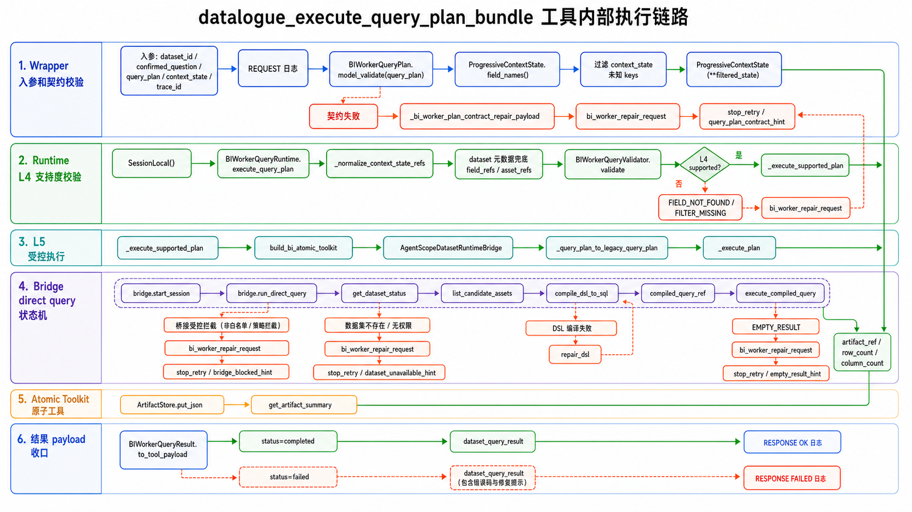
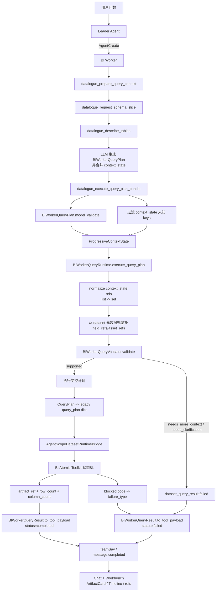
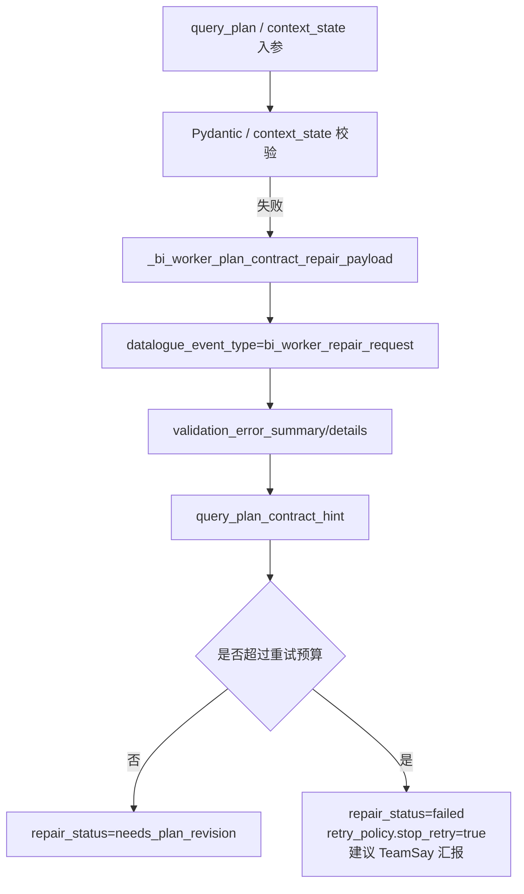
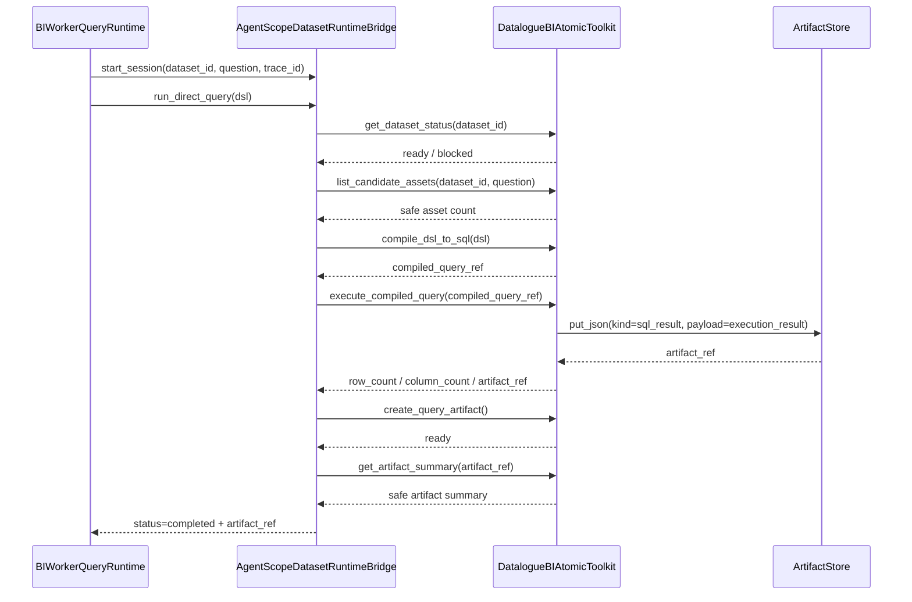

# datalogue_execute_query_plan_bundle 完整链路

本文基于当前代码梳理 `datalogue_execute_query_plan_bundle` 从 Agent Team 调用到 Workbench 展示的完整链路。它是 BI Worker 的 L4+L5 合并执行工具：先校验 QueryPlan 契约和渐进式上下文支持度，再把受控计划编译、执行并落 artifact。

> 设计图主视角：只看 `datalogue_execute_query_plan_bundle` tool 内部，不展开用户对话、Leader 编排或前端 Workbench 全链路。

## 1. 链路定位

`datalogue_execute_query_plan_bundle` 定义在 `datalogue-api/app/agentscope_service/tools.py`，注册为 BI Worker 可调用的非只读 `FunctionTool`。上游提示词要求 BI Worker 在有 `dataset_id` 后按以下骨架工作：

1. `datalogue_prepare_query_context`：拿数据集能力、候选资产、蓝图、筛选线索和初始 `context_state`。
2. `datalogue_request_schema_slice`：拿数据集全量表清单和 relationships。
3. `datalogue_describe_tables`：由 LLM 点名表，拿字段详情、样例值和 `context_state_patch.field_refs`。
4. 生成 `BIWorkerQueryPlan`，合并三轮 `context_state_patch`。
5. 调用 `datalogue_execute_query_plan_bundle` 校验并执行。
6. 成功后用 `TeamSay` 原样安全回传 `dataset_query_result`，保留 `artifact_ref/result_ref/artifact_card/row_count/column_count`。

对应代码入口：

- `datalogue-api/app/prompts/agent_team.py`：BI Worker 标准路径和 TeamSay 输出约束。
- `datalogue-api/app/agentscope_service/tools.py:563`：`datalogue_execute_query_plan_bundle` wrapper。
- `datalogue-api/app/agentscope_service/bi_worker_runtime.py:51`：`BIWorkerQueryRuntime.execute_query_plan`。
- `datalogue-api/app/bi/skill/runtime_bridge.py:472`：`AgentScopeDatasetRuntimeBridge.run_direct_query`。
- `datalogue-api/app/bi/toolkit/atomic.py`：BI 原子工具状态机。
- `datalogue-api/app/agentscope_service/bi_worker_contracts.py:338`：`BIWorkerQueryResult.to_tool_payload`。

## 2. 主流程图

## 3. wrapper 层：tools.py

`datalogue_execute_query_plan_bundle(dataset_id, confirmed_question, query_plan, context_state, trace_id)` 做三件事。

第一，入口日志。记录 `dataset_id/trace_id/query_plan_keys/context_state_keys/question_len`，用于定位 LLM 传入结构是否已经在 wrapper 层出错。

第二，契约校验。`query_plan` 必须通过 `BIWorkerQueryPlan.model_validate()`；`context_state` 会先按 `ProgressiveContextState.field_names()` 过滤未知字段，再实例化 `ProgressiveContextState`。这一步会丢弃类似 `dataset_summary` 的额外字段，避免 LLM 把 prepare 阶段完整 payload 直接塞进执行工具。

第三，调用 runtime。校验通过后创建 `BIWorkerQueryRuntime(db)`，执行 `runtime.execute_query_plan(...)` 并 `db.commit()`。如果 runtime 抛出未预期异常，wrapper 会记录 `logger.exception`，并兜底返回结构化 `dataset_query_result/status=failed/failure_type=FIELD_NOT_FOUND`，避免工具层异常只停留在 AgentScope tool error。

契约失败不会执行查询，直接进入 Repair 链路 A：

重试预算在 `tools.py` 中维护：同类契约错误和总契约错误都最多重试 1 次，避免 ReAct 反复猜错 `selects/operator/join_requirements` 等字段形状。

## 4. QueryPlan 契约

核心契约在 `BIWorkerQueryPlan`：

- `intent`：`detail_query`、`metric_query`、`knowledge_qa`、`unsupported`。
- `result_shape`：结果类型、粒度、limit。
- `data_graph`：主实体和支撑实体。
- `join_requirements`：必须用 `left_alias/right_alias/relationship_ref/join_type/required/reason/join_keys`。
- `filters`：`operator` 只允许 `= != > >= < <= between in contains`。
- `selects`：明细查询必须至少一个。
- `metrics`：指标查询必须至少一个。
- `group_by/order_by/assumptions`：可选。

`FieldTarget.asset_ref` 有格式白名单，字段引用推荐用 `table:<schema>.<table>.<field>`，表级引用可用 `table:<schema>.<table>`。`normalized_field_ref` 会把表级 ref + `field` 拼成字段级 ref，供 L4 校验匹配。

## 5. runtime 层：execute_query_plan

`BIWorkerQueryRuntime.execute_query_plan` 是 L4 支持度校验和 L5 执行的分界点。

执行顺序：

1. 打 `START` 日志，记录 intent、主资产、filters/selects/metrics/join 数量，以及 context refs 数量。
2. `_normalize_context_state_refs(context_state)`：把工具 JSON 入参反序列化后的 list 统一收敛成 set，避免后续 `|` 集合运算报错。
3. `_get_dataset(dataset_id)`：从数据集元数据派生字段级 refs，主动补到 `context_state.field_refs/asset_refs`。这一步允许 LLM 忘记合并 `describe_tables.context_state_patch` 时仍有兜底，但不补 relationship_refs。
4. `self.validator.validate(query_plan, context_state)`：L4 校验 query_plan 引用是否被上下文支持。
5. 如果 L4 不支持，映射成 `FIELD_NOT_FOUND/FILTER_MISSING/...` 等失败 payload。
6. 如果问题有 `suggested_filters` 但 QueryPlan 没有 `filters`，直接返回 `FILTER_MISSING`，避免漏筛选条件。
7. `_execute_supported_plan(...)`：进入受控执行。
8. 执行结果若 `failure_type` 非空，原样返回失败 payload。
9. `row_count=0` 或没有 artifact 的空结果映射成 `EMPTY_RESULT`。
10. 成功返回 `dataset_query_result/status=completed`。

## 6. QueryPlan 到执行 DSL 的转换

`_query_plan_to_legacy_query_plan()` 把 `BIWorkerQueryPlan` 投影成旧编译器能消费的 dict，但执行来源明确标记为 `bi_worker_query_runtime`。

关键透传：

- `selects` -> `selected_assets`
- `filters` -> `filters`
- `metrics` -> `metrics`
- `group_by` -> `group_by`
- `ordering` -> `ordering`
- `join_requirements` -> `join_requirements`
- `result_shape.limit` -> `limit`

每个字段会带 `metadata`，用于区分真实表名和字段名，避免编译器把字段误当 FROM 表。`join_keys` 当前在 legacy 编译器里主要作为结构化通道保留，避免 LLM 把 SQL 字符串塞进非法字段。

## 7. Bridge 与 Atomic Toolkit 执行状态机

`_execute_supported_plan()` 会构建：

- `build_bi_atomic_toolkit(self.db)`
- `AgentScopeDatasetRuntimeBridge(toolkit=toolkit)`
- `build_bi_runtime_context(...)` 返回的 `session_kwargs`
- legacy DSL dict

随后 `_execute_plan()` 启动 session 并调用 `bridge.run_direct_query(session=session, dsl=dsl)`。

Bridge 固定按 `AGENTSCOPE_DATASET_EXTERNAL_TOOL_SEQUENCE` 走外部工具事件：

原子工具职责：

- `get_dataset_status`：确认数据集存在且可用，只返回计数级 metadata。
- `list_candidate_assets`：返回安全候选资产摘要，不回填 schema/SQL/raw rows。
- `compile_dsl_to_sql`：调用 `compile_query_plan_to_sql`，把 SQL、query_plan 主体和执行上下文放进私有 `compiled_query_ref` 句柄。
- `execute_compiled_query`：只有这个工具能读取私有 SQL；执行后马上写入 `ArtifactStore.put_json(kind="sql_result")`，Agent 只拿 `artifact_ref/row_count/column_count`。
- `repair_dsl`：仅在 `FIELD_NOT_FOUND` 后，基于上一次私有失败上下文生成 patched DSL 并重新 compile。
- `create_query_artifact`：保留的 artifact 创建工具，写入前会走 sanitizer。
- `get_artifact_summary`：读取 artifact 的安全摘要，不返回主体或 raw rows。

## 8. 失败与 repair 分支

这条链路有三类 repair/失败出口。

### 8.1 契约失败：Repair 链路 A

发生在 wrapper 层，典型原因：

- 缺少顶层字段。
- 使用 `select/columns/fields/dimensions` 替代 `selects`。
- `operator=eq` 这种非法枚举。
- `join_requirements` 用旧字段 `left/right/type/left_asset_ref/right_asset_ref/join_condition`。
- `context_state` 形状不合法。

返回 `bi_worker_repair_request`，包含安全错误摘要、结构化 details 和 `query_plan_contract_hint`。超过预算后 `stop_retry=true`。

### 8.2 L4 支持度失败

发生在 `BIWorkerQueryValidator.validate()`，典型原因：

- QueryPlan 引用了 context 中不存在的字段 ref。
- 缺少 relationship_ref。
- lookup 依赖未满足。
- 自动补上下文次数达到上限。

runtime 会把 validation 映射成 `dataset_query_result/status=failed`，常见 `failure_type=FIELD_NOT_FOUND`，并要求调用 `datalogue_describe_tables` 补字段详情或重新生成 QueryPlan。

### 8.3 执行失败 / Bridge blocked

发生在编译或执行阶段：

- SQL Guard 拦截 -> `SQL_GUARD_BLOCKED`
- 字段缺失或数据库字段错误 -> `FIELD_NOT_FOUND`
- 绑定值失败 -> `VALUE_BINDING_FAILED`
- 执行完成但无行 -> `EMPTY_RESULT`
- 工具状态机耗尽或 private handle 缺失 -> 映射为 runtime failure

如果 `execute_compiled_query` blocked 且 `session.repair_pending`，Bridge 允许继续走 `repair_dsl`；否则 `_execute_plan()` 会把 bridge code 映射为 `failure_type` 并返回安全失败 payload。

BI Worker prompt 允许在 `failure_type` 非空时调用 `datalogue_repair_query_plan` 获取修复建议，同一故障类型最多重试 2 次；`stop_retry=true` 后必须 TeamSay 汇报安全摘要。

## 9. 用户可见输出与 Workbench

成功时 `BIWorkerQueryResult.to_tool_payload()` 返回：

- `status="completed"`
- `answer_summary`
- `artifact_ref`
- `result_ref`
- `row_count`
- `column_count`
- `artifact_card`
- `datalogue_event_type="dataset_query_result"`

失败时返回：

- `status="failed"`
- `failure_type`
- `safe_diagnosis`
- `recommended_action`
- `summary`
- `datalogue_event_type="dataset_query_result"`

`tools.py` 在成功 `dataset_query_result/status=completed` 时调用 `_publish_worker_business_final(...)`，作为 TeamSay 缺失时的 `message.completed` 兜底。正常路径下，BI Worker 仍必须用 TeamSay 把安全 payload 原样汇报给 Leader。后续由事件投影和 Workbench View Model 消费 `artifact_ref/result_ref/artifact_card`，Chat 展示结果卡，Workbench 展示消息、timeline、refs 和 artifact 详情。

## 10. 排障索引

排查时按这组日志关键词串联：

1. `[datalogue_execute_query_plan_bundle] REQUEST`
2. `[datalogue_execute_query_plan_bundle] QUERY_PLAN`
3. `[bi_worker.execute_query_plan] START`
4. `[bi_worker.execute_query_plan] dataset ref 兜底`
5. `[bi_worker.execute_query_plan] L4 missing_context`
6. `[bi_worker.execute_query_plan] FILTER_MISSING`
7. `[bi_worker._execute_plan] BRIDGE BLOCKED`
8. `dataset_agent.runtime.direct_query.*`
9. `[datalogue_execute_query_plan_bundle] RESPONSE OK`
10. `[datalogue_execute_query_plan_bundle] RESPONSE FAILED`

如果页面显示 completed 但没有 artifact，优先核对：

- `BIWorkerQueryResult.to_tool_payload()` 是否带 `artifact_ref/result_ref/artifact_card`。
- `_execute_plan()` 是否把 bridge blocked 正确映射成 failed。
- `row_count is None and not artifact_ref` 是否被 runtime 映射为 `EMPTY_RESULT`。
- TeamSay 或 `_publish_worker_business_final` 的 `message.completed` payload 是否保留了结果 refs。
- Workbench mirror / projection 是否消费了 `artifact_card.primary_ref` 或 `result_ref`。
