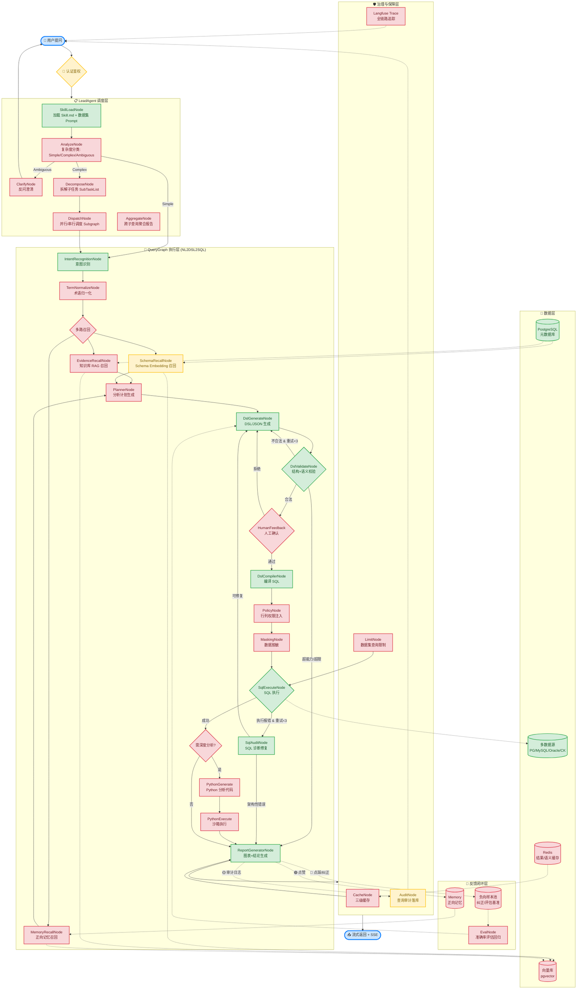
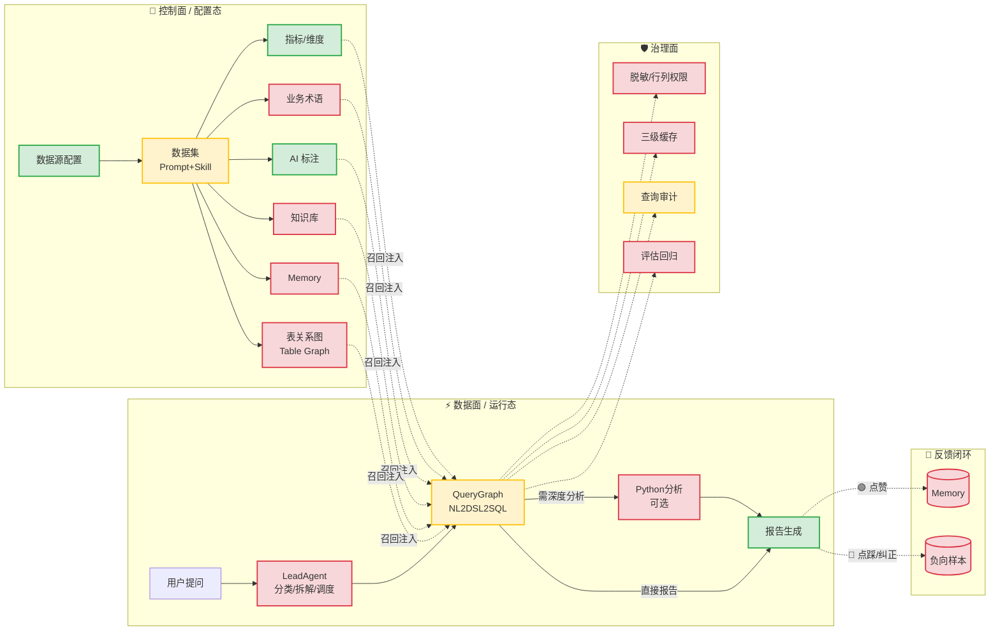
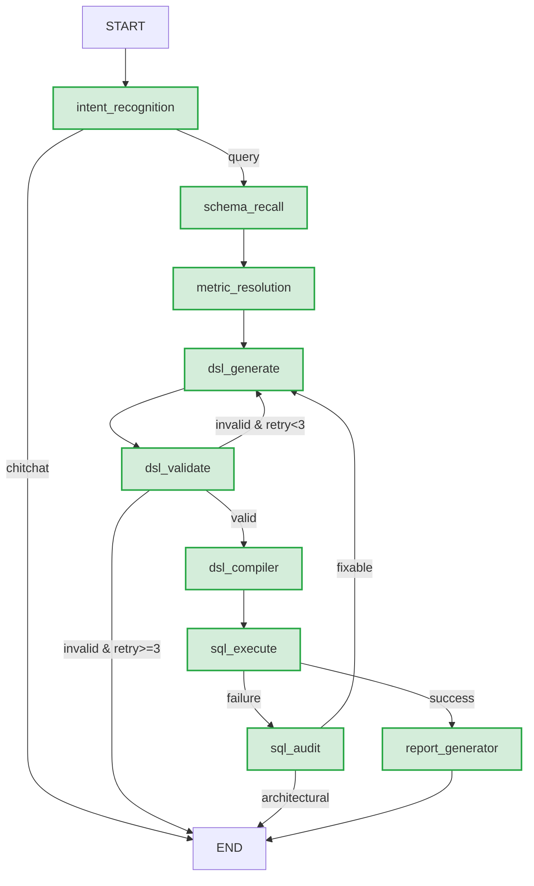
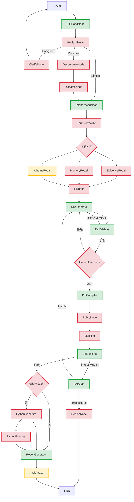
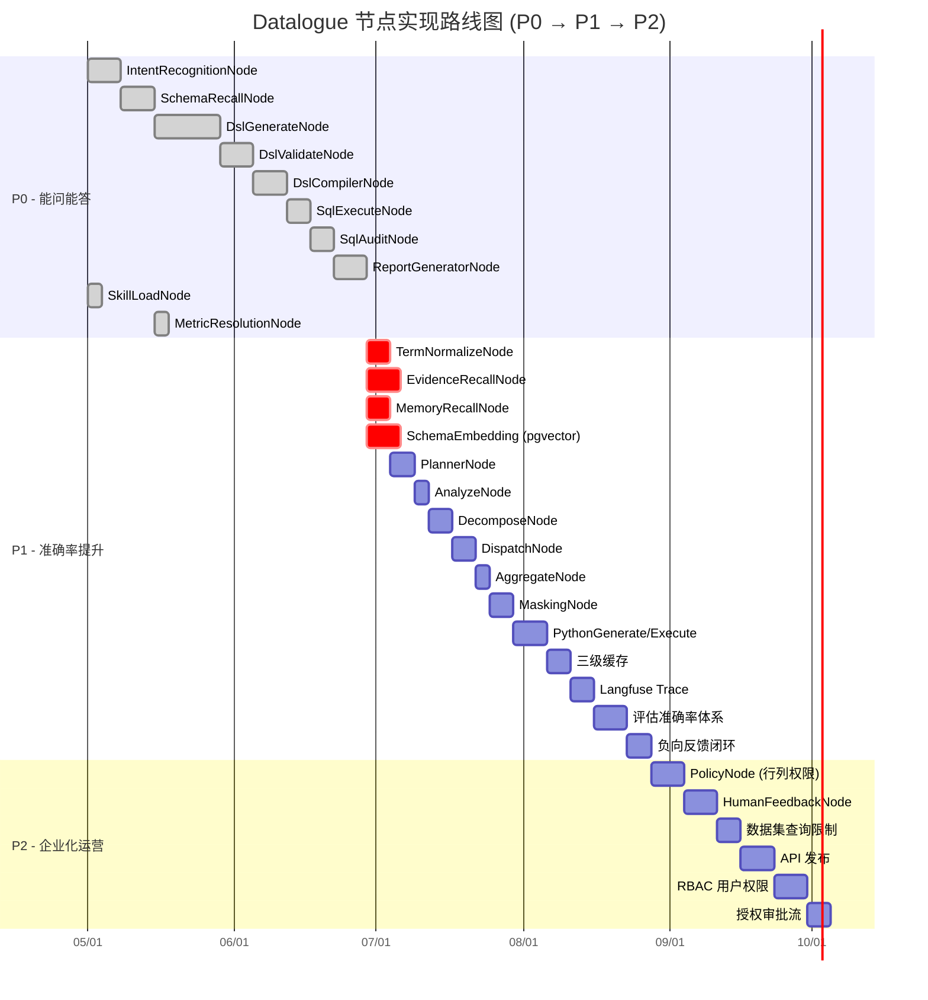

# Datalogue 后期完整执行节点链路图 (v2.0)

> 基于「Datalogue_设计开发方案_v2.0」设计蓝图 + 当前代码实现状态标注  
> 🟢 **已实现**　🟡 **部分实现 / 已有基础**　🔴 **未实现（后期阶段）**

---

## 一、执行链路全景图（端到端）

---

## 二、节点实现状态总览

### 2.1 LeadAgent 调度层

| # | 节点 | 文档阶段 | 实现状态 | 说明 |
|---|------|---------|---------|------|
| 1 | **SkillLoadNode** | P0 | 🟢 已实现 | `dataset.prompt_instructions` 已注入链路 |
| 2 | **AnalyzeNode** | P1 | 🔴 未实现 | 需按 Skill.md 做复杂度分类 (Simple/Complex/Ambiguous) |
| 3 | **ClarifyNode** | P1 | 🔴 未实现 | Ambiguous 时反问澄清 |
| 4 | **DecomposeNode** | P1 | 🔴 未实现 | Complex 问题拆解为 SubTaskList |
| 5 | **DispatchNode** | P1 | 🔴 未实现 | 并行/串行调度 QueryGraph Subgraph |
| 6 | **AggregateNode** | P1 | 🔴 未实现 | 跨子查询聚合报告 |

### 2.2 QueryGraph 核心链路

| # | 节点 | 文档阶段 | 实现状态 | 说明 |
|---|------|---------|---------|------|
| 7 | **IntentRecognitionNode** | P0 | 🟢 已实现 | 分类 query/chitchat/function，含历史上下文 |
| 8 | **TermNormalizeNode** | P0 | 🔴 未实现 | 业务术语归一化 (business_term 表) |
| 9 | **EvidenceRecallNode** | P0 | 🔴 未实现 | 知识库 RAG 召回 (knowledge_qa) |
| 10 | **MemoryRecallNode** | P0 | 🔴 未实现 | 正向记忆召回 (memory_feedback) |
| 11 | **SchemaRecallNode** | P0 | 🟡 部分实现 | 已有 schema_recall_node，但无 embedding/向量召回 |
| 12 | **PlannerNode** | P1 | 🔴 未实现 | 分析计划生成 (意图→步骤拆解) |
| 13 | **DslGenerateNode** | P0 | 🟢 已实现 | 三路径生成：语义层 DSL / 裸 SQL / 推测 SQL |
| 14 | **DslValidateNode** | P0 | 🟢 已实现 | 轻量校验，深度校验下放至 SqlAuditNode |
| 15 | **HumanFeedbackNode** | P2 | 🔴 未实现 | 人工确认/拒绝 DSL，需暂停-恢复工作流 |
| 16 | **DslCompilerNode** | P0 | 🟢 已实现 | DSL→SQL 编译，支持多方言 JOIN |
| 17 | **PolicyNode** | P2 | 🔴 未实现 | 行列权限编译期注入 WHERE/列裁剪 |
| 18 | **MaskingNode** | P1 | 🔴 未实现 | 敏感字段脱敏处理 |
| 19 | **SqlExecuteNode** | P0 | 🟢 已实现 | 只读 SQL 执行，拦截危险关键词 |
| 20 | **SqlAuditNode** | P0 | 🟢 已实现 | SQL 诊断修复 (fixable/architectural) |
| 21 | **PythonGenerateNode** | P1 | 🔴 未实现 | Python 深度分析代码生成 |
| 22 | **PythonExecuteNode** | P1 | 🔴 未实现 | Docker 沙箱执行 |
| 23 | **ReportGeneratorNode** | P0 | 🟢 已实现 | 图表+结论，支持 astream() 流式输出 |

### 2.3 治理与保障层

| # | 节点 | 文档阶段 | 实现状态 | 说明 |
|---|------|---------|---------|------|
| 24 | **三级缓存** (结果/DSL/语义) | P1 | 🔴 未实现 | 需要 Redis + 缓存策略 |
| 25 | **数据集查询限制** | P2 | 🔴 未实现 | 时间范围/limit/并发配额限制 |
| 26 | **Langfuse Trace** | P1 | 🔴 未实现 | 全链路追踪与可观测 |
| 27 | **查询审计落库** | P1 | 🟡 部分实现 | token_usage/step_trace 已记录，缺少完整审计字段 |

### 2.4 反馈闭环层

| # | 节点 | 文档阶段 | 实现状态 | 说明 |
|---|------|---------|---------|------|
| 28 | **Memory** 正向记忆存储 | P0 | 🔴 未实现 | 点赞→memory_feedback 表 |
| 29 | **负向样本池** | P1 | 🔴 未实现 | 点踩/纠正→评估基准 |
| 30 | **准确率评估回归** | P1 | 🔴 未实现 | 基准集 + DSL合法率/结果一致率看板 |

---

## 三、配置态 → 运行态 数据流（完整版）

---

## 四、LangGraph StateGraph 拓扑（代码实际 vs 设计目标）

### 4.1 当前代码实际拓扑

### 4.2 设计目标拓扑（v2.0 完整版）

---

## 五、按开发阶段排布的节点路线图

---

*文档生成时间: 2026-06-04*  
*参考: Datalogue_设计开发方案_v2.0.docx + 当前 datalogue-api 代码实现*
