# 数语系统设计方案

> 版本：v2026.06.14  
> 范围：当前 Datalogue / 数语项目的产品架构、后端执行链路、前端交互链路、Agent 编排、数据集治理、可观测与后续实施方案。  
> 代码基线：以 2026-06-14 工作区当前代码为准，重点参考 `datalogue-api/app/api/chat.py`、`datalogue-api/app/graph/workflow.py`、`datalogue-api/app/graph/nodes.py`、`datalogue-api/app/services/lead_agent.py`、`datalogue-api/app/services/dataset_manifest.py`、`datalogue-api/app/services/conversation_store.py`、`datalogue-web/src/assistant/chat-adapter.js`、`datalogue-web/src/components/datasets.jsx`、`datalogue-web/src/components/audit-query.jsx`。

## 1. 项目定位

数语是一个面向企业数据的 AI 原生智能问数平台。它不是传统“预先配置 SQL 后让用户选择参数”的报表系统，而是以 Agent 驱动的自然语言问数为核心：业务用户用自然语言提出问题，系统通过数据集治理资产、SubAgent Manifest、语义资产解析、DSL 生成、SQL 编译执行、SQL 诊断和结果解释，给出可追溯、可审计、可复核的回答。

当前系统的关键边界：

- LeadAgent 只做控制面编排：时间理解、会话上下文、Manifest 路由、schema 状态检查、数据集级澄清、SubAgent 调度和审计轨迹。
- Dataset SubAgent 做数据面执行：在已确认的数据集内进行多轮上下文合并、意图识别、入口分类、蓝图执行、Schema 召回、术语归一化、语义资产解析、DSL 生成、SQL 编译、SQL 执行、SQL 诊断和报告生成。
- SubAgent Manifest 是路由契约，不是业务语义资产全集；它沉淀“这个数据集适合回答什么、不适合回答什么、绑定的 schema 版本是什么”。
- 查询审计与 Langfuse 可观测是产品内能力，优先在数语内部查询审计页回看 trace，而不是要求用户跳出到第三方控制台。

## 2. 目标与非目标

### 2.1 目标

1. 建立从“数据源接入 -> 数据集治理 -> Manifest 发布 -> LeadAgent 路由 -> SubAgent 执行 -> 查询审计”的完整系统设计。
2. 明确 Agent 分层，避免 LeadAgent 和 SubAgent 职责混杂。
3. 明确问数主链路中每个节点的输入、输出和失败处理方式。
4. 给出当前已实现能力、短期完善项和后续企业级闭环路线。
5. 用可渲染 Mermaid 图表示整体链路和关键时序。

### 2.2 非目标

1. 不把数语设计成低代码 SQL 配置平台。
2. 不要求用户手工维护执行 recipe 或固定 SQL 编排。
3. 不在当前阶段强行拆分独立 SubAgent 微服务；当前代码使用进程内 `InProcessDatasetSubAgentRunner`，但协议已为后续拆服务预留 trace 和 parent observation 字段。
4. 不把外部 Langfuse 控制台作为唯一审计入口；数语内部必须能承载 trace 列表和详情。

## 3. 总体架构

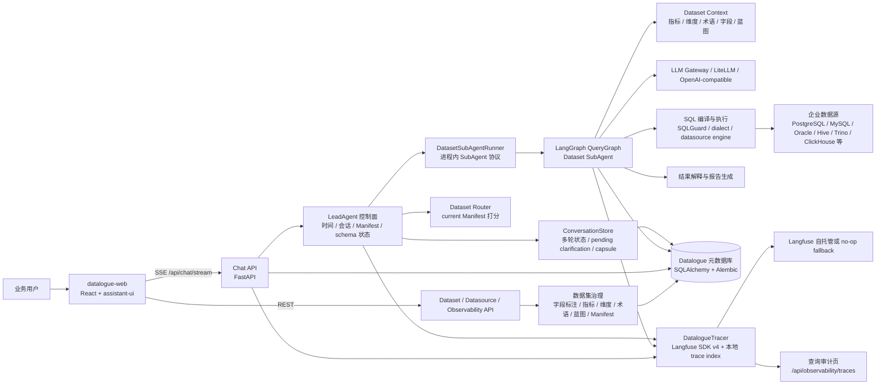

### 3.1 前端层

前端位于 `datalogue-web`，核心是 React + Vite：

- `/chat`：问数中心，使用 assistant-ui 对话域组件，消费 `/api/chat/stream` SSE。
- `/datasets`：数据集治理工作台，维护数据表、字段标注、指标、维度、分析蓝图、语义验证、SubAgent Manifest、术语、权限和版本历史。
- `/datasources`：数据源管理，维护连接、Schema、DDL 同步和数据源能力。
- `/audit-query`：查询审计页，展示 trace 列表、trace waterfall、输入输出、SQL、错误和观测状态。
- `/settings`：系统设置，包括 LLM 模型、审计日志、API Key、Webhook、数据源、业务词典等页面入口。

### 3.2 API 层

后端位于 `datalogue-api`，使用 FastAPI：

- `app/api/chat.py`：问数流式入口、SSE 事件整理、LeadAgent 上下文构建、SubAgent Runner 调用、消息持久化、最终 payload 封装。
- `app/api/dataset.py`：数据集治理、指标维度、字段转换、业务术语、语义验证、SubAgent Manifest、分析蓝图、YAML 导入导出。
- `app/api/datasource.py`：数据源连接、能力、Schema 同步和测试。
- `app/api/conversation.py`：对话线程、归档、消息历史。
- `app/api/observability.py`：成本、质量、失败统计、trace 列表和详情。
- `app/api/llm.py`：LLM 模型配置。

### 3.3 Agent 层

Agent 层分为控制面和数据面：

- LeadAgent：构造 `ToolPolicy`，规划并执行控制面工具，只能处理数据集路由和调度，不直接读取指标、维度、术语、蓝图、SQL 或字段级 schema。
- Dataset SubAgent：使用 LangGraph 状态图执行数据集内问数链路，负责语义资产解析和 SQL 相关能力。
- Runner：`DatasetSubAgentRequest` 定义 LeadAgent 到 SubAgent 的进程内协议，后续可演进为跨进程 RPC。

### 3.4 治理层

数据集治理围绕 `SemanticDataset` 展开：

- 数据源与源表字段：`Datasource`、`SourceTable`、`SourceColumn`。
- 数据集与语义资产：`SemanticDataset`、`SemanticMetric`、`SemanticDimension`。
- 业务术语：`BusinessTerm`、`BusinessTermAssetLink`、`BusinessTermRelation`。
- 分析蓝图：`AnalysisBlueprint`、`BlueprintVersion`、`BlueprintUsageLog`。
- 路由契约：`DatasetSubAgentManifest`。
- 语义验证：`SemanticValidationCase`。

### 3.5 可观测层

可观测层由 `DatalogueTracer` 统一封装 Langfuse SDK v4：

- 创建 root trace：`user_query`。
- 记录 LeadAgent、SubAgent、LangGraph 节点、LLM generation、SQL 诊断、报告生成等 observation。
- 写入 `ObservabilityTraceIndex`，支撑数语内部查询审计页。
- Langfuse 不可用时降级为 no-op，不阻断主流程。

## 4. 端到端业务链路

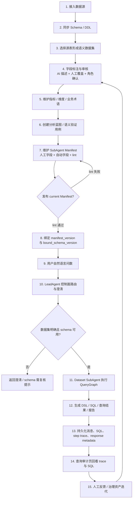

## 5. 问数主链路设计

### 5.1 主链路节点图

当前 LangGraph 工作流由 `build_workflow(db)` 组装，入口是 `merge_prior_context`。

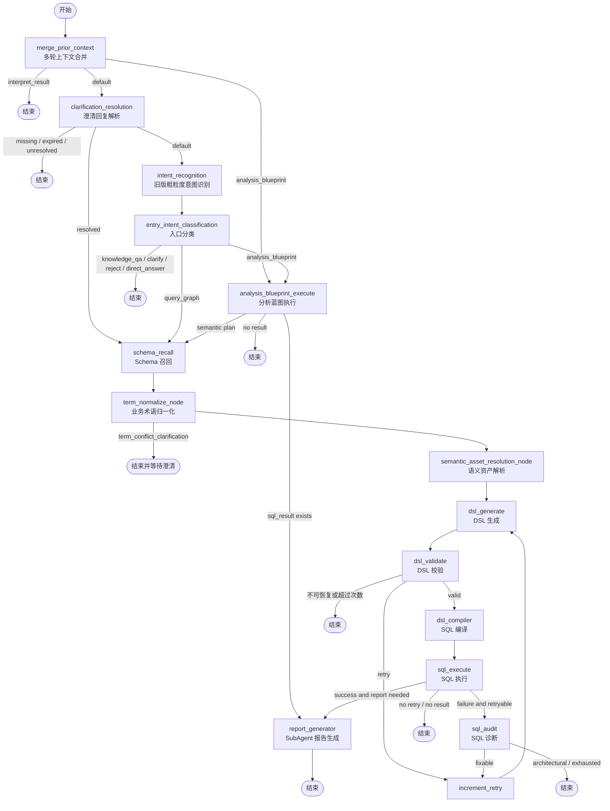

### 5.2 节点职责

| 节点 | 职责 | 关键输入 | 关键输出 |
| --- | --- | --- | --- |
| `merge_prior_context` | 合并多轮上下文，判断是否承接上一轮 | `question`、`prior_capsule`、`history` | `turn_type`、`multiturn_context`、`resolved_question`、`entry_route` |
| `clarification_resolution` | 解析用户对上一轮澄清的回复 | `clarification_response`、`PendingClarification` | `clarification_resolution_result`、`selected_term_id` |
| `intent_recognition` | 粗粒度识别 query / chitchat / function | 当前问题、多轮提示 | `intent`、`entities` |
| `entry_intent_classification` | 识别入口路由 | 问题、数据集、术语、蓝图 | `entry_route`、`entry_intent`、`route_payload` |
| `analysis_blueprint_execute` | 执行或注入分析蓝图 | `blueprint_id`、时间上下文 | `sql_result` 或 `blueprint_context` |
| `schema_recall` | 组装数据集问数上下文 | `dataset_id`、命中资产 | `schema_context`、`schema_structured`、`query_constraints` |
| `term_normalize_node` | 归一化业务术语并处理冲突 | 问题、术语库 | `term_normalization`、`route_payload` |
| `semantic_asset_resolution_node` | 统一解析术语、指标、维度、字段、蓝图 | 问题、schema 结构 | `semantic_asset_resolution`、`metric_resolution` |
| `dsl_generate` | 基于 prompt 生成结构化 DSL | schema、约束、上下文 | `dsl`、`token_usage` |
| `dsl_validate` | 校验 DSL schema 和语义完整性 | `dsl` | `dsl_valid`、`error`、`should_retry` |
| `dsl_compiler` | 编译 DSL 为 SQL | `dsl`、方言、数据源上下文 | `sql`、`sql_list` |
| `sql_execute` | 执行 SQL 并处理只读保护 | `sql`、数据源连接 | `sql_result` 或 `sql_diagnosis` |
| `sql_audit` | 用 LLM 和本地诊断分析 SQL 失败 | 错误、SQL、上下文 | `sql_audit_result`、`sql_retry_trace` |
| `report_generator` | 生成面向用户的最终解释 | 查询结果、SQL、口径 | `answer`、`answer_explanation` |

### 5.3 查询请求时序

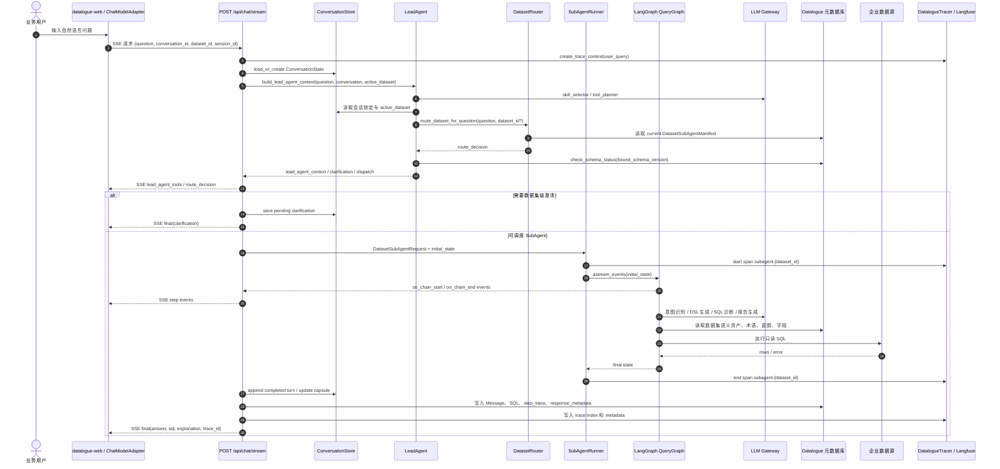

### 5.4 SSE 事件契约

`/api/chat/stream` 对前端输出的主要事件：

| 事件类型 | 用途 | 前端消费位置 |
| --- | --- | --- |
| `step` | LangGraph 节点进度和节点输出摘要 | `chat-adapter.js`、`chat-page.jsx`、Agent 面板 |
| `route_decision` | Manifest 路由结果、候选数据集、得分和原因 | 消息内路由卡片、Agent 面板 |
| `lead_agent_tools` | LeadAgent 工具规划、执行轨迹和策略违规 | Agent 面板 |
| `token` | LLM token 流式输出，主要兼容旧链路 | `client.js` callback 版 |
| `final` | 最终回答、SQL、解释包、trace、message_id、观测状态 | assistant-ui 消息、审计入口 |

## 6. LeadAgent 控制面方案

### 6.1 职责边界

LeadAgent 的目标是把用户问题安全地交给正确的数据集 SubAgent，而不是直接生成 SQL。

允许工具：

- `time`：解析自然语言时间。
- `thread_context`：读取对话锁定、active dataset、多轮状态。
- `manifest_router`：根据 current Manifest 或显式数据集做路由。
- `schema_status`：检查 Manifest 绑定 schema 是否过期。
- `clarification`：路由不明确或 schema stale 时生成澄清。
- `subagent_dispatch`：构造 SubAgent 调度上下文。
- `audit_trace`：记录 LeadAgent 工具规划和执行轨迹。

禁止工具：

- 指标解析、维度解析、术语归一化、分析蓝图匹配和执行、SQL 生成、SQL 执行、字段级 schema 召回。

### 6.2 LeadAgent 内部流程

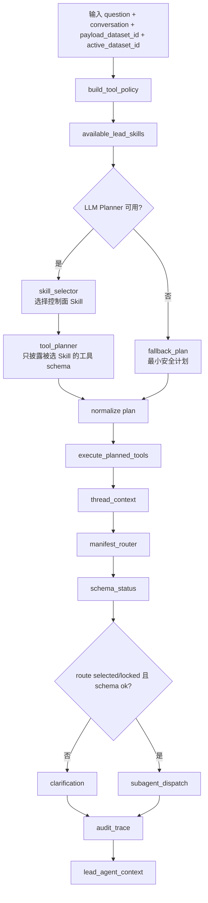

### 6.3 路由决策

`route_dataset_for_question()` 的规则：

- 如果请求里传入 `dataset_id`，返回 `locked`，不做自动改选。
- 如果未传 `dataset_id`，读取所有 `is_current=true` 的 Manifest。
- 通过 `score_manifest_question()` 计算问题和每个 Manifest 的匹配分。
- 自动选择阈值：`AUTO_SELECT_THRESHOLD = 0.65`。
- 自动选择领先差：`AUTO_SELECT_MARGIN = 0.12`。
- 候选最多返回 3 个。

路由结果：

| decision | 含义 | 后续动作 |
| --- | --- | --- |
| `locked` | 用户显式选择或会话锁定数据集 | 进入 schema 状态检查 |
| `selected` | Manifest 证据明确，自动选择数据集 | 进入 schema 状态检查 |
| `ambiguous` | 多个数据集得分接近 | 返回数据集级澄清 |
| `no_match` | 没有 Manifest 达阈值 | 返回澄清或引导选择数据集 |

## 7. SubAgent Manifest 治理方案

### 7.1 设计目标

SubAgent Manifest 是 LeadAgent 路由和治理复核的稳定契约。它要解决三个问题：

1. 数据集适合回答哪些问题。
2. 数据集不适合回答哪些问题。
3. 当前发布版本绑定的是哪一版 schema，schema 变化后是否需要复核。

### 7.2 字段分层

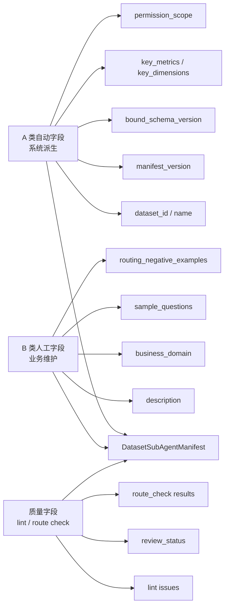

### 7.3 发布流程时序

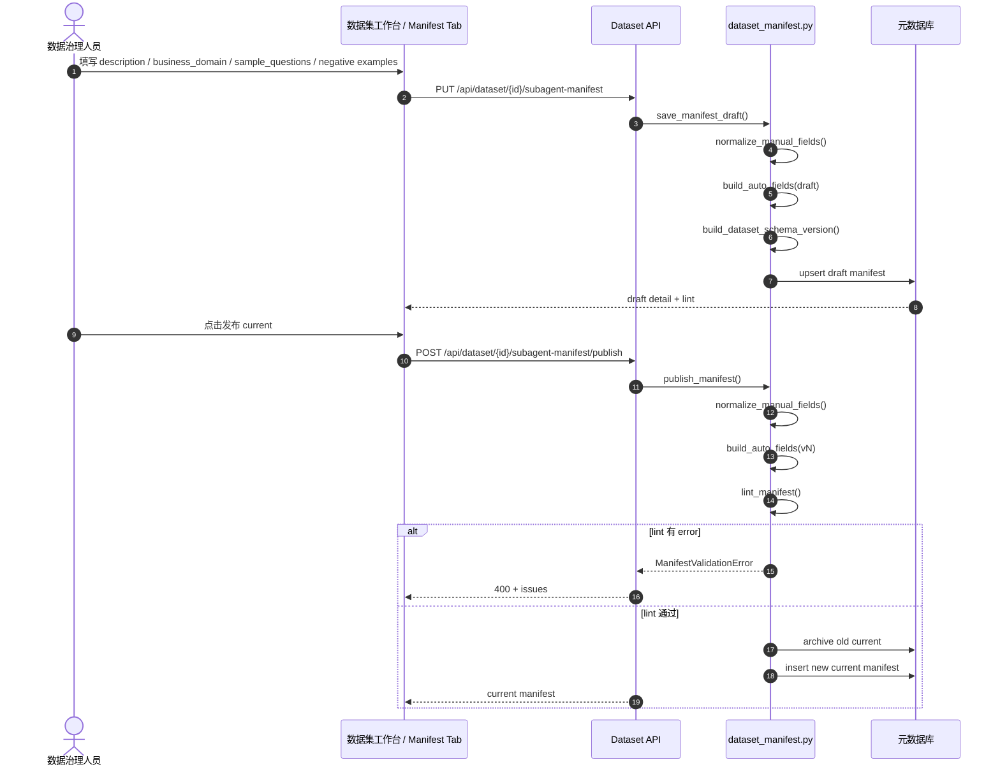

### 7.4 Lint 规则

发布 current Manifest 时，`lint_manifest()` 会阻断以下低质量情况：

- `description` 为空。
- `description` 不在 80 到 200 字之间。
- `description` 未包含业务实体、指标或维度。
- `description` 未包含时间或范围线索。
- `description` 包含“等、相关、业务”等低信息词。
- `business_domain` 为空。
- `sample_questions` 不在 5 到 10 条之间。
- `routing_negative_examples` 不在 3 到 5 条之间。

### 7.5 Schema stale 机制

当数据集名称、表选择、查询约束、指标、维度、字段转指标/维度、YAML 导入等语义结构变化时，Dataset API 调用 `mark_current_manifest_needs_review()`：

- 重新计算 `build_dataset_schema_version()`。
- 如果 current Manifest 的 `bound_schema_version` 与最新 schema hash 不一致，把 `review_status` 标记为 `needs_review`。
- LeadAgent 在路由后通过 `schema_status` 记录 stale 状态，必要时返回澄清或复核提示。

## 8. 数据集治理方案

### 8.1 数据治理对象

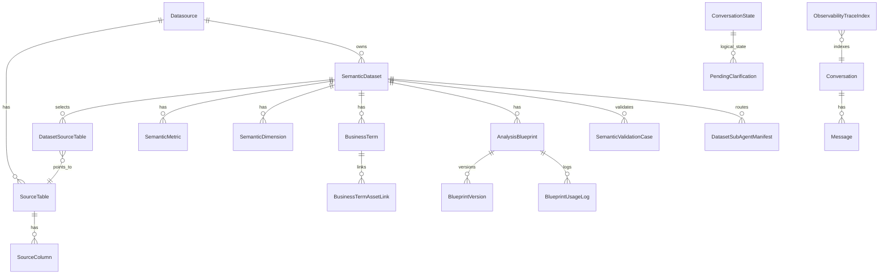

### 8.2 字段标注与语义资产

字段治理遵循“AI 辅助、人工确认、最终口径可追溯”：

- 源表字段先同步为 `SourceTable` / `SourceColumn`。
- AI 标注写入 `ai_description`、`ai_semantic_role`、`ai_suggested_agg`、`ai_confidence`、`suggested_synonyms`。
- 人工覆盖写入 `user_description`、`user_semantic_role`。
- 最终问数优先使用 `effective_desc` 和人工确认角色。
- 字段可转换为指标或维度，转换结果回写 `converted_metric_id` / `converted_dimension_id`。

### 8.3 数据集上下文组装

`build_dataset_query_context()` 负责把数据集资产组装给 DSL 生成链路：

- 指标：名称、展示名、表达式、表名、时间字段、过滤条件、同义词。
- 维度：名称、展示名、字段、表名、枚举、同义词。
- 术语：定义、别名、禁用别名、关联资产。
- 字段：列名、展示名、类型、语义角色、样例值、审核状态。
- 蓝图：名称、触发词、触发样例、实现类型。
- 数据源上下文：方言、连接能力、授权表、超时。
- 查询约束：默认时间范围、默认 LIMIT 等。

上下文组装有 token 预算，默认 `DEFAULT_CONTEXT_TOKEN_BUDGET = 4000`。显式命中问题或语义资产解析结果的条目会被 pinned，优先保留。

## 9. 多轮上下文方案

### 9.1 多轮状态模型

多轮状态由 `ConversationState` 承载：

- `session_id`：业务会话 ID，前端稳定传入。
- `messages`：最近消息，支持压缩前保留最近轮次。
- `compacted_summary`：旧轮次压缩摘要。
- `facts`：可复用事实。
- `resolved_time_context`：已解析时间上下文。
- `active_dataset_id`：当前锁定数据集。
- `pending_clarification`：挂起澄清。
- `subagent_capsules`：每个数据集的上一轮输出胶囊。
- `turn_index`、`status`、`lock_owner`、`locked_until`：轮次和并发锁。

### 9.2 多轮时序

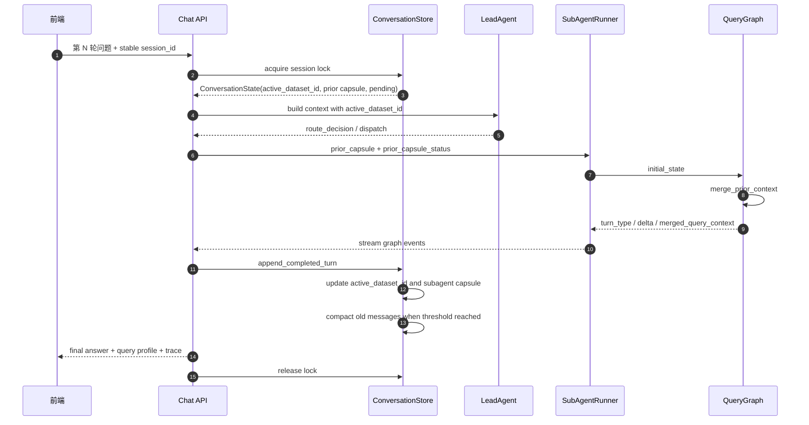

### 9.3 澄清恢复

当前支持两类澄清恢复：

- 数据集级澄清：LeadAgent 路由不明确时保存候选数据集，下一轮可按候选序号、数据集名称或 `selected_dataset_id` 恢复。
- 术语冲突澄清：SubAgent 术语归一化发现冲突时保存 `PendingClarification`，下一轮把 `clarification_response` 注入图状态，由 `clarification_resolution_node` 恢复原问题。

## 10. SQL 生成、执行与诊断

### 10.1 DSL 优先

系统先生成结构化 DSL，再编译为 SQL。这样做的原因：

- DSL 可校验，能在进入 SQL 执行前发现字段、指标、维度、过滤条件缺失。
- DSL 可以承载语义资产 ID，减少模型直接拼 SQL 的不可控性。
- SQL 编译器可以统一处理方言、字段引用、只读保护和默认约束。

### 10.2 SQL 执行保护

执行前后需要保留以下保护：

- SQL 只读守卫，避免 DDL / DML。
- 方言解析和 identifier quote。
- 数据源查询超时。
- 默认 LIMIT 和默认时间范围约束。
- 失败后进入 SQL 诊断，而不是无限重试。

### 10.3 SQL 失败处理

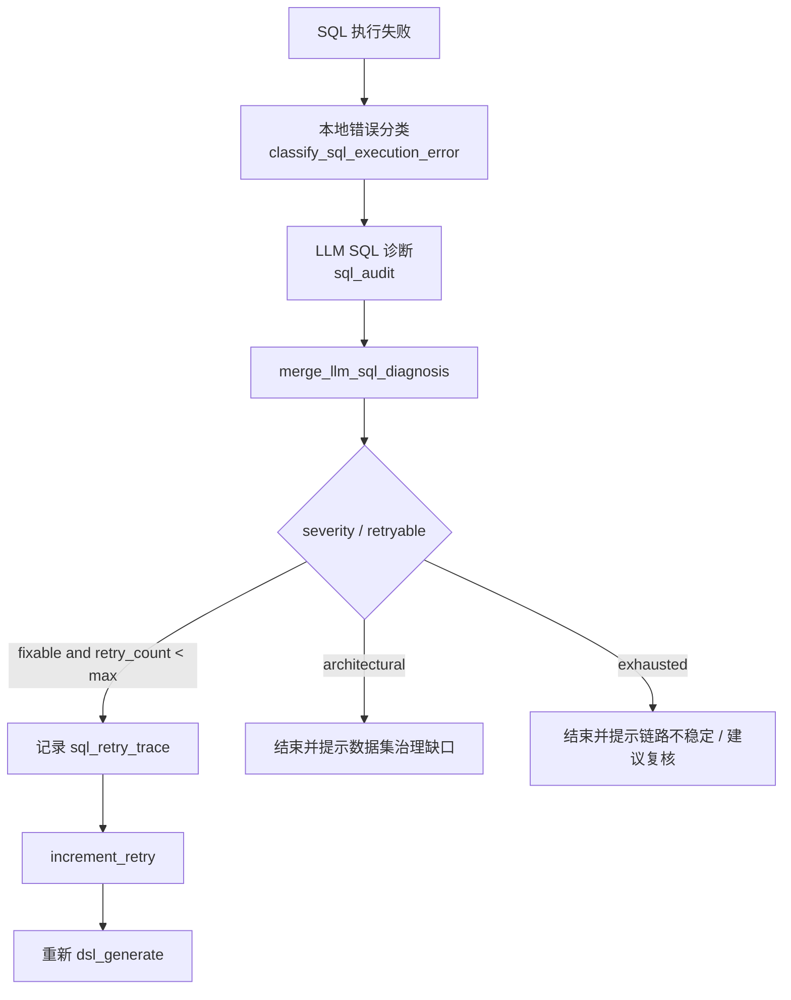

## 11. 分析蓝图方案

分析蓝图用于沉淀高价值、重复性的业务分析场景，但不能把系统退化成固定 SQL 模板平台。

当前支持两类蓝图：

- SQL 模板蓝图：可直接执行，成功后进入报告生成。
- 手动语义计划蓝图：表达业务场景、希望输出和口径约束，不要求直接可执行 SQL；命中后把 `blueprint_context` 注入 QueryGraph，继续走 Schema 召回和 NL2SQL。

设计边界：

- 发布蓝图只负责激活和创建版本快照，测试是可选校验。
- 蓝图命中是入口分类的一种捷径，不能绕过数据集权限、schema 和 SQL 安全检查。
- 蓝图要记录使用统计和使用日志，支撑后续治理。

## 12. 可观测与查询审计方案

### 12.1 Trace 分层

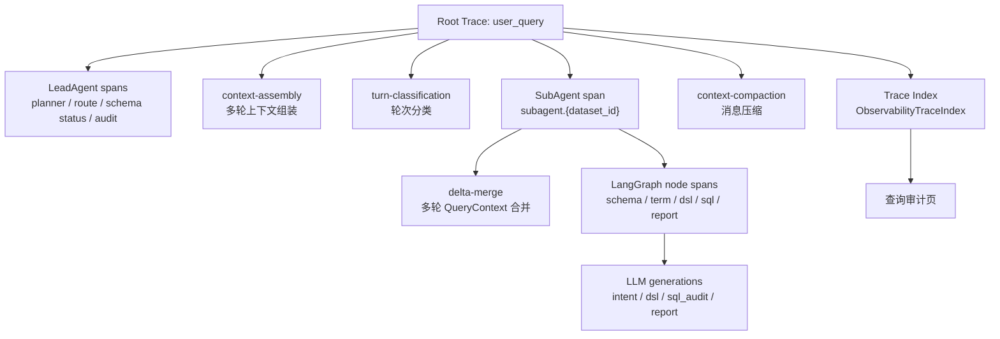

### 12.2 查询审计页

查询审计页通过以下接口读取数据：

- `GET /api/observability/summary`
- `GET /api/observability/costs`
- `GET /api/observability/quality`
- `GET /api/observability/failures`
- `GET /api/observability/traces`
- `GET /api/observability/traces/{trace_id}`

页面默认展示业务可理解信息：

- 问题、回答预览、SQL 预览。
- trace waterfall。
- 错误和诊断。
- Langfuse 观测状态、环境、release、prompt label。
- Scores 和反馈。

开发深调需要 raw prompt / metadata 时，应走受控调试开关，不应默认暴露给普通业务用户。

## 13. 接口设计摘要

### 13.1 问数与会话

| 方法 | 路径 | 说明 |
| --- | --- | --- |
| `POST` | `/api/chat/stream` | SSE 流式问数入口 |
| `GET` | `/api/conversation` | 查询对话列表 |
| `POST` | `/api/conversation` | 创建对话 |
| `GET` | `/api/conversation/{id}` | 查询对话详情和消息 |
| `PATCH` | `/api/conversation/{id}` | 重命名对话 |
| `POST` | `/api/conversation/{id}/archive` | 归档对话 |
| `POST` | `/api/messages/{id}/feedback` | 提交消息反馈 |

### 13.2 数据源

| 方法 | 路径 | 说明 |
| --- | --- | --- |
| `GET` | `/api/datasource` | 数据源列表 |
| `POST` | `/api/datasource` | 创建数据源 |
| `PUT` | `/api/datasource/{id}` | 更新数据源 |
| `POST` | `/api/datasource/{id}/test` | 测试连接 |
| `GET` | `/api/datasource/{id}/schemas` | 查询 schema 列表 |
| `GET` | `/api/datasource/{id}/schema` | 查询指定 schema 下表和字段 |

### 13.3 数据集治理

| 方法 | 路径 | 说明 |
| --- | --- | --- |
| `GET` | `/api/dataset` | 数据集列表 |
| `POST` | `/api/dataset` | 创建数据集 |
| `PUT` | `/api/dataset/{id}` | 更新数据集 |
| `GET` | `/api/dataset/{id}/metrics` | 指标列表 |
| `POST` | `/api/dataset/{id}/metric` | 创建指标 |
| `GET` | `/api/dataset/{id}/dimensions` | 维度列表 |
| `POST` | `/api/dataset/{id}/dimension` | 创建维度 |
| `GET` | `/api/dataset/{id}/terms` | 业务术语列表 |
| `POST` | `/api/dataset/{id}/terms` | 创建业务术语 |
| `POST` | `/api/dataset/{id}/terms/discover` | 发现术语候选 |
| `POST` | `/api/dataset/{id}/terms/conflicts/check` | 检查术语冲突 |
| `GET` | `/api/dataset/{id}/blueprints` | 分析蓝图列表 |
| `POST` | `/api/dataset/{id}/blueprints` | 创建分析蓝图 |
| `PATCH` | `/api/dataset/{id}/blueprints/{bid}/status` | 发布/停用蓝图 |
| `POST` | `/api/dataset/{id}/blueprints/{bid}/test` | 测试蓝图 |

### 13.4 SubAgent Manifest

| 方法 | 路径 | 说明 |
| --- | --- | --- |
| `GET` | `/api/dataset/subagent-manifests/current` | current Manifest 摘要列表 |
| `GET` | `/api/dataset/{id}/subagent-manifest` | Manifest 详情、草稿、current、lint |
| `PUT` | `/api/dataset/{id}/subagent-manifest` | 保存草稿 |
| `POST` | `/api/dataset/{id}/subagent-manifest/publish` | 发布 current |
| `POST` | `/api/dataset/{id}/subagent-manifest/route-check` | 路由自检 |

### 13.5 可观测

| 方法 | 路径 | 说明 |
| --- | --- | --- |
| `GET` | `/api/observability/summary` | trace 摘要 |
| `GET` | `/api/observability/costs` | 成本和 token |
| `GET` | `/api/observability/quality` | 问数质量 |
| `GET` | `/api/observability/failures` | 失败类型 |
| `GET` | `/api/observability/traces` | trace 列表 |
| `GET` | `/api/observability/traces/{trace_id}` | trace 详情 |

## 14. Prompt 与模型配置方案

当前 Prompt 来源分两层：

- 代码 fallback：`app/prompts/*.py`。
- Langfuse Prompt Manager：运行期通过 `get_prompt_manager()` 拉取，失败时回退代码 prompt。

已纳入注册表的 Prompt 类型包括：

- 意图识别。
- DSL 生成四条路径。
- 报告生成。
- SQL 审计。
- LeadAgent Skill Selector。
- LeadAgent Tool Planner。
- LeadAgent Report Generator。
- 多轮压缩。
- 字段/表标注。
- 蓝图分析。

模型配置建议：

- LeadAgent Planner 使用低温模型，强调稳定 JSON 和工具规划。
- DSL 生成使用稳定指令模型，强调结构化输出和方言约束。
- SQL 诊断可使用更强推理模型，但必须有本地诊断合并和 retry 限制。
- 报告生成使用面向业务表达的模型，并严格剥离 `<think>` 等思维链标签。

## 15. 部署与运行方案

### 15.1 后端运行

```bash
cd datalogue-api
python3 -m venv .venv
.venv/bin/pip install -r requirements.txt
.venv/bin/alembic upgrade head
.venv/bin/uvicorn app.main:app --reload --host 0.0.0.0 --port 8000
```

说明：当前 README 示例是 `uvicorn main:app`，但代码入口实际位于 `app/main.py`。具体启动命令以本地包路径和当前运行方式为准。

### 15.2 前端运行

```bash
cd datalogue-web
npm install
npm run dev
```

Vite 代理负责把 `/api` 转发到后端，前端 API 客户端不写死后端域名。

### 15.3 企业数据源驱动

基础依赖默认包含 PostgreSQL、MySQL 等常用能力。Oracle、Hive、SQL Server、Trino、Presto、ClickHouse、BigQuery 等企业数据源驱动放在 `requirements-enterprise.txt`，内网部署前应先准备离线 wheelhouse：

```bash
cd datalogue-api
scripts/download_enterprise_wheels.sh ./wheelhouse
python3 -m pip install --no-index --find-links ./wheelhouse -r requirements-enterprise.txt
```

## 16. 验证方案

### 16.1 后端自动化

建议按风险分层执行：

```bash
cd datalogue-api
.venv/bin/python -m py_compile app/api/chat.py app/graph/workflow.py app/graph/nodes.py app/services/lead_agent.py app/services/dataset_manifest.py app/services/runner.py
.venv/bin/pytest tests/test_dataset.py tests/test_dataset_context.py tests/test_chat.py -q
.venv/bin/pytest tests/test_lead_agent_tools.py tests/test_multiturn.py tests/test_multiturn_regression.py tests/test_observability.py -q
.venv/bin/alembic heads
```

验收点：

- 单一 Alembic head。
- Manifest 发布、路由自检、schema stale 标记测试通过。
- LeadAgent 工具策略、Planner fallback、schema stale、SubAgent dispatch 测试通过。
- Chat SSE step/final、SQL 诊断、消息 metadata 测试通过。
- 多轮 active dataset、capsule、pending clarification、压缩测试通过。
- Observability trace index、span metadata 测试通过。

### 16.2 前端自动化

```bash
cd datalogue-web
npm run lint
npm run build
```

验收点：

- `/chat` 能消费 SSE 并展示路由、步骤、SQL、解释包、trace 入口。
- `/datasets` 的 SubAgent Manifest Tab 能刷新、保存草稿、发布 current、运行自检。
- `/audit-query` 能展示 trace 列表和详情。
- 非 AI 业务页面继续按普通业务 UI 组织，不把 assistant-ui 扩散到所有页面。

### 16.3 真实链路验收

至少用一个真实数据集完成以下流程：

1. 数据源连接测试通过。
2. Schema 同步并选择源表。
3. 字段标注、指标、维度、术语完成最小治理。
4. Manifest 人工字段满足 lint，发布 current。
5. 不指定数据集直接提问，验证 LeadAgent 能自动选中或合理澄清。
6. 指定数据集提问，验证不会被自动改选。
7. 连续追问一次，验证多轮 active dataset 和 prior capsule 生效。
8. 故意触发字段缺失或 SQL 错误，验证 SQL 诊断和重试边界。
9. 在查询审计页打开 trace，核对 LeadAgent、SubAgent、SQL 和报告链路。

## 17. 风险与后续实施路线

### 17.1 当前风险

| 风险 | 影响 | 缓解 |
| --- | --- | --- |
| Manifest 人工字段质量不足 | LeadAgent 自动路由误选或无法选择 | 发布 lint、route-check、业务域和正负例维护 |
| schema 变化后未复核 | 路由契约和真实数据集语义不一致 | `bound_schema_version` + `needs_review` + schema_status |
| LeadAgent 越界读取数据面资产 | 架构退化成大而全 Agent，职责不清 | ToolPolicy blocked tools、测试和 trace 审计 |
| SQL 方言差异 | 生成 SQL 在不同数据源不可执行 | `datasource_context`、sqlglot、方言编译、真实数据源回放 |
| 多轮上下文污染 | 后续问题继承错误数据集或查询条件 | active_dataset_id、capsule 状态、delta merge trace、压缩边界 |
| Langfuse 不可用 | trace 缺失或主流程异常 | DatalogueTracer no-op fallback、本地 trace index |
| raw prompt 暴露 | 敏感信息或内部策略泄露 | 前端默认只展示业务可解释层，raw 走受控调试 |

### 17.2 后续路线

#### P0：首期治理契约闭环

- Manifest 发布失败路径在真实页面稳定展示 issues。
- route-check 支持正例/负例批量保存为验证用例。
- schema stale 在数据集页和问数页形成明确复核入口。
- 查询审计页展示 Manifest 版本、bound schema、LeadAgent 工具轨迹。

#### P1：LeadAgent 路由增强

- 把 Manifest scorer 从规则分扩展为规则分 + LLM rerank。
- 支持多数据集策略枚举：`PARALLEL`、`SERIAL`、`NOT_SUPPORTED`。
- ambiguous 场景支持用户选择后写回 active dataset，并记录路由学习样本。
- 引入数据集权限策略，避免仅靠 selected table 范围描述。

#### P2：SubAgent 能力增强

- 字段缺失类澄清从通用 pending 扩展为字段候选级恢复。
- DSL compiler 消费更多字段映射和资产 ID，减少模型字段名漂移。
- SQL 诊断沉淀为可检索知识，支持自动生成治理建议。
- 分析蓝图从语义计划进一步连接验证用例和指标口径评估。

#### P3：企业级可观测与治理

- 多轮代理指标从 trace metadata 落到聚合表。
- Prompt 版本、模型版本、成本、延迟、成功率进入系统仪表盘。
- 生产灰度策略：内部账号 -> 10% 用户 -> 分数据源类型扩大。
- 引入 trace 标注候选流转，把失败样本变成治理任务。

## 18. 结论

当前数语的合理架构不是“一个模型直接生成 SQL”，而是“LeadAgent 控制面 + Dataset SubAgent 数据面 + Manifest 路由契约 + 数据集治理资产 + LangGraph QueryGraph + 产品内可观测审计”的组合。这个结构的核心价值是把智能问数的不可控部分收敛到可治理、可复核、可追踪的工程链路中。

短期重点应继续收口 Manifest 发布与真实页面验证、LeadAgent 路由审计、多轮上下文稳定消费和查询审计回看。中期再扩展多数据集策略、字段候选澄清、语义层执行后端和企业级灰度指标。
