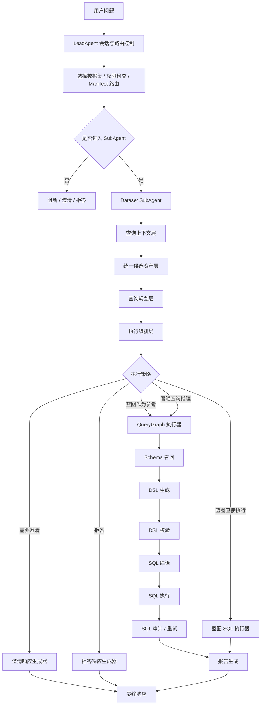
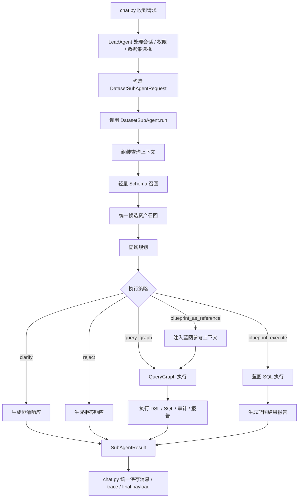
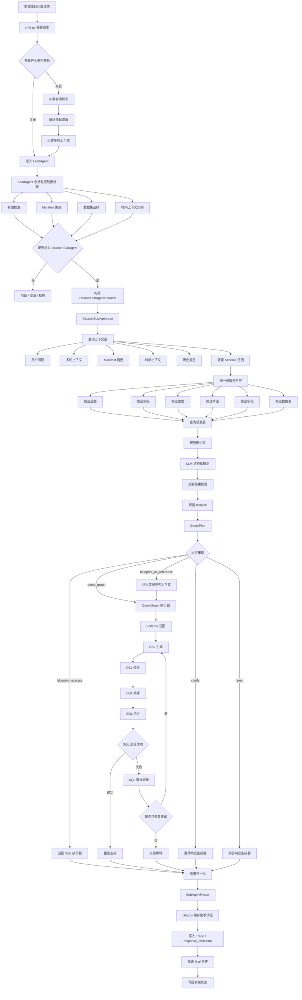

# SubAgent 查询规划层改造设计

## 背景

当前数语的 Dataset SubAgent 仍偏工具门面：`chat.py` 在进入 QueryGraph 前分别调用术语、指标和蓝图能力。这个结构导致两个问题：

- 蓝图一旦命中，如果存在 SQL 模板，会优先进入参数匹配和模板 SQL 执行，缺参或执行失败会早退，不会判断蓝图是否真的适合当前问题。
- 指标、维度、蓝图等语义资产没有命中时，链路缺少明确的自由查询规划能力，明细类问题容易被误判为无法处理或进入澄清。

本设计采用完整 SubAgent 规划重构方案，把 DatasetSubAgent 从“工具门面”升级为“单数据集内的查询规划与执行单元”。

## 成功标准

用户问题进入 DatasetSubAgent 后，无论是否命中蓝图、指标、维度，都必须先形成一个可解释、可执行的查询计划。系统再根据查询计划决定直接执行蓝图、参考蓝图生成 SQL、普通 QueryGraph 推理、澄清或拒答。

第一版必须覆盖四类核心案例：

- 蓝图完全适用：如“查询张三昨天的个人日报”，应走 `blueprint_execute`。
- 蓝图误命中但问题是明细查询：如“查询10条用户日志”，不得强制执行个人日报蓝图，不得强制索要时间和用户信息。
- 未命中指标、维度、蓝图但 Schema 足够：如“最近10条失败日志有哪些”，应继续走普通 QueryGraph。
- 确实缺必要信息：如“查一下日报”，应进入澄清。

## 目标职责边界

改造后职责边界如下：

- LeadAgent：负责控制面，包括会话、权限、Manifest 路由、数据集选择、时间上下文和是否进入 SubAgent。
- DatasetSubAgent：负责单数据集内的数据面，包括上下文组装、候选资产、查询规划、执行策略和 QueryGraph/蓝图执行编排。
- QueryGraph：收敛为执行器，负责 DSL 生成、DSL 校验、SQL 编译、SQL 执行、SQL 审计、重试和报告生成。



## 新 SubAgent 主链

当前 `chat.py` 不应再散调 `DatasetSubAgent.resolve_term_conflict`、`DatasetSubAgent.resolve_metric`、`DatasetSubAgent.resolve_analysis_blueprint`。目标主链是：

```text
chat.py
-> LeadAgent 处理控制面
-> DatasetSubAgent.run(request)
-> DatasetSubAgent 产出流式事件和最终 SubAgentResult
-> chat.py 统一保存消息、写 trace、发送 final、写回多轮状态
```

建议核心接口：

```python
DatasetSubAgent.run(request, trace_context) -> AsyncGenerator[SubAgentEvent, None]
```

事件类型：

- `candidate_assets`
- `query_plan`
- `step`
- `token`
- `result`
- `error`



## 查询计划结构

`QueryPlan` 必须优先满足机器可执行，同时携带中文解释用于聊天步骤、审计页和 trace。

核心字段：

```json
{
  "query_type": "detail_query",
  "execution_strategy": "blueprint_as_reference",
  "confidence": 0.86,
  "selected_assets": [],
  "reference_assets": [],
  "rejected_assets": [],
  "required_inputs": [],
  "clarification": null,
  "fallback_reason": null,
  "planner_source": "llm",
  "explanation": {
    "summary": "识别为明细查询，蓝图仅作为字段和关联关系参考。",
    "why_not_blueprint_execute": "用户要求查询10条日志，不是按个人日报固定口径分析。",
    "why_continue_without_metric": "明细查询不要求必须命中指标或维度。"
  }
}
```

`query_type` 枚举：

- `detail_query`
- `metric_query`
- `blueprint_query`
- `knowledge_qa`
- `ambiguous`
- `unsupported`

`execution_strategy` 枚举：

- `blueprint_execute`
- `blueprint_as_reference`
- `query_graph`
- `clarify`
- `reject`

资产关系：

- `selected_assets`：真正驱动执行的资产。
- `reference_assets`：只作为参考证据的资产。
- `rejected_assets`：命中过但不适用的资产。

统一资产引用结构：

```json
{
  "asset_type": "blueprint",
  "asset_id": 12,
  "name": "个人日报查询",
  "confidence": 0.78,
  "match_reason": "关键词命中：日报",
  "usage": "reference",
  "reject_reason": null
}
```

## 统一候选资产层

候选资产层只负责召回和评分，不决定最终执行路径。

第一版候选类型：

- `blueprint`
- `metric`
- `dimension`
- `term`
- `field`
- `table`

统一候选资产结构：

```json
{
  "asset_type": "field",
  "asset_id": "table:user_logs.column:created_at",
  "name": "created_at",
  "display_name": "创建时间",
  "source": "schema",
  "confidence": 0.82,
  "match_signals": [
    {
      "type": "name_match",
      "value": "时间",
      "score": 0.7
    }
  ],
  "metadata": {
    "table_name": "user_logs",
    "column_name": "created_at",
    "data_type": "datetime"
  }
}
```

资产来源：

- `blueprint`：已发布蓝图、`trigger_keywords`、`trigger_examples`、`when_to_use`、SQL 模板摘要。
- `metric`：数据集指标配置。
- `dimension`：数据集维度配置。
- `term`：业务术语与同义词。
- `field`：轻量 Schema 召回出的字段名、注释、类型。
- `table`：数据集选中表、表名、描述、字段摘要。

输出结构：

```json
{
  "dataset_id": 10,
  "question": "查询10条用户日志",
  "assets": [],
  "summary": {
    "blueprint_count": 1,
    "metric_count": 0,
    "dimension_count": 0,
    "term_count": 0,
    "field_count": 5,
    "table_count": 1
  },
  "recall_debug": {
    "schema_source": "lightweight_schema_recall",
    "manifest_version": "v1",
    "bound_schema_version": "xxx"
  }
}
```

关键规则：

- 候选资产层不早退。
- 候选资产层不判断“不能回答”。
- 蓝图命中只是候选，不等于执行。
- 指标、维度没命中不等于失败。
- `field` 和 `table` 候选必须能支撑明细查询。

## 蓝图适用性与执行策略

蓝图候选进入查询规划层后，必须被判定为以下状态之一：

- `exact_apply`
- `partial_reference`
- `reject`
- `need_clarification`

`exact_apply` 表示用户问题明确是蓝图固定分析诉求，蓝图适用场景、参数定义和输出口径与问题一致，必填参数齐全或能从上下文补齐。对应 `execution_strategy = blueprint_execute`。

`partial_reference` 表示蓝图与问题有业务相关性，但用户问题不是蓝图固定分析，或 SQL 模板条件不适合直接使用，或缺少蓝图参数但问题本身可通过普通 Schema 查询回答。对应 `execution_strategy = blueprint_as_reference`。

`reject` 表示只是关键词误命中，查询对象与蓝图输出不一致，或蓝图 SQL 主表/字段明显不适合。对应 `execution_strategy = query_graph`，该蓝图进入 `rejected_assets`。

`need_clarification` 表示用户问题确实是蓝图固定分析，但缺少无法默认补齐的必填参数，并且不能合理降级为普通明细或指标查询。对应 `execution_strategy = clarify`。

当 `execution_strategy = blueprint_as_reference` 时，必须遵守：

- 蓝图 SQL 只能作为参考证据，不能原样执行。
- LLM 必须根据用户真实问题重新生成 DSL/SQL。
- 如果用户问题与蓝图参数不一致，不得强行补蓝图必填参数。
- 规划解释中必须说明为什么该蓝图不是直接执行路径。

## LLM Planner 与规则 fallback

查询规划层采用：

```text
规则硬约束 -> LLM 结构化规划 -> 输出校验 -> 规则 fallback
```

规则硬约束：

- 权限不足、数据集不可用时必须 `reject`。
- 明细查询不强制要求指标或维度命中。
- 蓝图缺参但问题是明细查询时，不进入蓝图缺参澄清，必须降级或作为参考。
- `blueprint_as_reference` 策略下，蓝图 SQL 模板不能原样执行。
- `semantic_plan` 蓝图不能直接 SQL 执行，只能注入语义参考或进入 QueryGraph。

LLM Planner 输入：

- 用户问题。
- 多轮上下文摘要。
- Manifest 摘要。
- 候选资产列表。
- 轻量 Schema 摘要。
- 候选蓝图 SQL 模板与参数定义。
- 规则硬约束。

LLM Planner 输出必须是严格 JSON，并通过枚举和字段校验。

输出校验规则：

- 枚举值不合法时使用 fallback。
- `blueprint_execute` 但必填参数缺失时，改为 `clarify` 或 `blueprint_as_reference`。
- `blueprint_as_reference` 但没有可参考内容时，改为 `query_graph`。
- `detail_query` 被规划成 `clarify` 但 `field/table` 候选充足时，改为 `query_graph`。
- `reject` 必须有明确权限或不支持原因。

LLM 调用失败、JSON 解析失败或输出不可信时，用规则 fallback：

- 明显明细查询 -> `query_graph`。
- 明显蓝图固定分析且参数齐全 -> `blueprint_execute`。
- 明显蓝图固定分析但缺参 -> `clarify`。
- 命中蓝图但问题可普通查询 -> `blueprint_as_reference` 或 `query_graph`。
- 权限或数据集不可用 -> `reject`。

## 改造后的完整链路



## 前端与可观测

第一版必须让“查询规划”可见：

- 聊天步骤展示简版查询规划，面向普通业务用户。
- 审计页和 trace 保存完整版查询规划，面向管理员和排障。

聊天步骤简版包含：

- 查询类型。
- 执行策略。
- 是否参考蓝图。
- 为什么没有直接执行蓝图。

trace / response_metadata 完整版包含：

- `query_plan`
- `candidate_assets`
- `selected_assets`
- `reference_assets`
- `rejected_assets`
- `planner_source`
- `fallback_reason`
- Planner 原始输出摘要和校验结果。

## 实施阶段

虽然目标架构按完整重构设计，落地仍分阶段验收。

### 第一版：SubAgent 查询规划主链落地

目标：把链路从 `chat.py` 散调 SubAgent 工具方法，改为 `DatasetSubAgent.run` 统一编排。

范围：

- 新增 `DatasetSubAgent.run` 主入口。
- 新增查询上下文层。
- 新增轻量 Schema 召回。
- 新增统一候选资产层。
- 新增 `QueryPlan` 数据结构。
- 新增 LLM Planner 和规则 fallback。
- 新增执行策略分发。
- 保留现有 QueryGraph 执行器。
- 保留现有蓝图 SQL 执行器。
- 聊天步骤展示“查询规划”简版。
- trace / response_metadata 写入完整 `query_plan`。

第一版完成后必须停止并询问：

```text
第一版已完成并验证通过。是否开始第二版“规划质量增强”？
```

不得默认继续扩范围。

### 第二版：规划质量增强

目标：让 QueryPlan 更准、更稳定、更容易审计。

范围：

- 资产评分模型增强。
- 多候选蓝图对比。
- 指标、维度、字段、表之间的关系推断。
- 历史成功查询纳入候选资产。
- 查询计划在审计页完整展示。
- 蓝图参考 SQL 的安全摘要与引用片段控制。
- 失败 query_plan 反向生成治理建议。

### 第三版：多 SubAgent / 多数据集能力

目标：让 LeadAgent 具备多数据集、多 SubAgent 编排能力。

范围：

- 多数据集候选路由。
- 多 SubAgent 并行或串行执行。
- 跨数据集结果合并。
- 多数据集冲突澄清。
- 自动沉淀高频查询为蓝图草稿。
- 基于 trace 自动推荐指标、维度、术语治理项。

## 验收标准

后端测试至少覆盖：

- 蓝图完全适用：输入“查询张三昨天的个人日报”，期望 `execution_strategy = blueprint_execute`。
- 蓝图误命中但问题是明细查询：输入“查询10条用户日志”，期望 `execution_strategy = blueprint_as_reference` 或 `query_graph`，禁止直接 `blueprint_execute`，禁止强制索要时间和用户信息。
- 未命中指标、维度、蓝图但 Schema 足够：输入“最近10条失败日志有哪些”，期望 `execution_strategy = query_graph`。
- 确实缺必要信息：输入“查一下日报”，期望 `execution_strategy = clarify`。
- LLM Planner 失败：输入任意可识别明细查询，期望规则 fallback 生效，不导致整条链路失败。

真实聊天链路至少验证：

- 查询张三昨天的个人日报。
- 查询10条用户日志。
- 最近10条失败日志有哪些。
- 查一下日报。

真实链路检查：

- SSE 出现“查询规划”步骤。
- final payload 包含 `query_plan`。
- response_metadata 包含完整 `query_plan` 和 `candidate_assets`。
- trace metadata 包含完整 `query_plan` 和 `candidate_assets`。
- 蓝图误命中不会强制早退。
- 未命中语义资产不会直接报错。

## 风险边界

- LLM Planner 输出不稳定：使用严格 JSON schema 校验和规则 fallback。
- 蓝图 SQL 作为参考时误导模型：明确标记 reference only，禁止原样执行。
- `chat.py` 改动过大导致多轮状态写回回归：保持 ConversationStore 写回位置不变，final yield 前仍同步持久化。
- QueryGraph 主链被过度改动：第一版仍复用现有 `schema_recall`、`dsl_generate`、`sql_execute`、`sql_audit`。
- 候选资产召回变慢：轻量 Schema 召回只拿 planner 需要的信息，不搬完整 DDL prompt。
- 旧测试大量失效：保留兼容输出字段，如 `entry_route`、`route_payload`、`blueprint_id`、`generation_mode`。

## 结论

本轮采用完整 SubAgent 规划重构方案。目标是把 DatasetSubAgent 从 `chat.py` 调用的工具门面升级为单数据集内的查询规划与执行单元。

第一版落地后必须完成真实链路验证，并在进入第二版前询问用户确认。
