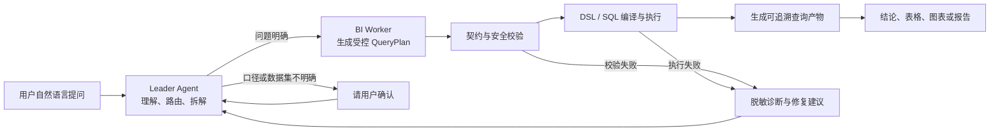

# 数语智能问答工作计划与方案

> 版本：V1.0（团队沟通版）  
> 负责人：杨凯  
> 日期：2026-07-16

## 一、这块工作要解决什么

智能问答这块的目标，不是只做一个“大模型加数据库”的对话框，而是建设一套面向企业数据的可信智能问数能力。

业务人员可以直接使用自然语言提问，系统负责理解问题、选择合适的数据集、识别指标口径和筛选条件、生成受控查询计划、执行查询，并以结论、数据表格或图表的形式返回结果。整个过程需要做到：

- 回答尽可能准确，不猜测业务口径。
- 数据来源和处理过程可追溯、可审计。
- 对权限、敏感字段和查询范围进行约束。
- 问题不明确时先让用户确认，而不是带着错误假设继续执行。
- 支持多轮追问、筛选条件调整、结果解释和报告生成。

## 二、整体思路

整体采用“语义治理 + 多智能体协作 + 受控查询 + 安全呈现”的思路。

这套链路的核心点是：大模型负责理解和决策，但不直接无约束地生成 SQL。查询会先形成结构化 QueryPlan，再经过语义资产校验、表关系校验、权限与安全检查，最后由受控执行器生成并执行 SQL。

## 三、当前已具备的基础

目前已经完成智能问数主链的基础搭建，不是从零开始：

1. 已完成 AgentScope Agent Team 主链，由 Leader Agent 和 BI Worker 协作执行。
2. 已统一问数接口和 SSE 流式返回，前端可实时展示处理进度和结果。
3. 已打通“QueryPlan → DSL → SQL 编译 → 数据库执行 → 结果产物”闭环。
4. 已支持数据集、指标、维度、业务术语和分析蓝图等语义资产。
5. 已具备多轮会话、历史回放、查询产物、受控重试和基础失败修复能力。
6. 用户可见层默认不暴露 SQL、Schema、原始数据行和内部推理信息。

下一阶段的重点不是继续堆功能，而是提升问数准确率、多轮稳定性、复杂查询能力、安全性和整体使用体验。

## 四、主要工作内容

### 1. 问题理解与数据路由

- 根据数据集的能力说明、业务术语和问题特征，自动选择合适的数据集。
- 同时匹配多个数据集或指标口径时，给出候选项并让用户确认。
- 通过业务术语和本体映射，处理“销售额”“活跃用户”等可能存在多种口径的概念。

### 2. QueryPlan 与受控执行

- 把自然语言问题转换为结构化 QueryPlan，明确指标、维度、筛选条件、排序、分页和表关系。
- 建立表关系知识图谱，由系统维护 Join Key，减少模型猜测表关系。
- 对高频且口径稳定的问题支持预编译 QueryPlan，降低响应时间和模型消耗。
- 对字段缺失、条件不完整、表关系不支持等情况统一进入修复链路。

### 3. 多轮问答与上下文管理

- 支持“再看上海”“改成去年”“只看前 20 名”等承接上一轮的快速筛选。
- 同一会话内复用 BI Worker 和已有查询信息，避免每轮从头分析。
- 对较长会话进行上下文压缩，保留关键条件、业务口径和查询产物引用，控制 Token 消耗。

### 4. 结果呈现与智能报告

- 简单问题直接返回结论和数据表格。
- 复杂分析按需交给 Report Worker，生成结构化中文报告。
- 根据结果类型选择表格、趋势图、对比图或流程图；图表失败时降级为表格，不影响查询结果。
- 用户可以查看结果产物、业务口径和安全处理摘要。

### 5. 安全、权限与可观测

- 落实字段级脱敏，覆盖对话、查询产物、详情查看和后续导出。
- 建立查询权限与审计记录，能够回答“谁在什么时间查了什么”。
- 以 task_id / trace_id 贯通 Leader、Worker、工具、数据库和结果产物，快速定位慢点和失败节点。
- 对用户可见信息、运营工作台信息和开发调试信息进行分层，防止内部诊断信息泄露。

## 五、阶段工作计划

| 阶段 | 计划时间 | 重点工作 | 主要交付 |
|---|---|---|---|
| 阶段一：主链打通 | 已完成 | AgentScope Agent Team、流式对话、QueryPlan 受控执行、查询产物、基础 Repair | 用户可以完成从提问到查询结果的完整流程 |
| 阶段二：问数链路加固 | 7 月中旬—8 月下旬 | 表关系知识图谱、预编译 QueryPlan POC、会话内 Worker 复用、上下文压缩、多轮快速筛选、全链路追踪 | 复杂 Join 有明确关系依据；长会话可稳定运行；典型问题可追踪、可回归 |
| 阶段三：语义、交互与安全补强 | 8 月下旬—9 月底 | 业务本体和口径消歧、Tool UI、多智能体过程展示、Report Worker、字段脱敏、权限审计 | 用户能看懂处理进度，复杂结果可生成图表/报告，安全边界覆盖主链 |
| 阶段四：P0 联调验收 | 10 月上半月 | 代表性问题集回归、性能基线、安全扫描、失败恢复、前后端联调 | 形成可重复执行的 P0 验收报告和问题清单 |

时间会根据数据准备、前后端联调和业务口径确认情况做小幅调整，但优先级不变：先确保问得准、查得对、能恢复，再扩展报告和平台化能力。

## 六、验收口径

建议团队从以下几个方面共同验收：

1. **准确性**：建立不少于 20 条典型业务问题集，覆盖明细、指标、分组、排序、跨表和多轮追问。
2. **稳定性**：同一问题重复执行结果口径一致；失败后有明确原因、安全摘要和可操作的恢复建议。
3. **多轮能力**：连续追问时能正确继承指标、时间范围、维度和筛选条件。
4. **安全性**：用户可见层不泄露 SQL、Schema、原始报错、内部推理和无权限数据；敏感字段按规则脱敏。
5. **可追溯性**：每次查询都可通过 task_id / trace_id 定位数据集选择、计划、工具执行和结果产物。
6. **体验**：用户能看到清晰但不暴露内部细节的处理状态，结果能够以结论、表格或图表正常呈现。

## 七、需要团队协同的事项

智能问答的准确率不只取决于模型，更依赖业务口径、数据质量和系统协同。需要大家一起配合的内容主要有：

- **业务侧**：提供高频问题、指标定义、特殊口径、口径冲突和预期答案。
- **数据侧**：确认表关系、主外键、字段语义、数据时效性和敏感字段范围。
- **后端侧**：配合权限、审计、连接池、限流、数据源执行和可观测链路。
- **前端侧**：完成对话状态、工具过程、结果产物、失败恢复、图表和报告的交互呈现。
- **测试侧**：共建标准问题集，覆盖正常、歧义、越权、敏感数据、长会话和数据库异常等场景。

## 八、主要风险与应对

| 风险 | 典型表现 | 应对方式 |
|---|---|---|
| 业务口径不清 | 同一问题有多个答案 | 通过指标、术语和本体管理口径，有歧义时要求用户确认 |
| 表关系不完整 | 跨表查询结果错误或重复 | 建设表关系知识图谱，Join Key 由人员可审核维护 |
| 模型输出不稳定 | 查询计划缺字段或条件 | 使用结构化 QueryPlan、契约校验、预编译计划和 Repair 机制 |
| 长会话成本上升 | 响应慢、Token 超限 | 上下文压缩、结果外部化、Worker 复用和快速筛选 |
| 内部信息泄露 | 页面出现 SQL、库表或原始报错 | 用户层、工作台层、调试层三层分流，默认最小暴露 |
| 真实数据与演示数据差异 | 测试通过但现场效果不稳 | 尽早建立真实问题集和固定测试数据，每个阶段做端到端回归 |

## 九、给团队的简短说明

智能问答这块已经完成基础主链，当前工作重点是把“能查”提升到“查得准、查得稳、能追问、可追溯、可审计”。方案上会以 AgentScope Agent Team 为统一主链，由 Leader Agent 负责理解和调度，BI Worker 负责生成并执行受控查询计划，复杂结果再按需由 Report Worker 生成报告。近期优先完成表关系、口径消歧、多轮上下文、查询稳定性和全链路追踪，再完成报告、图表、脱敏、审计和统一验收。
