# 数语当前项目工作总结与下步计划

> 更新时间：2026-06-24 00:08（本机时间）  
> 适用读者：项目负责人、业务使用方、产品/研发协作人员  
> 文档目标：说明当前已经做成了什么、为什么按这个方向做、下一步优先推进什么。

## 一、整体判断

数语当前已经从“能把自然语言转成 SQL 的原型”，推进到“带语义治理、执行门禁、可观测审计和多轮状态的智能问数平台”。这意味着项目重点不只是让模型回答问题，而是让业务用户敢用、能复核、出错时能定位、数据变化时能治理。

当前最核心的建设逻辑是：

1. 先把企业数据变成可治理的语义资产，包括数据源、数据集、字段说明、指标、维度、业务术语、分析蓝图和 Manifest。
2. 再让 LeadAgent 做控制面路由，判断用户问题应该交给哪个数据集、是否需要澄清、是否允许执行。
3. 由 Dataset SubAgent 在数据集范围内完成候选资产召回、查询规划、DSL/SQL 生成、执行、诊断和回答解释。
4. 用 Manifest、SQL 只读守卫、质量状态和权限范围做执行前门禁，避免“模型看起来会答，但实际不该答”的风险。
5. 用 Langfuse、本地 trace index、查询审计页和 `/chat/stream` checkpoint 日志，把每一轮问数变成可回放、可审计、可排障的链路。

这套思路的原因很直接：企业问数不是普通聊天。普通聊天可以模糊回答，但数据问答必须回答“用的是什么数据、为什么选这个数据集、SQL 有没有风险、结果从哪来、失败在哪一步”。所以项目不能只堆 Prompt，而要把语义资产、执行契约、审计链路和用户界面一起做。

## 二、截图编排方式

截图不再单独集中堆放，而是跟随下面的具体功能点展示。每个已完成功能后面都放一个对应的产品页面截图、治理页面截图、审计页面截图或完整链路图，用来说明这个功能在系统里由哪个界面或哪条链路承接。

说明：部分能力是后端链路或工程治理能力，例如 QueryGraph、DSL 优先、checkpoint 日志、数据库注释治理，它们没有单独的用户页面；这类功能使用“完整执行链路图”“查询审计页”“Schema 页面”等截图来证明它在真实产品链路中的位置。

## 三、已经完成的工作任务

### 1. 统一工作台导航

这个功能解决的是“能力分散、用户不知道从哪里开始”的问题。数语不是单一聊天框，实际工作会同时涉及数据源接入、数据集治理、问数、查询审计、API 发布和系统设置。如果这些能力散落在不同入口里，业务用户和管理员都会很难形成稳定工作流。

设计思路是先建立一个统一工作台，把问数中心、监控大盘、查询历史、我的收藏、API 接口、数据集与指标、知识库、审核队列、数据源、查询审计和系统设置放在同一套导航里。这样用户进入系统后，不需要理解后端模块划分，只需要按业务动作选择入口：要问问题就进问数中心，要治理数据就进数据集，要查问题就进查询审计。

当前效果是产品已经具备完整工作台骨架，后续新增能力也可以挂到这个工作台中，而不是继续堆临时页面。

对应截图：工作台总览展示了统一侧栏和核心功能入口，说明问数、治理、审计和设置已经被组织到同一套产品工作区。

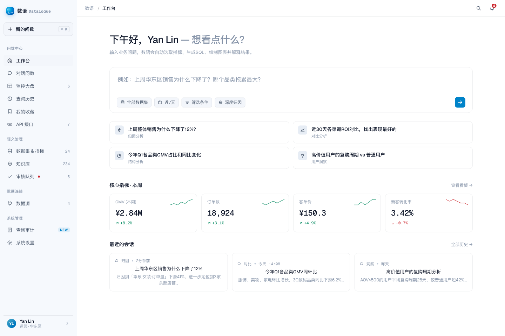

### 2. 对话问数中心

这个功能解决的是“业务用户不会 SQL，但需要直接获得数据答案”的问题。传统方式通常需要找数据人员写 SQL 或配置报表，响应慢，也不适合临时追问。

设计思路是把自然语言问数作为第一入口：用户输入业务问题，系统在后台完成数据集选择、时间范围处理、Agent 推理、SQL 生成、执行和解释。前端接入 assistant-ui，保留最近对话、草稿新对话、历史回放、数据集选择、时间范围选择和推理过程入口，保证用户不是在一次性表单里提问，而是在持续对话里分析问题。

当前效果是 `/chat` 页面已经成为数语的主入口。用户可以从这里提出问题，也可以回到历史会话继续追问。最近修复的新对话草稿机制还避免了“只点击新对话但没发送消息就污染数据库”的问题。

对应截图：对话问数中心截图展示了最近对话、自然语言输入框、数据集选择、时间范围和推理过程入口。

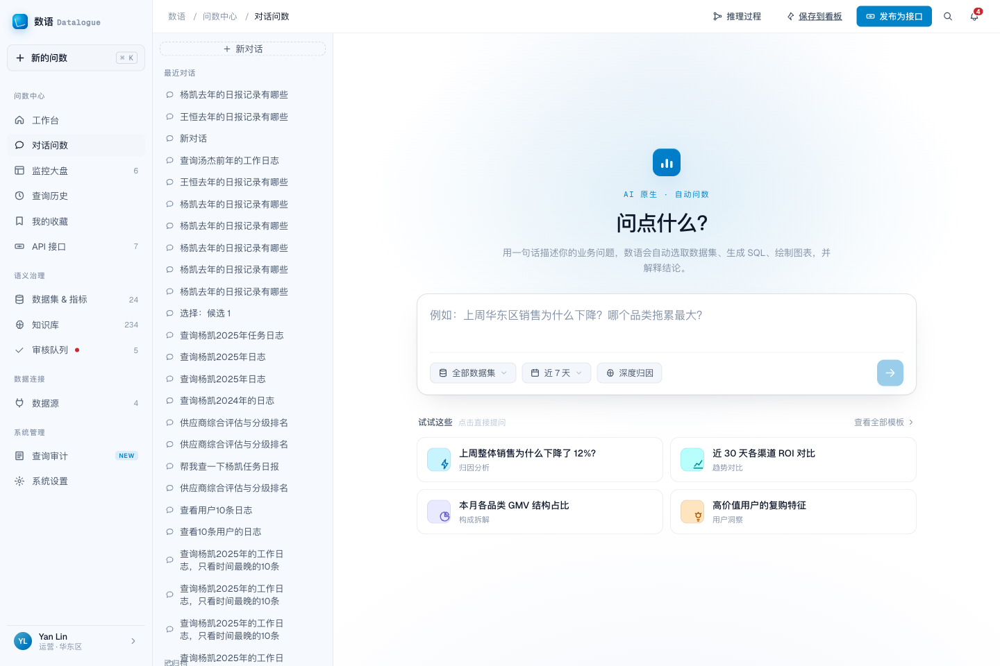

### 3. 数据源接入与 Schema 同步

这个功能解决的是“问数必须知道真实数据从哪里来”的问题。没有稳定的数据源连接和 Schema 同步，模型只能根据模糊描述猜字段，最终很容易生成不可执行的 SQL。

设计思路是把数据源作为底座能力：先管理连接信息，再做连接测试、Schema 读取、DDL 同步和表字段入库。后续语义数据集、字段标注、SQL 生成和查询执行都基于这层真实元数据展开。这样问数链路不是直接让模型凭空拼 SQL，而是始终围绕已接入、已同步、可治理的数据结构工作。

当前效果是系统已经具备数据源管理和 Schema/DDL 同步入口，能够把物理数据结构转化为数语内部可治理的元数据。

对应截图：数据源页面展示了数据源资产入口，Schema 页面展示了物理库表结构已经能被同步和查看。

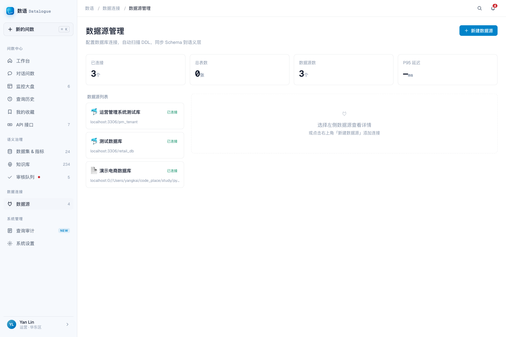

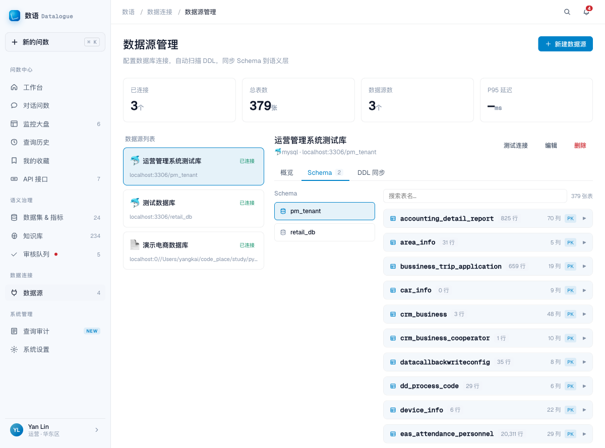

### 4. 语义数据集

这个功能解决的是“业务问题和物理表结构之间有语义鸿沟”的问题。用户问的是“供应商表现”“项目进展”“销售下降原因”，而数据库里通常是表名、字段名、编码和值域，二者无法直接对应。

设计思路是用语义数据集作为业务主题边界。一个数据集绑定一组源表，并在这个边界内维护字段说明、指标、维度、业务术语、分析蓝图、权限、版本和 Manifest。这样每个数据集都可以表达“我能回答什么问题、基于哪些表回答、哪些字段代表什么业务含义”。

当前效果是数据集工作台已经把数据表、字段标注、指标、维度、分析蓝图、语义验证、权限和版本历史聚合在一起，为后续准确问数提供语义基础。

对应截图：数据集表资产页展示了一个业务数据集下已选择和治理的数据表，这是语义数据集的基础边界。

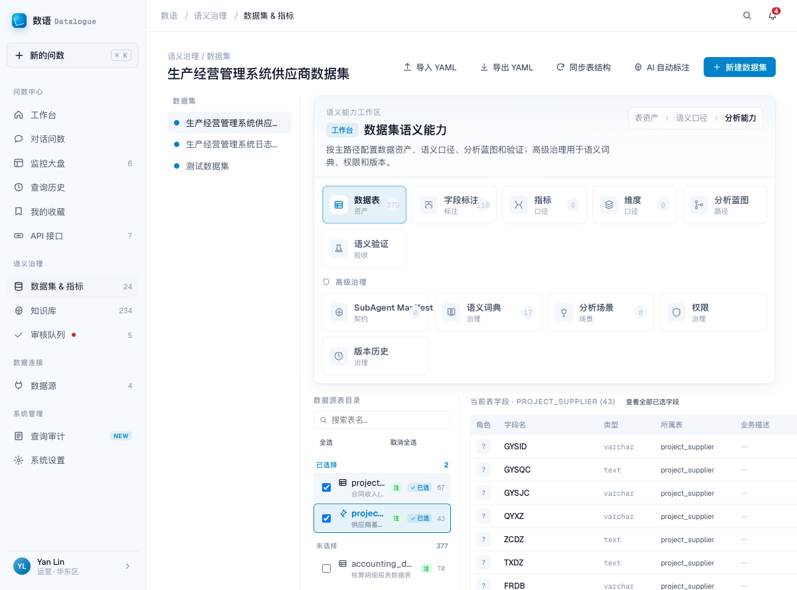

### 5. 字段标注与业务语义补充

这个功能解决的是“数据库字段名对业务用户和模型都不友好”的问题。很多字段是缩写、编码或历史命名，例如用户看不懂，模型也很难稳定判断字段含义。

设计思路是提供 AI 辅助标注和人工确认两层机制。AI 可以先生成字段描述、语义角色和候选解释，人工再确认或覆盖。系统在问数时优先使用有效描述和人工确认后的语义角色，降低模型误解字段的概率。

当前效果是字段标注已经成为数据集治理的一部分。它不是简单写备注，而是把物理字段转成问数链路能使用的语义上下文。

对应截图：字段标注页展示了字段说明和标注工作区，对应“把物理字段转成业务语义”的治理动作。

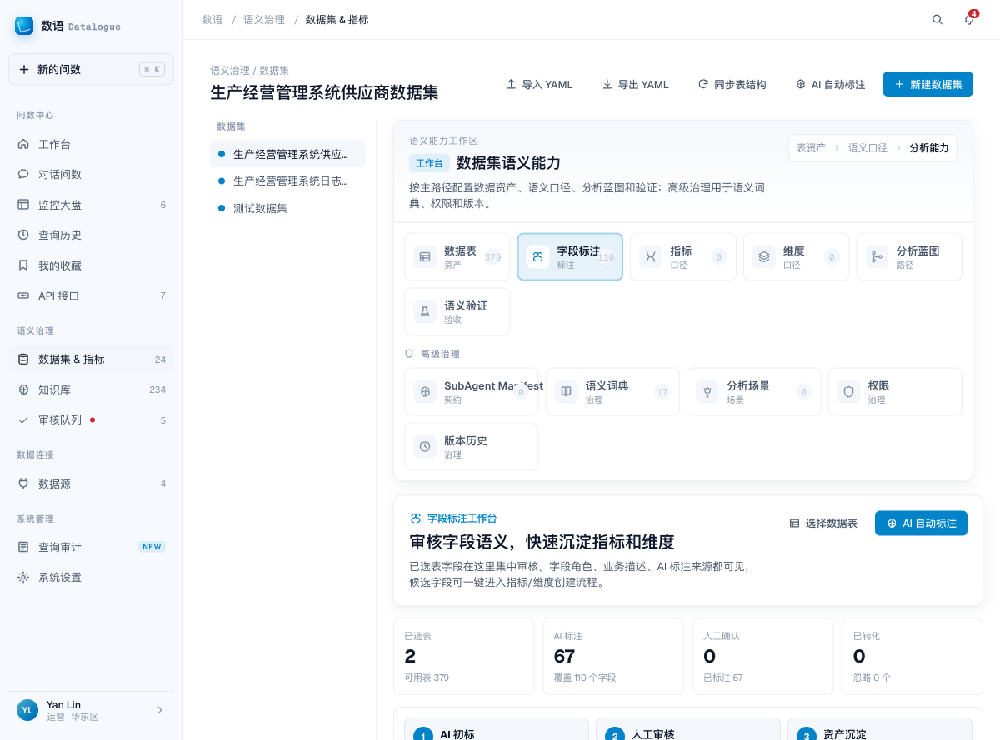

### 6. 指标、维度和业务术语治理

这个功能解决的是“同一个业务词在不同人、不同表里含义不一致”的问题。例如“金额”“销量”“项目状态”“部门”这些词，如果没有统一定义，问数结果就会随模型理解波动。

设计思路是把指标、维度和术语做成独立治理资产。指标描述可计算对象，维度描述分析切片，业务术语负责把用户自然语言里的词映射到系统可理解的含义。它们共同为 QueryGraph 和 SubAgent Planner 提供稳定语义锚点。

当前效果是数据集页面已经具备指标、维度、术语等治理入口。后续只要持续补充真实业务定义，系统就能减少临场猜测，更多依赖确定资产回答问题。

对应截图：指标、维度和语义词典三个页面分别对应可计算口径、分析切片和业务词汇归一化。

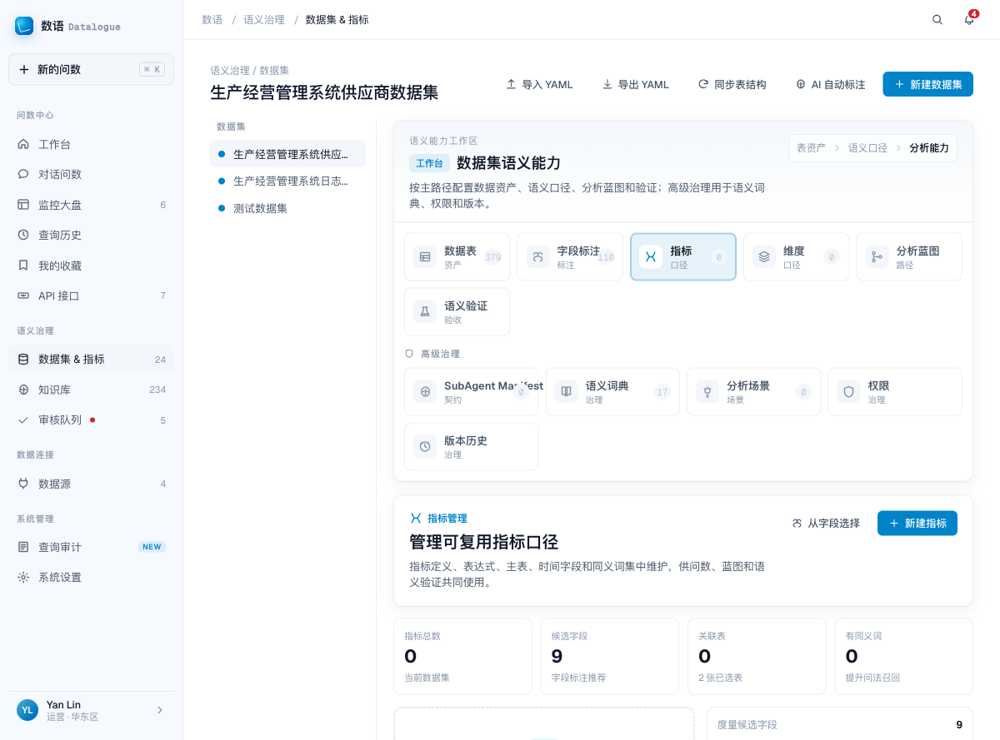

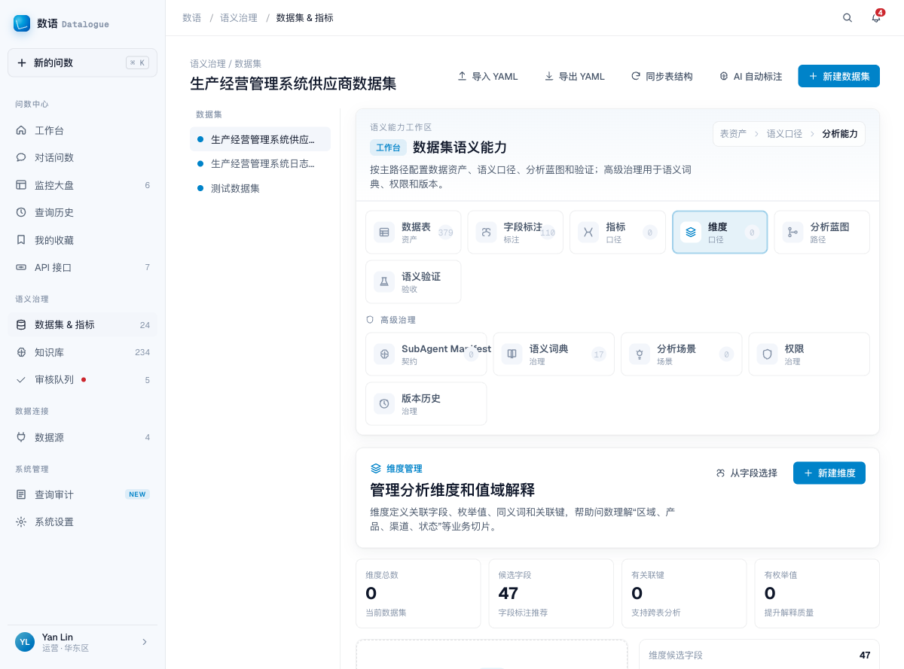

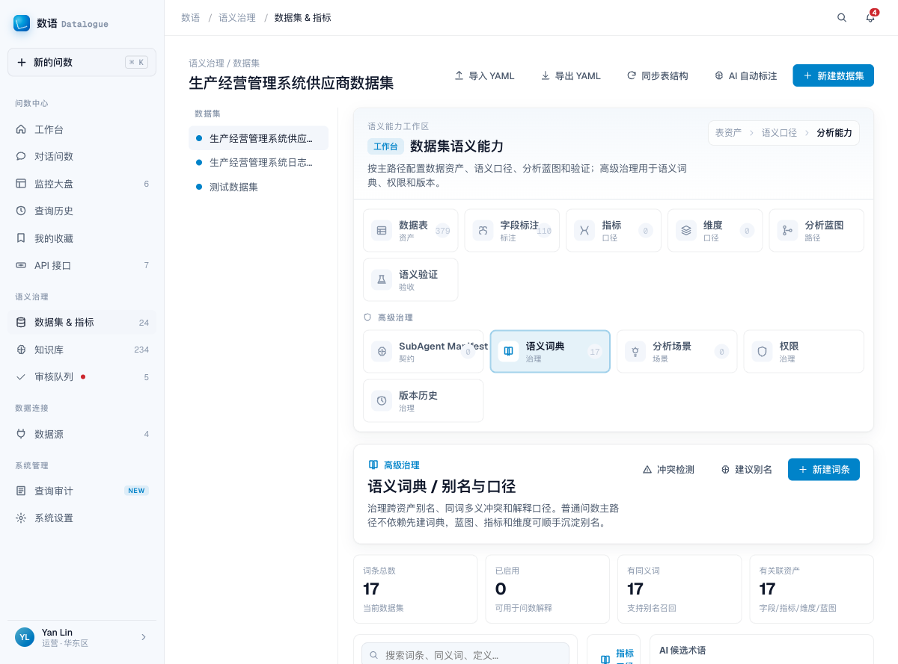

### 7. 分析蓝图

这个功能解决的是“复杂分析每次都从零推理成本高、稳定性差”的问题。有些业务问题不是简单查一条 SQL，而是固定分析流程，例如先筛选对象，再分组聚合，再做对比或解释。如果完全依赖模型临时规划，结果不稳定。

设计思路是把高频分析路径沉淀为分析蓝图。蓝图可以表达一个可复用的分析套路，后续用户提到类似问题时，系统可以优先复用蓝图，而不是每次重新猜分析步骤。这样既提升稳定性，也让业务专家可以把经验固化进系统。

当前效果是数据集工作台已经包含分析蓝图管理和详情视图。它为“从聊天问答走向可复用分析能力”打下了基础。

对应截图：分析蓝图页和蓝图详情页展示了高频分析路径的管理入口和结构化详情。

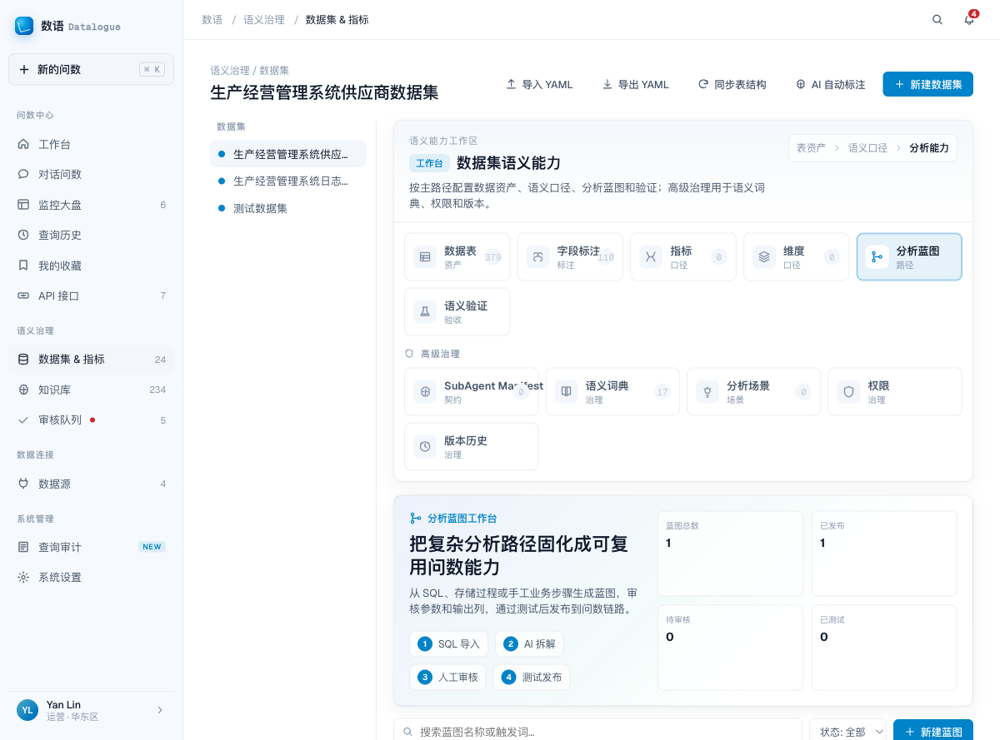

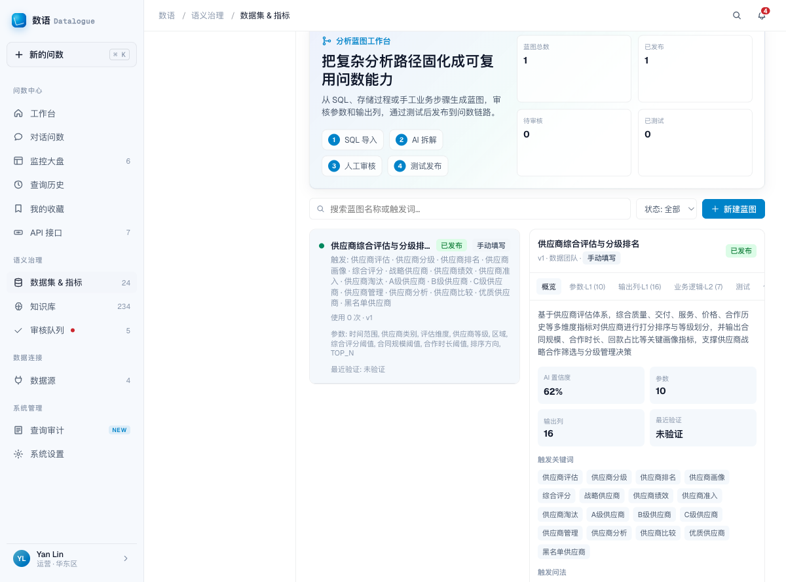

### 8. 语义验证用例

这个功能解决的是“数据资产改了以后，不知道问数能力有没有退化”的问题。语义资产、字段说明、Manifest 或 Prompt 变化后，如果没有验证集，很难判断系统是不是仍能正确回答关键问题。

设计思路是为数据集建立语义验证用例，用真实业务问题作为回归对象。每次数据集治理或链路调整后，可以用这些问题检查系统是否仍能路由到正确数据集、选中正确资产、生成合理 SQL 并给出可解释答案。

当前效果是系统已经具备语义验证入口，后续重点是为核心数据集补充足够真实的验证问题。

对应截图：语义验证页对应 validation case 的维护入口，用于后续做数据集能力回归。

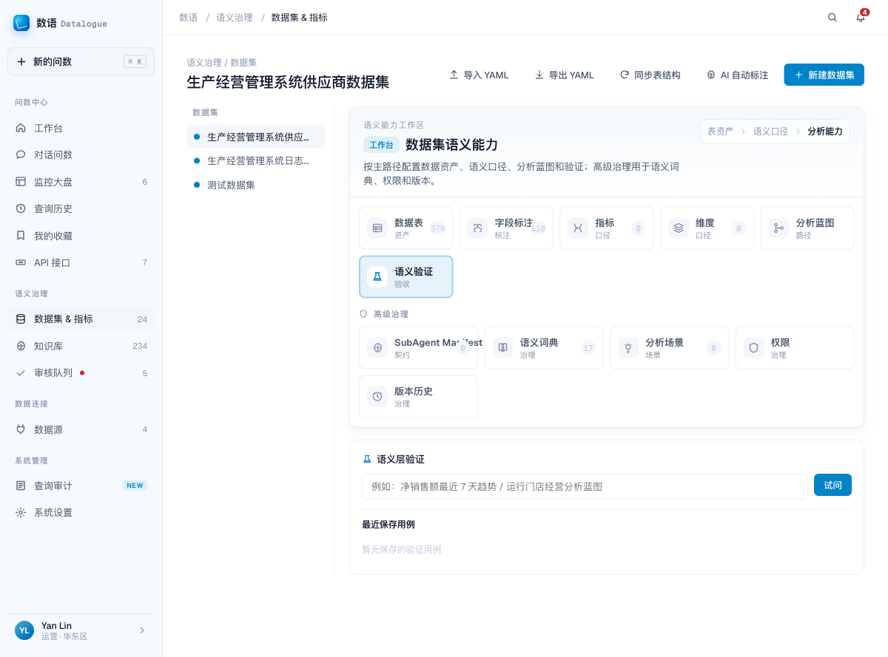

### 9. LeadAgent 控制面

这个功能解决的是“用户一句话进来以后，系统先要判断该不该答、交给谁答”的问题。如果没有控制面，所有问题都会直接进入 SQL 生成，容易出现选错数据集、越权回答、低置信硬答等风险。

设计思路是让 LeadAgent 只做控制面，不直接生成 SQL，也不直接读取字段级资产。它负责理解用户问题、处理时间和上下文、检查 schema 状态、根据 Manifest 做路由评分、识别是否需要澄清，并把符合条件的问题交给 Dataset SubAgent。

当前效果是 LeadAgent 已经承担问数入口的调度角色。这样系统把“选数据集、判断边界、决定是否继续执行”放在前置环节，而不是等 SQL 失败后再补救。

对应截图：完整执行链路图中 LeadAgent 调度层展示了用户提问后先进入控制面，再进入 QueryGraph 或澄清分支的设计。

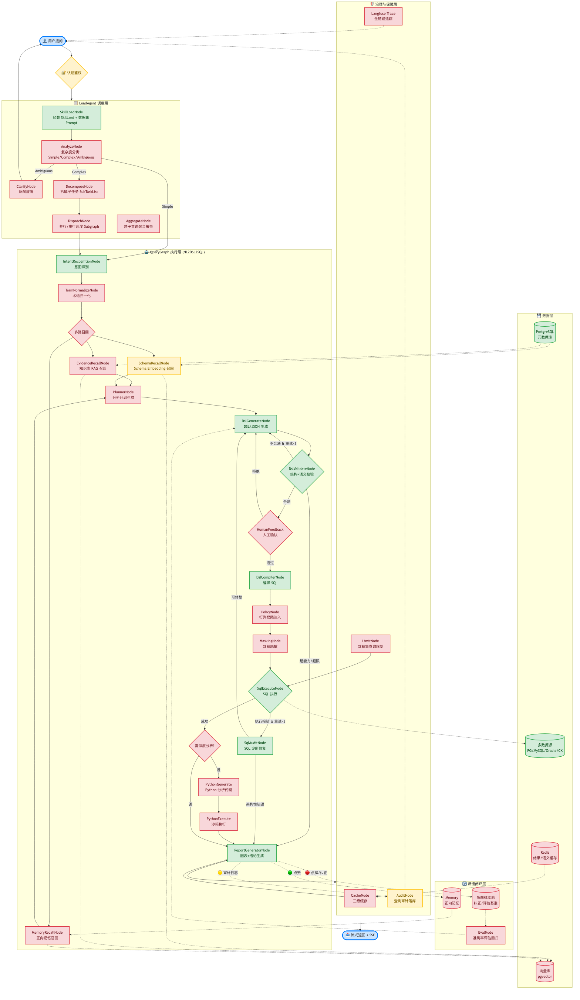

### 10. Dataset SubAgent

这个功能解决的是“不同数据集能力边界不同，不能用一个大模型链路混着答所有问题”的问题。每个数据集有自己的表、字段、术语、指标、蓝图和 Manifest，应该在独立上下文中执行。

设计思路是为每个数据集提供 Dataset SubAgent。它接收 LeadAgent 的路由结果，在数据集内部完成候选资产召回、查询规划、资产详情补充、蓝图执行或 QueryGraph 调用，并最终汇总结果。它还会在执行前再次检查 Manifest，防止未来远端 runner 或缓存路径绕过 LeadAgent 门禁。

当前效果是 Dataset SubAgent 已经成为数据面门面，承接数据集内问数执行，也为后续跨进程、远端执行或 A2A runner 预留边界。

对应截图：SubAgent Manifest 页面展示了每个数据集的能力契约，完整执行链路图展示了 Dataset SubAgent 承接数据集内执行。

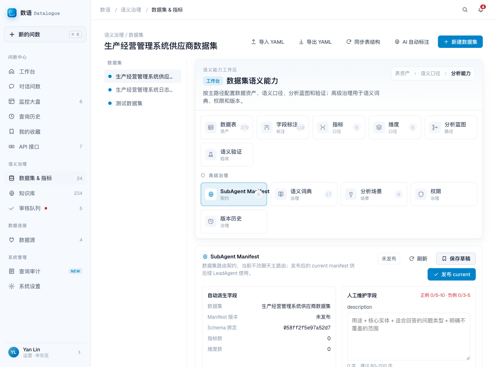

### 11. QueryGraph 执行链路

这个功能解决的是“自然语言到最终答案之间步骤太多，不能黑盒处理”的问题。一个数据问题通常要经历意图识别、术语归一、Schema 召回、DSL 生成、SQL 编译、SQL 执行、错误诊断、结果解释等步骤，任何一步错了都需要能定位。

设计思路是用 LangGraph/QueryGraph 把执行过程拆成节点。每个节点负责一个明确职责，节点之间传递结构化状态。这样系统可以知道当前失败发生在字段召回、DSL 校验、SQL 编译、执行超时还是报告生成，而不是只得到一个“回答失败”。

当前效果是完整执行链路已经形成，并且可以通过 trace 和日志观察关键节点。它是后续做质量优化和稳定性排障的基础。

对应截图：完整执行链路图展示了 QueryGraph 内部从意图识别、召回、DSL、SQL 到报告生成的节点拆分。

### 12. DSL 优先的 SQL 生成

这个功能解决的是“直接让模型写 SQL 不可控”的问题。模型直接输出 SQL 时，字段可能不存在、过滤条件可能错误、方言可能不匹配，审计和修复也困难。

设计思路是先生成结构化 DSL，再由系统编译为 SQL。DSL 可以承载指标、维度、字段、过滤条件、排序、限制条数等结构化信息，也方便做校验、只读保护和方言适配。SQL 不是模型自由发挥的文本，而是由可检查的中间表示生成。

当前效果是问数链路已经以 DSL/SQL 分层为主线。后续即使替换模型，也能保持较稳定的执行契约。

对应截图：查询审计页用于回看问数链路里的 SQL、输入输出和执行状态，承接 DSL/SQL 生成后的可复核结果。

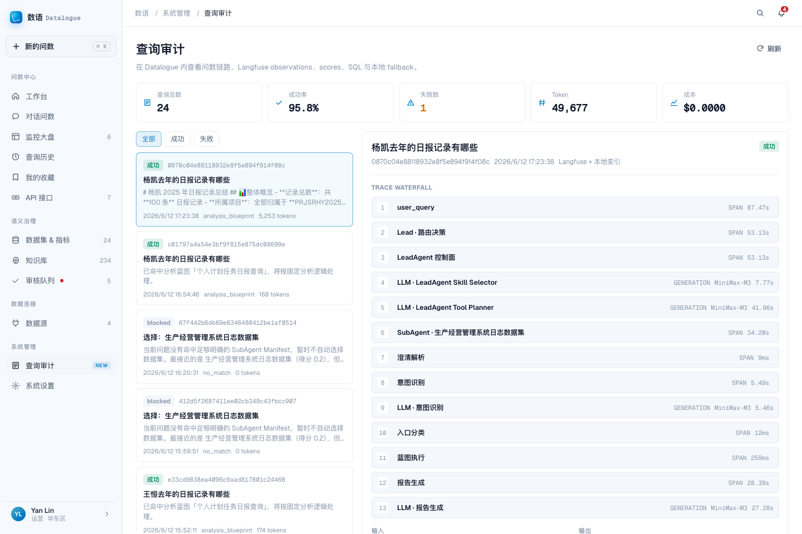

### 13. SQL 诊断和修复

这个功能解决的是“真实数据库执行失败后不能只告诉用户失败”的问题。SQL 失败可能来自字段名错误、方言差异、权限限制、数据源异常、超时或模型理解偏差，如果没有诊断，用户无法知道该改问法还是该补治理资产。

设计思路是在 SQL 执行失败后进入诊断路径，结合本地错误分类和 LLM 审计判断失败原因。可修复的问题尝试修复重试，不可修复的问题返回明确原因，并把错误写入审计和 trace。

当前效果是系统已经具备 SQL 诊断链路。下一步需要用更多真实问题继续补充错误分类和用户侧解释。

对应截图：查询审计页是 SQL 成功、失败、诊断和错误回看的产品入口，后续 SQL 失败闭环会继续沉淀到这里。

### 14. 多轮上下文

这个功能解决的是“用户追问时不想重复说完整条件”的问题。例如第一轮问某个部门，第二轮说“那去年呢”，系统必须知道“那”指上一轮对象和过滤条件，而不能只看当前一句话。

设计思路是使用 ConversationState 保存结构化会话状态，包括 active dataset、pending clarification、subagent capsules、turn index、上一轮成功任务等。多轮不是简单拼历史聊天文本，而是把上一轮确认过的过滤、数据集、任务摘要和结果引用压缩成可复用状态。

当前效果是系统已经具备多轮状态写入和回放基础。近期还增强了多轮状态排查日志，用于区分状态没写入、没回放，还是 planner 没消费结构化信号。

对应截图：查询历史和对话问数中心分别展示了多轮会话的回看入口和继续追问入口。

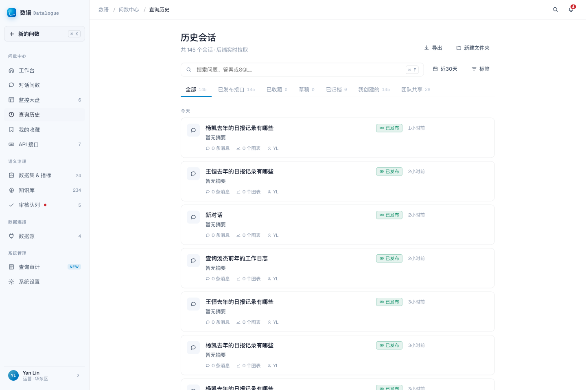

### 15. QueryArtifact 结果产物

这个功能解决的是“长结果、SQL、报告和中间产物不能都塞回 Prompt”的问题。如果每轮都把完整结果放进上下文，token 成本高，也容易污染后续推理。

设计思路是把查询结果、SQL、报告等内容作为 Artifact 持久化，后续多轮只传递轻量引用和摘要。需要展开时再按 artifact id 读取。这样既保留可回放能力，也控制上下文规模。

当前效果是 `query_artifact` 和 ArtifactStore 兜底链路已经打通，支持结果引用、多轮承接和历史回放。

对应截图：查询历史页和查询审计页共同承接结果产物回放，前者面向用户历史，后者面向执行证据。

### 16. SubAgent Manifest 治理面板

这个功能解决的是“数据集到底能回答什么问题，需要有明确契约”的问题。如果只靠 Prompt 描述，系统很难稳定判断某个问题是否属于某个数据集，也很难在数据结构变化后提醒复核。

设计思路是为每个数据集维护 SubAgent Manifest。Manifest 包含自动派生字段和人工维护字段，用来说明数据集用途、适合问题、反例、绑定 schema 版本、权限范围和质量状态。页面支持保存草稿、Lint 校验、发布 current 和版本查看。

当前效果是 Manifest 已经从后端配置变成可操作的治理页面。业务人员和管理员可以通过页面维护数据集能力边界。

对应截图：SubAgent Manifest 页展示了自动派生字段、人工维护字段、Lint、草稿保存和发布 current 的治理面。

### 17. Manifest fail-closed 执行门禁

这个功能解决的是“系统不确定时不能硬答”的问题。企业数据问答里，错误答案、越权答案和基于过期 schema 的答案都比拒答更危险。

设计思路是执行前采用 fail-closed 策略：current Manifest 缺失、schema stale、review 状态不正确、权限不允许、quality failed 或路由置信度过低时，都直接阻断执行。阻断不是异常崩溃，而是返回明确的业务状态，让用户知道当前需要治理或复核。

当前效果是门禁已经落到 LeadAgent 和 Dataset SubAgent 两层。它让系统具备“能答才答，不能答就说明原因”的企业级边界。

对应截图：Manifest 页中的发布状态、Lint 和能力契约字段，是执行前 fail-closed 判断的可见治理面。

### 18. Manifest 回滚

这个功能解决的是“治理资产误发布后需要恢复”的问题。Manifest 影响路由和执行门禁，一旦发布错误，可能导致正确问题被拒答或错误问题被放行。

设计思路是保留 Manifest 版本历史，并提供 rollback API。这样数据集能力声明可以像代码版本一样回退，不需要手工重填。

当前效果是 Manifest 治理已经包含版本和回滚能力，降低了线上治理操作风险。

对应截图：版本历史页承接数据集治理资产的历史回看，Manifest 回滚属于同一类“治理版本可恢复”能力。

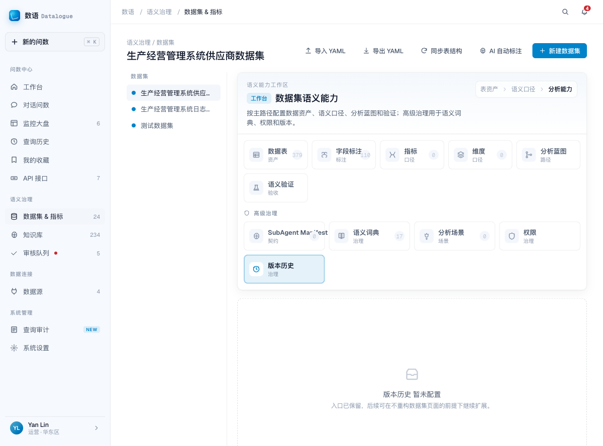

### 19. Langfuse 全链路 Trace

这个功能解决的是“模型链路出问题时看不清内部过程”的问题。用户只看到最终回答，但研发和管理员需要知道 LeadAgent 怎么路由、SubAgent 怎么规划、LLM 输入输出是什么、哪一步耗时或失败。

设计思路是封装 DatalogueTracer，把 root trace、LeadAgent、SubAgent、LangGraph 节点、LLM generation、SQL 诊断等都记录到 Langfuse。即使 Langfuse 不可用，也要降级为 no-op，不影响主链路执行。

当前效果是核心问数链路已经有 trace 观测基础，能支撑后续质量分析、成本分析和错误定位。

对应截图：查询审计页是产品内 trace 回看的入口，完整执行链路图展示了 Langfuse Trace 在全链路中的观测位置。

### 20. 本地查询审计

这个功能解决的是“不能完全依赖外部可观测系统”的问题。Langfuse 适合看详细 trace，但产品内也需要给管理员一个查询审计入口，用于看历史问题、SQL、状态、错误和成本质量概览。

设计思路是把关键 trace 元数据写入本地 `ObservabilityTraceIndex`，再由查询审计页面展示。这样产品内部有自己的审计索引，Langfuse 则用于更细的链路排查。

当前效果是系统已经具备查询审计入口和本地 trace index，为管理侧复核和问题定位提供产品化界面。

对应截图：查询审计页展示了本地审计入口，用于回看问数链路、SQL、错误和状态。

### 21. `/chat/stream` checkpoint 日志

这个功能解决的是“页面结果、后端日志、SSE payload 和 Langfuse 可能对不上”的排障问题。智能问数链路长，单看其中一层很容易误判。

设计思路是在 `/chat/stream` 主链路上增加统一 checkpoint 日志，覆盖请求入口、多轮包装、会话准备、trace 创建、gateway 分类、LeadAgent 路由、早退分支、SubAgent 候选资产、query plan、result、Graph 完成、助手消息落库和 final payload。每个日志都带上 route、planner、fallback、SQL、answer 长度等摘要字段。

当前效果是后续排查时可以快速对齐三类事实：后端实际走到哪一步、SSE 最终发了什么、Langfuse 记录了什么。

对应截图：查询审计页承接 checkpoint 日志对齐后的最终排障入口，完整执行链路图展示这些日志点覆盖的主链路范围。

### 22. Prompt 管理与 Langfuse 同步

这个功能解决的是“Prompt 改了以后运行期到底用哪份不清楚”的问题。只在代码里改 Prompt，运行期可能仍用远端版本；只改远端，代码 fallback 又会漂移。

设计思路是保留本地 Prompt 作为 fallback，同时将关键 Prompt 同步到 Langfuse Prompt Management，并通过版本和 production label 管理运行期 Prompt。这样既能在线调整，也能在代码里保留可追踪基线。

当前效果是 LeadAgent 两阶段 Planner Prompt 已完成去重，并同步到 Langfuse production 版本，减少了本地和远端不一致风险。

对应截图：LLM 模型设置页展示了运行期模型配置入口；Prompt 版本本身在 Langfuse 管理，文档中用该设置页对应“模型与提示词运行配置”这一类能力。

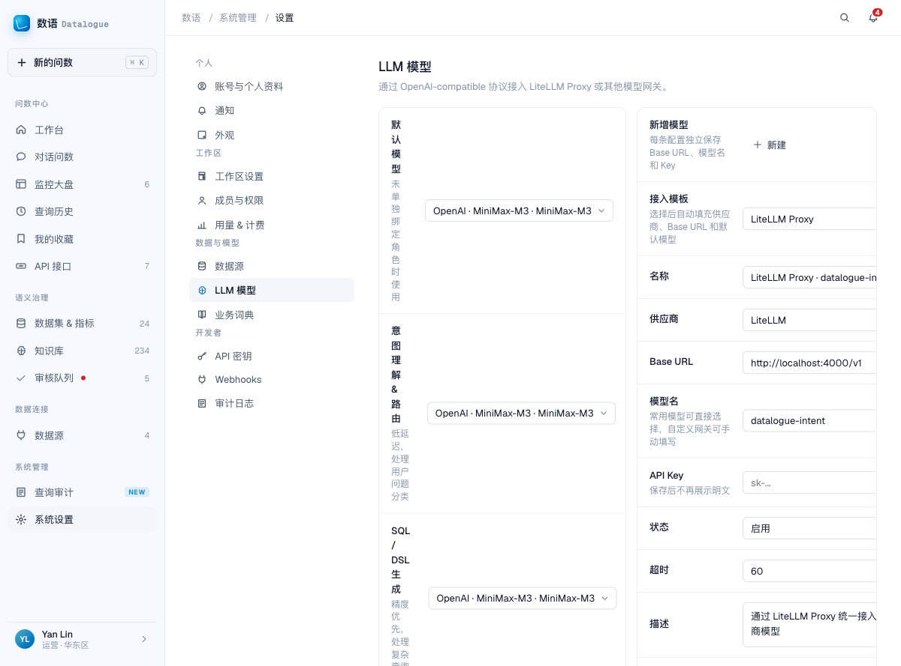

### 23. LiteLLM 多模型统一调用

这个功能解决的是“不同模型供应商接口不一致，难以按任务角色切换模型”的问题。问数链路里不同角色对模型要求不同，例如路由、规划、报告生成、诊断可能需要不同成本和能力组合。

设计思路是通过 LiteLLM/OpenAI-compatible 方式统一模型调用，并优先读取数据库中的角色级模型配置；未配置时再回退 `.env`。同时对 Qwen、Claude 等模型按配置关闭 thinking 输出，避免中间思考泄露到用户界面。

当前效果是系统已经具备多模型配置基础，可以在系统设置里维护 LLM 模型，为后续成本控制、质量对比和模型替换打下基础。

对应截图：LLM 模型设置页展示了模型配置、角色绑定和运行期模型治理入口。

### 24. 本地基础设施收敛

这个功能解决的是“本地开发和验证环境过于复杂”的问题。系统 PostgreSQL、Langfuse PostgreSQL、Redis、前后端服务如果各自分散，恢复和排障成本会很高。

设计思路是把本地 Docker Compose 中系统 PostgreSQL 与 Langfuse PostgreSQL 收敛为单实例多库，减少容器和卷的复杂度，同时保留 Langfuse、系统库和业务数据的隔离。

当前效果是本地环境已经完成 PostgreSQL 收敛，Langfuse public 表数量和页面健康状态通过验证。本地调试时更容易恢复数据库和对齐 trace。

对应截图：完整执行链路图展示了系统库、业务数据源、Redis、Trace 等基础设施在问数链路中的位置。

### 25. 数据库注释治理

这个功能解决的是“数据库表字段可读性差，后续维护难”的问题。智能问数项目高度依赖元数据，如果数据库自身缺少中文注释，研发、管理员和后续文档都会反复猜含义。

设计思路是通过 Alembic 迁移补齐表和字段中文注释，而不是只写在文档里。注释落到真实数据库后，DB 工具、数据字典和后续审计都能直接读取。

当前效果是本地 PostgreSQL 已抽查确认表注释和字段注释缺失数为 0，为后续长期维护降低了认知成本。

对应截图：数据源 Schema 页面展示了表结构和字段治理入口，数据库注释补齐后可以支撑这类元数据可读性。

### 26. Hermes Skill 只读问数预览

这个功能解决的是“外部 Agent 想用数语数据资产，但不能直接绕过安全边界执行任意 SQL”的问题。

设计思路是新增只读 SQL preview 接口，按 dataset 绑定 datasource、已选 source tables、SQL 只读守卫和 query constraints 执行预览，不写 conversation、message 或 trace，也不进入完整 LeadAgent/LangGraph 链路。Hermes Skill 只负责读取资产、规划查询和调用 preview，危险 SQL 由后端 Guard 拦截。

当前效果是 Hermes Skill 已支持 `plan-query` 和 `execute-sql` 的轻量只读流程，并验证了正常 SELECT 可返回结果、DELETE 会被拦截。它为后续外部 Agent 安全集成提供了第一版边界。

对应截图：API 总览和示例页对应外部调用能力的产品承接面，Hermes Skill 当前走的是后端只读 preview，但目标同样是让外部系统安全复用数语能力。

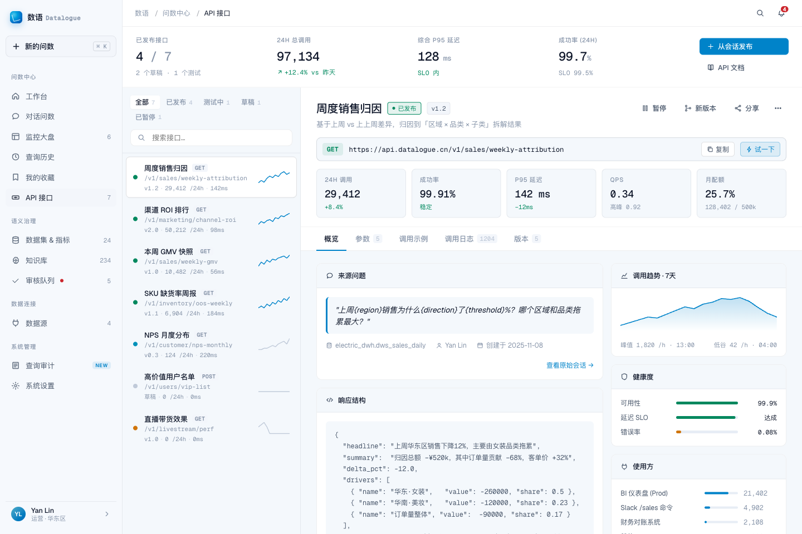

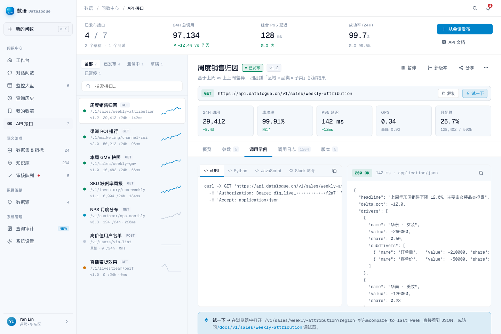

### 27. 项目介绍和交付材料

这个功能解决的是“项目做了很多技术能力，但非研发读者看不懂价值和进度”的问题。智能问数项目如果只有代码和 trace，很难向业务方、项目负责人或外部客户说明成果。

设计思路是把交付材料分层：用户版整体介绍说明项目做什么、能解决什么问题、怎么使用；当前这份工作总结说明已经完成什么、为什么这么做、下一步怎么推进；截图和链路图用于证明能力已经有页面和流程承接。

当前效果是项目已经具备用户版介绍手册、用户手册截图、系统设计文档和当前阶段总结文档。后续可以继续转成 PPT、Word 或验收清单。

对应截图：用户手册截图资产覆盖工作台、问数、治理、审计、API 和设置页面；当前文档复用这些截图说明阶段成果。

## 四、当前工作进度判断

从项目成熟度看，当前处在“核心链路可用、治理和审计已成型、真实链路还需要继续打磨稳定性”的阶段。

已经比较稳的部分：

- 产品页面骨架和主要业务模块已经齐全。
- 数据源、数据集、语义资产、Manifest、审计、设置等治理面已经有可见入口。
- LeadAgent / Dataset SubAgent / QueryGraph 的分层方向清晰。
- Manifest fail-closed、SQL 只读守卫、trace 审计等安全和可追溯机制已经落地。
- 项目记忆、文档、截图和交付材料已经开始体系化。

仍需重点打磨的部分：

- 真实问数链路对不同模型返回、空响应、非法 JSON、复杂字段召回的鲁棒性仍要继续增强。
- 端到端验收要继续以页面、Network final payload、后端日志和 Langfuse trace 四方一致为准。
- 语义资产质量需要继续补充真实业务指标、维度、术语、蓝图和验证用例。
- API 化和 Hermes 只读问数预览还处于第一版，需要明确更多安全边界和复杂问题处理策略。

## 五、下步工作计划

### P0：收口真实问数链路稳定性

目标：让用户在 `/chat` 页面提出典型业务问题时，能够稳定完成“路由、规划、SQL、执行、解释、落库、审计”全链路。

**典型问题集验收**

这项工作要解决的是“单个接口或单个单测通过，不代表真实用户问题能稳定跑通”的问题。建议选择 10-20 个真实业务问题，覆盖明细查询、聚合统计、时间过滤、人员/部门过滤、蓝图执行和多轮追问。

验收时不能只看页面有没有回答，而要同时核对页面 answer、SSE final payload、后端 checkpoint 日志和 Langfuse trace。四方一致，才说明真实链路真正打通。

**Planner 空响应治理**

这项工作要解决的是“模型返回空内容、非法 JSON 或结构不合规时，系统不能直接误拒”的问题。近期已经补了金额聚合类兜底，但还需要继续覆盖更多真实问法和模型异常形态。

设计上应继续区分三类情况：模型完全空响应、模型输出了内容但不符合 QueryPlan 契约、业务资产不足确实不能回答。前两类要尽量走规则兜底或明确诊断，第三类才应该进入拒答或治理提示。

**SQL 失败闭环**

这项工作要解决的是“SQL 失败后用户不知道该怎么办”的问题。后续要把 SQL 编译错误、只读守卫拦截、方言错误、字段缺失、数据源连接失败、执行超时等情况分类呈现。

理想效果是查询审计页能看到失败发生在哪一层，用户侧能看到可理解的解释，治理侧能知道是补字段说明、补指标维度、修蓝图，还是处理数据源问题。

**多轮追问回归**

这项工作要解决的是“第一轮能答，第二轮追问断链”的问题。多轮追问要验证上一轮过滤条件、时间范围、数据集、结果 artifact 和用户澄清是否能被正确继承。

验收建议至少连续 3-5 轮，覆盖“换时间”“继续看某个人/部门”“基于上一轮结果排序/筛选”“从聚合下钻明细”等场景。

### P1：补强语义资产和治理质量

目标：让系统回答得准，不依赖模型临场猜字段。

**业务指标补齐**

这项工作要解决的是“模型只能看到字段，缺少业务口径”的问题。核心数据集需要补充真实指标、维度、术语和样例问题，让系统知道哪些字段代表金额、数量、状态、部门、时间和业务对象。

验收方式是数据集页面能看到这些资产，Manifest Lint 能通过，并且典型问题能命中这些资产，而不是只依赖字段名猜测。

**语义验证用例**

这项工作要解决的是“治理资产变更后无法判断能力是否退化”的问题。每个核心数据集都应该沉淀一批高频问题作为 validation case。

设计上，这些用例不只是问句集合，还应该包含期望路由、关键字段/指标、可接受 SQL 形态或结果检查方式。后续每次改 Prompt、Manifest 或语义资产时，都可以批量回归。

**Manifest 运营规则**

这项工作要解决的是“Manifest 有页面，但谁维护、谁审核、何时发布还不清楚”的问题。Manifest 是执行契约，不能只由研发临时维护。

建议明确数据集负责人、审核人、发布 current 的条件、schema 变更后的复核流程、质量失败时的处理方式和回滚策略。最终形成页面操作流程和管理规则。

**蓝图场景沉淀**

这项工作要解决的是“高频分析每次都重新规划”的问题。可以优先把日报、供应商分析、项目进展分析、销售趋势、异常归因等常见场景沉淀成蓝图。

验收方式不是蓝图页面里有记录，而是用户提出相近问题时，问数链路能优先识别并复用蓝图，生成更稳定的分析过程。

### P1：提升用户侧可解释性

目标：让业务用户不仅看到答案，也能理解答案从哪里来。

**推理过程面板优化**

这项工作要解决的是“用户看到了答案，但不知道系统为什么这么答”的问题。推理过程面板需要展示对业务用户有意义的信息，例如选中了哪个数据集、用了哪些字段、执行了什么 SQL、是否发生诊断和重试。

设计上要过滤内部噪声，不把所有 trace 原样丢给用户，而是把技术步骤翻译成可理解的执行过程。

**结果解释模板**

这项工作要解决的是“不同类型结果用同一种回答格式，读起来不够清楚”的问题。明细、聚合、趋势、对比、排行、异常归因应该有不同解释结构。

后续可以为不同 query intent 设计解释模板，让答案包含关键结论、数据范围、口径说明、限制条件和必要的下一步建议。

**低置信提示**

这项工作要解决的是“系统不确定却说得像确定答案”的问题。当数据资产不足、Manifest 低置信、字段缺失、路由不明确或 SQL 诊断失败时，应该明确告诉用户原因。

设计原则是把限制说清楚：是当前数据集不覆盖、字段缺少业务说明、问题需要澄清，还是系统暂时无法安全执行。这样用户知道下一步是换问法、补治理资产还是联系管理员。

### P2：推进 API 化和外部 Agent 集成

目标：把已经稳定的问数能力沉淀成可复用资产。

**发布为接口闭环**

这项工作要解决的是“高频问数问题不能每次都靠人工打开聊天页面”的问题。对于稳定问题，应支持发布成 API，供看板、自动化任务或外部系统调用。

设计上需要明确接口参数、示例、版本、调用日志、权限和失败返回。只有这样，问数能力才能从交互式产品能力变成可集成的数据服务。

**Hermes Skill 增强**

这项工作要解决的是“外部 Agent 可以读资产和执行 preview，但还不是完整问数流程”的问题。后续可以增强 `plan-query`、`describe-dataset`、`execute-sql` 的组合能力，让外部 Agent 在安全边界内完成更多只读分析。

设计上仍然坚持只读和后端 Guard 兜底，不让外部 Agent 绕过数据集边界、已选表范围和 SQL 安全策略。

**权限和限流**

这项工作要解决的是“能力开放后必须控制谁能用、能用多少、能查什么”的问题。API 和外部 Agent 调用都需要权限、频率、超时、审计和危险 SQL 拦截策略。

验收方式是越权访问会被拒绝，危险 SQL 会被拦截，高频调用有记录和限制，管理员可以在审计中看到调用来源和执行结果。

### P2：完善交付材料

目标：让项目能被非研发读者理解和验收。

**截图版用户手册**

这项工作要解决的是“用户知道系统有能力，但不知道具体怎么操作”的问题。现有截图已经比较完整，下一步可以整理成逐步操作手册。

手册应覆盖从数据源接入、数据集治理、Manifest 发布到一次完整问数和查询审计回看，让新用户能按步骤完成一次闭环。

**管理层汇报版**

这项工作要解决的是“阶段成果需要被快速理解和决策”的问题。管理层不需要看代码细节，更需要看项目价值、已完成能力、风险控制、当前边界和下一步计划。

建议输出 8-12 页 PPT，围绕业务问题、解决方案、成果截图、架构思路、阶段计划和风险项展开。

**验收清单**

这项工作要解决的是“验收不能只看技术模块有没有做”的问题。验收清单应该按业务场景组织，例如“接入一个数据源”“治理一个数据集”“发布 Manifest”“问一个业务问题”“追问上一轮结果”“查看审计记录”。

这样项目负责人可以逐项确认真实使用链路，而不是只看到后端接口或页面菜单。

## 六、建议验收口径

后续验收不要只看“接口返回了 200”或“模型回答了文本”，建议统一采用以下口径：

| 验收面 | 要看什么 |
|--------|----------|
| 用户页面 | 用户是否看见正确答案、SQL/图表/推理过程是否清晰 |
| Network/SSE | final payload 里的 answer、sql、step trace、metadata 是否和页面一致 |
| 后端日志 | `/chat/stream` checkpoint 是否显示正确 route、planner、fallback、SQL 和 answer 状态 |
| Langfuse trace | LeadAgent、SubAgent、LLM、QueryGraph observation 是否和后端链路一致 |
| 数据库状态 | conversation、message、conversation_state、query_artifact、trace index 是否写入正确 |
| 治理资产 | 数据集、Manifest、指标、维度、术语、蓝图是否支撑本轮问题 |

这也是当前项目继续推进的关键原则：智能问数的质量要用“真实页面 + 真实链路 + 真实数据 + 可审计证据”验证，而不是只用单测或单个接口响应判断。

## 七、结论

当前数语已经具备一个 AI 原生智能问数平台的主要形态：用户可以从问数中心提问，后台有语义资产和 Manifest 管住能力边界，Agent 链路负责任务拆解和 SQL 执行，审计与 trace 负责复核和排障。

下一阶段最值得投入的是“真实链路稳定性”和“语义资产质量”。前者决定系统能不能稳定跑通，后者决定答案准不准。两者收口后，再把高频能力 API 化、外部 Agent 化和交付材料体系化，项目就能从研发验证进入更正式的业务试用和交付阶段。
